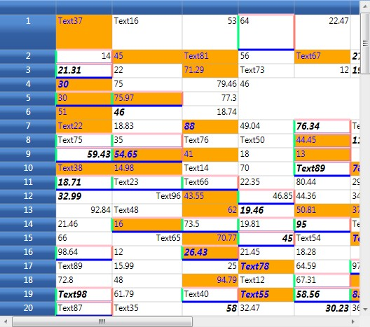
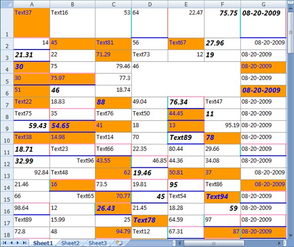
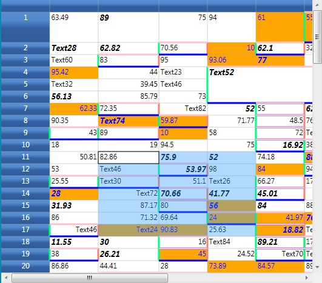
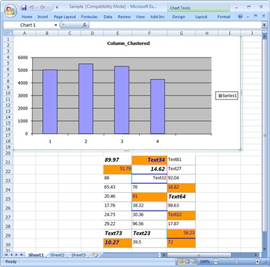
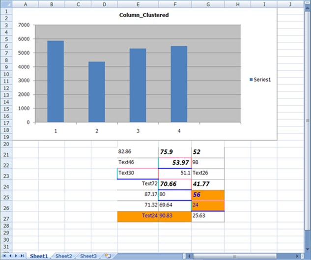

::: {style="DISPLAY: none"}
{#d2h_url_template}{#d2h_package_url style="WIDTH: 0px; DISPLAY: none; HEIGHT: 0px"}
:::

:::: {.d2h_secondary_topic style="PADDING-BOTTOM: 10pt; MARGIN: 0pt; PADDING-LEFT: 0pt; PADDING-RIGHT: 0pt; PADDING-TOP: 0pt"}
##### Features {#features style="tab-stops: 0pt"}

There are three options for exporting a Grid control:

 

[·      ]{style="FONT-FAMILY: Symbol"}Converting the entire content of a grid

[·      ]{style="FONT-FAMILY: Symbol"}Converting a selected content of the grid

[·      ]{style="FONT-FAMILY: Symbol"}Pass the Excel Engine

[]{style="COLOR: #15428b"} 

###### 4.1.9.1.1.1 Entire Content {#entire-content style="tab-stops: 0pt"}

You can convert the entire content of a GridData control to an Excel Spreadsheet. You can also avail the option for specifying the version of the Excel file using the ExcelVersion enum. The version can be one of the following:

 

[·      ]{style="FONT-FAMILY: Symbol"}ExcelVersion.Excel97to2003 

[·      ]{style="FONT-FAMILY: Symbol"}ExcelVersion.Excel2007

 

The following code illustrates the conversion of the entire Grid content to an Excel Spreadsheet:

 

+-------------------------------------------------------------------------------------------------------------------------------------------------------------------------+
| [\[C#\]]{style="FONT-FAMILY: 'Courier New'; COLOR: black"}                                                                                                              |
|                                                                                                                                                                         |
| []{style="FONT-FAMILY: 'Courier New'; COLOR: blue"}                                                                                                                     |
|                                                                                                                                                                         |
| [gridControl.Model.ExportToExcel([@\"Sample.xls\"]{style="COLOR: #a31515"}, [ExcelVersion]{style="COLOR: #2b91af"}.Excel97to2003);]{style="FONT-FAMILY: 'Courier New'"} |
|                                                                                                                                                                         |
| []{style="FONT-FAMILY: 'Courier New'"}                                                                                                                                  |
|                                                                                                                                                                         |
| [(or)]{style="FONT-FAMILY: 'Courier New'"}                                                                                                                              |
|                                                                                                                                                                         |
| []{style="FONT-FAMILY: 'Courier New'"}                                                                                                                                  |
|                                                                                                                                                                         |
| [gridControl.Model.ExportToExcel([@\"Sample.xlsx\"]{style="COLOR: #a31515"}, [ExcelVersion]{style="COLOR: #2b91af"}.Excel2007);]{style="FONT-FAMILY: 'Courier New'"}    |
+-------------------------------------------------------------------------------------------------------------------------------------------------------------------------+

[]{style="COLOR: #15428b"} 

{border="0"}

Figure 125: Grid to be exported

***[]{style="COLOR: #15428b"}*** 

{border="0"}

Figure 126: Exported Grid control content in Excel Spreadsheet

***[]{style="COLOR: #15428b"}*** 

 

The images above show how the entire content of the Grid control is exported to an Excel spreadsheet.

 

###### 4.1.9.1.1.2 Selected Content {#selected-content style="tab-stops: 0pt"}

You can convert a selected content of the grid to the specified range in an Excel spreadsheet. It will be very useful, when you have some data like picture, chart, etc., in your spreadsheet and you want to fill a particular range, for example-the remaining part of the spreadsheet using the Grid cell data.

 

Use-Case Scenario

Consider that you have a chart in a spreadsheet in the range \[A1:I19\] and you wish to populate a part of the Spreadsheet starting from E21, with the selected cell data of Grid control. You can use the following code, to achieve the scenario above mentioned:

[]{style="COLOR: #15428b"} 

+------------------------------------------------------------------------------------------------------------------------------------------------------------------------------------------------------+
| [\[C#\]]{style="FONT-FAMILY: 'Courier New'; COLOR: black"}                                                                                                                                           |
|                                                                                                                                                                                                      |
| []{style="FONT-FAMILY: 'Courier New'; COLOR: blue"}                                                                                                                                                  |
|                                                                                                                                                                                                      |
| [ExcelEngine]{style="FONT-FAMILY: 'Courier New'; COLOR: #2b91af"}[ excelEngine = [new]{style="COLOR: blue"} [ExcelEngine]{style="COLOR: #2b91af"}();]{style="FONT-FAMILY: 'Courier New'"}            |
|                                                                                                                                                                                                      |
| [IApplication]{style="FONT-FAMILY: 'Courier New'; COLOR: #2b91af"}[ application = excelEngine.Excel;]{style="FONT-FAMILY: 'Courier New'"}                                                            |
|                                                                                                                                                                                                      |
| [IWorkbook]{style="FONT-FAMILY: 'Courier New'; COLOR: #2b91af"}[ myWorkbook = excelEngine.Excel.Workbooks.Add();]{style="FONT-FAMILY: 'Courier New'"}                                                |
|                                                                                                                                                                                                      |
| [IWorksheet]{style="FONT-FAMILY: 'Courier New'; COLOR: #2b91af"}[ mySheet = myWorkbook.Worksheets\[1\];]{style="FONT-FAMILY: 'Courier New'"}                                                         |
|                                                                                                                                                                                                      |
| [IChart]{style="FONT-FAMILY: 'Courier New'; COLOR: #2b91af"}[ chartShape = mySheet.Charts.Add();]{style="FONT-FAMILY: 'Courier New'"}                                                                |
|                                                                                                                                                                                                      |
| [IChartSeries]{style="FONT-FAMILY: 'Courier New'; COLOR: #2b91af"}[ series1 = chartShape.Series.Add();]{style="FONT-FAMILY: 'Courier New'"}                                                          |
|                                                                                                                                                                                                      |
| [series1.SerieType = [ExcelChartType]{style="COLOR: #2b91af"}.Column_Clustered;]{style="FONT-FAMILY: 'Courier New'"}                                                                                 |
|                                                                                                                                                                                                      |
| [chartShape.ChartTitle = [\"Column_Clustered\"]{style="COLOR: #a31515"};]{style="FONT-FAMILY: 'Courier New'"}                                                                                        |
|                                                                                                                                                                                                      |
| [series1.Values = mySheet.Range\[[\"B1:B5\"]{style="COLOR: #a31515"}\];]{style="FONT-FAMILY: 'Courier New'"}                                                                                         |
|                                                                                                                                                                                                      |
| [series1.CategoryLabels = mySheet.Range\[[\"A1:A5\"]{style="COLOR: #a31515"}\];]{style="FONT-FAMILY: 'Courier New'"}                                                                                 |
|                                                                                                                                                                                                      |
| [Random]{style="FONT-FAMILY: 'Courier New'; COLOR: #2b91af"}[ r = [new]{style="COLOR: blue"} [Random]{style="COLOR: #2b91af"}();]{style="FONT-FAMILY: 'Courier New'"}                                |
|                                                                                                                                                                                                      |
| [for]{style="FONT-FAMILY: 'Courier New'; COLOR: blue"}[ ([int]{style="COLOR: blue"} i = 1; i \<= 4; i++)]{style="FONT-FAMILY: 'Courier New'"}                                                        |
|                                                                                                                                                                                                      |
| [{]{style="FONT-FAMILY: 'Courier New'"}                                                                                                                                                              |
|                                                                                                                                                                                                      |
| [    mySheet.Range\[i, 1\].Number = i;]{style="FONT-FAMILY: 'Courier New'"}                                                                                                                          |
|                                                                                                                                                                                                      |
| [    mySheet.Range\[i, 2\].Number = r.Next(4000, 6000);]{style="FONT-FAMILY: 'Courier New'"}                                                                                                         |
|                                                                                                                                                                                                      |
| [}]{style="FONT-FAMILY: 'Courier New'"}                                                                                                                                                              |
|                                                                                                                                                                                                      |
| [for]{style="FONT-FAMILY: 'Courier New'; COLOR: blue"}[ ([int]{style="COLOR: blue"} i = 1; i \<= 4; i++)]{style="FONT-FAMILY: 'Courier New'"}                                                        |
|                                                                                                                                                                                                      |
| [{]{style="FONT-FAMILY: 'Courier New'"}                                                                                                                                                              |
|                                                                                                                                                                                                      |
| [    mySheet.Range\[i + 5, 1\].Number = i;]{style="FONT-FAMILY: 'Courier New'"}                                                                                                                      |
|                                                                                                                                                                                                      |
| [    mySheet.Range\[i + 5, 2\].Number = r.Next(4000, 6000);]{style="FONT-FAMILY: 'Courier New'"}                                                                                                     |
|                                                                                                                                                                                                      |
| [}]{style="FONT-FAMILY: 'Courier New'"}                                                                                                                                                              |
|                                                                                                                                                                                                      |
| []{style="FONT-FAMILY: 'Courier New'"}                                                                                                                                                               |
|                                                                                                                                                                                                      |
| [IRange]{style="FONT-FAMILY: 'Courier New'; COLOR: #2b91af"}[ excelRange = mySheet.Range\[21, 5\];]{style="FONT-FAMILY: 'Courier New'"}                                                              |
|                                                                                                                                                                                                      |
| [GridRangeInfoList]{style="FONT-FAMILY: 'Courier New'; COLOR: #2b91af"}[ rangeList = gridControl.Model.SelectedRanges;]{style="FONT-FAMILY: 'Courier New'"}                                          |
|                                                                                                                                                                                                      |
| [GridRangeInfo]{style="FONT-FAMILY: 'Courier New'; COLOR: #2b91af"}[ range = rangeList\[0\];]{style="FONT-FAMILY: 'Courier New'"}                                                                    |
|                                                                                                                                                                                                      |
| [gridControl.Model.ExportToExcel(range, mySheet, excelRange, [@\"Sample2.xls\"]{style="COLOR: #a31515"}, [ExcelVersion]{style="COLOR: #2b91af"}.Excel97to2003);]{style="FONT-FAMILY: 'Courier New'"} |
+------------------------------------------------------------------------------------------------------------------------------------------------------------------------------------------------------+

**[]{style="COLOR: #15428b"}** 

***[]{style="COLOR: #15428b"}*** 

{border="0"}

Figure 127: Grid showing the selected range to be exported

***[]{style="COLOR: #15428b"}*** 

{border="0"}

Figure 128: Exported Grid control in Excel Spreadsheet

 

The above images shows how a part of the Grid control is exported to a specific range on an Excel Spreadsheet.

 

###### 4.1.9.1.1.3 Using the Excel Engine (XlsIO) {#using-the-excel-engine-xlsio style="tab-stops: 0pt"}

You can also pass the Excel Engine with the worksheet number, as illustrated by the code below:

 

+-------------------------------------------------------------------------------------------------------------------------------------------------------------------------------------------------------------------+
| [\[C#\]]{style="FONT-FAMILY: 'Courier New'; COLOR: black"}                                                                                                                                                        |
|                                                                                                                                                                                                                   |
| []{style="FONT-FAMILY: 'Courier New'; COLOR: blue"}                                                                                                                                                               |
|                                                                                                                                                                                                                   |
| [ExcelEngine]{style="FONT-FAMILY: 'Courier New'; COLOR: #2b91af"}[ excelEngine = [new]{style="COLOR: blue"} [ExcelEngine]{style="COLOR: #2b91af"}();]{style="FONT-FAMILY: 'Courier New'"}                         |
|                                                                                                                                                                                                                   |
| [IApplication]{style="FONT-FAMILY: 'Courier New'; COLOR: #2b91af"}[ application = excelEngine.Excel;]{style="FONT-FAMILY: 'Courier New'"}                                                                         |
|                                                                                                                                                                                                                   |
| [IWorkbook]{style="FONT-FAMILY: 'Courier New'; COLOR: #2b91af"}[ myWorkbook = excelEngine.Excel.Workbooks.Add();]{style="FONT-FAMILY: 'Courier New'"}                                                             |
|                                                                                                                                                                                                                   |
| [IWorksheet]{style="FONT-FAMILY: 'Courier New'; COLOR: #2b91af"}[  mySheet = myWorkbook.Worksheets\[0\];]{style="FONT-FAMILY: 'Courier New'"}                                                                     |
|                                                                                                                                                                                                                   |
| [gridControl.Model.ExportToExcel(range, excelEngine, 0, mySheet.Range\[5,5\], [@\"Sample.xlsx\"]{style="COLOR: #a31515"}, [ExcelVersion]{style="COLOR: #2b91af"}.Excel2007);]{style="FONT-FAMILY: 'Courier New'"} |
+-------------------------------------------------------------------------------------------------------------------------------------------------------------------------------------------------------------------+

[]{style="COLOR: #15428b"} 

{border="0"}

Figure 129: GridData control

[]{style="COLOR: #15428b"} 

{border="0"}

Figure 130: Exported Grid control in Excel Spreadsheet

[]{style="COLOR: #15428b"} 

::: {style="BORDER-BOTTOM: windowtext 1pt solid; BORDER-LEFT: medium none; PADDING-BOTTOM: 1pt; MARGIN-TOP: 9pt; PADDING-LEFT: 0pt; PADDING-RIGHT: 0pt; MARGIN-BOTTOM: 9pt; BORDER-TOP: windowtext 1pt solid; BORDER-RIGHT: medium none; PADDING-TOP: 1pt"}
{border="0"}Note: For more details, refer the following browser sample:
:::

 

***\...\\My Documents\\Syncfusion\\EssentialStudio\\\<Version Number\>\\WPF\\Grid.WPF\\Samples\\3.5\\WindowsSamples\\ExcelExport\\GridControl Excel Export Demo***

 

 

[]{#related-topics}
::::
