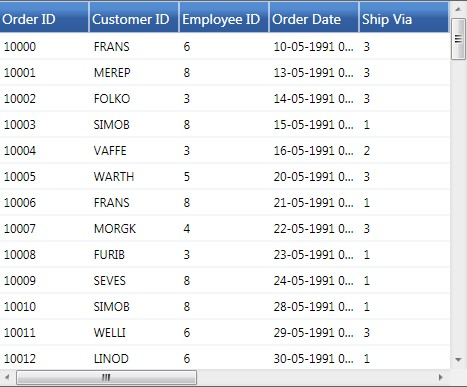
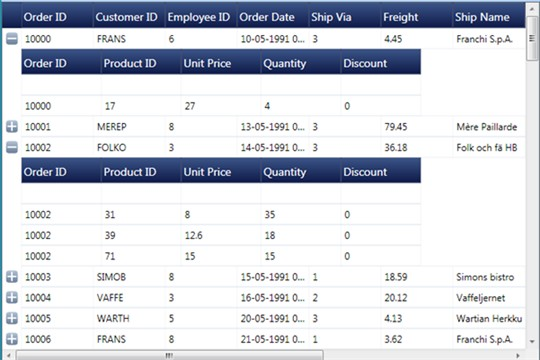
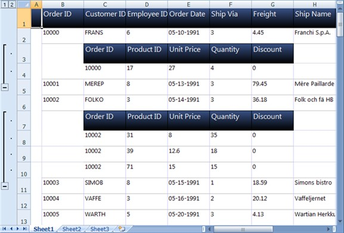

::: {style="DISPLAY: none"}
{#d2h_url_template}{#d2h_package_url style="WIDTH: 0px; DISPLAY: none; HEIGHT: 0px"}
:::

::::: {.d2h_secondary_topic style="PADDING-BOTTOM: 10pt; MARGIN: 0pt; PADDING-LEFT: 0pt; PADDING-RIGHT: 0pt; PADDING-TOP: 0pt"}
##### Features {#features style="tab-stops: 0pt"}

###### 4.2.4.1.1.1 Entire Content {#entire-content style="tab-stops: 0pt"}

You can convert the entire content of a GridDataControl to an Excel Spreadsheet. You can also avail the option for specifying the version of the Excel file using the ExcelVersion  enum. The version can be one of the following:

 

[·      ]{style="FONT-FAMILY: Symbol"}ExcelVersion.Excel97to2003  

[·      ]{style="FONT-FAMILY: Symbol"}ExcelVersion.Excel2007

 

The following code illustrates the conversion of GridDataControl contents to an Excel Spreadsheet:

 

+-----------------------------------------------------------------------------------------------------------------------------------------------------------------------+
| [\[C#\]]{style="FONT-FAMILY: 'Courier New'; COLOR: black"}                                                                                                            |
|                                                                                                                                                                       |
| []{style="FONT-FAMILY: 'Courier New'; COLOR: blue"}                                                                                                                   |
|                                                                                                                                                                       |
| [gridDataControl.ExportToExcel([\"Sample.xlsx\"]{style="COLOR: #a31515"}, [ExcelVersion]{style="COLOR: #2b91af"}.Excel2007 );]{style="FONT-FAMILY: 'Courier New'"}    |
|                                                                                                                                                                       |
| []{style="FONT-FAMILY: 'Courier New'"}                                                                                                                                |
|                                                                                                                                                                       |
| [(or)]{style="FONT-FAMILY: 'Courier New'"}                                                                                                                            |
|                                                                                                                                                                       |
| **[]{style="FONT-FAMILY: 'Courier New'"}**                                                                                                                            |
|                                                                                                                                                                       |
| [gridDataControl.ExportToExcel([\"Sample.xls\"]{style="COLOR: #a31515"}, [ExcelVersion]{style="COLOR: #2b91af"}.Excel97to2003 );]{style="FONT-FAMILY: 'Courier New'"} |
+-----------------------------------------------------------------------------------------------------------------------------------------------------------------------+

[]{style="COLOR: #15428b"} 

{border="0"}

Figure 236: GridDataControl

[]{style="COLOR: #15428b"} 

[]{style="COLOR: #15428b"} 

{border="0"}

Figure 237: GridDataControl content in an Excel Spreadsheet

***[]{style="COLOR: #15428b"}*** 

The above images shows how the entire content of the GridDataControl is exported to an Excel Spreadsheet.

[]{style="COLOR: #15428b"} 

###### 4.2.4.1.1.2 Selected Rows {#selected-rows style="tab-stops: 0pt"}

You can also avail the choice of converting the selected rows of GridDataControl to an Excel Spreadsheet.

 

The following code illustrates the conversion of selected rows of GridDataControl to an Excel Spreadsheet:

 

+--------------------------------------------------------------------------------------------------------------------------------------------------------------------+
| [\[C#\]]{style="FONT-FAMILY: 'Courier New'; COLOR: black"}                                                                                                         |
|                                                                                                                                                                    |
| []{style="FONT-FAMILY: 'Courier New'; COLOR: blue"}                                                                                                                |
|                                                                                                                                                                    |
| [grid.ExportToExcel(grid.Model.SelectedRanges.ActiveRange,[\"sample.xlsx\"]{style="COLOR: #a31515"}, ExcelVersion.Excel2007);]{style="FONT-FAMILY: 'Courier New'"} |
+--------------------------------------------------------------------------------------------------------------------------------------------------------------------+

[]{style="COLOR: #15428b"} 

###### 4.2.4.1.1.3 GridDataControl with Nested Child {#griddatacontrol-with-nested-child style="tab-stops: 0pt"}

You can convert the content of a GridDataControl, with Nested Child to an Excel Spreadsheet. Parent and visible child content are exported to Excel Spreadsheet.

 

The following code illustrates the conversion of GridDataControl with Nested Child to an Excel Spreadsheet:

 

+-----------------------------------------------------------------------------------------------------------------------------------------------------------------------+
| [\[C#\]]{style="FONT-FAMILY: 'Courier New'; COLOR: black"}                                                                                                            |
|                                                                                                                                                                       |
| []{style="FONT-FAMILY: 'Courier New'; COLOR: blue"}                                                                                                                   |
|                                                                                                                                                                       |
| [gridDataControl.ExportToExcel([\"Sample.xlsx\"]{style="COLOR: #a31515"}, [ExcelVersion]{style="COLOR: #2b91af"}.Excel2007 );]{style="FONT-FAMILY: 'Courier New'"}    |
|                                                                                                                                                                       |
| **[]{style="FONT-FAMILY: 'Courier New'"}**                                                                                                                            |
|                                                                                                                                                                       |
| [(or)]{style="FONT-FAMILY: 'Courier New'"}                                                                                                                            |
|                                                                                                                                                                       |
| **[]{style="FONT-FAMILY: 'Courier New'"}**                                                                                                                            |
|                                                                                                                                                                       |
| [gridDataControl.ExportToExcel([\"Sample.xls\"]{style="COLOR: #a31515"}, [ExcelVersion]{style="COLOR: #2b91af"}.Excel97to2003 );]{style="FONT-FAMILY: 'Courier New'"} |
+-----------------------------------------------------------------------------------------------------------------------------------------------------------------------+

[]{style="COLOR: #15428b"} 

::: {style="BORDER-BOTTOM: windowtext 1pt solid; BORDER-LEFT: medium none; PADDING-BOTTOM: 1pt; MARGIN-TOP: 9pt; PADDING-LEFT: 0pt; PADDING-RIGHT: 0pt; MARGIN-BOTTOM: 9pt; BORDER-TOP: windowtext 1pt solid; BORDER-RIGHT: medium none; PADDING-TOP: 1pt"}
{border="0"}Note: Only the visible child\'s contents will be exported.
:::

[]{style="COLOR: #15428b"} 

{border="0"}

Figure 238: GridDataControl with NestedChild

***[]{style="COLOR: #15428b"}*** 

{border="0"}

Figure 239: GridDataControl with NestedChild content in an Excel Spreadsheet

 

The above images shows how the GridControl, with Nested Child is exported to an Excel Spreadsheet.

 

 

###### 4.2.4.1.1.4 GridDataControl with Grouping {#griddatacontrol-with-grouping style="tab-stops: 0pt"}

You can convert the content of a GridDataControl, with Grouping to an Excel Spreadsheet. The following code illustrates this feature:

 

+-----------------------------------------------------------------------------------------------------------------------------------------------------------------------+
| [\[C#\]]{style="FONT-FAMILY: 'Courier New'; COLOR: black"}                                                                                                            |
|                                                                                                                                                                       |
| []{style="FONT-FAMILY: 'Courier New'; COLOR: blue"}                                                                                                                   |
|                                                                                                                                                                       |
| [gridDataControl.ExportToExcel([\"Sample.xlsx\"]{style="COLOR: #a31515"}, [ExcelVersion]{style="COLOR: #2b91af"}.Excel2007 );]{style="FONT-FAMILY: 'Courier New'"}    |
|                                                                                                                                                                       |
| **[]{style="FONT-FAMILY: 'Courier New'"}**                                                                                                                            |
|                                                                                                                                                                       |
| [(or)]{style="FONT-FAMILY: 'Courier New'"}                                                                                                                            |
|                                                                                                                                                                       |
| **[]{style="FONT-FAMILY: 'Courier New'"}**                                                                                                                            |
|                                                                                                                                                                       |
| [gridDataControl.ExportToExcel([\"Sample.xls\"]{style="COLOR: #a31515"}, [ExcelVersion]{style="COLOR: #2b91af"}.Excel97to2003 );]{style="FONT-FAMILY: 'Courier New'"} |
+-----------------------------------------------------------------------------------------------------------------------------------------------------------------------+

[]{style="COLOR: #15428b"} 

::: {style="BORDER-BOTTOM: windowtext 1pt solid; BORDER-LEFT: medium none; PADDING-BOTTOM: 1pt; MARGIN-TOP: 9pt; PADDING-LEFT: 0pt; PADDING-RIGHT: 0pt; MARGIN-BOTTOM: 9pt; BORDER-TOP: windowtext 1pt solid; BORDER-RIGHT: medium none; PADDING-TOP: 1pt"}
{border="0"}Note:[ ]{style="FONT-FAMILY: 'Times New Roman','serif'; FONT-SIZE: 12pt"}Only the visible grouping contents will be exported.
:::

[]{style="COLOR: #15428b"} 

{border="0"}

Figure 240: GridDataControl with Grouping

***[]{style="COLOR: #15428b"}*** 

{border="0"}

Figure 241: GridDataControl with Grouping content in an Excel spreadsheet

**[]{style="COLOR: #15428b"}** 

The above images shows how the GridControl, with Grouping is exported to an Excel Spreadsheet.

 

 

 

[]{#related-topics}
:::::
