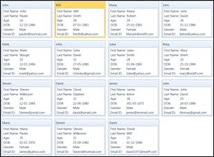

::: {style="DISPLAY: none"}
{#d2h_url_template}{#d2h_package_url style="WIDTH: 0px; DISPLAY: none; HEIGHT: 0px"}
:::

::::::: {.d2h_secondary_topic style="PADDING-BOTTOM: 10pt; MARGIN: 0pt; PADDING-LEFT: 0pt; PADDING-RIGHT: 0pt; PADDING-TOP: 0pt"}
##### Features of CardView control {#features-of-cardview-control style="tab-stops: 0pt"}

###### 3.4.2.1.3.1 Grouping {#grouping style="tab-stops: 0pt"}

Cards inside the CardView control can be grouped by the fields available in the list. Grouping can be achieved by dragging the field from the list to the header panel in the CardView control. Grouping can be controlled by the property called CanGroup. By default CanGroup value will be true.**[]{style="COLOR: #c00000"}**

 

Properties

Table 2: Property/Properties Table

::: {align="center"}
  ---------- -------------------------- --------------------- ----------- -----------------
  Property   Description                Type                  Data Type   Reference links
  CanGroup   It controls the grouping   Dependency Property   Boolean     NA
  ---------- -------------------------- --------------------- ----------- -----------------
:::

 

Adding grouping to an Application

**CanGroup** property can be added directly to an application using the following code snippet:

[]{style="FONT-FAMILY: 'Courier New'"} 

+-----------------------------------------------------------------------------------------------------------------------------------------------------------------------------------------------------------------------------------------------------------------------------------------------------------------------------------------------------------------------------------------------------------------------------------------------------+
| **[\[XAML\]]{style="FONT-FAMILY: 'Courier New'"}**                                                                                                                                                                                                                                                                                                                                                                                                  |
|                                                                                                                                                                                                                                                                                                                                                                                                                                                     |
| [      ]{style="FONT-FAMILY: 'Courier New'"}[\<]{style="FONT-FAMILY: 'Courier New'; COLOR: blue"}[syncfusion]{style="FONT-FAMILY: 'Courier New'; COLOR: #a31515"}[:]{style="FONT-FAMILY: 'Courier New'; COLOR: blue"}[CardView]{style="FONT-FAMILY: 'Courier New'; COLOR: #a31515"}[ CanGroup]{style="FONT-FAMILY: 'Courier New'; COLOR: red"}[=\"False\"\>]{style="FONT-FAMILY: 'Courier New'; COLOR: blue"}[]{style="FONT-FAMILY: 'Courier New'"} |
|                                                                                                                                                                                                                                                                                                                                                                                                                                                     |
| [                    ]{style="FONT-FAMILY: 'Courier New'; COLOR: #a31515"}[]{style="FONT-FAMILY: 'Courier New'"}                                                                                                                                                                                                                                                                                                                                    |
|                                                                                                                                                                                                                                                                                                                                                                                                                                                     |
| [        ]{style="FONT-FAMILY: 'Courier New'; COLOR: #a31515"}[\</]{style="FONT-FAMILY: 'Courier New'; COLOR: blue"}[syncfusion]{style="FONT-FAMILY: 'Courier New'; COLOR: #a31515"}[:]{style="FONT-FAMILY: 'Courier New'; COLOR: blue"}[CardView]{style="FONT-FAMILY: 'Courier New'; COLOR: #a31515"}[\>]{style="FONT-FAMILY: 'Courier New'; COLOR: blue"}                                                                                         |
|                                                                                                                                                                                                                                                                                                                                                                                                                                                     |
| []{style="FONT-FAMILY: 'Courier New'"}                                                                                                                                                                                                                                                                                                                                                                                                              |
+-----------------------------------------------------------------------------------------------------------------------------------------------------------------------------------------------------------------------------------------------------------------------------------------------------------------------------------------------------------------------------------------------------------------------------------------------------+

 

+------------------------------------------------------------------------------------------------------------------------------------------------------------------------------------------------------------------------------+
| **[\[C#\]]{style="FONT-FAMILY: 'Courier New'"}**                                                                                                                                                                             |
|                                                                                                                                                                                                                              |
| [      ]{style="FONT-FAMILY: 'Courier New'"}[CardView]{style="FONT-FAMILY: 'Courier New'; COLOR: #2b91af"}[ cardview = [new]{style="COLOR: blue"} [CardView]{style="COLOR: #2b91af"}();]{style="FONT-FAMILY: 'Courier New'"} |
|                                                                                                                                                                                                                              |
| [       cardview.CanGroup = [false]{style="COLOR: blue"};]{style="FONT-FAMILY: 'Courier New'"}                                                                                                                               |
|                                                                                                                                                                                                                              |
| []{style="FONT-FAMILY: 'Courier New'"}                                                                                                                                                                                       |
+------------------------------------------------------------------------------------------------------------------------------------------------------------------------------------------------------------------------------+

###### 3.4.2.1.3.2 Filtering {#filtering style="tab-stops: 0pt"}

Cards can be filtered by the values which are given for the fields. To filter the cards, just check the values in the listed popup that opens when you click the button which is available in the front of the fields list.

 

###### 3.4.2.1.3.3 Sorting {#sorting style="tab-stops: 0pt"}

Cards can be sorted inside the CardView Control. It can be achieved by the fields available. To sort the cards just click on the field name listed in the header. It can be controlled by the property called CanSort. By default the value will be true.

 

Properties

Table 3: Property/Properties Table

::: {align="center"}
  Property   Description               Type                  Data Type   Reference links
  ---------- ------------------------- --------------------- ----------- -----------------
  CanSort    It controls the sorting   Dependency Property   Boolean     NA
:::

 

Adding sorting to an Application

**CanSort** can be added directly to an application using the following code snippet:

 

+----------------------------------------------------------------------------------------------------------------------------------------------------------------------------------------------------------------------------------------------------------------------------------------------------------------------------------------------------------------------------------------------------------------------------------------------------+
| **[\[XAML\]]{style="FONT-FAMILY: 'Courier New'"}**                                                                                                                                                                                                                                                                                                                                                                                                 |
|                                                                                                                                                                                                                                                                                                                                                                                                                                                    |
| [      ]{style="FONT-FAMILY: 'Courier New'"}[\<]{style="FONT-FAMILY: 'Courier New'; COLOR: blue"}[syncfusion]{style="FONT-FAMILY: 'Courier New'; COLOR: #a31515"}[:]{style="FONT-FAMILY: 'Courier New'; COLOR: blue"}[CardView]{style="FONT-FAMILY: 'Courier New'; COLOR: #a31515"}[ CanSort]{style="FONT-FAMILY: 'Courier New'; COLOR: red"}[=\"False\"\>]{style="FONT-FAMILY: 'Courier New'; COLOR: blue"}[]{style="FONT-FAMILY: 'Courier New'"} |
|                                                                                                                                                                                                                                                                                                                                                                                                                                                    |
| [                    ]{style="FONT-FAMILY: 'Courier New'; COLOR: #a31515"}[]{style="FONT-FAMILY: 'Courier New'"}                                                                                                                                                                                                                                                                                                                                   |
|                                                                                                                                                                                                                                                                                                                                                                                                                                                    |
| [        ]{style="FONT-FAMILY: 'Courier New'; COLOR: #a31515"}[\</]{style="FONT-FAMILY: 'Courier New'; COLOR: blue"}[syncfusion]{style="FONT-FAMILY: 'Courier New'; COLOR: #a31515"}[:]{style="FONT-FAMILY: 'Courier New'; COLOR: blue"}[CardView]{style="FONT-FAMILY: 'Courier New'; COLOR: #a31515"}[\>]{style="FONT-FAMILY: 'Courier New'; COLOR: blue"}                                                                                        |
|                                                                                                                                                                                                                                                                                                                                                                                                                                                    |
| []{style="FONT-FAMILY: 'Courier New'"}                                                                                                                                                                                                                                                                                                                                                                                                             |
+----------------------------------------------------------------------------------------------------------------------------------------------------------------------------------------------------------------------------------------------------------------------------------------------------------------------------------------------------------------------------------------------------------------------------------------------------+

 

+------------------------------------------------------------------------------------------------------------------------------------------------------------------------------------------------------------------------------+
| **[\[C#\]]{style="FONT-FAMILY: 'Courier New'"}**                                                                                                                                                                             |
|                                                                                                                                                                                                                              |
| [      ]{style="FONT-FAMILY: 'Courier New'"}[CardView]{style="FONT-FAMILY: 'Courier New'; COLOR: #2b91af"}[ cardview = [new]{style="COLOR: blue"} [CardView]{style="COLOR: #2b91af"}();]{style="FONT-FAMILY: 'Courier New'"} |
|                                                                                                                                                                                                                              |
| [       cardview.CanSort = [false]{style="COLOR: blue"};]{style="FONT-FAMILY: 'Courier New'"}                                                                                                                                |
|                                                                                                                                                                                                                              |
| []{style="FONT-FAMILY: 'Courier New'"}                                                                                                                                                                                       |
+------------------------------------------------------------------------------------------------------------------------------------------------------------------------------------------------------------------------------+

 

###### 3.4.2.1.3.4 Editing {#editing style="tab-stops: 0pt"}

More attractive feature in the CardView control is editing. CanEdit property allows the user to edit the fields available in the cards. Moreover we can customize the Item template while editing by using the property called EditItemTemplate.

 

Properties

Table 4: Property/Properties Table

::: {align="center"}
  ------------------ ------------------------------------------------------- --------------------- ----------- -----------------
  Property           Description                                             Type                  Data Type   Reference links
  CanEdit            It controls the editing capability of CardViewItems     Dependency Property   Boolean     NA
  EditItemTemplate   It provides the template for the items while editing.   Dependency Property   Boolean     NA
  ------------------ ------------------------------------------------------- --------------------- ----------- -----------------
:::

 

Adding editing to an Application

**CanEdit** property can be added directly to an application using the following code snippet:

 

+----------------------------------------------------------------------------------------------------------------------------------------------------------------------------------------------------------------------------------------------------------------------------------------------------------------------------------------------------------------------------------------------------------------------------------------------------+
| **[\[XAML\]]{style="FONT-FAMILY: 'Courier New'"}**                                                                                                                                                                                                                                                                                                                                                                                                 |
|                                                                                                                                                                                                                                                                                                                                                                                                                                                    |
| [      ]{style="FONT-FAMILY: 'Courier New'"}[\<]{style="FONT-FAMILY: 'Courier New'; COLOR: blue"}[syncfusion]{style="FONT-FAMILY: 'Courier New'; COLOR: #a31515"}[:]{style="FONT-FAMILY: 'Courier New'; COLOR: blue"}[CardView]{style="FONT-FAMILY: 'Courier New'; COLOR: #a31515"}[ CanEdit]{style="FONT-FAMILY: 'Courier New'; COLOR: red"}[=\"False\"\>]{style="FONT-FAMILY: 'Courier New'; COLOR: blue"}[]{style="FONT-FAMILY: 'Courier New'"} |
|                                                                                                                                                                                                                                                                                                                                                                                                                                                    |
| [                    ]{style="FONT-FAMILY: 'Courier New'; COLOR: #a31515"}[]{style="FONT-FAMILY: 'Courier New'"}                                                                                                                                                                                                                                                                                                                                   |
|                                                                                                                                                                                                                                                                                                                                                                                                                                                    |
| [        ]{style="FONT-FAMILY: 'Courier New'; COLOR: #a31515"}[\</]{style="FONT-FAMILY: 'Courier New'; COLOR: blue"}[syncfusion]{style="FONT-FAMILY: 'Courier New'; COLOR: #a31515"}[:]{style="FONT-FAMILY: 'Courier New'; COLOR: blue"}[CardView]{style="FONT-FAMILY: 'Courier New'; COLOR: #a31515"}[\>]{style="FONT-FAMILY: 'Courier New'; COLOR: blue"}                                                                                        |
|                                                                                                                                                                                                                                                                                                                                                                                                                                                    |
| []{style="FONT-FAMILY: 'Courier New'"}                                                                                                                                                                                                                                                                                                                                                                                                             |
+----------------------------------------------------------------------------------------------------------------------------------------------------------------------------------------------------------------------------------------------------------------------------------------------------------------------------------------------------------------------------------------------------------------------------------------------------+

 

+------------------------------------------------------------------------------------------------------------------------------------------------------------------------------------------------------------------------------+
| **[\[C#\]]{style="FONT-FAMILY: 'Courier New'"}**                                                                                                                                                                             |
|                                                                                                                                                                                                                              |
| [      ]{style="FONT-FAMILY: 'Courier New'"}[CardView]{style="FONT-FAMILY: 'Courier New'; COLOR: #2b91af"}[ cardview = [new]{style="COLOR: blue"} [CardView]{style="COLOR: #2b91af"}();]{style="FONT-FAMILY: 'Courier New'"} |
|                                                                                                                                                                                                                              |
| [       cardview.CanEdit = [false]{style="COLOR: blue"};]{style="FONT-FAMILY: 'Courier New'"}                                                                                                                                |
|                                                                                                                                                                                                                              |
| []{style="FONT-FAMILY: 'Courier New'"}                                                                                                                                                                                       |
+------------------------------------------------------------------------------------------------------------------------------------------------------------------------------------------------------------------------------+

###### 3.4.2.1.3.5 Header Panel {#header-panel style="tab-stops: 0pt"}

It is the base to showcase the fields when you drop the fields from the list. We can customize the visibility of the Header panel by using the property called ShowHeader.

 

 

Properties

Table 5: Property/Properties Table

::: {align="center"}
  ------------ ------------------------------------------------ --------------------- ----------- -----------------
  Property     Description                                      Type                  Data Type   Reference links
  ShowHeader   It controls the visibility of the Header panel   Dependency Property   Boolean     NA
  ------------ ------------------------------------------------ --------------------- ----------- -----------------
:::

 

Adding Header Panel visibility customization to an Application

**ShowHeader** property can be added directly to an application using the following code snippet:

 

+-------------------------------------------------------------------------------------------------------------------------------------------------------------------------------------------------------------------------------------------------------------------------------------------------------------------------------------------------------------------------------------------------------------------------------------------------------+
| **[\[XAML\]]{style="FONT-FAMILY: 'Courier New'"}**                                                                                                                                                                                                                                                                                                                                                                                                    |
|                                                                                                                                                                                                                                                                                                                                                                                                                                                       |
| [      ]{style="FONT-FAMILY: 'Courier New'"}[\<]{style="FONT-FAMILY: 'Courier New'; COLOR: blue"}[syncfusion]{style="FONT-FAMILY: 'Courier New'; COLOR: #a31515"}[:]{style="FONT-FAMILY: 'Courier New'; COLOR: blue"}[CardView]{style="FONT-FAMILY: 'Courier New'; COLOR: #a31515"}[ ShowHeader]{style="FONT-FAMILY: 'Courier New'; COLOR: red"}[=\"False\"\>]{style="FONT-FAMILY: 'Courier New'; COLOR: blue"}[]{style="FONT-FAMILY: 'Courier New'"} |
|                                                                                                                                                                                                                                                                                                                                                                                                                                                       |
| [                    ]{style="FONT-FAMILY: 'Courier New'; COLOR: #a31515"}[]{style="FONT-FAMILY: 'Courier New'"}                                                                                                                                                                                                                                                                                                                                      |
|                                                                                                                                                                                                                                                                                                                                                                                                                                                       |
| [        ]{style="FONT-FAMILY: 'Courier New'; COLOR: #a31515"}[\</]{style="FONT-FAMILY: 'Courier New'; COLOR: blue"}[syncfusion]{style="FONT-FAMILY: 'Courier New'; COLOR: #a31515"}[:]{style="FONT-FAMILY: 'Courier New'; COLOR: blue"}[CardView]{style="FONT-FAMILY: 'Courier New'; COLOR: #a31515"}[\>]{style="FONT-FAMILY: 'Courier New'; COLOR: blue"}                                                                                           |
|                                                                                                                                                                                                                                                                                                                                                                                                                                                       |
| []{style="FONT-FAMILY: 'Courier New'"}                                                                                                                                                                                                                                                                                                                                                                                                                |
+-------------------------------------------------------------------------------------------------------------------------------------------------------------------------------------------------------------------------------------------------------------------------------------------------------------------------------------------------------------------------------------------------------------------------------------------------------+

 

+------------------------------------------------------------------------------------------------------------------------------------------------------------------------------------------------------------------------------+
| **[\[C#\]]{style="FONT-FAMILY: 'Courier New'"}**                                                                                                                                                                             |
|                                                                                                                                                                                                                              |
| [      ]{style="FONT-FAMILY: 'Courier New'"}[CardView]{style="FONT-FAMILY: 'Courier New'; COLOR: #2b91af"}[ cardview = [new]{style="COLOR: blue"} [CardView]{style="COLOR: #2b91af"}();]{style="FONT-FAMILY: 'Courier New'"} |
|                                                                                                                                                                                                                              |
| [       cardview.ShowHeader = [false]{style="COLOR: blue"};]{style="FONT-FAMILY: 'Courier New'"}                                                                                                                             |
|                                                                                                                                                                                                                              |
| []{style="FONT-FAMILY: 'Courier New'"}                                                                                                                                                                                       |
+------------------------------------------------------------------------------------------------------------------------------------------------------------------------------------------------------------------------------+

 

{border="0"}

Figure 103: CardView control view when ShowHeader=false.[]{style="COLOR: #c00000"}

[]{style="COLOR: #c00000"} 

[]{#related-topics}
:::::::
