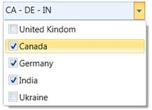
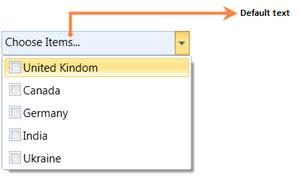
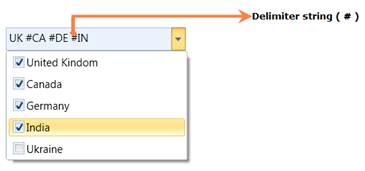

::: {style="DISPLAY: none"}
{#d2h_url_template}{#d2h_package_url style="WIDTH: 0px; DISPLAY: none; HEIGHT: 0px"}
:::

:::::: {.d2h_secondary_topic style="PADDING-BOTTOM: 10pt; MARGIN: 0pt; PADDING-LEFT: 0pt; PADDING-RIGHT: 0pt; PADDING-TOP: 0pt"}
##### Features of ComboBoxAdv control {#features-of-comboboxadv-control style="tab-stops: 0pt"}

###### 3.11.2.1.3.1        Multiple Selections {#multiple-selections style="tab-stops: 0pt"}

If we want to select more than one item in the ComboBoxAdv, **AllowMultiSelect** property will be helpful to do this. It allows you to select multiple items in the drop down list. The selected items will be displayed in ascending order as shown in the drop down list. When AllowMutliSelect property is true, the SelectedItems property exposes the items that are selected in the drop down list.

**[]{style="COLOR: #c00000"}** 

Properties

Table 9: Properties Table

::: {align="center"}
  ------------------ -------------------------------------- --------------------- -------------------------------- -----------------
  Property           Description                            Type                  Data Type                        Reference links
  AllowMultiSelect   Multiple items can be selected.        Dependency Property   Boolean                          NA
  SelectedItems      It contains the selected items value   Dependency Property   ObservableCollection\<object\>   NA
  ------------------ -------------------------------------- --------------------- -------------------------------- -----------------
:::

 

Adding Multiple Selections to an Application

**AllowMultiSelect** property can be added directly to an application using the following code snippet.

 

+---------------------------------------------------------------------------------------------------------------------------------------------------------------------------------------------------------------------------------------------------------------------------------------------------------------------------------------------------------------------------------------------------------------------------------------------------------------+
| **[\[XAML\]]{style="FONT-FAMILY: 'Courier New'"}**                                                                                                                                                                                                                                                                                                                                                                                                            |
|                                                                                                                                                                                                                                                                                                                                                                                                                                                               |
| [      ]{style="FONT-FAMILY: 'Courier New'"}[\<]{style="FONT-FAMILY: 'Courier New'; COLOR: blue"}[syncfusion]{style="FONT-FAMILY: 'Courier New'; COLOR: #a31515"}[:]{style="FONT-FAMILY: 'Courier New'; COLOR: blue"}[ComboBoxAdv]{style="FONT-FAMILY: 'Courier New'; COLOR: #a31515"}[ AllowMultiSelect]{style="FONT-FAMILY: 'Courier New'; COLOR: red"}[=\"True\"\>]{style="FONT-FAMILY: 'Courier New'; COLOR: blue"}[]{style="FONT-FAMILY: 'Courier New'"} |
|                                                                                                                                                                                                                                                                                                                                                                                                                                                               |
| [                            ]{style="FONT-FAMILY: 'Courier New'; COLOR: #a31515"}[]{style="FONT-FAMILY: 'Courier New'"}                                                                                                                                                                                                                                                                                                                                      |
|                                                                                                                                                                                                                                                                                                                                                                                                                                                               |
| [        ]{style="FONT-FAMILY: 'Courier New'; COLOR: #a31515"}[\</]{style="FONT-FAMILY: 'Courier New'; COLOR: blue"}[syncfusion]{style="FONT-FAMILY: 'Courier New'; COLOR: #a31515"}[:]{style="FONT-FAMILY: 'Courier New'; COLOR: blue"}[ComboBoxAdv]{style="FONT-FAMILY: 'Courier New'; COLOR: #a31515"}[\>]{style="FONT-FAMILY: 'Courier New'; COLOR: blue"}                                                                                                |
|                                                                                                                                                                                                                                                                                                                                                                                                                                                               |
| []{style="FONT-FAMILY: 'Courier New'"}                                                                                                                                                                                                                                                                                                                                                                                                                        |
+---------------------------------------------------------------------------------------------------------------------------------------------------------------------------------------------------------------------------------------------------------------------------------------------------------------------------------------------------------------------------------------------------------------------------------------------------------------+

 

+------------------------------------------------------------------------------------------------------------------------------------------------------------------------------------------------------------------------------------+
| **[\[C#\]]{style="FONT-FAMILY: 'Courier New'"}**                                                                                                                                                                                   |
|                                                                                                                                                                                                                                    |
| [      ]{style="FONT-FAMILY: 'Courier New'"}[ComboBoxAdv]{style="FONT-FAMILY: 'Courier New'; COLOR: #2b91af"}[ comboBox = [new]{style="COLOR: blue"} [ComboBoxAdv]{style="COLOR: #2b91af"}();]{style="FONT-FAMILY: 'Courier New'"} |
|                                                                                                                                                                                                                                    |
| [       comboBox.AllowMultiSelect = [true]{style="COLOR: blue"};]{style="FONT-FAMILY: 'Courier New'"}                                                                                                                              |
|                                                                                                                                                                                                                                    |
| []{style="FONT-FAMILY: 'Courier New'"}                                                                                                                                                                                             |
+------------------------------------------------------------------------------------------------------------------------------------------------------------------------------------------------------------------------------------+

 

{border="0"}

Figure 215: ComboBoxAdv Control in Multiple selections

 

 

###### 3.11.2.1.3.2        Default Text {#default-text style="tab-stops: 0pt"}

It displays the default text in the ComboBoxAdv when none of the items is selected in the drop down list.[]{style="COLOR: #c00000"}

 

Properties

Table 10: Properties Table

::: {align="center"}
  ------------- --------------------------------------------- --------------------- ----------- -----------------
  Property      Description                                   Type                  Data Type   Reference links
  DefaultText   It is possible to display the default text.   Dependency Property   String      NA
  ------------- --------------------------------------------- --------------------- ----------- -----------------
:::

 

Adding DefaultText property to an Application

**DefaultText** property can be added directly to an application in the following way:

 

+--------------------------------------------------------------------------------------------------------------------------------------------------------------------------------------------------------------------------------------------------------------------------------------------------------------------------------------------------------------------------------------------------------------------------------+
| **[\[XAML\]]{style="FONT-FAMILY: 'Courier New'"}**                                                                                                                                                                                                                                                                                                                                                                             |
|                                                                                                                                                                                                                                                                                                                                                                                                                                |
| [      ]{style="FONT-FAMILY: 'Courier New'"}[\<]{style="FONT-FAMILY: 'Courier New'; COLOR: blue"}[syncfusion]{style="FONT-FAMILY: 'Courier New'; COLOR: #a31515"}[:]{style="FONT-FAMILY: 'Courier New'; COLOR: blue"}[ComboBoxAdv]{style="FONT-FAMILY: 'Courier New'; COLOR: #a31515"}[ DefaultText]{style="FONT-FAMILY: 'Courier New'; COLOR: red"}[=\"..Choose Items..\"\>]{style="FONT-FAMILY: 'Courier New'; COLOR: blue"} |
|                                                                                                                                                                                                                                                                                                                                                                                                                                |
| [                            ]{style="FONT-FAMILY: 'Courier New'; COLOR: #a31515"}[]{style="FONT-FAMILY: 'Courier New'"}                                                                                                                                                                                                                                                                                                       |
|                                                                                                                                                                                                                                                                                                                                                                                                                                |
| [        ]{style="FONT-FAMILY: 'Courier New'; COLOR: #a31515"}[\</]{style="FONT-FAMILY: 'Courier New'; COLOR: blue"}[syncfusion]{style="FONT-FAMILY: 'Courier New'; COLOR: #a31515"}[:]{style="FONT-FAMILY: 'Courier New'; COLOR: blue"}[ComboBoxAdv]{style="FONT-FAMILY: 'Courier New'; COLOR: #a31515"}[\>]{style="FONT-FAMILY: 'Courier New'; COLOR: blue"}                                                                 |
|                                                                                                                                                                                                                                                                                                                                                                                                                                |
| []{style="FONT-FAMILY: 'Courier New'"}                                                                                                                                                                                                                                                                                                                                                                                         |
+--------------------------------------------------------------------------------------------------------------------------------------------------------------------------------------------------------------------------------------------------------------------------------------------------------------------------------------------------------------------------------------------------------------------------------+

 

+------------------------------------------------------------------------------------------------------------------------------------------------------------------------------------------------------------------------------------+
| **[\[C#\]]{style="FONT-FAMILY: 'Courier New'"}**                                                                                                                                                                                   |
|                                                                                                                                                                                                                                    |
| [      ]{style="FONT-FAMILY: 'Courier New'"}[ComboBoxAdv]{style="FONT-FAMILY: 'Courier New'; COLOR: #2b91af"}[ comboBox = [new]{style="COLOR: blue"} [ComboBoxAdv]{style="COLOR: #2b91af"}();]{style="FONT-FAMILY: 'Courier New'"} |
|                                                                                                                                                                                                                                    |
| [       comboBox.DefaultText = [\"..Choose Items..\"]{style="COLOR: #a31515"};]{style="FONT-FAMILY: 'Courier New'"}                                                                                                                |
|                                                                                                                                                                                                                                    |
| []{style="FONT-FAMILY: 'Courier New'"}                                                                                                                                                                                             |
+------------------------------------------------------------------------------------------------------------------------------------------------------------------------------------------------------------------------------------+

{border="0"}

Figure 216: Default Text in ComboBoxAdv control

###### 3.11.2.1.3.3        Delimiter String Customization {#delimiter-string-customization style="tab-stops: 0pt"}

A delimiter string in a ComboBoxAdv is "A string that can be displayed between the selected items in the ComboBoxAdv". We can customize this string by using the property called "SelectedValueDelimiter" in the ComboBoxAdv.

[]{style="COLOR: #c00000"} 

Properties

Table 11: Property/Properties Table

::: {align="center"}
  Property                 Description                                                Type                  Data Type   Reference links
  ------------------------ ---------------------------------------------------------- --------------------- ----------- -----------------
  SelectedValueDelimiter   The selected items can be separated by the given string.   Dependency Property   String      NA
:::

 

Adding Delimiter String Customization to an Application

**Delimiter string customization** can be added directly to an application using the following code snippet:

 

+----------------------------------------------------------------------------------------------------------------------------------------------------------------------------------------------------------------------------------------------------------------------------------------------------------------------------------------------------------------------------------------------------------------------------+
| **[\[XAML\]]{style="FONT-FAMILY: 'Courier New'"}**                                                                                                                                                                                                                                                                                                                                                                         |
|                                                                                                                                                                                                                                                                                                                                                                                                                            |
| [      ]{style="FONT-FAMILY: 'Courier New'"}[\<]{style="FONT-FAMILY: 'Courier New'; COLOR: blue"}[syncfusion]{style="FONT-FAMILY: 'Courier New'; COLOR: #a31515"}[:]{style="FONT-FAMILY: 'Courier New'; COLOR: blue"}[ComboBoxAdv]{style="FONT-FAMILY: 'Courier New'; COLOR: #a31515"}[ SelectedValueDelimiter]{style="FONT-FAMILY: 'Courier New'; COLOR: red"}[=\"#\"\>]{style="FONT-FAMILY: 'Courier New'; COLOR: blue"} |
|                                                                                                                                                                                                                                                                                                                                                                                                                            |
| [                            ]{style="FONT-FAMILY: 'Courier New'; COLOR: #a31515"}[]{style="FONT-FAMILY: 'Courier New'"}                                                                                                                                                                                                                                                                                                   |
|                                                                                                                                                                                                                                                                                                                                                                                                                            |
| [        ]{style="FONT-FAMILY: 'Courier New'; COLOR: #a31515"}[\</]{style="FONT-FAMILY: 'Courier New'; COLOR: blue"}[syncfusion]{style="FONT-FAMILY: 'Courier New'; COLOR: #a31515"}[:]{style="FONT-FAMILY: 'Courier New'; COLOR: blue"}[ComboBoxAdv]{style="FONT-FAMILY: 'Courier New'; COLOR: #a31515"}[\>]{style="FONT-FAMILY: 'Courier New'; COLOR: blue"}                                                             |
|                                                                                                                                                                                                                                                                                                                                                                                                                            |
| []{style="FONT-FAMILY: 'Courier New'"}                                                                                                                                                                                                                                                                                                                                                                                     |
+----------------------------------------------------------------------------------------------------------------------------------------------------------------------------------------------------------------------------------------------------------------------------------------------------------------------------------------------------------------------------------------------------------------------------+

 

+------------------------------------------------------------------------------------------------------------------------------------------------------------------------------------------------------------------------------------+
| **[\[C#\]]{style="FONT-FAMILY: 'Courier New'"}**                                                                                                                                                                                   |
|                                                                                                                                                                                                                                    |
| [      ]{style="FONT-FAMILY: 'Courier New'"}[ComboBoxAdv]{style="FONT-FAMILY: 'Courier New'; COLOR: #2b91af"}[ comboBox = [new]{style="COLOR: blue"} [ComboBoxAdv]{style="COLOR: #2b91af"}();]{style="FONT-FAMILY: 'Courier New'"} |
|                                                                                                                                                                                                                                    |
| [       comboBox.SelectedValueDelimiter = [\"#\"]{style="COLOR: #a31515"};]{style="FONT-FAMILY: 'Courier New'"}                                                                                                                    |
|                                                                                                                                                                                                                                    |
| []{style="FONT-FAMILY: 'Courier New'"}                                                                                                                                                                                             |
+------------------------------------------------------------------------------------------------------------------------------------------------------------------------------------------------------------------------------------+

{border="0"}

Figure 217: Customized Delimiter string.

[]{#related-topics}
::::::
