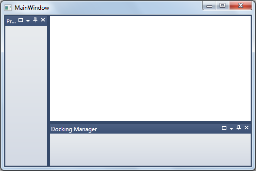
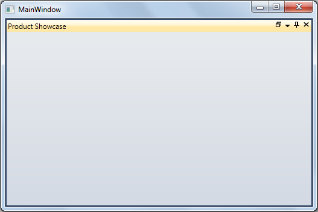

::: {style="DISPLAY: none"}
{#d2h_url_template}{#d2h_package_url style="WIDTH: 0px; DISPLAY: none; HEIGHT: 0px"}
:::

::: {.d2h_secondary_topic style="PADDING-BOTTOM: 10pt; MARGIN: 0pt; PADDING-LEFT: 0pt; PADDING-RIGHT: 0pt; PADDING-TOP: 0pt"}
##### Features of Minimize/Maximize Support for Docked Windows {#features-of-minimizemaximize-support-for-docked-windows style="tab-stops: 0pt"}

###### 3.14.7.8.2.1        Minimize /Maximize Property for Docked Windows: {#minimize-maximize-property-for-docked-windows style="tab-stops: 0pt"}

When the docked window is maximized the DockWindowState property will be set as Maximised. The maximized DockWindow can be restored by clicking on the restore button.

When the docked window is minimized it will go to AutoHidden state and the DockWindowState property will be set as Minimized. The minimized docked window can be restored by clicking on minimized item header.

 

+----------------------------------------------------------------------------------------------------------------------------------------------------------------------------------------------------------------------------------------------------------------------------------------------------------------------------------------------------------------------------------------------------------------------------------------------------------------------------------------------------------------------------------------------------------------------------------------------------------------------------+
| **[\[XAML\]]{style="FONT-FAMILY: 'Courier New'"}**[]{style="FONT-FAMILY: 'Courier New'"}                                                                                                                                                                                                                                                                                                                                                                                                                                                                                                                                   |
|                                                                                                                                                                                                                                                                                                                                                                                                                                                                                                                                                                                                                            |
| [\<]{style="FONT-FAMILY: 'Courier New'; COLOR: blue"}[syncfusion]{style="FONT-FAMILY: 'Courier New'; COLOR: #a31515"}[:]{style="FONT-FAMILY: 'Courier New'; COLOR: blue"}[DockingManager ]{style="FONT-FAMILY: 'Courier New'; COLOR: #a31515"}[x]{style="FONT-FAMILY: 'Courier New'; COLOR: red"}[:]{style="FONT-FAMILY: 'Courier New'; COLOR: blue"}[Name]{style="FONT-FAMILY: 'Courier New'; COLOR: red"}[=\"dockingManager\"]{style="FONT-FAMILY: 'Courier New'; COLOR: blue"}                                                                                                                                          |
|                                                                                                                                                                                                                                                                                                                                                                                                                                                                                                                                                                                                                            |
| [                [MaximizeButtonEnabled]{style="COLOR: red"}[=\"True\"]{style="COLOR: blue"} [MinimizeButtonEnabled]{style="COLOR: red"}[=\"True\"\>]{style="COLOR: blue"}]{style="FONT-FAMILY: 'Courier New'"}                                                                                                                                                                                                                                                                                                                                                                                                            |
|                                                                                                                                                                                                                                                                                                                                                                                                                                                                                                                                                                                                                            |
| [                ]{style="FONT-FAMILY: 'Courier New'; COLOR: #a31515"}[\<!\--Ribbon Window\--\>]{style="FONT-FAMILY: 'Courier New'; COLOR: green"}[]{style="FONT-FAMILY: 'Courier New'"}                                                                                                                                                                                                                                                                                                                                                                                                                                   |
|                                                                                                                                                                                                                                                                                                                                                                                                                                                                                                                                                                                                                            |
| [                ]{style="FONT-FAMILY: 'Courier New'; COLOR: #a31515"}[\<]{style="FONT-FAMILY: 'Courier New'; COLOR: blue"}[ListBox]{style="FONT-FAMILY: 'Courier New'; COLOR: #a31515"}[ Name]{style="FONT-FAMILY: 'Courier New'; COLOR: red"}[=\"ListBox3\"]{style="FONT-FAMILY: 'Courier New'; COLOR: blue"}[ ]{style="FONT-FAMILY: 'Courier New'"}                                                                                                                                                                                                                                                                     |
|                                                                                                                                                                                                                                                                                                                                                                                                                                                                                                                                                                                                                            |
| [                            [ syncfusion]{style="COLOR: red"}[:]{style="COLOR: blue"}[DockingManager.CanClose]{style="COLOR: red"}[=\"False\"]{style="COLOR: blue"}]{style="FONT-FAMILY: 'Courier New'"}                                                                                                                                                                                                                                                                                                                                                                                                                  |
|                                                                                                                                                                                                                                                                                                                                                                                                                                                                                                                                                                                                                            |
| [                            [ syncfusion]{style="COLOR: red"}[:]{style="COLOR: blue"}[DockingManager.CanFloat]{style="COLOR: red"}[=\"False\"]{style="COLOR: blue"} ]{style="FONT-FAMILY: 'Courier New'"}                                                                                                                                                                                                                                                                                                                                                                                                                 |
|                                                                                                                                                                                                                                                                                                                                                                                                                                                                                                                                                                                                                            |
| [                            [ syncfusion]{style="COLOR: red"}[:]{style="COLOR: blue"}[DockingManager.DesiredWidthInDockedMode]{style="COLOR: red"}[=\"200\"]{style="COLOR: blue"}  ]{style="FONT-FAMILY: 'Courier New'"}                                                                                                                                                                                                                                                                                                                                                                                                  |
|                                                                                                                                                                                                                                                                                                                                                                                                                                                                                                                                                                                                                            |
| [                            [ syncfusion]{style="COLOR: red"}[:]{style="COLOR: blue"}[DocumentContainer.MDIBounds]{style="COLOR: red"}[=\"30,30,300,300\"]{style="COLOR: blue"}  ]{style="FONT-FAMILY: 'Courier New'"}                                                                                                                                                                                                                                                                                                                                                                                                    |
|                                                                                                                                                                                                                                                                                                                                                                                                                                                                                                                                                                                                                            |
| [                            [ syncfusion]{style="COLOR: red"}[:]{style="COLOR: blue"}[DockingManager.DesiredHeightInFloatingMode]{style="COLOR: red"}[=\"200\"]{style="COLOR: blue"}]{style="FONT-FAMILY: 'Courier New'"}                                                                                                                                                                                                                                                                                                                                                                                                 |
|                                                                                                                                                                                                                                                                                                                                                                                                                                                                                                                                                                                                                            |
| [                            [ syncfusion]{style="COLOR: red"}[:]{style="COLOR: blue"}[DockingManager.Header]{style="COLOR: red"}[=\"Ribbon\" \>]{style="COLOR: blue"}]{style="FONT-FAMILY: 'Courier New'"}                                                                                                                                                                                                                                                                                                                                                                                                                |
|                                                                                                                                                                                                                                                                                                                                                                                                                                                                                                                                                                                                                            |
| [                    ]{style="FONT-FAMILY: 'Courier New'; COLOR: #a31515"}[\<]{style="FONT-FAMILY: 'Courier New'; COLOR: blue"}[ListBoxItem]{style="FONT-FAMILY: 'Courier New'; COLOR: #a31515"}[ Margin]{style="FONT-FAMILY: 'Courier New'; COLOR: red"}[=\"2,2,2,2\"\>]{style="FONT-FAMILY: 'Courier New'; COLOR: blue"}[Ribbon Sample]{style="FONT-FAMILY: 'Courier New'; COLOR: #a31515"}[\</]{style="FONT-FAMILY: 'Courier New'; COLOR: blue"}[ListBoxItem]{style="FONT-FAMILY: 'Courier New'; COLOR: #a31515"}[\>]{style="FONT-FAMILY: 'Courier New'; COLOR: blue"}[]{style="FONT-FAMILY: 'Courier New'"}            |
|                                                                                                                                                                                                                                                                                                                                                                                                                                                                                                                                                                                                                            |
| [                    ]{style="FONT-FAMILY: 'Courier New'; COLOR: #a31515"}[\<]{style="FONT-FAMILY: 'Courier New'; COLOR: blue"}[ListBoxItem]{style="FONT-FAMILY: 'Courier New'; COLOR: #a31515"}[ Margin]{style="FONT-FAMILY: 'Courier New'; COLOR: red"}[=\"2,2,2,2\"\>]{style="FONT-FAMILY: 'Courier New'; COLOR: blue"}[Ribbon DataBinding Demo]{style="FONT-FAMILY: 'Courier New'; COLOR: #a31515"}[\</]{style="FONT-FAMILY: 'Courier New'; COLOR: blue"}[ListBoxItem]{style="FONT-FAMILY: 'Courier New'; COLOR: #a31515"}[\>]{style="FONT-FAMILY: 'Courier New'; COLOR: blue"}[]{style="FONT-FAMILY: 'Courier New'"}  |
|                                                                                                                                                                                                                                                                                                                                                                                                                                                                                                                                                                                                                            |
| [                    ]{style="FONT-FAMILY: 'Courier New'; COLOR: #a31515"}[\<]{style="FONT-FAMILY: 'Courier New'; COLOR: blue"}[ListBoxItem]{style="FONT-FAMILY: 'Courier New'; COLOR: #a31515"}[ Margin]{style="FONT-FAMILY: 'Courier New'; COLOR: red"}[=\"2,2,2,2\"\>]{style="FONT-FAMILY: 'Courier New'; COLOR: blue"}[Ribbon State Persistance]{style="FONT-FAMILY: 'Courier New'; COLOR: #a31515"}[\</]{style="FONT-FAMILY: 'Courier New'; COLOR: blue"}[ListBoxItem]{style="FONT-FAMILY: 'Courier New'; COLOR: #a31515"}[\>]{style="FONT-FAMILY: 'Courier New'; COLOR: blue"}[]{style="FONT-FAMILY: 'Courier New'"} |
|                                                                                                                                                                                                                                                                                                                                                                                                                                                                                                                                                                                                                            |
| [                    ]{style="FONT-FAMILY: 'Courier New'; COLOR: #a31515"}[\<]{style="FONT-FAMILY: 'Courier New'; COLOR: blue"}[ListBoxItem]{style="FONT-FAMILY: 'Courier New'; COLOR: #a31515"}[ Margin]{style="FONT-FAMILY: 'Courier New'; COLOR: red"}[=\"2,2,2,2\"\>]{style="FONT-FAMILY: 'Courier New'; COLOR: blue"}[ContextTabGroup Demo]{style="FONT-FAMILY: 'Courier New'; COLOR: #a31515"}[\</]{style="FONT-FAMILY: 'Courier New'; COLOR: blue"}[ListBoxItem]{style="FONT-FAMILY: 'Courier New'; COLOR: #a31515"}[\>]{style="FONT-FAMILY: 'Courier New'; COLOR: blue"}[]{style="FONT-FAMILY: 'Courier New'"}     |
|                                                                                                                                                                                                                                                                                                                                                                                                                                                                                                                                                                                                                            |
| [                    ]{style="FONT-FAMILY: 'Courier New'; COLOR: #a31515"}[\<]{style="FONT-FAMILY: 'Courier New'; COLOR: blue"}[ListBoxItem]{style="FONT-FAMILY: 'Courier New'; COLOR: #a31515"}[ Margin]{style="FONT-FAMILY: 'Courier New'; COLOR: red"}[=\"2,2,2,2\"\>]{style="FONT-FAMILY: 'Courier New'; COLOR: blue"}[BackStage Demo]{style="FONT-FAMILY: 'Courier New'; COLOR: #a31515"}[\</]{style="FONT-FAMILY: 'Courier New'; COLOR: blue"}[ListBoxItem]{style="FONT-FAMILY: 'Courier New'; COLOR: #a31515"}[\>]{style="FONT-FAMILY: 'Courier New'; COLOR: blue"}[]{style="FONT-FAMILY: 'Courier New'"}           |
|                                                                                                                                                                                                                                                                                                                                                                                                                                                                                                                                                                                                                            |
| [                ]{style="FONT-FAMILY: 'Courier New'; COLOR: #a31515"}[\</]{style="FONT-FAMILY: 'Courier New'; COLOR: blue"}[ListBox]{style="FONT-FAMILY: 'Courier New'; COLOR: #a31515"}[\>]{style="FONT-FAMILY: 'Courier New'; COLOR: blue"}                                                                                                                                                                                                                                                                                                                                                                             |
|                                                                                                                                                                                                                                                                                                                                                                                                                                                                                                                                                                                                                            |
| [ \</]{style="FONT-FAMILY: 'Courier New'; COLOR: blue"}[syncfusion]{style="FONT-FAMILY: 'Courier New'; COLOR: #a31515"}[:]{style="FONT-FAMILY: 'Courier New'; COLOR: blue"}[DockingManager]{style="FONT-FAMILY: 'Courier New'; COLOR: #a31515"}[ \>]{style="FONT-FAMILY: 'Courier New'; COLOR: blue"}[]{style="FONT-FAMILY: 'Courier New'"}                                                                                                                                                                                                                                                                                |
+----------------------------------------------------------------------------------------------------------------------------------------------------------------------------------------------------------------------------------------------------------------------------------------------------------------------------------------------------------------------------------------------------------------------------------------------------------------------------------------------------------------------------------------------------------------------------------------------------------------------------+

 

+---------------------------------------------------------------------------------------------------------------------------------------+
| **[\[C#\]]{style="FONT-FAMILY: 'Courier New'"}**[]{style="FONT-FAMILY: 'Courier New'"}                                                |
|                                                                                                                                       |
| [//enables the maximize and minimize feature]{style="FONT-FAMILY: 'Courier New'; COLOR: green"}[]{style="FONT-FAMILY: 'Courier New'"} |
|                                                                                                                                       |
| []{style="FONT-FAMILY: 'Courier New'"}                                                                                                |
|                                                                                                                                       |
| [dockingManager.MaximizeButtonEnabled = [true]{style="COLOR: blue"};]{style="FONT-FAMILY: 'Courier New'"}                             |
|                                                                                                                                       |
| [dockingManager.MinimizeButtonEnabled = [true]{style="COLOR: blue"};]{style="FONT-FAMILY: 'Courier New'"}                             |
+---------------------------------------------------------------------------------------------------------------------------------------+

 

###### 3.14.7.8.2.2        CanMaximise/CanMinimize Support {#canmaximisecanminimize-support style="tab-stops: 0pt"}

If the default value is true, then maximize support is enabled. If the property value is false the maximize button will not be visible. If the property value is true the button will be visible.

###### 3.14.7.8.2.3        Full Screen Maximize for Docked Window {#full-screen-maximize-for-docked-window style="tab-stops: 0pt"}

Support is available to add full-screen maximization for docked windows.

Using this feature, users can decide whether the docked windows should be maximized to full screen or normal size as per default behavior.

###### 3.14.7.8.2.4        Tables for Properties, Methods, and Events {#tables-for-properties-methods-and-events style="tab-stops: 0pt"}

Properties

+--------------------------------------+------------------------------------------------------------------------------------------------------------------------------------------------------------------------------------------------------------------------------------------------------------------------------+-------------------------------------+--------------------------------------+
| **Property**                         | **Description**                                                                                                                                                                                                                                                              | **Type**                            | **Data Type**                        |
+--------------------------------------+------------------------------------------------------------------------------------------------------------------------------------------------------------------------------------------------------------------------------------------------------------------------------+-------------------------------------+--------------------------------------+
| [MaximizeMode]{style="COLOR: black"} | Chooses the mode in which the docked window should be maximized.                                                                                                                                                                                                             | [Dependency ]{style="COLOR: black"} | [MaximizeMode]{style="COLOR: black"} |
|                                      |                                                                                                                                                                                                                                                                              |                                     |                                      |
|                                      | [·      ]{style="FONT-FAMILY: Symbol"}If the MaximizeMode is set to **FullScreen**, it will maximize the docked window respective to Docking Manager size.                                                                                                                   |                                     |                                      |
|                                      |                                                                                                                                                                                                                                                                              |                                     |                                      |
|                                      | [·    ]{style="FONT-FAMILY: Symbol; COLOR: black; FONT-SIZE: 11pt"}[If the MaximizeMode is set to **Default**, it will maximize the docked window respective to its parent DockedElementsContainer size.[]{style="COLOR: black"}]{style="FONT-FAMILY: 'Arial','sans-serif'"} |                                     |                                      |
+--------------------------------------+------------------------------------------------------------------------------------------------------------------------------------------------------------------------------------------------------------------------------------------------------------------------------+-------------------------------------+--------------------------------------+

[]{style="FONT-FAMILY: 'Calibri','sans-serif'; COLOR: black"} 

###### 3.14.7.8.2.5        Sample Link {#sample-link style="tab-stops: 0pt"}

SystemDrive\\Users\\\<user_name\>\\AppData\\Local\\Syncfusion\\EssentialStudio\\\<Version_number\>\\ WPF\\Tools.WPF\\Samples\\3.5\\WindowsSamples\\Docking Manager\\Maximization Demo

###### 3.14.7.8.2.6        Adding MaximizeMode to an Application {#adding-maximizemode-to-an-application style="tab-stops: 0pt"}

The user can decide whether the docked windows should be maximized to full screen or normal size as per default behavior using the **MaximizeMode** property. To make the docked window maximize respective to the Docking Manager size, set this property to **MaximizeMode.FullScreen**. To make the docked window maximize respective to its parent DockedElementsContainer size, set this property to **MaximizeMode.Default**. By default the value of the **MaximizeMode** property is set to **MaximizeMode.Default**.

The following code snippet shows how to set values for the **MaximizeMode** property:[ ]{style="FONT-FAMILY: 'Times New Roman','serif'; FONT-SIZE: 12pt"}

+-----------------------------------------------------------------------------------------------------------------------------------------------------------------------------------------------------------------------------------------------------------------------------------------------------------------------------------------------------------------------------------------------------------------------------------------------------------------------------------+
| **[\[XAML\]]{style="FONT-FAMILY: 'Courier New'"}**                                                                                                                                                                                                                                                                                                                                                                                                                                |
|                                                                                                                                                                                                                                                                                                                                                                                                                                                                                   |
|                                                                                                                                                                                                                                                                                                                                                                                                                                                                                   |
|                                                                                                                                                                                                                                                                                                                                                                                                                                                                                   |
| [\<]{style="FONT-FAMILY: 'Courier New'; COLOR: blue"}[syncfusion]{style="FONT-FAMILY: 'Courier New'; COLOR: #a31515"}[:]{style="FONT-FAMILY: 'Courier New'; COLOR: blue"}[DockingManager ]{style="FONT-FAMILY: 'Courier New'; COLOR: #a31515"}[x]{style="FONT-FAMILY: 'Courier New'; COLOR: red"}[:]{style="FONT-FAMILY: 'Courier New'; COLOR: blue"}[Name]{style="FONT-FAMILY: 'Courier New'; COLOR: red"}[=\"dockingManager\"]{style="FONT-FAMILY: 'Courier New'; COLOR: blue"} |
|                                                                                                                                                                                                                                                                                                                                                                                                                                                                                   |
| [MaximizeButtonEnabled]{style="FONT-FAMILY: 'Courier New'; COLOR: red"}[=\"true\" ]{style="FONT-FAMILY: 'Courier New'; COLOR: blue"}[MaximizeMode]{style="FONT-FAMILY: 'Courier New'; COLOR: red"}[=\"FullScreen\" \>]{style="FONT-FAMILY: 'Courier New'; COLOR: blue"}                                                                                                                                                                                                           |
|                                                                                                                                                                                                                                                                                                                                                                                                                                                                                   |
| [\<!\-- Product Showcase Window \--\>]{style="FONT-FAMILY: 'Courier New'; COLOR: green"}                                                                                                                                                                                                                                                                                                                                                                                          |
|                                                                                                                                                                                                                                                                                                                                                                                                                                                                                   |
| [\<]{style="FONT-FAMILY: 'Courier New'; COLOR: blue"}[ListBox]{style="FONT-FAMILY: 'Courier New'; COLOR: #a31515"}[ BorderThickness]{style="FONT-FAMILY: 'Courier New'; COLOR: red"}[=\"0\"]{style="FONT-FAMILY: 'Courier New'; COLOR: blue"}[ [Name]{style="COLOR: red"}[=\"Parent1\"]{style="COLOR: blue"} ]{style="FONT-FAMILY: 'Courier New'"}                                                                                                                                |
|                                                                                                                                                                                                                                                                                                                                                                                                                                                                                   |
| [syncfusion:DockingManager.DesiredHeightInDockedMode]{style="FONT-FAMILY: 'Courier New'; COLOR: red"}=\"[100]{style="FONT-FAMILY: 'Courier New'; COLOR: blue"}\"                                                                                                                                                                                                                                                                                                                  |
|                                                                                                                                                                                                                                                                                                                                                                                                                                                                                   |
| [syncfusion]{style="FONT-FAMILY: 'Courier New'; COLOR: red"}[:]{style="FONT-FAMILY: 'Courier New'; COLOR: blue"}[DockingManager.Header]{style="FONT-FAMILY: 'Courier New'; COLOR: red"}[=\"Product Showcase\" \>]{style="FONT-FAMILY: 'Courier New'; COLOR: blue"}                                                                                                                                                                                                                |
|                                                                                                                                                                                                                                                                                                                                                                                                                                                                                   |
| [\</]{style="FONT-FAMILY: 'Courier New'; COLOR: blue"}[ListBox]{style="FONT-FAMILY: 'Courier New'; COLOR: #a31515"}[\>]{style="FONT-FAMILY: 'Courier New'; COLOR: blue"}                                                                                                                                                                                                                                                                                                          |
|                                                                                                                                                                                                                                                                                                                                                                                                                                                                                   |
| [\<!\-- Docking Manager Window\--\>]{style="FONT-FAMILY: 'Courier New'; COLOR: green"}                                                                                                                                                                                                                                                                                                                                                                                            |
|                                                                                                                                                                                                                                                                                                                                                                                                                                                                                   |
| [\<]{style="FONT-FAMILY: 'Courier New'; COLOR: blue"}[ListBox]{style="FONT-FAMILY: 'Courier New'; COLOR: #a31515"}[ BorderThickness]{style="FONT-FAMILY: 'Courier New'; COLOR: red"}[=\"0\"]{style="FONT-FAMILY: 'Courier New'; COLOR: blue"}[ ]{style="FONT-FAMILY: 'Courier New'"}                                                                                                                                                                                              |
|                                                                                                                                                                                                                                                                                                                                                                                                                                                                                   |
| [syncfusion]{style="FONT-FAMILY: 'Courier New'; COLOR: red"}[:]{style="FONT-FAMILY: 'Courier New'; COLOR: blue"}[DockingManager.SideInDockedMode]{style="FONT-FAMILY: 'Courier New'; COLOR: red"}[=\"Bottom\"]{style="FONT-FAMILY: 'Courier New'; COLOR: blue"}[ ]{style="FONT-FAMILY: 'Courier New'"}                                                                                                                                                                            |
|                                                                                                                                                                                                                                                                                                                                                                                                                                                                                   |
| [syncfusion]{style="FONT-FAMILY: 'Courier New'; COLOR: red"}[:]{style="FONT-FAMILY: 'Courier New'; COLOR: blue"}[DockingManager.Header]{style="FONT-FAMILY: 'Courier New'; COLOR: red"}[=\"Docking Manager\" \>]{style="FONT-FAMILY: 'Courier New'; COLOR: blue"}                                                                                                                                                                                                                 |
|                                                                                                                                                                                                                                                                                                                                                                                                                                                                                   |
| [\</]{style="FONT-FAMILY: 'Courier New'; COLOR: blue"}[ListBox]{style="FONT-FAMILY: 'Courier New'; COLOR: #a31515"}[\>]{style="FONT-FAMILY: 'Courier New'; COLOR: blue"}                                                                                                                                                                                                                                                                                                          |
|                                                                                                                                                                                                                                                                                                                                                                                                                                                                                   |
| [\</]{style="FONT-FAMILY: 'Courier New'; COLOR: blue"}[syncfusion]{style="FONT-FAMILY: 'Courier New'; COLOR: #a31515"}[:]{style="FONT-FAMILY: 'Courier New'; COLOR: blue"}[DockingManager]{style="FONT-FAMILY: 'Courier New'; COLOR: #a31515"}[ \>]{style="FONT-FAMILY: 'Courier New'; COLOR: blue"}                                                                                                                                                                              |
|                                                                                                                                                                                                                                                                                                                                                                                                                                                                                   |
| []{style="FONT-FAMILY: 'Courier New'"}                                                                                                                                                                                                                                                                                                                                                                                                                                            |
+-----------------------------------------------------------------------------------------------------------------------------------------------------------------------------------------------------------------------------------------------------------------------------------------------------------------------------------------------------------------------------------------------------------------------------------------------------------------------------------+

 

+---------------------------------------------------------------------------------------------------------------------------------------------------------------------------------------------------------------------------------------------------------------------------------------------------------------------------------------------------------------------+
| **[\[C#\]]{style="FONT-FAMILY: 'Courier New'"}**                                                                                                                                                                                                                                                                                                                    |
|                                                                                                                                                                                                                                                                                                                                                                     |
| []{style="FONT-FAMILY: 'Courier New'; COLOR: blue"}                                                                                                                                                                                                                                                                                                                 |
|                                                                                                                                                                                                                                                                                                                                                                     |
| [this]{style="FONT-FAMILY: 'Courier New'; COLOR: blue"}[.dockingManager.MaximizeMode = ]{style="FONT-FAMILY: 'Courier New'"}[MaximizeMode]{style="FONT-FAMILY: Consolas; COLOR: #2b91af; FONT-SIZE: 9.5pt"}[.FullScreen]{style="FONT-FAMILY: Consolas; FONT-SIZE: 9.5pt"}[;]{style="FONT-FAMILY: 'Courier New'"}[]{style="FONT-FAMILY: Consolas; FONT-SIZE: 9.5pt"} |
+---------------------------------------------------------------------------------------------------------------------------------------------------------------------------------------------------------------------------------------------------------------------------------------------------------------------------------------------------------------------+

 

{border="0"}

Figure 369: MaximizeMode = "FullScreen" (when MaximizedState is Normal)

 

{border="0"}

Figure 370: MaximizeMode = "FullScreen" (when MaximizedState is Maximized)

 

 

[]{#related-topics}
:::
