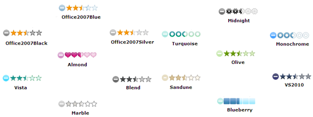

::: {style="DISPLAY: none"}
{#d2h_url_template}{#d2h_package_url style="WIDTH: 0px; DISPLAY: none; HEIGHT: 0px"}
:::

::: {.d2h_secondary_topic style="PADDING-BOTTOM: 10pt; MARGIN: 0pt; PADDING-LEFT: 0pt; PADDING-RIGHT: 0pt; PADDING-TOP: 0pt"}
##### Features of Rating Control {#features-of-rating-control style="tab-stops: 0pt"}

The various features of the Rating Control are:

###### 5.8.6.2.4.1 Definable Rating Range {#definable-rating-range style="tab-stops: 0pt"}

The rating control allows you to define a rating range by setting the rating intervals and the maximum rating value.

**Properties**

  --------------- ------------------------------------------------ ---------------------- ---------------------- ---------------------------------------------------------------------------------------------
  **Name**        **Description**                                  **Type of property**   **Value it accepts**   **Dependency**
  IncrementStep   Defines the rating interval between two stars.   double                 0 to double.MaxValue   IncrementValue cannot be greater than MaximumValue and cannot be less than or equal to zero
  MaximumValue    Defines the maximum value of the rating.         double                 0 to double.MaxValue   NA
  --------------- ------------------------------------------------ ---------------------- ---------------------- ---------------------------------------------------------------------------------------------

 

You can set the intervals and values for the rating control in two different ways-

 

**a.  ** **[Using ASPX]{style="FONT-FAMILY: 'Arial','sans-serif'"}**

Build and run the application using the following ASPX code:

 

+-----------------------------------------------------------------------------------------------------------------------------------------------------------------------------------------------------------------------------------------------------------------------------------------------------------------------------------------------------------------------------------------------------------+
| [\[ASPX\]            ]{style="FONT-FAMILY: 'Courier New'"}                                                                                                                                                                                                                                                                                                                                                |
|                                                                                                                                                                                                                                                                                                                                                                                                           |
| [\<]{style="FONT-FAMILY: 'Courier New'; COLOR: blue"}[syncfusion]{style="FONT-FAMILY: 'Courier New'; COLOR: maroon"}[:]{style="FONT-FAMILY: 'Courier New'; COLOR: blue"}[rating]{style="FONT-FAMILY: 'Courier New'; COLOR: maroon"}[ [runat]{style="COLOR: red"}[=\"server\" ]{style="COLOR: blue"}[AutoFormat]{style="COLOR: red"}[=\"Vista\"]{style="COLOR: blue"}]{style="FONT-FAMILY: 'Courier New'"} |
|                                                                                                                                                                                                                                                                                                                                                                                                           |
| [ [IncrementStep]{style="COLOR: red"}[=\"10\"]{style="COLOR: blue"} [MaximumValue]{style="COLOR: red"}[=\"100\"\>\</]{style="COLOR: blue"}[syncfusion]{style="COLOR: maroon"}[:]{style="COLOR: blue"}[rating]{style="COLOR: maroon"}[\>]{style="COLOR: blue"}]{style="FONT-FAMILY: 'Courier New'"}                                                                                                        |
|                                                                                                                                                                                                                                                                                                                                                                                                           |
| []{style="FONT-FAMILY: 'Courier New'"}                                                                                                                                                                                                                                                                                                                                                                    |
+-----------------------------------------------------------------------------------------------------------------------------------------------------------------------------------------------------------------------------------------------------------------------------------------------------------------------------------------------------------------------------------------------------------+

 

 

**b.  ** **[Using C# or VB code]{style="FONT-FAMILY: 'Arial','sans-serif'"}**

Build and run the application using either one of the following code snippets:

**[]{style="FONT-FAMILY: 'Calibri','sans-serif'; FONT-SIZE: 12pt"}** 

+------------------------------------------------------------------------------------------------------------------------------------------------------+
| [\[C#\]]{style="FONT-FAMILY: 'Courier New'"}                                                                                                         |
|                                                                                                                                                      |
| [      [Rating]{style="COLOR: #2b91af"} rating = [new]{style="COLOR: blue"} [Rating]{style="COLOR: #2b91af"}();]{style="FONT-FAMILY: 'Courier New'"} |
|                                                                                                                                                      |
| [        rating.ID = [\"rating1\"]{style="COLOR: #a31515"};]{style="FONT-FAMILY: 'Courier New'"}                                                     |
|                                                                                                                                                      |
| [        rating.AutoFormat = [Skins]{style="COLOR: #2b91af"}.Vista.ToString();]{style="FONT-FAMILY: 'Courier New'"}                                  |
|                                                                                                                                                      |
| [        rating.IncrementStep = 10;]{style="FONT-FAMILY: 'Courier New'"}                                                                             |
|                                                                                                                                                      |
| [        rating.MaximumValue = 100;]{style="FONT-FAMILY: 'Courier New'"}                                                                             |
|                                                                                                                                                      |
| [        [this]{style="COLOR: blue"}.Controls.Add(rating);]{style="FONT-FAMILY: 'Courier New'"}                                                      |
|                                                                                                                                                      |
| **[]{style="FONT-FAMILY: 'Courier New'"}**                                                                                                           |
+------------------------------------------------------------------------------------------------------------------------------------------------------+

**[]{style="FONT-FAMILY: 'Calibri','sans-serif'; FONT-SIZE: 12pt"}** 

 

+-----------------------------------------------------------------------------------------------------------------------------------------------------------------------+
| [\[VB\]]{style="FONT-FAMILY: 'Courier New'"}                                                                                                                          |
|                                                                                                                                                                       |
| [      [Dim]{style="COLOR: blue"} rating [As]{style="COLOR: blue"} [New]{style="COLOR: blue"} [Rating]{style="COLOR: #2b91af"}()]{style="FONT-FAMILY: 'Courier New'"} |
|                                                                                                                                                                       |
| [      rating.ID = \"rating1\"]{style="FONT-FAMILY: 'Courier New'"}                                                                                                   |
|                                                                                                                                                                       |
| [       rating.AutoFormat = [Skins]{style="COLOR: #2b91af"}.Vista.ToString()]{style="FONT-FAMILY: 'Courier New'"}                                                     |
|                                                                                                                                                                       |
| [      rating.IncrementStep = 10]{style="FONT-FAMILY: 'Courier New'"}                                                                                                 |
|                                                                                                                                                                       |
| [       rating.MaximumValue = 100]{style="FONT-FAMILY: 'Courier New'"}                                                                                                |
|                                                                                                                                                                       |
| [      [Me]{style="COLOR: blue"}.Controls.Add(rating)]{style="FONT-FAMILY: 'Courier New'"}                                                                            |
|                                                                                                                                                                       |
| []{style="FONT-FAMILY: 'Courier New'"}                                                                                                                                |
|                                                                                                                                                                       |
| []{style="FONT-FAMILY: 'Courier New'"}                                                                                                                                |
+-----------------------------------------------------------------------------------------------------------------------------------------------------------------------+

[The output is shown in the following figure where you can observe that 10 stars are each generated with values of 10 and a maximum value of 100.]{style="COLOR: black"}

{border="0"}[]{style="FONT-FAMILY: 'Calibri','sans-serif'; FONT-SIZE: 11pt"}

Figure 442: Rating with Customized Range

 

[]{style="COLOR: black"} 

###### 5.8.6.2.4.2 Default current values {#default-current-values style="tab-stops: 0pt"}

The rating control can be loaded with the following default value:

**Properties**

  -------------- ----------------------------------------------- ---------------------- ---------------------- ----------------------------------------------
  **Name**       **Description**                                 **Type of property**   **Value it accepts**   **Dependency**
  CurrentValue   Defines the value of the rating when loading.   double                 0 to double.MaxValue   CurrentValue should not exceed MaximumValue.
  -------------- ----------------------------------------------- ---------------------- ---------------------- ----------------------------------------------

 

You can load the rating control in two different ways-

**Using ASPX code**

Build and run the application using the following ASPX code:

 

+---------------------------------------------------------------------------------------------------------------------------------------------------------------------------------------------------------------------------------------------------------------------------------------------------------------------------------------------------------------------------------------------------------------------------------------------------------------------------------------------------------------------------------------------------------------------------------------------------------------------+
| [\[ASPX\]]{style="FONT-FAMILY: 'Courier New'"}                                                                                                                                                                                                                                                                                                                                                                                                                                                                                                                                                                      |
|                                                                                                                                                                                                                                                                                                                                                                                                                                                                                                                                                                                                                     |
| [\<]{style="FONT-FAMILY: 'Courier New'; COLOR: blue"}[syncfusion]{style="FONT-FAMILY: 'Courier New'; COLOR: maroon"}[:]{style="FONT-FAMILY: 'Courier New'; COLOR: blue"}[Rating]{style="FONT-FAMILY: 'Courier New'; COLOR: maroon"}[ [ID]{style="COLOR: red"}[=\"Rating1\"]{style="COLOR: blue"} [runat]{style="COLOR: red"}[=\"server\" ]{style="COLOR: blue"}[AutoFormat]{style="COLOR: red"}[=\"Vista\"]{style="COLOR: blue"} [CurrentValue]{style="COLOR: red"}[=\"1\"]{style="COLOR: blue"} [/\>]{style="COLOR: blue"}]{style="FONT-FAMILY: 'Courier New'"}[]{style="FONT-FAMILY: 'Courier New'; COLOR: blue"} |
|                                                                                                                                                                                                                                                                                                                                                                                                                                                                                                                                                                                                                     |
| []{style="FONT-FAMILY: 'Courier New'"}                                                                                                                                                                                                                                                                                                                                                                                                                                                                                                                                                                              |
+---------------------------------------------------------------------------------------------------------------------------------------------------------------------------------------------------------------------------------------------------------------------------------------------------------------------------------------------------------------------------------------------------------------------------------------------------------------------------------------------------------------------------------------------------------------------------------------------------------------------+

 

 

**Using C# or VB code**

Build and run the application using either one of the following code snippets:

 

+-----------------------------------------------------------------------------------------------------------------------------------------------------------------------------------------------------+
| [\[C#\]]{style="FONT-FAMILY: 'Courier New'"}                                                                                                                                                        |
|                                                                                                                                                                                                     |
| [               [Rating]{style="COLOR: #2b91af"} rating = [new]{style="COLOR: blue"} [Rating]{style="COLOR: #2b91af"}();]{style="FONT-FAMILY: 'Courier New'"}[]{style="FONT-FAMILY: 'Courier New'"} |
|                                                                                                                                                                                                     |
| [        rating.ID = [\"rating1\"]{style="COLOR: #a31515"};]{style="FONT-FAMILY: 'Courier New'"}                                                                                                    |
|                                                                                                                                                                                                     |
| [        rating.AutoFormat = [Skins]{style="COLOR: #2b91af"}.Vista. ToString();]{style="FONT-FAMILY: 'Courier New'"}                                                                                |
|                                                                                                                                                                                                     |
| [        rating.CurrentValue = 1;]{style="FONT-FAMILY: 'Courier New'"}                                                                                                                              |
|                                                                                                                                                                                                     |
| [        [this]{style="COLOR: blue"}.Controls.Add(rating);]{style="FONT-FAMILY: 'Courier New'"}                                                                                                     |
|                                                                                                                                                                                                     |
| []{style="FONT-FAMILY: 'Courier New'"}                                                                                                                                                              |
+-----------------------------------------------------------------------------------------------------------------------------------------------------------------------------------------------------+

[]{style="FONT-FAMILY: 'Times New Roman','serif'; FONT-SIZE: 12pt"} 

+--------------------------------------------------------------------------------------------------------------------------------------------------------------------------------------------------------------------+
| [\[VB\]]{style="FONT-FAMILY: 'Courier New'"}                                                                                                                                                                       |
|                                                                                                                                                                                                                    |
| [             [Dim]{style="COLOR: blue"} rating [As]{style="COLOR: blue"} [New]{style="COLOR: blue"} [Rating]{style="COLOR: #2b91af"}()]{style="FONT-FAMILY: 'Courier New'"}[]{style="FONT-FAMILY: 'Courier New'"} |
|                                                                                                                                                                                                                    |
| [      rating.ID = \"rating1\"]{style="FONT-FAMILY: 'Courier New'"}                                                                                                                                                |
|                                                                                                                                                                                                                    |
| [       rating.AutoFormat = [Skins]{style="COLOR: #2b91af"}.Vista ToString()]{style="FONT-FAMILY: 'Courier New'"}                                                                                                  |
|                                                                                                                                                                                                                    |
| [      rating.CurrentValue = 1]{style="FONT-FAMILY: 'Courier New'"}                                                                                                                                                |
|                                                                                                                                                                                                                    |
| [      [Me]{style="COLOR: blue"}.Controls.Add(rating)]{style="FONT-FAMILY: 'Courier New'"}                                                                                                                         |
|                                                                                                                                                                                                                    |
| []{style="FONT-FAMILY: 'Courier New'"}                                                                                                                                                                             |
+--------------------------------------------------------------------------------------------------------------------------------------------------------------------------------------------------------------------+

[]{style="FONT-FAMILY: 'Times New Roman','serif'; FONT-SIZE: 12pt"} 

The following figure shows the output.

{border="0"}[]{style="FONT-FAMILY: 'Calibri','sans-serif'; FONT-SIZE: 11pt"}

Figure 443: Rating with Default Value

 

###### [5.8.6.2.4.3       ]{style="FONT-FAMILY: 'Cambria','serif'"}Support for orientation[]{style="FONT-FAMILY: 'Cambria','serif'"} {#support-for-orientation style="tab-stops: 0pt"}

The rating control supports both horizontal and vertical orientations.

**Properties**

+-------------+-------------------------------------------------------------------+----------------------+--------------------------+----------------+
| **Name**    | **Description**                                                   | **Type of property** | **Value it accepts**     | **Dependency** |
+-------------+-------------------------------------------------------------------+----------------------+--------------------------+----------------+
| Orientation | Defines the orientation in which the control has to be generated. | enum                 | Horizontal,              | NA             |
|             |                                                                   |                      |                          |                |
|             |                                                                   |                      | Vertical                 |                |
|             |                                                                   |                      |                          |                |
|             |                                                                   |                      | Default value-Horizontal |                |
+-------------+-------------------------------------------------------------------+----------------------+--------------------------+----------------+

 

You can orient the rating control in two different ways:

 

**Using ASPX code:**

Build and run the application using the following ASPX code:

 

+---------------------------------------------------------------------------------------------------------------------------------------------------------------------------------------------------------------------------------------------------------------------------------------------------------------------------------------------------------------------------------------------------------------------------------------------------------------------------------------------------------------------------------------------------------------------------------------------------------------------------+
| [\[ASPX\]]{style="FONT-FAMILY: 'Courier New'"}                                                                                                                                                                                                                                                                                                                                                                                                                                                                                                                                                                            |
|                                                                                                                                                                                                                                                                                                                                                                                                                                                                                                                                                                                                                           |
| [\<]{style="FONT-FAMILY: 'Courier New'; COLOR: blue"}[syncfusion]{style="FONT-FAMILY: 'Courier New'; COLOR: maroon"}[:]{style="FONT-FAMILY: 'Courier New'; COLOR: blue"}[Rating]{style="FONT-FAMILY: 'Courier New'; COLOR: maroon"}[ [ID]{style="COLOR: red"}[=\"Rating1\"]{style="COLOR: blue"} [runat]{style="COLOR: red"}[=\"server\" ]{style="COLOR: blue"}[AutoFormat]{style="COLOR: red"}[=\"Vista\"]{style="COLOR: blue"} [Orientation]{style="COLOR: red"}[=\"Vertical\"]{style="COLOR: blue"} [/\>]{style="COLOR: blue"}]{style="FONT-FAMILY: 'Courier New'"}[]{style="FONT-FAMILY: 'Courier New'; COLOR: blue"} |
|                                                                                                                                                                                                                                                                                                                                                                                                                                                                                                                                                                                                                           |
| []{style="FONT-FAMILY: 'Courier New'"}                                                                                                                                                                                                                                                                                                                                                                                                                                                                                                                                                                                    |
+---------------------------------------------------------------------------------------------------------------------------------------------------------------------------------------------------------------------------------------------------------------------------------------------------------------------------------------------------------------------------------------------------------------------------------------------------------------------------------------------------------------------------------------------------------------------------------------------------------------------------+

 

 

**Using C# and VB code:**

Build and run the application using either one of the following code snippets:

+-----------------------------------------------------------------------------------------------------------------------------------------------------------------------------------------------------+
| [\[C#\]]{style="FONT-FAMILY: 'Courier New'"}                                                                                                                                                        |
|                                                                                                                                                                                                     |
| [               [Rating]{style="COLOR: #2b91af"} rating = [new]{style="COLOR: blue"} [Rating]{style="COLOR: #2b91af"}();]{style="FONT-FAMILY: 'Courier New'"}[]{style="FONT-FAMILY: 'Courier New'"} |
|                                                                                                                                                                                                     |
| [        rating.ID = [\"rating1\"]{style="COLOR: #a31515"};]{style="FONT-FAMILY: 'Courier New'"}                                                                                                    |
|                                                                                                                                                                                                     |
| [        rating.AutoFormat = [Skins]{style="COLOR: #2b91af"}.Vista.ToString();]{style="FONT-FAMILY: 'Courier New'"}                                                                                 |
|                                                                                                                                                                                                     |
| [        rating.Orientation = [Rating]{style="COLOR: #2b91af"}.[RatingOrietation]{style="COLOR: #2b91af"}.Vertical;]{style="FONT-FAMILY: 'Courier New'"}                                            |
|                                                                                                                                                                                                     |
| [        [this]{style="COLOR: blue"}.Controls.Add(rating);]{style="FONT-FAMILY: 'Courier New'"}                                                                                                     |
|                                                                                                                                                                                                     |
| []{style="FONT-FAMILY: 'Courier New'"}                                                                                                                                                              |
|                                                                                                                                                                                                     |
| []{style="FONT-FAMILY: 'Courier New'"}                                                                                                                                                              |
+-----------------------------------------------------------------------------------------------------------------------------------------------------------------------------------------------------+

 

+--------------------------------------------------------------------------------------------------------------------------------------------------------------------------------------------------------------------+
| [\[VB\]]{style="FONT-FAMILY: 'Courier New'"}                                                                                                                                                                       |
|                                                                                                                                                                                                                    |
| [             [Dim]{style="COLOR: blue"} rating [As]{style="COLOR: blue"} [New]{style="COLOR: blue"} [Rating]{style="COLOR: #2b91af"}()]{style="FONT-FAMILY: 'Courier New'"}[]{style="FONT-FAMILY: 'Courier New'"} |
|                                                                                                                                                                                                                    |
| [      rating.ID = \"rating1\"]{style="FONT-FAMILY: 'Courier New'"}                                                                                                                                                |
|                                                                                                                                                                                                                    |
| [       rating.AutoFormat = [Skins]{style="COLOR: #2b91af"}.Vista.ToString()]{style="FONT-FAMILY: 'Courier New'"}                                                                                                  |
|                                                                                                                                                                                                                    |
| [      rating.Orientation = [Rating]{style="COLOR: #2b91af"}.[RatingOrietation]{style="COLOR: #2b91af"}.Vertical]{style="FONT-FAMILY: 'Courier New'"}                                                              |
|                                                                                                                                                                                                                    |
| [      [Me]{style="COLOR: blue"}.Controls.Add(rating)]{style="FONT-FAMILY: 'Courier New'"}                                                                                                                         |
|                                                                                                                                                                                                                    |
| [   ]{style="FONT-FAMILY: 'Courier New'"}                                                                                                                                                                          |
+--------------------------------------------------------------------------------------------------------------------------------------------------------------------------------------------------------------------+

[[[]{style="TEXT-DECORATION: none"}]{style="COLOR: blue"}]{.underline} 

The following shows the rating control output.

{border="0"}[]{style="FONT-FAMILY: 'Calibri','sans-serif'; FONT-SIZE: 11pt"}

Figure 444: Rating Control with Vertical Orientation

[]{style="COLOR: black"} 

###### 5.8.6.2.4.4 Rating precision modes {#rating-precision-modes style="tab-stops: 0pt"}

[[[]{style="TEXT-DECORATION: none"}]{style="COLOR: blue"}]{.underline} 

The rating control supports three precision modes - Full, Half, and Exact - allowing end-users to give more precise ratings.

**Properties**

+-------------+---------------------------------------------------------------------+----------------------+----------------------+----------------+
| **Name**    | **Description**                                                     | **Type of property** | **Value it accepts** | **Dependency** |
+-------------+---------------------------------------------------------------------+----------------------+----------------------+----------------+
| Precision   | When set, this property allows the end-user to rate more precisely. | enum                 | Full,                | NA             |
|             |                                                                     |                      |                      |                |
|             |                                                                     |                      | Half,                |                |
|             |                                                                     |                      |                      |                |
|             |                                                                     |                      | Exact                |                |
|             |                                                                     |                      |                      |                |
|             |                                                                     |                      | Default value-Full   |                |
+-------------+---------------------------------------------------------------------+----------------------+----------------------+----------------+

[[[]{style="TEXT-DECORATION: none"}]{style="COLOR: blue"}]{.underline} 

You can choose your rating control mode using the following code snippets:

**Using ASPX code**

Build and run the application using the following ASPX code:

 

+------------------------------------------------------------------------------------------------------------------------------------------------------------------------------------------------------------------------------------------------------------------------------------------------------------------------------------------------------------------------------------------------------------------------------------------------------------------------------------------+
| [\[ASPX\]]{style="FONT-FAMILY: 'Courier New'"}                                                                                                                                                                                                                                                                                                                                                                                                                                           |
|                                                                                                                                                                                                                                                                                                                                                                                                                                                                                          |
| [            [\<]{style="COLOR: blue"}[syncfusion]{style="COLOR: maroon"}[:]{style="COLOR: blue"}[Rating]{style="COLOR: maroon"} [ID]{style="COLOR: red"}[=\"Rating1\"]{style="COLOR: blue"} [runat]{style="COLOR: red"}[=\"server\"]{style="COLOR: blue"} [AutoFormat]{style="COLOR: red"}[=\"Vista\"]{style="COLOR: blue"} [Precision]{style="COLOR: red"}[=\"Exact\"/\>]{style="COLOR: blue"}]{style="FONT-FAMILY: 'Courier New'"}[]{style="FONT-FAMILY: 'Courier New'; COLOR: blue"} |
|                                                                                                                                                                                                                                                                                                                                                                                                                                                                                          |
| []{style="FONT-FAMILY: 'Courier New'"}                                                                                                                                                                                                                                                                                                                                                                                                                                                   |
+------------------------------------------------------------------------------------------------------------------------------------------------------------------------------------------------------------------------------------------------------------------------------------------------------------------------------------------------------------------------------------------------------------------------------------------------------------------------------------------+

 

**Using C# or VB code**

Build and run the application using either one of the following code snippets:

+-----------------------------------------------------------------------------------------------------------------------------------------------------------------------------------------------------+
| [\[C#\]]{style="FONT-FAMILY: 'Courier New'"}                                                                                                                                                        |
|                                                                                                                                                                                                     |
| [               [Rating]{style="COLOR: #2b91af"} rating = [new]{style="COLOR: blue"} [Rating]{style="COLOR: #2b91af"}();]{style="FONT-FAMILY: 'Courier New'"}[]{style="FONT-FAMILY: 'Courier New'"} |
|                                                                                                                                                                                                     |
| [        rating.AutoFormat = [Skins]{style="COLOR: #2b91af"}.Vista.ToString();]{style="FONT-FAMILY: 'Courier New'"}                                                                                 |
|                                                                                                                                                                                                     |
| [        rating.Precision = [Rating]{style="COLOR: #2b91af"}.[RatingPrecision]{style="COLOR: #2b91af"}.Exact;]{style="FONT-FAMILY: 'Courier New'"}                                                  |
|                                                                                                                                                                                                     |
| [        [this]{style="COLOR: blue"}.Controls.Add(rating);]{style="FONT-FAMILY: 'Courier New'"}                                                                                                     |
|                                                                                                                                                                                                     |
| []{style="FONT-FAMILY: 'Courier New'"}                                                                                                                                                              |
+-----------------------------------------------------------------------------------------------------------------------------------------------------------------------------------------------------+

 

+--------------------------------------------------------------------------------------------------------------------------------------------------------------------------------------------------------------------+
| [\[VB\]]{style="FONT-FAMILY: 'Courier New'"}                                                                                                                                                                       |
|                                                                                                                                                                                                                    |
| [             [Dim]{style="COLOR: blue"} rating [As]{style="COLOR: blue"} [New]{style="COLOR: blue"} [Rating]{style="COLOR: #2b91af"}()]{style="FONT-FAMILY: 'Courier New'"}[]{style="FONT-FAMILY: 'Courier New'"} |
|                                                                                                                                                                                                                    |
| [      rating.AutoFormat = [Skins]{style="COLOR: #2b91af"}.Vista.ToString()]{style="FONT-FAMILY: 'Courier New'"}                                                                                                   |
|                                                                                                                                                                                                                    |
| [       rating.Precision = [Rating]{style="COLOR: #2b91af"}.[RatingPrecision]{style="COLOR: #2b91af"}.Exact]{style="FONT-FAMILY: 'Courier New'"}                                                                   |
|                                                                                                                                                                                                                    |
| [      [Me]{style="COLOR: blue"}.Controls.Add(rating)]{style="FONT-FAMILY: 'Courier New'"}                                                                                                                         |
|                                                                                                                                                                                                                    |
| []{style="FONT-FAMILY: 'Courier New'"}                                                                                                                                                                             |
+--------------------------------------------------------------------------------------------------------------------------------------------------------------------------------------------------------------------+

 

 

The following figure shows the rating control output.

{border="0"}[]{style="FONT-FAMILY: 'Calibri','sans-serif'; FONT-SIZE: 11pt"}

Figure 445: Rating with Exact Precision

 

###### 5.8.6.2.4.5 Rating in a read-only mode {#rating-in-a-read-only-mode style="tab-stops: 0pt"}

The rating control supports a read-only mode, so the control will display only a predefined value, preventing the end-user from issuing a rating or editing the existing rating.

**Properties**

  ---------- ----------------------------------------------------------------- ---------------------- ---------------------- ----------------
  **Name**   **Description**                                                   **Type of property**   **Value it accepts**   **Dependency**
  EditMode   When set to False, this property prevents end-user interaction.   bool                   true/false             NA
  ---------- ----------------------------------------------------------------- ---------------------- ---------------------- ----------------

 

You can set the rating as "read only" by using the following code snippets-

 

**Using ASPX code:**

Build and run the application using the following ASPX code:

 

+------------------------------------------------------------------------------------------------------------------------------------------------------------------------------------------------------------------------------------------------------------------------------------------------------------------------------------------------------------------------------------------------------------------------------------------------------------------------------------------------------------------------------------------------------------------------------+
| [\[ASPX\]]{style="FONT-FAMILY: 'Courier New'"}                                                                                                                                                                                                                                                                                                                                                                                                                                                                                                                               |
|                                                                                                                                                                                                                                                                                                                                                                                                                                                                                                                                                                              |
| [\<]{style="FONT-FAMILY: 'Courier New'; COLOR: blue"}[syncfusion]{style="FONT-FAMILY: 'Courier New'; COLOR: maroon"}[:]{style="FONT-FAMILY: 'Courier New'; COLOR: blue"}[Rating]{style="FONT-FAMILY: 'Courier New'; COLOR: maroon"}[ [ID]{style="COLOR: red"}[=\"Rating1\"]{style="COLOR: blue"} [runat]{style="COLOR: red"}[=\"server\"]{style="COLOR: blue"} [AutoFormat]{style="COLOR: red"}[=\"Vista\"]{style="COLOR: blue"} [Precision]{style="COLOR: red"}[=\"Exact\"]{style="COLOR: blue"}]{style="FONT-FAMILY: 'Courier New'"}[]{style="FONT-FAMILY: 'Courier New'"} |
|                                                                                                                                                                                                                                                                                                                                                                                                                                                                                                                                                                              |
| [ [CurrentValue]{style="COLOR: red"}[=\"3.7\"]{style="COLOR: blue"} [EditMode]{style="COLOR: red"}[=\"false\"]{style="COLOR: blue"} [/\>]{style="COLOR: blue"}]{style="FONT-FAMILY: 'Courier New'"}                                                                                                                                                                                                                                                                                                                                                                          |
|                                                                                                                                                                                                                                                                                                                                                                                                                                                                                                                                                                              |
| []{style="FONT-FAMILY: 'Courier New'"}                                                                                                                                                                                                                                                                                                                                                                                                                                                                                                                                       |
+------------------------------------------------------------------------------------------------------------------------------------------------------------------------------------------------------------------------------------------------------------------------------------------------------------------------------------------------------------------------------------------------------------------------------------------------------------------------------------------------------------------------------------------------------------------------------+

 

**Using C# or VB code:**

Build and run the application using either one of the following code snippets:

 

+-----------------------------------------------------------------------------------------------------------------------------------------------------------------------------------------------------+
| [\[C#\]]{style="FONT-FAMILY: 'Courier New'"}                                                                                                                                                        |
|                                                                                                                                                                                                     |
| [               [Rating]{style="COLOR: #2b91af"} rating = [new]{style="COLOR: blue"} [Rating]{style="COLOR: #2b91af"}();]{style="FONT-FAMILY: 'Courier New'"}[]{style="FONT-FAMILY: 'Courier New'"} |
|                                                                                                                                                                                                     |
| [        rating.AutoFormat = [Skins]{style="COLOR: #2b91af"}.Vista.ToString();]{style="FONT-FAMILY: 'Courier New'"}                                                                                 |
|                                                                                                                                                                                                     |
| [        rating.Precision = [Rating]{style="COLOR: #2b91af"}.[RatingPrecision]{style="COLOR: #2b91af"}.Exact;]{style="FONT-FAMILY: 'Courier New'"}                                                  |
|                                                                                                                                                                                                     |
| [        rating.CurrentValue = 3.5;]{style="FONT-FAMILY: 'Courier New'"}                                                                                                                            |
|                                                                                                                                                                                                     |
| [        rating.EditMode = [false]{style="COLOR: blue"};]{style="FONT-FAMILY: 'Courier New'"}                                                                                                       |
|                                                                                                                                                                                                     |
| [        [this]{style="COLOR: blue"}.Controls.Add(rating);]{style="FONT-FAMILY: 'Courier New'"}                                                                                                     |
|                                                                                                                                                                                                     |
| []{style="FONT-FAMILY: 'Courier New'"}                                                                                                                                                              |
+-----------------------------------------------------------------------------------------------------------------------------------------------------------------------------------------------------+

 

+--------------------------------------------------------------------------------------------------------------------------------------------------------------------------------------------------------------------+
| [\[VB\]]{style="FONT-FAMILY: 'Courier New'"}                                                                                                                                                                       |
|                                                                                                                                                                                                                    |
| [             [Dim]{style="COLOR: blue"} rating [As]{style="COLOR: blue"} [New]{style="COLOR: blue"} [Rating]{style="COLOR: #2b91af"}()]{style="FONT-FAMILY: 'Courier New'"}[]{style="FONT-FAMILY: 'Courier New'"} |
|                                                                                                                                                                                                                    |
| [      rating.AutoFormat = [Skins]{style="COLOR: #2b91af"}.Vista.ToString()]{style="FONT-FAMILY: 'Courier New'"}                                                                                                   |
|                                                                                                                                                                                                                    |
| [       rating.Precision = [Rating]{style="COLOR: #2b91af"}.[RatingPrecision]{style="COLOR: #2b91af"}.Exact]{style="FONT-FAMILY: 'Courier New'"}                                                                   |
|                                                                                                                                                                                                                    |
| [       rating.CurrentValue = 3.5]{style="FONT-FAMILY: 'Courier New'"}                                                                                                                                             |
|                                                                                                                                                                                                                    |
| [       rating.EditMode = [false]{style="COLOR: blue"}]{style="FONT-FAMILY: 'Courier New'"}                                                                                                                        |
|                                                                                                                                                                                                                    |
| [      [Me]{style="COLOR: blue"}.Controls.Add(rating)]{style="FONT-FAMILY: 'Courier New'"}                                                                                                                         |
|                                                                                                                                                                                                                    |
| []{style="FONT-FAMILY: 'Courier New'"}                                                                                                                                                                             |
+--------------------------------------------------------------------------------------------------------------------------------------------------------------------------------------------------------------------+

 

The following figure displays the read-only rating output.

{border="0"}[]{style="FONT-FAMILY: 'Calibri','sans-serif'; FONT-SIZE: 11pt"}

Figure 446: Rating as Read-Only

###### 5.8.6.2.4.6 Disabling the Reset Button and adding rating text {#disabling-the-reset-button-and-adding-rating-text style="tab-stops: 0pt"}

The rating control supports enabling the reset button to allow the end-user to reset the rating (making the rating value zero), or disabling it to prohibit this action.

**Properties**

  ---------------------------------------------------------------------------- ------------------------------------------------------------------------------------------------------------------------- ------------------------------------------------------------------------------ ---------------------------------------------------------------------------- --------------------------------------------------------------------
  Name                                                                         Description                                                                                                               Type of property                                                               Value it accepts                                                             Dependency
  AllowReset                                                                   When set to Single, this property allows only one node to be expanded at a time.                                          bool                                                                           True/False                                                                   This property is enabled only with EditMode set to True.
  [RatingText]{style="FONT-FAMILY: 'Calibri','sans-serif'; FONT-SIZE: 11pt"}   [[Allows the user to see the generic value of  each icon in the rating scale]{style="COLOR: black"}]{.apple-style-span}   [String array]{style="FONT-FAMILY: 'Calibri','sans-serif'; FONT-SIZE: 11pt"}   [Any string]{style="FONT-FAMILY: 'Calibri','sans-serif'; FONT-SIZE: 11pt"}   [NA]{style="FONT-FAMILY: 'Calibri','sans-serif'; FONT-SIZE: 11pt"}
  ---------------------------------------------------------------------------- ------------------------------------------------------------------------------------------------------------------------- ------------------------------------------------------------------------------ ---------------------------------------------------------------------------- --------------------------------------------------------------------

[[[]{style="TEXT-DECORATION: none"}]{style="COLOR: blue"}]{.underline} 

By default, the reset button is disabled.\
\
In order to keep the reset button disabled and to set rating text value, you can use either one of the following two ways-

 

**Using ASPX code-**

Build and run the application using the following ASPX code:

 

+--------------------------------------------------------------------------------------------------------------------------------------------------------------------------------------------------------------------------------------------------------------------------------------------------------------------------------------------------------------------------------------------------------------------------------------------------------------------------------------------------------------------------------------------------------------------------------------------------------------------------------------------------------------------------------------------------------------------+
| [\[ASPX\]]{style="FONT-FAMILY: 'Courier New'"}                                                                                                                                                                                                                                                                                                                                                                                                                                                                                                                                                                                                                                                                     |
|                                                                                                                                                                                                                                                                                                                                                                                                                                                                                                                                                                                                                                                                                                                    |
| [\<]{style="FONT-FAMILY: 'Courier New'; COLOR: blue"}[syncfusion]{style="FONT-FAMILY: 'Courier New'; COLOR: maroon"}[:]{style="FONT-FAMILY: 'Courier New'; COLOR: blue"}[Rating]{style="FONT-FAMILY: 'Courier New'; COLOR: maroon"}[ [ID]{style="COLOR: red"}[=\"Rating1\"]{style="COLOR: blue"} [runat]{style="COLOR: red"}[=\"server\" ]{style="COLOR: blue"}[RatingText]{style="COLOR: red"}[=\"nill,poor,average,good,excellent\"]{style="COLOR: blue"} [AutoFormat]{style="COLOR: red"}[=\"Vista\"]{style="COLOR: blue"} [AllowReset]{style="COLOR: red"}[=\"false\"]{style="COLOR: blue"} [/\>]{style="COLOR: blue"}]{style="FONT-FAMILY: 'Courier New'"}[]{style="FONT-FAMILY: 'Courier New'; COLOR: blue"} |
|                                                                                                                                                                                                                                                                                                                                                                                                                                                                                                                                                                                                                                                                                                                    |
| []{style="FONT-FAMILY: 'Courier New'"}                                                                                                                                                                                                                                                                                                                                                                                                                                                                                                                                                                                                                                                                             |
+--------------------------------------------------------------------------------------------------------------------------------------------------------------------------------------------------------------------------------------------------------------------------------------------------------------------------------------------------------------------------------------------------------------------------------------------------------------------------------------------------------------------------------------------------------------------------------------------------------------------------------------------------------------------------------------------------------------------+

 

 

**Using C# or VB code-**

Build and run the application using either one of the following code snippets:

 

+-----------------------------------------------------------------------------------------------------------------------------------------------------------------------------------------------------+
| [\[C#\]]{style="FONT-FAMILY: 'Courier New'"}                                                                                                                                                        |
|                                                                                                                                                                                                     |
| [               [Rating]{style="COLOR: #2b91af"} rating = [new]{style="COLOR: blue"} [Rating]{style="COLOR: #2b91af"}();]{style="FONT-FAMILY: 'Courier New'"}[]{style="FONT-FAMILY: 'Courier New'"} |
|                                                                                                                                                                                                     |
| [        rating.AutoFormat = [Skins]{style="COLOR: #2b91af"}.Vista.ToString();]{style="FONT-FAMILY: 'Courier New'"}                                                                                 |
|                                                                                                                                                                                                     |
| [        rating.AllowReset = [false]{style="COLOR: blue"};]{style="FONT-FAMILY: 'Courier New'"}                                                                                                     |
|                                                                                                                                                                                                     |
| [        Rating1.RatingText = [\"nil,poor,average,good,excellent\"]{style="COLOR: #a31515"};]{style="FONT-FAMILY: 'Courier New'"}                                                                   |
|                                                                                                                                                                                                     |
| [        [this]{style="COLOR: blue"}.Controls.Add(rating);]{style="FONT-FAMILY: 'Courier New'"}                                                                                                     |
|                                                                                                                                                                                                     |
| []{style="FONT-FAMILY: 'Courier New'"}                                                                                                                                                              |
+-----------------------------------------------------------------------------------------------------------------------------------------------------------------------------------------------------+

 

+--------------------------------------------------------------------------------------------------------------------------------------------------------------------------------------------------------------------+
| [\[VB\]]{style="FONT-FAMILY: 'Courier New'"}                                                                                                                                                                       |
|                                                                                                                                                                                                                    |
| [             [Dim]{style="COLOR: blue"} rating [As]{style="COLOR: blue"} [New]{style="COLOR: blue"} [Rating]{style="COLOR: #2b91af"}()]{style="FONT-FAMILY: 'Courier New'"}[]{style="FONT-FAMILY: 'Courier New'"} |
|                                                                                                                                                                                                                    |
| [      rating.AutoFormat = [Skins]{style="COLOR: #2b91af"}.Vista.ToString()]{style="FONT-FAMILY: 'Courier New'"}                                                                                                   |
|                                                                                                                                                                                                                    |
| [       rating.AllowReset = [false]{style="COLOR: blue"}]{style="FONT-FAMILY: 'Courier New'"}                                                                                                                      |
|                                                                                                                                                                                                                    |
| [       Rating1.RatingText = [\"nil,poor,average,good,excellent\"]{style="COLOR: #a31515"}]{style="FONT-FAMILY: 'Courier New'"}                                                                                    |
|                                                                                                                                                                                                                    |
| [      [Me]{style="COLOR: blue"}.Controls.Add(rating)]{style="FONT-FAMILY: 'Courier New'"}                                                                                                                         |
|                                                                                                                                                                                                                    |
| []{style="FONT-FAMILY: 'Courier New'"}                                                                                                                                                                             |
+--------------------------------------------------------------------------------------------------------------------------------------------------------------------------------------------------------------------+

 

The figure shows the reset button output. 

{border="0"}[]{style="FONT-FAMILY: 'Calibri','sans-serif'; FONT-SIZE: 11pt"}

Figure 447: Rating with Reset Button Disabled and Rating string value added

 

###### 5.8.6.2.4.7 [[Enabling Auto-Post-Back]{style="COLOR: #4f81bd"}](http://help.syncfusion.com/ug_92/User%20Interface/ASP.NET%20MVC/Tools/Documents/enablingautopostback.htm) {#enabling-auto-post-back style="tab-stops: 0pt"}

The rating control supports auto-post-back so that server-side actions can be called when a value changes. This is useful when performing database updates and parallel actions based on rating value.

**[Properties]{style="FONT-FAMILY: 'Calibri','sans-serif'; FONT-SIZE: 12pt"}**

  -------------- ----------------------------------------------------------------------------------------------------------- ---------------------- ---------------------- ----------------
  **Name**       **Description**                                                                                             **Type of property**   **Value it accepts**   **Dependency**
  AutoPostBack   When set, this property sends a post request to the action defined by RequestMapper when a value changes.   bool                   True/False             NA
  -------------- ----------------------------------------------------------------------------------------------------------- ---------------------- ---------------------- ----------------

[[[]{style="TEXT-DECORATION: none"}]{style="COLOR: blue"}]{.underline} 

 

**Using ASPX code-**

Build and run the application using the following ASPX code:

 

+------------------------------------------------------------------------------------------------------------------------------------------------------------------------------------------------------------------------------------------------------------------------------------------------------------------------------------------------------------------------------------------------------------------------------------------------------------------------------------------------------------------------------------------------------------------------------------------------------------------------+
| [\[ASPX\]]{style="FONT-FAMILY: 'Courier New'"}                                                                                                                                                                                                                                                                                                                                                                                                                                                                                                                                                                         |
|                                                                                                                                                                                                                                                                                                                                                                                                                                                                                                                                                                                                                        |
| [\<]{style="FONT-FAMILY: 'Courier New'; COLOR: blue"}[syncfusion]{style="FONT-FAMILY: 'Courier New'; COLOR: maroon"}[:]{style="FONT-FAMILY: 'Courier New'; COLOR: blue"}[Rating]{style="FONT-FAMILY: 'Courier New'; COLOR: maroon"}[ [ID]{style="COLOR: red"}[=\"Rating1\"]{style="COLOR: blue"} [runat]{style="COLOR: red"}[=\"server\"]{style="COLOR: blue"} [AutoFormat]{style="COLOR: red"}[=\"Vista\"]{style="COLOR: blue"} [AutoPostBack]{style="COLOR: red"}[=\"true\"]{style="COLOR: blue"} [/\>]{style="COLOR: blue"}]{style="FONT-FAMILY: 'Courier New'"}[]{style="FONT-FAMILY: 'Courier New'; COLOR: blue"} |
|                                                                                                                                                                                                                                                                                                                                                                                                                                                                                                                                                                                                                        |
| []{style="FONT-FAMILY: 'Courier New'"}                                                                                                                                                                                                                                                                                                                                                                                                                                                                                                                                                                                 |
+------------------------------------------------------------------------------------------------------------------------------------------------------------------------------------------------------------------------------------------------------------------------------------------------------------------------------------------------------------------------------------------------------------------------------------------------------------------------------------------------------------------------------------------------------------------------------------------------------------------------+

 

**Using C# or VB code-**

Build and run the application using either one of the following code snippets:

 

+-----------------------------------------------------------------------------------------------------------------------------------------------------------------------------------------------------+
| [\[C#\]]{style="FONT-FAMILY: 'Courier New'"}                                                                                                                                                        |
|                                                                                                                                                                                                     |
| [               [Rating]{style="COLOR: #2b91af"} rating = [new]{style="COLOR: blue"} [Rating]{style="COLOR: #2b91af"}();]{style="FONT-FAMILY: 'Courier New'"}[]{style="FONT-FAMILY: 'Courier New'"} |
|                                                                                                                                                                                                     |
| [        rating.AutoFormat = [Skins]{style="COLOR: #2b91af"}.Vista.ToString();]{style="FONT-FAMILY: 'Courier New'"}                                                                                 |
|                                                                                                                                                                                                     |
| [        rating.AutoPostBack = [true]{style="COLOR: blue"};]{style="FONT-FAMILY: 'Courier New'"}                                                                                                    |
|                                                                                                                                                                                                     |
| [        [this]{style="COLOR: blue"}.Controls.Add(rating);]{style="FONT-FAMILY: 'Courier New'"}                                                                                                     |
|                                                                                                                                                                                                     |
| []{style="FONT-FAMILY: 'Courier New'"}                                                                                                                                                              |
+-----------------------------------------------------------------------------------------------------------------------------------------------------------------------------------------------------+

 

+--------------------------------------------------------------------------------------------------------------------------------------------------------------------------------------------------------------------+
| [\[VB\]]{style="FONT-FAMILY: 'Courier New'"}                                                                                                                                                                       |
|                                                                                                                                                                                                                    |
| [             [Dim]{style="COLOR: blue"} rating [As]{style="COLOR: blue"} [New]{style="COLOR: blue"} [Rating]{style="COLOR: #2b91af"}()]{style="FONT-FAMILY: 'Courier New'"}[]{style="FONT-FAMILY: 'Courier New'"} |
|                                                                                                                                                                                                                    |
| [      rating.AutoFormat = [Skins]{style="COLOR: #2b91af"}.Vista.ToString()]{style="FONT-FAMILY: 'Courier New'"}                                                                                                   |
|                                                                                                                                                                                                                    |
| [       rating.AutoPostBack = [true]{style="COLOR: blue"}]{style="FONT-FAMILY: 'Courier New'"}                                                                                                                     |
|                                                                                                                                                                                                                    |
| [      [Me]{style="COLOR: blue"}.Controls.Add(rating)]{style="FONT-FAMILY: 'Courier New'"}                                                                                                                         |
|                                                                                                                                                                                                                    |
| []{style="FONT-FAMILY: 'Courier New'"}                                                                                                                                                                             |
+--------------------------------------------------------------------------------------------------------------------------------------------------------------------------------------------------------------------+

[]{style="COLOR: black"} 

###### [5.8.6.2.4.8       ]{style="FONT-FAMILY: 'Cambria','serif'; COLOR: #4f81bd"}Appearance[]{style="FONT-FAMILY: 'Cambria','serif'; COLOR: #4f81bd"} {#appearance style="tab-stops: 0pt"}

The rating control supports fourteen predefined skins to enhance the look and feel.

**Properties**

+-------------+---------------------------------------+----------------------------------+------------------------+-------------+
| Name        | Description                           | Type of property                 | Value it accepts       | Dependency  |
+-------------+---------------------------------------+----------------------------------+------------------------+-------------+
| AutoFormat  | Used to define the Syncfusion themes. | [enum]{style="FONT-SIZE: 9.5pt"} | Office2007Blue,        | NA          |
|             |                                       |                                  |                        |             |
|             |                                       |                                  | Office2007Silver,      |             |
|             |                                       |                                  |                        |             |
|             |                                       |                                  | Office2007Black,       |             |
|             |                                       |                                  |                        |             |
|             |                                       |                                  | Vista,                 |             |
|             |                                       |                                  |                        |             |
|             |                                       |                                  | Almond,                |             |
|             |                                       |                                  |                        |             |
|             |                                       |                                  | Blueberry,             |             |
|             |                                       |                                  |                        |             |
|             |                                       |                                  | Blend,                 |             |
|             |                                       |                                  |                        |             |
|             |                                       |                                  | Olive,                 |             |
|             |                                       |                                  |                        |             |
|             |                                       |                                  | Turquoise,             |             |
|             |                                       |                                  |                        |             |
|             |                                       |                                  | Monochrome,            |             |
|             |                                       |                                  |                        |             |
|             |                                       |                                  | Sandune,               |             |
|             |                                       |                                  |                        |             |
|             |                                       |                                  | VS2010,                |             |
|             |                                       |                                  |                        |             |
|             |                                       |                                  | Marble,                |             |
|             |                                       |                                  |                        |             |
|             |                                       |                                  | Midnight               |             |
|             |                                       |                                  |                        |             |
|             |                                       |                                  | Default-Office2007Blue |             |
+-------------+---------------------------------------+----------------------------------+------------------------+-------------+

 

**Using ASPX code-**

Build and run the application using the following ASPX code:

 

+------------------------------------------------------------------------------------------------------------------------------------------------------------------------------------------------------------------------------------------------------------------------------------------------------------------------------------------------------------------------------------------------------------------------------------------------------------------------------------------------------------------------------------------------------+
| [\[ASPX\]]{style="FONT-FAMILY: 'Courier New'"}                                                                                                                                                                                                                                                                                                                                                                                                                                                                                                       |
|                                                                                                                                                                                                                                                                                                                                                                                                                                                                                                                                                      |
| [\<]{style="FONT-FAMILY: 'Courier New'; COLOR: blue"}[syncfusion]{style="FONT-FAMILY: 'Courier New'; COLOR: maroon"}[:]{style="FONT-FAMILY: 'Courier New'; COLOR: blue"}[Rating]{style="FONT-FAMILY: 'Courier New'; COLOR: maroon"}[ [ID]{style="COLOR: red"}[=\"Rating1\"]{style="COLOR: blue"} [runat]{style="COLOR: red"}[=\"server\"]{style="COLOR: blue"} [AutoFormat]{style="COLOR: red"}[=\"Almond\"]{style="COLOR: blue"} [/\>]{style="COLOR: blue"}]{style="FONT-FAMILY: 'Courier New'"}[]{style="FONT-FAMILY: 'Courier New'; COLOR: blue"} |
|                                                                                                                                                                                                                                                                                                                                                                                                                                                                                                                                                      |
| []{style="FONT-FAMILY: 'Courier New'"}                                                                                                                                                                                                                                                                                                                                                                                                                                                                                                               |
+------------------------------------------------------------------------------------------------------------------------------------------------------------------------------------------------------------------------------------------------------------------------------------------------------------------------------------------------------------------------------------------------------------------------------------------------------------------------------------------------------------------------------------------------------+

 

**Using C# or VB code-**

Build and run the application using either one of the following code snippets:

 

+--------------------------------------------------------------------------------------------------------------------------------------------------------------------------------------------+
| [\[C#\]]{style="FONT-FAMILY: 'Courier New'"}                                                                                                                                               |
|                                                                                                                                                                                            |
| [      [Rating]{style="COLOR: #2b91af"} rating = [new]{style="COLOR: blue"} [Rating]{style="COLOR: #2b91af"}();]{style="FONT-FAMILY: 'Courier New'"}[]{style="FONT-FAMILY: 'Courier New'"} |
|                                                                                                                                                                                            |
| [   rating.AutoFormat = [Skins]{style="COLOR: #2b91af"}.Almond.ToString();]{style="FONT-FAMILY: 'Courier New'"}                                                                            |
|                                                                                                                                                                                            |
| []{style="FONT-FAMILY: 'Courier New'"}                                                                                                                                                     |
+--------------------------------------------------------------------------------------------------------------------------------------------------------------------------------------------+

 

+-------------------------------------------------------------------------------------------------------------------------------------------------------------------------------------------------------------+
| [\[VB\]]{style="FONT-FAMILY: 'Courier New'"}                                                                                                                                                                |
|                                                                                                                                                                                                             |
| [      [Dim]{style="COLOR: blue"} rating [As]{style="COLOR: blue"} [New]{style="COLOR: blue"} [Rating]{style="COLOR: #2b91af"}()]{style="FONT-FAMILY: 'Courier New'"}[]{style="FONT-FAMILY: 'Courier New'"} |
|                                                                                                                                                                                                             |
| [      rating.AutoFormat = [Skins]{style="COLOR: #2b91af"}.Almond.ToString()]{style="FONT-FAMILY: 'Courier New'"}                                                                                           |
+-------------------------------------------------------------------------------------------------------------------------------------------------------------------------------------------------------------+

 

The following shows the fourteen Syncfusion themes used for ratings[.]{style="FONT-FAMILY: 'Times New Roman','serif'; FONT-SIZE: 12pt"}

{border="0"}[]{style="FONT-FAMILY: 'Calibri','sans-serif'; FONT-SIZE: 11pt"}

Figure 448: Rating Themes

[]{#related-topics}
:::
