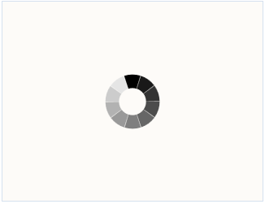
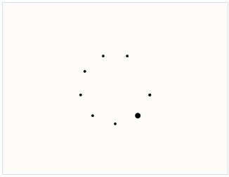
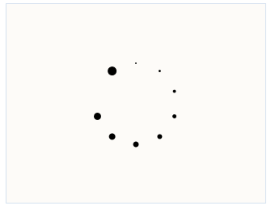
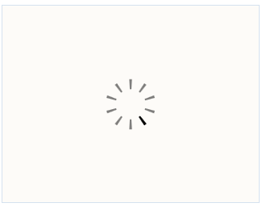
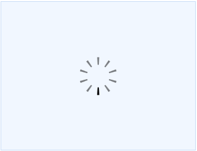
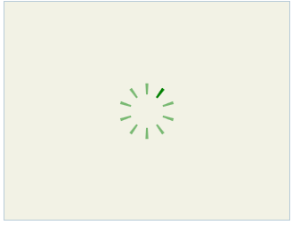

::: {style="DISPLAY: none"}
{#d2h_url_template}{#d2h_package_url style="WIDTH: 0px; DISPLAY: none; HEIGHT: 0px"}
:::

:::: {.d2h_secondary_topic style="PADDING-BOTTOM: 10pt; MARGIN: 0pt; PADDING-LEFT: 0pt; PADDING-RIGHT: 0pt; PADDING-TOP: 0pt"}
##### Features of the Waiting pop-up in HTML5 {#features-of-the-waiting-pop-up-in-html5 style="tab-stops: 0pt"}

The waiting Pop-up in HTML5 has a couple of features that distinguish it from the ordinary Waiting Pop-up control in MVC tools:

###### 5.30.2.4.3.1        Shapes {#shapes style="tab-stops: 0pt"}

There are 4 in-built shapes for Waiting Pop-up in HTML5. These must be used instead of the in-built images that are used in the ordinary Waiting Pop-up control.

The shapes in question are:

[·      ]{style="FONT-FAMILY: Symbol"}SquaresCircle

The following image gives an idea as to what this shape looks like:

[]{style="COLOR: black"} 

{border="0"}

Figure 341: Square Circle

 

[·      ]{style="FONT-FAMILY: Symbol"}BigCircleBall

The BigCircleBall shape looks like this:

 

{border="0"}

Figure 342: BigCircleBall[]{style="COLOR: black"}

[]{style="COLOR: black"} 

[]{style="COLOR: black"} 

[]{style="COLOR: black"} 

[·      ]{style="FONT-FAMILY: Symbol"}BigRoller

[The BigRollerl shape looks like this:]{style="COLOR: black"}

[]{style="COLOR: black"} 

{border="0"}

Figure 343: BigRoller

[]{style="COLOR: black"} 

[·      ]{style="FONT-FAMILY: Symbol"}IndicatorBig2

[The following image shows you what this shape looks like:]{style="COLOR: black"}

[]{style="COLOR: black"} 

{border="0"}

Figure 344: IndicatorBig2[]{style="COLOR: black"}

 

::: {style="BORDER-BOTTOM: windowtext 1pt solid; BORDER-LEFT: medium none; PADDING-BOTTOM: 1pt; MARGIN-TOP: 9pt; PADDING-LEFT: 0pt; PADDING-RIGHT: 0pt; MARGIN-BOTTOM: 9pt; BORDER-TOP: windowtext 1pt solid; BORDER-RIGHT: medium none; PADDING-TOP: 1pt"}
Note: Custom shapes are not supported.
:::

 

You can enable the Shapes in the Waiting pop-up using HTML5 if you follow either of the procedures given below:

Using Builder:

1.   In **View**, create the target element over which the waiting pop-up is to be displayed.

2.   Invoke the waiting pop-up helper followed by the **TargetId** method with the ID of the target element as an argument.

 

 

+---------------------------------------------------------------------------------------------------------------------------------------------------------------------------------------------------------------------------------------------------------------------------------------------------------------------------------------------------------------------------------------------------------------------------------------------------------------------------------+
| **[\[ASPX\]]{style="FONT-FAMILY: 'Courier New'"}**                                                                                                                                                                                                                                                                                                                                                                                                                              |
|                                                                                                                                                                                                                                                                                                                                                                                                                                                                                 |
| [  ]{style="COLOR: black"}[\<]{style="COLOR: blue"}[div]{style="COLOR: maroon"}[ ]{style="COLOR: black"}[style]{style="COLOR: red"}[=\"]{style="COLOR: blue"}[border]{style="COLOR: red"}[: 1px solid #BDD4F0;]{style="COLOR: blue"}[ height]{style="COLOR: red"}[: 225px;]{style="COLOR: blue"}[ width]{style="COLOR: red"}[: 300px;\"]{style="COLOR: blue"}[ ]{style="COLOR: black"}[id]{style="COLOR: red"}[=\"updatePanel\"\>]{style="COLOR: blue"}[]{style="COLOR: black"} |
|                                                                                                                                                                                                                                                                                                                                                                                                                                                                                 |
| [    ]{style="COLOR: black"}[\</]{style="COLOR: blue"}[div]{style="COLOR: maroon"}[\>]{style="COLOR: blue"}[]{style="COLOR: black"}                                                                                                                                                                                                                                                                                                                                             |
|                                                                                                                                                                                                                                                                                                                                                                                                                                                                                 |
| **[]{style="FONT-FAMILY: 'Courier New'"}**                                                                                                                                                                                                                                                                                                                                                                                                                                      |
|                                                                                                                                                                                                                                                                                                                                                                                                                                                                                 |
| [ [\<%]{style="BACKGROUND: yellow"}]{style="COLOR: black"}[=]{style="COLOR: blue"}[Html.Syncfusion().WaitingPopup(]{style="COLOR: black"}[\"mypopup\"]{style="COLOR: #a31515"}[)]{style="COLOR: black"}                                                                                                                                                                                                                                                                         |
|                                                                                                                                                                                                                                                                                                                                                                                                                                                                                 |
| [   .AutoDisplay(]{style="COLOR: black"}[true]{style="COLOR: blue"}[)]{style="COLOR: black"}                                                                                                                                                                                                                                                                                                                                                                                    |
|                                                                                                                                                                                                                                                                                                                                                                                                                                                                                 |
| [   .EnableHTML5(]{style="COLOR: black"}[true]{style="COLOR: blue"}[)]{style="COLOR: black"}                                                                                                                                                                                                                                                                                                                                                                                    |
|                                                                                                                                                                                                                                                                                                                                                                                                                                                                                 |
| [   .ShapeHeight(200)]{style="COLOR: black"}                                                                                                                                                                                                                                                                                                                                                                                                                                    |
|                                                                                                                                                                                                                                                                                                                                                                                                                                                                                 |
| [   .ShapeWidth(200)   ]{style="COLOR: black"}                                                                                                                                                                                                                                                                                                                                                                                                                                  |
|                                                                                                                                                                                                                                                                                                                                                                                                                                                                                 |
| [   [.Shape(]{style="BACKGROUND: #f2f2f2"}]{style="COLOR: black"}[WaitingPopupShape]{style="BACKGROUND: #f2f2f2; COLOR: #2b91af"}[.]{style="BACKGROUND: #f2f2f2; COLOR: black"}[IndicatorBig2]{style="FONT-FAMILY: Consolas; BACKGROUND: #f2f2f2; COLOR: black"}[)]{style="COLOR: black"}                                                                                                                                                                                       |
|                                                                                                                                                                                                                                                                                                                                                                                                                                                                                 |
| [   .TargetId(]{style="COLOR: black"}[\"]{style="COLOR: #a31515"}[updatePanel]{style="COLOR: #943634"}[\"]{style="COLOR: #a31515"}[)]{style="COLOR: black"}                                                                                                                                                                                                                                                                                                                     |
|                                                                                                                                                                                                                                                                                                                                                                                                                                                                                 |
| [%\>]{style="BACKGROUND: yellow; COLOR: black"}[]{style="COLOR: black"}                                                                                                                                                                                                                                                                                                                                                                                                         |
|                                                                                                                                                                                                                                                                                                                                                                                                                                                                                 |
| **[]{style="FONT-SIZE: 12pt"}**                                                                                                                                                                                                                                                                                                                                                                                                                                                 |
+---------------------------------------------------------------------------------------------------------------------------------------------------------------------------------------------------------------------------------------------------------------------------------------------------------------------------------------------------------------------------------------------------------------------------------------------------------------------------------+

 

+---------------------------------------------------------------------------------------------------------------------------------------------------------------------------------------------------------------------------------------------------------------------------------------------------------------------------------------------------------------------------------------------------------------------------------------------------------------------------------+
| **[\[Razor\]]{style="FONT-FAMILY: 'Courier New'"}**                                                                                                                                                                                                                                                                                                                                                                                                                             |
|                                                                                                                                                                                                                                                                                                                                                                                                                                                                                 |
| [  ]{style="COLOR: black"}[\<]{style="COLOR: blue"}[div]{style="COLOR: maroon"}[ ]{style="COLOR: black"}[style]{style="COLOR: red"}[=\"]{style="COLOR: blue"}[border]{style="COLOR: red"}[: 1px solid #BDD4F0;]{style="COLOR: blue"}[ height]{style="COLOR: red"}[: 225px;]{style="COLOR: blue"}[ width]{style="COLOR: red"}[: 300px;\"]{style="COLOR: blue"}[ ]{style="COLOR: black"}[id]{style="COLOR: red"}[=\"updatePanel\"\>]{style="COLOR: blue"}[]{style="COLOR: black"} |
|                                                                                                                                                                                                                                                                                                                                                                                                                                                                                 |
| [    ]{style="COLOR: black"}[\</]{style="COLOR: blue"}[div]{style="COLOR: maroon"}[\>]{style="COLOR: blue"}[]{style="COLOR: black"}                                                                                                                                                                                                                                                                                                                                             |
|                                                                                                                                                                                                                                                                                                                                                                                                                                                                                 |
| **[]{style="FONT-FAMILY: 'Courier New'"}**                                                                                                                                                                                                                                                                                                                                                                                                                                      |
|                                                                                                                                                                                                                                                                                                                                                                                                                                                                                 |
| [ [\@{]{style="BACKGROUND: yellow"}]{style="FONT-FAMILY: 'Courier New'; COLOR: black"}                                                                                                                                                                                                                                                                                                                                                                                          |
|                                                                                                                                                                                                                                                                                                                                                                                                                                                                                 |
| [    Html.Syncfusion().WaitingPopup(]{style="FONT-FAMILY: 'Courier New'; COLOR: black"}[\"mypopup\"]{style="FONT-FAMILY: 'Courier New'; COLOR: #a31515"}[)]{style="FONT-FAMILY: 'Courier New'; COLOR: black"}                                                                                                                                                                                                                                                                   |
|                                                                                                                                                                                                                                                                                                                                                                                                                                                                                 |
| [    .AutoDisplay(]{style="FONT-FAMILY: 'Courier New'; COLOR: black"}[true]{style="FONT-FAMILY: 'Courier New'; COLOR: blue"}[)]{style="FONT-FAMILY: 'Courier New'; COLOR: black"}[    ]{style="FONT-FAMILY: Consolas; COLOR: black"}[]{style="FONT-FAMILY: 'Courier New'; COLOR: black"}                                                                                                                                                                                        |
|                                                                                                                                                                                                                                                                                                                                                                                                                                                                                 |
| [    .EnableHTML5(]{style="FONT-FAMILY: 'Courier New'; COLOR: black"}[true]{style="FONT-FAMILY: 'Courier New'; COLOR: blue"}[)]{style="FONT-FAMILY: 'Courier New'; COLOR: black"}                                                                                                                                                                                                                                                                                               |
|                                                                                                                                                                                                                                                                                                                                                                                                                                                                                 |
| [    .ShapeHeight(200)]{style="FONT-FAMILY: 'Courier New'; COLOR: black"}                                                                                                                                                                                                                                                                                                                                                                                                       |
|                                                                                                                                                                                                                                                                                                                                                                                                                                                                                 |
| [    .ShapeWidth(200)]{style="FONT-FAMILY: 'Courier New'; COLOR: black"}                                                                                                                                                                                                                                                                                                                                                                                                        |
|                                                                                                                                                                                                                                                                                                                                                                                                                                                                                 |
| [ [   .Shape(]{style="BACKGROUND: #f2f2f2"}]{style="COLOR: black"}[WaitingPopupShape]{style="BACKGROUND: #f2f2f2; COLOR: #2b91af"}[.]{style="BACKGROUND: #f2f2f2; COLOR: black"}[IndicatorBig2]{style="FONT-FAMILY: Consolas; BACKGROUND: #f2f2f2; COLOR: black"}[)]{style="COLOR: black"}                                                                                                                                                                                      |
|                                                                                                                                                                                                                                                                                                                                                                                                                                                                                 |
| [    .TargetId(]{style="FONT-FAMILY: 'Courier New'; COLOR: black"}[\"]{style="FONT-FAMILY: 'Courier New'; COLOR: #a31515"}[updatePanel]{style="FONT-FAMILY: 'Courier New'; COLOR: #943634"}[\"]{style="FONT-FAMILY: 'Courier New'; COLOR: #a31515"}[)]{style="FONT-FAMILY: 'Courier New'; COLOR: black"}                                                                                                                                                                        |
|                                                                                                                                                                                                                                                                                                                                                                                                                                                                                 |
| [    .Render();]{style="FONT-FAMILY: 'Courier New'; COLOR: black"}                                                                                                                                                                                                                                                                                                                                                                                                              |
|                                                                                                                                                                                                                                                                                                                                                                                                                                                                                 |
| [}]{style="FONT-FAMILY: 'Courier New'; BACKGROUND: yellow; COLOR: black"}[]{style="FONT-FAMILY: 'Courier New'; COLOR: black"}                                                                                                                                                                                                                                                                                                                                                   |
|                                                                                                                                                                                                                                                                                                                                                                                                                                                                                 |
| **[]{style="FONT-SIZE: 12pt"}**                                                                                                                                                                                                                                                                                                                                                                                                                                                 |
+---------------------------------------------------------------------------------------------------------------------------------------------------------------------------------------------------------------------------------------------------------------------------------------------------------------------------------------------------------------------------------------------------------------------------------------------------------------------------------+

**[]{style="FONT-SIZE: 12pt"}** 

3.   Build and run the application.

 

 

Using Properties Model

1.   In the controller, create an instance of **WaitingPopupModel**.**

2.   Define **TargetId** and pass the instance through the **view-specific data** to the **view**.**

 

+-------------------------------------------------------------------------------------------------------------------------------------------------------------------------------------------------------------------------------------------+
| **[\[Controller\]]{style="FONT-FAMILY: 'Courier New'"}**                                                                                                                                                                                  |
|                                                                                                                                                                                                                                           |
| [  ]{style="COLOR: black"}[public]{style="COLOR: blue"}[ ]{style="COLOR: black"}[ActionResult]{style="COLOR: #2b91af"}[ Index()]{style="COLOR: black"}                                                                                    |
|                                                                                                                                                                                                                                           |
| [        {]{style="COLOR: black"}                                                                                                                                                                                                         |
|                                                                                                                                                                                                                                           |
| [            ]{style="COLOR: black"}[WaitingPopupModel]{style="COLOR: #2b91af"}[ model = ]{style="COLOR: black"}[new]{style="COLOR: blue"}[ ]{style="COLOR: black"}[WaitingPopupModel]{style="COLOR: #2b91af"}[();]{style="COLOR: black"} |
|                                                                                                                                                                                                                                           |
| [            model.AutoDisplay = ]{style="COLOR: black"}[true]{style="COLOR: blue"}[;]{style="COLOR: black"}                                                                                                                              |
|                                                                                                                                                                                                                                           |
| [            model.EnableHTML5 = ]{style="COLOR: black"}[true]{style="COLOR: blue"}[;]{style="COLOR: black"}                                                                                                                              |
|                                                                                                                                                                                                                                           |
| [            model.Shape = ]{style="COLOR: black"}[WaitingPopupShape]{style="COLOR: #2b91af"}[.[IndicatorBig2]{style="BACKGROUND: #f2f2f2"};]{style="COLOR: black"}                                                                       |
|                                                                                                                                                                                                                                           |
| [            model.ShapeHeight = 200;]{style="COLOR: black"}                                                                                                                                                                              |
|                                                                                                                                                                                                                                           |
| [            model.ShapeWidth = 200;]{style="COLOR: black"}                                                                                                                                                                               |
|                                                                                                                                                                                                                                           |
| [            model.TargetId = ]{style="COLOR: black"}[\"]{style="COLOR: #a31515"}[updatePanel]{style="COLOR: #943634"}[\"]{style="COLOR: #a31515"}[;]{style="COLOR: black"}                                                               |
|                                                                                                                                                                                                                                           |
| [           ViewData\[]{style="COLOR: black"}[\"mypopup\"]{style="COLOR: #a31515"}[\] = model;]{style="COLOR: black"}                                                                                                                     |
|                                                                                                                                                                                                                                           |
| [           ]{style="COLOR: black"}[return]{style="COLOR: blue"}[ View(); ]{style="COLOR: black"}                                                                                                                                         |
|                                                                                                                                                                                                                                           |
| [        }]{style="COLOR: black"}                                                                                                                                                                                                         |
|                                                                                                                                                                                                                                           |
| []{style="FONT-FAMILY: 'Courier New'"}                                                                                                                                                                                                    |
+-------------------------------------------------------------------------------------------------------------------------------------------------------------------------------------------------------------------------------------------+

[]{style="FONT-SIZE: 12pt"} 

3.   In **View**, create the target element over which the waiting pop-up is to be displayed.**

4.   Invoke the waiting pop-up helper with view data key as the control ID.**

 

+---------------------------------------------------------------------------------------------------------------------------------------------------------------------------------------------------------------------------------------------------------------------------------------------------------------------------------------------------------------------------------------------------------------------------------------------------------------------------------+
| **[\[ASPX\]]{style="FONT-FAMILY: 'Courier New'"}**                                                                                                                                                                                                                                                                                                                                                                                                                              |
|                                                                                                                                                                                                                                                                                                                                                                                                                                                                                 |
| [  ]{style="COLOR: black"}[\<]{style="COLOR: blue"}[div]{style="COLOR: maroon"}[ ]{style="COLOR: black"}[style]{style="COLOR: red"}[=\"]{style="COLOR: blue"}[border]{style="COLOR: red"}[: 1px solid #BDD4F0;]{style="COLOR: blue"}[ height]{style="COLOR: red"}[: 225px;]{style="COLOR: blue"}[ width]{style="COLOR: red"}[: 300px;\"]{style="COLOR: blue"}[ ]{style="COLOR: black"}[id]{style="COLOR: red"}[=\"updatePanel\"\>]{style="COLOR: blue"}[]{style="COLOR: black"} |
|                                                                                                                                                                                                                                                                                                                                                                                                                                                                                 |
| [    ]{style="COLOR: black"}[\</]{style="COLOR: blue"}[div]{style="COLOR: maroon"}[\>]{style="COLOR: blue"}[]{style="COLOR: black"}                                                                                                                                                                                                                                                                                                                                             |
|                                                                                                                                                                                                                                                                                                                                                                                                                                                                                 |
| **[]{style="FONT-FAMILY: 'Courier New'"}**                                                                                                                                                                                                                                                                                                                                                                                                                                      |
|                                                                                                                                                                                                                                                                                                                                                                                                                                                                                 |
| [ [\<%]{style="BACKGROUND: yellow"}]{style="COLOR: black"}[=]{style="COLOR: blue"}[Html.Syncfusion().WaitingPopup(]{style="COLOR: black"}[\"mypopup\"]{style="COLOR: #a31515"}[)[%\>]{style="BACKGROUND: yellow"}]{style="COLOR: black"}                                                                                                                                                                                                                                        |
|                                                                                                                                                                                                                                                                                                                                                                                                                                                                                 |
| []{style="FONT-FAMILY: 'Courier New'"}                                                                                                                                                                                                                                                                                                                                                                                                                                          |
+---------------------------------------------------------------------------------------------------------------------------------------------------------------------------------------------------------------------------------------------------------------------------------------------------------------------------------------------------------------------------------------------------------------------------------------------------------------------------------+

 

+---------------------------------------------------------------------------------------------------------------------------------------------------------------------------------------------------------------------------------------------------------------------------------------------------------------------------------------------------------------------------------------------------------------------------------------------------------------------------------+
| **[\[Razor\]]{style="FONT-FAMILY: 'Courier New'"}**                                                                                                                                                                                                                                                                                                                                                                                                                             |
|                                                                                                                                                                                                                                                                                                                                                                                                                                                                                 |
| [  ]{style="COLOR: black"}[\<]{style="COLOR: blue"}[div]{style="COLOR: maroon"}[ ]{style="COLOR: black"}[style]{style="COLOR: red"}[=\"]{style="COLOR: blue"}[border]{style="COLOR: red"}[: 1px solid #BDD4F0;]{style="COLOR: blue"}[ height]{style="COLOR: red"}[: 225px;]{style="COLOR: blue"}[ width]{style="COLOR: red"}[: 300px;\"]{style="COLOR: blue"}[ ]{style="COLOR: black"}[id]{style="COLOR: red"}[=\"updatePanel\"\>]{style="COLOR: blue"}[]{style="COLOR: black"} |
|                                                                                                                                                                                                                                                                                                                                                                                                                                                                                 |
| [    ]{style="COLOR: black"}[\</]{style="COLOR: blue"}[div]{style="COLOR: maroon"}[\>]{style="COLOR: blue"}[]{style="COLOR: black"}                                                                                                                                                                                                                                                                                                                                             |
|                                                                                                                                                                                                                                                                                                                                                                                                                                                                                 |
| **[]{style="FONT-FAMILY: 'Courier New'"}**                                                                                                                                                                                                                                                                                                                                                                                                                                      |
|                                                                                                                                                                                                                                                                                                                                                                                                                                                                                 |
| [ [\@{]{style="BACKGROUND: yellow"}]{style="FONT-FAMILY: 'Courier New'; COLOR: black"}                                                                                                                                                                                                                                                                                                                                                                                          |
|                                                                                                                                                                                                                                                                                                                                                                                                                                                                                 |
| [    Html.Syncfusion().WaitingPopup(]{style="FONT-FAMILY: 'Courier New'; COLOR: black"}[\"mypopup\"]{style="FONT-FAMILY: 'Courier New'; COLOR: #a31515"}[)    ]{style="FONT-FAMILY: 'Courier New'; COLOR: black"}                                                                                                                                                                                                                                                               |
|                                                                                                                                                                                                                                                                                                                                                                                                                                                                                 |
| [    .Render();]{style="FONT-FAMILY: 'Courier New'; COLOR: black"}                                                                                                                                                                                                                                                                                                                                                                                                              |
|                                                                                                                                                                                                                                                                                                                                                                                                                                                                                 |
| [}]{style="FONT-FAMILY: 'Courier New'; BACKGROUND: yellow; COLOR: black"}[]{style="FONT-FAMILY: 'Courier New'; COLOR: black"}                                                                                                                                                                                                                                                                                                                                                   |
|                                                                                                                                                                                                                                                                                                                                                                                                                                                                                 |
| []{style="FONT-SIZE: 12pt"}                                                                                                                                                                                                                                                                                                                                                                                                                                                     |
+---------------------------------------------------------------------------------------------------------------------------------------------------------------------------------------------------------------------------------------------------------------------------------------------------------------------------------------------------------------------------------------------------------------------------------------------------------------------------------+

[]{style="FONT-SIZE: 12pt"} 

5.   Build and run the application.

After performing the above steps, you can use the in-built shapes for the waiting pop-up in HTML5. The following figure shows the output of the waiting pop-up control in HTML5, with one of the in-built shapes:

[]{style="FONT-SIZE: 12pt"} 

{border="0"}

Figure 345: Waiting pop-up with the IndicatorBig2 shape

 

 

 

###### 5.30.2.4.3.2        Appearance {#appearance style="tab-stops: 0pt"}

You can customize the color, height, and width of all the in-built shapes for Waiting Pop-up in HTML5, excluding that of SquareCircle.\
For this shape, you will be able to customize the dimensions alone, and not its color.

You can customize the appearance of the in-built shapes using either one of the following procedures:

Using Builder

1.   In **View**, create the target element over which the waiting pop-up is to be displayed.

2.   Invoke the waiting pop-up helper followed by the **TargetId** method with the ID of the target element as an argument.

 

+---------------------------------------------------------------------------------------------------------------------------------------------------------------------------------------------------------------------------------------------------------------------------------------------------------------------------------------------------------------------------------------------------------+
| [\[ASPX\]]{style="FONT-FAMILY: 'Courier New'"}                                                                                                                                                                                                                                                                                                                                                          |
|                                                                                                                                                                                                                                                                                                                                                                                                         |
| [  ]{style="FONT-FAMILY: 'Courier New'; COLOR: black"}[\<[div]{style="COLOR: maroon"}[ ]{style="COLOR: black"}[style]{style="COLOR: red"}=\"[border]{style="COLOR: red"}: 1px solid #BDD4F0;[ height]{style="COLOR: red"}: 225px;[ width]{style="COLOR: red"}: 300px;\"[ ]{style="COLOR: black"}[id]{style="COLOR: red"}=\"updatePanel\"\>[]{style="COLOR: black"}]{style="FONT-FAMILY: 'Courier New'"} |
|                                                                                                                                                                                                                                                                                                                                                                                                         |
| [    [\</]{style="COLOR: blue"}[div]{style="COLOR: maroon"}[\>]{style="COLOR: blue"}]{style="FONT-FAMILY: 'Courier New'"}                                                                                                                                                                                                                                                                               |
|                                                                                                                                                                                                                                                                                                                                                                                                         |
| []{style="FONT-FAMILY: 'Courier New'"}                                                                                                                                                                                                                                                                                                                                                                  |
|                                                                                                                                                                                                                                                                                                                                                                                                         |
| [ [\<%]{style="BACKGROUND: yellow"}[=]{style="COLOR: blue"}Html.Syncfusion().WaitingPopup([\"mypopup\"]{style="COLOR: #a31515"})]{style="FONT-FAMILY: 'Courier New'"}                                                                                                                                                                                                                                   |
|                                                                                                                                                                                                                                                                                                                                                                                                         |
| [   .AutoDisplay([true]{style="COLOR: blue"})]{style="FONT-FAMILY: 'Courier New'"}                                                                                                                                                                                                                                                                                                                      |
|                                                                                                                                                                                                                                                                                                                                                                                                         |
| [   .EnableHTML5([true]{style="COLOR: blue"})]{style="FONT-FAMILY: 'Courier New'"}                                                                                                                                                                                                                                                                                                                      |
|                                                                                                                                                                                                                                                                                                                                                                                                         |
| [   .ShapeHeight(200)]{style="FONT-FAMILY: 'Courier New'"}                                                                                                                                                                                                                                                                                                                                              |
|                                                                                                                                                                                                                                                                                                                                                                                                         |
| [   .ShapeWidth(200)   ]{style="FONT-FAMILY: 'Courier New'"}                                                                                                                                                                                                                                                                                                                                            |
|                                                                                                                                                                                                                                                                                                                                                                                                         |
| [   [.Shape([WaitingPopupShape]{style="COLOR: #2b91af"}.IndicatorBig2]{style="BACKGROUND: #f2f2f2"})]{style="FONT-FAMILY: 'Courier New'"}                                                                                                                                                                                                                                                               |
|                                                                                                                                                                                                                                                                                                                                                                                                         |
| [   .ShapeColor([\"green\"]{style="COLOR: #a31515"})]{style="FONT-FAMILY: 'Courier New'"}                                                                                                                                                                                                                                                                                                               |
|                                                                                                                                                                                                                                                                                                                                                                                                         |
| [   .BackgroundColor(System.Drawing.[Color]{style="COLOR: #2b91af"}.Olive)]{style="FONT-FAMILY: 'Courier New'"}                                                                                                                                                                                                                                                                                         |
|                                                                                                                                                                                                                                                                                                                                                                                                         |
| [   .Transparency(1)]{style="FONT-FAMILY: 'Courier New'"}                                                                                                                                                                                                                                                                                                                                               |
|                                                                                                                                                                                                                                                                                                                                                                                                         |
| [   .TargetId([\"]{style="COLOR: #a31515"}[updatePanel]{style="COLOR: #943634"}[\"]{style="COLOR: #a31515"})]{style="FONT-FAMILY: 'Courier New'"}                                                                                                                                                                                                                                                       |
|                                                                                                                                                                                                                                                                                                                                                                                                         |
| [%\>]{style="FONT-FAMILY: 'Courier New'; BACKGROUND: yellow"}[]{style="FONT-FAMILY: 'Courier New'"}                                                                                                                                                                                                                                                                                                     |
|                                                                                                                                                                                                                                                                                                                                                                                                         |
| []{style="FONT-FAMILY: 'Courier New'"}                                                                                                                                                                                                                                                                                                                                                                  |
+---------------------------------------------------------------------------------------------------------------------------------------------------------------------------------------------------------------------------------------------------------------------------------------------------------------------------------------------------------------------------------------------------------+

 

+---------------------------------------------------------------------------------------------------------------------------------------------------------------------------------------------------------------------------------------------------------------------------------------------------------------------------------------------------------------------------------------------------------------------------------------------------------------------------------+
| **[\[Razor\]]{style="FONT-FAMILY: 'Courier New'"}**                                                                                                                                                                                                                                                                                                                                                                                                                             |
|                                                                                                                                                                                                                                                                                                                                                                                                                                                                                 |
| [  ]{style="COLOR: black"}[\<]{style="COLOR: blue"}[div]{style="COLOR: maroon"}[ ]{style="COLOR: black"}[style]{style="COLOR: red"}[=\"]{style="COLOR: blue"}[border]{style="COLOR: red"}[: 1px solid #BDD4F0;]{style="COLOR: blue"}[ height]{style="COLOR: red"}[: 225px;]{style="COLOR: blue"}[ width]{style="COLOR: red"}[: 300px;\"]{style="COLOR: blue"}[ ]{style="COLOR: black"}[id]{style="COLOR: red"}[=\"updatePanel\"\>]{style="COLOR: blue"}[]{style="COLOR: black"} |
|                                                                                                                                                                                                                                                                                                                                                                                                                                                                                 |
| [    ]{style="COLOR: black"}[\</]{style="COLOR: blue"}[div]{style="COLOR: maroon"}[\>]{style="COLOR: blue"}[]{style="COLOR: black"}                                                                                                                                                                                                                                                                                                                                             |
|                                                                                                                                                                                                                                                                                                                                                                                                                                                                                 |
| **[]{style="FONT-FAMILY: 'Courier New'"}**                                                                                                                                                                                                                                                                                                                                                                                                                                      |
|                                                                                                                                                                                                                                                                                                                                                                                                                                                                                 |
| [ [\@{]{style="BACKGROUND: yellow"}]{style="FONT-FAMILY: 'Courier New'; COLOR: black"}                                                                                                                                                                                                                                                                                                                                                                                          |
|                                                                                                                                                                                                                                                                                                                                                                                                                                                                                 |
| [    Html.Syncfusion().WaitingPopup(]{style="FONT-FAMILY: 'Courier New'; COLOR: black"}[\"mypopup\"]{style="FONT-FAMILY: 'Courier New'; COLOR: #a31515"}[)]{style="FONT-FAMILY: 'Courier New'; COLOR: black"}                                                                                                                                                                                                                                                                   |
|                                                                                                                                                                                                                                                                                                                                                                                                                                                                                 |
| [    .AutoDisplay(]{style="FONT-FAMILY: 'Courier New'; COLOR: black"}[true]{style="FONT-FAMILY: 'Courier New'; COLOR: blue"}[)]{style="FONT-FAMILY: 'Courier New'; COLOR: black"}[    ]{style="FONT-FAMILY: Consolas; COLOR: black"}[]{style="FONT-FAMILY: 'Courier New'; COLOR: black"}                                                                                                                                                                                        |
|                                                                                                                                                                                                                                                                                                                                                                                                                                                                                 |
| [    .EnableHTML5(]{style="FONT-FAMILY: 'Courier New'; COLOR: black"}[true]{style="FONT-FAMILY: 'Courier New'; COLOR: blue"}[)]{style="FONT-FAMILY: 'Courier New'; COLOR: black"}                                                                                                                                                                                                                                                                                               |
|                                                                                                                                                                                                                                                                                                                                                                                                                                                                                 |
| [    .ShapeHeight(200)]{style="FONT-FAMILY: 'Courier New'; COLOR: black"}                                                                                                                                                                                                                                                                                                                                                                                                       |
|                                                                                                                                                                                                                                                                                                                                                                                                                                                                                 |
| [    .ShapeWidth(200)]{style="FONT-FAMILY: 'Courier New'; COLOR: black"}                                                                                                                                                                                                                                                                                                                                                                                                        |
|                                                                                                                                                                                                                                                                                                                                                                                                                                                                                 |
| [    .Shape(]{style="COLOR: black"}[WaitingPopupShape]{style="COLOR: #2b91af"}[.]{style="COLOR: black"}[IndicatorBig2]{style="FONT-FAMILY: Consolas; COLOR: black"}[)]{style="COLOR: black"}                                                                                                                                                                                                                                                                                    |
|                                                                                                                                                                                                                                                                                                                                                                                                                                                                                 |
| [    .ShapeColor(]{style="FONT-FAMILY: Consolas; COLOR: black"}[\"green\"]{style="FONT-FAMILY: Consolas; COLOR: #a31515"}[)]{style="FONT-FAMILY: Consolas; COLOR: black"}                                                                                                                                                                                                                                                                                                       |
|                                                                                                                                                                                                                                                                                                                                                                                                                                                                                 |
| [    .BackgroundColor(System.Drawing.]{style="FONT-FAMILY: Consolas; COLOR: black"}[Color]{style="FONT-FAMILY: Consolas; COLOR: #2b91af"}[.Olive)]{style="FONT-FAMILY: Consolas; COLOR: black"}                                                                                                                                                                                                                                                                                 |
|                                                                                                                                                                                                                                                                                                                                                                                                                                                                                 |
| [    .Transparency(1)]{style="FONT-FAMILY: Consolas; COLOR: black"}[]{style="COLOR: black"}                                                                                                                                                                                                                                                                                                                                                                                     |
|                                                                                                                                                                                                                                                                                                                                                                                                                                                                                 |
| [    .TargetId(]{style="FONT-FAMILY: 'Courier New'; COLOR: black"}[\"]{style="FONT-FAMILY: 'Courier New'; COLOR: #a31515"}[updatePanel]{style="FONT-FAMILY: 'Courier New'; COLOR: #943634"}[\"]{style="FONT-FAMILY: 'Courier New'; COLOR: #a31515"}[)]{style="FONT-FAMILY: 'Courier New'; COLOR: black"}                                                                                                                                                                        |
|                                                                                                                                                                                                                                                                                                                                                                                                                                                                                 |
| [    .Render();]{style="FONT-FAMILY: 'Courier New'; COLOR: black"}                                                                                                                                                                                                                                                                                                                                                                                                              |
|                                                                                                                                                                                                                                                                                                                                                                                                                                                                                 |
| [}]{style="FONT-FAMILY: 'Courier New'; BACKGROUND: yellow; COLOR: black"}                                                                                                                                                                                                                                                                                                                                                                                                       |
|                                                                                                                                                                                                                                                                                                                                                                                                                                                                                 |
| []{style="FONT-FAMILY: 'Courier New'"}                                                                                                                                                                                                                                                                                                                                                                                                                                          |
+---------------------------------------------------------------------------------------------------------------------------------------------------------------------------------------------------------------------------------------------------------------------------------------------------------------------------------------------------------------------------------------------------------------------------------------------------------------------------------+

[]{style="FONT-SIZE: 12pt"} 

3.   Build and run the application.

[]{style="FONT-SIZE: 12pt"} 

 

Using Properties Model

1.   In the controller, create an instance of **WaitingPopupModel**.**

2.   Define **TargetId** and pass the instance through the **view-specific data** to the **view**.**

 

+-------------------------------------------------------------------------------------------------------------------------------------------------------------------------------------------------------------------------------------------+
| **[\[Controller\]]{style="FONT-FAMILY: 'Courier New'"}**                                                                                                                                                                                  |
|                                                                                                                                                                                                                                           |
| [  ]{style="COLOR: black"}[public]{style="COLOR: blue"}[ ]{style="COLOR: black"}[ActionResult]{style="COLOR: #2b91af"}[ Index()]{style="COLOR: black"}                                                                                    |
|                                                                                                                                                                                                                                           |
| [        {]{style="COLOR: black"}                                                                                                                                                                                                         |
|                                                                                                                                                                                                                                           |
| [            ]{style="COLOR: black"}[WaitingPopupModel]{style="COLOR: #2b91af"}[ model = ]{style="COLOR: black"}[new]{style="COLOR: blue"}[ ]{style="COLOR: black"}[WaitingPopupModel]{style="COLOR: #2b91af"}[();]{style="COLOR: black"} |
|                                                                                                                                                                                                                                           |
| [            model.AutoDisplay = ]{style="COLOR: black"}[true]{style="COLOR: blue"}[;]{style="COLOR: black"}                                                                                                                              |
|                                                                                                                                                                                                                                           |
| [            model.EnableHTML5 = ]{style="COLOR: black"}[true]{style="COLOR: blue"}[;]{style="COLOR: black"}                                                                                                                              |
|                                                                                                                                                                                                                                           |
| [            model.Shape = ]{style="COLOR: black"}[WaitingPopupShape]{style="COLOR: #2b91af"}[.[IndicatorBig2]{style="BACKGROUND: #f2f2f2"};]{style="COLOR: black"}                                                                       |
|                                                                                                                                                                                                                                           |
| [            model.ShapeColor = ]{style="COLOR: black"}[\"green\"]{style="COLOR: #a31515"}[;]{style="COLOR: black"}                                                                                                                       |
|                                                                                                                                                                                                                                           |
| [            model.ShapeHeight = 200;]{style="COLOR: black"}                                                                                                                                                                              |
|                                                                                                                                                                                                                                           |
| [            model.ShapeWidth = 200;]{style="COLOR: black"}                                                                                                                                                                               |
|                                                                                                                                                                                                                                           |
| [    model .BackgroundColor = System.Drawing.]{style="COLOR: black"}[Color]{style="COLOR: #2b91af"}[.Olive;]{style="COLOR: black"}                                                                                                        |
|                                                                                                                                                                                                                                           |
| [    model .Transparency = 1;]{style="COLOR: black"}                                                                                                                                                                                      |
|                                                                                                                                                                                                                                           |
| [            model.TargetId = ]{style="COLOR: black"}[\"]{style="COLOR: #a31515"}[updatePanel]{style="COLOR: #943634"}[\"]{style="COLOR: #a31515"}[;]{style="COLOR: black"}                                                               |
|                                                                                                                                                                                                                                           |
| [           ViewData\[]{style="COLOR: black"}[\"mypopup\"]{style="COLOR: #a31515"}[\] = model;]{style="COLOR: black"}                                                                                                                     |
|                                                                                                                                                                                                                                           |
| [           ]{style="COLOR: black"}[return]{style="COLOR: blue"}[ View(); ]{style="COLOR: black"}                                                                                                                                         |
|                                                                                                                                                                                                                                           |
| [        }]{style="COLOR: black"}                                                                                                                                                                                                         |
|                                                                                                                                                                                                                                           |
| []{style="FONT-FAMILY: 'Courier New'"}                                                                                                                                                                                                    |
+-------------------------------------------------------------------------------------------------------------------------------------------------------------------------------------------------------------------------------------------+

[]{style="FONT-SIZE: 12pt"} 

3.   In **View**, create the target element over which the waiting pop-up is to be displayed.**

4.   Invoke the waiting pop-up helper with view data key as the control ID.**

 

+---------------------------------------------------------------------------------------------------------------------------------------------------------------------------------------------------------------------------------------------------------------------------------------------------------------------------------------------------------------------------------------------------------------------------------------------------------------------------------+
| **[\[ASPX\]]{style="FONT-FAMILY: 'Courier New'"}**                                                                                                                                                                                                                                                                                                                                                                                                                              |
|                                                                                                                                                                                                                                                                                                                                                                                                                                                                                 |
| [  ]{style="COLOR: black"}[\<]{style="COLOR: blue"}[div]{style="COLOR: maroon"}[ ]{style="COLOR: black"}[style]{style="COLOR: red"}[=\"]{style="COLOR: blue"}[border]{style="COLOR: red"}[: 1px solid #BDD4F0;]{style="COLOR: blue"}[ height]{style="COLOR: red"}[: 225px;]{style="COLOR: blue"}[ width]{style="COLOR: red"}[: 300px;\"]{style="COLOR: blue"}[ ]{style="COLOR: black"}[id]{style="COLOR: red"}[=\"updatePanel\"\>]{style="COLOR: blue"}[]{style="COLOR: black"} |
|                                                                                                                                                                                                                                                                                                                                                                                                                                                                                 |
| [    ]{style="COLOR: black"}[\</]{style="COLOR: blue"}[div]{style="COLOR: maroon"}[\>]{style="COLOR: blue"}[]{style="COLOR: black"}                                                                                                                                                                                                                                                                                                                                             |
|                                                                                                                                                                                                                                                                                                                                                                                                                                                                                 |
| **[]{style="FONT-FAMILY: 'Courier New'"}**                                                                                                                                                                                                                                                                                                                                                                                                                                      |
|                                                                                                                                                                                                                                                                                                                                                                                                                                                                                 |
| [ [\<%]{style="BACKGROUND: yellow"}]{style="COLOR: black"}[=]{style="COLOR: blue"}[Html.Syncfusion().WaitingPopup(]{style="COLOR: black"}[\"mypopup\"]{style="COLOR: #a31515"}[)[%\>]{style="BACKGROUND: yellow"}]{style="COLOR: black"}                                                                                                                                                                                                                                        |
|                                                                                                                                                                                                                                                                                                                                                                                                                                                                                 |
| []{style="FONT-FAMILY: 'Courier New'"}                                                                                                                                                                                                                                                                                                                                                                                                                                          |
+---------------------------------------------------------------------------------------------------------------------------------------------------------------------------------------------------------------------------------------------------------------------------------------------------------------------------------------------------------------------------------------------------------------------------------------------------------------------------------+

 

 

+---------------------------------------------------------------------------------------------------------------------------------------------------------------------------------------------------------------------------------------------------------------------------------------------------------------------------------------------------------------------------------------------------------------------------------------------------------------------------------+
| **[\[Razor\]]{style="FONT-FAMILY: 'Courier New'"}**                                                                                                                                                                                                                                                                                                                                                                                                                             |
|                                                                                                                                                                                                                                                                                                                                                                                                                                                                                 |
| [  ]{style="COLOR: black"}[\<]{style="COLOR: blue"}[div]{style="COLOR: maroon"}[ ]{style="COLOR: black"}[style]{style="COLOR: red"}[=\"]{style="COLOR: blue"}[border]{style="COLOR: red"}[: 1px solid #BDD4F0;]{style="COLOR: blue"}[ height]{style="COLOR: red"}[: 225px;]{style="COLOR: blue"}[ width]{style="COLOR: red"}[: 300px;\"]{style="COLOR: blue"}[ ]{style="COLOR: black"}[id]{style="COLOR: red"}[=\"updatePanel\"\>]{style="COLOR: blue"}[]{style="COLOR: black"} |
|                                                                                                                                                                                                                                                                                                                                                                                                                                                                                 |
| [    ]{style="COLOR: black"}[\</]{style="COLOR: blue"}[div]{style="COLOR: maroon"}[\>]{style="COLOR: blue"}[]{style="COLOR: black"}                                                                                                                                                                                                                                                                                                                                             |
|                                                                                                                                                                                                                                                                                                                                                                                                                                                                                 |
| **[]{style="FONT-FAMILY: 'Courier New'"}**                                                                                                                                                                                                                                                                                                                                                                                                                                      |
|                                                                                                                                                                                                                                                                                                                                                                                                                                                                                 |
| [ [\@{]{style="BACKGROUND: yellow"}]{style="FONT-FAMILY: 'Courier New'; COLOR: black"}                                                                                                                                                                                                                                                                                                                                                                                          |
|                                                                                                                                                                                                                                                                                                                                                                                                                                                                                 |
| [    Html.Syncfusion().WaitingPopup(]{style="FONT-FAMILY: 'Courier New'; COLOR: black"}[\"mypopup\"]{style="FONT-FAMILY: 'Courier New'; COLOR: #a31515"}[)    ]{style="FONT-FAMILY: 'Courier New'; COLOR: black"}                                                                                                                                                                                                                                                               |
|                                                                                                                                                                                                                                                                                                                                                                                                                                                                                 |
| [    .Render();]{style="FONT-FAMILY: 'Courier New'; COLOR: black"}                                                                                                                                                                                                                                                                                                                                                                                                              |
|                                                                                                                                                                                                                                                                                                                                                                                                                                                                                 |
| [}]{style="FONT-FAMILY: 'Courier New'; BACKGROUND: yellow; COLOR: black"}                                                                                                                                                                                                                                                                                                                                                                                                       |
|                                                                                                                                                                                                                                                                                                                                                                                                                                                                                 |
| []{style="FONT-FAMILY: 'Courier New'"}                                                                                                                                                                                                                                                                                                                                                                                                                                          |
+---------------------------------------------------------------------------------------------------------------------------------------------------------------------------------------------------------------------------------------------------------------------------------------------------------------------------------------------------------------------------------------------------------------------------------------------------------------------------------+

 

 

After performing the above steps, the waiting pop-up in HTML5 will be customized in your MVC application.

The following figure shows the output of the customized waiting pop-up control in HTML5:

 

{border="0"}

Figure 346: Waiting pop-up in HTML 5 with a customized shape

 

 

[]{#related-topics}
::::
