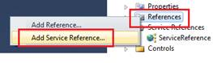
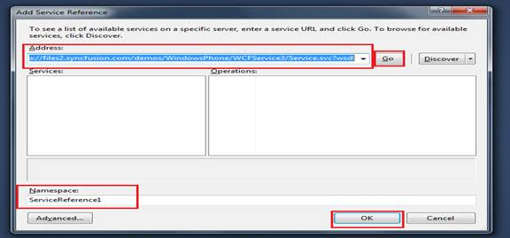

::: {style="DISPLAY: none"}
{#d2h_url_template}{#d2h_package_url style="WIDTH: 0px; DISPLAY: none; HEIGHT: 0px"}
:::

::::::: {.d2h_secondary_topic style="PADDING-BOTTOM: 10pt; MARGIN: 0pt; PADDING-LEFT: 0pt; PADDING-RIGHT: 0pt; PADDING-TOP: 0pt"}
#### Features of WCF Data Binding {#features-of-wcf-data-binding style="tab-stops: 0pt"}

Data binding using WCF enables populating items into the Chart control from a website used as a WCF service and includes the ServiceReference into the application.

::: {style="BORDER-BOTTOM: windowtext 1pt solid; BORDER-LEFT: medium none; PADDING-BOTTOM: 1pt; MARGIN-TOP: 9pt; PADDING-LEFT: 0pt; PADDING-RIGHT: 0pt; MARGIN-BOTTOM: 9pt; BORDER-TOP: windowtext 1pt solid; BORDER-RIGHT: medium none; PADDING-TOP: 1pt"}
{border="0"}Note: To know how to Host a WCF application, kindly refer to section 5.1 How To Create WCF Data Binding Service?
:::

Once the Service is successfully hosted in the internet, you will be given a link to download the configuration files and codes, in order to implement the data communication.

::: {style="BORDER-BOTTOM: windowtext 1pt solid; BORDER-LEFT: medium none; PADDING-BOTTOM: 1pt; MARGIN-TOP: 9pt; PADDING-LEFT: 0pt; PADDING-RIGHT: 0pt; MARGIN-BOTTOM: 9pt; BORDER-TOP: windowtext 1pt solid; BORDER-RIGHT: medium none; PADDING-TOP: 1pt"}
{border="0"}Note: This sample is shown using Array as the data type since the same has been used during the deployment of SyncFusion's Service application.
:::

The present link of Syncfusion's Service Reference is: [[http://files2.syncfusion.com/demos/WindowsPhone/WCFService3/Service.svc?wsdl]{.UGHyperlink0}](http://files2.syncfusion.com/demos/WindowsPhone/WCFService3/Service.svc?wsdl)[[]{style="FONT-FAMILY: 'Arial','sans-serif'"}]{.MsoHyperlink}

To configure WCF for implementing in Chart Control:[[]{style="COLOR: #4f81bd"}]{.underline}

1.   Open the **Sample Browser** in **Visual Studio**.

2.   Right-click the **Reference** tab in **Solution Explorer** and select **Add Service Reference**.

{hspace="12" align="left"}

 

 

 

 

Figure 18: Adding Service Reference

 

3.   Enter the above link in the **URL** tab, name the service and click **OK**.

{hspace="12" align="left"}

 

 

 

 

 

 

 

 

 

 

 

 

 

 

Figure 19: Adding the url and configuring the service reference

 

4.   Once all the service reference is being configured in the application, go to the code page that contains the Chart control and include the following namespaces:

 

+----------------------------------------------------------------------------------------------------------------------------------------------------------+
| **[\[C#\]]{style="FONT-FAMILY: 'Courier New'"}**                                                                                                         |
|                                                                                                                                                          |
| [using]{style="FONT-FAMILY: Consolas; COLOR: blue; FONT-SIZE: 9.5pt"}[ SampleBrowser.ServiceReference;]{style="FONT-FAMILY: Consolas; FONT-SIZE: 9.5pt"} |
|                                                                                                                                                          |
| [using]{style="FONT-FAMILY: Consolas; COLOR: blue; FONT-SIZE: 9.5pt"}[ System.ServiceModel;]{style="FONT-FAMILY: Consolas; FONT-SIZE: 9.5pt"}            |
|                                                                                                                                                          |
| [using]{style="FONT-FAMILY: Consolas; COLOR: blue; FONT-SIZE: 9.5pt"}[ System.Runtime.Serialization;]{style="FONT-FAMILY: Consolas; FONT-SIZE: 9.5pt"}   |
|                                                                                                                                                          |
| [using]{style="FONT-FAMILY: Consolas; COLOR: blue; FONT-SIZE: 9.5pt"}[ System.Collections.ObjectModel;]{style="FONT-FAMILY: Consolas; FONT-SIZE: 9.5pt"} |
|                                                                                                                                                          |
| []{style="FONT-FAMILY: 'Courier New'"}                                                                                                                   |
+----------------------------------------------------------------------------------------------------------------------------------------------------------+

**           **

5.   Add the following code to populate the **AutoComplete Control**.

 

+---------------------------------------------------------------------------------------------------------------------------------------------------------------------------------------------------------------------------------------------------------------------------------------------+
| **[\[C#\]]{style="FONT-FAMILY: 'Courier New'"}**                                                                                                                                                                                                                                            |
|                                                                                                                                                                                                                                                                                             |
| [    [class]{style="COLOR: blue"} [LiveChart]{style="COLOR: #2b91af"} : usercontrol]{style="FONT-FAMILY: Consolas; FONT-SIZE: 9.5pt"}                                                                                                                                                       |
|                                                                                                                                                                                                                                                                                             |
| [    {]{style="FONT-FAMILY: Consolas; FONT-SIZE: 9.5pt"}                                                                                                                                                                                                                                    |
|                                                                                                                                                                                                                                                                                             |
| [        ImyserviceClient channel = [new]{style="COLOR: blue"} ImyserviceClient([\"BasicHttpBinding_Imyservice\"]{style="COLOR: #a31515"});  [// channel is created for commumication, ]{style="COLOR: green"}]{style="FONT-FAMILY: Consolas; FONT-SIZE: 9.5pt"}                            |
|                                                                                                                                                                                                                                                                                             |
| [        [//ImyserviceClient is the class used by sync fusion in the service]{style="COLOR: green"}]{style="FONT-FAMILY: Consolas; FONT-SIZE: 9.5pt"}                                                                                                                                       |
|                                                                                                                                                                                                                                                                                             |
| []{style="FONT-FAMILY: Consolas; FONT-SIZE: 9.5pt"}                                                                                                                                                                                                                                         |
|                                                                                                                                                                                                                                                                                             |
| [        DispatcherTimer timer2;[// timer object]{style="COLOR: green"}]{style="FONT-FAMILY: Consolas; FONT-SIZE: 9.5pt"}                                                                                                                                                                   |
|                                                                                                                                                                                                                                                                                             |
| [        LiveChart()]{style="FONT-FAMILY: Consolas; FONT-SIZE: 9.5pt"}                                                                                                                                                                                                                      |
|                                                                                                                                                                                                                                                                                             |
| [        {]{style="FONT-FAMILY: Consolas; FONT-SIZE: 9.5pt"}                                                                                                                                                                                                                                |
|                                                                                                                                                                                                                                                                                             |
| [            timer2 = [new]{style="COLOR: blue"} DispatcherTimer(); [// initialise the timer object]{style="COLOR: green"}]{style="FONT-FAMILY: Consolas; FONT-SIZE: 9.5pt"}                                                                                                                |
|                                                                                                                                                                                                                                                                                             |
| [            timer2.Tick += [new]{style="COLOR: blue"} [EventHandler]{style="COLOR: #2b91af"}(timer2_Tick); [// event handler to trigger the tick function every second  to populate the live chart]{style="COLOR: green"}]{style="FONT-FAMILY: Consolas; FONT-SIZE: 9.5pt"}                |
|                                                                                                                                                                                                                                                                                             |
| [            channel.getlchartCompleted += [new]{style="COLOR: blue"} [EventHandler]{style="COLOR: #2b91af"}\<getlchartCompletedEventArgs\>(channel_getlchartCompleted); [// event handler to invoke once]{style="COLOR: green"}]{style="FONT-FAMILY: Consolas; FONT-SIZE: 9.5pt"}          |
|                                                                                                                                                                                                                                                                                             |
| [            [// the data in fetched]{style="COLOR: green"}]{style="FONT-FAMILY: Consolas; FONT-SIZE: 9.5pt"}                                                                                                                                                                               |
|                                                                                                                                                                                                                                                                                             |
| [            timer2.Start(); [// start the timer function]{style="COLOR: green"}]{style="FONT-FAMILY: Consolas; FONT-SIZE: 9.5pt"}                                                                                                                                                          |
|                                                                                                                                                                                                                                                                                             |
| [            channel.getchartAsync(); [// function to fetch the data]{style="COLOR: green"}]{style="FONT-FAMILY: Consolas; FONT-SIZE: 9.5pt"}                                                                                                                                               |
|                                                                                                                                                                                                                                                                                             |
| [        }]{style="FONT-FAMILY: Consolas; FONT-SIZE: 9.5pt"}                                                                                                                                                                                                                                |
|                                                                                                                                                                                                                                                                                             |
| [        [public]{style="COLOR: blue"} [static]{style="COLOR: blue"} [List]{style="COLOR: #2b91af"}\<[string]{style="COLOR: blue"}\> word = [new]{style="COLOR: blue"} [List]{style="COLOR: #2b91af"}\<[string]{style="COLOR: blue"}\>();]{style="FONT-FAMILY: Consolas; FONT-SIZE: 9.5pt"} |
|                                                                                                                                                                                                                                                                                             |
| []{style="FONT-FAMILY: Consolas; FONT-SIZE: 9.5pt"}                                                                                                                                                                                                                                         |
|                                                                                                                                                                                                                                                                                             |
| [        [int]{style="COLOR: blue"} vals1, vals2; [// two variables to store the chart\'s data]{style="COLOR: green"}]{style="FONT-FAMILY: Consolas; FONT-SIZE: 9.5pt"}                                                                                                                     |
|                                                                                                                                                                                                                                                                                             |
| [        ChartSeries series = [new]{style="COLOR: blue"} ChartSeries();]{style="FONT-FAMILY: Consolas; FONT-SIZE: 9.5pt"}                                                                                                                                                                   |
|                                                                                                                                                                                                                                                                                             |
| [        ]{style="FONT-FAMILY: Consolas; FONT-SIZE: 9.5pt"}                                                                                                                                                                                                                                 |
|                                                                                                                                                                                                                                                                                             |
| [        [void]{style="COLOR: blue"} channel_getlchartCompleted([object]{style="COLOR: blue"} sender, getlchartCompletedEventArgs e)]{style="FONT-FAMILY: Consolas; FONT-SIZE: 9.5pt"}                                                                                                      |
|                                                                                                                                                                                                                                                                                             |
| [        {]{style="FONT-FAMILY: Consolas; FONT-SIZE: 9.5pt"}                                                                                                                                                                                                                                |
|                                                                                                                                                                                                                                                                                             |
| [            vals1 = e.Result\[0\];]{style="FONT-FAMILY: Consolas; FONT-SIZE: 9.5pt"}                                                                                                                                                                                                       |
|                                                                                                                                                                                                                                                                                             |
| [            vals2 = e.Result\[1\];]{style="FONT-FAMILY: Consolas; FONT-SIZE: 9.5pt"}                                                                                                                                                                                                       |
|                                                                                                                                                                                                                                                                                             |
| []{style="FONT-FAMILY: Consolas; FONT-SIZE: 9.5pt"}                                                                                                                                                                                                                                         |
|                                                                                                                                                                                                                                                                                             |
| [            datas.Add([new]{style="COLOR: blue"} XYValue(1, q\[0\]));]{style="FONT-FAMILY: Consolas; FONT-SIZE: 9.5pt"}                                                                                                                                                                    |
|                                                                                                                                                                                                                                                                                             |
| []{style="FONT-FAMILY: Consolas; FONT-SIZE: 9.5pt"}                                                                                                                                                                                                                                         |
|                                                                                                                                                                                                                                                                                             |
| []{style="FONT-FAMILY: Consolas; FONT-SIZE: 9.5pt"}                                                                                                                                                                                                                                         |
|                                                                                                                                                                                                                                                                                             |
| [            series.DataSource = datas;]{style="FONT-FAMILY: Consolas; FONT-SIZE: 9.5pt"}                                                                                                                                                                                                   |
|                                                                                                                                                                                                                                                                                             |
| []{style="FONT-FAMILY: Consolas; FONT-SIZE: 9.5pt"}                                                                                                                                                                                                                                         |
|                                                                                                                                                                                                                                                                                             |
| []{style="FONT-FAMILY: Consolas; FONT-SIZE: 9.5pt"}                                                                                                                                                                                                                                         |
|                                                                                                                                                                                                                                                                                             |
| [            [//Initialize the Property name in Model object that provides values to X-Axis.]{style="COLOR: green"}]{style="FONT-FAMILY: Consolas; FONT-SIZE: 9.5pt"}                                                                                                                       |
|                                                                                                                                                                                                                                                                                             |
| [            series.BindingPathX = [\"X\"]{style="COLOR: #a31515"};]{style="FONT-FAMILY: Consolas; FONT-SIZE: 9.5pt"}                                                                                                                                                                       |
|                                                                                                                                                                                                                                                                                             |
| []{style="FONT-FAMILY: Consolas; FONT-SIZE: 9.5pt"}                                                                                                                                                                                                                                         |
|                                                                                                                                                                                                                                                                                             |
| [            [//Initialize the Property name in Model object that provides values to Y-Axis.]{style="COLOR: green"}]{style="FONT-FAMILY: Consolas; FONT-SIZE: 9.5pt"}                                                                                                                       |
|                                                                                                                                                                                                                                                                                             |
| [            series.BindingPathsY = [new]{style="COLOR: blue"} [List]{style="COLOR: #2b91af"}\<[string]{style="COLOR: blue"}\>() { [\"Y\"]{style="COLOR: #a31515"} };]{style="FONT-FAMILY: Consolas; FONT-SIZE: 9.5pt"}                                                                     |
|                                                                                                                                                                                                                                                                                             |
| []{style="FONT-FAMILY: Consolas; FONT-SIZE: 9.5pt"}                                                                                                                                                                                                                                         |
|                                                                                                                                                                                                                                                                                             |
| [        }]{style="FONT-FAMILY: Consolas; FONT-SIZE: 9.5pt"}                                                                                                                                                                                                                                |
|                                                                                                                                                                                                                                                                                             |
| []{style="FONT-FAMILY: Consolas; FONT-SIZE: 9.5pt"}                                                                                                                                                                                                                                         |
|                                                                                                                                                                                                                                                                                             |
| []{style="FONT-FAMILY: Consolas; FONT-SIZE: 9.5pt"}                                                                                                                                                                                                                                         |
|                                                                                                                                                                                                                                                                                             |
| [        [void]{style="COLOR: blue"} timer2_Tick([object]{style="COLOR: blue"} sender, [EventArgs]{style="COLOR: #2b91af"} e)]{style="FONT-FAMILY: Consolas; FONT-SIZE: 9.5pt"}                                                                                                             |
|                                                                                                                                                                                                                                                                                             |
| [        {]{style="FONT-FAMILY: Consolas; FONT-SIZE: 9.5pt"}                                                                                                                                                                                                                                |
|                                                                                                                                                                                                                                                                                             |
| [            channel.getlchartAsync();]{style="FONT-FAMILY: Consolas; FONT-SIZE: 9.5pt"}                                                                                                                                                                                                    |
|                                                                                                                                                                                                                                                                                             |
| [        }]{style="FONT-FAMILY: Consolas; FONT-SIZE: 9.5pt"}                                                                                                                                                                                                                                |
|                                                                                                                                                                                                                                                                                             |
| []{style="FONT-FAMILY: Consolas; FONT-SIZE: 9.5pt"}                                                                                                                                                                                                                                         |
|                                                                                                                                                                                                                                                                                             |
| []{style="FONT-FAMILY: Consolas; FONT-SIZE: 9.5pt"}                                                                                                                                                                                                                                         |
|                                                                                                                                                                                                                                                                                             |
| [        [private]{style="COLOR: blue"} [void]{style="COLOR: blue"} UserControl_Unloaded([object]{style="COLOR: blue"} sender, RoutedEventArgs e)]{style="FONT-FAMILY: Consolas; FONT-SIZE: 9.5pt"}                                                                                         |
|                                                                                                                                                                                                                                                                                             |
| [        {]{style="FONT-FAMILY: Consolas; FONT-SIZE: 9.5pt"}                                                                                                                                                                                                                                |
|                                                                                                                                                                                                                                                                                             |
| [            timer2.Stop();]{style="FONT-FAMILY: Consolas; FONT-SIZE: 9.5pt"}                                                                                                                                                                                                               |
|                                                                                                                                                                                                                                                                                             |
| [            ServicesClass.timer2.Stop();]{style="FONT-FAMILY: Consolas; FONT-SIZE: 9.5pt"}                                                                                                                                                                                                 |
|                                                                                                                                                                                                                                                                                             |
| [        }]{style="FONT-FAMILY: Consolas; FONT-SIZE: 9.5pt"}                                                                                                                                                                                                                                |
|                                                                                                                                                                                                                                                                                             |
| []{style="FONT-FAMILY: Consolas; FONT-SIZE: 9.5pt"}                                                                                                                                                                                                                                         |
|                                                                                                                                                                                                                                                                                             |
| [    }]{style="FONT-FAMILY: Consolas; FONT-SIZE: 9.5pt"}                                                                                                                                                                                                                                    |
|                                                                                                                                                                                                                                                                                             |
| []{style="FONT-FAMILY: 'Courier New'"}                                                                                                                                                                                                                                                      |
+---------------------------------------------------------------------------------------------------------------------------------------------------------------------------------------------------------------------------------------------------------------------------------------------+

::: {style="BORDER-BOTTOM: windowtext 1pt solid; BORDER-LEFT: medium none; PADDING-BOTTOM: 1pt; MARGIN-TOP: 9pt; PADDING-LEFT: 0pt; PADDING-RIGHT: 0pt; MARGIN-BOTTOM: 9pt; BORDER-TOP: windowtext 1pt solid; BORDER-RIGHT: medium none; PADDING-TOP: 1pt"}
{border="0"}Note: Other factors such as timeout, endpoints while creating a service, binding options and so on have to be [:.2Completed by including the s same.brief out the possibilities of binding the data dynamicallyequirement.]{style="DISPLAY: none"}
:::

::: {style="BORDER-BOTTOM: windowtext 1pt solid; BORDER-LEFT: medium none; PADDING-BOTTOM: 1pt; MARGIN-TOP: 9pt; PADDING-LEFT: 0pt; PADDING-RIGHT: 0pt; MARGIN-BOTTOM: 9pt; BORDER-TOP: windowtext 1pt solid; BORDER-RIGHT: medium none; PADDING-TOP: 1pt"}
configured as per the requirement. The above WCF sample procedure is just to brief out the possibilities of binding data dynamically.
:::

 

[]{#related-topics}
:::::::
