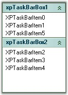

::: {style="DISPLAY: none"}
{#d2h_url_template}{#d2h_package_url style="WIDTH: 0px; DISPLAY: none; HEIGHT: 0px"}
:::

::: {.d2h_secondary_topic style="PADDING-BOTTOM: 10pt; MARGIN: 0pt; PADDING-LEFT: 0pt; PADDING-RIGHT: 0pt; PADDING-TOP: 0pt"}
#### Features Overview {#features-overview style="MARGIN-LEFT: 18pt; tab-stops: 18.0pt"}

[]{style="COLOR: #15428b"} 

This section lists the features of XPTaskBar.

[]{style="COLOR: #15428b"} 

Features

[]{style="COLOR: #15428b"} 

[·      ]{style="FONT-FAMILY: Symbol; COLOR: #15428b"}Office2007 [[style]{.UGHyperlink}](../../../../../../../../Documents%20and%20Settings/sylviap/Desktop/Tools%20-%20Part%202.docx#_Visual_Style)[ ]{.UGHyperlink}for XPTaskBarBox in the XPTaskBar control.[]{style="COLOR: #15428b"}

[·      ]{style="FONT-FAMILY: Symbol; COLOR: #15428b"}Custom Colors can be applied for XPTaskBar control. See[ ]{style="COLOR: #15428b"}[[Visual Style]{.UGHyperlink}](../../../../../../../../Documents%20and%20Settings/sylviap/Desktop/Tools%20-%20Part%202.docx#_Visual_Style)[ ]{style="COLOR: #15428b"}topic.[]{style="COLOR: #15428b"}

[]{style="COLOR: #15428b"} 

{border="0"}

[]{style="COLOR: #15428b"} 

Figure 927: Custom Color applied to the XPTaskBar Control

**[]{style="COLOR: #15428b"}** 

[·      ]{style="FONT-FAMILY: Symbol"}**Behavior Settings**

[]{style="COLOR: #15428b"} 

XPTaskBar has a drag-drop functionality, which helps in dragging XPTaskBar Items within a XPTaskBar Box or between different XPTaskBar Boxes.

 

Vertical spacing between the XP Task bar boxes can be set.

 

XPTaskBar provides Gradient look and feel.

 

Scrolling is supported.

[]{style="COLOR: #15428b"} 

[·      ]{style="FONT-FAMILY: Symbol"}**Text Settings**

[]{style="COLOR: #15428b"} 

The header text of the XPTaskBar Box can be changed. The text of the TaskBar Items can be formatted by applying various settings like Text Underline, StrikeOut and Italic.

[]{style="COLOR: #15428b"} 

[·      ]{style="FONT-FAMILY: Symbol"}**Color Settings**

[]{style="COLOR: #15428b"} 

The color of the TaskBar header can be changed. The Background and Foreground color of the TaskBar Items can also be changed.

[]{style="COLOR: #15428b"} 

[·      ]{style="FONT-FAMILY: Symbol"}**Image Settings**

 

 Large icons such as 16x16 icons, 32x32 icons etc. can be used in the XPTaskBar header as well as XPTaskBar Items.

 

[·      ]{style="FONT-FAMILY: Symbol"}**Animation Support**

 

[[Animation Settings]{.UGHyperlink}](../../../../../../../../Documents%20and%20Settings/sylviap/Desktop/Tools%20-%20Part%202.docx#_Animation_Settings) can be applied to TaskBar Boxes and TaskBar Items.

[]{style="COLOR: #15428b"} 

[·      ]{style="FONT-FAMILY: Symbol"}**Layout Settings**

 

XPTaskBar Boxes can be aligned both vertically and horizontally. In the horizontal mode, the column width can be changed according to the needs of the user.

 

Order of the XPTaskBar Box controls can be changed using the verbs \"Bring To Front\" or \"Send To Back\".

                                  

[·      ]{style="FONT-FAMILY: Symbol"}**Button Settings**

 

Collapse buttons of XPTaskBar Box can be hidden by setting the ShowCollapseButton property of XPTaskBar Box to \'False\'.

 

[·      ]{style="FONT-FAMILY: Symbol"}**Header Settings**

 

Header Text can be aligned to Near, Middle or Far. Header Direction can be changed to RightToLeft or LeftToRight.

[]{style="COLOR: #15428b"} 

[·      ]{style="FONT-FAMILY: Symbol"}**Visibility Settings**

[]{style="COLOR: red; FONT-SIZE: 8pt"} 

TaskBar Items can be hidden by setting the Visible property to \'False\'.

 

They can also be disabled by setting the Enabled property to \'False\'.

 

[·      ]{style="FONT-FAMILY: Symbol"}**ToolTip Support**

 

[[ToolTips]{.UGHyperlink}](../../../../../../../../Documents%20and%20Settings/sylviap/Desktop/Tools%20-%20Part%202.docx#_XPTaskBar-_ToolTips) can be provided for XPTaskBar Items.

 

 

[]{#p665} 

 

[]{#related-topics}
:::
