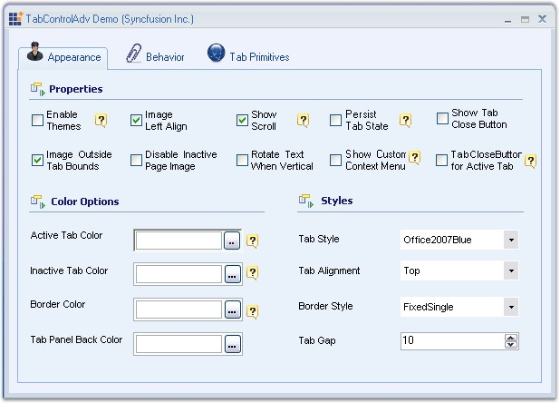
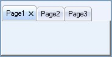

::: {style="DISPLAY: none"}
{#d2h_url_template}{#d2h_package_url style="WIDTH: 0px; DISPLAY: none; HEIGHT: 0px"}
:::

::::: {#nsbanner .d2h_main_nsbanner style="BORDER-BOTTOM: #999999 1px solid; POSITION: relative; PADDING-BOTTOM: 0px; BACKGROUND-COLOR: transparent; PADDING-LEFT: 0px; PADDING-RIGHT: 0px; DISPLAY: none; BORDER-TOP: #999999 1px solid; PADDING-TOP: 0px; LEFT: 0px"}
:::: {#TitleRow .d2h_main_titlerow style="PADDING-BOTTOM: 4px; BACKGROUND-COLOR: transparent; PADDING-LEFT: 22px; WIDTH: 100%; PADDING-RIGHT: 10px; DISPLAY: none; PADDING-TOP: 4px"}
::: {#ienav .d2h_main_ienav style="DISPLAY: none"}
{#D2HPrevious .D2HPreviousEnabled}  {#D2HNext .D2HNextEnabled}
:::
::::
:::::

::::: {#nstext .d2h_main_nstext style="PADDING-BOTTOM: 10px; BACKGROUND-COLOR: transparent; PADDING-LEFT: 22px; PADDING-RIGHT: 10px; HEIGHT: 100%; OVERFLOW: auto; PADDING-TOP: 5px" hasuserbackground="true" valign="bottom"}
::: {#d2h_breadcrumbs .d2h_breadcrumbs}
[Essential Studio User Guide Documentation](ms-xhelp:///?Id=12457748-09e3-4d74-a240-8e049cedf030){.d2h_breadcrumbsNormal}[ \> ]{.d2h_breadcrumbsLinkSeparator}[User Interface Edition](ms-xhelp:///?Id=c29296b7-531c-413b-a0ec-488ca1f7f669){.d2h_breadcrumbsNormal}[ \> ]{.d2h_breadcrumbsLinkSeparator}[Essential Windows](ms-xhelp:///?Id=e60759d8-47a4-4570-9d7a-16a68d63f2ea){.d2h_breadcrumbsNormal}[ \> ]{.d2h_breadcrumbsLinkSeparator}[Essential Tools]{.d2h_breadcrumbsContentsOnly}[ \> ]{.d2h_breadcrumbsLinkSeparator}[Tools Controls](ms-xhelp:///?Id=13c3c4f4-9d16-4b69-93f2-7e98eec67452){.d2h_breadcrumbsNormal}[ \> ]{.d2h_breadcrumbsLinkSeparator}[Tabs Package](ms-xhelp:///?Id=204c37ee-142c-46ef-a1a3-7fdf214b25f9){.d2h_breadcrumbsNormal}
:::

### Features Overview {#features-overview style="MARGIN-LEFT: 18pt; tab-stops: 18.0pt"}

 

The Tabs framework contains the TabControlAdv with a full set of features to support efficient tab usage to create rich user applications.

[]{style="COLOR: #15428b"} 

{border="0"}

[]{style="COLOR: #15428b"} 

Figure 1030: TabControlAdv Features

[]{style="COLOR: #15428b"} 

Features

[]{style="COLOR: #15428b"} 

[·      ]{style="FONT-FAMILY: Symbol"}**TabStyles**

 

Tabs framework provides a number of pre-defined TabStyles and also allows to apply custom style settings to the control.

 

[·      ]{style="FONT-FAMILY: Symbol"}**Appearance settings**

 

The Tab appearance can be easily customized by stating the style definitions for the TabItems, TabPages and TabPanels individually.

 

[·      ]{style="FONT-FAMILY: Symbol"}**TabPrimitives**

 

TabControlAdv provides an easy way to navigate through tabs. By setting TabPrimitives (previously, TabControlAdv\'s  NavigationControl property), users can traverse between tabs and pages easily which enables to go to the next or previous tab / page and first / last tab, close buttons can be added which closes the active tabpage when clicked and the dropdown with all the tabpages listed can be accessed by the user to select the tabpage to be traversed.

 

NavigationControl offers more flexibility that allows you to change the button\'s image, show / hide certain buttons and also cancel the navigation and use it as an Add or Remove TabPages through code.

 

[·      ]{style="FONT-FAMILY: Symbol"}**Alignment and Sizing**

 

The TabStrip can be aligned to the Top, Left, Right or Bottom of the control. Text alignment can be changed using the RotateTextWhenVertical property which will rotate the text and draw it horizontally when the alignment is set to Left. The Tabs can also be set to be displayed in Multiple lines using the Multiline property. The TabItems can be aligned from Left to Right and vice versa using the RightToLeft property. When the RightToLeft mode is activated and RotateTabsWhenRTL property is enabled, tab rotation is allowed. The SizeMode can be set to either Normal, Fixed, ShrinkToFit or FillToRight.

 

[·      ]{style="FONT-FAMILY: Symbol"}**LabelEdit**

 

TabPage\'s text can be edited during run-time using LabelEdit property.

 

LabelEdit feature has the following events associated with it.

 

[o  ]{style="FONT-FAMILY: 'Courier New'"}BeforeEdit - Occurs when the text enters into the edit mode.

[o  ]{style="FONT-FAMILY: 'Courier New'"}AfterEdit - Occurs after the new text is entered.

[o  ]{style="FONT-FAMILY: 'Courier New'"}LabelEditTextChanged - Occurs when the text of the tab is changed.

[o  ]{style="FONT-FAMILY: 'Courier New'"}LabelEditChanged **-*[ ]{style="FONT-FAMILY: 'Verdana','sans-serif'; COLOR: black; FONT-SIZE: 8pt"}***Occurs when the LabelEdit property is toggled.

**[]{style="COLOR: #15428b"}** 

[·      ]{style="FONT-FAMILY: Symbol"}**Image Support**

 

TabPage\'s text can be associated with images. Images can be aligned according to the alignment of the tabs.

 

[·      ]{style="FONT-FAMILY: Symbol"}**Color Properties**

 

TabControlAdv allows the user to set different colors for active and inactive tabs using ActiveTabColor, InactiveTabcolor, TabBackColor, TabForeColor and TabPanelBackColor properties.

 

[·      ]{style="FONT-FAMILY: Symbol"}**Themes Support**

 

TabControlAdv provides complete[ ]{style="FONT-FAMILY: 'Verdana','sans-serif'; COLOR: blue; FONT-SIZE: 8pt"}theme support. Using the ThemesEnabled property, XP themes can be enabled for this control.

 

[·      ]{style="FONT-FAMILY: Symbol"}**TabPersistence**

 

Complete[ ]{style="FONT-FAMILY: 'Verdana','sans-serif'; COLOR: blue; FONT-SIZE: 8pt"}persistence support is now available for TabControlAdv using the PersistTabState property.

[]{style="COLOR: #15428b"} 

::: {style="BORDER-BOTTOM: windowtext 1pt solid; BORDER-LEFT: medium none; PADDING-BOTTOM: 1pt; MARGIN: 9pt 0pt 9pt 18pt; PADDING-LEFT: 0pt; PADDING-RIGHT: 0pt; BORDER-TOP: windowtext 1pt solid; BORDER-RIGHT: medium none; PADDING-TOP: 1pt"}
{border="0"} Note:[ ]{style="COLOR: black; FONT-SIZE: 8pt"}TabState has been saved at the following location: C:\\Documents and Settings\\Username\*\\Local Settings\\Application Data\\IsolatedStorage.
:::

[]{style="COLOR: #15428b"} 

[·      ]{style="FONT-FAMILY: Symbol"}Close button can be added for each TabPage like IE7 to close the tabpage.

[]{style="COLOR: #15428b"} 

{border="0"}

***[]{style="COLOR: #15428b"}*** 

Figure 1031: Close button added for Tab Page

[]{style="COLOR: #15428b"} 

[·      ]{style="FONT-FAMILY: Symbol"}Lets you set tooltips for every TabPrimitives.

[·      ]{style="FONT-FAMILY: Symbol"}Added VS2008 [[TabStyle]{.UGHyperlink}](../../../../../../../../Documents%20and%20Settings/sylviap/Desktop/Tools%20-%20Part%202.docx#_TabStyles)[ ]{.UGHyperlink}for TabControlAdv.

[·      ]{style="FONT-FAMILY: Symbol"}Added [[Border]{.UGHyperlink}](../../../../../../../../Documents%20and%20Settings/sylviap/Desktop/Tools%20-%20Part%202.docx#_Border_for_TabControlAdv) settings for the control which is implemented especially for VS2008 TabStyle.

[·      ]{style="FONT-FAMILY: Symbol"}TabPage Closed and Closing [[events]{.UGHyperlink}](../../../../../../../../Documents%20and%20Settings/sylviap/Desktop/Tools%20-%20Part%202.docx#_TabControlAdv_Events) are added.

[]{style="COLOR: #15428b"} 

A sample which illustrates the features of TabControlAdv is available in the following sample installation location.

[]{style="COLOR: #15428b"} 

***..\\My Documents\\Syncfusion\\EssentialStudio\\Version Number\\Windows\\Tools.Windows\\Samples\\2.0\\Tabs Package\\TabControlAdvDemo***

 

 

 

 

[]{#related-topics}
:::::
