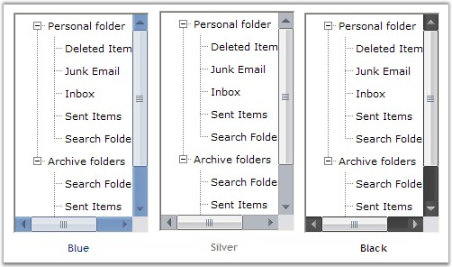

::: {style="DISPLAY: none"}
{#d2h_url_template}{#d2h_package_url style="WIDTH: 0px; DISPLAY: none; HEIGHT: 0px"}
:::

::::: {#nsbanner .d2h_main_nsbanner style="BORDER-BOTTOM: #999999 1px solid; POSITION: relative; PADDING-BOTTOM: 0px; BACKGROUND-COLOR: transparent; PADDING-LEFT: 0px; PADDING-RIGHT: 0px; DISPLAY: none; BORDER-TOP: #999999 1px solid; PADDING-TOP: 0px; LEFT: 0px"}
:::: {#TitleRow .d2h_main_titlerow style="PADDING-BOTTOM: 4px; BACKGROUND-COLOR: transparent; PADDING-LEFT: 22px; WIDTH: 100%; PADDING-RIGHT: 10px; DISPLAY: none; PADDING-TOP: 4px"}
::: {#ienav .d2h_main_ienav style="DISPLAY: none"}
{#D2HPrevious .D2HPreviousEnabled}  {#D2HNext .D2HNextEnabled}
:::
::::
:::::

:::: {#nstext .d2h_main_nstext style="PADDING-BOTTOM: 10px; BACKGROUND-COLOR: transparent; PADDING-LEFT: 22px; PADDING-RIGHT: 10px; HEIGHT: 100%; OVERFLOW: auto; PADDING-TOP: 5px" hasuserbackground="true" valign="bottom"}
::: {#d2h_breadcrumbs .d2h_breadcrumbs}
[Essential Studio User Guide Documentation](ms-xhelp:///?Id=12457748-09e3-4d74-a240-8e049cedf030){.d2h_breadcrumbsNormal}[ \> ]{.d2h_breadcrumbsLinkSeparator}[User Interface Edition](ms-xhelp:///?Id=c29296b7-531c-413b-a0ec-488ca1f7f669){.d2h_breadcrumbsNormal}[ \> ]{.d2h_breadcrumbsLinkSeparator}[Essential Windows](ms-xhelp:///?Id=e60759d8-47a4-4570-9d7a-16a68d63f2ea){.d2h_breadcrumbsNormal}[ \> ]{.d2h_breadcrumbsLinkSeparator}[Essential Tools]{.d2h_breadcrumbsContentsOnly}[ \> ]{.d2h_breadcrumbsLinkSeparator}[Tools Controls](ms-xhelp:///?Id=13c3c4f4-9d16-4b69-93f2-7e98eec67452){.d2h_breadcrumbsNormal}[ \> ]{.d2h_breadcrumbsLinkSeparator}[TreeView Package](ms-xhelp:///?Id=78aca88c-a1a5-4e79-9e37-2a6b03cb6c1b){.d2h_breadcrumbsNormal}
:::

### Features Overview {#features-overview style="MARGIN-LEFT: 18pt; tab-stops: 18.0pt"}

[]{style="COLOR: #15428b"} 

The TreeView package provides an advanced **TreeViewAdv** control with numerous styles and extensive customization capabilities. The features of the control are  listed below.

 

**Features**

 

**Look and Feel -** The control can be applied with impressive look and feel by providing different options for the users to customize the appearance of the control.

 

**Enhanced performance**

 

TreeViewAdv control can be populated with large number of nodes on node expand / collapse. The performance while populating the TreeViewAdv with large number of nodes can be improved by the **SuspendExpandRecalculate** property.

 

**CheckBox support**

 

Interactive check boxes that could be checked or unchecked, which will indicate the check state of the child node\'s check boxes.

**[]{style="FONT-FAMILY: 'Segoe UI','sans-serif'"}** 

**[Node Images]{style="FONT-FAMILY: 'Segoe UI','sans-serif'"}**

 

Tree nodes can hold left images, right images and images for different state of the nodes like expand and collapse.

 

**Load on demand**

 

Enhances the performance by reducing the loading time of the nodes by displaying the nodes only on demand by the user. This provides the user to delay the loading of nodes in Trees, until the user initiates the nodes to expand.

[]{style="COLOR: #15428b"} 

Customizing nodes

[]{style="COLOR: #15428b"} 

Allows you to edit and customize the nodes at all levels.

[]{style="COLOR: #15428b"} 

[·      ]{style="FONT-FAMILY: Symbol"}LabelEdit*[ -]{style="FONT-FAMILY: 'Verdana','sans-serif'; COLOR: black; FONT-SIZE: 8pt"}* property that helps users to easily edit the node text at run time.

[·      ]{style="FONT-FAMILY: Symbol"}Nodes selection - allows to select a single node or select all the nodes or only the specified nodes.

[·      ]{style="FONT-FAMILY: Symbol"}OwnerDrawNodes - property that allows user to paint the background of the node.

[·      ]{style="FONT-FAMILY: Symbol"}Text Color - option to customize node text color.

[·      ]{style="FONT-FAMILY: Symbol"}Font - option to change the node\'s font.

[·      ]{style="FONT-FAMILY: Symbol"}HelpText - can be enabled for each and every nodes. Each nodes can display its own information.

[]{style="COLOR: #15428b"} 

Scroll support

 

Provides automatic scrolling support for the treeview controls as well as hidden nodes when the mouse is near the borders.

 

Sorting

 

Different types of sorting can be performed for the tree nodes like ascending, descending.

 

Office2007ScrollBars

 

TreeViewAdv provides support for Office2007Scrollbars with all the three color schemes.

**[]{style="COLOR: black; FONT-SIZE: 8pt"}** 

{border="0"}

[]{style="COLOR: #15428b"} 

Figure 1116: Office 2007 ScrollBars

**[]{style="COLOR: #15428b"}** 

ToolTip

 

Allows us to show and hide tooltips for the nodes wherever necessary.

 

Drag and Drop

 

Provides support for advanced drag and drop of the nodes.

 

Context Menus

 

TreeViewAdv has the ability to associate context menus with the option to show and hide wherever necessary. This pops up when right mouse button is clicked on a tree node.

 

Styles Architecture

 

Supports a flexible style architecture to let users define the styles for nodes at different levels of the Tree. It helps the users to specify the styles for a specific node or for a class of nodes.

 

Custom Control

[]{style="COLOR: black"} 

Support for custom control feature allows to add custom controls to the tree structure that can be embedded to the required tree node. See[ ]{style="COLOR: black"}[[custom control]{.UGHyperlink}](../../../../../../../../Documents%20and%20Settings/sylviap/Desktop/Tools%20-%20Part%202.docx#_Custom_Controls)[ ]{.UGHyperlink}for details.

[[Concepts and Features]{.UGHyperlink}](../../../../../../../../Documents%20and%20Settings/sylviap/Desktop/Tools%20-%20Part%202.docx#_Concepts_and_)[]{.UGHyperlink}

 

 

 

 

[]{#related-topics}
::::
