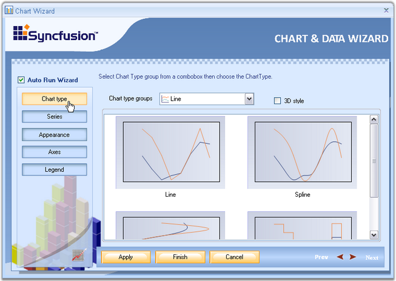
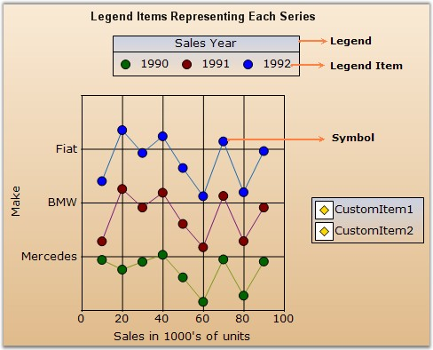
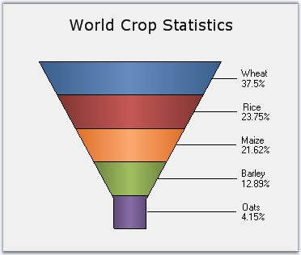
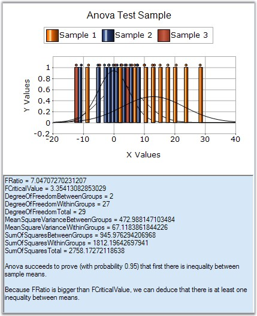
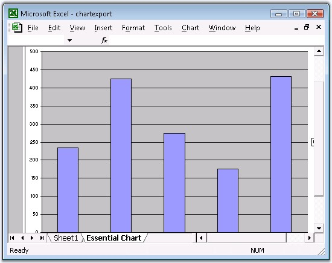
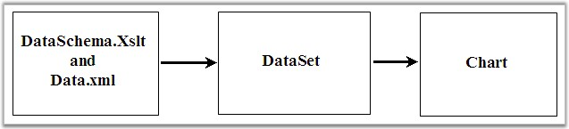
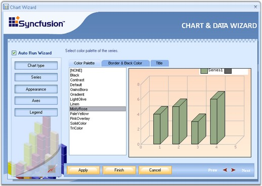
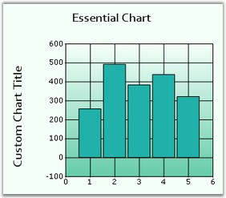
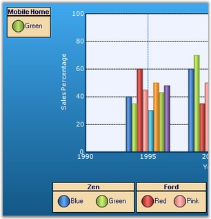
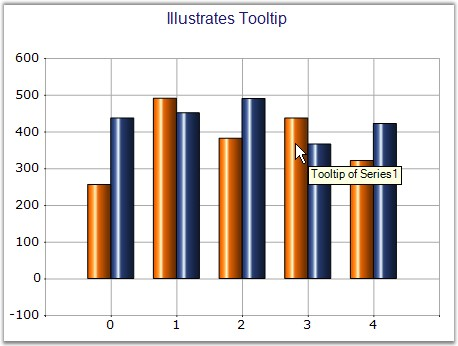

::: {style="DISPLAY: none"}
{#d2h_url_template}{#d2h_package_url style="WIDTH: 0px; DISPLAY: none; HEIGHT: 0px"}
:::

::::: {#nsbanner .d2h_main_nsbanner style="BORDER-BOTTOM: #999999 1px solid; POSITION: relative; PADDING-BOTTOM: 0px; BACKGROUND-COLOR: transparent; PADDING-LEFT: 0px; PADDING-RIGHT: 0px; DISPLAY: none; BORDER-TOP: #999999 1px solid; PADDING-TOP: 0px; LEFT: 0px"}
:::: {#TitleRow .d2h_main_titlerow style="PADDING-BOTTOM: 4px; BACKGROUND-COLOR: transparent; PADDING-LEFT: 22px; WIDTH: 100%; PADDING-RIGHT: 10px; DISPLAY: none; PADDING-TOP: 4px"}
::: {#ienav .d2h_main_ienav style="DISPLAY: none"}
{#D2HPrevious .D2HPreviousEnabled}  {#D2HNext .D2HNextEnabled}
:::
::::
:::::

:::: {#nstext .d2h_main_nstext style="PADDING-BOTTOM: 10px; BACKGROUND-COLOR: transparent; PADDING-LEFT: 22px; PADDING-RIGHT: 10px; HEIGHT: 100%; OVERFLOW: auto; PADDING-TOP: 5px" hasuserbackground="true" valign="bottom"}
::: {#d2h_breadcrumbs .d2h_breadcrumbs}
[Essential Studio User Guide Documentation](ms-xhelp:///?Id=12457748-09e3-4d74-a240-8e049cedf030){.d2h_breadcrumbsNormal}[ \> ]{.d2h_breadcrumbsLinkSeparator}[User Interface Edition](ms-xhelp:///?Id=c29296b7-531c-413b-a0ec-488ca1f7f669){.d2h_breadcrumbsNormal}[ \> ]{.d2h_breadcrumbsLinkSeparator}[Essential ASP.NET](ms-xhelp:///?Id=25c35330-c127-4dad-9a92-ed79dc7261a6){.d2h_breadcrumbsNormal}[ \> ]{.d2h_breadcrumbsLinkSeparator}[Essential Chart]{.d2h_breadcrumbsContentsOnly}[ \> ]{.d2h_breadcrumbsLinkSeparator}[Getting Started](ms-xhelp:///?Id=e6f85824-7e04-4dab-9e3f-effb3938f621){.d2h_breadcrumbsNormal}
:::

## Feature Summary {#feature-summary style="tab-stops: 0pt"}

[]{style="FONT-FAMILY: 'Trebuchet MS','sans-serif'; FONT-SIZE: 9pt"} 

The features of Essential Chart are listed below:

[]{style="FONT-FAMILY: 'Trebuchet MS','sans-serif'; FONT-SIZE: 9pt"} 

[·      ]{style="FONT-FAMILY: Symbol"}**Chart and Data Wizard** - The control provides complete support for customization of the Chart control through Chart Wizard at design time and also at run time. Chart Wizard comes with new Office look and feel.

[]{style="FONT-FAMILY: 'Trebuchet MS','sans-serif'; FONT-SIZE: 9pt"} 

{border="0"}

**[]{style="FONT-FAMILY: 'Trebuchet MS','sans-serif'; FONT-SIZE: 9pt"}** 

Figure 12: Chart and Data Wizard

[]{style="FONT-FAMILY: 'Trebuchet MS','sans-serif'; FONT-SIZE: 9pt"} 

[·      ]{style="FONT-FAMILY: Symbol"}**Chart Data Model** - This innovative data object model makes it easy to populate the chart with any kind of data source.

[·      ]{style="FONT-FAMILY: Symbol"}**Date Handling** - Essential Chart features built in support for dates. The data type of any series that is plotted on the chart can be set to DateTime.

[·    ]{style="FONT-FAMILY: Symbol; FONT-SIZE: 12pt"}**Automatic Range** - Essential Chart offers automatic interval calculation capabilities for any range of numbers or dates. This calculation can be overridden by explicit allocation of ranges and intervals to be used and also with settings that control how \'nice\' numbers are calculated for display[.]{style="FONT-SIZE: 12pt"}

[·      ]{style="FONT-FAMILY: Symbol"}**Legends** - Essential Chart offers extensive customization possibilities of the legend. The position of the legend on the chart area as well as its representation aspects can all be completely customized. Essential Chart also features modification of legend items using events. It also supports custom legend items that are not tied to series of data.

[]{style="FONT-FAMILY: 'Trebuchet MS','sans-serif'; FONT-SIZE: 9pt"} 

{border="0"}

**[]{style="FONT-FAMILY: 'Trebuchet MS','sans-serif'; FONT-SIZE: 9pt"}** 

Figure 13: Chart with Legend and Legend Items

[]{style="FONT-FAMILY: 'Trebuchet MS','sans-serif'; FONT-SIZE: 9pt"} 

[·      ]{style="FONT-FAMILY: Symbol"}Support for 2D or 3D **appearance** of the Chart.

[]{style="FONT-FAMILY: 'Trebuchet MS','sans-serif'; FONT-SIZE: 9pt"} 

{border="0"}

[]{style="FONT-FAMILY: 'Trebuchet MS','sans-serif'; FONT-SIZE: 9pt"} 

***[2D Funnel Chart]{style="FONT-FAMILY: 'Trebuchet MS','sans-serif'; FONT-SIZE: 9pt"}***

[]{style="FONT-FAMILY: 'Trebuchet MS','sans-serif'; FONT-SIZE: 9pt"} 

[·      ]{style="FONT-FAMILY: Symbol"}Chart can be easily bound with IEnumerable based collections like ArrayList. This extends chart to be easily used with LINQ.

[·      ]{style="FONT-FAMILY: Symbol"}The control provides complete **design time support** using Visual studio.

[·      ]{style="FONT-FAMILY: Symbol"}**Statistical formula** support for Mean, Standard Deviation, Variance, Distributions, t-test, f-test, Z-test, and so on.

[]{style="FONT-FAMILY: 'Trebuchet MS','sans-serif'; FONT-SIZE: 9pt"} 

{border="0"}

**[]{style="FONT-FAMILY: 'Trebuchet MS','sans-serif'; FONT-SIZE: 9pt"}** 

Figure 14: Anova Test

[]{style="FONT-FAMILY: 'Trebuchet MS','sans-serif'; FONT-SIZE: 9pt"} 

[·      ]{style="FONT-FAMILY: Symbol"}**Exporting** Chart to PDF, to Excel and to Doc and so on are available for the chart control. **Importing** is also supported.

[]{style="FONT-FAMILY: 'Trebuchet MS','sans-serif'; FONT-SIZE: 9pt"} 

{border="0"}

[]{style="FONT-FAMILY: 'Trebuchet MS','sans-serif'; FONT-SIZE: 9pt"} 

Figure 15: Essential Chart translated into a Excel Chart by using Essential XlsIO

[]{style="FONT-FAMILY: 'Trebuchet MS','sans-serif'; FONT-SIZE: 9pt"} 

{border="0"}

**[]{style="FONT-FAMILY: 'Trebuchet MS','sans-serif'; FONT-SIZE: 9pt"}** 

Figure 16: Importing data from XML to Chart

[]{style="FONT-FAMILY: 'Trebuchet MS','sans-serif'; FONT-SIZE: 9pt"} 

[·      ]{style="FONT-FAMILY: Symbol"}**Support To create custom palettes -** Users can create custom palettes for their Charts by using **CustomPalette** property. Also, create non-gradient palettes for the Charts by using this custom palettes feature.

[]{style="FONT-FAMILY: 'Trebuchet MS','sans-serif'; FONT-SIZE: 9pt"} 

{border="0"}

[]{style="FONT-FAMILY: 'Trebuchet MS','sans-serif'; FONT-SIZE: 9pt"} 

Figure 17: Chart Wizard with Palette Settings

[]{style="FONT-FAMILY: 'Trebuchet MS','sans-serif'; FONT-SIZE: 9pt"} 

[·      ]{style="FONT-FAMILY: Symbol"}Multiple Chart Titles and Multiple Legends can be provided with abilities to format the Title text.

[]{style="FONT-FAMILY: 'Trebuchet MS','sans-serif'; FONT-SIZE: 9pt"} 

{border="0"}

[]{style="FONT-FAMILY: 'Trebuchet MS','sans-serif'; FONT-SIZE: 9pt"} 

Figure 18: Multiple Chart Titles

[]{style="FONT-FAMILY: 'Trebuchet MS','sans-serif'; FONT-SIZE: 9pt"} 

{border="0"}

[]{style="FONT-FAMILY: 'Trebuchet MS','sans-serif'; FONT-SIZE: 9pt"} 

Figure 19: Multiple Chart Legends

[]{style="FONT-FAMILY: 'Trebuchet MS','sans-serif'; FONT-SIZE: 9pt"} 

[·      ]{style="FONT-FAMILY: Symbol"}Smart Tag feature with sophisticated options.

[·      ]{style="FONT-FAMILY: Symbol"}Chart Breaks are introduced in this version. Breaks are very useful when you use series points with large difference.

[]{style="FONT-FAMILY: 'Trebuchet MS','sans-serif'; FONT-SIZE: 9pt"} 

{border="0"}

[]{style="FONT-FAMILY: 'Trebuchet MS','sans-serif'; FONT-SIZE: 9pt"} 

Figure 20: Chart displaying Three Line Break Series

[]{style="FONT-FAMILY: 'Trebuchet MS','sans-serif'; FONT-SIZE: 9pt"} 

[·      ]{style="FONT-FAMILY: Symbol"}ChartWebControl can now display tooltips for specific areas like in Chart Windows.

[]{style="FONT-FAMILY: 'Trebuchet MS','sans-serif'; FONT-SIZE: 9pt"} 

{border="0"}

**[]{style="FONT-FAMILY: 'Trebuchet MS','sans-serif'; FONT-SIZE: 9pt"}** 

Figure 21: ToolTip set for Chart Series

 

[]{#related-topics}
::::
