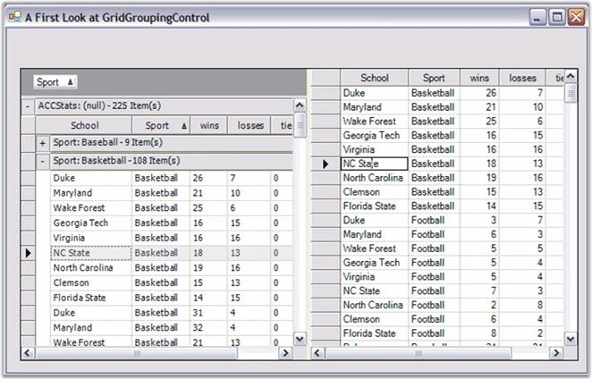

::: {style="DISPLAY: none"}
{#d2h_url_template}{#d2h_package_url style="WIDTH: 0px; DISPLAY: none; HEIGHT: 0px"}
:::

::::: {#nsbanner .d2h_main_nsbanner style="BORDER-BOTTOM: #999999 1px solid; POSITION: relative; PADDING-BOTTOM: 0px; BACKGROUND-COLOR: transparent; PADDING-LEFT: 0px; PADDING-RIGHT: 0px; DISPLAY: none; BORDER-TOP: #999999 1px solid; PADDING-TOP: 0px; LEFT: 0px"}
:::: {#TitleRow .d2h_main_titlerow style="PADDING-BOTTOM: 4px; BACKGROUND-COLOR: transparent; PADDING-LEFT: 22px; WIDTH: 100%; PADDING-RIGHT: 10px; DISPLAY: none; PADDING-TOP: 4px"}
::: {#ienav .d2h_main_ienav style="DISPLAY: none"}
{#D2HPrevious .D2HPreviousEnabled}  {#D2HNext .D2HNextEnabled}
:::
::::
:::::

:::: {#nstext .d2h_main_nstext style="PADDING-BOTTOM: 10px; BACKGROUND-COLOR: transparent; PADDING-LEFT: 22px; PADDING-RIGHT: 10px; HEIGHT: 100%; OVERFLOW: auto; PADDING-TOP: 5px" hasuserbackground="true" valign="bottom"}
::: {#d2h_breadcrumbs .d2h_breadcrumbs}
[Essential Studio User Guide Documentation](ms-xhelp:///?Id=12457748-09e3-4d74-a240-8e049cedf030){.d2h_breadcrumbsNormal}[ \> ]{.d2h_breadcrumbsLinkSeparator}[User Interface Edition](ms-xhelp:///?Id=c29296b7-531c-413b-a0ec-488ca1f7f669){.d2h_breadcrumbsNormal}[ \> ]{.d2h_breadcrumbsLinkSeparator}[Essential Windows](ms-xhelp:///?Id=e60759d8-47a4-4570-9d7a-16a68d63f2ea){.d2h_breadcrumbsNormal}[ \> ]{.d2h_breadcrumbsLinkSeparator}[Essential Grid]{.d2h_breadcrumbsContentsOnly}[ \> ]{.d2h_breadcrumbsLinkSeparator}[Grid Controls](ms-xhelp:///?Id=bf2d70d7-33dc-4c67-a55d-4fcf8d51dc2b){.d2h_breadcrumbsNormal}[ \> ]{.d2h_breadcrumbsLinkSeparator}[Grid Control](ms-xhelp:///?Id=ada2a727-2fb9-48d8-adef-54769621df7a){.d2h_breadcrumbsNormal}
:::

### Feature Summary {#feature-summary style="tab-stops: 0pt"}

[]{style="FONT-FAMILY: 'Trebuchet MS','sans-serif'; COLOR: #15428b; FONT-SIZE: 9pt"} 

Grid control is a powerful control that is implemented by using a unique Styles Architecture. This grid control which is similar to Microsoft Excel, allows detailed customization of the control down to the cell level. Multi-level Undo/Redo, shared scroll bar support, data/view separation, floating cells, more than 18 cell types and unmatched extensibility are unique features of the Grid control.

[]{style="FONT-FAMILY: 'Trebuchet MS','sans-serif'; COLOR: #15428b; FONT-SIZE: 9pt"} 

{border="0"}

 

Figure 73: Grid Grouping control and Grid Data Bound Grid in One Form

[]{style="FONT-FAMILY: 'Trebuchet MS','sans-serif'; COLOR: #15428b; FONT-SIZE: 9pt"} 

This section discusses the following features.

[]{style="FONT-FAMILY: 'Trebuchet MS','sans-serif'; COLOR: #15428b; FONT-SIZE: 9pt"} 

 

[]{#p42} 

 

More:

[ ]{#related-topics}

[{border="0" align="absMiddle"}Cell Attributes](ms-xhelp:///?Id=452a7dc4-8ade-41f6-accd-5a7f114390aa){style="TEXT-DECORATION: none"}

[{border="0" align="absMiddle"}Cell Types](ms-xhelp:///?Id=e40dd108-f2fa-4254-8363-2ce181cbe518){style="TEXT-DECORATION: none"}

[{border="0" align="absMiddle"}Data Binding](ms-xhelp:///?Id=35fca681-3fc8-4249-b230-607dbf506e70){style="TEXT-DECORATION: none"}

[{border="0" align="absMiddle"}MS Office Simulation](ms-xhelp:///?Id=c444333d-d060-445e-add6-dde2c33ece1c){style="TEXT-DECORATION: none"}

[{border="0" align="absMiddle"}Functionalities](ms-xhelp:///?Id=30c8d543-f31c-4e15-af20-6f506de82d82){style="TEXT-DECORATION: none"}

[{border="0" align="absMiddle"}General](ms-xhelp:///?Id=c27f26f7-d59b-45cd-8422-56566bf07bf7){style="TEXT-DECORATION: none"}
::::
