::: {style="DISPLAY: none"}
{#d2h_url_template}{#d2h_package_url style="WIDTH: 0px; DISPLAY: none; HEIGHT: 0px"}
:::

::::: {#nsbanner .d2h_main_nsbanner style="BORDER-BOTTOM: #999999 1px solid; POSITION: relative; PADDING-BOTTOM: 0px; BACKGROUND-COLOR: transparent; PADDING-LEFT: 0px; PADDING-RIGHT: 0px; DISPLAY: none; BORDER-TOP: #999999 1px solid; PADDING-TOP: 0px; LEFT: 0px"}
:::: {#TitleRow .d2h_main_titlerow style="PADDING-BOTTOM: 4px; BACKGROUND-COLOR: transparent; PADDING-LEFT: 22px; WIDTH: 100%; PADDING-RIGHT: 10px; DISPLAY: none; PADDING-TOP: 4px"}
::: {#ienav .d2h_main_ienav style="DISPLAY: none"}
{#D2HPrevious .D2HPreviousEnabled}  {#D2HNext .D2HNextEnabled}
:::
::::
:::::

:::: {#nstext .d2h_main_nstext style="PADDING-BOTTOM: 10px; BACKGROUND-COLOR: transparent; PADDING-LEFT: 22px; PADDING-RIGHT: 10px; HEIGHT: 100%; OVERFLOW: auto; PADDING-TOP: 5px" hasuserbackground="true" valign="bottom"}
::: {#d2h_breadcrumbs .d2h_breadcrumbs}
[Essential Studio User Guide Documentation](ms-xhelp:///?Id=12457748-09e3-4d74-a240-8e049cedf030){.d2h_breadcrumbsNormal}[ \> ]{.d2h_breadcrumbsLinkSeparator}[User Interface Edition](ms-xhelp:///?Id=c29296b7-531c-413b-a0ec-488ca1f7f669){.d2h_breadcrumbsNormal}[ \> ]{.d2h_breadcrumbsLinkSeparator}[Essential ASP.NET](ms-xhelp:///?Id=25c35330-c127-4dad-9a92-ed79dc7261a6){.d2h_breadcrumbsNormal}[ \> ]{.d2h_breadcrumbsLinkSeparator}[Essential Grid]{.d2h_breadcrumbsContentsOnly}[ \> ]{.d2h_breadcrumbsLinkSeparator}[Getting Started](ms-xhelp:///?Id=da2908d9-a1a0-42b2-b989-0222428e0694){.d2h_breadcrumbsNormal}
:::

## Feature Summary {#feature-summary style="tab-stops: 0pt"}

[]{style="FONT-FAMILY: 'Trebuchet MS','sans-serif'; COLOR: #15428b; FONT-SIZE: 9pt"} 

Here is a brief overview of the various features of Grid Grouping control.

[]{style="FONT-FAMILY: 'Trebuchet MS','sans-serif'; COLOR: #15428b; FONT-SIZE: 9pt"} 

[·      ]{style="FONT-FAMILY: Symbol"}**Drag and Drop** to start using the controls: no coding required.

[]{style="FONT-FAMILY: 'Trebuchet MS','sans-serif'; COLOR: #15428b; FONT-SIZE: 9pt"} 

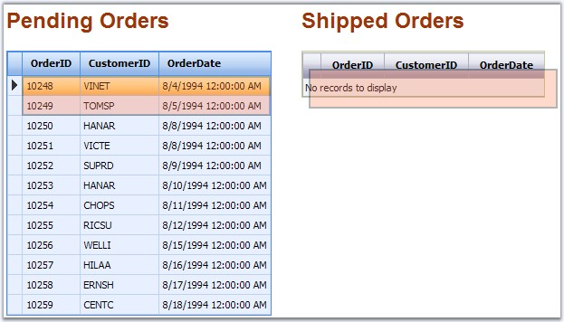{border="0"}

[]{style="FONT-FAMILY: 'Trebuchet MS','sans-serif'; COLOR: red; FONT-SIZE: 9pt"} 

Figure 13: Drag and Drop Support

[]{style="FONT-FAMILY: 'Trebuchet MS','sans-serif'; COLOR: #15428b; FONT-SIZE: 9pt"} 

[·      ]{style="FONT-FAMILY: Symbol"}**Design-Time Support**: GridGroupingControl provides full support for the design mode of Visual Studio .NET. This allows you to build and customize the grid.

[]{style="FONT-FAMILY: 'Trebuchet MS','sans-serif'; COLOR: #15428b; FONT-SIZE: 9pt"} 

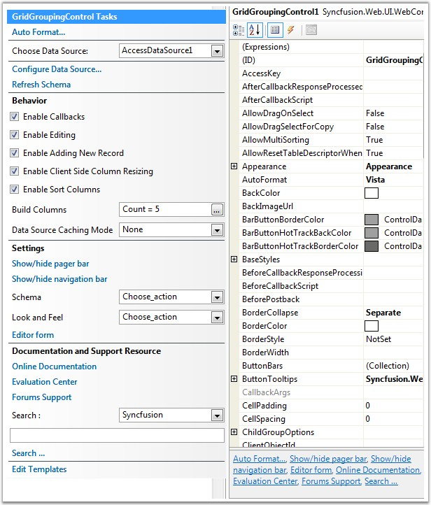{border="0"}

***[]{style="FONT-FAMILY: 'Trebuchet MS','sans-serif'; COLOR: #15428b; FONT-SIZE: 9pt"}*** 

Figure 14: Design-time Support

[]{style="FONT-FAMILY: 'Trebuchet MS','sans-serif'; COLOR: #15428b; FONT-SIZE: 9pt"} 

[·      ]{style="FONT-FAMILY: Symbol"}**Various Data Sources[ ]{style="FONT-FAMILY: 'Verdana','sans-serif'; COLOR: black; FONT-SIZE: 8pt"}**like Access, XML, Array List, Object Base, Collection Base and LINQ are supported.

[]{style="FONT-FAMILY: 'Trebuchet MS','sans-serif'; COLOR: #15428b; FONT-SIZE: 9pt"} 

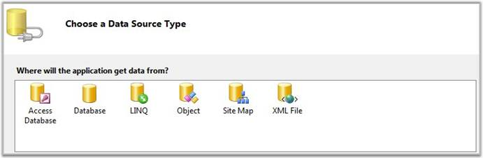{border="0"}

***[]{style="FONT-FAMILY: 'Trebuchet MS','sans-serif'; COLOR: #15428b; FONT-SIZE: 9pt"}*** 

Figure 15: Data Sources

[]{style="FONT-FAMILY: 'Trebuchet MS','sans-serif'; COLOR: #15428b; FONT-SIZE: 9pt"} 

[·      ]{style="FONT-FAMILY: Symbol"}**Codeless Data Binding** with the data sources implemented in ASP.NET.

[]{style="FONT-FAMILY: 'Trebuchet MS','sans-serif'; COLOR: #15428b; FONT-SIZE: 9pt"} 

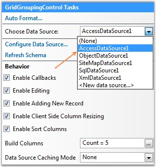{border="0"}

***[]{style="FONT-FAMILY: 'Trebuchet MS','sans-serif'; COLOR: #15428b; FONT-SIZE: 9pt"}*** 

Figure 16: Codeless Data Binding

[]{style="FONT-FAMILY: 'Trebuchet MS','sans-serif'; COLOR: #15428b; FONT-SIZE: 9pt"} 

[·      ]{style="FONT-FAMILY: Symbol"}**Look and Feel**: there are plenty of built-in skins that reflect the look and feel of some popular applications like Office, XP, Vista, Mac, and so on.

[]{style="FONT-FAMILY: 'Trebuchet MS','sans-serif'; COLOR: #15428b; FONT-SIZE: 9pt"} 

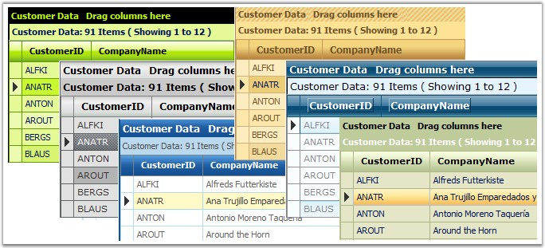{border="0"}

***[]{style="FONT-FAMILY: 'Trebuchet MS','sans-serif'; COLOR: #15428b; FONT-SIZE: 9pt"}*** 

Figure 17: Built-in Skins

[]{style="FONT-FAMILY: 'Trebuchet MS','sans-serif'; COLOR: #15428b; FONT-SIZE: 9pt"} 

[·      ]{style="FONT-FAMILY: Symbol"}**Advanced Styles Architecture**: apart from the built-in skins, the grid control lets you specify styles for a large number of logical regions like column headers, group captions, summary cells, etc., and appropriately synthesize the final look and feel. You can also use CSS Style sheets to specify the styles for different portions of the grid.

[·      ]{style="FONT-FAMILY: Symbol"}**Grouping**: GridGroupingControl allows you to group the data by just dragging the Header to the Group Drop area in the top of the Grid. Multilevel grouping is an added advantage.

[]{style="FONT-FAMILY: 'Trebuchet MS','sans-serif'; COLOR: #15428b; FONT-SIZE: 9pt"} 

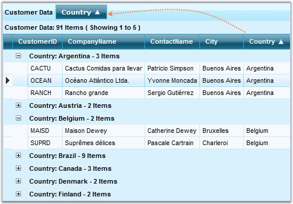{border="0"}

***[]{style="FONT-FAMILY: 'Trebuchet MS','sans-serif'; COLOR: #15428b; FONT-SIZE: 9pt"}*** 

Figure 18: Grouping Illustrated

[]{style="FONT-FAMILY: 'Trebuchet MS','sans-serif'; COLOR: #15428b; FONT-SIZE: 9pt"} 

[·      ]{style="FONT-FAMILY: Symbol"}**Sorting**[:]{style="FONT-FAMILY: 'Verdana','sans-serif'; COLOR: black; FONT-SIZE: 8pt"} you can programmatically sort by one or more columns and the users can also do the same during runtime. This functionality has the following features.

[]{style="FONT-FAMILY: 'Trebuchet MS','sans-serif'; COLOR: #15428b; FONT-SIZE: 9pt"} 

[·      ]{style="FONT-FAMILY: Symbol"}Ability to restrict sorting to one column or enable multi-column sort.

[·      ]{style="FONT-FAMILY: Symbol"}In addition to the simple one-column sorting, GridGroupingControl allows you to sort data by several columns as in Microsoft Excel.

[]{style="FONT-FAMILY: 'Trebuchet MS','sans-serif'; COLOR: #15428b; FONT-SIZE: 9pt"} 

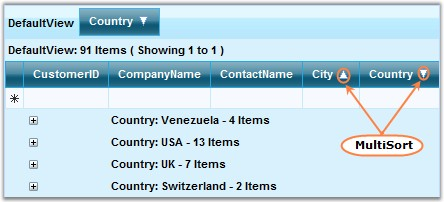{border="0"}

***[]{style="FONT-FAMILY: 'Trebuchet MS','sans-serif'; COLOR: #15428b; FONT-SIZE: 9pt"}*** 

Figure 19: Sorting Illustrated

[]{style="FONT-FAMILY: 'Trebuchet MS','sans-serif'; COLOR: #15428b; FONT-SIZE: 9pt"} 

[·      ]{style="FONT-FAMILY: Symbol"}**Filtering**: allows you to filter the data in the control using the Filter Bar.

[]{style="FONT-FAMILY: 'Trebuchet MS','sans-serif'; COLOR: #15428b; FONT-SIZE: 9pt"} 

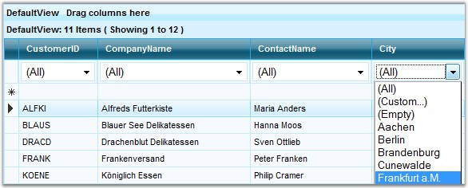{border="0"}

***[]{style="FONT-FAMILY: 'Trebuchet MS','sans-serif'; COLOR: #15428b; FONT-SIZE: 9pt"}*** 

 Figure 20: Filtering Illustrated

[]{style="FONT-FAMILY: 'Trebuchet MS','sans-serif'; COLOR: #15428b; FONT-SIZE: 9pt"} 

[·      ]{style="FONT-FAMILY: Symbol"}**Search TextBox**: this is the most useful feature available for a user to search any word in the grid by passing the word in the Search TextBox available in the top-right corner of the GridGroupingControl.

[]{style="FONT-FAMILY: 'Trebuchet MS','sans-serif'; COLOR: #15428b; FONT-SIZE: 9pt"} 

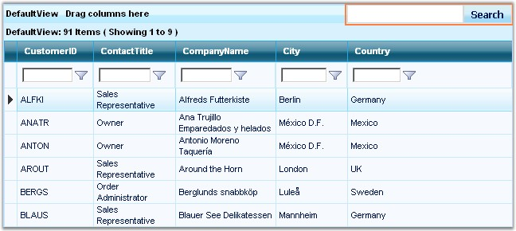{border="0"}

***[]{style="FONT-FAMILY: 'Trebuchet MS','sans-serif'; COLOR: #15428b; FONT-SIZE: 9pt"}*** 

Figure 21: Search Text Box

[]{style="FONT-FAMILY: 'Trebuchet MS','sans-serif'; COLOR: #15428b; FONT-SIZE: 9pt"} 

[·      ]{style="FONT-FAMILY: Symbol"}**Paging**: GridGroupingControl provides built-in paging functionality. Also, it includes a Pager Bar that allows you to navigate between the various pages in the grid and a Paging control is available that can be used with the grid.

[]{style="FONT-FAMILY: 'Trebuchet MS','sans-serif'; COLOR: #15428b; FONT-SIZE: 9pt"} 

{border="0"}

***[]{style="FONT-FAMILY: 'Trebuchet MS','sans-serif'; COLOR: #15428b; FONT-SIZE: 9pt"}*** 

Figure 22: Paging Illustrated

[]{style="FONT-FAMILY: 'Trebuchet MS','sans-serif'; COLOR: #15428b; FONT-SIZE: 9pt"} 

[·      ]{style="FONT-FAMILY: Symbol"}**Summaries**: you can easily create advanced summaries by adding SummaryRows and SummaryColumns through designer or code. It has the following features.

[]{style="FONT-FAMILY: 'Trebuchet MS','sans-serif'; COLOR: #15428b; FONT-SIZE: 9pt"} 

[·      ]{style="FONT-FAMILY: Symbol"}Pre-built summary types include Sum, Average, Count, and so on.

[·      ]{style="FONT-FAMILY: Symbol"}Provides optimal summary calculation.

[·      ]{style="FONT-FAMILY: Symbol"}Vector Summaries that operate on vectors such as Distinct Count, Median, and 25% and 75% Quartile.

[·      ]{style="FONT-FAMILY: Symbol"}You can also use hidden summaries to summarize data in your table and display it elsewhere.

[·      ]{style="FONT-FAMILY: Symbol"}Supports custom summaries.

[·      ]{style="FONT-FAMILY: Symbol"}Include summaries in the Caption cell.

[]{style="FONT-FAMILY: 'Trebuchet MS','sans-serif'; COLOR: #15428b; FONT-SIZE: 9pt"} 

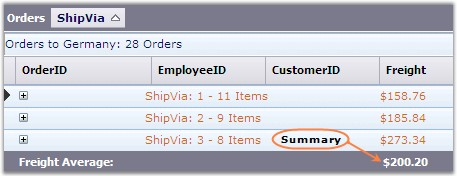{border="0"}

***[]{style="FONT-FAMILY: 'Trebuchet MS','sans-serif'; COLOR: #15428b; FONT-SIZE: 9pt"}*** 

Figure 23: Summaries

[]{style="FONT-FAMILY: 'Trebuchet MS','sans-serif'; COLOR: #15428b; FONT-SIZE: 9pt"} 

[·      ]{style="FONT-FAMILY: Symbol"}**Column Types**: a wide range of column types like CheckBox, Date Picker and more, are available.

[]{style="FONT-FAMILY: 'Trebuchet MS','sans-serif'; COLOR: #15428b; FONT-SIZE: 9pt"} 

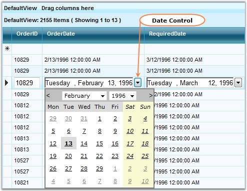{border="0"}

***[]{style="FONT-FAMILY: 'Trebuchet MS','sans-serif'; COLOR: #15428b; FONT-SIZE: 9pt"}*** 

Figure 24: Column Types Illustrated

[]{style="FONT-FAMILY: 'Trebuchet MS','sans-serif'; COLOR: #15428b; FONT-SIZE: 9pt"} 

[·      ]{style="FONT-FAMILY: Symbol"}**Column Resizing**: GridGroupingControl supports convenient runtime resizing of the grid column.\
\

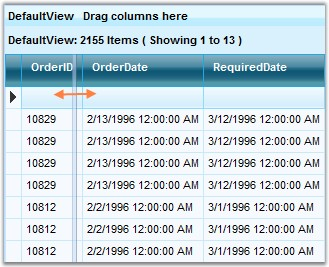{border="0"}

***[]{style="FONT-FAMILY: 'Trebuchet MS','sans-serif'; COLOR: #15428b; FONT-SIZE: 9pt"}*** 

Figure 25: Column Resizing Illustrated

[]{style="FONT-FAMILY: 'Trebuchet MS','sans-serif'; COLOR: #15428b; FONT-SIZE: 9pt"} 

[·      ]{style="FONT-FAMILY: Symbol"}**Column Reordering with Drag-and-Drop**: GridGroupingControl allows users to quickly reorder the columns by simply dragging their headers.

[]{style="FONT-FAMILY: 'Trebuchet MS','sans-serif'; COLOR: #15428b; FONT-SIZE: 9pt"} 

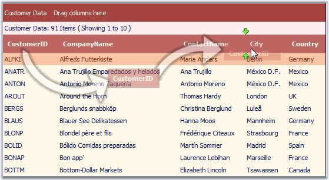{border="0"}

***[]{style="FONT-FAMILY: 'Trebuchet MS','sans-serif'; COLOR: #15428b; FONT-SIZE: 9pt"}*** 

Figure 26: Column Reordering Illustrated

**[]{style="FONT-FAMILY: 'Trebuchet MS','sans-serif'; COLOR: #15428b; FONT-SIZE: 9pt"}** 

[·      ]{style="FONT-FAMILY: Symbol"}**Expression Fields**: refers to those fields which take the values of the other fields as operands, and perform arithmetic and relational operations on them.

[]{style="FONT-FAMILY: 'Trebuchet MS','sans-serif'; COLOR: #15428b; FONT-SIZE: 9pt"} 

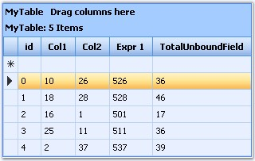{border="0"}

***[]{style="FONT-FAMILY: 'Trebuchet MS','sans-serif'; COLOR: #15428b; FONT-SIZE: 9pt"}*** 

Figure 27: Expression Fields

[]{style="FONT-FAMILY: 'Trebuchet MS','sans-serif'; COLOR: #15428b; FONT-SIZE: 9pt"} 

[·      ]{style="FONT-FAMILY: Symbol"}**Sizing**: you can specify a custom size for the columns, rows, group captions and so on. You can also specify a custom size for the grid and either let it scroll or shrink.

[·      ]{style="FONT-FAMILY: Symbol"}**Scrolling**: specify a Width and Height for the control and the grid will automatically show Scroll Bars if necessary.

[·      ]{style="FONT-FAMILY: Symbol"}**Frozen Rows and Columns**: the rows and columns can be frozen, and this can be viewed while scrolling through a grid with large number of cells. You can also freeze the column headers, for example, on the top and one or more important columns to the left of the grid.

[·      ]{style="FONT-FAMILY: Symbol"}**MultiLevel Hierarchy**: GridGroupingControl can generate a hierarchical presentation from the multiple source table with the relations defined which provides a treelist-like data presentation. GridGroupingControl allows presentation of related Data Sets as hierarchical structures of tables. Two or more tables can be related in a single grid, and the Data can be displayed in a Hierarchical Structure.

[]{style="FONT-FAMILY: 'Trebuchet MS','sans-serif'; COLOR: #15428b; FONT-SIZE: 9pt"} 

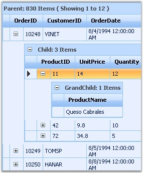{border="0"}

***[]{style="FONT-FAMILY: 'Trebuchet MS','sans-serif'; COLOR: #15428b; FONT-SIZE: 9pt"}*** 

Figure 28: MultiLevel Hierarchy Illustrated

[]{style="FONT-FAMILY: 'Trebuchet MS','sans-serif'; COLOR: #15428b; FONT-SIZE: 9pt"} 

[·      ]{style="FONT-FAMILY: Symbol"}**MultiRow Records**: there is built-in support for rendering a single record in multiple rows, in other words, wrapped rows.

[]{style="FONT-FAMILY: 'Trebuchet MS','sans-serif'; COLOR: #15428b; FONT-SIZE: 9pt"} 

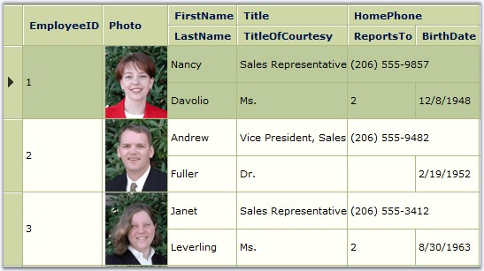{border="0"}

***[]{style="FONT-FAMILY: 'Trebuchet MS','sans-serif'; COLOR: #15428b; FONT-SIZE: 9pt"}*** 

Figure 29: MultiRow Records

[]{style="FONT-FAMILY: 'Trebuchet MS','sans-serif'; COLOR: #15428b; FONT-SIZE: 9pt"} 

[·      ]{style="FONT-FAMILY: Symbol"}**MultiRow Selection and Area Selection**: you can easily select multiple rows using \'Ctrl + Click\', or by simply dragging a range over the rows which you want to select.

[·      ]{style="FONT-FAMILY: Symbol"}**Flexible Editing Functionality**

[]{style="FONT-FAMILY: 'Trebuchet MS','sans-serif'; COLOR: #15428b; FONT-SIZE: 9pt"} 

Auto-Generated Edit Forms

[·      ]{style="FONT-FAMILY: Symbol"}in-line: edit controls appear within the edited row.

[·      ]{style="FONT-FAMILY: Symbol"}in-forms: the grid generates a form for entering the row data.

[·      ]{style="FONT-FAMILY: Symbol"}form template: template which gives you the flexibility to design the edit form with custom set of controls.

[]{style="FONT-FAMILY: 'Trebuchet MS','sans-serif'; COLOR: #15428b; FONT-SIZE: 9pt"} 

[·      ]{style="FONT-FAMILY: Symbol"}**Custom Editors Support**: editable columns in GridGroupingControl (GridBoundColumn, GridDropDownColumn, GridCheckBoxColumn) allow you to replace their default editor with custom ones with enhanced functionality like validation, rich-text editing and so on. Once you have created the custom editors, you can then easily re-use them for other grid implementations.

[·      ]{style="FONT-FAMILY: Symbol"}**Export**: there is built-in support for exporting the content of the grouping grid to the Excel format. There is a built-in button that can be added to the Button Bar to enable this feature.

[·      ]{style="FONT-FAMILY: Symbol"}**Keyboard Support**: enables convenient navigation / editing / selection by using the keyboard ARROW and SPACE/ENTER keys.

 

[]{#related-topics}
::::
