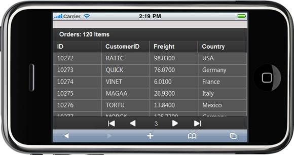
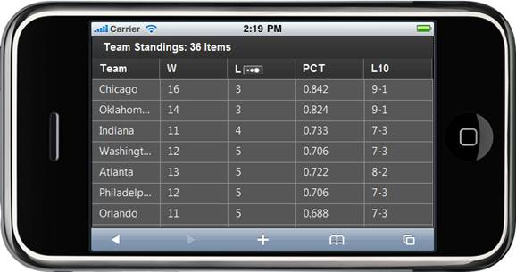
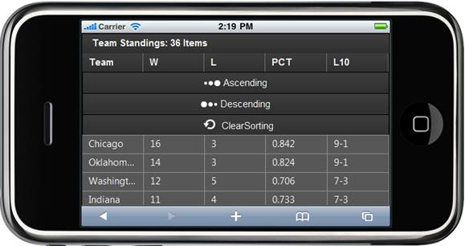
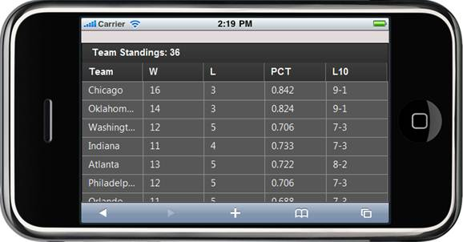
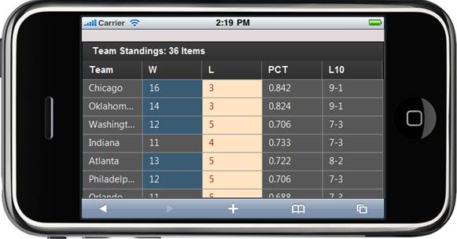
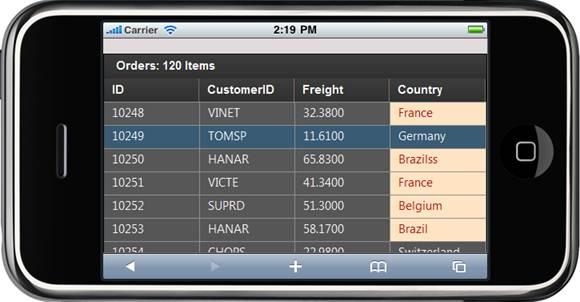

::: {style="DISPLAY: none"}
{#d2h_url_template}{#d2h_package_url style="WIDTH: 0px; DISPLAY: none; HEIGHT: 0px"}
:::

::::: {#nsbanner .d2h_main_nsbanner style="BORDER-BOTTOM: #999999 1px solid; POSITION: relative; PADDING-BOTTOM: 0px; BACKGROUND-COLOR: transparent; PADDING-LEFT: 0px; PADDING-RIGHT: 0px; DISPLAY: none; BORDER-TOP: #999999 1px solid; PADDING-TOP: 0px; LEFT: 0px"}
:::: {#TitleRow .d2h_main_titlerow style="PADDING-BOTTOM: 4px; BACKGROUND-COLOR: transparent; PADDING-LEFT: 22px; WIDTH: 100%; PADDING-RIGHT: 10px; DISPLAY: none; PADDING-TOP: 4px"}
::: {#ienav .d2h_main_ienav style="DISPLAY: none"}
{#D2HPrevious .D2HPreviousEnabled}  {#D2HNext .D2HNextEnabled}
:::
::::
:::::

:::: {#nstext .d2h_main_nstext style="PADDING-BOTTOM: 10px; BACKGROUND-COLOR: transparent; PADDING-LEFT: 22px; PADDING-RIGHT: 10px; HEIGHT: 100%; OVERFLOW: auto; PADDING-TOP: 5px" hasuserbackground="true" valign="bottom"}
::: {#d2h_breadcrumbs .d2h_breadcrumbs}
[Essential Studio User Guide Documentation](ms-xhelp:///?Id=12457748-09e3-4d74-a240-8e049cedf030){.d2h_breadcrumbsNormal}[ \> ]{.d2h_breadcrumbsLinkSeparator}[User Interface Edition](ms-xhelp:///?Id=c29296b7-531c-413b-a0ec-488ca1f7f669){.d2h_breadcrumbsNormal}[ \> ]{.d2h_breadcrumbsLinkSeparator}[Essential Mobile MVC](ms-xhelp:///?Id=74df42e3-5434-4590-9be6-3ae2f911cbbc){.d2h_breadcrumbsNormal}[ \> ]{.d2h_breadcrumbsLinkSeparator}[Essential Grid]{.d2h_breadcrumbsContentsOnly}[ \> ]{.d2h_breadcrumbsLinkSeparator}[Getting Started](ms-xhelp:///?Id=397f4d98-2e34-4dc5-8b77-1d56a317b150){.d2h_breadcrumbsNormal}
:::

## Feature Summary {#feature-summary style="tab-stops: 0pt"}

[This section will walk you through all the features of the Chart control.]{style="FONT-FAMILY: 'Arial','sans-serif'; FONT-SIZE: 10pt"}

**Paging**

Essential Grid for Mobile MVC offers complete navigation support to easily switch between the pages through swipe-up and swipe-down actions on the grid content area. Also, a pager bar will be available at the bottom of the page and it will be visible only on swiping the grid content area. It facilitates splitting up huge grid data and displays viewable sets of grid rows on each page.

{border="0"}

Figure 32: Paging in a Grid

**Sorting**

Sorting is defined as the process of arranging items/records in some ordered sequence. Essential Grid for Mobile MVC supports arranging table data in ascending or descending order based on the column header that is touched. The order switches between ascending, descending, and clearing the sort order each time you touch a column header for sorting. It supports two types of sorting---normal and menu sorting.

 

{border="0"}

Figure 33: Normal Sorting in a Grid

 

 

{border="0"}

Figure 34: Menu Sorting in a Grid

 

**JSON Grid**

Essential Grid for Mobile MVC also supports a JSON mode in which you can perform all the grid operations. The performance of these operations in JSON mode will be much faster when compared to the server mode.

 

{border="0"}

Figure 35: JSON Grid

QueryCellAction

[Grid formatting can be applied to different grid cell elements dynamically at run time. This can be achieved by proper handling of the **QueryCellInfo** action. It provides the **Htmlattributes** object for a cell on demand.]{style="FONT-FAMILY: 'Arial','sans-serif'; FONT-SIZE: 10pt"}

**[QueryCellInfo]{style="FONT-FAMILY: 'Arial','sans-serif'; FONT-SIZE: 10pt"}**[ is raised every time a request is made to access the style information for a cell. You can do any type of cell formatting with this event.]{style="FONT-FAMILY: 'Arial','sans-serif'; FONT-SIZE: 10pt"}

{border="0"}

Figure 36: Grid Customization Using QueryCell Action[]{style="FONT-FAMILY: 'Calibri','sans-serif'; FONT-SIZE: 11pt"}

**Conditional Formatting**

This feature is used to format grid content based on some condition specified by the user.

 

{border="0"}

Figure 37: Conditional Formatting in a Grid

 

[]{#related-topics}
::::
