::: {style="DISPLAY: none"}
{#d2h_url_template} {#d2h_package_url style="WIDTH: 0px; DISPLAY: none; HEIGHT: 0px"}
:::

::::: {#nsbanner .d2h_main_nsbanner style="BORDER-BOTTOM: #999999 1px solid; POSITION: relative; PADDING-BOTTOM: 0px; BACKGROUND-COLOR: transparent; PADDING-LEFT: 0px; PADDING-RIGHT: 0px; DISPLAY: none; BORDER-TOP: #999999 1px solid; PADDING-TOP: 0px; LEFT: 0px"}
:::: {#TitleRow .d2h_main_titlerow style="PADDING-BOTTOM: 4px; BACKGROUND-COLOR: transparent; PADDING-LEFT: 22px; WIDTH: 100%; PADDING-RIGHT: 10px; DISPLAY: none; PADDING-TOP: 4px"}
::: {#ienav .d2h_main_ienav style="DISPLAY: none"}
{#D2HPrevious .D2HPreviousEnabled}  {#D2HNext .D2HNextEnabled}
:::
::::
:::::

:::: {#nstext .d2h_main_nstext style="PADDING-BOTTOM: 10px; BACKGROUND-COLOR: transparent; PADDING-LEFT: 22px; PADDING-RIGHT: 10px; HEIGHT: 100%; OVERFLOW: auto; PADDING-TOP: 5px" hasuserbackground="true" valign="bottom"}
::: {#d2h_breadcrumbs .d2h_breadcrumbs}
[Essential Studio User Guide Documentation](ms-xhelp:///?Id=12457748-09e3-4d74-a240-8e049cedf030){.d2h_breadcrumbsNormal} [ \> ]{.d2h_breadcrumbsLinkSeparator} [User Interface Edition](ms-xhelp:///?Id=c29296b7-531c-413b-a0ec-488ca1f7f669){.d2h_breadcrumbsNormal} [ \> ]{.d2h_breadcrumbsLinkSeparator} [Essential Mobile MVC](ms-xhelp:///?Id=74df42e3-5434-4590-9be6-3ae2f911cbbc){.d2h_breadcrumbsNormal} [ \> ]{.d2h_breadcrumbsLinkSeparator} [Essential Tools]{.d2h_breadcrumbsContentsOnly} [ \> ]{.d2h_breadcrumbsLinkSeparator} [Getting Started](ms-xhelp:///?Id=07dff027-c96d-450f-9a9b-6037f838f4da){.d2h_breadcrumbsNormal}
:::

## Feature Summary {#feature-summary style="tab-stops: 0pt"}

ListBox:

Essential ListBox tool for Mobile MVC builds a dynamic interactive list view interface.\
This control provides the infrastructure to display a set of data items in different layouts or views. Lists are used for displaying data, data navigation, result lists, and data entry. It supports server data binding, json binding and web service binding. It also supports client side filtering. The list box control supports four built-in skins that enhance the look and feel.

[]{style="LINE-HEIGHT: 150%; FONT-SIZE: 12pt"} 

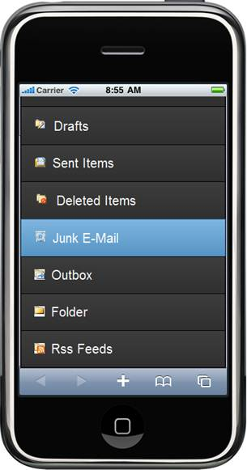{border="0"}

Figure 29: Listbox in Mobile MVC- vertical

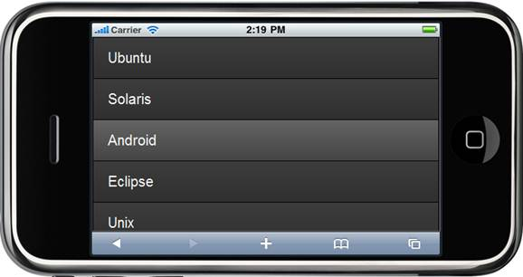{border="0"}

Figure 30: Horizontal listbox

 

 

Tab:

Essential Tools Mobile Tab for MVC builds a dynamic interactive menu-driven tabbed interface from existing content. The content can be text, image, graphics, or HTML.\
Add as many items as you wish; if you add more items than can be displayed by the tab bar, a **More** item automatically appears at the end of the tab bar.\
Items that don\'t fit on the tab bar appear when the end-user touches the more item. It supports databinding for tab items. It also supports two types of tab styles: opened and closed. The tab control supports four built-in skins that enhance the look and feel.

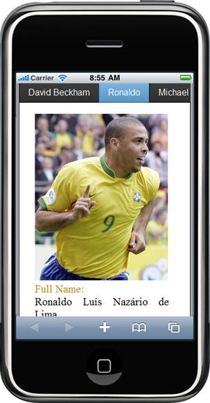{border="0"}

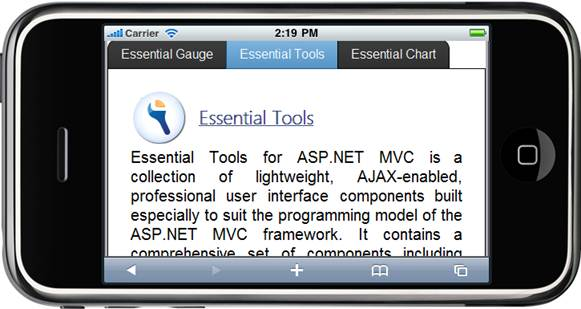{border="0"}

**[]{style="LINE-HEIGHT: 150%; FONT-SIZE: 12pt"}**  

ScrollPanel:

Essential Tools Mobile ScrollPanel for MVC builds an interactive panel for scrolling. The scroll panel control which wraps its contents in a scrollable area is an object in a GUI with which continuous text, pictures or anything else can be scrolled, i.e., viewed even if it does not fit into the space in a mobile display, computer display, or window. The scroll panel control supports four built-in skins that enhance the look and feel.

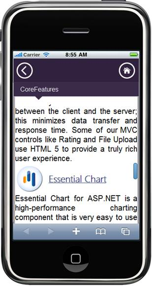{border="0"}

Rating:

Essential Tools Mobile Rating for MVC provides an intuitive rating experience that allows the end-user to select a number of stars that represent a rating. The user can now experience [precise ratings, instead of rounded-off values. ]{style="COLOR: black; FONT-SIZE: 12pt"}The rating control supports four built-in skins that enhance the look and feel. [It provides the following support.]{style="COLOR: black; FONT-SIZE: 12pt"}

[·      ]{style="FONT-FAMILY: Symbol"}Full, half, and exact precision support.

[·      ]{style="FONT-FAMILY: Symbol"}Horizontal and vertical orientation support.

[·      ]{style="FONT-FAMILY: Symbol"}Auto-post-back support.

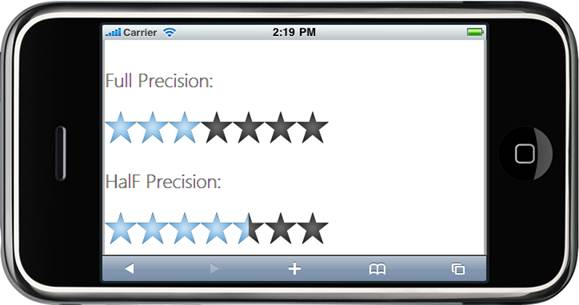{border="0"}

**[]{style="LINE-HEIGHT: 150%; FONT-SIZE: 14pt"}**  

ProgressBar:

Essential Tools Mobile Progress bar for MVC helps you to graphically represent the progress of an ongoing process. Since, it is a client-side control, information can be loaded quickly. The progress bar control supports four built-in skins that enhance the look and feel.

**[ 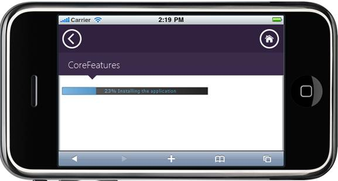{border="0"} ]{style="LINE-HEIGHT: 150%; FONT-SIZE: 14pt"}** **[]{style="LINE-HEIGHT: 150%; FONT-SIZE: 14pt"}**

Menu:

Essential Tools Mobile Menu for MVC supports a menu of items, rendered using the items collection, data binding, and template. Menu will be rendered the sub-items as the child items. Menu is displayed their items in horizontal and vertical orientation. It supports four built-in themes that enhances it look and feel.

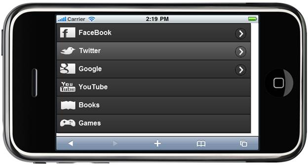{border="0"}

**[]{style="LINE-HEIGHT: 150%; FONT-SIZE: 14pt"}**  

Toolbar:

Essential Tools Mobile Toolbar for MVC displays a list of items, rendered using the items collection, data binding, and template. It supports four built-in themes that enhances it look and feel. We can enable/disable, show/hide the toolbar items and it supports panning support to view the invisible items.

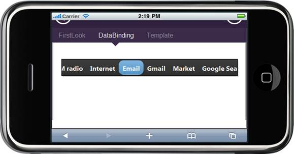{border="0"}

**[]{style="LINE-HEIGHT: 150%; FONT-SIZE: 14pt"}**  

Dialog:

Essential Tools Mobile Dialog control for MVC allows form content, messages, images and text.  Dialog supports draggable and can be place in a particular position. The dialog control supports four built-in skins that enhance the look and feel.

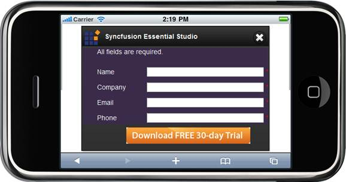{border="0"}

**[]{style="LINE-HEIGHT: 150%; FONT-SIZE: 14pt"}**  

Header:

Essential Tools Mobile header control for MVC displays a header content of mobile application. It provides customize options to set caption,show/hide, and template content for left and right button. There are options to set template content and header's title for header control. The header control supports four built-in skins that enhance the look and feel.

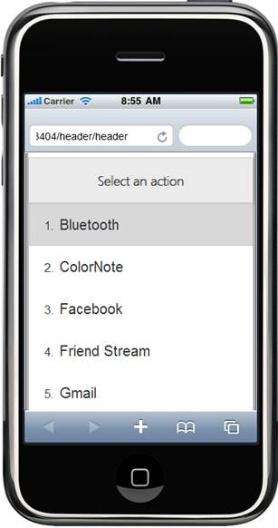{border="0"}

Footer:

Essential Tools Mobile footer control for MVC displays a footer content of mobile application. It provides customize options to set caption,show/hide, and template content for left and right button. There are options to set template content and header's title for footer control. The footer control supports four built-in skins that enhance the look and feel.

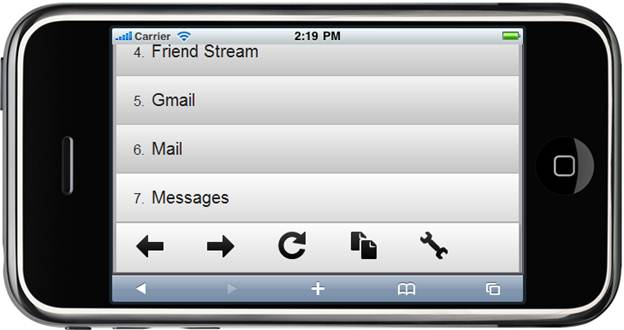{border="0"}

**[]{style="LINE-HEIGHT: 150%; FONT-SIZE: 14pt"}**  

Slider:

Essential Tools Mobile Slider for MVC builds a dynamic interactive to visually select a specific value (or a value range in the case of a range slider) within a range of values. It supports both horizontal and vertical orientations. Also it supports for wide range of tick marks and different slider handles. It provides html5 tool tip to display the current value of the slider. The slider control supports four built-in skins that enhance the look and feel.

{border="0"}

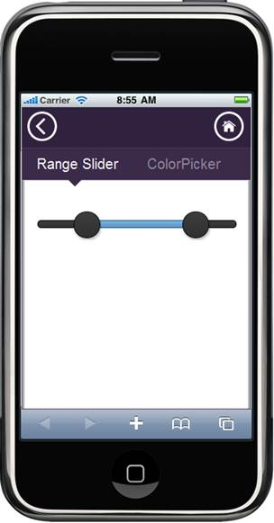{border="0"}

 

Accordion:

            The Essential Tools mobile-Accordion control for ASP.NET MVC builds a dynamic interactive menu-driven tabbed interface from the existing content. The content can be text, image, graphics, or HTML. You can add as many items as you wish and this control is used widely in navigation, sliding, minimizing and maximizing content. Such accordions practically are expandable whenever required and you can really save some space and will be able to show a lot of information using this technique.

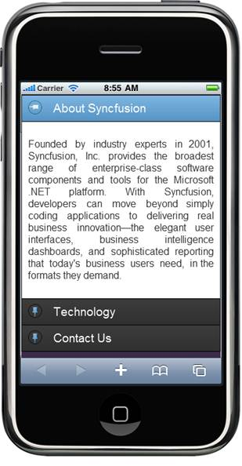{border="0"} []{style="FONT-FAMILY: 'Calibri','sans-serif'; FONT-SIZE: 11pt"}

Figure 31: Accordion Control---Portrait

{border="0"} []{style="FONT-FAMILY: 'Calibri','sans-serif'; FONT-SIZE: 11pt"}

Figure 32: Accordion Control---Landscape

 

Date Picker

The DatePicker control is tied to a standard form input field. Focus on the input (touch) to open an interactive calendar in three different modes, namely **Simple**, **Android**, and **Advanced**. In the Advanced mode, we can switch between Simple and Android modes. If a date is chosen, the selected date is shown as the input value.

 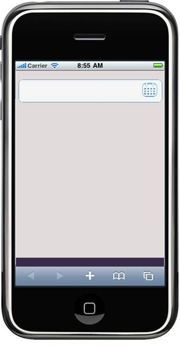{border="0"}[]{style="FONT-FAMILY: 'Calibri','sans-serif'; FONT-SIZE: 11pt"}

Figure 33: DatePicker---Input

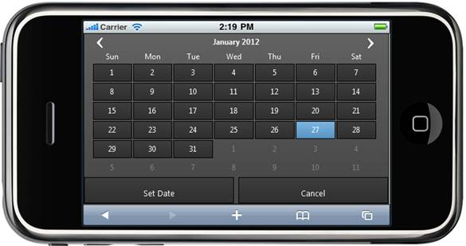{border="0"} []{style="FONT-FAMILY: 'Calibri','sans-serif'; FONT-SIZE: 11pt"}

Figure 34: Simple Mode---Landscape

[]{style="FONT-FAMILY: 'Calibri','sans-serif'; FONT-SIZE: 11pt"} 

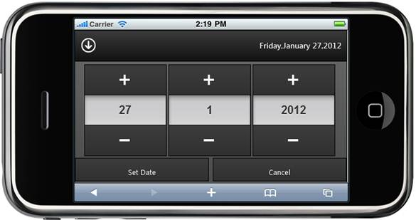{border="0"} []{style="FONT-FAMILY: 'Calibri','sans-serif'; FONT-SIZE: 11pt"}

Figure 35: Android Mode---Landscape

[]{style="FONT-FAMILY: 'Calibri','sans-serif'; FONT-SIZE: 11pt"} 

{border="0"} []{style="FONT-FAMILY: 'Calibri','sans-serif'; FONT-SIZE: 11pt"}

Figure 36: Simple Mode---Portrait

[]{style="FONT-FAMILY: 'Calibri','sans-serif'; FONT-SIZE: 11pt"} 

{border="0"} []{style="FONT-FAMILY: 'Calibri','sans-serif'; FONT-SIZE: 11pt"}

Figure 37: Android Mode---Portrait

[]{style="FONT-STYLE: normal; FONT-FAMILY: 'Calibri','sans-serif'; FONT-SIZE: 11pt"} 

 

[]{#related-topics}
::::
