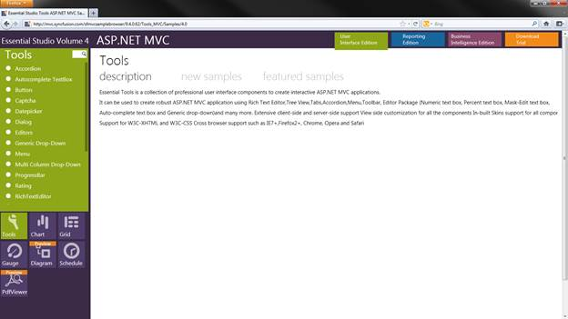

::: {style="DISPLAY: none"}
{#d2h_url_template}{#d2h_package_url style="WIDTH: 0px; DISPLAY: none; HEIGHT: 0px"}
:::

::::: {.d2h_secondary_topic style="PADDING-BOTTOM: 10pt; MARGIN: 0pt; PADDING-LEFT: 0pt; PADDING-RIGHT: 0pt; PADDING-TOP: 0pt"}
#### Feature Summary {#feature-summary style="tab-stops: 0pt"}

When the filter feature is enabled in the [MultiColumnDropDown control, you ]{style="COLOR: black"}can filter data from multiple columns at the same time so that the data filtered is specific to your need.

Clicking the filter icon opens up a menu of fields that can be filtered out.

When selecting a submenu item, a separate dialog box opens and displays an advanced filter drop-down that lists the available filter operators for the corresponding column and provides text boxes. You can type a string to filter out whatever you require to be filtered from the table.

 

Where do I find Installed samples?

To view the samples:

1.   Open the Syncfusion **Dashboard**. The **Essential Studio User Interface Edition** window is displayed by default. Select **ASP.NET MVC** from the panel on the left side of the window. 

2.   Click the **Run Samples** button. The Essential Studio for ASP.NET MVC sample browser is displayed.

{border="0"}

Figure 329: Essential Tools MVC Edition Sample Browser

3.   Select **Grid**.

4.   Select any sample from the **Filtering tab** under **Multicolumn DropDown** and browse through the features.

 

Properties for Filtering in the MultiColumnDropDown Control

The properties that are used to implement filtering under the MultiColumnDropDown control are tabulated below.

::: {align="center"}
+----------------+--------------------------------+------------------+------------------+------------------------+
|  Property      | Description                    | Type of property | Value it accepts | Any other dependencies |
+----------------+--------------------------------+------------------+------------------+------------------------+
| AllowFiltering | Enables the Filtering feature. | bool             | True/false       | NA                     |
|                |                                |                  |                  |                        |
|                | Default value is False.        |                  |                  |                        |
+================+================================+==================+==================+========================+
:::

[]{#_Filter_Tokens} 

Methods

These are the methods used to implement filtering under the MultiColumnDropDown control:

::: {align="center"}
  Name                Parameters   Return type                        Descriptions
  ------------------- ------------ ---------------------------------- -----------------------------------------------------
  AllowFilter(bool)   bool         IMultiColumnDropDownBuilder\<T\>   Used to enable the Filtering in MultiColumnDropDown
:::

[]{#related-topics}
:::::
