::: {style="DISPLAY: none"}
{#d2h_url_template}{#d2h_package_url style="WIDTH: 0px; DISPLAY: none; HEIGHT: 0px"}
:::

::::: {#nsbanner .d2h_main_nsbanner style="BORDER-BOTTOM: #999999 1px solid; POSITION: relative; PADDING-BOTTOM: 0px; BACKGROUND-COLOR: transparent; PADDING-LEFT: 0px; PADDING-RIGHT: 0px; DISPLAY: none; BORDER-TOP: #999999 1px solid; PADDING-TOP: 0px; LEFT: 0px"}
:::: {#TitleRow .d2h_main_titlerow style="PADDING-BOTTOM: 4px; BACKGROUND-COLOR: transparent; PADDING-LEFT: 22px; WIDTH: 100%; PADDING-RIGHT: 10px; DISPLAY: none; PADDING-TOP: 4px"}
::: {#ienav .d2h_main_ienav style="DISPLAY: none"}
{#D2HPrevious .D2HPreviousEnabled}  {#D2HNext .D2HNextEnabled}
:::
::::
:::::

:::: {#nstext .d2h_main_nstext style="PADDING-BOTTOM: 10px; BACKGROUND-COLOR: transparent; PADDING-LEFT: 22px; PADDING-RIGHT: 10px; HEIGHT: 100%; OVERFLOW: auto; PADDING-TOP: 5px" hasuserbackground="true" valign="bottom"}
::: {#d2h_breadcrumbs .d2h_breadcrumbs}
[Essential Studio User Guide Documentation](ms-xhelp:///?Id=12457748-09e3-4d74-a240-8e049cedf030){.d2h_breadcrumbsNormal}[ \> ]{.d2h_breadcrumbsLinkSeparator}[User Interface Edition](ms-xhelp:///?Id=c29296b7-531c-413b-a0ec-488ca1f7f669){.d2h_breadcrumbsNormal}[ \> ]{.d2h_breadcrumbsLinkSeparator}[Essential ASP.NET MVC](ms-xhelp:///?Id=4b14e7d1-65c4-4f67-b1aa-2c37709905a5){.d2h_breadcrumbsNormal}[ \> ]{.d2h_breadcrumbsLinkSeparator}[Essential Schedule]{.d2h_breadcrumbsContentsOnly}[ \> ]{.d2h_breadcrumbsLinkSeparator}[Getting Started](ms-xhelp:///?Id=b686dbe4-808e-405b-8e03-33b17be71f0d){.d2h_breadcrumbsNormal}
:::

## Feature Summary {#feature-summary style="tab-stops: 0pt"}

This section will take you through the features of the Schedule control. The features of the Schedule control are listed below:

[]{style="FONT-FAMILY: 'Calibri','sans-serif'"} 

[]{style="FONT-FAMILY: 'Calibri','sans-serif'"} 

[]{#_Schedule_Mode}Schedule Mode

Schedule Mode - Essential Schedule, schedules appointments in two different layouts : Vertical and Horizontal Modes.

[]{style="FONT-FAMILY: 'Calibri','sans-serif'"} 

{border="0"}

Figure 68: ScheduleMode -- Vertical

[]{style="FONT-FAMILY: 'Calibri','sans-serif'"} 

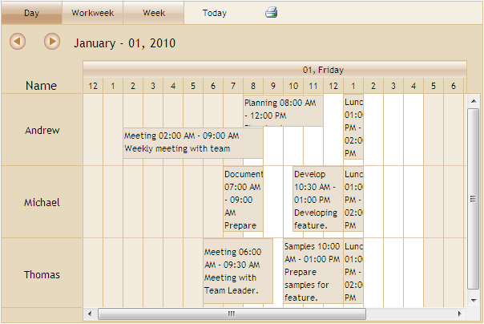{border="0"}

Figure 69: ScheduleMode -- Horizontal

[]{style="FONT-FAMILY: 'Calibri','sans-serif'"} 

[]{#_View_Types}View Types

View Types - Essential Schedule displays appointments in four different view types: Day, Week, Workweek and Month.

[]{style="FONT-FAMILY: 'Calibri','sans-serif'"} 

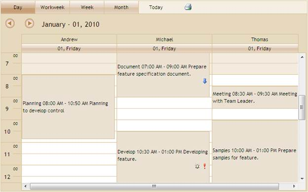{border="0"}

[]{style="FONT-FAMILY: 'Calibri','sans-serif'"} 

Figure 70: ViewType -- Day

[]{style="FONT-FAMILY: 'Calibri','sans-serif'"} 

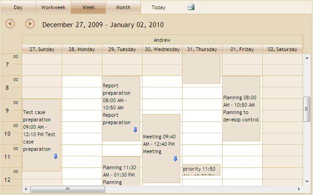{border="0"}

Figure 71: ViewType -- Week

[]{style="FONT-FAMILY: 'Calibri','sans-serif'"} 

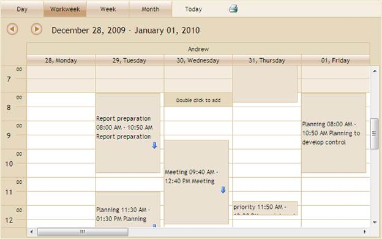{border="0"}

Figure 72: ViewType -- Workweek

[]{style="FONT-FAMILY: 'Calibri','sans-serif'"} 

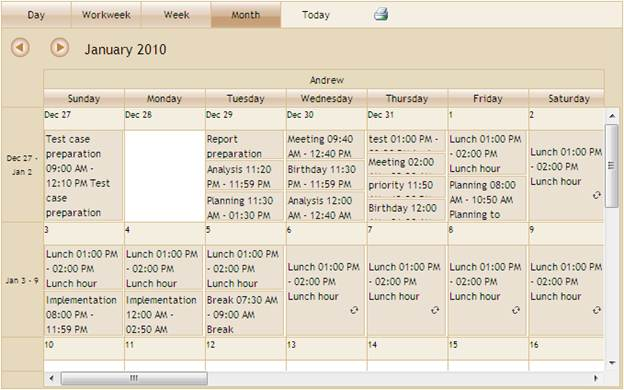{border="0"}

Figure 73: ViewType -- Month

[]{style="FONT-FAMILY: 'Calibri','sans-serif'"} 

[]{#_CRUD_Appointment}CRUD Appointment

Appointments - End-user events are called Appointments. Appointments can be added, edited, and deleted in Essential Schedule.

[]{style="FONT-FAMILY: 'Calibri','sans-serif'"} 

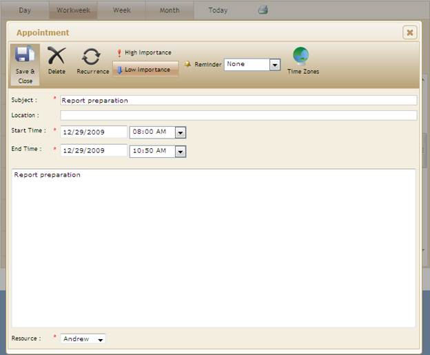{border="0"}

[]{style="FONT-FAMILY: 'Calibri','sans-serif'"} 

Figure 74: CRUD Appointments

[]{style="FONT-FAMILY: 'Calibri','sans-serif'"} 

[]{#_Resizing_Appointment}Resizing Appointment

Resizing Appointments - Appointment timings can be extended or changed by resizing them. The appointment is resized by holding the corners of the appointment.

[]{style="FONT-FAMILY: 'Calibri','sans-serif'"} 

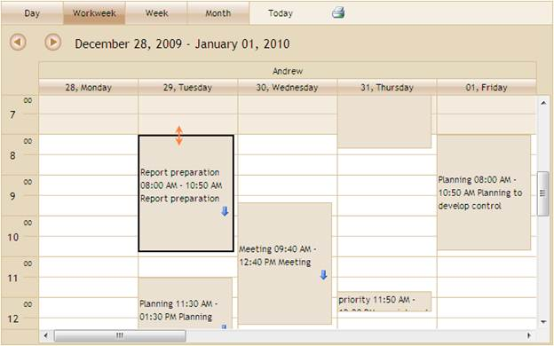{border="0"}

[]{style="FONT-FAMILY: 'Calibri','sans-serif'"} 

Figure 75: Resizing Appointment

[]{style="FONT-FAMILY: 'Calibri','sans-serif'"} 

[]{#_Drag_&amp;_Drop}Drag and Drop Appointment

Drag Appointments-The user can drag appointments from one location to another location within the Schedule control. You can also drag appointments between resources.

[]{style="FONT-FAMILY: 'Calibri','sans-serif'"} 

[]{style="FONT-FAMILY: 'Calibri','sans-serif'"} 

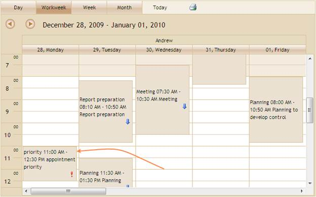{border="0"}

[]{style="FONT-FAMILY: 'Calibri','sans-serif'"} 

Figure 76: Dragging Appointment

[]{style="FONT-FAMILY: 'Calibri','sans-serif'"} 

[]{#_Priority}Priority

Priority: Schedule control supports setting the priority level for appointments to indicate the important levels of appointments.

[]{style="FONT-FAMILY: 'Calibri','sans-serif'"} 

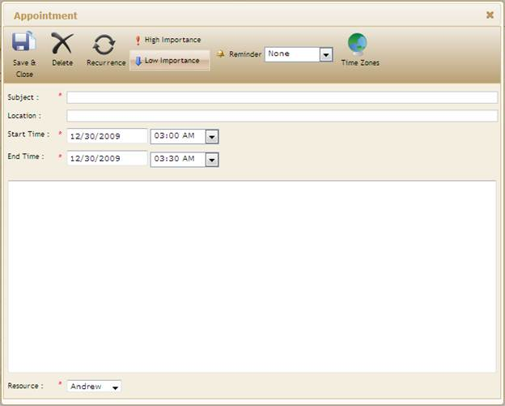{border="0"}

[]{style="FONT-FAMILY: 'Calibri','sans-serif'"} 

Figure 77: Priority

[]{style="FONT-FAMILY: 'Calibri','sans-serif'"} 

[]{#_Reminder}Reminder

Reminder: Essential Schedule provides an option to set or remove reminder for  appointments.

[]{style="FONT-FAMILY: 'Calibri','sans-serif'"} 

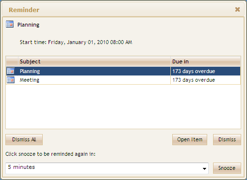{border="0"}

[]{style="FONT-FAMILY: 'Calibri','sans-serif'"} 

Figure 78: Reminder

[]{style="FONT-FAMILY: 'Calibri','sans-serif'"} 

[]{#_Recurring}Recurring

Recurrence:  Essential Schedule makes the appointment recurring with recurrence frequency (Daily, Weekly, Monthly, and Yearly).

[]{style="FONT-FAMILY: 'Calibri','sans-serif'"} 

{border="0"}

[]{style="FONT-FAMILY: 'Calibri','sans-serif'"} 

Figure 79: Recurrence

[]{style="FONT-FAMILY: 'Calibri','sans-serif'"} 

[]{#_Print}Print

The print icon image is displayed on the Schedule at viewstrip toolbar by enabling the ShowPrint property.  By default, Essential Schedule prints the day, week, workweek, and month. You can print individual appointments by using the context menu.

[]{style="FONT-FAMILY: 'Calibri','sans-serif'"} 

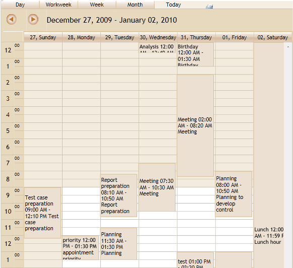{border="0"}

[]{style="FONT-FAMILY: 'Calibri','sans-serif'"} 

Figure 80: Print a Schedule

[]{style="FONT-FAMILY: 'Calibri','sans-serif'"} 

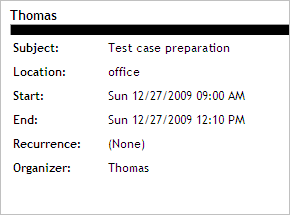{border="0"}

[]{style="FONT-FAMILY: 'Calibri','sans-serif'"} 

Figure 81: Print an Appointment

[]{style="FONT-FAMILY: 'Calibri','sans-serif'"} 

[]{style="FONT-FAMILY: 'Calibri','sans-serif'"} 

TimeZone

Schedule appointment items' start and end times are saved in the Coordinated Universal Time (UTC) format, an international time standard that is similar to Greenwich Mean Time.

[]{style="FONT-FAMILY: 'Calibri','sans-serif'"} 

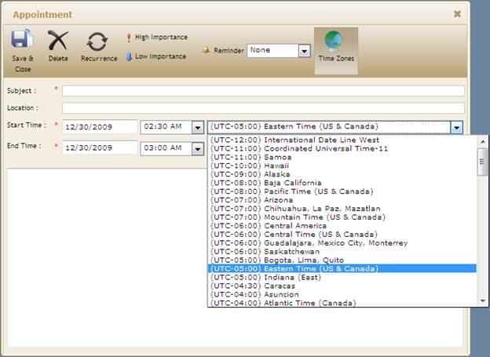{border="0"}

[]{style="FONT-FAMILY: 'Calibri','sans-serif'"} 

Figure 82: TimeZone

[]{style="FONT-FAMILY: 'Calibri','sans-serif'"} 

[]{#_Time_Mode}Time Mode

Essential Schedule allows two types of Time modes to display time line header and appointment timings:

[·      ]{style="FONT-FAMILY: Symbol"}12 Hours - Display appointments with 12 hours format

[·      ]{style="FONT-FAMILY: Symbol"}24 Hours - Display appointments with 24 hours format\
\

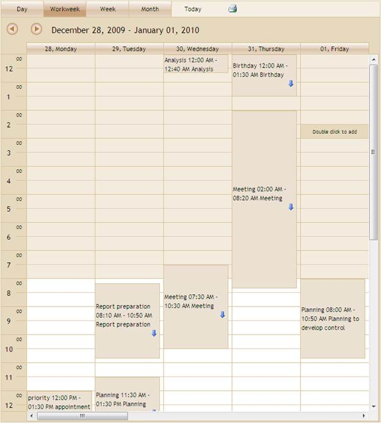{border="0"}

[]{style="FONT-FAMILY: 'Calibri','sans-serif'"} 

Figure 83: TimeMode - Hours12

[]{style="FONT-FAMILY: 'Calibri','sans-serif'"} 

{border="0"}

[]{style="FONT-FAMILY: 'Calibri','sans-serif'"} 

Figure 84: TimeMode - Hours24

[]{style="FONT-FAMILY: 'Calibri','sans-serif'"} 

[]{#_Multiple_Resources}Multiple Resources

Essential Schedule allows you to add multiple resources to the control. You can assign appointments to each resource.[[ ]{style="FONT-WEIGHT: normal"}]{.Heading1Char}Resource header will help you to view the appointments for each resource with a resource name as the header.

[]{style="FONT-FAMILY: 'Calibri','sans-serif'"} 

{border="0"}

[]{style="FONT-FAMILY: 'Calibri','sans-serif'"} 

Figure 85: Multiple Resources

[]{style="FONT-FAMILY: 'Calibri','sans-serif'"} 

[]{#_Calendar_Navigation}Calendar Navigation

Essential Schedule offers calendar navigation for quick navigation Schedule. The *ShowNaviagationPane***[ ]{style="COLOR: #243a76"}**property is used to enable the calendar in the *Navigation* pane.

[]{style="FONT-FAMILY: 'Calibri','sans-serif'"} 

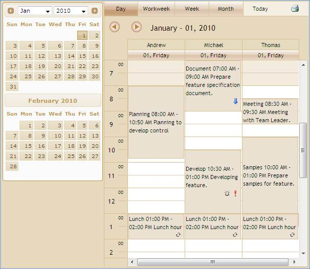{border="0"}

[]{style="FONT-FAMILY: 'Calibri','sans-serif'"} 

Figure 86: Calendar Navigation

[]{style="FONT-FAMILY: 'Calibri','sans-serif'"} 

[]{#_Client_side_Events}Client-Side Events

Schedule handles client-side scripting on appointment selection and cell double-click. *OnAppointmentSelection* event is raised every time when the end-user selects the appointment. *OnCellDoubleClick* event is raised every time when the end user double-clicks the cell. The end user can customize the appointment window using these client side scripting.

[]{style="FONT-FAMILY: 'Calibri','sans-serif'"} 

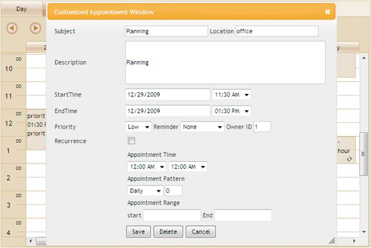{border="0"}

[]{style="FONT-FAMILY: 'Calibri','sans-serif'"} 

Figure 87: Customized appointment window using Clientside Events

[]{style="FONT-FAMILY: 'Calibri','sans-serif'"} 

[]{#_Context_Menu}Context Menu

This feature allows you to display menus on right-clicking the Schedule control cell and appointment in order to add, edit, delete, and print an appointment. It also provides options to add custom menu items.

[]{style="FONT-FAMILY: 'Calibri','sans-serif'"} 

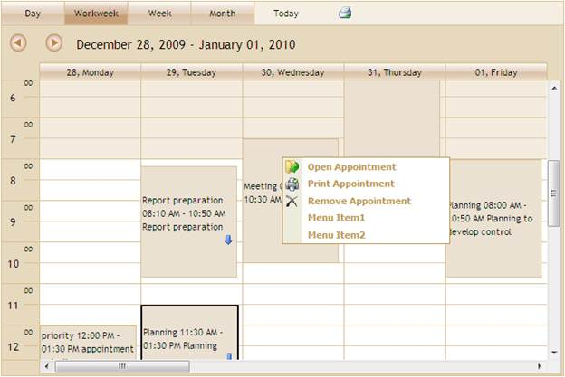{border="0"}

[]{style="FONT-FAMILY: 'Calibri','sans-serif'"} 

Figure 88: Appointment Context Menu

[]{style="FONT-FAMILY: 'Calibri','sans-serif'"} 

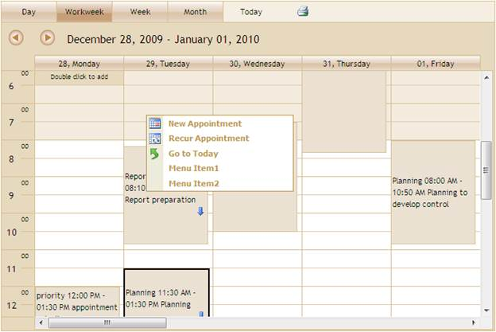{border="0"}

[]{style="FONT-FAMILY: 'Calibri','sans-serif'"} 

Figure 89: Cell Context Menu

[]{style="FONT-FAMILY: 'Calibri','sans-serif'"} 

[]{#_Appearance}Appearance

Essential Schedule has several built-in skins that make styling extremely easy.  Essential Schedule contains 14 built-in skins to easily customize the appearance. Essential Schedule\'s Skin property allows you to apply predefined skins to the control. 

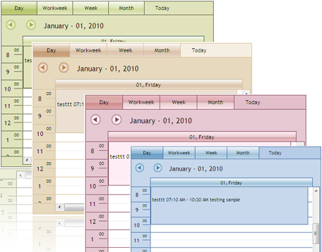{border="0"}

[]{style="FONT-FAMILY: 'Calibri','sans-serif'"} 

Figure 90: Schedule Skins

[]{style="FONT-FAMILY: 'Calibri','sans-serif'"} 

[]{#related-topics}
::::
