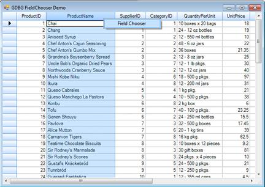
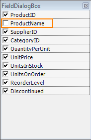
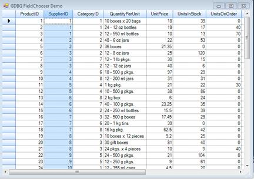

::: {style="DISPLAY: none"}
{#d2h_url_template}{#d2h_package_url style="WIDTH: 0px; DISPLAY: none; HEIGHT: 0px"}
:::

:::: {.d2h_secondary_topic style="PADDING-BOTTOM: 10pt; MARGIN: 0pt; PADDING-LEFT: 0pt; PADDING-RIGHT: 0pt; PADDING-TOP: 0pt"}
#### Field Chooser for Grid Data Bound Grid {#field-chooser-for-grid-data-bound-grid style="tab-stops: 0pt"}

This feature enables you to customize the view of the grid without modifying the database.**[ ]{style="COLOR: gray"}**The *FieldChooser* class of a *GridDataBoundGrid* has been implemented to add or remove columns from a grid.

 

Use Case Scenarios

This feature will be useful when you want to remove certain columns (which cannot be deleted) from the grid.

 

Methods

 

Table 6: Methods Table

::: {align="center"}
+------------+----------------------------------+------------+--------------------+----------------------------------------------------------+-----------------+
| Method     | Description                      | Parameters | Type               | Return Type                                              | Reference links |
+------------+----------------------------------+------------+--------------------+----------------------------------------------------------+-----------------+
| WrieGrid   | Used to wire the *FieldChooser.* | Overloads: | In GridWindowsForm | Example: GridDataboundGrid1.WireGrid(GridDataboundGrid). | NA              |
|            |                                  |            |                    |                                                          |                 |
|            |                                  |  ( Arg1)   |                    |                                                          |                 |
|            |                                  |            |                    |                                                          |                 |
|            |                                  |            |                    |                                                          |                 |
+------------+----------------------------------+------------+--------------------+----------------------------------------------------------+-----------------+
| UnWrieGrid | Used to unwire the FieldChooser. | NA         | In GridWindowsForm | Example: GridDataboundGrid1.Unwired().                   | NA              |
+============+==================================+============+====================+==========================================================+=================+
:::

[]{style="FONT-FAMILY: 'Calibri','sans-serif'; COLOR: black"} 

Sample Link

You can find a sample for this feature in the following location:

***..\\..\\AppData\\Local\\Syncfusion\\EssentialStudio\\9.4.0.49\\Windows\\Grid.Windows\\Samples\\2.0\\Data Bound\\GDBG FieldChooser Demo***

**** 

Adding Field Chooser for Grid Data Bound Grid

 

1.   To add field chooser, pass data bound grid as the parameter of the *WireGrid* method.

The following code illustrates this:

[]{style="FONT-FAMILY: 'Courier New'"} 

+------------------------------------------------------------------------------------------------------------------------------------------------------------------------------------------+
| [\[C#\]]{style="FONT-FAMILY: 'Courier New'"}                                                                                                                                             |
|                                                                                                                                                                                          |
| []{style="FONT-FAMILY: 'Courier New'"}                                                                                                                                                   |
|                                                                                                                                                                                          |
| [  [GridDataBoundFieldChooser]{style="COLOR: #2b91af"} fChooser = [new]{style="COLOR: blue"} [GridDataBoundFieldChooser]{style="COLOR: #2b91af"}();]{style="FONT-FAMILY: 'Courier New'"} |
|                                                                                                                                                                                          |
| [            fChooser.WireGrid([this]{style="COLOR: blue"}.GridDataBoundGrid1);]{style="FONT-FAMILY: 'Courier New'"}[]{style="FONT-FAMILY: 'Courier New'"}                               |
+------------------------------------------------------------------------------------------------------------------------------------------------------------------------------------------+

 

+--------------------------------------------------------------------------------------------------------------------------------------------------------------------------------------------------------------------+
| [\[VB\]]{style="FONT-FAMILY: 'Courier New'"}                                                                                                                                                                       |
|                                                                                                                                                                                                                    |
| []{style="FONT-FAMILY: 'Courier New'; COLOR: #1f497d"}                                                                                                                                                             |
|                                                                                                                                                                                                                    |
| [Dim]{style="FONT-FAMILY: 'Courier New'; COLOR: blue"}[ fchooser [As]{style="COLOR: blue"} GridDataBoundFieldChooser = [New]{style="COLOR: blue"} GridDataBoundFieldChooser()]{style="FONT-FAMILY: 'Courier New'"} |
|                                                                                                                                                                                                                    |
| [            fchooser.WireGrid([Me]{style="COLOR: blue"}.GridDataBoundGrid1)]{style="FONT-FAMILY: 'Courier New'"}                                                                                                  |
|                                                                                                                                                                                                                    |
| []{style="FONT-FAMILY: 'Courier New'"}                                                                                                                                                                             |
+--------------------------------------------------------------------------------------------------------------------------------------------------------------------------------------------------------------------+

 

2.   When the code runs, the entire grid will open.

3.   Right click on a column header and select the Field Chooser menu item to view the ***[Field Chooser]{style="FONT-FAMILY: 'Arial','sans-serif'"}*[ dialog]{style="FONT-FAMILY: 'Arial','sans-serif'"}.**

 

{border="0"}

Figure 228: Field Chooser

 

4.   This dialog will list all the column names with check boxes adjacent to them.

 

{border="0"}

Figure 229: FieldDialogBox

 

5.   Select the checkboxes of the columns you want to be displayed in the grid.

6.   The grid will have only the columns which are selected in the ***[Field Chooser]{style="FONT-FAMILY: 'Arial','sans-serif'"}*[ dialog]{style="FONT-FAMILY: 'Arial','sans-serif'"}.**

{border="0"}

Figure 230: Customized Grid

 

[]{style="FONT-FAMILY: 'Trebuchet MS','sans-serif'; COLOR: #15428b; FONT-SIZE: 9pt"} 

 

[]{#p388} 

 

[]{#related-topics}
::::
