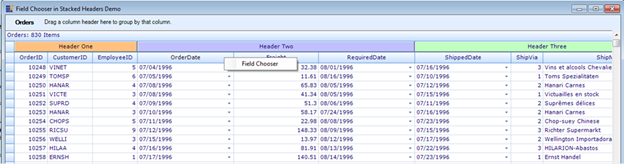
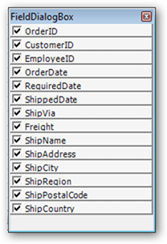
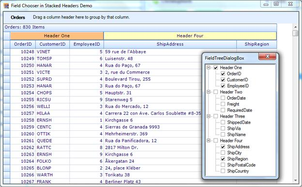

::: {style="DISPLAY: none"}
{#d2h_url_template}{#d2h_package_url style="WIDTH: 0px; DISPLAY: none; HEIGHT: 0px"}
:::

::::: {.d2h_secondary_topic style="PADDING-BOTTOM: 10pt; MARGIN: 0pt; PADDING-LEFT: 0pt; PADDING-RIGHT: 0pt; PADDING-TOP: 0pt"}
##### Field Chooser for Stacked Header {#field-chooser-for-stacked-header style="tab-stops: 0pt"}

 

The GridGrouping control in Essential Grid provides field chooser support for stacked headers. The field chooser feature enables you to customize a column in a grid at run time without modifying the database it is bound to.

 

Use Case Scenarios

When you want to show or hide the columns of a stacked header in a grid without deleting its bound records, you can achieve this using this feature.

 

Properties

Table 8: Property Table

::: {align="center"}
  --------------------- ------------------------------------------------------------------------- ---------- ----------- -----------------
  Property              Description                                                               Type       Data Type   Reference links
  EnableColumnsInView   Used to enable or disable the column names in the field chooser dialog.   Property   Boolean     N/A.
  --------------------- ------------------------------------------------------------------------- ---------- ----------- -----------------
:::

[]{style="FONT-FAMILY: 'Calibri','sans-serif'; COLOR: black"} 

Constructor

::: {align="center"}
+--------------+----------------------------------------------------------------+---------------------------+-------------+-------------+-----------------+
| Constructor  | Description                                                    | Parameters                | Type        | Return Type | Reference links |
+--------------+----------------------------------------------------------------+---------------------------+-------------+-------------+-----------------+
|              | Used to wire the GridGroupin gControl  with the field chooser. | (\<GridGroupingControl\>) | Constructor | class       | N/A.            |
|              |                                                                |                           |             |             |                 |
| FieldChooser |                                                                |                           |             |             |                 |
+==============+================================================================+===========================+=============+=============+=================+
:::

**[]{style="LINE-HEIGHT: 115%; COLOR: #4f81bd; FONT-SIZE: 14pt"}** 

Sample Link

A demo of this feature is available in the following location:

 

***..\\..\\AppData\\Local\\Syncfusion\\EssentialStudio\\{Installed Version}\\Windows\\Grid.Grouping.Windows\\Samples\\2.0\\Grouping Grid Layout\\Field Chooser in Stacked Header Demo***

**** 

Adding Field Chooser Stacked Headers In GridGroupingControl

 

1.   To add field chooser, create a constructor using the *FieldChooser* class and pass the *GridGroupingControl* as the parameter.

 

The following code illustrates this:

+--------------------------------------------------------------------------------------------------------------------------------------------------------------------------------------------------------------------------+
| **[\[C#\]]{style="FONT-FAMILY: 'Courier New'"}**                                                                                                                                                                         |
|                                                                                                                                                                                                                          |
| [// wire the GridGroupingControl with the field chooser.]{style="FONT-FAMILY: 'Courier New'; COLOR: green"}                                                                                                              |
|                                                                                                                                                                                                                          |
| [            [FieldChooser]{style="COLOR: #2b91af"} fchooser = [new]{style="COLOR: blue"} [FieldChooser]{style="COLOR: #2b91af"}([this]{style="COLOR: blue"}.gridGroupingControl1);]{style="FONT-FAMILY: 'Courier New'"} |
|                                                                                                                                                                                                                          |
| [Here is the code snippet used to disable the **[EnableColumnsInView]{style="COLOR: gray"}** property.:]{style="FONT-FAMILY: 'Courier New'"}                                                                             |
|                                                                                                                                                                                                                          |
| [//disable the EnableColumnsInView property]{style="FONT-FAMILY: 'Courier New'; COLOR: green"}                                                                                                                           |
|                                                                                                                                                                                                                          |
| [           fchooser.EnableColumnsInView = [false]{style="COLOR: blue"};]{style="FONT-FAMILY: 'Courier New'"}                                                                                                            |
|                                                                                                                                                                                                                          |
| []{style="FONT-FAMILY: 'Courier New'"}                                                                                                                                                                                   |
+--------------------------------------------------------------------------------------------------------------------------------------------------------------------------------------------------------------------------+

 

+------------------------------------------------------------------------------------------------------------------------------------------------------------------------------------------------------------------------+
| **[\[VB\]]{style="FONT-FAMILY: 'Courier New'"}**                                                                                                                                                                       |
|                                                                                                                                                                                                                        |
| [\'Wire the GridGroupingControl with the field chooser.]{style="FONT-FAMILY: 'Courier New'; COLOR: green"}                                                                                                             |
|                                                                                                                                                                                                                        |
| [            [Dim]{style="COLOR: blue"} fchooser [As]{style="COLOR: blue"} FieldChooser = [New]{style="COLOR: blue"} FieldChooser([Me]{style="COLOR: blue"}.gridGroupingControl1)]{style="FONT-FAMILY: 'Courier New'"} |
|                                                                                                                                                                                                                        |
| [  [\'Disable the EnableColumnsInView property]{style="COLOR: green"}]{style="FONT-FAMILY: 'Courier New'"}                                                                                                             |
|                                                                                                                                                                                                                        |
| [            fchooser.EnableColumnsInView = [False]{style="COLOR: blue"}]{style="FONT-FAMILY: 'Courier New'"}                                                                                                          |
|                                                                                                                                                                                                                        |
| []{style="FONT-FAMILY: 'Courier New'"}                                                                                                                                                                                 |
+------------------------------------------------------------------------------------------------------------------------------------------------------------------------------------------------------------------------+

 

[]{style="FONT-FAMILY: 'Courier New'; COLOR: blue"} 

When the code runs, the entire grid will open.

2.   Right click on a column header and select the **Field Chooser** menu item to view the **Field Chooser** dialog**.**

 

{border="0"}

Figure 351: Field Chooser

 

3.   This dialog will list all the column names with check boxes adjacent to them.

 

{border="0"}

Figure 352: FieldDialogBox

 

4.   Select the checkboxes of the columns you want to be displayed in the grid.

5.   The grid will have only the columns which are selected in the Field Chooser **dialog.**

 

{border="0"}

Figure 353: Customized Grid

 

[]{style="FONT-FAMILY: 'Courier New'"} 

 

[]{#related-topics}
:::::
