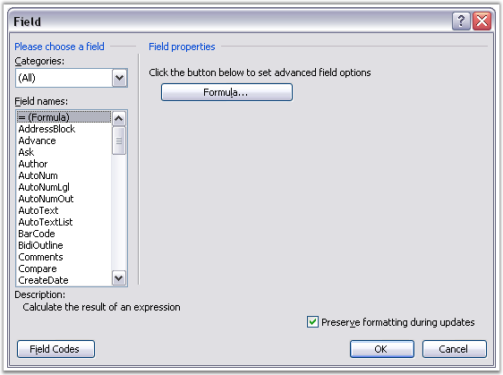
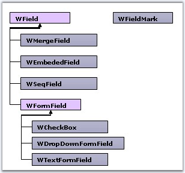

::: {style="DISPLAY: none"}
{#d2h_url_template}{#d2h_package_url style="WIDTH: 0px; DISPLAY: none; HEIGHT: 0px"}
:::

::::: {.d2h_secondary_topic style="PADDING-BOTTOM: 10pt; MARGIN: 0pt; PADDING-LEFT: 0pt; PADDING-RIGHT: 0pt; PADDING-TOP: 0pt"}
#### Fields {#fields style="tab-stops: 0pt"}

 

[]{#p45}Fields are special elements of the Word document. To insert a field, open the Insert menu and click Field option in Microsoft Word.

 

{border="0"}

Figure 44: Field Dialog Box

 

 

Fields are widely used for Mail Merge. In Word document, almost every field consists of the field start marker text, which defines the type of the field, field separator marker, field value, and field end marker.

 

**WField** class represents a field in the Word document. There are many types of fields.

 

{border="0"}

Figure 45: WField Class Hierarchy

 

You can get or set the type of field by using the **FieldType** property. WField class also has the **TextFormat** property, which defines the text format for the field. There are four different types of text formats for fields.

 

[·      ]{style="FONT-FAMILY: Symbol"}None -- no text formatting

[·      ]{style="FONT-FAMILY: Symbol"}Uppercase -- uppercase text formatting

[·      ]{style="FONT-FAMILY: Symbol"}Lowercase -- lowercase text formatting

[·      ]{style="FONT-FAMILY: Symbol"}FirstCapital -- first capital text formatting

[·      ]{style="FONT-FAMILY: Symbol"}Titlecase -- title case text formatting

 

Adding Field to Paragraph

 

You can use the **AppendField** function of the **WParagraph** class to add new fields to a paragraph. When you add a field to a paragraph, all the field markers are automatically added to the paragraph. For details, refer WFieldMark class description.

 

There are special fields like Form Field, Merge Field, Embed Field and Seq Field. For details, refer the WFormField, WMergeField, WEmbedField and WSeqField documentation.

 

**Class Hierarchy**

 

WTextRange

               \|

            WField

 

**Public Constructor**

 

::: {align="center"}
  ------------------------------- ---------------------------------------------------
  Name                            Description
  WField.WField (IWordDocument)   Initializes a new instance of the WField class.  
  ------------------------------- ---------------------------------------------------
:::

 

Public Properties

 

::: {align="center"}
  -------------- -------------------------------------------
  Name           Description
  EntityType     Gets the type of the entity.  
  FieldPattern   Gets / sets field pattern.  
  FieldType      Gets / sets field type                   
  FieldValue     Gets the field value.  
  TextFormat     Gets/ sets regular text format.  
  -------------- -------------------------------------------
:::

 

+------------------------------------------------------------------------------------------------------------------------------------------------------------+
| **[\[C#\]]{style="FONT-FAMILY: 'Courier New'; COLOR: black"}**                                                                                             |
|                                                                                                                                                            |
| []{style="COLOR: black"}                                                                                                                                   |
|                                                                                                                                                            |
| [IWSection]{style="FONT-FAMILY: 'Courier New'; COLOR: teal"}[ section = doc.AddSection();]{style="FONT-FAMILY: 'Courier New'"}                             |
|                                                                                                                                                            |
| [IWParagraph]{style="FONT-FAMILY: 'Courier New'; COLOR: teal"}[ paragraph = section.AddParagraph();]{style="FONT-FAMILY: 'Courier New'"}                   |
|                                                                                                                                                            |
| [paragraph.AppendText([\"Testing writing Merge Fields into Header\"]{style="COLOR: maroon"});]{style="FONT-FAMILY: 'Courier New'"}                         |
|                                                                                                                                                            |
| []{style="FONT-FAMILY: 'Courier New'"}                                                                                                                     |
|                                                                                                                                                            |
| [section.PageSetup.DifferentFirstPage = [true]{style="COLOR: blue"};]{style="FONT-FAMILY: 'Courier New'"}                                                  |
|                                                                                                                                                            |
| [section.PageSetup.DifferentOddAndEvenPages = [true]{style="COLOR: blue"};]{style="FONT-FAMILY: 'Courier New'"}                                            |
|                                                                                                                                                            |
| []{style="FONT-FAMILY: 'Courier New'"}                                                                                                                     |
|                                                                                                                                                            |
| [paragraph = [new]{style="COLOR: blue"} [WParagraph]{style="COLOR: teal"}(doc);]{style="FONT-FAMILY: 'Courier New'"}                                       |
|                                                                                                                                                            |
| [paragraph.AppendText([\"\[ FIRST PAGE Header \]\"]{style="COLOR: maroon"});]{style="FONT-FAMILY: 'Courier New'"}                                          |
|                                                                                                                                                            |
| [section.HeadersFooters.FirstPageHeader.Paragraphs.Add(paragraph);]{style="FONT-FAMILY: 'Courier New'"}                                                    |
|                                                                                                                                                            |
| [paragraph = [new]{style="COLOR: blue"} [WParagraph]{style="COLOR: teal"}(doc);]{style="FONT-FAMILY: 'Courier New'"}                                       |
|                                                                                                                                                            |
| []{style="FONT-FAMILY: 'Courier New'"}                                                                                                                     |
|                                                                                                                                                            |
| [//Appends field]{style="FONT-FAMILY: 'Courier New'; COLOR: green"}                                                                                        |
|                                                                                                                                                            |
| [paragraph.AppendField([\"Field\'s Name\"]{style="COLOR: maroon"}, [FieldType]{style="COLOR: teal"}.FieldMergeField);]{style="FONT-FAMILY: 'Courier New'"} |
|                                                                                                                                                            |
| [section.HeadersFooters.FirstPageHeader.Paragraphs.Add(paragraph);]{style="FONT-FAMILY: 'Courier New'"}                                                    |
|                                                                                                                                                            |
| []{style="FONT-FAMILY: 'Courier New'"}                                                                                                                     |
|                                                                                                                                                            |
| [paragraph = [new]{style="COLOR: blue"} [WParagraph]{style="COLOR: teal"}(doc);]{style="FONT-FAMILY: 'Courier New'"}                                       |
|                                                                                                                                                            |
| [paragraph.AppendText([\"\[ FIRST PAGE Footer \]\\r\"]{style="COLOR: maroon"});]{style="FONT-FAMILY: 'Courier New'"}                                       |
|                                                                                                                                                            |
| [section.HeadersFooters.FirstPageFooter.Paragraphs.Add(paragraph);]{style="FONT-FAMILY: 'Courier New'"}                                                    |
+------------------------------------------------------------------------------------------------------------------------------------------------------------+

 

+---------------------------------------------------------------------------------------------------------------------------------------------------------------------------------------------------------------------------------------------------------------------+
| **[\[VB.NET\]]{style="FONT-FAMILY: 'Courier New'; COLOR: black"}**                                                                                                                                                                                                  |
|                                                                                                                                                                                                                                                                     |
| []{style="FONT-FAMILY: 'Courier New'; COLOR: black"}                                                                                                                                                                                                                |
|                                                                                                                                                                                                                                                                     |
| [Dim ]{style="FONT-FAMILY: 'Courier New'; COLOR: blue"}[section As ]{style="FONT-FAMILY: 'Courier New'; COLOR: black"}[IWSection]{style="FONT-FAMILY: 'Courier New'; COLOR: teal"}[ = doc.AddSection()]{style="FONT-FAMILY: 'Courier New'; COLOR: black"}           |
|                                                                                                                                                                                                                                                                     |
| [Dim]{style="FONT-FAMILY: 'Courier New'; COLOR: blue"}[ paragraph As ]{style="FONT-FAMILY: 'Courier New'; COLOR: black"}[IWParagraph]{style="FONT-FAMILY: 'Courier New'; COLOR: teal"}[ = section.AddParagraph()]{style="FONT-FAMILY: 'Courier New'; COLOR: black"} |
|                                                                                                                                                                                                                                                                     |
| [paragraph.AppendText(\"Testing writing Merge Fields into Header\")]{style="FONT-FAMILY: 'Courier New'; COLOR: black"}                                                                                                                                              |
|                                                                                                                                                                                                                                                                     |
| []{style="FONT-FAMILY: 'Courier New'; COLOR: black"}                                                                                                                                                                                                                |
|                                                                                                                                                                                                                                                                     |
| [section.PageSetup.DifferentFirstPage = True]{style="FONT-FAMILY: 'Courier New'; COLOR: black"}                                                                                                                                                                     |
|                                                                                                                                                                                                                                                                     |
| [section.PageSetup.DifferentOddAndEvenPages = True]{style="FONT-FAMILY: 'Courier New'"}                                                                                                                                                                             |
|                                                                                                                                                                                                                                                                     |
| []{style="FONT-FAMILY: 'Courier New'; COLOR: black"}                                                                                                                                                                                                                |
|                                                                                                                                                                                                                                                                     |
| [paragraph = ]{style="FONT-FAMILY: 'Courier New'; COLOR: black"}[New]{style="FONT-FAMILY: 'Courier New'; COLOR: blue"}[ WParagraph(doc)]{style="FONT-FAMILY: 'Courier New'; COLOR: black"}                                                                          |
|                                                                                                                                                                                                                                                                     |
| [paragraph.AppendText(\"\[ FIRST PAGE Header \]\")]{style="FONT-FAMILY: 'Courier New'; COLOR: black"}                                                                                                                                                               |
|                                                                                                                                                                                                                                                                     |
| [section.HeadersFooters.FirstPageHeader.Paragraphs.Add(paragraph)]{style="FONT-FAMILY: 'Courier New'; COLOR: black"}                                                                                                                                                |
|                                                                                                                                                                                                                                                                     |
| [paragraph = ]{style="FONT-FAMILY: 'Courier New'; COLOR: black"}[New]{style="FONT-FAMILY: 'Courier New'; COLOR: blue"}[ WParagraph(doc)]{style="FONT-FAMILY: 'Courier New'; COLOR: black"}                                                                          |
|                                                                                                                                                                                                                                                                     |
| []{style="FONT-FAMILY: 'Courier New'; COLOR: black"}                                                                                                                                                                                                                |
|                                                                                                                                                                                                                                                                     |
| [\'Appends field]{style="FONT-FAMILY: 'Courier New'; COLOR: green"}                                                                                                                                                                                                 |
|                                                                                                                                                                                                                                                                     |
| [paragraph.AppendField(\"Field\'s Name\", FieldType.FieldMergeField)]{style="FONT-FAMILY: 'Courier New'; COLOR: black"}                                                                                                                                             |
|                                                                                                                                                                                                                                                                     |
| [section.HeadersFooters.FirstPageHeader.Paragraphs.Add(paragraph)]{style="FONT-FAMILY: 'Courier New'; COLOR: black"}                                                                                                                                                |
|                                                                                                                                                                                                                                                                     |
| []{style="FONT-FAMILY: 'Courier New'; COLOR: black"}                                                                                                                                                                                                                |
|                                                                                                                                                                                                                                                                     |
| [paragraph = ]{style="FONT-FAMILY: 'Courier New'; COLOR: black"}[New]{style="FONT-FAMILY: 'Courier New'; COLOR: blue"}[ WParagraph(doc)]{style="FONT-FAMILY: 'Courier New'; COLOR: black"}                                                                          |
|                                                                                                                                                                                                                                                                     |
| [paragraph.AppendText(\"\[ FIRST PAGE Footer \]\" & Constants.vbCr)]{style="FONT-FAMILY: 'Courier New'; COLOR: black"}                                                                                                                                              |
|                                                                                                                                                                                                                                                                     |
| [section.HeadersFooters.FirstPageFooter.Paragraphs.Add(paragraph)]{style="FONT-FAMILY: 'Courier New'; COLOR: black"}                                                                                                                                                |
+---------------------------------------------------------------------------------------------------------------------------------------------------------------------------------------------------------------------------------------------------------------------+

 

 

 

More:

[ ]{#related-topics}

[{border="0" align="absMiddle"}Merge Field](ms-xhelp:///?Id=62d09918-23fc-4865-889a-d8828cf35c39){style="TEXT-DECORATION: none"}

[{border="0" align="absMiddle"}Embed Field](ms-xhelp:///?Id=a93e4cca-5bed-4be3-82b0-314c3ef86370){style="TEXT-DECORATION: none"}

[{border="0" align="absMiddle"}Seq Field](ms-xhelp:///?Id=31dbebfb-cdac-4abe-9cc0-8c9d187b3bc9){style="TEXT-DECORATION: none"}

[{border="0" align="absMiddle"}Form Field](ms-xhelp:///?Id=2280f2fd-0438-4466-a311-52c4dcb2a43e){style="TEXT-DECORATION: none"}

[{border="0" align="absMiddle"}Hyperlink](ms-xhelp:///?Id=067addc5-c787-4007-9a6a-841e0e4809d5){style="TEXT-DECORATION: none"}

[{border="0" align="absMiddle"}Document Variable](ms-xhelp:///?Id=4909eff4-a7b3-404c-ab1c-0fb0afe941ad){style="TEXT-DECORATION: none"}

[{border="0" align="absMiddle"}Fields Updating Engine](ms-xhelp:///?Id=36688296-a9b0-4469-a910-dc0cc1d5507b){style="TEXT-DECORATION: none"}
:::::
