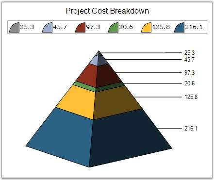
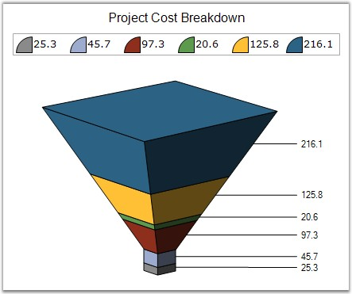

::: {style="DISPLAY: none"}
{#d2h_url_template}{#d2h_package_url style="WIDTH: 0px; DISPLAY: none; HEIGHT: 0px"}
:::

:::: {.d2h_secondary_topic style="PADDING-BOTTOM: 10pt; MARGIN: 0pt; PADDING-LEFT: 0pt; PADDING-RIGHT: 0pt; PADDING-TOP: 0pt"}
#### FigureBase {#figurebase style="tab-stops: 0pt"}

**[]{style="FONT-FAMILY: 'Trebuchet MS','sans-serif'"}** 

Specifies the drawing style for the funnel or pyramid chart base.

[]{style="FONT-FAMILY: 'Trebuchet MS','sans-serif'; FONT-SIZE: 9pt"} 

::: {align="center"}
+-------------------------------------+-------------------------------------------------------+
| Details                                                                                     |
+-------------------------------------+-------------------------------------------------------+
| Possible Values                     | Circle - Renders the chart with a circular base.      |
|                                     |                                                       |
|                                     | Square - Renders the chart with a square base.        |
+-------------------------------------+-------------------------------------------------------+
| Default Value                       | Circle for Funnel Chart and Square for Pyramid Chart. |
+-------------------------------------+-------------------------------------------------------+
| 2D / 3D Limitations                 | 3D Only                                               |
+-------------------------------------+-------------------------------------------------------+
| Applies to Chart Element            | All series                                            |
+-------------------------------------+-------------------------------------------------------+
| Applies to Chart Types              | Funnel and Pyramid                                    |
+-------------------------------------+-------------------------------------------------------+
:::

[]{style="FONT-FAMILY: 'Trebuchet MS','sans-serif'; FONT-SIZE: 9pt"} 

Here is some sample code.

[]{style="FONT-FAMILY: 'Trebuchet MS','sans-serif'; FONT-SIZE: 9pt"} 

+----------------------------------------------------------------------------------------------------------------------------------------------------------------------------------------------------------------+
| **[\[C#\]]{style="FONT-FAMILY: 'Courier New'; COLOR: black"}**                                                                                                                                                 |
|                                                                                                                                                                                                                |
| **[]{style="FONT-FAMILY: 'Courier New'; COLOR: black"}**                                                                                                                                                       |
|                                                                                                                                                                                                                |
| [// Setting FigureBase For Pyramid Chart]{style="FONT-FAMILY: 'Courier New'; COLOR: green"}                                                                                                                    |
|                                                                                                                                                                                                                |
| [this]{style="FONT-FAMILY: 'Courier New'; COLOR: blue"}[.ChartWebControl1.Series\[0\].ConfigItems.PyramidItem.FigureBase = [ChartFigureBase]{style="COLOR: teal"}.Circle;]{style="FONT-FAMILY: 'Courier New'"} |
|                                                                                                                                                                                                                |
| [this]{style="FONT-FAMILY: 'Courier New'; COLOR: blue"}[.ChartWebControl1.Series\[0\].ConfigItems.PyramidItem.FigureBase = [ChartFigureBase]{style="COLOR: teal"}.Square;]{style="FONT-FAMILY: 'Courier New'"} |
|                                                                                                                                                                                                                |
| []{style="FONT-FAMILY: 'Courier New'"}                                                                                                                                                                         |
|                                                                                                                                                                                                                |
| [// Setting FigureBase For Funnel Chart]{style="FONT-FAMILY: 'Courier New'; COLOR: green"}                                                                                                                     |
|                                                                                                                                                                                                                |
| [this]{style="FONT-FAMILY: 'Courier New'; COLOR: blue"}[.ChartWebControl1.Series\[0\].ConfigItems.FunnelItem.FigureBase = [ChartFigureBase]{style="COLOR: teal"}.Circle;]{style="FONT-FAMILY: 'Courier New'"}  |
|                                                                                                                                                                                                                |
| [this]{style="FONT-FAMILY: 'Courier New'; COLOR: blue"}[.ChartWebControl1.Series\[0\].ConfigItems.FunnelItem.FigureBase = [ChartFigureBase]{style="COLOR: teal"}.Square;]{style="FONT-FAMILY: 'Courier New'"}  |
+----------------------------------------------------------------------------------------------------------------------------------------------------------------------------------------------------------------+

[]{style="FONT-FAMILY: 'Trebuchet MS','sans-serif'; FONT-SIZE: 9pt"} 

+----------------------------------------------------------------------------------------------------------------------------------------------------------------------------------------------------------+
| **[\[VB.NET\]]{style="FONT-FAMILY: 'Courier New'; COLOR: black"}**                                                                                                                                       |
|                                                                                                                                                                                                          |
| **[]{style="FONT-FAMILY: 'Courier New'; COLOR: black"}**                                                                                                                                                 |
|                                                                                                                                                                                                          |
| [\' Setting FigureBase For Pyramid]{style="FONT-FAMILY: 'Courier New'; COLOR: green"}                                                                                                                    |
|                                                                                                                                                                                                          |
| [Me]{style="FONT-FAMILY: 'Courier New'; COLOR: blue"}[.ChartWebControl1.Series(0).ConfigItems.PyramidItem.FigureBase=[ChartFigureBase]{style="COLOR: teal"}.Circle]{style="FONT-FAMILY: 'Courier New'"}  |
|                                                                                                                                                                                                          |
| [Me]{style="FONT-FAMILY: 'Courier New'; COLOR: blue"}[.ChartWebControl1.Series(0).ConfigItems.PyramidItem.FigureBase=[ChartFigureBase]{style="COLOR: teal"}.Square]{style="FONT-FAMILY: 'Courier New'"}  |
|                                                                                                                                                                                                          |
| []{style="FONT-FAMILY: 'Courier New'"}                                                                                                                                                                   |
|                                                                                                                                                                                                          |
| [\' Setting FigureBase For Funnel Chart]{style="FONT-FAMILY: 'Courier New'; COLOR: green"}                                                                                                               |
|                                                                                                                                                                                                          |
| [Me]{style="FONT-FAMILY: 'Courier New'; COLOR: blue"}[.ChartWebControl1.Series(0).ConfigItems.FunnelItem.FigureBase = [ChartFigureBase]{style="COLOR: teal"}.Circle]{style="FONT-FAMILY: 'Courier New'"} |
|                                                                                                                                                                                                          |
| [Me]{style="FONT-FAMILY: 'Courier New'; COLOR: blue"}[.ChartWebControl1.Series(0).ConfigItems.FunnelItem.FigureBase = [ChartFigureBase]{style="COLOR: teal"}.Square]{style="FONT-FAMILY: 'Courier New'"} |
+----------------------------------------------------------------------------------------------------------------------------------------------------------------------------------------------------------+

[]{style="FONT-FAMILY: 'Trebuchet MS','sans-serif'; FONT-SIZE: 9pt"} 

Pyramid Chart

[]{style="FONT-FAMILY: 'Trebuchet MS','sans-serif'; FONT-SIZE: 9pt"} 

{border="0"}

**[]{style="FONT-FAMILY: 'Trebuchet MS','sans-serif'; FONT-SIZE: 9pt"}** 

Figure 124: Pyramid Chart with Figure Base set to \"Circle\"

**[]{style="FONT-FAMILY: 'Trebuchet MS','sans-serif'; FONT-SIZE: 9pt"}** 

{border="0"}

**[]{style="FONT-FAMILY: 'Trebuchet MS','sans-serif'; FONT-SIZE: 9pt"}** 

Figure 125: Pyramid Chart with Figure Base set to \"Square\"

**[]{style="FONT-FAMILY: 'Trebuchet MS','sans-serif'; FONT-SIZE: 9pt"}** 

Funnel Chart

[]{style="FONT-FAMILY: 'Trebuchet MS','sans-serif'; FONT-SIZE: 9pt"} 

{border="0"}

[]{style="FONT-FAMILY: 'Trebuchet MS','sans-serif'; FONT-SIZE: 9pt"} 

Figure 126: Funnel Chart with Figure Base set to \"Circle\"

**[]{style="FONT-FAMILY: 'Trebuchet MS','sans-serif'; FONT-SIZE: 9pt"}** 

{border="0"}

**[]{style="FONT-FAMILY: 'Trebuchet MS','sans-serif'; FONT-SIZE: 9pt"}** 

Figure 127: Funnel Chart with Figure Base set to \"Square\"

**[]{style="FONT-FAMILY: 'Trebuchet MS','sans-serif'"}** 

See Also

**[]{style="FONT-FAMILY: 'Trebuchet MS','sans-serif'; FONT-SIZE: 9pt"}** 

[Pyramid Chart]{.UGHyperlink}[, ]{.UGHyperlink}[Funnel Chart]{.UGHyperlink}[]{.UGHyperlink}

[]{#p104} 

[]{#related-topics}
::::
