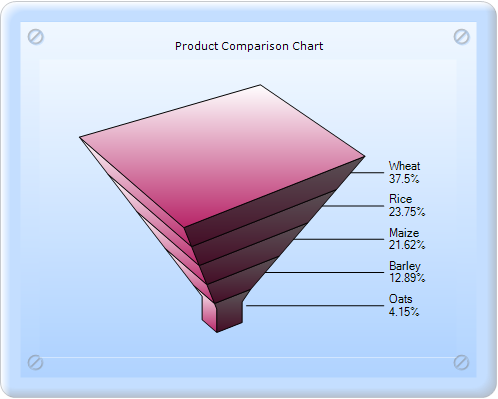
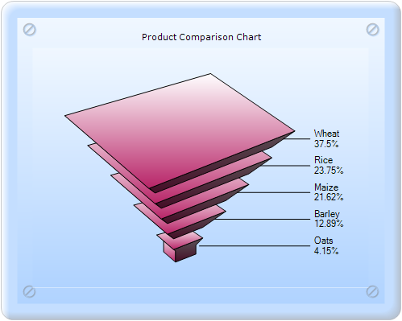
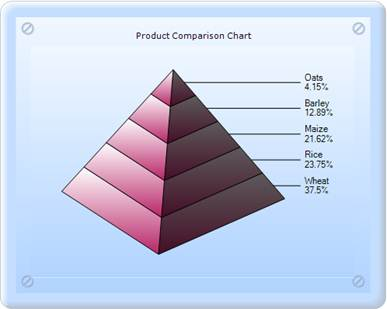

::: {style="DISPLAY: none"}
{#d2h_url_template}{#d2h_package_url style="WIDTH: 0px; DISPLAY: none; HEIGHT: 0px"}
:::

:::: {.d2h_secondary_topic style="PADDING-BOTTOM: 10pt; MARGIN: 0pt; PADDING-LEFT: 0pt; PADDING-RIGHT: 0pt; PADDING-TOP: 0pt"}
##### FigureBase {#figurebase style="tab-stops: 0pt"}

FigureBase specifies the drawing style for the Funnel or Pyramid chart base.

::: {align="center"}
+-------------------------------------+---------------------------------------------------------------+
| Details                                                                                             |
+-------------------------------------+---------------------------------------------------------------+
| Possible values                     | **Circle** - Renders the chart with a circular base.          |
|                                     |                                                               |
|                                     | **Square** - Renders the chart with a square base.            |
+-------------------------------------+---------------------------------------------------------------+
| Default value                       | Circle for the Funnel chart and Square for the Pyramid chart. |
+-------------------------------------+---------------------------------------------------------------+
| 2D/3D limitations                   | 3D only                                                       |
+-------------------------------------+---------------------------------------------------------------+
| Application to chart element        | All series                                                    |
+-------------------------------------+---------------------------------------------------------------+
| Application to chart types          | Funnel chart and Pyramid chart.                               |
+-------------------------------------+---------------------------------------------------------------+
:::

[]{style="FONT-FAMILY: 'Calibri','sans-serif'"} 

Funnel Charts:

 

{border="0"}

Figure 219: 3D Funnel-FigureBase-Square chart

 

{border="0"}

Figure 220: 3D Funnel chart with Gap ratio 0.2

[]{style="FONT-FAMILY: 'Calibri','sans-serif'"} 

**[]{style="FONT-FAMILY: 'Arial','sans-serif'"}** 

Pyramid Charts:

**[]{style="FONT-FAMILY: 'Calibri','sans-serif'"}** 

{border="0"}

Figure 221: 3D Pyramid-FigureBase-Circle chart

[]{style="FONT-FAMILY: 'Calibri','sans-serif'"} 

{border="0"}

Figure 222: 3D Pyramid-FigureBase-Square chart

[]{#related-topics}
::::
