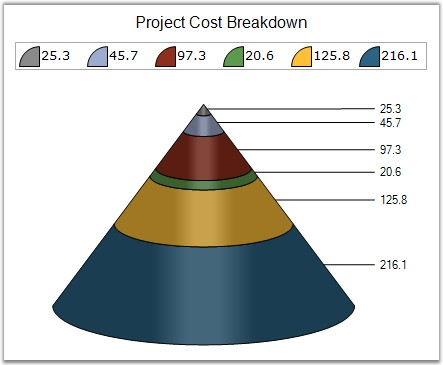
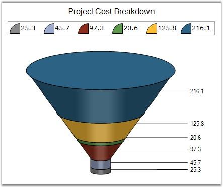

::: {style="DISPLAY: none"}
{#d2h_url_template}{#d2h_package_url style="WIDTH: 0px; DISPLAY: none; HEIGHT: 0px"}
:::

:::: {.d2h_secondary_topic style="PADDING-BOTTOM: 10pt; MARGIN: 0pt; PADDING-LEFT: 0pt; PADDING-RIGHT: 0pt; PADDING-TOP: 0pt"}
#### FigureBase {#figurebase style="tab-stops: 0pt"}

 

Specifies the drawing style for the funnel or pyramid chart base.

 

::: {align="center"}
+-------------------------------------+--------------------------------------------------------------------------------------------+
| Details                                                                                                                          |
+-------------------------------------+--------------------------------------------------------------------------------------------+
| **Possible Values**                 | [·      ]{style="FONT-FAMILY: Symbol"}**Circle** - Renders the chart with a circular base. |
|                                     |                                                                                            |
|                                     | [·      ]{style="FONT-FAMILY: Symbol"}**Square** - Renders the chart with a square base.   |
+-------------------------------------+--------------------------------------------------------------------------------------------+
| **Default Value    **               | [·      ]{style="FONT-FAMILY: Symbol"}**Funnel Chart -** Circle                            |
|                                     |                                                                                            |
|                                     | [·      ]{style="FONT-FAMILY: Symbol"}**Pyramid Chart -** Square                           |
+-------------------------------------+--------------------------------------------------------------------------------------------+
| **2D / 3D Limitations**             | 3D Only                                                                                    |
+-------------------------------------+--------------------------------------------------------------------------------------------+
| **Applies to Chart Element**        | All series                                                                                 |
+-------------------------------------+--------------------------------------------------------------------------------------------+
| **Applies to Chart Types**          | Funnel and Pyramid                                                                         |
+-------------------------------------+--------------------------------------------------------------------------------------------+
:::

 

Here is some sample code.

 

+-------------------------------------------------------------------------------------------------------------------------------------------------------------------------------------------------------------+
| **[\[C#\]]{style="FONT-FAMILY: 'Courier New'; COLOR: black"}**                                                                                                                                              |
|                                                                                                                                                                                                             |
| **[]{style="FONT-FAMILY: 'Courier New'; COLOR: black"}**                                                                                                                                                    |
|                                                                                                                                                                                                             |
| [// Setting FigureBase For Pyramid Chart]{style="FONT-FAMILY: 'Courier New'; COLOR: green"}                                                                                                                 |
|                                                                                                                                                                                                             |
| [this]{style="FONT-FAMILY: 'Courier New'; COLOR: blue"}[.chartControl1.Series\[0\].ConfigItems.PyramidItem.FigureBase = [ChartFigureBase]{style="COLOR: teal"}.Circle;]{style="FONT-FAMILY: 'Courier New'"} |
|                                                                                                                                                                                                             |
| [this]{style="FONT-FAMILY: 'Courier New'; COLOR: blue"}[.chartControl1.Series\[0\].ConfigItems.PyramidItem.FigureBase = [ChartFigureBase]{style="COLOR: teal"}.Square;]{style="FONT-FAMILY: 'Courier New'"} |
|                                                                                                                                                                                                             |
| []{style="FONT-FAMILY: 'Courier New'"}                                                                                                                                                                      |
|                                                                                                                                                                                                             |
| [// Setting FigureBase For Funnel Chart]{style="FONT-FAMILY: 'Courier New'; COLOR: green"}                                                                                                                  |
|                                                                                                                                                                                                             |
| [this]{style="FONT-FAMILY: 'Courier New'; COLOR: blue"}[.chartControl1.Series\[0\].ConfigItems.FunnelItem.FigureBase = [ChartFigureBase]{style="COLOR: teal"}.Circle;]{style="FONT-FAMILY: 'Courier New'"}  |
|                                                                                                                                                                                                             |
| [this]{style="FONT-FAMILY: 'Courier New'; COLOR: blue"}[.chartControl1.Series\[0\].ConfigItems.FunnelItem.FigureBase = [ChartFigureBase]{style="COLOR: teal"}.Square;]{style="FONT-FAMILY: 'Courier New'"}  |
+-------------------------------------------------------------------------------------------------------------------------------------------------------------------------------------------------------------+

 

+-------------------------------------------------------------------------------------------------------------------------------------------------------------------------------------------------------+
| **[\[VB.NET\]]{style="FONT-FAMILY: 'Courier New'; COLOR: black"}**                                                                                                                                    |
|                                                                                                                                                                                                       |
| **[]{style="FONT-FAMILY: 'Courier New'; COLOR: black"}**                                                                                                                                              |
|                                                                                                                                                                                                       |
| [\' Setting FigureBase For Pyramid]{style="FONT-FAMILY: 'Courier New'; COLOR: green"}                                                                                                                 |
|                                                                                                                                                                                                       |
| [Me]{style="FONT-FAMILY: 'Courier New'; COLOR: blue"}[.chartControl1.Series(0).ConfigItems.PyramidItem.FigureBase=[ChartFigureBase]{style="COLOR: teal"}.Circle]{style="FONT-FAMILY: 'Courier New'"}  |
|                                                                                                                                                                                                       |
| [Me]{style="FONT-FAMILY: 'Courier New'; COLOR: blue"}[.chartControl1.Series(0).ConfigItems.PyramidItem.FigureBase=[ChartFigureBase]{style="COLOR: teal"}.Square]{style="FONT-FAMILY: 'Courier New'"}  |
|                                                                                                                                                                                                       |
| []{style="FONT-FAMILY: 'Courier New'"}                                                                                                                                                                |
|                                                                                                                                                                                                       |
| [\' Setting FigureBase For Funnel Chart]{style="FONT-FAMILY: 'Courier New'; COLOR: green"}                                                                                                            |
|                                                                                                                                                                                                       |
| [Me]{style="FONT-FAMILY: 'Courier New'; COLOR: blue"}[.chartControl1.Series(0).ConfigItems.FunnelItem.FigureBase = [ChartFigureBase]{style="COLOR: teal"}.Circle]{style="FONT-FAMILY: 'Courier New'"} |
|                                                                                                                                                                                                       |
| [Me]{style="FONT-FAMILY: 'Courier New'; COLOR: blue"}[.chartControl1.Series(0).ConfigItems.FunnelItem.FigureBase = [ChartFigureBase]{style="COLOR: teal"}.Square]{style="FONT-FAMILY: 'Courier New'"} |
+-------------------------------------------------------------------------------------------------------------------------------------------------------------------------------------------------------+

 

Pyramid Chart

 

{border="0"}

 

Figure 129: Pyramid Chart with Figure Base = \" Circle\"

 

{border="0"}

 

Figure 130: Pyramid Chart with Figure Base =\"Square\"

 

Funnel Chart

 

{border="0"}

 

Figure 131: Funnel Chart with Figure Base =\"Circle\"

 

{border="0"}

 

Figure 132: Funnel Chart with Figure Base =\"Square\"

 

See Also

 

[Pyramid Chart]{.UGHyperlink}[,]{style="COLOR: windowtext; TEXT-DECORATION: none; text-underline: none"} [Funnel Chart]{.UGHyperlink}[]{.UGHyperlink}

[]{#p103} 

 

[]{#related-topics}
::::
