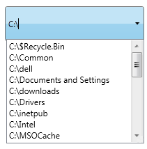
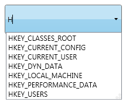
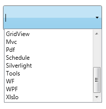

::: {style="DISPLAY: none"}
{#d2h_url_template}{#d2h_package_url style="WIDTH: 0px; DISPLAY: none; HEIGHT: 0px"}
:::

::: {.d2h_secondary_topic style="PADDING-BOTTOM: 10pt; MARGIN: 0pt; PADDING-LEFT: 0pt; PADDING-RIGHT: 0pt; PADDING-TOP: 0pt"}
#### FilePath, Registry & Custom Data Source Support {#filepath-registry-custom-data-source-support style="tab-stops: 0pt"}

AutoComplete can be used with different kinds of Data Source like FilePath, Registry & CustomSource. The Data Source of the AutoComplete control can be set using the **Source** property.

When the value of the Source property is set as FilePath, the AutoComplete will displays the path in the local system as the source. This is illustrated in the image given below.

 

{border="0"}

Figure 22: Source---FilePath

 

When the value of the Source property is set as Registry, the AutoComplete loads the values from the Registry. It is used when the Registry keys are required as input. This is illustrated in the image given below.

{border="0"}

Figure 23: Source---Registry

 

When the value of the Source property is set as Custom, the AutoComplete loads the values from the Business objects bounded to the AutoComplete control using the CustomSource property. This is illustrated in the image given below.

{border="0"}

Figure 24: Source---Custom

 

Adding Data Source Support to an Application

 

AutoComplete can be used with different kinds of Data Sources using the Source property. This support can be added to the application as mentioned in the code snippet below.

 

+-------------------------------------------------------------------------------------------------------------------------------------------------------------------------------------------------------------------------------------------------------------------------------------------------------------------------------------------------------------------------------------------------------------------------------------------------------------------------------------------------------------------------------------------------------------------------------------------------------------------------------------------------------+
| **[\[XAML\]]{style="FONT-FAMILY: 'Courier New'"}**                                                                                                                                                                                                                                                                                                                                                                                                                                                                                                                                                                                                    |
|                                                                                                                                                                                                                                                                                                                                                                                                                                                                                                                                                                                                                                                       |
| [\<]{style="FONT-FAMILY: 'Courier New'; COLOR: blue"}[syncfusion]{style="FONT-FAMILY: 'Courier New'; COLOR: #a31515"}[:]{style="FONT-FAMILY: 'Courier New'; COLOR: blue"}[AutoComplete]{style="FONT-FAMILY: 'Courier New'; COLOR: #a31515"}[ x]{style="FONT-FAMILY: 'Courier New'; COLOR: red"}[:]{style="FONT-FAMILY: 'Courier New'; COLOR: blue"}[Name]{style="FONT-FAMILY: 'Courier New'; COLOR: red"}[=\"AutoComplete1\"]{style="FONT-FAMILY: 'Courier New'; COLOR: blue"}[ Source]{style="FONT-FAMILY: 'Courier New'; COLOR: red"}[=\"FilePath\"/\>]{style="FONT-FAMILY: 'Courier New'; COLOR: blue"}                                            |
|                                                                                                                                                                                                                                                                                                                                                                                                                                                                                                                                                                                                                                                       |
| [\<]{style="FONT-FAMILY: 'Courier New'; COLOR: blue"}[syncfusion]{style="FONT-FAMILY: 'Courier New'; COLOR: #a31515"}[:]{style="FONT-FAMILY: 'Courier New'; COLOR: blue"}[AutoComplete]{style="FONT-FAMILY: 'Courier New'; COLOR: #a31515"}[ x]{style="FONT-FAMILY: 'Courier New'; COLOR: red"}[:]{style="FONT-FAMILY: 'Courier New'; COLOR: blue"}[Name]{style="FONT-FAMILY: 'Courier New'; COLOR: red"}[=\"AutoComplete2\"]{style="FONT-FAMILY: 'Courier New'; COLOR: blue"}[ Source]{style="FONT-FAMILY: 'Courier New'; COLOR: red"}[ =\"Registry\"/\>]{style="FONT-FAMILY: 'Courier New'; COLOR: blue"}**[]{style="FONT-FAMILY: 'Courier New'"}** |
|                                                                                                                                                                                                                                                                                                                                                                                                                                                                                                                                                                                                                                                       |
| [\<]{style="FONT-FAMILY: 'Courier New'; COLOR: blue"}[syncfusion]{style="FONT-FAMILY: 'Courier New'; COLOR: #a31515"}[:]{style="FONT-FAMILY: 'Courier New'; COLOR: blue"}[AutoComplete]{style="FONT-FAMILY: 'Courier New'; COLOR: #a31515"}[ x]{style="FONT-FAMILY: 'Courier New'; COLOR: red"}[:]{style="FONT-FAMILY: 'Courier New'; COLOR: blue"}[Name]{style="FONT-FAMILY: 'Courier New'; COLOR: red"}[=\"AutoComplete3\"]{style="FONT-FAMILY: 'Courier New'; COLOR: blue"}[ Source]{style="FONT-FAMILY: 'Courier New'; COLOR: red"}[=\"Custom\"\>]{style="FONT-FAMILY: 'Courier New'; COLOR: blue"}                                               |
|                                                                                                                                                                                                                                                                                                                                                                                                                                                                                                                                                                                                                                                       |
| [     \<]{style="FONT-FAMILY: 'Courier New'; COLOR: blue"}[syncfusion]{style="FONT-FAMILY: 'Courier New'; COLOR: #a31515"}[:]{style="FONT-FAMILY: 'Courier New'; COLOR: blue"}[AutoComplete.CustomSource]{style="FONT-FAMILY: 'Courier New'; COLOR: #a31515"}[\>]{style="FONT-FAMILY: 'Courier New'; COLOR: blue"}[]{style="FONT-FAMILY: 'Courier New'"}                                                                                                                                                                                                                                                                                              |
|                                                                                                                                                                                                                                                                                                                                                                                                                                                                                                                                                                                                                                                       |
| [             ]{style="FONT-FAMILY: 'Courier New'; COLOR: #a31515"}[\<]{style="FONT-FAMILY: 'Courier New'; COLOR: blue"}[local]{style="FONT-FAMILY: 'Courier New'; COLOR: #a31515"}[:]{style="FONT-FAMILY: 'Courier New'; COLOR: blue"}[CustomerListCollection]{style="FONT-FAMILY: 'Courier New'; COLOR: #a31515"}[/\>]{style="FONT-FAMILY: 'Courier New'; COLOR: blue"}[]{style="FONT-FAMILY: 'Courier New'"}                                                                                                                                                                                                                                       |
|                                                                                                                                                                                                                                                                                                                                                                                                                                                                                                                                                                                                                                                       |
| [     ]{style="FONT-FAMILY: 'Courier New'; COLOR: #a31515"}[\</]{style="FONT-FAMILY: 'Courier New'; COLOR: blue"}[syncfusion]{style="FONT-FAMILY: 'Courier New'; COLOR: #a31515"}[:]{style="FONT-FAMILY: 'Courier New'; COLOR: blue"}[AutoComplete.CustomSource]{style="FONT-FAMILY: 'Courier New'; COLOR: #a31515"}[\>]{style="FONT-FAMILY: 'Courier New'; COLOR: blue"}[]{style="FONT-FAMILY: 'Courier New'"}                                                                                                                                                                                                                                       |
|                                                                                                                                                                                                                                                                                                                                                                                                                                                                                                                                                                                                                                                       |
| [\</]{style="FONT-FAMILY: 'Courier New'; COLOR: blue"}[syncfusion]{style="FONT-FAMILY: 'Courier New'; COLOR: #a31515"}[:]{style="FONT-FAMILY: 'Courier New'; COLOR: blue"}[AutoComplete]{style="FONT-FAMILY: 'Courier New'; COLOR: #a31515"}[\>]{style="FONT-FAMILY: 'Courier New'; COLOR: blue"}                                                                                                                                                                                                                                                                                                                                                     |
|                                                                                                                                                                                                                                                                                                                                                                                                                                                                                                                                                                                                                                                       |
| []{style="FONT-FAMILY: 'Courier New'"}                                                                                                                                                                                                                                                                                                                                                                                                                                                                                                                                                                                                                |
+-------------------------------------------------------------------------------------------------------------------------------------------------------------------------------------------------------------------------------------------------------------------------------------------------------------------------------------------------------------------------------------------------------------------------------------------------------------------------------------------------------------------------------------------------------------------------------------------------------------------------------------------------------+

 

+--------------------------------------------------------------------------------------------------------------------------------------------------------------------------------------------------------------------------------------------------------+
| **[\[C#\]]{style="FONT-FAMILY: 'Courier New'"}**                                                                                                                                                                                                       |
|                                                                                                                                                                                                                                                        |
| [AutoComplete]{style="FONT-FAMILY: 'Courier New'; COLOR: #2b91af"}[ autoComplete1 = [new]{style="COLOR: blue"} [AutoComplete]{style="COLOR: #2b91af"}();]{style="FONT-FAMILY: 'Courier New'"}                                                          |
|                                                                                                                                                                                                                                                        |
| [this]{style="FONT-FAMILY: 'Courier New'; COLOR: blue"}[.]{style="FONT-FAMILY: 'Courier New'"}[autoComplete1]{style="FONT-FAMILY: 'Courier New'"}[.Source = [SourceMode]{style="COLOR: #2b91af"}.FilePath;]{style="FONT-FAMILY: 'Courier New'"}        |
|                                                                                                                                                                                                                                                        |
| []{style="FONT-FAMILY: 'Courier New'"}                                                                                                                                                                                                                 |
|                                                                                                                                                                                                                                                        |
| [AutoComplete]{style="FONT-FAMILY: 'Courier New'; COLOR: #2b91af"}[ autoComplete2 = [new]{style="COLOR: blue"} [AutoComplete]{style="COLOR: #2b91af"}();]{style="FONT-FAMILY: 'Courier New'"}                                                          |
|                                                                                                                                                                                                                                                        |
| [this]{style="FONT-FAMILY: 'Courier New'; COLOR: blue"}[.]{style="FONT-FAMILY: 'Courier New'"}[autoComplete2]{style="FONT-FAMILY: 'Courier New'"}[.SelectionMode = [SourceMode]{style="COLOR: #2b91af"}.Registry;]{style="FONT-FAMILY: 'Courier New'"} |
|                                                                                                                                                                                                                                                        |
| []{style="FONT-FAMILY: 'Courier New'"}                                                                                                                                                                                                                 |
|                                                                                                                                                                                                                                                        |
| [AutoComplete]{style="FONT-FAMILY: 'Courier New'; COLOR: #2b91af"}[ autoComplete3 = [new]{style="COLOR: blue"} [AutoComplete]{style="COLOR: #2b91af"}();]{style="FONT-FAMILY: 'Courier New'"}                                                          |
|                                                                                                                                                                                                                                                        |
| [this]{style="FONT-FAMILY: 'Courier New'; COLOR: blue"}[.]{style="FONT-FAMILY: 'Courier New'"}[autoComplete3]{style="FONT-FAMILY: 'Courier New'"}[.SelectionMode = [SourceMode]{style="COLOR: #2b91af"}.Custom;]{style="FONT-FAMILY: 'Courier New'"}   |
|                                                                                                                                                                                                                                                        |
| []{style="FONT-FAMILY: 'Courier New'"}                                                                                                                                                                                                                 |
|                                                                                                                                                                                                                                                        |
| [List]{style="FONT-FAMILY: 'Courier New'; COLOR: #2b91af"}[\<[String]{style="COLOR: #2b91af"}\> products = [new]{style="COLOR: blue"} [List]{style="COLOR: #2b91af"}\<[String]{style="COLOR: #2b91af"}\>();]{style="FONT-FAMILY: 'Courier New'"}       |
|                                                                                                                                                                                                                                                        |
| [customSource.Add([\"Diagram\"]{style="COLOR: #a31515"});]{style="FONT-FAMILY: 'Courier New'"}                                                                                                                                                         |
|                                                                                                                                                                                                                                                        |
| [customSource.Add([\"Gauge\"]{style="COLOR: #a31515"});]{style="FONT-FAMILY: 'Courier New'"}                                                                                                                                                           |
|                                                                                                                                                                                                                                                        |
| [customSource.Add([\"Chart\"]{style="COLOR: #a31515"});]{style="FONT-FAMILY: 'Courier New'"}                                                                                                                                                           |
|                                                                                                                                                                                                                                                        |
| [customSource.Add([\"Schedule\"]{style="COLOR: #a31515"});]{style="FONT-FAMILY: 'Courier New'"}                                                                                                                                                        |
|                                                                                                                                                                                                                                                        |
| [customSource.Add([\"Grid\"]{style="COLOR: #a31515"});]{style="FONT-FAMILY: 'Courier New'"}                                                                                                                                                            |
|                                                                                                                                                                                                                                                        |
| [customSource.Add([\"DocIo\"]{style="COLOR: #a31515"});]{style="FONT-FAMILY: 'Courier New'"}                                                                                                                                                           |
|                                                                                                                                                                                                                                                        |
| [customSource.Add([\"XlsIo\"]{style="COLOR: #a31515"});]{style="FONT-FAMILY: 'Courier New'"}                                                                                                                                                           |
|                                                                                                                                                                                                                                                        |
| [customSource.Add([\"Pdf\"]{style="COLOR: #a31515"});]{style="FONT-FAMILY: 'Courier New'"}                                                                                                                                                             |
|                                                                                                                                                                                                                                                        |
| [customSource.Add([\"RichTextBox\"]{style="COLOR: #a31515"});]{style="FONT-FAMILY: 'Courier New'"}                                                                                                                                                     |
|                                                                                                                                                                                                                                                        |
| [customSource.Add([\"ReportBuilder\"]{style="COLOR: #a31515"});]{style="FONT-FAMILY: 'Courier New'"}                                                                                                                                                   |
|                                                                                                                                                                                                                                                        |
| []{style="FONT-FAMILY: 'Courier New'"}                                                                                                                                                                                                                 |
|                                                                                                                                                                                                                                                        |
| [this]{style="FONT-FAMILY: 'Courier New'; COLOR: blue"}[.]{style="FONT-FAMILY: 'Courier New'"}[autoComplete3]{style="FONT-FAMILY: 'Courier New'"}[.CustomSource = products;]{style="FONT-FAMILY: 'Courier New'"}                                       |
|                                                                                                                                                                                                                                                        |
| []{style="FONT-FAMILY: Consolas; FONT-SIZE: 9.5pt"}                                                                                                                                                                                                    |
+--------------------------------------------------------------------------------------------------------------------------------------------------------------------------------------------------------------------------------------------------------+

 

Tables for properties, methods, and events

Properties

Table 3: Property Table for Data Source Support

  ---------- ---------------------------------------------- -------------------- ------------------ -----------------
  Property   Description                                    Type                 Data Type          Reference links
  Source     Gets or sets the Source of the AutoComplete.   DependencyProperty   SourceMode(enum)   
  ---------- ---------------------------------------------- -------------------- ------------------ -----------------

 

Events

Table 4: Event Table for Data Source Support

+---------------+--------------------------------------------------------------------------+------------------------------------+-----------------------------------+-----------------+
| Event         | Description                                                              | Arguments                          | Type                              | Reference links |
+---------------+--------------------------------------------------------------------------+------------------------------------+-----------------------------------+-----------------+
| SourceChanged |  When the Source property value is changed this event will be triggered. | DependencyObject,                  | DependencyPropertyChangedCallBack |                 |
|               |                                                                          |                                    |                                   |                 |
|               | It cannot be cancelled.                                                  | DependencyPropertyChangedEventArgs |                                   |                 |
+===============+==========================================================================+====================================+===================================+=================+

**[]{style="FONT-FAMILY: 'Trebuchet MS','sans-serif'; COLOR: #15428b; FONT-SIZE: 9pt"}** 

Sample Link

WPF Sample Browser-\> Tools -\> Editors -\> AutoComplete Demo

 

[]{#related-topics}
:::
