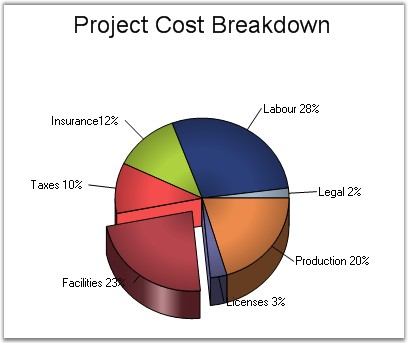

::: {style="DISPLAY: none"}
{#d2h_url_template}{#d2h_package_url style="WIDTH: 0px; DISPLAY: none; HEIGHT: 0px"}
:::

:::: {.d2h_secondary_topic style="PADDING-BOTTOM: 10pt; MARGIN: 0pt; PADDING-LEFT: 0pt; PADDING-RIGHT: 0pt; PADDING-TOP: 0pt"}
#### FillMode {#fillmode style="tab-stops: 0pt"}

[]{style="FONT-FAMILY: 'Trebuchet MS','sans-serif'; FONT-SIZE: 9pt"} 

Specifies how the slice interior should be filled with gradient colors.

[]{style="FONT-FAMILY: 'Trebuchet MS','sans-serif'; FONT-SIZE: 9pt"} 

::: {align="center"}
+-------------------------------------+----------------------------------------------------------------+
| Details                                                                                              |
+-------------------------------------+----------------------------------------------------------------+
| Possible Values                     | AllPie - Controls the interior shape style of All PieItem.     |
|                                     |                                                                |
|                                     | EveryPie - Controls the interior shape style of Every PieItem. |
+-------------------------------------+----------------------------------------------------------------+
| Default Value                       | AllPie                                                         |
+-------------------------------------+----------------------------------------------------------------+
| 2D / 3D Limitations                 | No                                                             |
+-------------------------------------+----------------------------------------------------------------+
| Applies to Chart Element            | All series                                                     |
+-------------------------------------+----------------------------------------------------------------+
| Applies to Chart Types              | Pie Chart                                                      |
+-------------------------------------+----------------------------------------------------------------+
:::

**[]{style="FONT-FAMILY: 'Trebuchet MS','sans-serif'; FONT-SIZE: 9pt"}** 

Here is some sample code.

[]{style="FONT-FAMILY: 'Trebuchet MS','sans-serif'; FONT-SIZE: 9pt"} 

+-------------------------------------------------------------------------------------------------------------------------------------------------------------------------------------------------------------+
| **[\[C#\]]{style="FONT-FAMILY: 'Courier New'; COLOR: black"}**                                                                                                                                              |
|                                                                                                                                                                                                             |
| **[]{style="FONT-FAMILY: 'Courier New'; COLOR: black"}**                                                                                                                                                    |
|                                                                                                                                                                                                             |
| [// Setting Pietype]{style="FONT-FAMILY: 'Courier New'; COLOR: green"}                                                                                                                                      |
|                                                                                                                                                                                                             |
| [this]{style="FONT-FAMILY: 'Courier New'; COLOR: blue"}[.ChartWebControl1.Series\[0\].ConfigItems.PieItem.PieType = [ChartPieType]{style="COLOR: teal"}.Round;]{style="FONT-FAMILY: 'Courier New'"}         |
|                                                                                                                                                                                                             |
| [// Setting the interiors of shapes in this GraphicsPath object are filled.]{style="FONT-FAMILY: 'Courier New'; COLOR: green"}                                                                              |
|                                                                                                                                                                                                             |
| [this]{style="FONT-FAMILY: 'Courier New'; COLOR: blue"}[.ChartWebControl1.Series\[0\].ConfigItems.PieItem.FillMode = [ChartPieFillMode]{style="COLOR: teal"}.EveryPie;]{style="FONT-FAMILY: 'Courier New'"} |
+-------------------------------------------------------------------------------------------------------------------------------------------------------------------------------------------------------------+

[]{style="FONT-FAMILY: 'Trebuchet MS','sans-serif'; FONT-SIZE: 9pt"} 

+------------------------------------------------------------------------------------------------------------------------------------------------------------------------------------------------------------------------------------------------------+
| **[\[VB.NET\]]{style="FONT-FAMILY: 'Courier New'; COLOR: black"}**                                                                                                                                                                                   |
|                                                                                                                                                                                                                                                      |
| **[]{style="FONT-FAMILY: 'Courier New'; COLOR: black"}**                                                                                                                                                                                             |
|                                                                                                                                                                                                                                                      |
| [\' Setting Pietype]{style="FONT-FAMILY: 'Courier New'; COLOR: green"}                                                                                                                                                                               |
|                                                                                                                                                                                                                                                      |
| [Me]{style="FONT-FAMILY: 'Courier New'; COLOR: blue"}[.ChartWebControl1.Series(0).ConfigItems.PieItem.PieType = [ChartPieType]{style="COLOR: teal"}[.]{style="COLOR: blue"}Round]{style="FONT-FAMILY: 'Courier New'"}                                |
|                                                                                                                                                                                                                                                      |
| [\' Setting the interiors of shapes in this GraphicsPath object are filled.]{style="FONT-FAMILY: 'Courier New'; COLOR: green"}                                                                                                                       |
|                                                                                                                                                                                                                                                      |
| [Me]{style="FONT-FAMILY: 'Courier New'; COLOR: blue"}[.ChartWebControl1.Series(0).ConfigItems.PieItem.FillMode =[ ]{style="COLOR: blue"}[ChartPieFillMode]{style="COLOR: teal"}[.]{style="COLOR: blue"}EveryPie]{style="FONT-FAMILY: 'Courier New'"} |
+------------------------------------------------------------------------------------------------------------------------------------------------------------------------------------------------------------------------------------------------------+

**[]{style="FONT-FAMILY: 'Trebuchet MS','sans-serif'; FONT-SIZE: 9pt"}** 

{border="0"}

**[]{style="FONT-FAMILY: 'Trebuchet MS','sans-serif'; FONT-SIZE: 9pt"}** 

Figure 128: Pie Chart with \"EveryPie\" FillMode

**[]{style="FONT-FAMILY: 'Courier New'; COLOR: black; FONT-SIZE: 9pt"}** 

{border="0"}

**[]{style="FONT-FAMILY: 'Trebuchet MS','sans-serif'; FONT-SIZE: 9pt"}** 

Figure 129: Pie Chart with \"AllPie\" FillMode

**[]{style="FONT-FAMILY: 'Trebuchet MS','sans-serif'; FONT-SIZE: 9pt"}** 

See Also

[]{style="FONT-FAMILY: 'Trebuchet MS','sans-serif'; FONT-SIZE: 9pt"} 

[Pie Chart]{.UGHyperlink}[]{.UGHyperlink}

[]{#p105} 

[]{#related-topics}
::::
