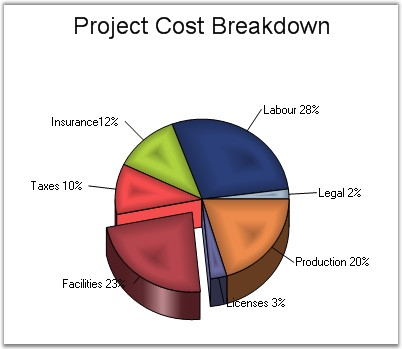

::: {style="DISPLAY: none"}
{#d2h_url_template}{#d2h_package_url style="WIDTH: 0px; DISPLAY: none; HEIGHT: 0px"}
:::

:::: {.d2h_secondary_topic style="PADDING-BOTTOM: 10pt; MARGIN: 0pt; PADDING-LEFT: 0pt; PADDING-RIGHT: 0pt; PADDING-TOP: 0pt"}
#### FillMode {#fillmode style="tab-stops: 0pt"}

 

Specifies how the slice interior should be filled with gradient colors.

 

::: {align="center"}
+-------------------------------------+----------------------------------------------------------------------------------------------------------+
| Details                                                                                                                                        |
+-------------------------------------+----------------------------------------------------------------------------------------------------------+
| **Possible Values**                 | [·      ]{style="FONT-FAMILY: Symbol"}**AllPie** - Controls the interior shape style of All PieItem.     |
|                                     |                                                                                                          |
|                                     | [·      ]{style="FONT-FAMILY: Symbol"}**EveryPie** - Controls the interior shape style of Every PieItem. |
+-------------------------------------+----------------------------------------------------------------------------------------------------------+
| **Default Value    **               | **AllPie**                                                                                               |
+-------------------------------------+----------------------------------------------------------------------------------------------------------+
| **2D / 3D Limitations**             | No                                                                                                       |
+-------------------------------------+----------------------------------------------------------------------------------------------------------+
| **Applies to Chart Element**        | All series                                                                                               |
+-------------------------------------+----------------------------------------------------------------------------------------------------------+
| **Applies to Chart Types**          | Pie Chart                                                                                                |
+-------------------------------------+----------------------------------------------------------------------------------------------------------+
:::

 

Here is some sample code.

 

+----------------------------------------------------------------------------------------------------------------------------------------------------------------------------------------------------------+
| **[\[C#\]]{style="FONT-FAMILY: 'Courier New'; COLOR: black"}**                                                                                                                                           |
|                                                                                                                                                                                                          |
| **[]{style="FONT-FAMILY: 'Courier New'; COLOR: black"}**                                                                                                                                                 |
|                                                                                                                                                                                                          |
| [// Setting Pietype]{style="FONT-FAMILY: 'Courier New'; COLOR: green"}                                                                                                                                   |
|                                                                                                                                                                                                          |
| [this]{style="FONT-FAMILY: 'Courier New'; COLOR: blue"}[.chartControl1.Series\[0\].ConfigItems.PieItem.PieType = [ChartPieType]{style="COLOR: teal"}.Round;]{style="FONT-FAMILY: 'Courier New'"}         |
|                                                                                                                                                                                                          |
| [// Setting the interiors of shapes in this GraphicsPath object are filled.]{style="FONT-FAMILY: 'Courier New'; COLOR: green"}                                                                           |
|                                                                                                                                                                                                          |
| [this]{style="FONT-FAMILY: 'Courier New'; COLOR: blue"}[.chartControl1.Series\[0\].ConfigItems.PieItem.FillMode = [ChartPieFillMode]{style="COLOR: teal"}.EveryPie;]{style="FONT-FAMILY: 'Courier New'"} |
+----------------------------------------------------------------------------------------------------------------------------------------------------------------------------------------------------------+

 

+---------------------------------------------------------------------------------------------------------------------------------------------------------------------------------------------------------------------------------------------------+
| **[\[VB.NET\]]{style="FONT-FAMILY: 'Courier New'; COLOR: black"}**                                                                                                                                                                                |
|                                                                                                                                                                                                                                                   |
| **[]{style="FONT-FAMILY: 'Courier New'; COLOR: black"}**                                                                                                                                                                                          |
|                                                                                                                                                                                                                                                   |
| [\' Setting Pietype]{style="FONT-FAMILY: 'Courier New'; COLOR: green"}                                                                                                                                                                            |
|                                                                                                                                                                                                                                                   |
| [Me]{style="FONT-FAMILY: 'Courier New'; COLOR: blue"}[.chartControl1.Series(0).ConfigItems.PieItem.PieType = [ChartPieType]{style="COLOR: teal"}[.]{style="COLOR: blue"}Round]{style="FONT-FAMILY: 'Courier New'"}                                |
|                                                                                                                                                                                                                                                   |
| [\' Setting the interiors of shapes in this GraphicsPath object are filled.]{style="FONT-FAMILY: 'Courier New'; COLOR: green"}                                                                                                                    |
|                                                                                                                                                                                                                                                   |
| [Me]{style="FONT-FAMILY: 'Courier New'; COLOR: blue"}[.chartControl1.Series(0).ConfigItems.PieItem.FillMode =[ ]{style="COLOR: blue"}[ChartPieFillMode]{style="COLOR: teal"}[.]{style="COLOR: blue"}EveryPie]{style="FONT-FAMILY: 'Courier New'"} |
+---------------------------------------------------------------------------------------------------------------------------------------------------------------------------------------------------------------------------------------------------+

 

{border="0"}

 

Figure 133: Pie Chart with \"EveryPie\" FillMode

**[]{style="FONT-FAMILY: 'Courier New'; COLOR: black"}** 

{border="0"}

 

Figure 134: Pie Chart with \"AllPie\" FillMode

 

See Also

 

[ ]{.UGHyperlink}[Pie Chart]{.UGHyperlink}[]{.UGHyperlink}

 

[]{#p104} 

 

[]{#related-topics}
::::
