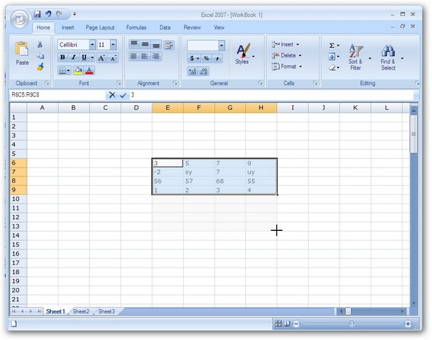
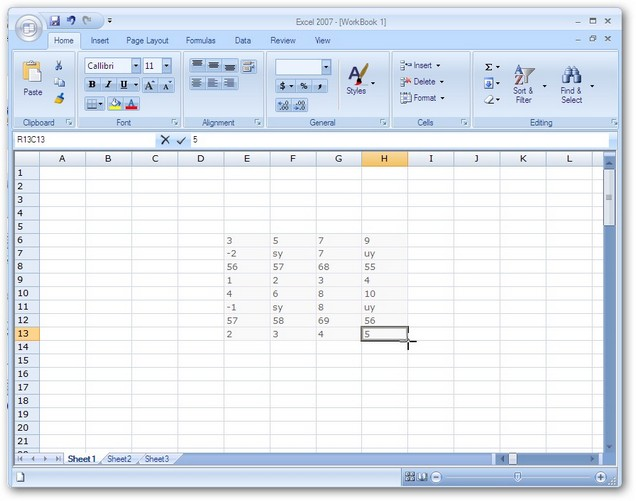
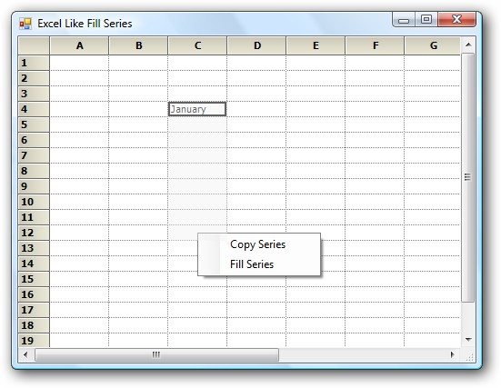
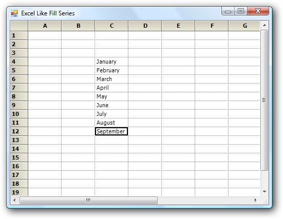

::: {style="DISPLAY: none"}
{#d2h_url_template}{#d2h_package_url style="WIDTH: 0px; DISPLAY: none; HEIGHT: 0px"}
:::

::::: {#nsbanner .d2h_main_nsbanner style="BORDER-BOTTOM: #999999 1px solid; POSITION: relative; PADDING-BOTTOM: 0px; BACKGROUND-COLOR: transparent; PADDING-LEFT: 0px; PADDING-RIGHT: 0px; DISPLAY: none; BORDER-TOP: #999999 1px solid; PADDING-TOP: 0px; LEFT: 0px"}
:::: {#TitleRow .d2h_main_titlerow style="PADDING-BOTTOM: 4px; BACKGROUND-COLOR: transparent; PADDING-LEFT: 22px; WIDTH: 100%; PADDING-RIGHT: 10px; DISPLAY: none; PADDING-TOP: 4px"}
::: {#ienav .d2h_main_ienav style="DISPLAY: none"}
{#D2HPrevious .D2HPreviousEnabled}  {#D2HNext .D2HNextEnabled}
:::
::::
:::::

::::: {#nstext .d2h_main_nstext style="PADDING-BOTTOM: 10px; BACKGROUND-COLOR: transparent; PADDING-LEFT: 22px; PADDING-RIGHT: 10px; HEIGHT: 100%; OVERFLOW: auto; PADDING-TOP: 5px" hasuserbackground="true" valign="bottom"}
::: {#d2h_breadcrumbs .d2h_breadcrumbs}
[Essential Studio User Guide Documentation](ms-xhelp:///?Id=12457748-09e3-4d74-a240-8e049cedf030){.d2h_breadcrumbsNormal}[ \> ]{.d2h_breadcrumbsLinkSeparator}[User Interface Edition](ms-xhelp:///?Id=c29296b7-531c-413b-a0ec-488ca1f7f669){.d2h_breadcrumbsNormal}[ \> ]{.d2h_breadcrumbsLinkSeparator}[Essential Windows](ms-xhelp:///?Id=e60759d8-47a4-4570-9d7a-16a68d63f2ea){.d2h_breadcrumbsNormal}[ \> ]{.d2h_breadcrumbsLinkSeparator}[Essential Grid]{.d2h_breadcrumbsContentsOnly}[ \> ]{.d2h_breadcrumbsLinkSeparator}[Grid Controls](ms-xhelp:///?Id=bf2d70d7-33dc-4c67-a55d-4fcf8d51dc2b){.d2h_breadcrumbsNormal}[ \> ]{.d2h_breadcrumbsLinkSeparator}[Grid Helper Classes](ms-xhelp:///?Id=fc684465-b246-4aea-b668-e0c0084c9590){.d2h_breadcrumbsNormal}
:::

### Fill Series {#fill-series style="tab-stops: 0pt"}

 

Support to implement Excel-like Fill Series in the Grid

 

A helper class implementing IMouseController interface has been added to GridHelperClasses library to implement Excel-like Fill Series in the Grid.

 

To make use of this functionality, Syncfusion.GridHelperClasses.Windows .dll must be referred and the mouse controller has to be added in MouseControllerDispatcher of grid.

 

The following support has been provided since 8.2

The behavior has extended support which pops up a menu after the drag that has two items:

[·      ]{style="FONT-FAMILY: Symbol"}**Copy Series** - Copy paste the content from the cell.

[·      ]{style="FONT-FAMILY: Symbol"}**Fill Series** - Fill the cell with appropriate sequence.

[]{style="FONT-FAMILY: 'Trebuchet MS','sans-serif'; COLOR: #15428b; FONT-SIZE: 9pt"} 

The Excel Like fill Series has support on:

[·      ]{style="FONT-FAMILY: Symbol"}**Number** - From active range with single or multiple cells (e.g. 1, 2, 3\...)

[·      ]{style="FONT-FAMILY: Symbol"}**Text** - Will paste the same text for both \'copy series\' and \'fill series\'

[·      ]{style="FONT-FAMILY: Symbol"}**Date** - Date format must be MM/DD/YYYY

[·      ]{style="FONT-FAMILY: Symbol"}**Month** - The month in text (e.g. January, February, March\... or Jan, Feb, Mar\...)

[]{style="FONT-FAMILY: 'Trebuchet MS','sans-serif'; COLOR: #15428b; FONT-SIZE: 9pt"} 

The following code illustrates how to add Excel Like fill Series.

[]{style="FONT-FAMILY: 'Trebuchet MS','sans-serif'; COLOR: #15428b; FONT-SIZE: 9pt"} 

+----------------------------------------------------------------------------------------------------------------------------------------------------------------------------------+
| **[\[C#\] ]{style="FONT-FAMILY: 'Courier New'"}**                                                                                                                                |
|                                                                                                                                                                                  |
| [            gridControl1.ExcelLikeCurrentCell = [true]{style="COLOR: blue"};]{style="FONT-FAMILY: 'Courier New'"}                                                               |
|                                                                                                                                                                                  |
| [            Syncfusion.GridHelperClasses.[ExcelSelectionMarkerMouseController]{style="COLOR: #2b91af"} marker = [new]{style="COLOR: blue"}]{style="FONT-FAMILY: 'Courier New'"} |
|                                                                                                                                                                                  |
| [ Syncfusion.GridHelperClasses.[ExcelSelectionMarkerMouseController]{style="COLOR: #2b91af"}([this]{style="COLOR: blue"}.gridControl1);]{style="FONT-FAMILY: 'Courier New'"}     |
|                                                                                                                                                                                  |
| [            [this]{style="COLOR: blue"}.gridControl1.MouseControllerDispatcher.Add(marker);]{style="FONT-FAMILY: 'Courier New'"}                                                |
+----------------------------------------------------------------------------------------------------------------------------------------------------------------------------------+

[]{style="FONT-FAMILY: 'Trebuchet MS','sans-serif'; COLOR: #15428b; FONT-SIZE: 9pt"} 

+----------------------------------------------------------------------------------------------------------------------------------------------------------------------------------------+
| **[\[VB\]]{style="FONT-FAMILY: 'Courier New'"}**                                                                                                                                       |
|                                                                                                                                                                                        |
| []{style="FONT-FAMILY: 'Courier New'"}                                                                                                                                                 |
|                                                                                                                                                                                        |
| [            GridControl1.ExcelLikeCurrentCell = [True]{style="COLOR: blue"}]{style="FONT-FAMILY: 'Courier New'"}                                                                      |
|                                                                                                                                                                                        |
| [            [Dim]{style="COLOR: blue"} excelMarker [As]{style="COLOR: blue"} [New]{style="COLOR: blue"} ExcelMarkerMouseController(GridControl1)]{style="FONT-FAMILY: 'Courier New'"} |
|                                                                                                                                                                                        |
| [            GridControl1.MouseControllerDispatcher.Add(excelMarker)]{style="FONT-FAMILY: 'Courier New'"}                                                                              |
+----------------------------------------------------------------------------------------------------------------------------------------------------------------------------------------+

[]{style="FONT-FAMILY: 'Trebuchet MS','sans-serif'; COLOR: #15428b; FONT-SIZE: 9pt"} 

Methods of IMouseController Interface Implemented

[]{style="FONT-FAMILY: 'Trebuchet MS','sans-serif'; COLOR: #15428b; FONT-SIZE: 9pt"} 

[·      ]{style="FONT-FAMILY: Symbol"}**MouseMove**-The code handled in this method allows dragging the series in either one of the four directions at a time, retaining a rectangular layout.

[·      ]{style="FONT-FAMILY: Symbol"}**MouseUp**-The code handled in this method sets the cell values based on the dragged series accordingly (if it is a formula or text or numeric value).

[]{style="FONT-FAMILY: 'Trebuchet MS','sans-serif'; COLOR: #15428b; FONT-SIZE: 9pt"} 

Following are screen shots illustrating the feature.

[]{style="FONT-FAMILY: 'Trebuchet MS','sans-serif'; COLOR: #15428b; FONT-SIZE: 9pt"} 

1.   Image displaying drag operation of the selected series towards bottom.

[]{style="FONT-FAMILY: 'Trebuchet MS','sans-serif'; COLOR: #15428b; FONT-SIZE: 9pt"} 

{border="0"}

*[Figure ]{style="FONT-SIZE: 9pt"}[478]{style="FONT-SIZE: 9pt"}[: Drag Operation of the Selected Series]{style="FONT-SIZE: 9pt"}*

***[]{style="FONT-FAMILY: 'Trebuchet MS','sans-serif'; COLOR: #15428b; FONT-SIZE: 9pt"}*** 

2.   Image displaying the filled series.

[]{style="FONT-FAMILY: 'Trebuchet MS','sans-serif'; COLOR: #15428b; FONT-SIZE: 9pt"} 

{border="0"}

 

*[Figure ]{style="FONT-SIZE: 9pt"}[479]{style="FONT-SIZE: 9pt"}[: Filled Series]{style="FONT-SIZE: 9pt"}*

**[]{style="FONT-FAMILY: 'Trebuchet MS','sans-serif'; COLOR: #15428b; FONT-SIZE: 9pt"}** 

3.   The image shows the popup menu displayed after dragging the cell that displays **January.**

[]{style="FONT-FAMILY: 'Trebuchet MS','sans-serif'; COLOR: #15428b; FONT-SIZE: 9pt"} 

[{border="0"}]{style="FONT-FAMILY: 'Trebuchet MS','sans-serif'; COLOR: #15428b; FONT-SIZE: 9pt"}[]{style="FONT-FAMILY: 'Trebuchet MS','sans-serif'; COLOR: #15428b; FONT-SIZE: 9pt"}

*[Figure ]{style="FONT-SIZE: 9pt"}[480]{style="FONT-SIZE: 9pt"}[: Popup Menu Displayed after Dragging the Cell]{style="FONT-SIZE: 9pt"}*

*[]{style="FONT-SIZE: 9pt"}* 

::: {style="BORDER-BOTTOM: windowtext 1pt solid; BORDER-LEFT: medium none; PADDING-BOTTOM: 1pt; MARGIN-TOP: 9pt; PADDING-LEFT: 0pt; PADDING-RIGHT: 0pt; MARGIN-BOTTOM: 9pt; BORDER-TOP: windowtext 1pt solid; BORDER-RIGHT: medium none; PADDING-TOP: 1pt"}
[{border="0"}]{style="FONT-FAMILY: 'Times New Roman','serif'; COLOR: red; FONT-SIZE: 12pt"}Note: The cell has been dragged exactly the same as it is done in Excel.
:::

[]{style="FONT-FAMILY: 'Trebuchet MS','sans-serif'; COLOR: #15428b; FONT-SIZE: 9pt"} 

4.   The image shows cells have been filled after the Fill series has been selected from the popup menu[.]{style="FONT-FAMILY: 'Times New Roman','serif'; FONT-SIZE: 12pt"}

[]{style="FONT-FAMILY: 'Times New Roman','serif'; FONT-SIZE: 12pt"} 

[{border="0"}]{style="FONT-FAMILY: 'Times New Roman','serif'; FONT-SIZE: 12pt"}[]{style="FONT-FAMILY: 'Times New Roman','serif'; FONT-SIZE: 12pt"}

*[Figure ]{style="FONT-SIZE: 9pt"}[481]{style="FONT-SIZE: 9pt"}[: Fill Series]{style="FONT-SIZE: 9pt"}*

 

[]{#p541} 

 

[]{#related-topics}
:::::
