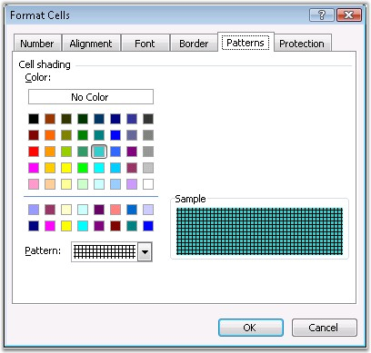
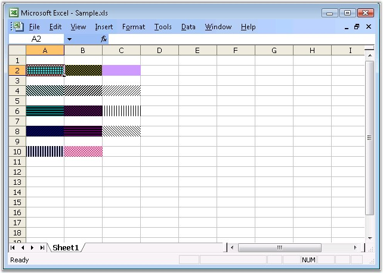

::: {style="DISPLAY: none"}
{#d2h_url_template}{#d2h_package_url style="WIDTH: 0px; DISPLAY: none; HEIGHT: 0px"}
:::

::: {.d2h_secondary_topic style="PADDING-BOTTOM: 10pt; MARGIN: 0pt; PADDING-LEFT: 0pt; PADDING-RIGHT: 0pt; PADDING-TOP: 0pt"}
#### Fill Settings {#fill-settings style="tab-stops: 0pt"}

 

This section illustrates the fill settings available in Excel.

 

**Color**

 

MS Excel provides support to format its cells, rows, and columns with various colors and patterns. This can be done by using the **Fill Color** button and an associated palette.

 

{border="0"}

Figure 42: Format Cells Dialog Box[]{style="FONT-FAMILY: 'Trebuchet MS','sans-serif'; COLOR: #15428b"}

[]{style="FONT-FAMILY: 'Trebuchet MS','sans-serif'; COLOR: #15428b; FONT-SIZE: 9pt"} 

A color is a 4-byte number of the format 00BBGGRR, where RR, GG, and BB values are the Red, Green, and Blue values, each of which is between 0 and 255 (&HFF). If all component values are 0, the RGB color is 0, which is black. If all component values are 255 (&HFF), the RGB color is 16,777, 215 (&H00FFFFF), or white. All other color combinations of values for the red, green, and blue components.

 

Color Pallet

 

Excel supports colors for fonts and background fills through what is called the **Color Pallet**. The Pallet is an array or series of 56 RGB colors. The value of each of those 56 colors may be any of the 16 million available colors, but the Pallet, and thus the number of distinct colors in a workbook, is limited to 56 colors. The RGB values in the Pallet are accessed by the **ColorIndex** property. The ColorIndex is an offset or index in the Pallet, and thus has a value between 1 and 56. In the default, unmodified Pallet, the 3rd element in the Pallet is the RGB value 255 (&HFF), which is red.

 

When you format a cell\'s background to red, for example, you are actually assigning to the **ColorIndex** property of the Interior a value of 3. Excel reads the 3 in the ColorIndex property, and goes to the 3rd element of the Pallet to get the actual RGB color. If you modify the Pallet, say by changing the 3rd element from red (255 = &HFF) to blue (16,711,680 = &HFF0000), all items that were once red are changed to blue. This is because the value of the 3rd element in the Pallet has been changed from red to blue, while the ColorIndex property remains equal to 3.

 

You can change the values in the default pallet by modifying the Colors array of the workbook. You can also get the colors in the palette by using the **Palette** property.

 

Colors in XlsIO

 

XlsIO provides support for adding new colors to the color palette that are not available in the standard MS Excel color palette, by using the **SetPaletteColor** method. If you have modified as workbook\'s Pallet, you can reset the pallet back to the default values, by using the **ResetPalette** method.

 

The following code example illustrates how to set the color palette.

 

+-----------------------------------------------------------------------------------------------------------------------------------------------------------------------------------------------------------------------------------------------------------------------------------------------------------------------------------------------------------------------------------------------+
| **[\[C#\]]{style="FONT-FAMILY: 'Courier New'"}**                                                                                                                                                                                                                                                                                                                                              |
|                                                                                                                                                                                                                                                                                                                                                                                               |
| **[]{style="FONT-FAMILY: 'Courier New'"}**                                                                                                                                                                                                                                                                                                                                                    |
|                                                                                                                                                                                                                                                                                                                                                                                               |
| [// Creating color palette.]{style="FONT-FAMILY: 'Courier New'; COLOR: green"}                                                                                                                                                                                                                                                                                                                |
|                                                                                                                                                                                                                                                                                                                                                                                               |
| [string]{style="FONT-FAMILY: 'Courier New'; COLOR: blue"}[\[\] known = Enum.GetNames( ]{style="FONT-FAMILY: 'Courier New'; COLOR: black"}[typeof]{style="FONT-FAMILY: 'Courier New'; COLOR: blue"}[( KnownColor ) );]{style="FONT-FAMILY: 'Courier New'; COLOR: black"}                                                                                                                       |
|                                                                                                                                                                                                                                                                                                                                                                                               |
| [Color\[\] palette = workbook.Palette;]{style="FONT-FAMILY: 'Courier New'; COLOR: black"}                                                                                                                                                                                                                                                                                                     |
|                                                                                                                                                                                                                                                                                                                                                                                               |
| []{style="FONT-FAMILY: 'Courier New'"}                                                                                                                                                                                                                                                                                                                                                        |
|                                                                                                                                                                                                                                                                                                                                                                                               |
| [for]{style="FONT-FAMILY: 'Courier New'; COLOR: blue"}[( ]{style="FONT-FAMILY: 'Courier New'; COLOR: black"}[int]{style="FONT-FAMILY: 'Courier New'; COLOR: blue"}[ i = ( ]{style="FONT-FAMILY: 'Courier New'; COLOR: black"}[int]{style="FONT-FAMILY: 'Courier New'; COLOR: blue"}[ )ExcelKnownColors.Custom0; i \< palette.Length; i++ )]{style="FONT-FAMILY: 'Courier New'; COLOR: black"} |
|                                                                                                                                                                                                                                                                                                                                                                                               |
| [{]{style="FONT-FAMILY: 'Courier New'; COLOR: black"}                                                                                                                                                                                                                                                                                                                                         |
|                                                                                                                                                                                                                                                                                                                                                                                               |
| [        KnownColor ]{style="FONT-FAMILY: 'Courier New'; COLOR: black"}[value]{style="FONT-FAMILY: 'Courier New'; COLOR: blue"}[ = ( KnownColor )Enum.Parse( ]{style="FONT-FAMILY: 'Courier New'; COLOR: black"}[typeof]{style="FONT-FAMILY: 'Courier New'; COLOR: blue"}[( KnownColor ), known\[i\] );]{style="FONT-FAMILY: 'Courier New'; COLOR: black"}                                    |
|                                                                                                                                                                                                                                                                                                                                                                                               |
| [        workbook.SetPaletteColor( i, Color.FromKnownColor( ]{style="FONT-FAMILY: 'Courier New'; COLOR: black"}[value]{style="FONT-FAMILY: 'Courier New'; COLOR: blue"}[ ) );]{style="FONT-FAMILY: 'Courier New'; COLOR: black"}                                                                                                                                                              |
|                                                                                                                                                                                                                                                                                                                                                                                               |
| [}]{style="FONT-FAMILY: 'Courier New'; COLOR: black"}                                                                                                                                                                                                                                                                                                                                         |
|                                                                                                                                                                                                                                                                                                                                                                                               |
| []{style="FONT-FAMILY: 'Courier New'; COLOR: black"}                                                                                                                                                                                                                                                                                                                                          |
|                                                                                                                                                                                                                                                                                                                                                                                               |
| [palette = workbook.Palette;]{style="FONT-FAMILY: 'Courier New'; COLOR: black"}                                                                                                                                                                                                                                                                                                               |
|                                                                                                                                                                                                                                                                                                                                                                                               |
| [int]{style="FONT-FAMILY: 'Courier New'; COLOR: blue"}[ pos = 0;]{style="FONT-FAMILY: 'Courier New'; COLOR: black"}                                                                                                                                                                                                                                                                           |
|                                                                                                                                                                                                                                                                                                                                                                                               |
| [for]{style="FONT-FAMILY: 'Courier New'; COLOR: blue"}[( ]{style="FONT-FAMILY: 'Courier New'; COLOR: black"}[int]{style="FONT-FAMILY: 'Courier New'; COLOR: blue"}[ j=1; j\<100; j++ )]{style="FONT-FAMILY: 'Courier New'; COLOR: black"}                                                                                                                                                     |
|                                                                                                                                                                                                                                                                                                                                                                                               |
| [{]{style="FONT-FAMILY: 'Courier New'; COLOR: black"}                                                                                                                                                                                                                                                                                                                                         |
|                                                                                                                                                                                                                                                                                                                                                                                               |
| [        ]{style="FONT-FAMILY: 'Courier New'; COLOR: black"}[for]{style="FONT-FAMILY: 'Courier New'; COLOR: blue"}[( ]{style="FONT-FAMILY: 'Courier New'; COLOR: black"}[int]{style="FONT-FAMILY: 'Courier New'; COLOR: blue"}[ i=1; i\<=3; i++ )]{style="FONT-FAMILY: 'Courier New'; COLOR: black"}                                                                                          |
|                                                                                                                                                                                                                                                                                                                                                                                               |
| [       [ {]{style="COLOR: black"}]{style="FONT-FAMILY: 'Courier New'"}                                                                                                                                                                                                                                                                                                                       |
|                                                                                                                                                                                                                                                                                                                                                                                               |
| [                ExcelKnownColors knownEnm = (ExcelKnownColors)pos;]{style="FONT-FAMILY: 'Courier New'; COLOR: black"}                                                                                                                                                                                                                                                                        |
|                                                                                                                                                                                                                                                                                                                                                                                               |
| [                sheet.Range\[ j, i \].CellStyle.ColorIndex = knownEnm;]{style="FONT-FAMILY: 'Courier New'; COLOR: black"}                                                                                                                                                                                                                                                                    |
|                                                                                                                                                                                                                                                                                                                                                                                               |
| [                sheet.Range\[ j, i \].Text = palette\[ pos \].Name + \", \" +]{style="FONT-FAMILY: 'Courier New'; COLOR: black"}                                                                                                                                                                                                                                                             |
|                                                                                                                                                                                                                                                                                                                                                                                               |
| [                        ]{style="FONT-FAMILY: 'Courier New'; COLOR: black"}[string]{style="FONT-FAMILY: 'Courier New'; COLOR: blue"}[.Format( \"R{0}:G{1}:B{2}:A{3}\", palette\[ pos \].R, ]{style="FONT-FAMILY: 'Courier New'; COLOR: black"}                                                                                                                                               |
|                                                                                                                                                                                                                                                                                                                                                                                               |
| [                        ]{style="FONT-FAMILY: 'Courier New'; COLOR: black"}[palette\[ pos \].G, palette\[ pos \].B, palette\[ pos \].A );]{style="FONT-FAMILY: 'Courier New'; COLOR: black"}                                                                                                                                                                                                 |
|                                                                                                                                                                                                                                                                                                                                                                                               |
| [                ]{style="FONT-FAMILY: 'Courier New'; COLOR: black"}[pos++;]{style="FONT-FAMILY: 'Courier New'; COLOR: black"}                                                                                                                                                                                                                                                                |
|                                                                                                                                                                                                                                                                                                                                                                                               |
| []{style="FONT-FAMILY: 'Courier New'; COLOR: black"}                                                                                                                                                                                                                                                                                                                                          |
|                                                                                                                                                                                                                                                                                                                                                                                               |
| [                ]{style="FONT-FAMILY: 'Courier New'; COLOR: black"}[if]{style="FONT-FAMILY: 'Courier New'; COLOR: blue"}[( pos \>= palette.Length ) ]{style="FONT-FAMILY: 'Courier New'; COLOR: black"}[break]{style="FONT-FAMILY: 'Courier New'; COLOR: blue"}[;]{style="FONT-FAMILY: 'Courier New'; COLOR: black"}                                                                         |
|                                                                                                                                                                                                                                                                                                                                                                                               |
| [        }]{style="FONT-FAMILY: 'Courier New'; COLOR: black"}                                                                                                                                                                                                                                                                                                                                 |
|                                                                                                                                                                                                                                                                                                                                                                                               |
| [        ]{style="FONT-FAMILY: 'Courier New'; COLOR: black"}[if]{style="FONT-FAMILY: 'Courier New'; COLOR: blue"}[( pos \>= palette.Length ) ]{style="FONT-FAMILY: 'Courier New'; COLOR: black"}[break]{style="FONT-FAMILY: 'Courier New'; COLOR: blue"}[;]{style="FONT-FAMILY: 'Courier New'; COLOR: black"}                                                                                 |
|                                                                                                                                                                                                                                                                                                                                                                                               |
| [} ]{style="FONT-FAMILY: 'Courier New'; COLOR: black"}                                                                                                                                                                                                                                                                                                                                        |
+-----------------------------------------------------------------------------------------------------------------------------------------------------------------------------------------------------------------------------------------------------------------------------------------------------------------------------------------------------------------------------------------------+

[]{style="FONT-FAMILY: 'Trebuchet MS','sans-serif'; COLOR: #15428b; FONT-SIZE: 9pt"} 

+----------------------------------------------------------------------------------------------------------------------------------------------------------------------------------------------------------------------------------------------------------------------------------------------------------------------------------------------------------------------------------------+
| **[\[VB.NET\]]{style="FONT-FAMILY: 'Courier New'"}**                                                                                                                                                                                                                                                                                                                                   |
|                                                                                                                                                                                                                                                                                                                                                                                        |
| **[]{style="FONT-FAMILY: 'Courier New'"}**                                                                                                                                                                                                                                                                                                                                             |
|                                                                                                                                                                                                                                                                                                                                                                                        |
| [\' Creating color palette.]{style="FONT-FAMILY: 'Courier New'; COLOR: green"}                                                                                                                                                                                                                                                                                                         |
|                                                                                                                                                                                                                                                                                                                                                                                        |
| [Dim]{style="FONT-FAMILY: 'Courier New'; COLOR: blue"}[ known ]{style="FONT-FAMILY: 'Courier New'; COLOR: black"}[As String]{style="FONT-FAMILY: 'Courier New'; COLOR: blue"}[() = System.Enum.GetNames(]{style="FONT-FAMILY: 'Courier New'; COLOR: black"}[GetType]{style="FONT-FAMILY: 'Courier New'; COLOR: blue"}[(KnownColor))]{style="FONT-FAMILY: 'Courier New'; COLOR: black"} |
|                                                                                                                                                                                                                                                                                                                                                                                        |
| [Dim]{style="FONT-FAMILY: 'Courier New'; COLOR: blue"}[ palette ]{style="FONT-FAMILY: 'Courier New'; COLOR: black"}[As]{style="FONT-FAMILY: 'Courier New'; COLOR: blue"}[ Color() = workbook.Palette]{style="FONT-FAMILY: 'Courier New'; COLOR: black"}                                                                                                                                |
|                                                                                                                                                                                                                                                                                                                                                                                        |
| []{style="FONT-FAMILY: 'Courier New'; COLOR: black"}                                                                                                                                                                                                                                                                                                                                   |
|                                                                                                                                                                                                                                                                                                                                                                                        |
| [Dim]{style="FONT-FAMILY: 'Courier New'; COLOR: blue"}[ [i]{style="COLOR: black"} [As Integer]{style="COLOR: blue"}[ = ]{style="COLOR: black"}[CInt]{style="COLOR: blue"}[(ExcelKnownColors.Custom0)]{style="COLOR: black"}]{style="FONT-FAMILY: 'Courier New'"}                                                                                                                       |
|                                                                                                                                                                                                                                                                                                                                                                                        |
| []{style="FONT-FAMILY: 'Courier New'"}                                                                                                                                                                                                                                                                                                                                                 |
|                                                                                                                                                                                                                                                                                                                                                                                        |
| [Do While ]{style="FONT-FAMILY: 'Courier New'; COLOR: blue"}[i \< palette.Length]{style="FONT-FAMILY: 'Courier New'; COLOR: black"}                                                                                                                                                                                                                                                    |
|                                                                                                                                                                                                                                                                                                                                                                                        |
| [        [Dim]{style="COLOR: blue"} [value]{style="COLOR: black"} [As]{style="COLOR: blue"} [KnownColor]{style="COLOR: black"} = [CType]{style="COLOR: blue"}[(System.Enum.Parse(]{style="COLOR: black"}[GetType]{style="COLOR: blue"}[(KnownColor), known(i)), KnownColor)]{style="COLOR: black"}]{style="FONT-FAMILY: 'Courier New'"}                                                |
|                                                                                                                                                                                                                                                                                                                                                                                        |
| [       [ workbook.SetPaletteColor(i, Color.FromKnownColor(value))]{style="COLOR: black"}]{style="FONT-FAMILY: 'Courier New'"}                                                                                                                                                                                                                                                         |
|                                                                                                                                                                                                                                                                                                                                                                                        |
| [        i += 1]{style="FONT-FAMILY: 'Courier New'; COLOR: black"}                                                                                                                                                                                                                                                                                                                     |
|                                                                                                                                                                                                                                                                                                                                                                                        |
| [Loop]{style="FONT-FAMILY: 'Courier New'; COLOR: blue"}                                                                                                                                                                                                                                                                                                                                |
|                                                                                                                                                                                                                                                                                                                                                                                        |
| []{style="FONT-FAMILY: 'Courier New'; COLOR: blue"}                                                                                                                                                                                                                                                                                                                                    |
|                                                                                                                                                                                                                                                                                                                                                                                        |
| [palette = workbook.Palette]{style="FONT-FAMILY: 'Courier New'; COLOR: black"}                                                                                                                                                                                                                                                                                                         |
|                                                                                                                                                                                                                                                                                                                                                                                        |
| [Dim]{style="FONT-FAMILY: 'Courier New'; COLOR: blue"}[ [pos]{style="COLOR: black"} [As Integer]{style="COLOR: blue"} [= 0]{style="COLOR: black"}]{style="FONT-FAMILY: 'Courier New'"}                                                                                                                                                                                                 |
|                                                                                                                                                                                                                                                                                                                                                                                        |
| [For]{style="FONT-FAMILY: 'Courier New'; COLOR: blue"}[ [j]{style="COLOR: black"} [As Integer]{style="COLOR: black"} [= 1]{style="COLOR: black"} [To]{style="COLOR: blue"} [99]{style="COLOR: blue"}]{style="FONT-FAMILY: 'Courier New'"}                                                                                                                                              |
|                                                                                                                                                                                                                                                                                                                                                                                        |
| [    [For]{style="COLOR: blue"} [i = 1]{style="COLOR: blue"} [To]{style="COLOR: blue"} [3]{style="COLOR: black"}]{style="FONT-FAMILY: 'Courier New'"}                                                                                                                                                                                                                                  |
|                                                                                                                                                                                                                                                                                                                                                                                        |
| [       [ ]{style="COLOR: black"}[Dim]{style="COLOR: blue"}[ knownEnm ]{style="COLOR: black"}[As]{style="COLOR: blue"}[ ExcelKnownColors = ]{style="COLOR: black"}[CType]{style="COLOR: blue"}[(pos, ExcelKnownColors)]{style="COLOR: black"}]{style="FONT-FAMILY: 'Courier New'"}                                                                                                     |
|                                                                                                                                                                                                                                                                                                                                                                                        |
| [        sheet.Range(j, i).CellStyle.ColorIndex = knownEnm]{style="FONT-FAMILY: 'Courier New'; COLOR: black"}                                                                                                                                                                                                                                                                          |
|                                                                                                                                                                                                                                                                                                                                                                                        |
| [        sheet.Range(j, i).Text = palette(pos).Name & \", \" & ]{style="FONT-FAMILY: 'Courier New'; COLOR: black"}[String]{style="FONT-FAMILY: 'Courier New'; COLOR: blue"}[.Format(\"R{0}:G{1}:B{2}:A{3}\", palette(pos).R, palette(pos).G, palette(pos).B, palette(pos).A)]{style="FONT-FAMILY: 'Courier New'; COLOR: black"}                                                        |
|                                                                                                                                                                                                                                                                                                                                                                                        |
| [        pos += 1]{style="FONT-FAMILY: 'Courier New'; COLOR: black"}                                                                                                                                                                                                                                                                                                                   |
|                                                                                                                                                                                                                                                                                                                                                                                        |
| []{style="FONT-FAMILY: 'Courier New'"}                                                                                                                                                                                                                                                                                                                                                 |
|                                                                                                                                                                                                                                                                                                                                                                                        |
| [        [If]{style="COLOR: blue"} [pos \>= palette.Length]{style="COLOR: black"} [Then]{style="COLOR: blue"}]{style="FONT-FAMILY: 'Courier New'"}                                                                                                                                                                                                                                     |
|                                                                                                                                                                                                                                                                                                                                                                                        |
| [           [ Exit For]{style="COLOR: blue"}]{style="FONT-FAMILY: 'Courier New'"}                                                                                                                                                                                                                                                                                                      |
|                                                                                                                                                                                                                                                                                                                                                                                        |
| [        End If]{style="FONT-FAMILY: 'Courier New'; COLOR: blue"}                                                                                                                                                                                                                                                                                                                      |
|                                                                                                                                                                                                                                                                                                                                                                                        |
| [    Next]{style="FONT-FAMILY: 'Courier New'; COLOR: blue"}[ [i]{style="COLOR: black"}]{style="FONT-FAMILY: 'Courier New'"}                                                                                                                                                                                                                                                            |
|                                                                                                                                                                                                                                                                                                                                                                                        |
| []{style="FONT-FAMILY: 'Courier New'"}                                                                                                                                                                                                                                                                                                                                                 |
|                                                                                                                                                                                                                                                                                                                                                                                        |
| [    [If]{style="COLOR: blue"}[ pos \>= palette.Length]{style="COLOR: black"} [Then]{style="COLOR: blue"}]{style="FONT-FAMILY: 'Courier New'"}                                                                                                                                                                                                                                         |
|                                                                                                                                                                                                                                                                                                                                                                                        |
| [       [ Exit For]{style="COLOR: blue"}]{style="FONT-FAMILY: 'Courier New'"}                                                                                                                                                                                                                                                                                                          |
|                                                                                                                                                                                                                                                                                                                                                                                        |
| [    End If]{style="FONT-FAMILY: 'Courier New'; COLOR: blue"}                                                                                                                                                                                                                                                                                                                          |
|                                                                                                                                                                                                                                                                                                                                                                                        |
| [Next]{style="FONT-FAMILY: 'Courier New'; COLOR: blue"}[ [j]{style="COLOR: blue"} ]{style="FONT-FAMILY: 'Courier New'"}                                                                                                                                                                                                                                                                |
+----------------------------------------------------------------------------------------------------------------------------------------------------------------------------------------------------------------------------------------------------------------------------------------------------------------------------------------------------------------------------------------+

**[]{style="FONT-FAMILY: 'Trebuchet MS','sans-serif'; COLOR: #15428b; FONT-SIZE: 9pt"}** 

XlsIO also enables to get or set the closest RGB color in the pallet by using the **SetColorOrGetNearest** method. It returns the ColorIndex value of the color in the Pallet, that is closest to a given RGBLong color value. The method used here considers every RGB color to be a spatial location in a 3-dimensional space, where the axes are Red, Green, and Blue components of an RGB Long value. \"Closest\" is taken in the geometrical sense, the distance between two colors in a 3-dimensional space with axes of Red, Green, and Blue values, that is, a color is identified spatially by the values of the Red, Green, and Blue components. The distances between the spatial location of RGBLong and each Color of the pallet is computed and the ColorIndex that minimizes this distance is returned. The distance between RGBLong and each Color(ColorIndex) value is computed by the simple Pythagorean distance (without Square root):

 

**Dist = ( (R1-R2)\^2  + (G1-G2)\^2 + (B1-B2)\^2 )**

 

where R1, G1, and B1 are the components of RGBLong and R2, G2, and B2 are the components of each Color(ColorIndex) value.

 

**Pattern**

 

Excel provides various pattern styles for highlighting cells. These can be applied through the **Pattern** tab in the **Format Cells** dialog box.

 

XlsIO includes APIs to specify the above **background** pattern for a cell. The following code example illustrates this.

 

+--------------------------------------------------------------------------------------------------------------------------------------+
| **[\[C#\]]{style="FONT-FAMILY: 'Courier New'"}**                                                                                     |
|                                                                                                                                      |
| []{style="FONT-FAMILY: 'Courier New'; COLOR: green"}                                                                                 |
|                                                                                                                                      |
| [// Setting the Pattern Types.]{style="FONT-FAMILY: 'Courier New'; COLOR: green"}                                                    |
|                                                                                                                                      |
| [sheet.Range\[\"A2\"\].CellStyle.FillPattern = ExcelPattern.Angle;]{style="FONT-FAMILY: 'Courier New'; COLOR: black"}                |
|                                                                                                                                      |
| [sheet.Range\[\"A4\"\].CellStyle.FillPattern = ExcelPattern.DarkDownwardDiagonal;]{style="FONT-FAMILY: 'Courier New'; COLOR: black"} |
|                                                                                                                                      |
| []{style="FONT-FAMILY: 'Courier New'; COLOR: black"}                                                                                 |
|                                                                                                                                      |
| [// Setting the Pattern Color.]{style="FONT-FAMILY: 'Courier New'; COLOR: green"}                                                    |
|                                                                                                                                      |
| [sheet.Range\[\"A2\"\].CellStyle.FillBackground = ExcelKnownColors.Aqua;]{style="FONT-FAMILY: 'Courier New'; COLOR: black"}          |
|                                                                                                                                      |
| [sheet.Range\[\"A4\"\].CellStyle.FillBackground = ExcelKnownColors.Pale_blue;]{style="FONT-FAMILY: 'Courier New'; COLOR: black"}     |
+--------------------------------------------------------------------------------------------------------------------------------------+

[]{style="FONT-FAMILY: 'Trebuchet MS','sans-serif'; COLOR: #15428b; FONT-SIZE: 9pt"} 

+-----------------------------------------------------------------------------------------------------------------------------------+
| **[\[VB.NET\]]{style="FONT-FAMILY: 'Courier New'"}**                                                                              |
|                                                                                                                                   |
| **[]{style="FONT-FAMILY: 'Courier New'"}**                                                                                        |
|                                                                                                                                   |
| [\' Setting the Pattern Types.]{style="FONT-FAMILY: 'Courier New'; COLOR: green"}                                                 |
|                                                                                                                                   |
| [sheet.Range(\"A2\").CellStyle.FillPattern = ExcelPattern.Angle]{style="FONT-FAMILY: 'Courier New'; COLOR: black"}                |
|                                                                                                                                   |
| [sheet.Range(\"A4\").CellStyle.FillPattern = ExcelPattern.DarkDownwardDiagonal]{style="FONT-FAMILY: 'Courier New'; COLOR: black"} |
|                                                                                                                                   |
| []{style="FONT-FAMILY: 'Courier New'; COLOR: black"}                                                                              |
|                                                                                                                                   |
| [\' Setting the Pattern Color.]{style="FONT-FAMILY: 'Courier New'; COLOR: green"}                                                 |
|                                                                                                                                   |
| [sheet.Range(\"A2\").CellStyle.FillBackground = ExcelKnownColors.Aqua]{style="FONT-FAMILY: 'Courier New'; COLOR: black"}          |
|                                                                                                                                   |
| [sheet.Range(\"A4\").CellStyle.FillBackground = ExcelKnownColors.Pale_blue]{style="FONT-FAMILY: 'Courier New'; COLOR: black"}     |
+-----------------------------------------------------------------------------------------------------------------------------------+

[]{style="FONT-FAMILY: 'Trebuchet MS','sans-serif'; COLOR: #15428b; FONT-SIZE: 9pt"} 

{border="0"}

Figure 43: Excel with Different Fill Patterns[]{style="FONT-FAMILY: 'Trebuchet MS','sans-serif'; COLOR: #15428b"}

[]{style="FONT-FAMILY: 'Trebuchet MS','sans-serif'; COLOR: #15428b; FONT-SIZE: 9pt"} 

 

[]{#related-topics}
:::
