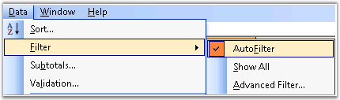
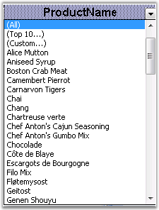

::: {style="DISPLAY: none"}
{#d2h_url_template}{#d2h_package_url style="WIDTH: 0px; DISPLAY: none; HEIGHT: 0px"}
:::

::::: {#nsbanner .d2h_main_nsbanner style="BORDER-BOTTOM: #999999 1px solid; POSITION: relative; PADDING-BOTTOM: 0px; BACKGROUND-COLOR: transparent; PADDING-LEFT: 0px; PADDING-RIGHT: 0px; DISPLAY: none; BORDER-TOP: #999999 1px solid; PADDING-TOP: 0px; LEFT: 0px"}
:::: {#TitleRow .d2h_main_titlerow style="PADDING-BOTTOM: 4px; BACKGROUND-COLOR: transparent; PADDING-LEFT: 22px; WIDTH: 100%; PADDING-RIGHT: 10px; DISPLAY: none; PADDING-TOP: 4px"}
::: {#ienav .d2h_main_ienav style="DISPLAY: none"}
{#D2HPrevious .D2HPreviousEnabled}  {#D2HNext .D2HNextEnabled}
:::
::::
:::::

:::: {#nstext .d2h_main_nstext style="PADDING-BOTTOM: 10px; BACKGROUND-COLOR: transparent; PADDING-LEFT: 22px; PADDING-RIGHT: 10px; HEIGHT: 100%; OVERFLOW: auto; PADDING-TOP: 5px" hasuserbackground="true" valign="bottom"}
::: {#d2h_breadcrumbs .d2h_breadcrumbs}
[Essential Studio User Guide Documentation](ms-xhelp:///?Id=12457748-09e3-4d74-a240-8e049cedf030){.d2h_breadcrumbsNormal}[ \> ]{.d2h_breadcrumbsLinkSeparator}[Reporting Edition](ms-xhelp:///?Id=027aa5b6-6676-4f93-ad23-c20e8c45792e){.d2h_breadcrumbsNormal}[ \> ]{.d2h_breadcrumbsLinkSeparator}[Essential XlsIO](ms-xhelp:///?Id=b01a1b50-1d7d-40c0-bc83-af67e57c9005){.d2h_breadcrumbsNormal}[ \> ]{.d2h_breadcrumbsLinkSeparator}[Concepts and Features](ms-xhelp:///?Id=21b26556-5905-4ad9-90b4-40320db25faf){.d2h_breadcrumbsNormal}[ \> ]{.d2h_breadcrumbsLinkSeparator}[Data](ms-xhelp:///?Id=09eb021a-c01a-47a5-bf60-fb7c3ed89c78){.d2h_breadcrumbsNormal}
:::

### Filter {#filter style="tab-stops: 0pt"}

[]{#p108} 

MS Excel **AutoFilter** feature literally makes filtering out unwanted data in a data list, as easy as clicking a button. When the cell pointer is located within any cell in your data list, open the **Data** menu, point to **Filter**, and select **AutoFilter**. Once this is done, the program adds drop-down buttons to each of the field names in the top row of the list. This feature is specifically used in large spreadsheets, when the user wants to look for particular data, based on some criteria.

[]{style="FONT-FAMILY: 'Trebuchet MS','sans-serif'; COLOR: #15428b; FONT-SIZE: 9pt"} 

[]{style="FONT-FAMILY: 'Trebuchet MS','sans-serif'; COLOR: #15428b; FONT-SIZE: 9pt"} 

{border="0"}

Figure 128: AutoFilter from Data Menu[]{style="FONT-FAMILY: 'Trebuchet MS','sans-serif'; COLOR: #15428b"}

 

**AutoFilters in Essential XlsIO**

 

Essential XlsIO also comes with APIs for reading and writing AutoFilters in a worksheet. You can specify the range of data that needs to be viewed through the **FilterRange** property. Following code example illustrates writing AutoFilters.

 

+-----------------------------------------------------------------------------------------------------------------------------------------+
| **[\[C#\]]{style="FONT-FAMILY: 'Courier New'"}**                                                                                        |
|                                                                                                                                         |
| **[]{style="FONT-FAMILY: 'Courier New'"}**                                                                                              |
|                                                                                                                                         |
| [// Creating an AutoFilter in the first worksheet. Specifying the AutoFilter range. ]{style="FONT-FAMILY: 'Courier New'; COLOR: green"} |
|                                                                                                                                         |
| [sheet.AutoFilters.FilterRange = sheet.Range\[\"A1:B7\"\]; ]{style="FONT-FAMILY: 'Courier New'; COLOR: black"}                          |
+-----------------------------------------------------------------------------------------------------------------------------------------+

[]{style="FONT-FAMILY: 'Trebuchet MS','sans-serif'; COLOR: #15428b; FONT-SIZE: 9pt"} 

+-----------------------------------------------------------------------------------------------------------------------------------------+
| **[\[VB.NET\]]{style="FONT-FAMILY: 'Courier New'"}**                                                                                    |
|                                                                                                                                         |
| **[]{style="FONT-FAMILY: 'Courier New'"}**                                                                                              |
|                                                                                                                                         |
| [\' Creating an AutoFilter in the first worksheet. Specifying the AutoFilter range. ]{style="FONT-FAMILY: 'Courier New'; COLOR: green"} |
|                                                                                                                                         |
| [sheet.AutoFilters.FilterRange = sheet.Range(\"A1:B7\") ]{style="FONT-FAMILY: 'Courier New'; COLOR: black"}                             |
+-----------------------------------------------------------------------------------------------------------------------------------------+

 

XlsIO also provides options to set the built-in conditions for filters by using various properties of **IAutoFilter**. Following code example illustrates various conditions based on which data can be filtered.

 

+-------------------------------------------------------------------------------------------------------------------------------------------+
| **[\[C#\]]{style="FONT-FAMILY: 'Courier New'"}**                                                                                          |
|                                                                                                                                           |
| **[]{style="FONT-FAMILY: 'Courier New'"}**                                                                                                |
|                                                                                                                                           |
| [IAutoFilter]{style="FONT-FAMILY: 'Courier New'; COLOR: #2b91af"}[ filter = sheet1.AutoFilters\[0\];]{style="FONT-FAMILY: 'Courier New'"} |
|                                                                                                                                           |
| [filter.IsTop = [true]{style="COLOR: blue"};]{style="FONT-FAMILY: 'Courier New'"}                                                         |
|                                                                                                                                           |
| [filter.IsTop10 = [true]{style="COLOR: blue"};]{style="FONT-FAMILY: 'Courier New'"}                                                       |
|                                                                                                                                           |
| [filter.Top10Number = 5;]{style="FONT-FAMILY: 'Courier New'"}                                                                             |
+-------------------------------------------------------------------------------------------------------------------------------------------+

[]{style="FONT-FAMILY: 'Trebuchet MS','sans-serif'; COLOR: #15428b; FONT-SIZE: 9pt"} 

+-------------------------------------------------------------------------------------------------------------------------------------------------------------------+
| **[\[VB.NET\]]{style="FONT-FAMILY: 'Courier New'"}**                                                                                                              |
|                                                                                                                                                                   |
| **[]{style="FONT-FAMILY: 'Courier New'"}**                                                                                                                        |
|                                                                                                                                                                   |
| [Dim]{style="FONT-FAMILY: 'Courier New'; COLOR: blue"}[ filter [As]{style="COLOR: blue"} IAutoFilter = sheet1.AutoFilters(0)]{style="FONT-FAMILY: 'Courier New'"} |
|                                                                                                                                                                   |
| [filter.IsTop = [True]{style="COLOR: blue"}]{style="FONT-FAMILY: 'Courier New'"}                                                                                  |
|                                                                                                                                                                   |
| [filter.IsTop10 = [True]{style="COLOR: blue"}]{style="FONT-FAMILY: 'Courier New'"}                                                                                |
|                                                                                                                                                                   |
| [filter.Top10Number = 5]{style="FONT-FAMILY: 'Courier New'"}                                                                                                      |
+-------------------------------------------------------------------------------------------------------------------------------------------------------------------+

[]{style="FONT-FAMILY: 'Trebuchet MS','sans-serif'; COLOR: #15428b; FONT-SIZE: 9pt"} 

[]{style="FONT-FAMILY: 'Trebuchet MS','sans-serif'; COLOR: #15428b; FONT-SIZE: 9pt"} 

{border="0"}

Figure 129: Writing Autofilters with XlsIO**[]{style="FONT-FAMILY: 'Trebuchet MS','sans-serif'; COLOR: #15428b"}**

See Also

[]{style="FONT-SIZE: 9pt"} 

[[Data Validation]{.UGHyperlink}](ms-xhelp:///?Id=79a8ea83-f02e-466c-93a2-9733dac5cea0)[, ]{style="FONT-FAMILY: 'Trebuchet MS','sans-serif'; COLOR: #15428b; FONT-SIZE: 9pt"}[[Importing and Exporting]{.UGHyperlink}](ms-xhelp:///?Id=ecd2a59e-b9fb-4418-b3d0-91c801cb0807)[, ]{style="FONT-FAMILY: 'Trebuchet MS','sans-serif'; COLOR: #15428b; FONT-SIZE: 9pt"}[[Template Markers]{.UGHyperlink}](ms-xhelp:///?Id=b3c1fed0-82cd-40a6-934e-99766bcef5b9)[, ]{style="FONT-FAMILY: 'Trebuchet MS','sans-serif'; COLOR: #15428b; FONT-SIZE: 9pt"}[[Grouping and Ungrouping]{.UGHyperlink}](ms-xhelp:///?Id=48ff5e92-b207-4c14-8803-7eccc41aad22)

 

[]{#related-topics}
::::
