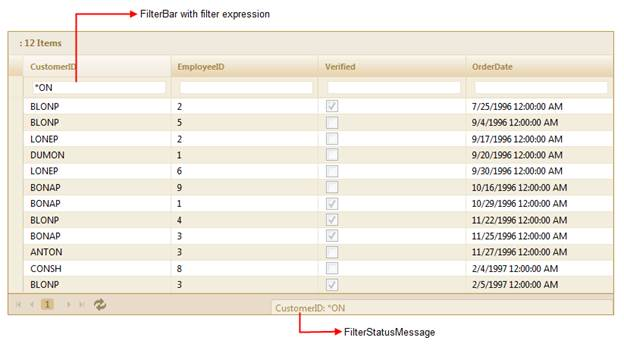
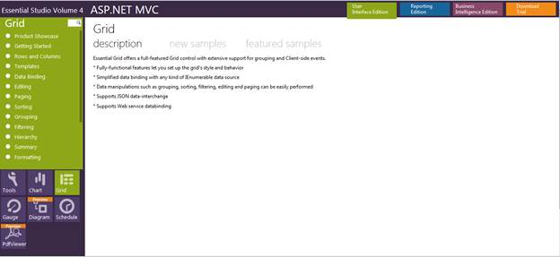

::: {style="DISPLAY: none"}
{#d2h_url_template}{#d2h_package_url style="WIDTH: 0px; DISPLAY: none; HEIGHT: 0px"}
:::

::::: {#nsbanner .d2h_main_nsbanner style="BORDER-BOTTOM: #999999 1px solid; POSITION: relative; PADDING-BOTTOM: 0px; BACKGROUND-COLOR: transparent; PADDING-LEFT: 0px; PADDING-RIGHT: 0px; DISPLAY: none; BORDER-TOP: #999999 1px solid; PADDING-TOP: 0px; LEFT: 0px"}
:::: {#TitleRow .d2h_main_titlerow style="PADDING-BOTTOM: 4px; BACKGROUND-COLOR: transparent; PADDING-LEFT: 22px; WIDTH: 100%; PADDING-RIGHT: 10px; DISPLAY: none; PADDING-TOP: 4px"}
::: {#ienav .d2h_main_ienav style="DISPLAY: none"}
{#D2HPrevious .D2HPreviousEnabled}  {#D2HNext .D2HNextEnabled}
:::
::::
:::::

:::: {#nstext .d2h_main_nstext style="PADDING-BOTTOM: 10px; BACKGROUND-COLOR: transparent; PADDING-LEFT: 22px; PADDING-RIGHT: 10px; HEIGHT: 100%; OVERFLOW: auto; PADDING-TOP: 5px" hasuserbackground="true" valign="bottom"}
::: {#d2h_breadcrumbs .d2h_breadcrumbs}
[Essential Studio User Guide Documentation](ms-xhelp:///?Id=12457748-09e3-4d74-a240-8e049cedf030){.d2h_breadcrumbsNormal}[ \> ]{.d2h_breadcrumbsLinkSeparator}[User Interface Edition](ms-xhelp:///?Id=c29296b7-531c-413b-a0ec-488ca1f7f669){.d2h_breadcrumbsNormal}[ \> ]{.d2h_breadcrumbsLinkSeparator}[Essential ASP.NET MVC](ms-xhelp:///?Id=4b14e7d1-65c4-4f67-b1aa-2c37709905a5){.d2h_breadcrumbsNormal}[ \> ]{.d2h_breadcrumbsLinkSeparator}[Essential Grid]{.d2h_breadcrumbsContentsOnly}[ \> ]{.d2h_breadcrumbsLinkSeparator}[Getting Started](ms-xhelp:///?Id=c7ed3902-b25b-4170-be58-1d3d0b57748a){.d2h_breadcrumbsNormal}[ \> ]{.d2h_breadcrumbsLinkSeparator}[Feature Summary](ms-xhelp:///?Id=1923e679-441a-44e0-9bca-e0e50988a857){.d2h_breadcrumbsNormal}[ \> ]{.d2h_breadcrumbsLinkSeparator}[Concepts and Features](ms-xhelp:///?Id=4a1657fa-4756-42b9-9153-aebf5dcfc503){.d2h_breadcrumbsNormal}[ \> ]{.d2h_breadcrumbsLinkSeparator}[Filtering](ms-xhelp:///?Id=862b3467-b809-4da6-a610-4dc9cd6142eb){.d2h_breadcrumbsNormal}
:::

### Filter Bar {#filter-bar style="tab-stops: 0pt"}

 

The filter bar feature allows the grid to filter records with different expressions depending upon the column type. The filter bar will be displayed at the top of the grid below the header row.

The filter bar allows you to filter expressions and get the data you want to filter by manually entering data, unlike the default filter. This allows you to filter the values you want, with ease.

 

The following figure gives you a basic idea of the appearance of the filter bar in the MVC grid:

{border="0"}

Figure 125: Grid with Filter Bar and Filter Status Message Bar

 

Use Case Scenario[]{style="FONT-FAMILY: 'Cambria','serif'; FONT-SIZE: 11pt"}

The user can filter data quickly by entering the filter expressions manually in the filter bar.

This feature is very user friendly to advanced users, as the following filter options are available with this feature:

[·      ]{style="FONT-FAMILY: Symbol"}\"\<\", \"\>\", \"\>=\", \"\>=\", \"=\" for integer, double, decimal, date-time data columns

[·      ]{style="FONT-FAMILY: Symbol"}\"\*value\" (contains value), \"%value\" (ends with value),\"value%\" (begins with value) for string data columns

[·      ]{style="FONT-FAMILY: Symbol"}\"1\"(true), \"0\"(false) for Boolean data columns

[·      ]{style="FONT-FAMILY: Symbol"}\"Expression1 and Expression2\", \"Expression1 or Expression2\" for all data columns

 

 

Sample Link

To view the samples:

1.   Open the **Syncfusion** **Dashboard**. The **Essential Studio Enterprise Edition** window is displayed. The User Interface Edition panel is displayed by default.

2.   Click the **Run Locally Installed Samples** link. The Essential Studio MVC Edition sample browser is displayed.

3.   Select **Grid**.[]{style="FONT-SIZE: 9pt"}

4.   Select **FilterBar** samples from the **Filtering** tab provided and browse through the features.[]{style="FONT-SIZE: 9pt"}

[]{style="FONT-SIZE: 9pt"} 

{border="0"}[]{style="FONT-SIZE: 11pt"}

Figure 126: MVC Grid Sample Browser

More:

[ ]{#related-topics}

[{border="0" align="absMiddle"}Properties](ms-xhelp:///?Id=b390c156-c8b7-487f-870d-73981160eeba){style="TEXT-DECORATION: none"}

[{border="0" align="absMiddle"}Filter Tokens](ms-xhelp:///?Id=56e7fa6d-ed0f-4a83-9309-039fd73fd1c8){style="TEXT-DECORATION: none"}

[{border="0" align="absMiddle"}Adding the Filter Bar to an MVC Grid](ms-xhelp:///?Id=23253a5f-2b0a-4732-96de-82c44974b02c){style="TEXT-DECORATION: none"}

[{border="0" align="absMiddle"}How to Filter Data Using Filter Tokens in the Filter Bar](ms-xhelp:///?Id=8e0ddfa1-5e1e-41ac-b067-ebe99334c71b){style="TEXT-DECORATION: none"}
::::
