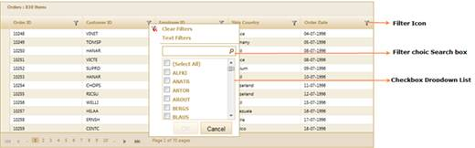
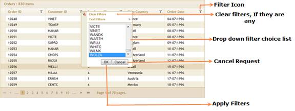
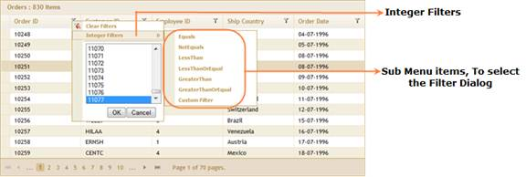
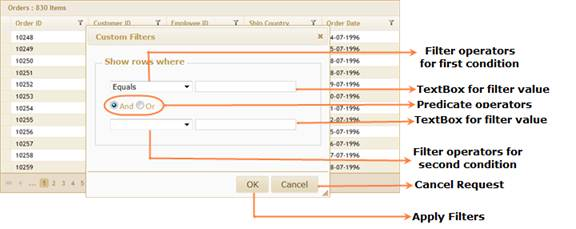

::: {style="DISPLAY: none"}
{#d2h_url_template}{#d2h_package_url style="WIDTH: 0px; DISPLAY: none; HEIGHT: 0px"}
:::

::::: {#nsbanner .d2h_main_nsbanner style="BORDER-BOTTOM: #999999 1px solid; POSITION: relative; PADDING-BOTTOM: 0px; BACKGROUND-COLOR: transparent; PADDING-LEFT: 0px; PADDING-RIGHT: 0px; DISPLAY: none; BORDER-TOP: #999999 1px solid; PADDING-TOP: 0px; LEFT: 0px"}
:::: {#TitleRow .d2h_main_titlerow style="PADDING-BOTTOM: 4px; BACKGROUND-COLOR: transparent; PADDING-LEFT: 22px; WIDTH: 100%; PADDING-RIGHT: 10px; DISPLAY: none; PADDING-TOP: 4px"}
::: {#ienav .d2h_main_ienav style="DISPLAY: none"}
{#D2HPrevious .D2HPreviousEnabled}  {#D2HNext .D2HNextEnabled}
:::
::::
:::::

:::::: {#nstext .d2h_main_nstext style="PADDING-BOTTOM: 10px; BACKGROUND-COLOR: transparent; PADDING-LEFT: 22px; PADDING-RIGHT: 10px; HEIGHT: 100%; OVERFLOW: auto; PADDING-TOP: 5px" hasuserbackground="true" valign="bottom"}
::: {#d2h_breadcrumbs .d2h_breadcrumbs}
[Essential Studio User Guide Documentation](ms-xhelp:///?Id=12457748-09e3-4d74-a240-8e049cedf030){.d2h_breadcrumbsNormal}[ \> ]{.d2h_breadcrumbsLinkSeparator}[User Interface Edition](ms-xhelp:///?Id=c29296b7-531c-413b-a0ec-488ca1f7f669){.d2h_breadcrumbsNormal}[ \> ]{.d2h_breadcrumbsLinkSeparator}[Essential ASP.NET MVC](ms-xhelp:///?Id=4b14e7d1-65c4-4f67-b1aa-2c37709905a5){.d2h_breadcrumbsNormal}[ \> ]{.d2h_breadcrumbsLinkSeparator}[Essential Grid]{.d2h_breadcrumbsContentsOnly}[ \> ]{.d2h_breadcrumbsLinkSeparator}[Getting Started](ms-xhelp:///?Id=c7ed3902-b25b-4170-be58-1d3d0b57748a){.d2h_breadcrumbsNormal}[ \> ]{.d2h_breadcrumbsLinkSeparator}[Feature Summary](ms-xhelp:///?Id=1923e679-441a-44e0-9bca-e0e50988a857){.d2h_breadcrumbsNormal}[ \> ]{.d2h_breadcrumbsLinkSeparator}[Concepts and Features](ms-xhelp:///?Id=4a1657fa-4756-42b9-9153-aebf5dcfc503){.d2h_breadcrumbsNormal}
:::

## Filtering {#filtering style="tab-stops: 0pt"}

 

Essential Grid allows you to restrict the display of records using a mechanism called filters. A filter facilitates the extraction of a subset of records that meet certain criteria. Filters can be applied to one or more columns. This is very useful when dealing with large data sets. Essential Grid provides both advanced filter and check box drop-down filter options by default.

When this feature is enabled, every column header displays a filter icon. Clicking this icon opens a menu with a subset of check boxes in a drop-down list and submenu items for advanced filtering.

 

Use Case Scenarios

This is very useful when dealing with large data sets. Users can apply filter values with multiple choices. Using the **Search** box, users can find filter values easily.

 

Check Box Drop-Down List

Clicking on a filter icon opens a menu with a subset of check boxes in a drop-down list that holds the possible filter values for the column clicked. To filter the data using a specific value, just select the check box in the list that prefixes the desired filter value and click **OK** to apply the filters you have selected. This will then reload the grid with only those records that have the selected value in the column. The filter drop-down also provides a ***Select All*** option either to select or deselect all the values at once.

 

{border="0"}

Figure 117: Excel-Like Filters

 

Drop-Down Filters:

Clicking on a filter icon opens a menu with a subset of drop-down list items that holds the possible filter values for the column clicked. To filter the data by a specific value, just select the list box item that prefixes the desired filter value and click the **OK** button to apply filters. This will then reload the grid with only those records that have the selected value in the column.

 

 

{border="0"}

Figure 118: Grid with Drop-Down Filter Features

 

Advanced Filters:

Clicking on a filter icon opens a menu and submenu items. Submenu items in the filter menu provide the advanced filtering options for end users. When selecting a sub menu item, a separate dialog box opens and displays an advanced filter drop-down that lists the available filter operators for the respective filtering column. Selecting a submenu item also provides text boxes that allow you to type a filter string. It performs the filter operation by clicking the **OK** button.

 

{border="0"}

Figure 119: Integer Filters

 

{border="0"}

Figure 120: Custom Filter Options

 

This advanced filter option comes in three forms.

[·      ]{style="FONT-FAMILY: Symbol"}Grid text filters---Can be used with any column type.

[·      ]{style="FONT-FAMILY: Symbol"}Grid integer filters---Can be used with any numeric column type.

[·      ]{style="FONT-FAMILY: Symbol"}Grid date-time filters---Can be used with any date-time column type.

 

Properties

 

::: {align="center"}
+--------------------+----------------------------------------------------------------------------------------------+--------------------------+-------------------------------+--------------------------------------------------+
| Property           | Description                                                                                  | Type of property         | Value it accepts              | Any other dependencies/associated sub-properties |
+--------------------+----------------------------------------------------------------------------------------------+--------------------------+-------------------------------+--------------------------------------------------+
| AllowFiltering     | Enables the grouping feature.                                                                | boolean                  | True/False                    | NA                                               |
|                    |                                                                                              |                          |                               |                                                  |
|                    | Default value is False.                                                                      |                          |                               |                                                  |
+--------------------+----------------------------------------------------------------------------------------------+--------------------------+-------------------------------+--------------------------------------------------+
| FilterDescriptors  | Collection that is used to add and apply filter conditions programmatically at initial load. | List\<FilterDescriptor\> |                               | Dependent on AllowFiltering.                     |
|                    |                                                                                              |                          |                               |                                                  |
|                    |                                                                                              |                          |                               |                                                  |
+--------------------+----------------------------------------------------------------------------------------------+--------------------------+-------------------------------+--------------------------------------------------+
| ColumnName         | Gets or sets the column name for filter descriptor.                                          | String                   |                               | NA                                               |
+--------------------+----------------------------------------------------------------------------------------------+--------------------------+-------------------------------+--------------------------------------------------+
| Operator           | Gets or sets the operator for a filter descriptor.                                           | Enum                     | GridDataConditionType         |                                                  |
|                    |                                                                                              |                          |                               |                                                  |
|                    |                                                                                              |                          |  .LessThan                    |                                                  |
|                    |                                                                                              |                          |                               |                                                  |
|                    |                                                                                              |                          | GridDataConditionType         |                                                  |
|                    |                                                                                              |                          |                               |                                                  |
|                    |                                                                                              |                          |  .LessThanOrEqual             |                                                  |
|                    |                                                                                              |                          |                               |                                                  |
|                    |                                                                                              |                          | GridDataConditionType         |                                                  |
|                    |                                                                                              |                          |                               |                                                  |
|                    |                                                                                              |                          |  .Equals                      |                                                  |
|                    |                                                                                              |                          |                               |                                                  |
|                    |                                                                                              |                          | GridDataConditionType         |                                                  |
|                    |                                                                                              |                          |                               |                                                  |
|                    |                                                                                              |                          |  .NotEquals                   |                                                  |
|                    |                                                                                              |                          |                               |                                                  |
|                    |                                                                                              |                          | GridDataConditionType         |                                                  |
|                    |                                                                                              |                          |                               |                                                  |
|                    |                                                                                              |                          |  .GreaterThanOrEqual          |                                                  |
|                    |                                                                                              |                          |                               |                                                  |
|                    |                                                                                              |                          | GridDataConditionType         |                                                  |
|                    |                                                                                              |                          |                               |                                                  |
|                    |                                                                                              |                          |  .GreaterThan                 |                                                  |
|                    |                                                                                              |                          |                               |                                                  |
|                    |                                                                                              |                          | GridDataConditionType         |                                                  |
|                    |                                                                                              |                          |                               |                                                  |
|                    |                                                                                              |                          |  .StartsWith                  |                                                  |
|                    |                                                                                              |                          |                               |                                                  |
|                    |                                                                                              |                          | GridDataConditionType         |                                                  |
|                    |                                                                                              |                          |                               |                                                  |
|                    |                                                                                              |                          |  .EndsWith                    |                                                  |
|                    |                                                                                              |                          |                               |                                                  |
|                    |                                                                                              |                          | GridDataConditionType         |                                                  |
|                    |                                                                                              |                          |                               |                                                  |
|                    |                                                                                              |                          |  .Contains                    |                                                  |
+--------------------+----------------------------------------------------------------------------------------------+--------------------------+-------------------------------+--------------------------------------------------+
| Value              | Gets or sets the value for a filter descriptor.                                              | Object                   |                               | NA                                               |
+--------------------+----------------------------------------------------------------------------------------------+--------------------------+-------------------------------+--------------------------------------------------+
| Predicate          | Specifies the predicate type.                                                                | Enum                     | And                           | NA                                               |
|                    |                                                                                              |                          |                               |                                                  |
|                    |                                                                                              |                          | Or                            |                                                  |
+====================+==============================================================================================+==========================+===============================+==================================================+
| IsCaseSensitive    | Gets or sets the value indicating whether a filter descriptor is case sensitive.             | Bool                     | True/False                    | NA                                               |
+--------------------+----------------------------------------------------------------------------------------------+--------------------------+-------------------------------+--------------------------------------------------+
| FilterDropDownType | It is used to configure the filter drop-down type.                                           | Enum                     | FilterDropDownType.SimpleList | NA                                               |
|                    |                                                                                              |                          |                               |                                                  |
|                    |                                                                                              |                          | FilterDropDownType.CheckList  |                                                  |
+--------------------+----------------------------------------------------------------------------------------------+--------------------------+-------------------------------+--------------------------------------------------+
:::

 

Methods

 

::: {align="center"}
  Method                        Parameters                                      Return type                        Descriptions                                                                        Refernce links
  ----------------------------- ----------------------------------------------- ---------------------------------- ----------------------------------------------------------------------------------- -------------------
  EnableFiltering()             No parameter                                    IGridBuilder\<T\>                  Used to enable the filtering feature in Grid control                                 
  AllowFilter(bool)             bool                                            IGridColumnBuilder\<T\>            Used to enable/disable the filter options for individual columns.                    
  []{#_Editing}AllowFiltering   (bool enable)                                   GridFiltersBuilder\<T\>            Used to enable or disable the filtering feature                                     NA
  Filtering                     (Action\<GridFilterBuilder\<T\> filters)        IGridBuilder\<T\>                  Used to configure the Filtering feature.                                            NA
  FilterDescriptors             (Action\<GridFiltersBuilder\<T\> descriptors)   GridFilterBuilder\<T\>             Used to add the initial filter descriptors to grid.                                 Filtering
  Add                           Expression\<Func\<T,Tproperty\>\> expression    GridFilterDescriptorBuilder\<T\>   Used to add the filter column name in the filter descriptor instance.               FilterDescriptors
  FilterBy                      (FilterType type)                               GridFilterDescriptorBuilder\<T\>   Used to configure the current filter descriptor's filter type.                      FilterDescriptors
  Filtervalue                   (object value)                                  GridFilterDescriptorBuilder\<T\>   Used to set the current filter descriptor's filter value.                           FilterDescriptors
  Predicate                     (PredicateType predicate)                       GridFilterDescriptorBuilder\<T\>   Used to set the current filter descriptor's predicate type.                         FilterDescriptors
  MatchCase                     (bool enable)                                   GridFilterDescriptorBuilder\<T\>   Used to enable/disable the case- sensitive option to the current filter instance.   FilterDescriptors
:::

 

Sample Link

To view the samples:

1.   Open the **ASP.NET MVC** sample browser from the dashboard (Refer to the [[Samples and Location]{style="COLOR: blue"}]{.underline} chapter).

2.   Navigate to **Grid**\>**Filtering** to browse the filtering demos.

 

 

More:

[ ]{#related-topics}

[{border="0" align="absMiddle"}Server Mode](ms-xhelp:///?Id=650825c2-4329-49d4-a118-c7fa97679190){style="TEXT-DECORATION: none"}

[{border="0" align="absMiddle"}JSON Mode](ms-xhelp:///?Id=10ceecf2-e404-4542-8a33-455d509a4eca){style="TEXT-DECORATION: none"}

[{border="0" align="absMiddle"}Filter Bar](ms-xhelp:///?Id=da32e6b8-7c5c-42f5-981f-2700a313aa6d){style="TEXT-DECORATION: none"}

[{border="0" align="absMiddle"}Searching](ms-xhelp:///?Id=7fbf8929-8df2-4ff0-838e-1ccb34c21bbc){style="TEXT-DECORATION: none"}
::::::
