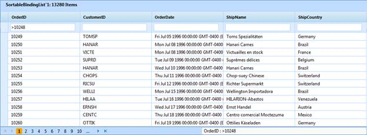

::: {style="DISPLAY: none"}
{#d2h_url_template}{#d2h_package_url style="WIDTH: 0px; DISPLAY: none; HEIGHT: 0px"}
:::

::: {.d2h_secondary_topic style="PADDING-BOTTOM: 10pt; MARGIN: 0pt; PADDING-LEFT: 0pt; PADDING-RIGHT: 0pt; PADDING-TOP: 0pt"}
#### Filtering {#filtering style="tab-stops: 0pt"}

AJAX Grid allows you to restrict the display of records using a mechanism called filters. A filter facilitates the extraction of a subset of records that meet certain criteria. Filters can be applied to one or more columns. This is very useful when dealing with large data sets. The following figure gives you a basic idea of the appearance of the filter bar in the AJAX grid.

The AJAX Grid exposes the following properties to enable and control the filtering feature.

 

+--------------------------+---------------------------------------------------------------------------------------------------------------+----------------------+------------------------+--------------------------+
| **Property**             | **Description**                                                                                               | **Type of property** | **Value It Accepts**   | **Dependencies**         |
+--------------------------+---------------------------------------------------------------------------------------------------------------+----------------------+------------------------+--------------------------+
| AllowFilter              | Enables the filtering feature. Default value is False.                                                        | Boolean              | True                   | NA                       |
|                          |                                                                                                               |                      |                        |                          |
|                          |                                                                                                               |                      | False                  |                          |
|                          |                                                                                                               |                      |                        |                          |
|                          |                                                                                                               |                      | Default value is False |                          |
|                          |                                                                                                               |                      |                        |                          |
|                          |                                                                                                               |                      |                        |                          |
+--------------------------+---------------------------------------------------------------------------------------------------------------+----------------------+------------------------+--------------------------+
| ShowFilterBar            | This property specifies whether the filter bar will be displayed in the grid or not.                          | Boolean              | True                   | Dependent on AllowFilter |
|                          |                                                                                                               |                      |                        |                          |
|                          |                                                                                                               |                      | False                  |                          |
|                          |                                                                                                               |                      |                        |                          |
|                          |                                                                                                               |                      | Default value is True  |                          |
|                          |                                                                                                               |                      |                        |                          |
|                          |                                                                                                               |                      |                        |                          |
+--------------------------+---------------------------------------------------------------------------------------------------------------+----------------------+------------------------+--------------------------+
| AllowActiveFilteringMode | This property specifies whether the filter data will be rendered immediately or after pressing the ENTER key. | Boolean              | True                   | Dependent on AllowFilter |
|                          |                                                                                                               |                      |                        |                          |
|                          |                                                                                                               |                      | False                  |                          |
|                          |                                                                                                               |                      |                        |                          |
|                          |                                                                                                               |                      | Default value is True  |                          |
|                          |                                                                                                               |                      |                        |                          |
|                          |                                                                                                               |                      |                        |                          |
+--------------------------+---------------------------------------------------------------------------------------------------------------+----------------------+------------------------+--------------------------+
| ShowFilterStatusMessage  | This property specifies whether the status message will be displayed in the grid or not.                      | Boolean              | True                   | Dependent on AllowFilter |
|                          |                                                                                                               |                      |                        |                          |
|                          |                                                                                                               |                      | False                  |                          |
|                          |                                                                                                               |                      |                        |                          |
|                          |                                                                                                               |                      | Default value is True  |                          |
|                          |                                                                                                               |                      |                        |                          |
|                          |                                                                                                               |                      |                        |                          |
+--------------------------+---------------------------------------------------------------------------------------------------------------+----------------------+------------------------+--------------------------+
| FilterStatusBarWidth     | This property is used to set the filter status bar width in the grid.                                         | Int                  | +ve Integers           | Dependent on AllowFilter |
|                          |                                                                                                               |                      |                        |                          |
|                          |                                                                                                               |                      |                        |                          |
+==========================+===============================================================================================================+======================+========================+==========================+

 

Server Mode

In server mode, filtering will be done by enabling the property **AllowFilter** and setting the **AllowActiveFilteringMode** property to specify whether filtered data will be rendered on pressing ENTER or immediately, the **ShowFilterBar** property to specify the whether the filter bar will be displayed in the grid or not, the **ShowFilterStatusMessage** property  to set whether the status message will be displayed in the grid or not, and the **FilterStatusBarWidth** property to set the width of the filter status bar as per requirement.

 

+--------------------------------------------------------------------------------------------------------------------------------------------------------------------------------------------------------------------------------------------------------------------------------------------------------------------------------------------------------------------------------------------------------------------------------------------------------------------------------------------------------------------------------------------------------------------------------------------------------------------------------------------------------------------------------------------------------------------------------------------------------+
| **[\[ASPX\]]{style="FONT-FAMILY: 'Courier New'"}**[]{style="FONT-FAMILY: 'Courier New'"}                                                                                                                                                                                                                                                                                                                                                                                                                                                                                                                                                                                                                                                               |
|                                                                                                                                                                                                                                                                                                                                                                                                                                                                                                                                                                                                                                                                                                                                                        |
| [\<]{style="FONT-FAMILY: 'Courier New'; COLOR: blue"}[Syncfusion]{style="FONT-FAMILY: 'Courier New'; COLOR: maroon"}[:]{style="FONT-FAMILY: 'Courier New'; COLOR: blue"}[GridGroupingControl]{style="FONT-FAMILY: 'Courier New'; COLOR: maroon"}[ [ID]{style="COLOR: red"}[=\"GridGroupingControl1\"]{style="COLOR: blue"} [runat]{style="COLOR: red"}[=\"server\"]{style="COLOR: blue"} [AjaxAutoformat]{style="COLOR: red"}[=\"Midnight\" ]{style="COLOR: blue"}[EnableCallbacks]{style="COLOR: red"}[=\"false\"]{style="COLOR: blue"} [ShowGroupDropArea]{style="COLOR: red"}[=\"false\"]{style="COLOR: blue"}  [EnableAjaxMode]{style="COLOR: red"}[=\"true\"]{style="COLOR: blue"} [\>]{style="COLOR: blue"}]{style="FONT-FAMILY: 'Courier New'"} |
|                                                                                                                                                                                                                                                                                                                                                                                                                                                                                                                                                                                                                                                                                                                                                        |
| [\<]{style="FONT-FAMILY: 'Courier New'; COLOR: blue"}[TableDescriptor]{style="FONT-FAMILY: 'Courier New'; COLOR: maroon"}[  [AllowFilter]{style="COLOR: red"}[=\"true\"]{style="COLOR: blue"}  [\>\</]{style="COLOR: blue"}[TableDescriptor]{style="COLOR: maroon"}[\>]{style="COLOR: blue"}]{style="FONT-FAMILY: 'Courier New'"}                                                                                                                                                                                                                                                                                                                                                                                                                      |
|                                                                                                                                                                                                                                                                                                                                                                                                                                                                                                                                                                                                                                                                                                                                                        |
| [\<]{style="FONT-FAMILY: 'Courier New'; COLOR: blue"}[TopLevelGroupOptions]{style="FONT-FAMILY: 'Courier New'; COLOR: maroon"}[  [AllowActiveFilteringMode]{style="COLOR: red"}[=\"true\"]{style="COLOR: blue"} [ShowFilterBar]{style="COLOR: red"}[=\"true\"]{style="COLOR: blue"} [FilterStatusBarWidth]{style="COLOR: red"}[=\"550\"]{style="COLOR: blue"} [ShowFilterStatusMessage]{style="COLOR: red"}[=\"true\"]{style="COLOR: blue"} [/\>]{style="COLOR: blue"}]{style="FONT-FAMILY: 'Courier New'"}                                                                                                                                                                                                                                            |
|                                                                                                                                                                                                                                                                                                                                                                                                                                                                                                                                                                                                                                                                                                                                                        |
| [\</]{style="FONT-FAMILY: 'Courier New'; COLOR: blue"}[Syncfusion]{style="FONT-FAMILY: 'Courier New'; COLOR: maroon"}[:]{style="FONT-FAMILY: 'Courier New'; COLOR: blue"}[GridGroupingControl]{style="FONT-FAMILY: 'Courier New'; COLOR: maroon"}[\>]{style="FONT-FAMILY: 'Courier New'; COLOR: blue"}                                                                                                                                                                                                                                                                                                                                                                                                                                                 |
|                                                                                                                                                                                                                                                                                                                                                                                                                                                                                                                                                                                                                                                                                                                                                        |
| []{style="FONT-FAMILY: 'Courier New'"}                                                                                                                                                                                                                                                                                                                                                                                                                                                                                                                                                                                                                                                                                                                 |
+--------------------------------------------------------------------------------------------------------------------------------------------------------------------------------------------------------------------------------------------------------------------------------------------------------------------------------------------------------------------------------------------------------------------------------------------------------------------------------------------------------------------------------------------------------------------------------------------------------------------------------------------------------------------------------------------------------------------------------------------------------+

[]{style="FONT-FAMILY: 'Courier New'; COLOR: black"} 

+-------------------------------------------------------------------------------------------------------------------------------------------------------------------------------------------------+
| **[\[C#\]]{style="FONT-FAMILY: 'Courier New'"}**[]{style="FONT-FAMILY: 'Courier New'"}                                                                                                          |
|                                                                                                                                                                                                 |
| [this]{style="FONT-FAMILY: 'Courier New'; COLOR: blue"}[.GridGroupingControl1.TableDescriptor.AllowFilter = [true]{style="COLOR: blue"};]{style="FONT-FAMILY: 'Courier New'"}                   |
|                                                                                                                                                                                                 |
| [this]{style="FONT-FAMILY: 'Courier New'; COLOR: blue"}[.GridGroupingControl1.TopLevelGroupOptions.ShowFilterBar = [true]{style="COLOR: blue"};]{style="FONT-FAMILY: 'Courier New'"}            |
|                                                                                                                                                                                                 |
| [this]{style="FONT-FAMILY: 'Courier New'; COLOR: blue"}[.GridGroupingControl1.TopLevelGroupOptions.ShowFilterStatusMessage = [true]{style="COLOR: blue"};]{style="FONT-FAMILY: 'Courier New'"}  |
|                                                                                                                                                                                                 |
| [this]{style="FONT-FAMILY: 'Courier New'; COLOR: blue"}[.GridGroupingControl1.TopLevelGroupOptions.FilterStatusBarWidth = 550;]{style="FONT-FAMILY: 'Courier New'"}                             |
|                                                                                                                                                                                                 |
| [this]{style="FONT-FAMILY: 'Courier New'; COLOR: blue"}[.GridGroupingControl1.TopLevelGroupOptions.AllowActiveFilteringMode = [true]{style="COLOR: blue"};]{style="FONT-FAMILY: 'Courier New'"} |
|                                                                                                                                                                                                 |
| []{style="FONT-FAMILY: 'Courier New'"}                                                                                                                                                          |
+-------------------------------------------------------------------------------------------------------------------------------------------------------------------------------------------------+

[]{style="FONT-FAMILY: 'Courier New'; COLOR: black"} 

+----------------------------------------------------------------------------------------------------------------------------------------------------------------------------------------------+
| **[\[VB\]]{style="FONT-FAMILY: 'Courier New'"}**[]{style="FONT-FAMILY: 'Courier New'"}                                                                                                       |
|                                                                                                                                                                                              |
| [Me]{style="FONT-FAMILY: 'Courier New'; COLOR: blue"}[.GridGroupingControl1.TableDescriptor.AllowFilter = [True]{style="COLOR: blue"}]{style="FONT-FAMILY: 'Courier New'"}                   |
|                                                                                                                                                                                              |
| [Me]{style="FONT-FAMILY: 'Courier New'; COLOR: blue"}[.GridGroupingControl1.TopLevelGroupOptions.ShowFilterBar = [True]{style="COLOR: blue"}]{style="FONT-FAMILY: 'Courier New'"}            |
|                                                                                                                                                                                              |
| [Me]{style="FONT-FAMILY: 'Courier New'; COLOR: blue"}[.GridGroupingControl1.TopLevelGroupOptions.ShowFilterStatusMessage = [True]{style="COLOR: blue"}]{style="FONT-FAMILY: 'Courier New'"}  |
|                                                                                                                                                                                              |
| [Me]{style="FONT-FAMILY: 'Courier New'; COLOR: blue"}[.GridGroupingControl1.TopLevelGroupOptions.FilterStatusBarWidth = 550]{style="FONT-FAMILY: 'Courier New'"}                             |
|                                                                                                                                                                                              |
| [Me]{style="FONT-FAMILY: 'Courier New'; COLOR: blue"}[.GridGroupingControl1.TopLevelGroupOptions.AllowActiveFilteringMode = [True]{style="COLOR: blue"}]{style="FONT-FAMILY: 'Courier New'"} |
+----------------------------------------------------------------------------------------------------------------------------------------------------------------------------------------------+

 

The following figure is obtained using the code snippet above.

 

{border="0"}

Figure 137: Filtering

[]{#related-topics}
:::
