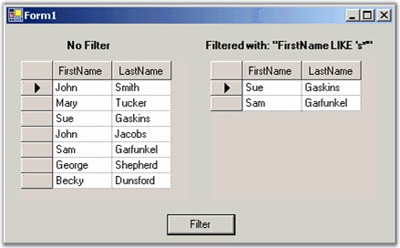
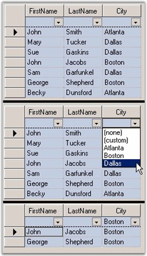

::: {style="DISPLAY: none"}
{#d2h_url_template}{#d2h_package_url style="WIDTH: 0px; DISPLAY: none; HEIGHT: 0px"}
:::

::::: {.d2h_secondary_topic style="PADDING-BOTTOM: 10pt; MARGIN: 0pt; PADDING-LEFT: 0pt; PADDING-RIGHT: 0pt; PADDING-TOP: 0pt"}
#### Filtering a Grid Data Bound Grid {#filtering-a-grid-data-bound-grid style="tab-stops: 0pt"}

[]{style="FONT-FAMILY: 'Trebuchet MS','sans-serif'; COLOR: #15428b; FONT-SIZE: 9pt"} 

We will use an example to illustrate the filtering procedure for the grid.

 

Assume that you are binding a grid to a **DataTable**. In this case, you will have to use the **DataView.RowFilter** property to restrict the rows that appear in your Grid Data Bound Grid. The syntax for the **RowFilter** clause is very similar to the SQL WHERE clause. You will be able to see a full description of this in the .NET Frameworks online help for the DataColumn.Expression, which uses the same syntax.

[]{style="FONT-FAMILY: 'Trebuchet MS','sans-serif'; COLOR: #15428b; FONT-SIZE: 9pt"} 

Here are some samples.

[]{style="FONT-FAMILY: 'Trebuchet MS','sans-serif'; COLOR: #15428b; FONT-SIZE: 9pt"} 

::: {align="center"}
  ------------------------ -----------------------------------------------------------
  RowFilter String         Result
  \[City Area\] = Center   Shows only rows where the City Area column is center.
  rate \> 10               Shows only rows where the rate column is greater than 10.
  Name LIKE a\*            Shows only rows where the Name column begins with \*a.
  Name LIKE \*a            Shows only rows where the Name column ends with \*a.
  ------------------------ -----------------------------------------------------------
:::

[]{style="FONT-FAMILY: 'Trebuchet MS','sans-serif'; COLOR: #15428b; FONT-SIZE: 9pt"} 

{border="0"}

[]{style="FONT-FAMILY: 'Trebuchet MS','sans-serif'; COLOR: #15428b; FONT-SIZE: 9pt"} 

*[Figure ]{style="FONT-SIZE: 9pt"}[208]{style="FONT-SIZE: 9pt"}[: Grid on Right is Filtered Version of Grid on Left]{style="FONT-SIZE: 9pt"}*

[]{style="FONT-FAMILY: 'Trebuchet MS','sans-serif'; COLOR: #15428b; FONT-SIZE: 9pt"} 

The filtered grid is created by setting the **RowFilter** property of it to default view. If you change the RowFilter property then the grid\'s contents will change to reflect the new filter.

[]{style="FONT-FAMILY: 'Trebuchet MS','sans-serif'; COLOR: #15428b; FONT-SIZE: 9pt"} 

+-------------------------------------------------------------------------------------------------------------------------------------------------------------------------------------------------------------------------+
| **[\[C#\]]{style="FONT-FAMILY: 'Courier New'; COLOR: black"}**                                                                                                                                                          |
|                                                                                                                                                                                                                         |
| []{style="FONT-FAMILY: 'Courier New'; COLOR: black"}                                                                                                                                                                    |
|                                                                                                                                                                                                                         |
| [// Assuming the grid is bound to a Data Table.]{style="FONT-FAMILY: 'Courier New'; COLOR: green"}                                                                                                                      |
|                                                                                                                                                                                                                         |
| [DataView]{style="FONT-FAMILY: 'Courier New'; COLOR: #2b91af"}[ dv = (([DataTable]{style="COLOR: #2b91af"})[this]{style="COLOR: blue"}.gridDataBoundGrid1.DataSource).DefaultView;]{style="FONT-FAMILY: 'Courier New'"} |
|                                                                                                                                                                                                                         |
| [dv.RowFilter = [\"FirstName LIKE \'s\*\'\"]{style="COLOR: #a31515"};]{style="FONT-FAMILY: 'Courier New'"}                                                                                                              |
+-------------------------------------------------------------------------------------------------------------------------------------------------------------------------------------------------------------------------+

[]{style="FONT-FAMILY: 'Trebuchet MS','sans-serif'; COLOR: #15428b; FONT-SIZE: 9pt"} 

+---------------------------------------------------------------------------------------------------------------------------------------------------------------------------------------------------------------------------------------------------+
| **[\[VB.NET\]]{style="FONT-FAMILY: 'Courier New'; COLOR: black"}**                                                                                                                                                                                |
|                                                                                                                                                                                                                                                   |
| []{style="FONT-FAMILY: 'Courier New'; COLOR: black"}                                                                                                                                                                                              |
|                                                                                                                                                                                                                                                   |
| [\' Assuming the grid is bound to a Data Table.]{style="FONT-FAMILY: 'Courier New'; COLOR: green"}                                                                                                                                                |
|                                                                                                                                                                                                                                                   |
| [Dim]{style="FONT-FAMILY: 'Courier New'; COLOR: blue"}[ dv [As]{style="COLOR: blue"} DataView = [CType]{style="COLOR: blue"}([Me]{style="COLOR: blue"}.gridDataBoundGrid1.DataSource, DataTable).DefaultView]{style="FONT-FAMILY: 'Courier New'"} |
|                                                                                                                                                                                                                                                   |
| [dv.RowFilter = [\"FirstName LIKE \'s\*\'\"]{style="COLOR: #a31515"}]{style="FONT-FAMILY: 'Courier New'"}                                                                                                                                         |
+---------------------------------------------------------------------------------------------------------------------------------------------------------------------------------------------------------------------------------------------------+

[]{style="FONT-FAMILY: 'Trebuchet MS','sans-serif'; COLOR: #15428b; FONT-SIZE: 9pt"} 

You can use the Essential Grid\'s **GridFilterBar** class to automatically add a row of drop-down cells at the top of a simple (non-hierarchical) Grid Data Bound Grid that can be used to filter the grid to display only rows that match values from the drop-down. For example, when you have a grid with a Grid Filter Bar, if one of your columns is City and you want to see all the rows where City is \'Boston\' for example and then you will have to drop the combo box at the top of the City column, and select Boston. The grid will then display only those rows with Boston in the City column. Adding a Grid Filter Bar takes only two lines of code.

[]{style="FONT-FAMILY: 'Trebuchet MS','sans-serif'; COLOR: #15428b; FONT-SIZE: 9pt"} 

+---------------------------------------------------------------------------------------------------------------------------------------------------------------------------------------------------------------------------+
| **[\[C#\]]{style="FONT-FAMILY: 'Courier New'; COLOR: black"}**                                                                                                                                                            |
|                                                                                                                                                                                                                           |
| []{style="FONT-FAMILY: 'Courier New'; COLOR: black"}                                                                                                                                                                      |
|                                                                                                                                                                                                                           |
| [// Add a Filter Bar to the data bound grid.]{style="FONT-FAMILY: 'Courier New'; COLOR: green"}                                                                                                                           |
|                                                                                                                                                                                                                           |
| [GridFilterBar]{style="FONT-FAMILY: 'Courier New'; COLOR: #2b91af"}[ filterBar = [new]{style="COLOR: blue"} Syncfusion.Windows.Forms.Grid.[GridFilterBar]{style="COLOR: #2b91af"}();]{style="FONT-FAMILY: 'Courier New'"} |
|                                                                                                                                                                                                                           |
| [filterBar.WireGrid(gridDataBoundGrid1);]{style="FONT-FAMILY: 'Courier New'"}                                                                                                                                             |
+---------------------------------------------------------------------------------------------------------------------------------------------------------------------------------------------------------------------------+

[]{style="FONT-FAMILY: 'Trebuchet MS','sans-serif'; COLOR: #15428b; FONT-SIZE: 9pt"} 

+---------------------------------------------------------------------------------------------------------------------------------------------------------------------------------------------------------------------------------------------------------------------------------------------------------------------------------------------------------------------------------------------------------+
| **[\[VB.NET\]]{style="FONT-FAMILY: 'Courier New'; COLOR: black"}**                                                                                                                                                                                                                                                                                                                                      |
|                                                                                                                                                                                                                                                                                                                                                                                                         |
| []{style="FONT-FAMILY: 'Courier New'; COLOR: black"}                                                                                                                                                                                                                                                                                                                                                    |
|                                                                                                                                                                                                                                                                                                                                                                                                         |
| [\' Add a Filter Bar to the data bound grid.]{style="FONT-FAMILY: 'Courier New'; COLOR: green"}                                                                                                                                                                                                                                                                                                         |
|                                                                                                                                                                                                                                                                                                                                                                                                         |
| [Dim]{style="FONT-FAMILY: 'Courier New'; COLOR: blue"}[ filterBar ]{style="FONT-FAMILY: 'Courier New'; COLOR: black"}[As]{style="FONT-FAMILY: 'Courier New'; COLOR: blue"}[ GridFilterBar = ]{style="FONT-FAMILY: 'Courier New'; COLOR: black"}[New]{style="FONT-FAMILY: 'Courier New'; COLOR: blue"}[ Syncfusion.Windows.Forms.Grid.GridFilterBar()]{style="FONT-FAMILY: 'Courier New'; COLOR: black"} |
|                                                                                                                                                                                                                                                                                                                                                                                                         |
| [filterBar.WireGrid(GridDataBoundGrid1)]{style="FONT-FAMILY: 'Courier New'; COLOR: black"}                                                                                                                                                                                                                                                                                                              |
+---------------------------------------------------------------------------------------------------------------------------------------------------------------------------------------------------------------------------------------------------------------------------------------------------------------------------------------------------------------------------------------------------------+

[]{style="FONT-FAMILY: 'Trebuchet MS','sans-serif'; COLOR: #15428b; FONT-SIZE: 9pt"} 

{border="0"}

[]{style="FONT-FAMILY: 'Trebuchet MS','sans-serif'; COLOR: #15428b; FONT-SIZE: 9pt"} 

*[Figure ]{style="FONT-SIZE: 9pt"}[209]{style="FONT-SIZE: 9pt"}[: Top Grid is Before Grid Filter Bar; Middle Shows Selecting to Filter on City = Boston; Bottom Grid is Filtered Grid]{style="FONT-SIZE: 9pt"}*

**[]{style="FONT-FAMILY: 'Trebuchet MS','sans-serif'; COLOR: #15428b; FONT-SIZE: 9pt"}** 

Filter By DisplayMember

[]{style="FONT-FAMILY: 'Trebuchet MS','sans-serif'; COLOR: #15428b; FONT-SIZE: 9pt"} 

Grid Data Bound Grid filters the data records by the value member of the columns. This default behavior can be customized in order to accomplish filtering by display member instead. This can be achieved by deriving custom filter from the GridFilterBar class where in you can customize the GetFilterFromRow method to replace the display strings in the filter with the value strings.

 

The Filter By DisplayMember feature performs this sort of customization and lets you filter the grid data by display member instead of value member.

 

Following code example illustrates how to enable this filter.

[]{style="FONT-FAMILY: 'Trebuchet MS','sans-serif'; COLOR: #15428b; FONT-SIZE: 9pt"} 

+-----------------------------------------------------------------------------------------------------------------------------------------------------------------------------------------------------------------------------+
| **[\[C#\]]{style="FONT-FAMILY: 'Courier New'; COLOR: black"}**                                                                                                                                                              |
|                                                                                                                                                                                                                             |
| []{style="FONT-FAMILY: 'Courier New'; COLOR: black"}                                                                                                                                                                        |
|                                                                                                                                                                                                                             |
| [GridDataBoundGridFilterBarExt]{style="FONT-FAMILY: 'Courier New'; COLOR: #2b91af"}[ filterBar = [new]{style="COLOR: blue"} [GridDataBoundGridFilterBarExt]{style="COLOR: #2b91af"}();]{style="FONT-FAMILY: 'Courier New'"} |
|                                                                                                                                                                                                                             |
| [filterBar.WireGrid(gridDataBoundGrid1);]{style="FONT-FAMILY: 'Courier New'"}                                                                                                                                               |
+-----------------------------------------------------------------------------------------------------------------------------------------------------------------------------------------------------------------------------+

[]{style="FONT-FAMILY: 'Trebuchet MS','sans-serif'; COLOR: #15428b; FONT-SIZE: 9pt"} 

+-----------------------------------------------------------------------------------------------------------------------------------------------------------------------------------------------------------------------------+
| **[\[VB.NET\]]{style="FONT-FAMILY: 'Courier New'; COLOR: black"}**                                                                                                                                                          |
|                                                                                                                                                                                                                             |
| []{style="FONT-FAMILY: 'Courier New'; COLOR: black"}                                                                                                                                                                        |
|                                                                                                                                                                                                                             |
| [Dim]{style="FONT-FAMILY: 'Courier New'; COLOR: blue"}[ filterBar [As]{style="COLOR: blue"} GridDataBoundGridFilterBarExt = [New]{style="COLOR: blue"} GridDataBoundGridFilterBarExt()]{style="FONT-FAMILY: 'Courier New'"} |
|                                                                                                                                                                                                                             |
| [filterBar.WireGrid(gridDataBoundGrid1)]{style="FONT-FAMILY: 'Courier New'"}                                                                                                                                                |
+-----------------------------------------------------------------------------------------------------------------------------------------------------------------------------------------------------------------------------+

[]{style="FONT-FAMILY: 'Trebuchet MS','sans-serif'; COLOR: #15428b; FONT-SIZE: 9pt"} 

{border="0"}

[]{style="FONT-FAMILY: 'Trebuchet MS','sans-serif'; COLOR: #15428b; FONT-SIZE: 9pt"} 

*[Figure ]{style="FONT-SIZE: 9pt"}[210]{style="FONT-SIZE: 9pt"}[: Filtering Data Records in the Grid by the Display Member]{style="FONT-SIZE: 9pt"}*

[]{style="FONT-FAMILY: 'Trebuchet MS','sans-serif'; COLOR: #15428b; FONT-SIZE: 9pt"} 

::: {style="BORDER-BOTTOM: windowtext 1pt solid; BORDER-LEFT: medium none; PADDING-BOTTOM: 1pt; MARGIN-TOP: 9pt; PADDING-LEFT: 0pt; PADDING-RIGHT: 0pt; MARGIN-BOTTOM: 9pt; BORDER-TOP: windowtext 1pt solid; BORDER-RIGHT: medium none; PADDING-TOP: 1pt"}
{border="0"}Note: For more details, refer the following browser sample:
:::

[]{style="FONT-FAMILY: 'Trebuchet MS','sans-serif'; COLOR: #15428b; FONT-SIZE: 9pt"} 

***\<Install Location\>\\Syncfusion\\EssentialStudio\\\[Version Number\]\\Windows\\Grid.Windows\\Samples\\2.0\\Data Bound\\Filter By DisplayMember Demo***

 

[]{#p370} 

 

[]{#related-topics}
:::::
