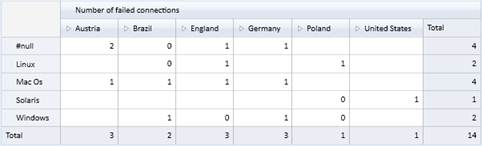
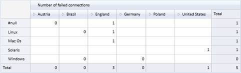

::: {style="DISPLAY: none"}
{#d2h_url_template}{#d2h_package_url style="WIDTH: 0px; DISPLAY: none; HEIGHT: 0px"}
:::

::::: {#nsbanner .d2h_main_nsbanner style="BORDER-BOTTOM: #999999 1px solid; POSITION: relative; PADDING-BOTTOM: 0px; BACKGROUND-COLOR: transparent; PADDING-LEFT: 0px; PADDING-RIGHT: 0px; DISPLAY: none; BORDER-TOP: #999999 1px solid; PADDING-TOP: 0px; LEFT: 0px"}
:::: {#TitleRow .d2h_main_titlerow style="PADDING-BOTTOM: 4px; BACKGROUND-COLOR: transparent; PADDING-LEFT: 22px; WIDTH: 100%; PADDING-RIGHT: 10px; DISPLAY: none; PADDING-TOP: 4px"}
::: {#ienav .d2h_main_ienav style="DISPLAY: none"}
{#D2HPrevious .D2HPreviousEnabled}  {#D2HNext .D2HNextEnabled}
:::
::::
:::::

::::::: {#nstext .d2h_main_nstext style="PADDING-BOTTOM: 10px; BACKGROUND-COLOR: transparent; PADDING-LEFT: 22px; PADDING-RIGHT: 10px; HEIGHT: 100%; OVERFLOW: auto; PADDING-TOP: 5px" hasuserbackground="true" valign="bottom"}
::: {#d2h_breadcrumbs .d2h_breadcrumbs}
[Essential Studio User Guide Documentation](ms-xhelp:///?Id=12457748-09e3-4d74-a240-8e049cedf030){.d2h_breadcrumbsNormal}[ \> ]{.d2h_breadcrumbsLinkSeparator}[Business Intelligence Edition](ms-xhelp:///?Id=fdf33dd8-62b2-47b9-ad7b-fc50e590bca5){.d2h_breadcrumbsNormal}[ \> ]{.d2h_breadcrumbsLinkSeparator}[Essential BI Common](ms-xhelp:///?Id=51cb28d1-f201-4ea8-9963-a8afa451f64c){.d2h_breadcrumbsNormal}[ \> ]{.d2h_breadcrumbsLinkSeparator}[Concepts](ms-xhelp:///?Id=c4af561c-5904-4dc4-8eaf-ec1e14451e92){.d2h_breadcrumbsNormal}[ \> ]{.d2h_breadcrumbsLinkSeparator}[OlapReport](ms-xhelp:///?Id=5df0d4a2-dd21-4743-9142-c97b5f6c86e0){.d2h_breadcrumbsNormal}
:::

### Filtering slicer elements by range {#filtering-slicer-elements-by-range style="tab-stops: 0pt"}

This feature enables you to specify a range for filter elements in the slicer field. You have to specify the start and end value to set the range. Multiple ranges can be added for the filter elements in slicer field.

Use Case Scenarios

It is not required to enter each member manually. This makes filtering easy.  

Class

 

Table 9: Class Table

::: {align="center"}
  ------------------------ -------------------------------------------------------------------------------------------------------------------------------------------------------------------------------------------------------------------------------------------------------
  Name                     Description
  SlicerRangeFiltersInfo   Used to filter values from one range to another. Unique name of the member element for start and end value need to be specified. The name of the member element can also be specified for start and end value when custumer builds the unique name\*.
  ------------------------ -------------------------------------------------------------------------------------------------------------------------------------------------------------------------------------------------------------------------------------------------------
:::

 

\* Name of the member element[ can be specified only when name is formed with ]{style="COLOR: black"}dimension name, hierarchy name and level name[.  ]{style="COLOR: black"}

 

Constructor

Table 10: Constructor  Table

::: {align="center"}
  --------------------------------------------------------------------------------------------------------------------------------- --------------------------------------------------------------------------------------------------------- ------------------------------------------------------------------
  Syntax                                                                                                                            Description                                                                                               Parameter
  SlicerRangeFiltersInfo(string startValueUniqueName, string endValueUniqueName)                                                    Initializes SlicerRangeFiltersInfo with unique name as star and end values.                               Unique name for start and end value.
  SlicerRangeFiltersInfo(string dimensionName, string hierarchyName, string levelName, string startValueName, string endValueName   Initializes SlicerRangeFiltersInfo with name of dimension, hierarchy, level, star value and end value.    Name for dimension, hierarchy, level, start value and end value.
  --------------------------------------------------------------------------------------------------------------------------------- --------------------------------------------------------------------------------------------------------- ------------------------------------------------------------------
:::

 

Properties

Following table consists of SlicerRangeFiltersInfo class's property:

Table 11: Properties Table

::: {align="center"}
  --------------- --------------------------------------------------------- ------ ----------- -----------------
  Property        Description                                               Type   Data Type   Reference links
  DimensionName   Specify the dimension name                                None   String      NA
  HierarchyName   Specify the hierarchy name                                None   String      NA
  LevelName       Specify the level name                                    None   String      NA
  StartValue      Specify the unique name or name of the member element\*   None   String      NA
  EndValue        Specify the unique name or name of the member element\*   None   String      NA
  --------------- --------------------------------------------------------- ------ ----------- -----------------
:::

[]{style="FONT-FAMILY: 'Calibri','sans-serif'; COLOR: black"} 

[\* ]{style="FONT-FAMILY: 'Calibri','sans-serif'; COLOR: black"}Name of the member element can be specified only when the name is formed with dimension name, hierarchy name and level name[. ]{style="FONT-FAMILY: 'Calibri','sans-serif'; COLOR: black"}

Adding a range for the filter elements in slicer field:

There are two methods to add range for the filter elements in a slicer field.

In the first method, you can specify the unique name for start and end value. The following code illustrates this: 

+---------------------------------------------------------------------------------------------------------------------------------------------------------------------------------------------------------------------------------------------------------------------------------+
| **[\[C#\]]{style="FONT-FAMILY: 'Courier New'"}**                                                                                                                                                                                                                                |
|                                                                                                                                                                                                                                                                                 |
| [olapReport.SlicerRangeFilters.Add([new]{style="COLOR: blue"} [SlicerRangeFiltersInfo]{style="COLOR: #2b91af"}([\"\[TimeFlat\].\[201010100031\]\"]{style="COLOR: #a31515"}, [\"\[TimeFlat\].\[201010100037\]\"]{style="COLOR: #a31515"}));]{style="FONT-FAMILY: 'Courier New'"} |
+---------------------------------------------------------------------------------------------------------------------------------------------------------------------------------------------------------------------------------------------------------------------------------+

 

+---------------------------------------------------------------------------------------------------------------------------------------------------------------------------------------------------------------------------------------------------------------------------------+
| **[\[VB\]]{style="FONT-FAMILY: 'Courier New'"}**                                                                                                                                                                                                                                |
|                                                                                                                                                                                                                                                                                 |
| [olapReport.SlicerRangeFilters.Add([New]{style="COLOR: blue"} [SlicerRangeFiltersInfo]{style="COLOR: #2b91af"} ([\"\[TimeFlat\].\[201010100031\]\"]{style="COLOR: #a31515"}, [\"\[TimeFlat\].\[201010100037\]\"]{style="COLOR: #a31515"}))]{style="FONT-FAMILY: 'Courier New'"} |
+---------------------------------------------------------------------------------------------------------------------------------------------------------------------------------------------------------------------------------------------------------------------------------+

 

In the second method, you can specify the member name along with dimension name, hierarchy name and level name. Entering the unique name for start and end value is not mandatory.  The following code illustrates this:

+--------------------------------------------------------------------------------------------------------------------------------------------------------------------------------------------------------------------------------------------------------------------------------------------------------------------------------------------------------------------------------------------------------------------------------------------+
| **[\[C#\]]{style="FONT-FAMILY: 'Courier New'"}**                                                                                                                                                                                                                                                                                                                                                                                           |
|                                                                                                                                                                                                                                                                                                                                                                                                                                            |
| [olapReport.SlicerRangeFilters.Add([new]{style="COLOR: blue"} [SlicerRangeFiltersInfo]{style="COLOR: #2b91af"} { DimensionName = [\"TimeFlat\"]{style="COLOR: #a31515"}, HierarchyName = [\"TimeFlat\"]{style="COLOR: #a31515"}, LevelName = [\"TimeId\"]{style="COLOR: #a31515"}, StartValue = [\"201010100031\"]{style="COLOR: #a31515"}, EndValue = [\"201010100037\"]{style="COLOR: #a31515"} });]{style="FONT-FAMILY: 'Courier New'"} |
+--------------------------------------------------------------------------------------------------------------------------------------------------------------------------------------------------------------------------------------------------------------------------------------------------------------------------------------------------------------------------------------------------------------------------------------------+

 

+---------------------------------------------------------------------------------------------------------------------------------------------------------------------------------------------------------------------------------------------------------------------------------------------------------------------------------------------------------------------------------------------------------------------------------------------------+
| **[\[VB\]]{style="FONT-FAMILY: 'Courier New'"}**                                                                                                                                                                                                                                                                                                                                                                                                  |
|                                                                                                                                                                                                                                                                                                                                                                                                                                                   |
| [olapReport.SlicerRangeFilters.Add([New]{style="COLOR: blue"} [SlicerRangeFiltersInfo]{style="COLOR: #2b91af"} With {.DimensionName = [\"TimeFlat\"]{style="COLOR: #a31515"}, .HierarchyName = [\"TimeFlat\"]{style="COLOR: #a31515"}, .LevelName = [\"TimeId\"]{style="COLOR: #a31515"}, .StartValue = [\"201010100031\"]{style="COLOR: #a31515"}, .EndValue = [\"201010100037\"]{style="COLOR: #a31515"}})]{style="FONT-FAMILY: 'Courier New'"} |
+---------------------------------------------------------------------------------------------------------------------------------------------------------------------------------------------------------------------------------------------------------------------------------------------------------------------------------------------------------------------------------------------------------------------------------------------------+

 

 

{border="0"}

Figure 6: Before applying range for filtering

 

 

{border="0"}

Figure 7: After applying range for filtering

[]{#related-topics}
:::::::
