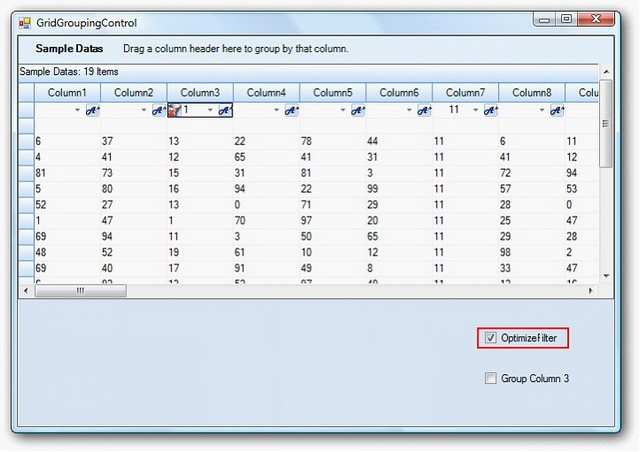

::: {style="DISPLAY: none"}
{#d2h_url_template}{#d2h_package_url style="WIDTH: 0px; DISPLAY: none; HEIGHT: 0px"}
:::

::: {.d2h_secondary_topic style="PADDING-BOTTOM: 10pt; MARGIN: 0pt; PADDING-LEFT: 0pt; PADDING-RIGHT: 0pt; PADDING-TOP: 0pt"}
##### Filter Optimization {#filter-optimization style="tab-stops: 0pt"}

 

The filter can be optimized for the performance over large data in **GridGroupingControl**.

Set **OptimizeFilterPerformance** to **true** to optimize the filter.

This boolean property enables the grid to optimize the filtering of data by delegating the summary to filter the grid accordingly.

The **OptimizeFilterPerformance** property can be assigned directly from the **GridGroupingControl** and can apply to any type of filter bar specified to the grid.

 

The following code illustrates how to optimize the filter.

[]{style="FONT-FAMILY: 'Trebuchet MS','sans-serif'; COLOR: #15428b; FONT-SIZE: 9pt"} 

+--------------------------------------------------------------------------------------------------------------------------------------------------------------------------------------------------+
| **[\[C#\]]{style="FONT-FAMILY: 'Courier New'"}**                                                                                                                                                 |
|                                                                                                                                                                                                  |
| []{style="FONT-FAMILY: 'Courier New'"}                                                                                                                                                           |
|                                                                                                                                                                                                  |
| [        [private]{style="COLOR: blue"} [void]{style="COLOR: blue"} Form1_Load([object]{style="COLOR: blue"} sender, [EventArgs]{style="COLOR: #2b91af"} e)]{style="FONT-FAMILY: 'Courier New'"} |
|                                                                                                                                                                                                  |
| [        {]{style="FONT-FAMILY: 'Courier New'"}                                                                                                                                                  |
|                                                                                                                                                                                                  |
| [            [this]{style="COLOR: blue"}.gridGroupingControl1.OptimizeFilterPerformance = [true]{style="COLOR: blue"};]{style="FONT-FAMILY: 'Courier New'"}                                      |
|                                                                                                                                                                                                  |
| [        }]{style="FONT-FAMILY: 'Courier New'"}                                                                                                                                                  |
+--------------------------------------------------------------------------------------------------------------------------------------------------------------------------------------------------+

[]{style="FONT-FAMILY: 'Times New Roman','serif'; FONT-SIZE: 12pt"} 

[]{style="FONT-FAMILY: 'Times New Roman','serif'"} 

+------------------------------------------------------------------------------------------------------------------------------------------------------------------------------------------------------------------------------------------------------------------------------------+
| **[\[VB\]]{style="FONT-FAMILY: 'Courier New'"}**                                                                                                                                                                                                                                   |
|                                                                                                                                                                                                                                                                                    |
| []{style="FONT-FAMILY: 'Courier New'"}                                                                                                                                                                                                                                             |
|                                                                                                                                                                                                                                                                                    |
| [       [Private]{style="COLOR: blue"} [Sub]{style="COLOR: blue"} Form1_Load([ByVal]{style="COLOR: blue"} sender [As]{style="COLOR: blue"} [Object]{style="COLOR: blue"}, [ByVal]{style="COLOR: blue"} e [As]{style="COLOR: blue"} EventArgs)]{style="FONT-FAMILY: 'Courier New'"} |
|                                                                                                                                                                                                                                                                                    |
| [            [Me]{style="COLOR: blue"}.gridGroupingControl1.OptimizeFilterPerformance = [True]{style="COLOR: blue"}]{style="FONT-FAMILY: 'Courier New'"}                                                                                                                           |
|                                                                                                                                                                                                                                                                                    |
| [        [End]{style="COLOR: blue"} [Sub]{style="COLOR: blue"}]{style="FONT-FAMILY: 'Courier New'"}                                                                                                                                                                                |
+------------------------------------------------------------------------------------------------------------------------------------------------------------------------------------------------------------------------------------------------------------------------------------+

[]{style="FONT-FAMILY: 'Times New Roman','serif'; FONT-SIZE: 12pt"} 

[]{style="FONT-FAMILY: 'Times New Roman','serif'; FONT-SIZE: 12pt"} 

{border="0"}

*[Figure ]{style="FONT-SIZE: 9pt"}[415]{style="FONT-SIZE: 9pt"}[: Optimize Filter ]{style="FONT-SIZE: 9pt"}*

 

[]{#p484} 

 

[]{#related-topics}
:::
