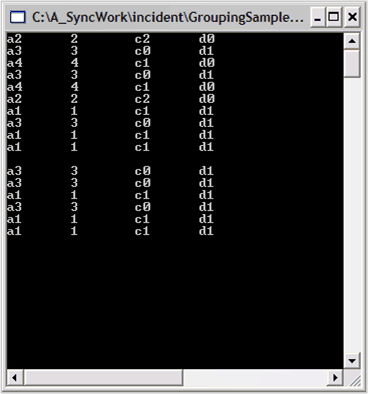
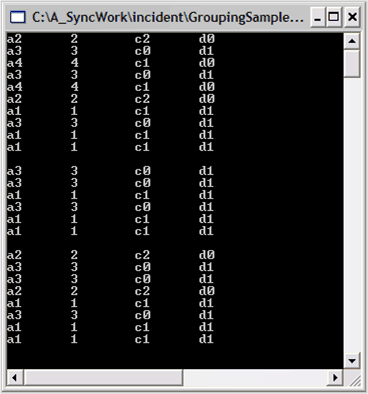

::: {style="DISPLAY: none"}
{#d2h_url_template}{#d2h_package_url style="WIDTH: 0px; DISPLAY: none; HEIGHT: 0px"}
:::

::::: {#nsbanner .d2h_main_nsbanner style="BORDER-BOTTOM: #999999 1px solid; POSITION: relative; PADDING-BOTTOM: 0px; BACKGROUND-COLOR: transparent; PADDING-LEFT: 0px; PADDING-RIGHT: 0px; DISPLAY: none; BORDER-TOP: #999999 1px solid; PADDING-TOP: 0px; LEFT: 0px"}
:::: {#TitleRow .d2h_main_titlerow style="PADDING-BOTTOM: 4px; BACKGROUND-COLOR: transparent; PADDING-LEFT: 22px; WIDTH: 100%; PADDING-RIGHT: 10px; DISPLAY: none; PADDING-TOP: 4px"}
::: {#ienav .d2h_main_ienav style="DISPLAY: none"}
{#D2HPrevious .D2HPreviousEnabled}  {#D2HNext .D2HNextEnabled}
:::
::::
:::::

::::: {#nstext .d2h_main_nstext style="PADDING-BOTTOM: 10px; BACKGROUND-COLOR: transparent; PADDING-LEFT: 22px; PADDING-RIGHT: 10px; HEIGHT: 100%; OVERFLOW: auto; PADDING-TOP: 5px" hasuserbackground="true" valign="bottom"}
::: {#d2h_breadcrumbs .d2h_breadcrumbs}
[Essential Studio User Guide Documentation](ms-xhelp:///?Id=12457748-09e3-4d74-a240-8e049cedf030){.d2h_breadcrumbsNormal}[ \> ]{.d2h_breadcrumbsLinkSeparator}[Reporting Edition](ms-xhelp:///?Id=027aa5b6-6676-4f93-ad23-c20e8c45792e){.d2h_breadcrumbsNormal}[ \> ]{.d2h_breadcrumbsLinkSeparator}[Essential Grouping](ms-xhelp:///?Id=37faf36d-c8f0-4c7d-90e1-39deecb620a6){.d2h_breadcrumbsNormal}[ \> ]{.d2h_breadcrumbsLinkSeparator}[Concepts and Features](ms-xhelp:///?Id=c4c7c491-8a85-4ab1-829b-adb3b3ed1a4c){.d2h_breadcrumbsNormal}[ \> ]{.d2h_breadcrumbsLinkSeparator}[Data Manipulation](ms-xhelp:///?Id=ef52afcd-637f-4eec-879c-f793179de730){.d2h_breadcrumbsNormal}
:::

### Filters {#filters style="tab-stops: 0pt"}

 

Another collection that is part of the schema information in the **Engine.TableDescriptor** is the **RecordFilters** collection. This collection lets you filter the data to see only the items that are in your data list and that satisfy the criteria that is specified. You can express the criteria as a logical expression using the property names, algebraic, and logical operators. You can also use LIKE, MATCH, and IN operators.

 

1    In the Console Application used in lessons 1 and 2, comment out all the code that is in the **Main** method and add the following code to create a data object and set it into the **Grouping Engine**.

 

+--------------------------------------------------------------------------------------------------------------------------------------------------------------------------------------------------------------------------------------------------------------------------------------------------------------------------------------------------------+
| **[\[C#\]]{style="FONT-FAMILY: 'Courier New'; COLOR: black"}**                                                                                                                                                                                                                                                                                         |
|                                                                                                                                                                                                                                                                                                                                                        |
| []{style="FONT-FAMILY: 'Courier New'; COLOR: black"}                                                                                                                                                                                                                                                                                                   |
|                                                                                                                                                                                                                                                                                                                                                        |
| [static]{style="FONT-FAMILY: 'Courier New'; COLOR: blue"}[ ]{style="FONT-FAMILY: 'Courier New'; COLOR: black"}[void]{style="FONT-FAMILY: 'Courier New'; COLOR: blue"}[ Main(]{style="FONT-FAMILY: 'Courier New'; COLOR: black"}[string]{style="FONT-FAMILY: 'Courier New'; COLOR: blue"}[\[\] args)]{style="FONT-FAMILY: 'Courier New'; COLOR: black"} |
|                                                                                                                                                                                                                                                                                                                                                        |
| [{]{style="FONT-FAMILY: 'Courier New'; COLOR: black"}                                                                                                                                                                                                                                                                                                  |
|                                                                                                                                                                                                                                                                                                                                                        |
| [        ]{style="FONT-FAMILY: 'Courier New'; COLOR: black"}[// Create an arraylist of random MyObjects.]{style="FONT-FAMILY: 'Courier New'; COLOR: green"}                                                                                                                                                                                            |
|                                                                                                                                                                                                                                                                                                                                                        |
| [        ArrayList list = ]{style="FONT-FAMILY: 'Courier New'; COLOR: black"}[new]{style="FONT-FAMILY: 'Courier New'; COLOR: blue"}[ ArrayList();]{style="FONT-FAMILY: 'Courier New'; COLOR: black"}                                                                                                                                                   |
|                                                                                                                                                                                                                                                                                                                                                        |
| [        Random r = ]{style="FONT-FAMILY: 'Courier New'; COLOR: black"}[new]{style="FONT-FAMILY: 'Courier New'; COLOR: blue"}[ Random();]{style="FONT-FAMILY: 'Courier New'; COLOR: black"}                                                                                                                                                            |
|                                                                                                                                                                                                                                                                                                                                                        |
| []{style="FONT-FAMILY: 'Courier New'; COLOR: black"}                                                                                                                                                                                                                                                                                                   |
|                                                                                                                                                                                                                                                                                                                                                        |
| [        ]{style="FONT-FAMILY: 'Courier New'; COLOR: black"}[for]{style="FONT-FAMILY: 'Courier New'; COLOR: blue"}[(]{style="FONT-FAMILY: 'Courier New'; COLOR: black"}[int]{style="FONT-FAMILY: 'Courier New'; COLOR: blue"}[ i = 0; i \< 10; i++)]{style="FONT-FAMILY: 'Courier New'; COLOR: black"}                                                 |
|                                                                                                                                                                                                                                                                                                                                                        |
| [        {]{style="FONT-FAMILY: 'Courier New'; COLOR: black"}                                                                                                                                                                                                                                                                                          |
|                                                                                                                                                                                                                                                                                                                                                        |
| [                        list.Add(]{style="FONT-FAMILY: 'Courier New'; COLOR: black"}[new]{style="FONT-FAMILY: 'Courier New'; COLOR: blue"}[ MyObject(r.Next(5)));]{style="FONT-FAMILY: 'Courier New'; COLOR: black"}                                                                                                                                  |
|                                                                                                                                                                                                                                                                                                                                                        |
| [        }]{style="FONT-FAMILY: 'Courier New'; COLOR: black"}                                                                                                                                                                                                                                                                                          |
|                                                                                                                                                                                                                                                                                                                                                        |
| []{style="FONT-FAMILY: 'Courier New'; COLOR: black"}                                                                                                                                                                                                                                                                                                   |
|                                                                                                                                                                                                                                                                                                                                                        |
| [        ]{style="FONT-FAMILY: 'Courier New'; COLOR: black"}[// Create a Grouping.Engine object.]{style="FONT-FAMILY: 'Courier New'; COLOR: green"}                                                                                                                                                                                                    |
|                                                                                                                                                                                                                                                                                                                                                        |
| [        Engine groupingEngine = ]{style="FONT-FAMILY: 'Courier New'; COLOR: black"}[new]{style="FONT-FAMILY: 'Courier New'; COLOR: blue"}[ Engine();]{style="FONT-FAMILY: 'Courier New'; COLOR: black"}                                                                                                                                               |
|                                                                                                                                                                                                                                                                                                                                                        |
| []{style="FONT-FAMILY: 'Courier New'; COLOR: black"}                                                                                                                                                                                                                                                                                                   |
|                                                                                                                                                                                                                                                                                                                                                        |
| [       ]{style="FONT-FAMILY: 'Courier New'; COLOR: black"}[ // Set its datasource.]{style="FONT-FAMILY: 'Courier New'; COLOR: green"}                                                                                                                                                                                                                 |
|                                                                                                                                                                                                                                                                                                                                                        |
| [        groupingEngine.SetSourceList(list);]{style="FONT-FAMILY: 'Courier New'; COLOR: black"}                                                                                                                                                                                                                                                        |
|                                                                                                                                                                                                                                                                                                                                                        |
| [}]{style="FONT-FAMILY: 'Courier New'; COLOR: black"}                                                                                                                                                                                                                                                                                                  |
+--------------------------------------------------------------------------------------------------------------------------------------------------------------------------------------------------------------------------------------------------------------------------------------------------------------------------------------------------------+

[]{style="FONT-FAMILY: 'Trebuchet MS','sans-serif'; COLOR: #15428b; FONT-SIZE: 9pt"} 

+-----------------------------------------------------------------------------------------------------------------------------------------------------------------------------------------------------------------------------------------------------------------------------------------------------------------------------------------------+
| **[\[VB.NET\]]{style="FONT-FAMILY: 'Courier New'; COLOR: black"}**                                                                                                                                                                                                                                                                            |
|                                                                                                                                                                                                                                                                                                                                               |
| []{style="FONT-FAMILY: 'Courier New'; COLOR: black"}                                                                                                                                                                                                                                                                                          |
|                                                                                                                                                                                                                                                                                                                                               |
| [Sub]{style="FONT-FAMILY: 'Courier New'; COLOR: blue"}[ Main()]{style="FONT-FAMILY: 'Courier New'; COLOR: black"}                                                                                                                                                                                                                             |
|                                                                                                                                                                                                                                                                                                                                               |
| []{style="FONT-FAMILY: 'Courier New'; COLOR: black"}                                                                                                                                                                                                                                                                                          |
|                                                                                                                                                                                                                                                                                                                                               |
| [        ]{style="FONT-FAMILY: 'Courier New'; COLOR: black"}[\' Create an arraylist of random MyObjects.]{style="FONT-FAMILY: 'Courier New'; COLOR: green"}                                                                                                                                                                                   |
|                                                                                                                                                                                                                                                                                                                                               |
| [        ]{style="FONT-FAMILY: 'Courier New'; COLOR: black"}[Dim]{style="FONT-FAMILY: 'Courier New'; COLOR: blue"}[ list]{style="FONT-FAMILY: 'Courier New'; COLOR: black"}[ As New]{style="FONT-FAMILY: 'Courier New'; COLOR: blue"}[ ArrayList()]{style="FONT-FAMILY: 'Courier New'; COLOR: black"}                                         |
|                                                                                                                                                                                                                                                                                                                                               |
| [        ]{style="FONT-FAMILY: 'Courier New'; COLOR: black"}[Dim]{style="FONT-FAMILY: 'Courier New'; COLOR: blue"}[ r ]{style="FONT-FAMILY: 'Courier New'; COLOR: black"}[As New]{style="FONT-FAMILY: 'Courier New'; COLOR: blue"}[ Random()]{style="FONT-FAMILY: 'Courier New'; COLOR: black"}                                               |
|                                                                                                                                                                                                                                                                                                                                               |
| []{style="FONT-FAMILY: 'Courier New'; COLOR: black"}                                                                                                                                                                                                                                                                                          |
|                                                                                                                                                                                                                                                                                                                                               |
| [        ]{style="FONT-FAMILY: 'Courier New'; COLOR: black"}[Dim]{style="FONT-FAMILY: 'Courier New'; COLOR: blue"}[ i ]{style="FONT-FAMILY: 'Courier New'; COLOR: black"}[As]{style="FONT-FAMILY: 'Courier New'; COLOR: blue"}[ ]{style="FONT-FAMILY: 'Courier New'; COLOR: black"}[Integer]{style="FONT-FAMILY: 'Courier New'; COLOR: blue"} |
|                                                                                                                                                                                                                                                                                                                                               |
| [        ]{style="FONT-FAMILY: 'Courier New'; COLOR: black"}[For]{style="FONT-FAMILY: 'Courier New'; COLOR: blue"}[ i = 0 ]{style="FONT-FAMILY: 'Courier New'; COLOR: black"}[To]{style="FONT-FAMILY: 'Courier New'; COLOR: blue"}[ 10]{style="FONT-FAMILY: 'Courier New'; COLOR: black"}                                                     |
|                                                                                                                                                                                                                                                                                                                                               |
| [            list.Add(]{style="FONT-FAMILY: 'Courier New'; COLOR: black"}[New]{style="FONT-FAMILY: 'Courier New'; COLOR: blue"}[ MyObject(r.Next(5)))]{style="FONT-FAMILY: 'Courier New'; COLOR: black"}                                                                                                                                      |
|                                                                                                                                                                                                                                                                                                                                               |
| [        ]{style="FONT-FAMILY: 'Courier New'; COLOR: black"}[Next]{style="FONT-FAMILY: 'Courier New'; COLOR: blue"}                                                                                                                                                                                                                           |
|                                                                                                                                                                                                                                                                                                                                               |
| []{style="FONT-FAMILY: 'Courier New'; COLOR: black"}                                                                                                                                                                                                                                                                                          |
|                                                                                                                                                                                                                                                                                                                                               |
| [         ]{style="FONT-FAMILY: 'Courier New'; COLOR: black"}[\' Create a Grouping.Engine object.]{style="FONT-FAMILY: 'Courier New'; COLOR: green"}                                                                                                                                                                                          |
|                                                                                                                                                                                                                                                                                                                                               |
| [        ]{style="FONT-FAMILY: 'Courier New'; COLOR: black"}[Dim]{style="FONT-FAMILY: 'Courier New'; COLOR: blue"}[ groupingEngine ]{style="FONT-FAMILY: 'Courier New'; COLOR: black"}[As New]{style="FONT-FAMILY: 'Courier New'; COLOR: blue"}[ Engine()]{style="FONT-FAMILY: 'Courier New'; COLOR: black"}                                  |
|                                                                                                                                                                                                                                                                                                                                               |
| []{style="FONT-FAMILY: 'Courier New'; COLOR: black"}                                                                                                                                                                                                                                                                                          |
|                                                                                                                                                                                                                                                                                                                                               |
| [       ]{style="FONT-FAMILY: 'Courier New'; COLOR: black"}[ \' Set its data source.]{style="FONT-FAMILY: 'Courier New'; COLOR: green"}                                                                                                                                                                                                       |
|                                                                                                                                                                                                                                                                                                                                               |
| [        groupingEngine.SetSourceList(list)]{style="FONT-FAMILY: 'Courier New'; COLOR: black"}                                                                                                                                                                                                                                                |
|                                                                                                                                                                                                                                                                                                                                               |
| [End Sub ]{style="FONT-FAMILY: 'Courier New'; COLOR: blue"}                                                                                                                                                                                                                                                                                   |
+-----------------------------------------------------------------------------------------------------------------------------------------------------------------------------------------------------------------------------------------------------------------------------------------------------------------------------------------------+

[]{style="FONT-FAMILY: 'Courier New'"} 

2    You are now ready to apply a filter to the data. Say for example you want to see only those items whose property D has the value d1. You must observe that D is a string that has non-numeric values. So, in this case you will need to use one of the string comparison operators (LIKE or MATCH) in your filter condition.

[]{style="FONT-FAMILY: 'Trebuchet MS','sans-serif'; COLOR: #15428b; FONT-SIZE: 9pt"} 

3    To add a filter condition, you will need to add a **RecordFilterDescriptor** to the **Engine.TableDescriptor.RecordFilters** collection.

[]{style="FONT-FAMILY: 'Trebuchet MS','sans-serif'; COLOR: #15428b; FONT-SIZE: 9pt"} 

Do the following steps:

[]{style="FONT-FAMILY: 'Trebuchet MS','sans-serif'; COLOR: #15428b; FONT-SIZE: 9pt"} 

1.   List the data before the filter.

2.   Apply the filter by creating a RecordFilterDescriptor.

3.   Add it to the RecordFilters collection.

4.   List the filtered data.

::: {style="BORDER-BOTTOM: windowtext 1pt solid; BORDER-LEFT: medium none; PADDING-BOTTOM: 1pt; MARGIN-TOP: 9pt; PADDING-LEFT: 0pt; PADDING-RIGHT: 0pt; MARGIN-BOTTOM: 9pt; BORDER-TOP: windowtext 1pt solid; BORDER-RIGHT: medium none; PADDING-TOP: 1pt"}
 

{border="0"}Note: To list the data, instead of accessing the Table.Records collections, you were using the Table.FilteredRecords collections. The FilteredRecords collection only includes the records that satisfy all filters in the RecordFilters collection. Add this code at the end of the Main method.
:::

[]{style="FONT-FAMILY: 'Trebuchet MS','sans-serif'; COLOR: #15428b; FONT-SIZE: 9pt"} 

4    Note that the constructor on the RecordFilterDescription takes an expression, \"\[D\] LIKE \'d1\'\". This expression will be ***True*** only for those items in the list where property D has the value d1.

[]{style="FONT-FAMILY: 'Trebuchet MS','sans-serif'; COLOR: #15428b; FONT-SIZE: 9pt"} 

+-------------------------------------------------------------------------------------------------------------------------------------------------------------------------------------------------------------------------------------------------------------------------------------------+
| **[\[C#\]]{style="FONT-FAMILY: 'Courier New'; COLOR: black"}**                                                                                                                                                                                                                            |
|                                                                                                                                                                                                                                                                                           |
| []{style="COLOR: black"}                                                                                                                                                                                                                                                                  |
|                                                                                                                                                                                                                                                                                           |
| [// Display the data before filtering.]{style="FONT-FAMILY: 'Courier New'; COLOR: green"}                                                                                                                                                                                                 |
|                                                                                                                                                                                                                                                                                           |
| [foreach]{style="FONT-FAMILY: 'Courier New'; COLOR: blue"}[(Record rec ]{style="FONT-FAMILY: 'Courier New'; COLOR: black"}[in]{style="FONT-FAMILY: 'Courier New'; COLOR: blue"}[ groupingEngine.Table.FilteredRecords)]{style="FONT-FAMILY: 'Courier New'; COLOR: black"}                 |
|                                                                                                                                                                                                                                                                                           |
| [{]{style="FONT-FAMILY: 'Courier New'; COLOR: black"}                                                                                                                                                                                                                                     |
|                                                                                                                                                                                                                                                                                           |
| [        MyObject obj = rec.GetData() ]{style="FONT-FAMILY: 'Courier New'; COLOR: black"}[as]{style="FONT-FAMILY: 'Courier New'; COLOR: blue"}[ MyObject;]{style="FONT-FAMILY: 'Courier New'; COLOR: black"}                                                                              |
|                                                                                                                                                                                                                                                                                           |
| [       ]{style="FONT-FAMILY: 'Courier New'; COLOR: black"}[if]{style="FONT-FAMILY: 'Courier New'; COLOR: blue"}[(obj != ]{style="FONT-FAMILY: 'Courier New'; COLOR: black"}[null]{style="FONT-FAMILY: 'Courier New'; COLOR: blue"}[)]{style="FONT-FAMILY: 'Courier New'; COLOR: black"}  |
|                                                                                                                                                                                                                                                                                           |
| [       {]{style="FONT-FAMILY: 'Courier New'; COLOR: black"}                                                                                                                                                                                                                              |
|                                                                                                                                                                                                                                                                                           |
| [          Console.WriteLine(obj);]{style="FONT-FAMILY: 'Courier New'; COLOR: black"}                                                                                                                                                                                                     |
|                                                                                                                                                                                                                                                                                           |
| [       }]{style="FONT-FAMILY: 'Courier New'; COLOR: black"}                                                                                                                                                                                                                              |
|                                                                                                                                                                                                                                                                                           |
| [}]{style="FONT-FAMILY: 'Courier New'; COLOR: black"}                                                                                                                                                                                                                                     |
|                                                                                                                                                                                                                                                                                           |
| []{style="FONT-FAMILY: 'Courier New'; COLOR: black"}                                                                                                                                                                                                                                      |
|                                                                                                                                                                                                                                                                                           |
| [// Pause]{style="FONT-FAMILY: 'Courier New'; COLOR: green"}                                                                                                                                                                                                                              |
|                                                                                                                                                                                                                                                                                           |
| [Console.ReadLine(); ]{style="FONT-FAMILY: 'Courier New'; COLOR: black"}                                                                                                                                                                                                                  |
|                                                                                                                                                                                                                                                                                           |
| []{style="FONT-FAMILY: 'Courier New'; COLOR: black"}                                                                                                                                                                                                                                      |
|                                                                                                                                                                                                                                                                                           |
| [// Filter on \[D\] = d1]{style="FONT-FAMILY: 'Courier New'; COLOR: green"}                                                                                                                                                                                                               |
|                                                                                                                                                                                                                                                                                           |
| [RecordFilterDescriptor rfd = ]{style="FONT-FAMILY: 'Courier New'; COLOR: black"}[new]{style="FONT-FAMILY: 'Courier New'; COLOR: blue"}[ RecordFilterDescriptor(\"\[D\] LIKE \'d1\'\");]{style="FONT-FAMILY: 'Courier New'; COLOR: black"}                                                |
|                                                                                                                                                                                                                                                                                           |
| [groupingEngine.TableDescriptor.RecordFilters.Add(rfd);]{style="FONT-FAMILY: 'Courier New'; COLOR: black"}                                                                                                                                                                                |
|                                                                                                                                                                                                                                                                                           |
| []{style="FONT-FAMILY: 'Courier New'; COLOR: black"}                                                                                                                                                                                                                                      |
|                                                                                                                                                                                                                                                                                           |
| [// Display the data after filtering.]{style="FONT-FAMILY: 'Courier New'; COLOR: green"}                                                                                                                                                                                                  |
|                                                                                                                                                                                                                                                                                           |
| [foreach]{style="FONT-FAMILY: 'Courier New'; COLOR: blue"}[(Record rec ]{style="FONT-FAMILY: 'Courier New'; COLOR: black"}[in]{style="FONT-FAMILY: 'Courier New'; COLOR: blue"}[ groupingEngine.Table.FilteredRecords)]{style="FONT-FAMILY: 'Courier New'; COLOR: black"}                 |
|                                                                                                                                                                                                                                                                                           |
| [{]{style="FONT-FAMILY: 'Courier New'; COLOR: black"}                                                                                                                                                                                                                                     |
|                                                                                                                                                                                                                                                                                           |
| [        MyObject obj = rec.GetData() ]{style="FONT-FAMILY: 'Courier New'; COLOR: black"}[as]{style="FONT-FAMILY: 'Courier New'; COLOR: blue"}[ MyObject;]{style="FONT-FAMILY: 'Courier New'; COLOR: black"}                                                                              |
|                                                                                                                                                                                                                                                                                           |
| [        ]{style="FONT-FAMILY: 'Courier New'; COLOR: black"}[if]{style="FONT-FAMILY: 'Courier New'; COLOR: blue"}[(obj != ]{style="FONT-FAMILY: 'Courier New'; COLOR: black"}[null]{style="FONT-FAMILY: 'Courier New'; COLOR: blue"}[)]{style="FONT-FAMILY: 'Courier New'; COLOR: black"} |
|                                                                                                                                                                                                                                                                                           |
| [        {]{style="FONT-FAMILY: 'Courier New'; COLOR: black"}                                                                                                                                                                                                                             |
|                                                                                                                                                                                                                                                                                           |
| [          Console.WriteLine(obj);]{style="FONT-FAMILY: 'Courier New'; COLOR: black"}                                                                                                                                                                                                     |
|                                                                                                                                                                                                                                                                                           |
| [        }]{style="FONT-FAMILY: 'Courier New'; COLOR: black"}                                                                                                                                                                                                                             |
|                                                                                                                                                                                                                                                                                           |
| [}]{style="FONT-FAMILY: 'Courier New'; COLOR: black"}                                                                                                                                                                                                                                     |
|                                                                                                                                                                                                                                                                                           |
| []{style="FONT-FAMILY: 'Courier New'; COLOR: black"}                                                                                                                                                                                                                                      |
|                                                                                                                                                                                                                                                                                           |
| [// Pause]{style="FONT-FAMILY: 'Courier New'; COLOR: green"}                                                                                                                                                                                                                              |
|                                                                                                                                                                                                                                                                                           |
| [Console.ReadLine(); ]{style="FONT-FAMILY: 'Courier New'; COLOR: black"}                                                                                                                                                                                                                  |
+-------------------------------------------------------------------------------------------------------------------------------------------------------------------------------------------------------------------------------------------------------------------------------------------+

[]{style="FONT-FAMILY: 'Trebuchet MS','sans-serif'; COLOR: #15428b; FONT-SIZE: 9pt"} 

+----------------------------------------------------------------------------------------------------------------------------------------------------------------------------------------------------------------------------------------------------------------------------------------------------------------------------------------------------------------------------------------------------------------------------------------------------------------------+
| **[\[VB.NET\]]{style="FONT-FAMILY: 'Courier New'; COLOR: black"}**                                                                                                                                                                                                                                                                                                                                                                                                   |
|                                                                                                                                                                                                                                                                                                                                                                                                                                                                      |
| []{style="COLOR: black"}                                                                                                                                                                                                                                                                                                                                                                                                                                             |
|                                                                                                                                                                                                                                                                                                                                                                                                                                                                      |
| [\' Display the data before filtering.]{style="FONT-FAMILY: 'Courier New'; COLOR: green"}                                                                                                                                                                                                                                                                                                                                                                            |
|                                                                                                                                                                                                                                                                                                                                                                                                                                                                      |
| [Dim]{style="FONT-FAMILY: 'Courier New'; COLOR: blue"}[ rec ]{style="FONT-FAMILY: 'Courier New'; COLOR: black"}[As]{style="FONT-FAMILY: 'Courier New'; COLOR: blue"}[ Record]{style="FONT-FAMILY: 'Courier New'; COLOR: black"}                                                                                                                                                                                                                                      |
|                                                                                                                                                                                                                                                                                                                                                                                                                                                                      |
| [       ]{style="FONT-FAMILY: 'Courier New'; COLOR: black"}[ For Each]{style="FONT-FAMILY: 'Courier New'; COLOR: blue"}[ rec ]{style="FONT-FAMILY: 'Courier New'; COLOR: black"}[In]{style="FONT-FAMILY: 'Courier New'; COLOR: blue"}[ groupingEngine.Table.FilteredRecords]{style="FONT-FAMILY: 'Courier New'; COLOR: black"}                                                                                                                                       |
|                                                                                                                                                                                                                                                                                                                                                                                                                                                                      |
| [Dim]{style="FONT-FAMILY: 'Courier New'; COLOR: blue"}[ obj ]{style="FONT-FAMILY: 'Courier New'; COLOR: black"}[As]{style="FONT-FAMILY: 'Courier New'; COLOR: blue"}[ MyObject = ]{style="FONT-FAMILY: 'Courier New'; COLOR: black"}[CType]{style="FONT-FAMILY: 'Courier New'; COLOR: blue"}[(rec.GetData(), MyObject)]{style="FONT-FAMILY: 'Courier New'; COLOR: black"}                                                                                            |
|                                                                                                                                                                                                                                                                                                                                                                                                                                                                      |
| [           ]{style="FONT-FAMILY: 'Courier New'; COLOR: black"}[ If Not]{style="FONT-FAMILY: 'Courier New'; COLOR: blue"}[ (obj ]{style="FONT-FAMILY: 'Courier New'; COLOR: black"}[Is Nothing]{style="FONT-FAMILY: 'Courier New'; COLOR: blue"}[) ]{style="FONT-FAMILY: 'Courier New'; COLOR: black"}[Then]{style="FONT-FAMILY: 'Courier New'; COLOR: blue"}                                                                                                        |
|                                                                                                                                                                                                                                                                                                                                                                                                                                                                      |
| [                Console.WriteLine(obj)]{style="FONT-FAMILY: 'Courier New'; COLOR: black"}                                                                                                                                                                                                                                                                                                                                                                           |
|                                                                                                                                                                                                                                                                                                                                                                                                                                                                      |
| [          ]{style="FONT-FAMILY: 'Courier New'; COLOR: black"}[  End If]{style="FONT-FAMILY: 'Courier New'; COLOR: blue"}                                                                                                                                                                                                                                                                                                                                            |
|                                                                                                                                                                                                                                                                                                                                                                                                                                                                      |
| [        ]{style="FONT-FAMILY: 'Courier New'; COLOR: black"}[Next]{style="FONT-FAMILY: 'Courier New'; COLOR: blue"}[ rec]{style="FONT-FAMILY: 'Courier New'; COLOR: black"}                                                                                                                                                                                                                                                                                          |
|                                                                                                                                                                                                                                                                                                                                                                                                                                                                      |
| []{style="FONT-FAMILY: 'Courier New'; COLOR: black"}                                                                                                                                                                                                                                                                                                                                                                                                                 |
|                                                                                                                                                                                                                                                                                                                                                                                                                                                                      |
| [        \' Pause]{style="FONT-FAMILY: 'Courier New'; COLOR: green"}                                                                                                                                                                                                                                                                                                                                                                                                 |
|                                                                                                                                                                                                                                                                                                                                                                                                                                                                      |
| [        Console.ReadLine() ]{style="FONT-FAMILY: 'Courier New'; COLOR: black"}                                                                                                                                                                                                                                                                                                                                                                                      |
|                                                                                                                                                                                                                                                                                                                                                                                                                                                                      |
| []{style="FONT-FAMILY: 'Courier New'; COLOR: black"}                                                                                                                                                                                                                                                                                                                                                                                                                 |
|                                                                                                                                                                                                                                                                                                                                                                                                                                                                      |
| [\' Filter on \[D\] = d1]{style="FONT-FAMILY: 'Courier New'; COLOR: green"}                                                                                                                                                                                                                                                                                                                                                                                          |
|                                                                                                                                                                                                                                                                                                                                                                                                                                                                      |
| [Dim]{style="FONT-FAMILY: 'Courier New'; COLOR: blue"}[ rfd ]{style="FONT-FAMILY: 'Courier New'; COLOR: black"}[As]{style="FONT-FAMILY: 'Courier New'; COLOR: blue"}[ ]{style="FONT-FAMILY: 'Courier New'; COLOR: black"}[New]{style="FONT-FAMILY: 'Courier New'; COLOR: blue"}[ RecordFilterDescriptor(\"\[D\] LIKE \'d1\'\")]{style="FONT-FAMILY: 'Courier New'; COLOR: black"}                                                                                    |
|                                                                                                                                                                                                                                                                                                                                                                                                                                                                      |
| [        groupingEngine.TableDescriptor.RecordFilters.Add(rfd)]{style="FONT-FAMILY: 'Courier New'; COLOR: black"}                                                                                                                                                                                                                                                                                                                                                    |
|                                                                                                                                                                                                                                                                                                                                                                                                                                                                      |
| []{style="FONT-FAMILY: 'Courier New'; COLOR: black"}                                                                                                                                                                                                                                                                                                                                                                                                                 |
|                                                                                                                                                                                                                                                                                                                                                                                                                                                                      |
| [      \' Display the data after filtering.]{style="FONT-FAMILY: 'Courier New'; COLOR: green"}                                                                                                                                                                                                                                                                                                                                                                       |
|                                                                                                                                                                                                                                                                                                                                                                                                                                                                      |
| [       ]{style="FONT-FAMILY: 'Courier New'; COLOR: black"}[For]{style="FONT-FAMILY: 'Courier New'; COLOR: blue"}[ ]{style="FONT-FAMILY: 'Courier New'; COLOR: black"}[Each]{style="FONT-FAMILY: 'Courier New'; COLOR: blue"}[ rec ]{style="FONT-FAMILY: 'Courier New'; COLOR: black"}[In]{style="FONT-FAMILY: 'Courier New'; COLOR: blue"}[ groupingEngine.Table.FilteredRecords]{style="FONT-FAMILY: 'Courier New'; COLOR: black"}                                 |
|                                                                                                                                                                                                                                                                                                                                                                                                                                                                      |
| [Dim]{style="FONT-FAMILY: 'Courier New'; COLOR: blue"}[ obj ]{style="FONT-FAMILY: 'Courier New'; COLOR: black"}[As]{style="FONT-FAMILY: 'Courier New'; COLOR: blue"}[ MyObject = ]{style="FONT-FAMILY: 'Courier New'; COLOR: black"}[CType]{style="FONT-FAMILY: 'Courier New'; COLOR: blue"}[(rec.GetData(), MyObject)]{style="FONT-FAMILY: 'Courier New'; COLOR: black"}                                                                                            |
|                                                                                                                                                                                                                                                                                                                                                                                                                                                                      |
| [            ]{style="FONT-FAMILY: 'Courier New'; COLOR: black"}[If]{style="FONT-FAMILY: 'Courier New'; COLOR: blue"}[ ]{style="FONT-FAMILY: 'Courier New'; COLOR: black"}[Not]{style="FONT-FAMILY: 'Courier New'; COLOR: blue"}[ (obj ]{style="FONT-FAMILY: 'Courier New'; COLOR: black"}[Is Nothing]{style="FONT-FAMILY: 'Courier New'; COLOR: blue"}[) ]{style="FONT-FAMILY: 'Courier New'; COLOR: black"}[Then]{style="FONT-FAMILY: 'Courier New'; COLOR: blue"} |
|                                                                                                                                                                                                                                                                                                                                                                                                                                                                      |
| [                Console.WriteLine(obj)]{style="FONT-FAMILY: 'Courier New'; COLOR: black"}                                                                                                                                                                                                                                                                                                                                                                           |
|                                                                                                                                                                                                                                                                                                                                                                                                                                                                      |
| [           ]{style="FONT-FAMILY: 'Courier New'; COLOR: black"}[ End If]{style="FONT-FAMILY: 'Courier New'; COLOR: blue"}                                                                                                                                                                                                                                                                                                                                            |
|                                                                                                                                                                                                                                                                                                                                                                                                                                                                      |
| [        ]{style="FONT-FAMILY: 'Courier New'; COLOR: black"}[Next]{style="FONT-FAMILY: 'Courier New'; COLOR: blue"}[ rec]{style="FONT-FAMILY: 'Courier New'; COLOR: black"}                                                                                                                                                                                                                                                                                          |
|                                                                                                                                                                                                                                                                                                                                                                                                                                                                      |
| []{style="FONT-FAMILY: 'Courier New'; COLOR: black"}                                                                                                                                                                                                                                                                                                                                                                                                                 |
|                                                                                                                                                                                                                                                                                                                                                                                                                                                                      |
| [        \' Pause]{style="FONT-FAMILY: 'Courier New'; COLOR: green"}                                                                                                                                                                                                                                                                                                                                                                                                 |
|                                                                                                                                                                                                                                                                                                                                                                                                                                                                      |
| [        Console.ReadLine() ]{style="FONT-FAMILY: 'Courier New'; COLOR: black"}                                                                                                                                                                                                                                                                                                                                                                                      |
+----------------------------------------------------------------------------------------------------------------------------------------------------------------------------------------------------------------------------------------------------------------------------------------------------------------------------------------------------------------------------------------------------------------------------------------------------------------------+

[]{style="FONT-FAMILY: 'Trebuchet MS','sans-serif'; COLOR: #15428b; FONT-SIZE: 9pt"} 

{border="0"}

Figure 17: Screen Showing the Initial Data Followed by the Same Data Filtered on \[D\] LIKE \'d1\'

[]{style="FONT-FAMILY: 'Trebuchet MS','sans-serif'; COLOR: #15428b; FONT-SIZE: 9pt"} 

5    You can apply more complex filters. Here is the code that will remove any existing filters and filter the property D being d1 or property b equal 2. Note here that since you expect property B to display only numeric data you must use the = operator in the comparison.

[]{style="FONT-FAMILY: 'Trebuchet MS','sans-serif'; COLOR: #15428b; FONT-SIZE: 9pt"} 

+-------------------------------------------------------------------------------------------------------------------------------------------------------------------------------------------------------------------------------------------------------------------------------------------+
| **[\[C#\]]{style="FONT-FAMILY: 'Courier New'; COLOR: black"}**                                                                                                                                                                                                                            |
|                                                                                                                                                                                                                                                                                           |
| []{style="COLOR: black"}                                                                                                                                                                                                                                                                  |
|                                                                                                                                                                                                                                                                                           |
| [groupingEngine.TableDescriptor.RecordFilters.Clear();]{style="FONT-FAMILY: 'Courier New'; COLOR: black"}                                                                                                                                                                                 |
|                                                                                                                                                                                                                                                                                           |
| []{style="FONT-FAMILY: 'Courier New'; COLOR: black"}                                                                                                                                                                                                                                      |
|                                                                                                                                                                                                                                                                                           |
| [rfd = ]{style="FONT-FAMILY: 'Courier New'; COLOR: black"}[new]{style="FONT-FAMILY: 'Courier New'; COLOR: blue"}[ RecordFilterDescriptor(\"\[D\] LIKE \'d1\' OR \[B\] = 2\");]{style="FONT-FAMILY: 'Courier New'; COLOR: black"}                                                          |
|                                                                                                                                                                                                                                                                                           |
| [groupingEngine.TableDescriptor.RecordFilters.Add(rfd);]{style="FONT-FAMILY: 'Courier New'; COLOR: black"}                                                                                                                                                                                |
|                                                                                                                                                                                                                                                                                           |
| []{style="FONT-FAMILY: 'Courier New'; COLOR: black"}                                                                                                                                                                                                                                      |
|                                                                                                                                                                                                                                                                                           |
| [        ]{style="FONT-FAMILY: 'Courier New'; COLOR: black"}[// Access the data directly from the Engine.]{style="FONT-FAMILY: 'Courier New'; COLOR: green"}                                                                                                                              |
|                                                                                                                                                                                                                                                                                           |
| [foreach]{style="FONT-FAMILY: 'Courier New'; COLOR: blue"}[(Record rec ]{style="FONT-FAMILY: 'Courier New'; COLOR: black"}[in]{style="FONT-FAMILY: 'Courier New'; COLOR: blue"}[ groupingEngine.Table.FilteredRecords)]{style="FONT-FAMILY: 'Courier New'; COLOR: black"}                 |
|                                                                                                                                                                                                                                                                                           |
| [{]{style="FONT-FAMILY: 'Courier New'; COLOR: black"}                                                                                                                                                                                                                                     |
|                                                                                                                                                                                                                                                                                           |
| [        MyObject obj = rec.GetData() ]{style="FONT-FAMILY: 'Courier New'; COLOR: black"}[as]{style="FONT-FAMILY: 'Courier New'; COLOR: blue"}[ MyObject;]{style="FONT-FAMILY: 'Courier New'; COLOR: black"}                                                                              |
|                                                                                                                                                                                                                                                                                           |
| [        ]{style="FONT-FAMILY: 'Courier New'; COLOR: black"}[if]{style="FONT-FAMILY: 'Courier New'; COLOR: blue"}[(obj != ]{style="FONT-FAMILY: 'Courier New'; COLOR: black"}[null]{style="FONT-FAMILY: 'Courier New'; COLOR: blue"}[)]{style="FONT-FAMILY: 'Courier New'; COLOR: black"} |
|                                                                                                                                                                                                                                                                                           |
| [        {]{style="FONT-FAMILY: 'Courier New'; COLOR: black"}                                                                                                                                                                                                                             |
|                                                                                                                                                                                                                                                                                           |
| [          Console.WriteLine(obj);]{style="FONT-FAMILY: 'Courier New'; COLOR: black"}                                                                                                                                                                                                     |
|                                                                                                                                                                                                                                                                                           |
| [        }]{style="FONT-FAMILY: 'Courier New'; COLOR: black"}                                                                                                                                                                                                                             |
|                                                                                                                                                                                                                                                                                           |
| [}]{style="FONT-FAMILY: 'Courier New'; COLOR: black"}                                                                                                                                                                                                                                     |
|                                                                                                                                                                                                                                                                                           |
| []{style="FONT-FAMILY: 'Courier New'; COLOR: black"}                                                                                                                                                                                                                                      |
|                                                                                                                                                                                                                                                                                           |
| [// Pause]{style="FONT-FAMILY: 'Courier New'; COLOR: green"}                                                                                                                                                                                                                              |
|                                                                                                                                                                                                                                                                                           |
| [Console.ReadLine(); ]{style="FONT-FAMILY: 'Courier New'; COLOR: black"}                                                                                                                                                                                                                  |
+-------------------------------------------------------------------------------------------------------------------------------------------------------------------------------------------------------------------------------------------------------------------------------------------+

[]{style="FONT-FAMILY: 'Trebuchet MS','sans-serif'; COLOR: #15428b; FONT-SIZE: 9pt"} 

+---------------------------------------------------------------------------------------------------------------------------------------------------------------------------------------------------------------------------------------------------------------------------------------------------------------------------------------------------------------------------+
| **[\[VB.NET\]]{style="FONT-FAMILY: 'Courier New'; COLOR: black"}**                                                                                                                                                                                                                                                                                                        |
|                                                                                                                                                                                                                                                                                                                                                                           |
| []{style="COLOR: black"}                                                                                                                                                                                                                                                                                                                                                  |
|                                                                                                                                                                                                                                                                                                                                                                           |
| [groupingEngine.TableDescriptor.RecordFilters.Clear()]{style="FONT-FAMILY: 'Courier New'; COLOR: black"}                                                                                                                                                                                                                                                                  |
|                                                                                                                                                                                                                                                                                                                                                                           |
| []{style="FONT-FAMILY: 'Courier New'; COLOR: black"}                                                                                                                                                                                                                                                                                                                      |
|                                                                                                                                                                                                                                                                                                                                                                           |
| [        rfd = ]{style="FONT-FAMILY: 'Courier New'; COLOR: black"}[New]{style="FONT-FAMILY: 'Courier New'; COLOR: blue"}[ RecordFilterDescriptor(\"\[D\] LIKE \'d1\' OR \[B\] = 2\")]{style="FONT-FAMILY: 'Courier New'; COLOR: black"}                                                                                                                                   |
|                                                                                                                                                                                                                                                                                                                                                                           |
| [        groupingEngine.TableDescriptor.RecordFilters.Add(rfd)]{style="FONT-FAMILY: 'Courier New'; COLOR: black"}                                                                                                                                                                                                                                                         |
|                                                                                                                                                                                                                                                                                                                                                                           |
| []{style="FONT-FAMILY: 'Courier New'; COLOR: black"}                                                                                                                                                                                                                                                                                                                      |
|                                                                                                                                                                                                                                                                                                                                                                           |
| [\' Access the data directly from the Engine.]{style="FONT-FAMILY: 'Courier New'; COLOR: green"}                                                                                                                                                                                                                                                                          |
|                                                                                                                                                                                                                                                                                                                                                                           |
| [       ]{style="FONT-FAMILY: 'Courier New'; COLOR: black"}[ For Each]{style="FONT-FAMILY: 'Courier New'; COLOR: blue"}[ rec ]{style="FONT-FAMILY: 'Courier New'; COLOR: black"}[In]{style="FONT-FAMILY: 'Courier New'; COLOR: blue"}[ groupingEngine.Table.FilteredRecords]{style="FONT-FAMILY: 'Courier New'; COLOR: black"}                                            |
|                                                                                                                                                                                                                                                                                                                                                                           |
| [Dim]{style="FONT-FAMILY: 'Courier New'; COLOR: blue"}[ obj ]{style="FONT-FAMILY: 'Courier New'; COLOR: black"}[As]{style="FONT-FAMILY: 'Courier New'; COLOR: blue"}[ MyObject = ]{style="FONT-FAMILY: 'Courier New'; COLOR: black"}[CType]{style="FONT-FAMILY: 'Courier New'; COLOR: blue"}[(rec.GetData(), MyObject)]{style="FONT-FAMILY: 'Courier New'; COLOR: black"} |
|                                                                                                                                                                                                                                                                                                                                                                           |
| [           ]{style="FONT-FAMILY: 'Courier New'; COLOR: black"}[ If Not]{style="FONT-FAMILY: 'Courier New'; COLOR: blue"}[ (obj ]{style="FONT-FAMILY: 'Courier New'; COLOR: black"}[Is Nothing]{style="FONT-FAMILY: 'Courier New'; COLOR: blue"}[) ]{style="FONT-FAMILY: 'Courier New'; COLOR: black"}[Then]{style="FONT-FAMILY: 'Courier New'; COLOR: blue"}             |
|                                                                                                                                                                                                                                                                                                                                                                           |
| [                Console.WriteLine(obj)]{style="FONT-FAMILY: 'Courier New'; COLOR: black"}                                                                                                                                                                                                                                                                                |
|                                                                                                                                                                                                                                                                                                                                                                           |
| [           ]{style="FONT-FAMILY: 'Courier New'; COLOR: black"}[ End If]{style="FONT-FAMILY: 'Courier New'; COLOR: blue"}                                                                                                                                                                                                                                                 |
|                                                                                                                                                                                                                                                                                                                                                                           |
| [        ]{style="FONT-FAMILY: 'Courier New'; COLOR: black"}[Next]{style="FONT-FAMILY: 'Courier New'; COLOR: blue"}[ rec]{style="FONT-FAMILY: 'Courier New'; COLOR: black"}                                                                                                                                                                                               |
|                                                                                                                                                                                                                                                                                                                                                                           |
| []{style="FONT-FAMILY: 'Courier New'; COLOR: black"}                                                                                                                                                                                                                                                                                                                      |
|                                                                                                                                                                                                                                                                                                                                                                           |
| [        \' Pause]{style="FONT-FAMILY: 'Courier New'; COLOR: green"}                                                                                                                                                                                                                                                                                                      |
|                                                                                                                                                                                                                                                                                                                                                                           |
| [        Console.ReadLine() ]{style="FONT-FAMILY: 'Courier New'; COLOR: black"}                                                                                                                                                                                                                                                                                           |
+---------------------------------------------------------------------------------------------------------------------------------------------------------------------------------------------------------------------------------------------------------------------------------------------------------------------------------------------------------------------------+

[]{style="FONT-FAMILY: 'Trebuchet MS','sans-serif'; COLOR: #15428b; FONT-SIZE: 9pt"} 

{border="0"}

Figure 18: Screen Showing Data Filtered on \[D\] LIKE \'d1\' OR \[B\] = 2

***[]{style="FONT-FAMILY: 'Trebuchet MS','sans-serif'; COLOR: #15428b; FONT-SIZE: 9pt"}*** 

Filtering is applied to the data displayed in the console.

 

[]{#related-topics}
:::::
