::: {style="DISPLAY: none"}
{#d2h_url_template}{#d2h_package_url style="WIDTH: 0px; DISPLAY: none; HEIGHT: 0px"}
:::

:::::::::::::: {.d2h_secondary_topic style="PADDING-BOTTOM: 10pt; MARGIN: 0pt; PADDING-LEFT: 0pt; PADDING-RIGHT: 0pt; PADDING-TOP: 0pt"}
##### Filters and Expressions {#filters-and-expressions style="tab-stops: 0pt"}

[]{style="FONT-FAMILY: 'Trebuchet MS','sans-serif'; COLOR: #15428b; FONT-SIZE: 9pt"} 

Grouping Grid supports record filters and expression fields. Record Filters let you display a subset of records that meets a given filter criteria. Expression Fields are unbound fields added to the grouping grid that can be used to display any calculation results based on other fields in the same record.

 

Further topics in this section discuss these concepts in detail with suitable examples.

[]{style="FONT-FAMILY: 'Trebuchet MS','sans-serif'; COLOR: #15428b; FONT-SIZE: 9pt"} 

 

[]{#p430} 

 

###### 4.3.4.3.4.1 Expression Fields {#expression-fields style="tab-stops: 0pt"}

[]{style="FONT-FAMILY: 'Trebuchet MS','sans-serif'; COLOR: #15428b; FONT-SIZE: 9pt"} 

**Expression Fields** will allow you to add a column that holds calculated values based on other fields in the same record. These expression columns can be visible or invisible, can be used in grouping and sorting and may be employed as summary fields for summary rows. As with adding Summary Rows and Summary Columns, you can use collection editors to add Expression Fields.

**[]{style="FONT-FAMILY: 'Segoe UI','sans-serif'; FONT-SIZE: 8pt"}** 

**Expression Fields Collection**

 

The Expression Fields collection of a TableDescriptor defines expression fields. This collection is managed by ExpressionFieldDescriptor collection in which each entry termed as ExpressionFieldDescriptor defines one expression field. The data for expression fields are calculated at runtime based on the ExpressionFieldDescriptor.Expression text formula and can depend on other fields in the same record. 

 

Adding Expression Fields Through Designer

 

In the property window of the grouping grid, if you open the TableDescriptor section, you will notice the ExpressionFields collection property. Clicking this will open the ExpressionFieldDescriptor Collection Editor. The editor displays the properties, necessary to setup expression fields. The table given below gives a brief description about some important properties.

[]{style="FONT-FAMILY: 'Segoe UI','sans-serif'; FONT-SIZE: 8pt"} 

::: {align="center"}
+-----------------------------------+-------------------------------------------------------------------------------------------------------------------------------------------------------------------------------------------+
| Property Name                     | Description                                                                                                                                                                               |
+-----------------------------------+-------------------------------------------------------------------------------------------------------------------------------------------------------------------------------------------+
| Name                              | Specifies the name of the expression field.                                                                                                                                               |
+-----------------------------------+-------------------------------------------------------------------------------------------------------------------------------------------------------------------------------------------+
| Expression                        | Specifies the formula expression.                                                                                                                                                         |
+-----------------------------------+-------------------------------------------------------------------------------------------------------------------------------------------------------------------------------------------+
| ResultType                        | Lets you specify the result type to which the expression should be converted to.                                                                                                          |
+-----------------------------------+-------------------------------------------------------------------------------------------------------------------------------------------------------------------------------------------+
| ForceImmediateSaveValue           | Indicates whether the changes to the field in a record should trigger the SaveValue event; Make it to False to avoid triggering ListChanged events when the expression field is modified. |
+-----------------------------------+-------------------------------------------------------------------------------------------------------------------------------------------------------------------------------------------+
| ReferencedFields                  | Saves a list of referenced field names used in the expression. Use semicolon as a delimiter to specify multiple fields.                                                                   |
|                                   |                                                                                                                                                                                           |
|                                   | This list will be used by the engine to determine which cells to update when ListChanged event is triggered.                                                                              |
+-----------------------------------+-------------------------------------------------------------------------------------------------------------------------------------------------------------------------------------------+
:::

[]{style="FONT-FAMILY: 'Segoe UI','sans-serif'; FONT-SIZE: 8pt"} 

You can add any number of expression fields to the table. The following image depicts this.

[]{style="FONT-FAMILY: 'Segoe UI','sans-serif'; FONT-SIZE: 8pt"} 

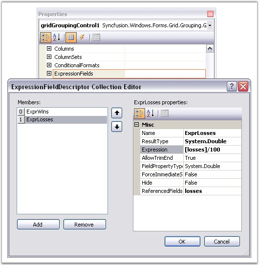{border="0"}

[]{style="FONT-FAMILY: 'Trebuchet MS','sans-serif'; COLOR: #15428b; FONT-SIZE: 9pt"} 

*[Figure ]{style="FONT-SIZE: 9pt"}[296]{style="FONT-SIZE: 9pt"}[: ExpressionFieldDescriptor Collection Editor]{style="FONT-SIZE: 9pt"}*

**[]{style="FONT-FAMILY: 'Segoe UI','sans-serif'; COLOR: #4a5c8c; FONT-SIZE: 8pt"}** 

[]{style="FONT-FAMILY: 'Trebuchet MS','sans-serif'; FONT-SIZE: 8pt"} 

Programmatically

[]{style="FONT-FAMILY: 'Segoe UI','sans-serif'"} 

Expression Fields can also be set through code. The following code example adds two expression fields to the Statistics table.

[]{style="FONT-FAMILY: 'Segoe UI','sans-serif'; FONT-SIZE: 8pt"} 

+---------------------------------------------------------------------------------------------------------------------------------------------------------------------------------------------------------------------------------------------------------------------------------------------------------------------------------------------------------------------------------------------------------------------+
| **[\[C#\]]{style="FONT-FAMILY: 'Courier New'; COLOR: black"}**                                                                                                                                                                                                                                                                                                                                                      |
|                                                                                                                                                                                                                                                                                                                                                                                                                     |
| []{style="FONT-FAMILY: 'Courier New'; COLOR: #15428b; FONT-SIZE: 9pt"}                                                                                                                                                                                                                                                                                                                                              |
|                                                                                                                                                                                                                                                                                                                                                                                                                     |
| [// Define expression fields.]{style="FONT-FAMILY: 'Courier New'; COLOR: green; FONT-SIZE: 9pt"}                                                                                                                                                                                                                                                                                                                    |
|                                                                                                                                                                                                                                                                                                                                                                                                                     |
| [ExpressionFieldDescriptor]{style="FONT-FAMILY: 'Courier New'; COLOR: #2b91af; FONT-SIZE: 9pt"}[ exp1 = [new]{style="COLOR: blue"} [ExpressionFieldDescriptor]{style="COLOR: #2b91af"}([\"Winning %\"]{style="COLOR: #a31515"}, [\"(\[wins\] \*100)/(\[wins\]+\[ties\]+\[losses\])\"]{style="COLOR: #a31515"}, [\"System.Double\"]{style="COLOR: #a31515"});]{style="FONT-FAMILY: 'Courier New'; FONT-SIZE: 9pt"}   |
|                                                                                                                                                                                                                                                                                                                                                                                                                     |
| [ExpressionFieldDescriptor]{style="FONT-FAMILY: 'Courier New'; COLOR: #2b91af; FONT-SIZE: 9pt"}[ exp1 = [new]{style="COLOR: blue"} [ExpressionFieldDescriptor]{style="COLOR: #2b91af"}([\"Loosing %\"]{style="COLOR: #a31515"}, [\"(\[losses\] \*100)/(\[wins\]+\[ties\]+\[losses\])\"]{style="COLOR: #a31515"}, [\"System.Double\"]{style="COLOR: #a31515"});]{style="FONT-FAMILY: 'Courier New'; FONT-SIZE: 9pt"} |
|                                                                                                                                                                                                                                                                                                                                                                                                                     |
| []{style="FONT-FAMILY: 'Courier New'; FONT-SIZE: 9pt"}                                                                                                                                                                                                                                                                                                                                                              |
|                                                                                                                                                                                                                                                                                                                                                                                                                     |
| [// Add the expression fields to the grid table.]{style="FONT-FAMILY: 'Courier New'; COLOR: green; FONT-SIZE: 9pt"}                                                                                                                                                                                                                                                                                                 |
|                                                                                                                                                                                                                                                                                                                                                                                                                     |
| [this]{style="FONT-FAMILY: 'Courier New'; COLOR: blue; FONT-SIZE: 9pt"}[.gridGroupingControl1.TableDescriptor.ExpressionFields.AddRange([new]{style="COLOR: blue"} Syncfusion.Grouping.[ExpressionFieldDescriptor]{style="COLOR: #2b91af"}\[\] { exp1, exp2 });]{style="FONT-FAMILY: 'Courier New'; FONT-SIZE: 9pt"}                                                                                                |
+---------------------------------------------------------------------------------------------------------------------------------------------------------------------------------------------------------------------------------------------------------------------------------------------------------------------------------------------------------------------------------------------------------------------+

[]{style="FONT-FAMILY: 'Trebuchet MS','sans-serif'; COLOR: #15428b; FONT-SIZE: 9pt"} 

+---------------------------------------------------------------------------------------------------------------------------------------------------------------------------------------------------------------------------------------------------------------------------------------------------------------------------------------------------------------------------------------------------------------------+
| **[\[VB.NET\]]{style="FONT-FAMILY: 'Courier New'; COLOR: black"}**                                                                                                                                                                                                                                                                                                                                                  |
|                                                                                                                                                                                                                                                                                                                                                                                                                     |
| []{style="FONT-FAMILY: 'Courier New'; COLOR: #15428b; FONT-SIZE: 9pt"}                                                                                                                                                                                                                                                                                                                                              |
|                                                                                                                                                                                                                                                                                                                                                                                                                     |
| [\' Define expression fields.]{style="FONT-FAMILY: 'Courier New'; COLOR: green; FONT-SIZE: 9pt"}                                                                                                                                                                                                                                                                                                                    |
|                                                                                                                                                                                                                                                                                                                                                                                                                     |
| [Dim]{style="FONT-FAMILY: 'Courier New'; COLOR: blue; FONT-SIZE: 9pt"}[ exp1 [As]{style="COLOR: blue"} ExpressionFieldDescriptor = [New]{style="COLOR: blue"} ExpressionFieldDescriptor([\"Winning %\"]{style="COLOR: #a31515"}, [\"(\[wins\] \*100)/(\[wins\]+\[ties\]+\[losses\])\"]{style="COLOR: #a31515"}, [\"System.Double\"]{style="COLOR: #a31515"})]{style="FONT-FAMILY: 'Courier New'; FONT-SIZE: 9pt"}   |
|                                                                                                                                                                                                                                                                                                                                                                                                                     |
| [Dim]{style="FONT-FAMILY: 'Courier New'; COLOR: blue; FONT-SIZE: 9pt"}[ exp2 [As]{style="COLOR: blue"} ExpressionFieldDescriptor = [New]{style="COLOR: blue"} ExpressionFieldDescriptor([\"Loosing %\"]{style="COLOR: #a31515"}, [\"(\[losses\] \*100)/(\[wins\]+\[ties\]+\[losses\])\"]{style="COLOR: #a31515"}, [\"System.Double\"]{style="COLOR: #a31515"})]{style="FONT-FAMILY: 'Courier New'; FONT-SIZE: 9pt"} |
|                                                                                                                                                                                                                                                                                                                                                                                                                     |
| []{style="FONT-FAMILY: 'Courier New'; FONT-SIZE: 9pt"}                                                                                                                                                                                                                                                                                                                                                              |
|                                                                                                                                                                                                                                                                                                                                                                                                                     |
| [\' Add the expression fields to the grid table.]{style="FONT-FAMILY: 'Courier New'; COLOR: green; FONT-SIZE: 9pt"}                                                                                                                                                                                                                                                                                                 |
|                                                                                                                                                                                                                                                                                                                                                                                                                     |
| [this.gridGroupingControl1.TableDescriptor.ExpressionFields.AddRange([New]{style="COLOR: blue"} Syncfusion.Grouping.ExpressionFieldDescriptor() {exp1, exp2})]{style="FONT-FAMILY: 'Courier New'; FONT-SIZE: 9pt"}                                                                                                                                                                                                  |
+---------------------------------------------------------------------------------------------------------------------------------------------------------------------------------------------------------------------------------------------------------------------------------------------------------------------------------------------------------------------------------------------------------------------+

[]{style="FONT-FAMILY: 'Trebuchet MS','sans-serif'; COLOR: #15428b; FONT-SIZE: 9pt"} 

The screen shot given below highlights these expression fields.

[]{style="FONT-FAMILY: 'Trebuchet MS','sans-serif'; COLOR: #15428b; FONT-SIZE: 9pt"} 

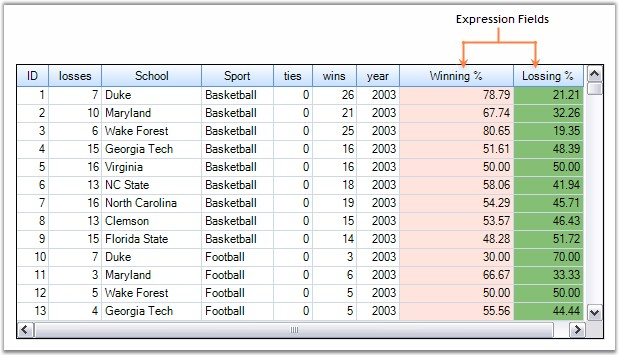{border="0"}

***[]{style="FONT-FAMILY: 'Trebuchet MS','sans-serif'; COLOR: #15428b; FONT-SIZE: 9pt"}*** 

*[Figure ]{style="FONT-SIZE: 9pt"}[297]{style="FONT-SIZE: 9pt"}[: Setting Expression Fields Through Code]{style="FONT-SIZE: 9pt"}*

[]{style="FONT-FAMILY: 'Trebuchet MS','sans-serif'; COLOR: #15428b; FONT-SIZE: 9pt"} 

::: {style="BORDER-BOTTOM: windowtext 1pt solid; BORDER-LEFT: medium none; PADDING-BOTTOM: 1pt; MARGIN-TOP: 9pt; PADDING-LEFT: 0pt; PADDING-RIGHT: 0pt; MARGIN-BOTTOM: 9pt; BORDER-TOP: windowtext 1pt solid; BORDER-RIGHT: medium none; PADDING-TOP: 1pt"}
{border="0"}Note: For more details, refer the following browser sample:

 

\<Install Location\>\\Syncfusion\\EssentialStudio\\\[Version Number\]\\Windows\\Grid.Grouping.Windows\\Samples\\2.0\\Filters and Expressions\\Expression Field Demo
:::

 

[]{#p431}[]{style="FONT-FAMILY: 'Trebuchet MS','sans-serif'; COLOR: #15428b; FONT-SIZE: 9pt"} 

See Also

 

 

4.3.4.3.4.1.1      Nested Expression Fields

[]{style="FONT-FAMILY: 'Trebuchet MS','sans-serif'; COLOR: #15428b; FONT-SIZE: 9pt"} 

Expression fields can be **nested**, means that the formula expression of an expression fields can have reference to other fields. Given below are examples for nested expression fields.

[]{style="FONT-FAMILY: 'Trebuchet MS','sans-serif'; COLOR: #15428b; FONT-SIZE: 9pt"} 

[·      ]{style="FONT-FAMILY: Symbol"}ExpressionField1.Expression = \" \[Col1\] \* 100 \"

[·      ]{style="FONT-FAMILY: Symbol"}ExpressionField2.Expression = \" \[ExpressionField1\] + 0.5 \"

[·      ]{style="FONT-FAMILY: Symbol"}ExpressionField3.Expression = \" \[ExpressionField1\] + \[ExpressionField2\] \"

[]{style="FONT-FAMILY: 'Trebuchet MS','sans-serif'; COLOR: #15428b; FONT-SIZE: 9pt"} 

Sample Code

[]{style="FONT-FAMILY: 'Trebuchet MS','sans-serif'; COLOR: #15428b; FONT-SIZE: 9pt"} 

The following code examples are used to create nested expression fields.

[]{style="FONT-FAMILY: 'Trebuchet MS','sans-serif'; FONT-SIZE: 9pt"} 

+----------------------------------------------------------------------------------------------------------------------------------------------------------------------------------------------------------------------------------------------------------------------------------------------------------------------------------------------------------------------------------------------+
| **[\[C#\]]{style="FONT-FAMILY: 'Courier New'; COLOR: black"}**                                                                                                                                                                                                                                                                                                                               |
|                                                                                                                                                                                                                                                                                                                                                                                              |
| []{style="FONT-FAMILY: 'Courier New'; COLOR: black"}                                                                                                                                                                                                                                                                                                                                         |
|                                                                                                                                                                                                                                                                                                                                                                                              |
| [// Define expression fields that are nested.]{style="FONT-FAMILY: 'Courier New'; COLOR: green"}                                                                                                                                                                                                                                                                                             |
|                                                                                                                                                                                                                                                                                                                                                                                              |
| [ExpressionFieldDescriptor]{style="FONT-FAMILY: 'Courier New'; COLOR: #2b91af"}[ expField1 = [new]{style="COLOR: blue"} [ExpressionFieldDescriptor]{style="COLOR: #2b91af"}([\"ExpCol1\"]{style="COLOR: #a31515"}, [\"\[wins\]+\[ties\]+\[losses\]\"]{style="COLOR: #a31515"}, [typeof]{style="COLOR: blue"}(System.[Double]{style="COLOR: #2b91af"}));]{style="FONT-FAMILY: 'Courier New'"} |
|                                                                                                                                                                                                                                                                                                                                                                                              |
| [ExpressionFieldDescriptor]{style="FONT-FAMILY: 'Courier New'; COLOR: #2b91af"}[ expField2 = [new]{style="COLOR: blue"} [ExpressionFieldDescriptor]{style="COLOR: #2b91af"}([\"ExpCol2\"]{style="COLOR: #a31515"}, [\"\[ExpCol1\]\*100\"]{style="COLOR: #a31515"}, [typeof]{style="COLOR: blue"}(System.[Double]{style="COLOR: #2b91af"}));]{style="FONT-FAMILY: 'Courier New'"}             |
|                                                                                                                                                                                                                                                                                                                                                                                              |
| []{style="FONT-FAMILY: 'Courier New'"}                                                                                                                                                                                                                                                                                                                                                       |
|                                                                                                                                                                                                                                                                                                                                                                                              |
| [// Add these expression fields to the grid table.        ]{style="FONT-FAMILY: 'Courier New'; COLOR: green"}                                                                                                                                                                                                                                                                                |
|                                                                                                                                                                                                                                                                                                                                                                                              |
| [this]{style="FONT-FAMILY: 'Courier New'; COLOR: blue"}[.gridGroupingControl1.TableDescriptor.ExpressionFields.AddRange([new]{style="COLOR: blue"} [ExpressionFieldDescriptor]{style="COLOR: #2b91af"}\[\] { expField1, expField2 });]{style="FONT-FAMILY: 'Courier New'"}                                                                                                                   |
|                                                                                                                                                                                                                                                                                                                                                                                              |
| []{style="FONT-FAMILY: 'Courier New'"}                                                                                                                                                                                                                                                                                                                                                       |
|                                                                                                                                                                                                                                                                                                                                                                                              |
| [// Appearance Settings.]{style="FONT-FAMILY: 'Courier New'; COLOR: green"}                                                                                                                                                                                                                                                                                                                  |
|                                                                                                                                                                                                                                                                                                                                                                                              |
| [this]{style="FONT-FAMILY: 'Courier New'; COLOR: blue"}[.gridGroupingControl1.TableDescriptor.Columns\[[\"ExpCol1\"]{style="COLOR: #a31515"}\].Appearance.AnyRecordFieldCell.BackColor = [Color]{style="COLOR: #2b91af"}.Cornsilk;]{style="FONT-FAMILY: 'Courier New'"}                                                                                                                      |
|                                                                                                                                                                                                                                                                                                                                                                                              |
| [this]{style="FONT-FAMILY: 'Courier New'; COLOR: blue"}[.gridGroupingControl1.TableDescriptor.Columns\[[\"ExpCol2\"]{style="COLOR: #a31515"}\].Appearance.AnyRecordFieldCell.BackColor = [Color]{style="COLOR: #2b91af"}.Cornsilk;]{style="FONT-FAMILY: 'Courier New'"}                                                                                                                      |
+----------------------------------------------------------------------------------------------------------------------------------------------------------------------------------------------------------------------------------------------------------------------------------------------------------------------------------------------------------------------------------------------+

[]{style="FONT-FAMILY: 'Trebuchet MS','sans-serif'; COLOR: #15428b; FONT-SIZE: 9pt"} 

+----------------------------------------------------------------------------------------------------------------------------------------------------------------------------------------------------------------------------------------------------------------------------------------------------------------------------------------------------------------------+
| **[\[VB.NET\]]{style="FONT-FAMILY: 'Courier New'; COLOR: black"}**                                                                                                                                                                                                                                                                                                   |
|                                                                                                                                                                                                                                                                                                                                                                      |
| []{style="FONT-FAMILY: 'Courier New'; COLOR: black"}                                                                                                                                                                                                                                                                                                                 |
|                                                                                                                                                                                                                                                                                                                                                                      |
| [\' Define expression fields that are nested.]{style="FONT-FAMILY: 'Courier New'; COLOR: green"}                                                                                                                                                                                                                                                                     |
|                                                                                                                                                                                                                                                                                                                                                                      |
| [Dim]{style="FONT-FAMILY: 'Courier New'; COLOR: blue"}[ expField1 [As]{style="COLOR: blue"} ExpressionFieldDescriptor = [New]{style="COLOR: blue"} ExpressionFieldDescriptor([\"ExpCol1\"]{style="COLOR: #a31515"}, [\"\[wins\]+\[ties\]+\[losses\]\"]{style="COLOR: #a31515"}, [GetType]{style="COLOR: blue"}(System.Double)))]{style="FONT-FAMILY: 'Courier New'"} |
|                                                                                                                                                                                                                                                                                                                                                                      |
| [Dim]{style="FONT-FAMILY: 'Courier New'; COLOR: blue"}[ expField1 [As]{style="COLOR: blue"} ExpressionFieldDescriptor = [New]{style="COLOR: blue"} ExpressionFieldDescriptor([\"ExpCol2\"]{style="COLOR: #a31515"}, [\"\[ExpCol1\]\*100\"]{style="COLOR: #a31515"}, [GetType]{style="COLOR: blue"}(System.Double))]{style="FONT-FAMILY: 'Courier New'"}              |
|                                                                                                                                                                                                                                                                                                                                                                      |
| []{style="FONT-FAMILY: 'Courier New'"}                                                                                                                                                                                                                                                                                                                               |
|                                                                                                                                                                                                                                                                                                                                                                      |
| [\' Add these expression fields to the grid table.]{style="FONT-FAMILY: 'Courier New'; COLOR: green"}                                                                                                                                                                                                                                                                |
|                                                                                                                                                                                                                                                                                                                                                                      |
| [Me]{style="FONT-FAMILY: 'Courier New'; COLOR: blue"}[.gridGroupingControl1.TableDescriptor.ExpressionFields.AddRange([New]{style="COLOR: blue"} ExpressionFieldDescriptor() {expField1, expField2})]{style="FONT-FAMILY: 'Courier New'"}                                                                                                                            |
|                                                                                                                                                                                                                                                                                                                                                                      |
| []{style="FONT-FAMILY: 'Courier New'"}                                                                                                                                                                                                                                                                                                                               |
|                                                                                                                                                                                                                                                                                                                                                                      |
| [\' Appearance Settings.]{style="FONT-FAMILY: 'Courier New'; COLOR: green"}                                                                                                                                                                                                                                                                                          |
|                                                                                                                                                                                                                                                                                                                                                                      |
| [Me]{style="FONT-FAMILY: 'Courier New'; COLOR: blue"}[.gridGroupingControl1.TableDescriptor.Columns([\"ExpCol1\"]{style="COLOR: #a31515"}).Appearance.AnyRecordFieldCell.BackColor = Color.Cornsilk]{style="FONT-FAMILY: 'Courier New'"}                                                                                                                             |
|                                                                                                                                                                                                                                                                                                                                                                      |
| [Me]{style="FONT-FAMILY: 'Courier New'; COLOR: blue"}[.gridGroupingControl1.TableDescriptor.Columns([\"ExpCol2\"]{style="COLOR: #a31515"}).Appearance.AnyRecordFieldCell.BackColor = Color.Cornsilk]{style="FONT-FAMILY: 'Courier New'"}                                                                                                                             |
+----------------------------------------------------------------------------------------------------------------------------------------------------------------------------------------------------------------------------------------------------------------------------------------------------------------------------------------------------------------------+

[]{style="FONT-FAMILY: 'Trebuchet MS','sans-serif'; COLOR: #15428b; FONT-SIZE: 9pt"} 

Here is a sample screen shot showing two expression fields **ExpCol1** and **ExpCol2** where **ExpCol2** is referencing **ExpCol1**.

[]{style="FONT-FAMILY: 'Trebuchet MS','sans-serif'; FONT-SIZE: 9pt"} 

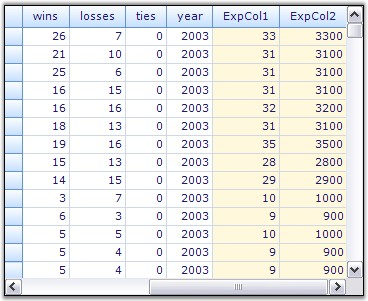{border="0"}

[]{style="FONT-FAMILY: 'Trebuchet MS','sans-serif'; COLOR: #15428b; FONT-SIZE: 9pt"} 

*[Figure ]{style="FONT-SIZE: 9pt"}[298]{style="FONT-SIZE: 9pt"}[: Nested Expression Fields]{style="FONT-SIZE: 9pt"}*

 

[]{#p432} 

 

4.3.4.3.4.1.2      List of Expressions

[]{style="FONT-FAMILY: 'Trebuchet MS','sans-serif'; COLOR: #15428b; FONT-SIZE: 9pt"} 

A note on Valid Expression Syntax

 

Expressions may be any well-formed algebraic combination of column mapping names enclosed with brackets (\[\]), numerical constants and literals, and the algebraic and logical operators are listed below.

 

The computations are performed as listed, with level one operations done first. Alpha constants used with match and like should be enclosed in apostrophes (\').

[]{style="FONT-FAMILY: 'Trebuchet MS','sans-serif'; COLOR: #15428b; FONT-SIZE: 9pt"} 

[·      ]{style="FONT-FAMILY: Symbol"}\*, / : multiplication, division.

[·      ]{style="FONT-FAMILY: Symbol"}+, - : addition, subtraction.

[·      ]{style="FONT-FAMILY: Symbol"}\<, \>, =, \<=, \>=: less than, greater than, equal, less than or equal.

[·      ]{style="FONT-FAMILY: Symbol"}match, like, in, between.

[·      ]{style="FONT-FAMILY: Symbol"}or, and.

[]{style="FONT-SIZE: 8pt"} 

Below is the list of operators used and their descriptions.

[]{style="COLOR: black"} 

::: {align="center"}
  -------------------------- ------------- ----------------------------------------------------------------------------------------------------------------------------------------------------------------------------------------------------------------------------------------------------------------------------------------------------------------------------------------------------------------------------------------------------------------------------------- ---------------------------------------------------------------------------
  Expression                 Syntax        Description                                                                                                                                                                                                                                                                                                                                                                                                                         Example Usage
  Multiplication, Division   \*,/          Multiplies/Divides first argument by second arguMultiplies/Divides first argument by second argument.                                                                                                                                                                                                                                                                                                                               \[Wins\] \* \[Losses\] / 100
  Addition, Subtraction      +,-           Adds first argument with second argument/ Subtracts second argument from the first one.                                                                                                                                                                                                                                                                                                                                             \[Wins\]+\[Losses\]
  Or                         OR            Returns 1 if either the first argument or the second one returns true.                                                                                                                                                                                                                                                                                                                                                              \[Val\]=50 OR \[Val\]=100
  And                        AND           Returns 1 if both parameters return true.                                                                                                                                                                                                                                                                                                                                                                                           \[Val\]\< 50 AND \[Val\]\>100
  Less than                  \<            Returns true if first parameter is less than the second one.                                                                                                                                                                                                                                                                                                                                                                        \[OrderID\] \< 2000
  Greater than               \>            Returns true if first parameter is greater than the second one.                                                                                                                                                                                                                                                                                                                                                                     \[OrderID\] \> 2500
  Less than Or Equal to      \<=           Returns true if first parameter is less than or equal to the second one.                                                                                                                                                                                                                                                                                                                                                            \[OrderID\] \<= 2050
  Greater than Or Equal to   \>=           Returns true if first parameter is greater than or equal to the second one.                                                                                                                                                                                                                                                                                                                                                         \[OrderID\] \>= 2056
  Equal                      =             Returns true if both arguments have same value.                                                                                                                                                                                                                                                                                                                                                                                     \[CustomerID\] = 90
  Not Equal to               \<\>          Returns true if both arguments does not have same value.                                                                                                                                                                                                                                                                                                                                                                            \[CustomerID\] \<\> 95
  Match                      match         Returns 1 if there is any occurrence of the right-hand argument in the left-hand argument. For example, \[CompanyName\] match \'RTR\' returns 0 for any record whose CompanyName field does not contain RTR anywhere in the string.                                                                                                                                                                                                 \[Company\] match \'Syncfusion\'
  Like                       Like          Checks if the field starts exactly as specified in the right-hand argument. For example, \[CompanyName\] like \'RTR\' returns 1 for any record whose CompanyName field is exactly RTR. You can use an asterisk as a wildcard. \[CompanyName\] like \'RTR\*\' returns 1 for any record whose CompanyName field starts with RTR. \[CompanyName\] like \'\*RTR\' returns 1 for any record whose CompanyName field ends with RTR.       \[Sport\] like \'Basket\*\'
  In                         in            Checks if the field value is any of the values listed in the right-hand operand. The collection of items used as the right-hand should be separated by commas and enclosed with brackets({}). For example, \[code\] in {1,10,21} returns 1 for any record whose code field contains 1, 10 or 21. \[CompanyName\] in {RTR,MAS} returns 1 for any record whose CompanyName field is RTR or MAS.                                       \[Country\] in {\"USA\", \"UK\"}
  Between                    between       Checks if a date field value between the two values is listed in the right-hand operand. For example, \[date\] between {2/25/2004, 3/2/2004} returns 1 for any record whose date field is greater or equal 2/25/2004 and less than 3/2/2004. To represent the current date, use the token TODAY. To represent DateTime.MinValue, leave the first argument empty. To represent DateTime.MaxValue, leave the second argument empty.   \[OrderDate\] between {2/25/2007, TODAY}
  Between time               betweentime   Checks if a time in the date field value between the two values is listed in the right-hand operand. For example, \[time\] between {04:00:00 PM, 05:00:00 PM} returns 1 for any record whose date field is greater than or equal  to 04:00 and less than 05:00. The time will be calculated along with the date for betweentime.                                                                                                    \[OrderDate\] between {"04/17/2008 9:00:00 PM", "04/21/2008 07:00:00 AM"}
  -------------------------- ------------- ----------------------------------------------------------------------------------------------------------------------------------------------------------------------------------------------------------------------------------------------------------------------------------------------------------------------------------------------------------------------------------------------------------------------------------- ---------------------------------------------------------------------------
:::

 

[]{#p433} 

 

###### []{#_RecordFilters}4.3.4.3.4.2 RecordFilters {#recordfilters style="tab-stops: 0pt"}

[]{style="FONT-FAMILY: 'Trebuchet MS','sans-serif'; COLOR: #15428b; FONT-SIZE: 9pt"} 

**RecordFilters** otherwise called as **RowFilters** will allow you to restrict displayed records to those that will satisfy the logical condition that you specify with a FilterRowDescriptor. You have the option of typing an expression (similar to an Expression Field) or entering a condition using an editor dialog.

[]{style="FONT-FAMILY: 'Verdana','sans-serif'; FONT-SIZE: 8pt"} 

RecordFilters Collection

 

The RecordFilters collection defines filter criteria for showing or hiding records. Each filter in this collection is internally maintained by a **RecordFilterDescriptor**. All the RecordFilterDescriptors for a given filter are managed by the **RecordFilterDescriptorCollection** which is returned by the RecordFilters property of the TableDescriptor. Filters can be specified through text formulas similar to expression fields or through the entries of **FilterConditionCollection**. FilterConditionCollection is a set of conditions each with a **CompareOperator** and a **CompareValue** to compare with the value retrieved from the record. A condition can also have a custom **ICustomFilter** object if you want to provide your own logic for evaluating filter criteria.

 

Adding Filters Through Designer

**[]{style="FONT-FAMILY: 'Verdana','sans-serif'; COLOR: #4a5c8c; FONT-SIZE: 8pt"}** 

Record Filters can easily be added through the designer. Opening the TableDescriptor.RecordFilters property in the property window will display the RecordFilterDescriptor Collection Editor that allows you to define record filters. The designer settings shown in the below image will setup a record filter for the field **\'wins\',** to display only the records with **wins \> 20**.

[]{style="FONT-FAMILY: 'Trebuchet MS','sans-serif'; COLOR: #15428b; FONT-SIZE: 9pt"} 

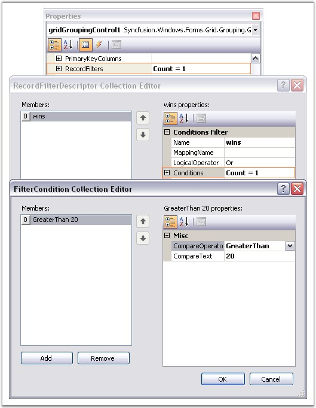{border="0"}

[]{style="FONT-FAMILY: 'Trebuchet MS','sans-serif'; COLOR: #15428b; FONT-SIZE: 9pt"} 

*[Figure ]{style="FONT-SIZE: 9pt"}[299]{style="FONT-SIZE: 9pt"}[: RecordFilterDescriptor Collection Editor]{style="FONT-SIZE: 9pt"}*

[]{style="FONT-FAMILY: 'Trebuchet MS','sans-serif'; COLOR: #15428b; FONT-SIZE: 9pt"} 

Here is the description for some important properties used to set a row filter.

[]{style="COLOR: black"} 

::: {align="center"}
  ----------------- ----------------------------------------------------------------------------
  Property          Description
  Name              Specifies the name of the field with which the filter is compared.
  Conditions        A collection of conditions each with a CompareOperator and a CompareValue.
  Expression        A formula expression similar to expression fields.
  LogicalOperator   Indicates the logical operator used if multiple conditions are given.
  ----------------- ----------------------------------------------------------------------------
:::

**[]{style="COLOR: #4a5c8c; FONT-SIZE: 9pt"}** 

Programmatically

 

To add a record filter, you must create a RecordFilterDescriptor by specifying the field name with which the filter should be compared and a filter condition that contains a CompareOperator and a CompareValue. The possible options for a CompareOperator are Equals, NotEquals, LessThan, LessThanOrEqualTo, GreaterThan, GreaterThanOrEqualTo, Like, Match and Custom ( for Custom Filter). A filter criteria can also be specified as an expression text similar to the one used in expression fields. A LogicalOperator will be used when you specify more than one condition for a given filter. Finally add the record filter descriptor to the RecordFilters collection of the Table Descriptor.

 

Following code example illustrates how to add a record filter for the column \"wins\" to display only the records with wins \> 20.

[]{style="FONT-FAMILY: 'Trebuchet MS','sans-serif'; COLOR: #15428b; FONT-SIZE: 9pt"} 

+-------------------------------------------------------------------------------------------------------------------------------------------------------------------------------------------------------------------------------------------------------------------------------------------+
| **[\[C#\]]{style="FONT-FAMILY: 'Courier New'; COLOR: black"}**                                                                                                                                                                                                                            |
|                                                                                                                                                                                                                                                                                           |
| []{style="FONT-FAMILY: 'Courier New'; COLOR: black; FONT-SIZE: 9pt"}                                                                                                                                                                                                                      |
|                                                                                                                                                                                                                                                                                           |
| [FilterCondition]{style="FONT-FAMILY: 'Courier New'; COLOR: #2b91af; FONT-SIZE: 9pt"}[ cond = [new]{style="COLOR: blue"} [FilterCondition]{style="COLOR: #2b91af"}([FilterCompareOperator]{style="COLOR: #2b91af"}.GreaterThan, 20);]{style="FONT-FAMILY: 'Courier New'; FONT-SIZE: 9pt"} |
|                                                                                                                                                                                                                                                                                           |
| [RecordFilterDescriptor]{style="FONT-FAMILY: 'Courier New'; COLOR: #2b91af; FONT-SIZE: 9pt"}[ filter = [new]{style="COLOR: blue"} [RecordFilterDescriptor]{style="COLOR: #2b91af"}([\"wins\"]{style="COLOR: #a31515"}, cond);]{style="FONT-FAMILY: 'Courier New'; FONT-SIZE: 9pt"}        |
|                                                                                                                                                                                                                                                                                           |
| [this]{style="FONT-FAMILY: 'Courier New'; COLOR: blue; FONT-SIZE: 9pt"}[.gridGroupingControl1.TableDescriptor.RecordFilters.Add(filter);]{style="FONT-FAMILY: 'Courier New'; FONT-SIZE: 9pt"}                                                                                             |
+-------------------------------------------------------------------------------------------------------------------------------------------------------------------------------------------------------------------------------------------------------------------------------------------+

[]{style="FONT-FAMILY: 'Trebuchet MS','sans-serif'; COLOR: #15428b; FONT-SIZE: 9pt"} 

+------------------------------------------------------------------------------------------------------------------------------------------------------------------------------------------------------------------------------------------------------------------------------------+
| **[\[VB.NET\]]{style="FONT-FAMILY: 'Courier New'; COLOR: black"}**                                                                                                                                                                                                                 |
|                                                                                                                                                                                                                                                                                    |
| []{style="FONT-FAMILY: 'Courier New'; COLOR: #15428b; FONT-SIZE: 9pt"}                                                                                                                                                                                                             |
|                                                                                                                                                                                                                                                                                    |
| [Dim]{style="FONT-FAMILY: 'Courier New'; COLOR: blue; FONT-SIZE: 9pt"}[ cond [As]{style="COLOR: blue"} FilterCondition = [New]{style="COLOR: blue"} FilterCondition(FilterCompareOperator.GreaterThan, 20)]{style="FONT-FAMILY: 'Courier New'; FONT-SIZE: 9pt"}                    |
|                                                                                                                                                                                                                                                                                    |
| [Dim]{style="FONT-FAMILY: 'Courier New'; COLOR: blue; FONT-SIZE: 9pt"}[ filter [As]{style="COLOR: blue"} RecordFilterDescriptor = [New]{style="COLOR: blue"} RecordFilterDescriptor([\"wins\"]{style="COLOR: #a31515"}, cond)]{style="FONT-FAMILY: 'Courier New'; FONT-SIZE: 9pt"} |
|                                                                                                                                                                                                                                                                                    |
| [Me]{style="FONT-FAMILY: 'Courier New'; COLOR: blue; FONT-SIZE: 9pt"}[.gridGroupingControl1.TableDescriptor.RecordFilters.Add(filter)]{style="FONT-FAMILY: 'Courier New'; FONT-SIZE: 9pt"}                                                                                         |
+------------------------------------------------------------------------------------------------------------------------------------------------------------------------------------------------------------------------------------------------------------------------------------+

[]{style="FONT-FAMILY: 'Trebuchet MS','sans-serif'; COLOR: #15428b; FONT-SIZE: 9pt"} 

Given below is a sample screen shot showing the grid filtered with **wins \> 20**.

[]{style="FONT-FAMILY: 'Trebuchet MS','sans-serif'; COLOR: #15428b; FONT-SIZE: 9pt"} 

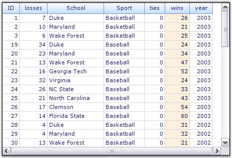{border="0"}

***[]{style="FONT-FAMILY: 'Trebuchet MS','sans-serif'; COLOR: #15428b; FONT-SIZE: 9pt"}*** 

*[Figure ]{style="FONT-SIZE: 9pt"}[300]{style="FONT-SIZE: 9pt"}[: Adding Record Filters Through Code]{style="FONT-SIZE: 9pt"}*

[]{style="FONT-FAMILY: 'Trebuchet MS','sans-serif'; COLOR: #15428b; FONT-SIZE: 9pt"} 

::: {style="BORDER-BOTTOM: windowtext 1pt solid; BORDER-LEFT: medium none; PADDING-BOTTOM: 1pt; MARGIN-TOP: 9pt; PADDING-LEFT: 0pt; PADDING-RIGHT: 0pt; MARGIN-BOTTOM: 9pt; BORDER-TOP: windowtext 1pt solid; BORDER-RIGHT: medium none; PADDING-TOP: 1pt"}
 

{border="0"}Note: Filter Expressions share the same format as in expression fields. For a list of valid expressions, refer [List of Filter Expressions.]{.UGHyperlink}[]{.UGHyperlink}
:::

**[]{style="COLOR: navy; FONT-SIZE: 9pt"}** 

Nested Tables

 

Record Filters can also be set to the nested tables by accessing the RecordFilters collection of the ChildTableDescriptor.

[]{style="FONT-FAMILY: 'Trebuchet MS','sans-serif'; COLOR: #15428b; FONT-SIZE: 9pt"} 

+-----------------------------------------------------------------------------------------------------------------------------------------------------------------------------------------------------------------------------------------------------------+
| **[\[C#\]]{style="FONT-FAMILY: 'Courier New'; COLOR: black"}**                                                                                                                                                                                            |
|                                                                                                                                                                                                                                                           |
| []{style="FONT-FAMILY: 'Courier New'; COLOR: #15428b"}                                                                                                                                                                                                    |
|                                                                                                                                                                                                                                                           |
| [FilterCondition]{style="FONT-FAMILY: 'Courier New'; COLOR: #2b91af"}[ cond = [new]{style="COLOR: blue"} [FilterCondition]{style="COLOR: #2b91af"}([FilterCompareOperator]{style="COLOR: #2b91af"}.GreaterThan, 20);]{style="FONT-FAMILY: 'Courier New'"} |
|                                                                                                                                                                                                                                                           |
| [RecordFilterDescriptor]{style="FONT-FAMILY: 'Courier New'; COLOR: #2b91af"}[ filter = [new]{style="COLOR: blue"} [RecordFilterDescriptor]{style="COLOR: #2b91af"}([\"OrderID\"]{style="COLOR: #a31515"}, cond);]{style="FONT-FAMILY: 'Courier New'"}     |
|                                                                                                                                                                                                                                                           |
| [this]{style="FONT-FAMILY: 'Courier New'; COLOR: blue"}[.gridGroupingControl1.GetTableDescriptor([\"Orders\"]{style="COLOR: #a31515"}).RecordFilters.Add(filter);]{style="FONT-FAMILY: 'Courier New'"}                                                    |
+-----------------------------------------------------------------------------------------------------------------------------------------------------------------------------------------------------------------------------------------------------------+

[]{style="FONT-FAMILY: 'Trebuchet MS','sans-serif'; COLOR: #15428b; FONT-SIZE: 9pt"} 

+------------------------------------------------------------------------------------------------------------------------------------------------------------------------------------------------------------------------------------------------------------------------------------+
| **[\[VB.NET\]]{style="FONT-FAMILY: 'Courier New'; COLOR: black"}**                                                                                                                                                                                                                 |
|                                                                                                                                                                                                                                                                                    |
| []{style="FONT-FAMILY: 'Courier New'; COLOR: black"}                                                                                                                                                                                                                               |
|                                                                                                                                                                                                                                                                                    |
| [Dim]{style="FONT-FAMILY: 'Courier New'; COLOR: blue"}[ ]{style="FONT-FAMILY: 'Courier New'; COLOR: teal"}[cond [As]{style="COLOR: blue"} FilterCondition = [New]{style="COLOR: blue"} FilterCondition(FilterCompareOperator.GreaterThan, 20)]{style="FONT-FAMILY: 'Courier New'"} |
|                                                                                                                                                                                                                                                                                    |
| [Dim]{style="FONT-FAMILY: 'Courier New'; COLOR: blue"}[ filter [As]{style="COLOR: blue"} RecordFilterDescriptor = [New]{style="COLOR: blue"} RecordFilterDescriptor([\"OrderID\"]{style="COLOR: #a31515"}, cond)]{style="FONT-FAMILY: 'Courier New'"}                              |
|                                                                                                                                                                                                                                                                                    |
| [Me]{style="FONT-FAMILY: 'Courier New'; COLOR: blue"}[.gridGroupingControl1.GetTableDescriptor(\"Orders\").RecordFilters.Add(filter)]{style="FONT-FAMILY: 'Courier New'"}                                                                                                          |
+------------------------------------------------------------------------------------------------------------------------------------------------------------------------------------------------------------------------------------------------------------------------------------+

[]{style="FONT-FAMILY: 'Trebuchet MS','sans-serif'; COLOR: #15428b; FONT-SIZE: 9pt"} 

Special Characters in Filter Values

 

To match the special characters like left bracket (\[), question mark (?), number sign (#) and asterisk (\*), enclose them in square brackets (like \[#\] for \# and  \[\*\] for \* etc.,). The right bracket (\]) can\'t be used within a group to match itself, but it can be used outside a group as an individual character.

 

This is illustrated in the below example with our Grid Grouping control.

[]{style="FONT-FAMILY: 'Trebuchet MS','sans-serif'; COLOR: #15428b; FONT-SIZE: 9pt"} 

+-------------------------------------------------------------------------------------------------------------------------------------------------------------------------------------------------------------------+
| **[\[C#\]]{style="FONT-FAMILY: 'Courier New'; COLOR: black"}**                                                                                                                                                    |
|                                                                                                                                                                                                                   |
| []{style="FONT-FAMILY: 'Courier New'; COLOR: #15428b"}                                                                                                                                                            |
|                                                                                                                                                                                                                   |
| [void]{style="FONT-FAMILY: 'Courier New'; COLOR: blue"}[ Form1_Load([object]{style="COLOR: blue"} sender, [EventArgs]{style="COLOR: #2b91af"} e)]{style="FONT-FAMILY: 'Courier New'"}                             |
|                                                                                                                                                                                                                   |
| [{]{style="FONT-FAMILY: 'Courier New'"}                                                                                                                                                                           |
|                                                                                                                                                                                                                   |
| [ArrayList]{style="FONT-FAMILY: 'Courier New'; COLOR: #2b91af"}[ rank = [new]{style="COLOR: blue"} [ArrayList]{style="COLOR: #2b91af"}();]{style="FONT-FAMILY: 'Courier New'"}                                    |
|                                                                                                                                                                                                                   |
| [RankData]{style="FONT-FAMILY: 'Courier New'; COLOR: #2b91af"}[ rankData = [new]{style="COLOR: blue"} [RankData]{style="COLOR: #2b91af"}([\"aaa\"]{style="COLOR: #a31515"});]{style="FONT-FAMILY: 'Courier New'"} |
|                                                                                                                                                                                                                   |
| [rank.Add(rankData);]{style="FONT-FAMILY: 'Courier New'"}                                                                                                                                                         |
|                                                                                                                                                                                                                   |
| [rankData = [new]{style="COLOR: blue"} [RankData]{style="COLOR: #2b91af"}([\"bbb#\"]{style="COLOR: #a31515"});]{style="FONT-FAMILY: 'Courier New'"}                                                               |
|                                                                                                                                                                                                                   |
| [rank.Add(rankData);]{style="FONT-FAMILY: 'Courier New'"}                                                                                                                                                         |
|                                                                                                                                                                                                                   |
| [gridGroupingControl1.DataSource = rank;]{style="FONT-FAMILY: 'Courier New'"}                                                                                                                                     |
|                                                                                                                                                                                                                   |
| [string]{style="FONT-FAMILY: 'Courier New'; COLOR: blue"}[ filter = [\"\"]{style="COLOR: #a31515"};]{style="FONT-FAMILY: 'Courier New'"}                                                                          |
|                                                                                                                                                                                                                   |
| [RecordFilterDescriptor]{style="FONT-FAMILY: 'Courier New'; COLOR: #2b91af"}[ rfd = [null]{style="COLOR: blue"};]{style="FONT-FAMILY: 'Courier New'"}                                                             |
|                                                                                                                                                                                                                   |
| [Record]{style="FONT-FAMILY: 'Courier New'; COLOR: #2b91af"}[ r = [null]{style="COLOR: blue"};]{style="FONT-FAMILY: 'Courier New'"}                                                                               |
|                                                                                                                                                                                                                   |
| []{style="FONT-FAMILY: 'Courier New'"}                                                                                                                                                                            |
|                                                                                                                                                                                                                   |
| [foreach]{style="FONT-FAMILY: 'Courier New'; COLOR: blue"}[ ([RankData]{style="COLOR: #2b91af"} a [in]{style="COLOR: blue"} rank)]{style="FONT-FAMILY: 'Courier New'"}                                            |
|                                                                                                                                                                                                                   |
| [{]{style="FONT-FAMILY: 'Courier New'"}                                                                                                                                                                           |
|                                                                                                                                                                                                                   |
| [filter = [\"\[WellName\] like \'\"]{style="COLOR: #a31515"} + ReplaceSpcChar(a.WellName) + [\"\'\"]{style="COLOR: #a31515"}; ]{style="FONT-FAMILY: 'Courier New'"}                                               |
|                                                                                                                                                                                                                   |
| [rfd = [new]{style="COLOR: blue"} [RecordFilterDescriptor]{style="COLOR: #2b91af"}(filter);]{style="FONT-FAMILY: 'Courier New'"}                                                                                  |
|                                                                                                                                                                                                                   |
| [gridGroupingControl1.TableDescriptor.RecordFilters.Add(rfd);]{style="FONT-FAMILY: 'Courier New'"}                                                                                                                |
|                                                                                                                                                                                                                   |
| [int]{style="FONT-FAMILY: 'Courier New'; COLOR: blue"}[ cont = gridGroupingControl1.Table.FilteredRecords.Count;]{style="FONT-FAMILY: 'Courier New'"}                                                             |
|                                                                                                                                                                                                                   |
| [r = [new]{style="COLOR: blue"} [Record]{style="COLOR: #2b91af"}(gridGroupingControl1.Table);]{style="FONT-FAMILY: 'Courier New'"}                                                                                |
|                                                                                                                                                                                                                   |
| []{style="FONT-FAMILY: 'Courier New'; COLOR: green"}                                                                                                                                                              |
|                                                                                                                                                                                                                   |
| [// Exception will be thrown here if special characters are not enclosed in square brackets.]{style="FONT-FAMILY: 'Courier New'; COLOR: green"}                                                                   |
|                                                                                                                                                                                                                   |
| [r = gridGroupingControl1.Table.FilteredRecords\[0\]; ]{style="FONT-FAMILY: 'Courier New'"}                                                                                                                       |
|                                                                                                                                                                                                                   |
| [rankData = r.GetData() [as]{style="COLOR: blue"} [RankData]{style="COLOR: #2b91af"};]{style="FONT-FAMILY: 'Courier New'"}                                                                                        |
|                                                                                                                                                                                                                   |
| [gridGroupingControl1.TableDescriptor.RecordFilters.Clear();]{style="FONT-FAMILY: 'Courier New'"}                                                                                                                 |
|                                                                                                                                                                                                                   |
| [}]{style="FONT-FAMILY: 'Courier New'"}                                                                                                                                                                           |
|                                                                                                                                                                                                                   |
| [}]{style="FONT-FAMILY: 'Courier New'"}                                                                                                                                                                           |
|                                                                                                                                                                                                                   |
| []{style="FONT-FAMILY: 'Courier New'; COLOR: blue"}                                                                                                                                                               |
|                                                                                                                                                                                                                   |
| [private]{style="FONT-FAMILY: 'Courier New'; COLOR: blue"}[ [string]{style="COLOR: blue"} ReplaceSpcChar([string]{style="COLOR: blue"} pattern)]{style="FONT-FAMILY: 'Courier New'"}                              |
|                                                                                                                                                                                                                   |
| [{]{style="FONT-FAMILY: 'Courier New'"}                                                                                                                                                                           |
|                                                                                                                                                                                                                   |
| [// Take caution while replacing the pattern and ensure that only the intended pattern is modified.]{style="FONT-FAMILY: 'Courier New'; COLOR: green"}                                                            |
|                                                                                                                                                                                                                   |
| [pattern = pattern.Replace([\"\[\"]{style="COLOR: #a31515"}, [\"\[\[\]\"]{style="COLOR: #a31515"});]{style="FONT-FAMILY: 'Courier New'"}                                                                          |
|                                                                                                                                                                                                                   |
| [pattern = pattern.Replace([\"#\"]{style="COLOR: #a31515"}, [\"\[#\]\"]{style="COLOR: #a31515"});]{style="FONT-FAMILY: 'Courier New'"}                                                                            |
|                                                                                                                                                                                                                   |
| [pattern = pattern.Replace([\"\*\"]{style="COLOR: #a31515"}, [\"\[\*\]\"]{style="COLOR: #a31515"});]{style="FONT-FAMILY: 'Courier New'"}                                                                          |
|                                                                                                                                                                                                                   |
| [pattern = pattern.Replace([\"?\"]{style="COLOR: #a31515"}, [\"\[?\]\"]{style="COLOR: #a31515"});]{style="FONT-FAMILY: 'Courier New'"}                                                                            |
|                                                                                                                                                                                                                   |
| [return]{style="FONT-FAMILY: 'Courier New'; COLOR: blue"}[ pattern;]{style="FONT-FAMILY: 'Courier New'"}                                                                                                          |
|                                                                                                                                                                                                                   |
| [}]{style="FONT-FAMILY: 'Courier New'"}                                                                                                                                                                           |
+-------------------------------------------------------------------------------------------------------------------------------------------------------------------------------------------------------------------+

[]{style="FONT-FAMILY: 'Trebuchet MS','sans-serif'; COLOR: #15428b; FONT-SIZE: 9pt"} 

+---------------------------------------------------------------------------------------------------------------------------------------------------------------------------------------------------------------------------------------------------------------------------------------------------------+
| **[\[VB.NET\]]{style="FONT-FAMILY: 'Courier New'; COLOR: black"}**                                                                                                                                                                                                                                      |
|                                                                                                                                                                                                                                                                                                         |
| []{style="FONT-FAMILY: 'Courier New'; COLOR: black"}                                                                                                                                                                                                                                                    |
|                                                                                                                                                                                                                                                                                                         |
| [Private]{style="FONT-FAMILY: 'Courier New'; COLOR: blue"}[ [Sub]{style="COLOR: blue"} Form1_Load([ByVal]{style="COLOR: blue"} sender [As]{style="COLOR: blue"} [Object]{style="COLOR: blue"}, [ByVal]{style="COLOR: blue"} e [As]{style="COLOR: blue"} EventArgs)]{style="FONT-FAMILY: 'Courier New'"} |
|                                                                                                                                                                                                                                                                                                         |
| [Dim]{style="FONT-FAMILY: 'Courier New'; COLOR: blue"}[ rank [As]{style="COLOR: blue"} [New]{style="COLOR: blue"} ArrayList()]{style="FONT-FAMILY: 'Courier New'"}                                                                                                                                      |
|                                                                                                                                                                                                                                                                                                         |
| [Dim]{style="FONT-FAMILY: 'Courier New'; COLOR: blue"}[ rankData [As]{style="COLOR: blue"} [New]{style="COLOR: blue"} RankData([\"aaa\"]{style="COLOR: #a31515"})]{style="FONT-FAMILY: 'Courier New'"}                                                                                                  |
|                                                                                                                                                                                                                                                                                                         |
| [rank.Add(rankData)]{style="FONT-FAMILY: 'Courier New'"}                                                                                                                                                                                                                                                |
|                                                                                                                                                                                                                                                                                                         |
| [rankData = [New]{style="COLOR: blue"} RankData([\"bbb#\"]{style="COLOR: #a31515"})]{style="FONT-FAMILY: 'Courier New'"}                                                                                                                                                                                |
|                                                                                                                                                                                                                                                                                                         |
| [rank.Add(rankData)]{style="FONT-FAMILY: 'Courier New'"}                                                                                                                                                                                                                                                |
|                                                                                                                                                                                                                                                                                                         |
| [gridGroupingControl1.DataSource = rank]{style="FONT-FAMILY: 'Courier New'"}                                                                                                                                                                                                                            |
|                                                                                                                                                                                                                                                                                                         |
| [Dim]{style="FONT-FAMILY: 'Courier New'; COLOR: blue"}[ filter [As]{style="COLOR: blue"} [String]{style="COLOR: blue"} = [\"\"]{style="COLOR: #a31515"}]{style="FONT-FAMILY: 'Courier New'"}                                                                                                            |
|                                                                                                                                                                                                                                                                                                         |
| [Dim]{style="FONT-FAMILY: 'Courier New'; COLOR: blue"}[ rfd [As]{style="COLOR: blue"} RecordFilterDescriptor = [Nothing]{style="COLOR: blue"}]{style="FONT-FAMILY: 'Courier New'"}                                                                                                                      |
|                                                                                                                                                                                                                                                                                                         |
| [Dim]{style="FONT-FAMILY: 'Courier New'; COLOR: blue"}[ r [As]{style="COLOR: blue"} Record = [Nothing]{style="COLOR: blue"}]{style="FONT-FAMILY: 'Courier New'"}                                                                                                                                        |
|                                                                                                                                                                                                                                                                                                         |
| []{style="FONT-FAMILY: 'Courier New'; COLOR: blue"}                                                                                                                                                                                                                                                     |
|                                                                                                                                                                                                                                                                                                         |
| [For]{style="FONT-FAMILY: 'Courier New'; COLOR: blue"}[ [Each]{style="COLOR: blue"} a [As]{style="COLOR: blue"} RankData [In]{style="COLOR: blue"} rank]{style="FONT-FAMILY: 'Courier New'"}                                                                                                            |
|                                                                                                                                                                                                                                                                                                         |
| [filter = [\"\[WellName\] like \'\"]{style="COLOR: #a31515"} & ReplaceSpcChar(a.WellName) & [\"\'\"]{style="COLOR: #a31515"}]{style="FONT-FAMILY: 'Courier New'"}                                                                                                                                       |
|                                                                                                                                                                                                                                                                                                         |
| [rfd = [New]{style="COLOR: blue"} RecordFilterDescriptor(filter)]{style="FONT-FAMILY: 'Courier New'"}                                                                                                                                                                                                   |
|                                                                                                                                                                                                                                                                                                         |
| [gridGroupingControl1.TableDescriptor.RecordFilters.Add(rfd)]{style="FONT-FAMILY: 'Courier New'"}                                                                                                                                                                                                       |
|                                                                                                                                                                                                                                                                                                         |
| [Dim]{style="FONT-FAMILY: 'Courier New'; COLOR: blue"}[ cont [As]{style="COLOR: blue"} [Integer]{style="COLOR: blue"} = gridGroupingControl1.Table.FilteredRecords.Count]{style="FONT-FAMILY: 'Courier New'"}                                                                                           |
|                                                                                                                                                                                                                                                                                                         |
| [r = [New]{style="COLOR: blue"} Record(gridGroupingControl1.Table)]{style="FONT-FAMILY: 'Courier New'"}                                                                                                                                                                                                 |
|                                                                                                                                                                                                                                                                                                         |
| []{style="FONT-FAMILY: 'Courier New'"}                                                                                                                                                                                                                                                                  |
|                                                                                                                                                                                                                                                                                                         |
| [\' Exception will be thrown here if special characters are not enclosed in square brackets.]{style="FONT-FAMILY: 'Courier New'; COLOR: green"}                                                                                                                                                         |
|                                                                                                                                                                                                                                                                                                         |
| [r = gridGroupingControl1.Table.FilteredRecords(0)]{style="FONT-FAMILY: 'Courier New'"}                                                                                                                                                                                                                 |
|                                                                                                                                                                                                                                                                                                         |
| [rankData = [TryCast]{style="COLOR: blue"}(r.GetData(), RankData)]{style="FONT-FAMILY: 'Courier New'"}                                                                                                                                                                                                  |
|                                                                                                                                                                                                                                                                                                         |
| [gridGroupingControl1.TableDescriptor.RecordFilters.Clear()]{style="FONT-FAMILY: 'Courier New'"}                                                                                                                                                                                                        |
|                                                                                                                                                                                                                                                                                                         |
| [Next]{style="FONT-FAMILY: 'Courier New'; COLOR: blue"}[ a]{style="FONT-FAMILY: 'Courier New'"}                                                                                                                                                                                                         |
|                                                                                                                                                                                                                                                                                                         |
| [End]{style="FONT-FAMILY: 'Courier New'; COLOR: blue"}[ [Sub]{style="COLOR: blue"}]{style="FONT-FAMILY: 'Courier New'"}                                                                                                                                                                                 |
|                                                                                                                                                                                                                                                                                                         |
| []{style="FONT-FAMILY: 'Courier New'; COLOR: blue"}                                                                                                                                                                                                                                                     |
|                                                                                                                                                                                                                                                                                                         |
| [Private]{style="FONT-FAMILY: 'Courier New'; COLOR: blue"}[ [Function]{style="COLOR: blue"} ReplaceSpcChar([ByVal]{style="COLOR: blue"} pattern [As]{style="COLOR: blue"} [String]{style="COLOR: blue"}) [As]{style="COLOR: blue"} [String]{style="COLOR: blue"}]{style="FONT-FAMILY: 'Courier New'"}   |
|                                                                                                                                                                                                                                                                                                         |
| []{style="FONT-FAMILY: 'Courier New'; COLOR: green"}                                                                                                                                                                                                                                                    |
|                                                                                                                                                                                                                                                                                                         |
| [\' Take caution while replacing the pattern and ensure that only the intended pattern is modified.]{style="FONT-FAMILY: 'Courier New'; COLOR: green"}                                                                                                                                                  |
|                                                                                                                                                                                                                                                                                                         |
| [pattern = pattern.Replace([\"\[\"]{style="COLOR: #a31515"}, [\"\[\[\]\"]{style="COLOR: #a31515"})]{style="FONT-FAMILY: 'Courier New'"}                                                                                                                                                                 |
|                                                                                                                                                                                                                                                                                                         |
| [pattern = pattern.Replace([\"#\"]{style="COLOR: #a31515"}, [\"\[#\]\"]{style="COLOR: #a31515"})]{style="FONT-FAMILY: 'Courier New'"}                                                                                                                                                                   |
|                                                                                                                                                                                                                                                                                                         |
| [pattern = pattern.Replace([\"\*\"]{style="COLOR: #a31515"}, [\"\[\*\]\"]{style="COLOR: #a31515"})]{style="FONT-FAMILY: 'Courier New'"}                                                                                                                                                                 |
|                                                                                                                                                                                                                                                                                                         |
| [pattern = pattern.Replace([\"?\"]{style="COLOR: #a31515"}, [\"\[?\]\"]{style="COLOR: #a31515"})]{style="FONT-FAMILY: 'Courier New'"}                                                                                                                                                                   |
|                                                                                                                                                                                                                                                                                                         |
| [Return]{style="FONT-FAMILY: 'Courier New'; COLOR: blue"}[ pattern]{style="FONT-FAMILY: 'Courier New'"}                                                                                                                                                                                                 |
|                                                                                                                                                                                                                                                                                                         |
| [End]{style="FONT-FAMILY: 'Courier New'; COLOR: blue"}[ [Function]{style="COLOR: blue"}]{style="FONT-FAMILY: 'Courier New'"}                                                                                                                                                                            |
+---------------------------------------------------------------------------------------------------------------------------------------------------------------------------------------------------------------------------------------------------------------------------------------------------------+

[]{style="FONT-FAMILY: 'Trebuchet MS','sans-serif'; COLOR: black; FONT-SIZE: 9pt"} 

::: {style="BORDER-BOTTOM: windowtext 1pt solid; BORDER-LEFT: medium none; PADDING-BOTTOM: 1pt; MARGIN-TOP: 9pt; PADDING-LEFT: 0pt; PADDING-RIGHT: 0pt; MARGIN-BOTTOM: 9pt; BORDER-TOP: windowtext 1pt solid; BORDER-RIGHT: medium none; PADDING-TOP: 1pt"}
[{border="0"}]{style="COLOR: black"}Note: The \'Like\' operator here is implemented similar to the 'Like' operator in VB.NET, where "#" character is considered as a character in patterns. Refer http://msdn.microsoft.com/en-us/library/swf8kaxw.aspx for detailed information.
:::

[]{style="FONT-FAMILY: 'Trebuchet MS','sans-serif'; COLOR: #15428b; FONT-SIZE: 9pt"} 

Clearing Filters

[]{style="FONT-SIZE: 9pt"} 

Row Filters that are added for a table can be cleared by calling the Clear() method of the RecordFilters property.

[]{style="FONT-FAMILY: 'Trebuchet MS','sans-serif'; FONT-SIZE: 9pt"} 

+-------------------------------------------------------------------------------------------------------------------------------------------------------------------------------------------+
| **[\[C#\]]{style="FONT-FAMILY: 'Courier New'; COLOR: black"}**                                                                                                                            |
|                                                                                                                                                                                           |
| []{style="FONT-FAMILY: 'Trebuchet MS','sans-serif'; COLOR: #15428b; FONT-SIZE: 9pt"}                                                                                                      |
|                                                                                                                                                                                           |
| [this]{style="FONT-FAMILY: 'Courier New'; COLOR: blue; FONT-SIZE: 9pt"}[.gridGroupingControl1.TableDescriptor.RecordFilters.Clear();]{style="FONT-FAMILY: 'Courier New'; FONT-SIZE: 9pt"} |
+-------------------------------------------------------------------------------------------------------------------------------------------------------------------------------------------+

[]{style="FONT-FAMILY: 'Trebuchet MS','sans-serif'; COLOR: #15428b; FONT-SIZE: 9pt"} 

+----------------------------------------------------------------------------------------------------------------------------------------------------------------------------------------+
| **[\[VB.NET\]]{style="FONT-FAMILY: 'Courier New'; COLOR: black; FONT-SIZE: 9pt"}**                                                                                                     |
|                                                                                                                                                                                        |
| []{style="COLOR: black; FONT-SIZE: 9pt"}                                                                                                                                               |
|                                                                                                                                                                                        |
| [Me]{style="FONT-FAMILY: 'Courier New'; COLOR: blue; FONT-SIZE: 9pt"}[.gridGroupingControl1.TableDescriptor.RecordFilters.Clear()]{style="FONT-FAMILY: 'Courier New'; FONT-SIZE: 9pt"} |
+----------------------------------------------------------------------------------------------------------------------------------------------------------------------------------------+

[]{style="FONT-FAMILY: 'Trebuchet MS','sans-serif'; COLOR: black; FONT-SIZE: 9pt"} 

::: {style="BORDER-BOTTOM: windowtext 1pt solid; BORDER-LEFT: medium none; PADDING-BOTTOM: 1pt; MARGIN-TOP: 9pt; PADDING-LEFT: 0pt; PADDING-RIGHT: 0pt; MARGIN-BOTTOM: 9pt; BORDER-TOP: windowtext 1pt solid; BORDER-RIGHT: medium none; PADDING-TOP: 1pt"}
[{border="0"}]{style="COLOR: black"}Note: For more details, refer the following browser sample:

 

\<Install Location\>\\Syncfusion\\EssentialStudio\\\[Version Number\]\\Windows\\Grid.Grouping.Windows\\Samples\\2.0\\Filters and Expressions\\Filtering Tutorial
:::

 

[]{#p434} 

 

4.3.4.3.4.2.1      Filter Bar

[]{style="FONT-FAMILY: 'Trebuchet MS','sans-serif'; COLOR: #15428b; FONT-SIZE: 9pt"} 

Grouping Grid provides in-built support for displaying a **Filter Bar** across the columns. It can be used to filter and unfilter the records at run time. It is very user interactive and more advantageous than using the RecordFilters collection. The main reason for its wide usage is that it could display various filter options for the columns. You can be able to add your own filter criteria too.

 

When filter bar is applied, a new row (Filter Row) will be added at the top of the table displaying the filter options for the columns in a drop down. Each cell in the filter bar row is a simple ComboBox cell whose items are the filter options. The filter options for a given column includes one entry for each value in that column.

[]{style="FONT-FAMILY: 'Verdana','sans-serif'; FONT-SIZE: 8pt"} 

**Setting up a Filter Bar**

 

The Filter Bar can be enabled by setting the ShowFilterBar and AllowFilter properties to true. The AllowFilter property can be set for the columns that require filter options.

 

Given below is the code to set the filter for all the columns in the main table.

[]{style="FONT-FAMILY: 'Trebuchet MS','sans-serif'; COLOR: #15428b; FONT-SIZE: 9pt"} 

+-------------------------------------------------------------------------------------------------------------------------------------------------------------------------------------------------------------------+
| **[\[C#\]]{style="FONT-FAMILY: 'Courier New'; COLOR: black"}**                                                                                                                                                    |
|                                                                                                                                                                                                                   |
| []{style="FONT-FAMILY: 'Courier New'; COLOR: black"}                                                                                                                                                              |
|                                                                                                                                                                                                                   |
| [// Show Filter Bar for the main table.]{style="FONT-FAMILY: 'Courier New'; COLOR: green"}                                                                                                                        |
|                                                                                                                                                                                                                   |
| [this]{style="FONT-FAMILY: 'Courier New'; COLOR: blue"}[.gridGroupingControl1.TopLevelGroupOptions.ShowFilterBar = [true]{style="COLOR: blue"};]{style="FONT-FAMILY: 'Courier New'"}                              |
|                                                                                                                                                                                                                   |
| []{style="FONT-FAMILY: 'Courier New'"}                                                                                                                                                                            |
|                                                                                                                                                                                                                   |
| [// Change the appearance of the Filter Row.]{style="FONT-FAMILY: 'Courier New'; COLOR: green"}                                                                                                                   |
|                                                                                                                                                                                                                   |
| [this]{style="FONT-FAMILY: 'Courier New'; COLOR: blue"}[.gridGroupingControl1.TableDescriptor.Appearance.FilterBarCell.BackColor = [Color]{style="COLOR: #2b91af"}.CornSilk;]{style="FONT-FAMILY: 'Courier New'"} |
|                                                                                                                                                                                                                   |
| []{style="FONT-FAMILY: 'Courier New'"}                                                                                                                                                                            |
|                                                                                                                                                                                                                   |
| [// Enable filter for all columns.]{style="FONT-FAMILY: 'Courier New'; COLOR: green"}                                                                                                                             |
|                                                                                                                                                                                                                   |
| [for]{style="FONT-FAMILY: 'Courier New'; COLOR: blue"}[ ([int]{style="COLOR: blue"} i = 0; i \< gridGroupingControl1.TableDescriptor.Columns.Count; i++)]{style="FONT-FAMILY: 'Courier New'"}                     |
|                                                                                                                                                                                                                   |
| [gridGroupingControl1.TableDescriptor.Columns\[i\].AllowFilter = [true]{style="COLOR: blue"};]{style="FONT-FAMILY: 'Courier New'"}                                                                                |
+-------------------------------------------------------------------------------------------------------------------------------------------------------------------------------------------------------------------+

[]{style="FONT-FAMILY: 'Trebuchet MS','sans-serif'; COLOR: #15428b; FONT-SIZE: 9pt"} 

+-----------------------------------------------------------------------------------------------------------------------------------------------------------------------------------+
| **[\[VB.NET\]]{style="FONT-FAMILY: 'Courier New'; COLOR: black"}**                                                                                                                |
|                                                                                                                                                                                   |
| []{style="FONT-FAMILY: 'Courier New'; COLOR: black"}                                                                                                                              |
|                                                                                                                                                                                   |
| [\' Show Filter Bar for the main table.]{style="FONT-FAMILY: 'Courier New'; COLOR: green"}                                                                                        |
|                                                                                                                                                                                   |
| [Me]{style="FONT-FAMILY: 'Courier New'; COLOR: blue"}[.gridGroupingControl1.TopLevelGroupOptions.ShowFilterBar = [True]{style="COLOR: blue"}]{style="FONT-FAMILY: 'Courier New'"} |
|                                                                                                                                                                                   |
| []{style="FONT-FAMILY: 'Courier New'; COLOR: blue"}                                                                                                                               |
|                                                                                                                                                                                   |
| [\' Change the appearance of the Filter Row .           ]{style="FONT-FAMILY: 'Courier New'; COLOR: green"}                                                                       |
|                                                                                                                                                                                   |
| [ [Me]{style="COLOR: blue"}.gridGroupingControl1.TableDescriptor.Appearance.FilterBarCell.BackColor = Color.AliceBlue]{style="FONT-FAMILY: 'Courier New'"}                        |
|                                                                                                                                                                                   |
| [                ]{style="FONT-FAMILY: 'Courier New'"}                                                                                                                            |
|                                                                                                                                                                                   |
| [\' Enable the filter for all columns.]{style="FONT-FAMILY: 'Courier New'; COLOR: green"}                                                                                         |
|                                                                                                                                                                                   |
| [Dim]{style="FONT-FAMILY: 'Courier New'; COLOR: blue"}[ i [As]{style="COLOR: blue"} [Integer]{style="COLOR: blue"} = 0]{style="FONT-FAMILY: 'Courier New'"}                       |
|                                                                                                                                                                                   |
| [Do]{style="FONT-FAMILY: 'Courier New'; COLOR: blue"}[ [While]{style="COLOR: blue"} i \< gridGroupingControl1.TableDescriptor.Columns.Count]{style="FONT-FAMILY: 'Courier New'"}  |
|                                                                                                                                                                                   |
| [gridGroupingControl1.TableDescriptor.Columns(i).AllowFilter = [True]{style="COLOR: blue"}]{style="FONT-FAMILY: 'Courier New'"}                                                   |
|                                                                                                                                                                                   |
| [i += 1]{style="FONT-FAMILY: 'Courier New'"}                                                                                                                                      |
|                                                                                                                                                                                   |
| [Loop]{style="FONT-FAMILY: 'Courier New'; COLOR: blue"}                                                                                                                           |
+-----------------------------------------------------------------------------------------------------------------------------------------------------------------------------------+

[]{style="FONT-FAMILY: 'Trebuchet MS','sans-serif'; COLOR: #15428b; FONT-SIZE: 9pt"} 

Through Designer

[]{style="FONT-FAMILY: 'Verdana','sans-serif'; COLOR: #4a5c8c; FONT-SIZE: 8pt"} 

A filter bar can also be added at design time by setting the above properties through the property window of the grouping grid. The designer settings shown below adds the filter for the columns CompanyName and ContactTitle.

[]{style="FONT-SIZE: 8pt"} 

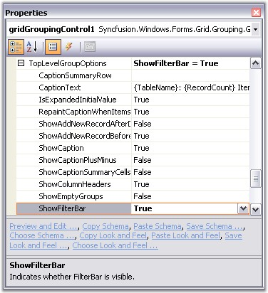{border="0"}

[]{style="FONT-FAMILY: 'Trebuchet MS','sans-serif'; COLOR: #15428b; FONT-SIZE: 9pt"} 

*[Figure ]{style="FONT-SIZE: 9pt"}[301]{style="FONT-SIZE: 9pt"}[: Setting ShowFilterBar Property]{style="FONT-SIZE: 9pt"}*

[]{style="FONT-FAMILY: 'Trebuchet MS','sans-serif'; COLOR: #15428b; FONT-SIZE: 9pt"} 

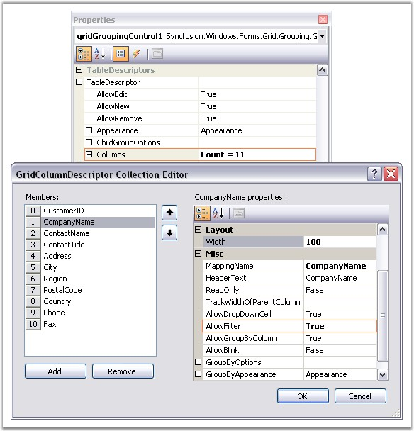{border="0"}

[]{style="FONT-FAMILY: 'Trebuchet MS','sans-serif'; COLOR: #15428b; FONT-SIZE: 9pt"} 

*[Figure ]{style="FONT-SIZE: 9pt"}[302]{style="FONT-SIZE: 9pt"}[: AllowFilter property enabled by using the GridColumnDescriptor Collection Editor]{style="FONT-SIZE: 9pt"}*

**[]{style="FONT-SIZE: 8pt"}** 

Setting AllowFilter property for the column CompanyName

[]{style="FONT-FAMILY: 'Verdana','sans-serif'; FONT-SIZE: 8pt"} 

Here is a sample screen shot that shows the filter bar with filters enabled for the columns CompanyName and ContactTitle. The records are filtered against the filter condition ContactTitle = \'Sales Representative\'. The image also shows the filter options for the column CompanyName.

**[]{style="FONT-SIZE: 8pt"}** 

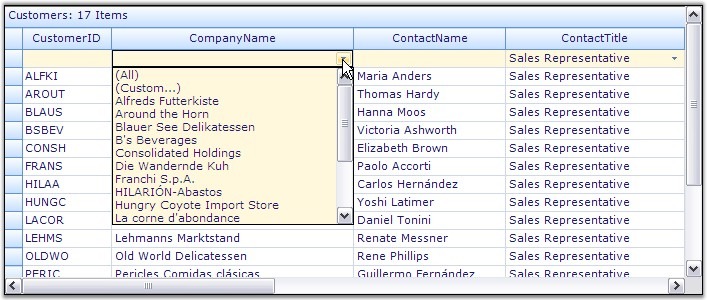{border="0"}

***[]{style="FONT-FAMILY: 'Trebuchet MS','sans-serif'; COLOR: #15428b; FONT-SIZE: 9pt"}*** 

*[Figure ]{style="FONT-SIZE: 9pt"}[303]{style="FONT-SIZE: 9pt"}[: FilterBars added for \"CompanyName\" and \"ContactTitle\" Columns]{style="FONT-SIZE: 9pt"}*

[]{style="FONT-FAMILY: 'Trebuchet MS','sans-serif'; FONT-SIZE: 9pt"} 

While enabling the FilterBar, it automatically adds up an option for showing **All** records and a **Custom** option. Clicking the Custom option will open the RecordFilterDescriptor collection editor wherein you can edit the filter conditions or add any more filters you want. The following screen shot illustrates this process.

[]{style="FONT-FAMILY: 'Trebuchet MS','sans-serif'; COLOR: #15428b; FONT-SIZE: 9pt"} 

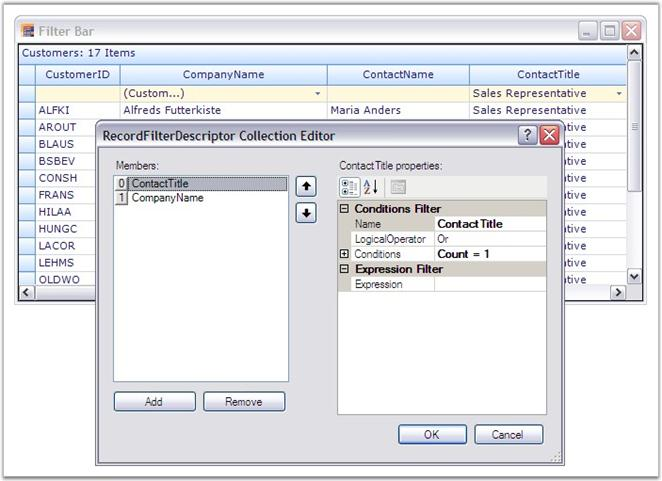{border="0"}

[]{style="FONT-FAMILY: 'Trebuchet MS','sans-serif'; COLOR: #15428b; FONT-SIZE: 9pt"} 

*[Figure ]{style="FONT-SIZE: 9pt"}[304]{style="FONT-SIZE: 9pt"}[: Editing Filter Conditions by using the RecordFilterDescriptor Collection Editor]{style="FONT-SIZE: 9pt"}*

[]{style="FONT-FAMILY: 'Trebuchet MS','sans-serif'; COLOR: #15428b; FONT-SIZE: 9pt"} 

NestedTables and NestedGroups

[]{style="COLOR: #4a5c8c"} 

AutoFilterRow can also be added to the nested tables and groups. To turn on the Filter Bar for the Nested Tables, set the property ShowFilterBar under NestedTableGroupOptions. For all the groups, ShowFilterBar under ChildGroupOptions need to be set to true.

[]{style="FONT-FAMILY: 'Trebuchet MS','sans-serif'; FONT-SIZE: 9pt"} 

+---------------------------------------------------------------------------------------------------------------------------------------------------------------------------------------------------------------------------------------------------------------------------------------+
| **[\[C#\]]{style="FONT-FAMILY: 'Courier New'; COLOR: black"}**                                                                                                                                                                                                                        |
|                                                                                                                                                                                                                                                                                       |
| []{style="FONT-FAMILY: 'Courier New'; COLOR: black"}                                                                                                                                                                                                                                  |
|                                                                                                                                                                                                                                                                                       |
| [// Show Filter Bar for the child tables.]{style="FONT-FAMILY: 'Courier New'; COLOR: green"}                                                                                                                                                                                          |
|                                                                                                                                                                                                                                                                                       |
| [this]{style="FONT-FAMILY: 'Courier New'; COLOR: blue"}[.gridGroupingControl1.NestedTableGroupOptions.ShowFilterBar = ]{style="FONT-FAMILY: 'Courier New'; COLOR: black"}[true]{style="FONT-FAMILY: 'Courier New'; COLOR: blue"}[;]{style="FONT-FAMILY: 'Courier New'; COLOR: black"} |
|                                                                                                                                                                                                                                                                                       |
| []{style="FONT-FAMILY: 'Courier New'; COLOR: black"}                                                                                                                                                                                                                                  |
|                                                                                                                                                                                                                                                                                       |
| [// Show Filter Bar for the groups.]{style="FONT-FAMILY: 'Courier New'; COLOR: green"}                                                                                                                                                                                                |
|                                                                                                                                                                                                                                                                                       |
| [this]{style="FONT-FAMILY: 'Courier New'; COLOR: blue"}[.gridGroupingControl1.ChildGroupOptions.ShowFilterBar = ]{style="FONT-FAMILY: 'Courier New'; COLOR: black"}[true]{style="FONT-FAMILY: 'Courier New'; COLOR: blue"}[;]{style="FONT-FAMILY: 'Courier New'; COLOR: black"}       |
+---------------------------------------------------------------------------------------------------------------------------------------------------------------------------------------------------------------------------------------------------------------------------------------+

[]{style="FONT-FAMILY: 'Trebuchet MS','sans-serif'; COLOR: #15428b; FONT-SIZE: 9pt"} 

+--------------------------------------------------------------------------------------------------------------------------------------------------------------------------------------------------------------+
| **[\[VB.NET\]]{style="FONT-FAMILY: 'Courier New'; COLOR: black"}**                                                                                                                                           |
|                                                                                                                                                                                                              |
| []{style="FONT-FAMILY: 'Courier New'; COLOR: black"}                                                                                                                                                         |
|                                                                                                                                                                                                              |
| [\' Show Filter Bar for the child tables.]{style="FONT-FAMILY: 'Courier New'; COLOR: green"}                                                                                                                 |
|                                                                                                                                                                                                              |
| [Me]{style="FONT-FAMILY: 'Courier New'; COLOR: blue"}[.gridGroupingControl1.[NestedTableGroupOptions]{style="COLOR: black"}.ShowFilterBar = [True]{style="COLOR: blue"}]{style="FONT-FAMILY: 'Courier New'"} |
|                                                                                                                                                                                                              |
| []{style="FONT-FAMILY: 'Courier New'; COLOR: blue"}                                                                                                                                                          |
|                                                                                                                                                                                                              |
| [\' Show Filter Bar for the groups.]{style="FONT-FAMILY: 'Courier New'; COLOR: green"}                                                                                                                       |
|                                                                                                                                                                                                              |
| [Me]{style="FONT-FAMILY: 'Courier New'; COLOR: blue"}[.gridGroupingControl1.[ChildGroupOptions]{style="COLOR: black"}.ShowFilterBar = [True]{style="COLOR: blue"}]{style="FONT-FAMILY: 'Courier New'"}       |
+--------------------------------------------------------------------------------------------------------------------------------------------------------------------------------------------------------------+

[]{style="FONT-FAMILY: 'Trebuchet MS','sans-serif'; COLOR: #15428b; FONT-SIZE: 9pt"} 

::: {style="BORDER-BOTTOM: windowtext 1pt solid; BORDER-LEFT: medium none; PADDING-BOTTOM: 1pt; MARGIN-TOP: 9pt; PADDING-LEFT: 0pt; PADDING-RIGHT: 0pt; MARGIN-BOTTOM: 9pt; BORDER-TOP: windowtext 1pt solid; BORDER-RIGHT: medium none; PADDING-TOP: 1pt"}
{border="0"}Note: For more details, refer the following browser sample:

 

\<Install Location\>\\Syncfusion\\EssentialStudio\\\[Version Number\]\\Windows\\Grid.Grouping.Windows\\Samples\\2.0\\Filters and Expressions\\Filter Bar Demo
:::

 

[]{#p435} 

 

4.3.4.3.4.2.2      Dynamic Filter

[]{style="FONT-FAMILY: 'Trebuchet MS','sans-serif'; COLOR: #15428b; FONT-SIZE: 9pt"} 

Dynamic Filter serves as good replacement for the default Filter Bar, which provides advanced filtering capabilities. It is available as an add-on feature for Essential Grid, and is built on the foundation of the regular filter bar with added provisions to support dynamic filtering, user-friendliness, and so on.

 

The dynamic filter can be used with Nested Tables and Nested Groups too. To make it more interactive, it adds a Filter Button at the right-most corner of every Filter Bar Cell, on clicking, which drops down into a list showing the available comparative operators. On hovering any filter bar cell, a filter icon is displayed, indicating whether a filter is applied to that particular column or not. The key feature of the dynamic filtering mechanism is that it allows you to view the filter results as you type each and every character. It supports user-defined filter criteria as well.

 

**Set up Dynamic Filter**

 

The dynamic filter is defined in the GridDynamicFilter class, which exposes two public methods, **WireGrid** and **UnwireGrid**, in order to hook up and unhook the dynamic filter with the desired grid.

[]{style="FONT-FAMILY: 'Trebuchet MS','sans-serif'; COLOR: #15428b; FONT-SIZE: 9pt"} 

+---------------------------------------------------------------------------------------------------------------------------------------------------------------------------------------------+
| **[\[C#\]]{style="FONT-FAMILY: 'Courier New'; COLOR: black"}**                                                                                                                              |
|                                                                                                                                                                                             |
| []{style="FONT-FAMILY: 'Courier New'; COLOR: black"}                                                                                                                                        |
|                                                                                                                                                                                             |
| [GridDynamicFilter]{style="FONT-FAMILY: 'Courier New'; COLOR: #2b91af"}[ f = [new]{style="COLOR: blue"} [GridDynamicFilter]{style="COLOR: #2b91af"}();]{style="FONT-FAMILY: 'Courier New'"} |
|                                                                                                                                                                                             |
| [if]{style="FONT-FAMILY: 'Courier New'; COLOR: blue"}[ (showDynamicFilter)]{style="FONT-FAMILY: 'Courier New'"}                                                                             |
|                                                                                                                                                                                             |
| [{]{style="FONT-FAMILY: 'Courier New'"}                                                                                                                                                     |
|                                                                                                                                                                                             |
| [f.WireGrid(gridGroupingControl1);]{style="FONT-FAMILY: 'Courier New'"}                                                                                                                     |
|                                                                                                                                                                                             |
| [}]{style="FONT-FAMILY: 'Courier New'"}                                                                                                                                                     |
|                                                                                                                                                                                             |
| [else]{style="FONT-FAMILY: 'Courier New'; COLOR: blue"}                                                                                                                                     |
|                                                                                                                                                                                             |
| [f.UnWireGrid(gridGroupingControl1);]{style="FONT-FAMILY: 'Courier New'"}                                                                                                                   |
+---------------------------------------------------------------------------------------------------------------------------------------------------------------------------------------------+

[]{style="FONT-FAMILY: 'Trebuchet MS','sans-serif'; COLOR: #15428b; FONT-SIZE: 9pt"} 

+---------------------------------------------------------------------------------------------------------------------------------------------------------------------------------------------+
| **[\[VB.NET\]]{style="FONT-FAMILY: 'Courier New'; COLOR: black"}**                                                                                                                          |
|                                                                                                                                                                                             |
| []{style="FONT-FAMILY: 'Courier New'; COLOR: black"}                                                                                                                                        |
|                                                                                                                                                                                             |
| [Dim]{style="FONT-FAMILY: 'Courier New'; COLOR: blue"}[ f [As]{style="COLOR: blue"} GridDynamicFilter = [New]{style="COLOR: blue"} GridDynamicFilter()]{style="FONT-FAMILY: 'Courier New'"} |
|                                                                                                                                                                                             |
| [If]{style="FONT-FAMILY: 'Courier New'; COLOR: blue"}[ showDynamicFilter [Then]{style="COLOR: blue"}]{style="FONT-FAMILY: 'Courier New'"}                                                   |
|                                                                                                                                                                                             |
| [f.WireGrid(gridGroupingControl1)]{style="FONT-FAMILY: 'Courier New'"}                                                                                                                      |
|                                                                                                                                                                                             |
| [Else]{style="FONT-FAMILY: 'Courier New'; COLOR: blue"}                                                                                                                                     |
|                                                                                                                                                                                             |
| [f.UnWireGrid(gridGroupingControl1)]{style="FONT-FAMILY: 'Courier New'"}                                                                                                                    |
|                                                                                                                                                                                             |
| [End]{style="FONT-FAMILY: 'Courier New'; COLOR: blue"}[ [If]{style="COLOR: blue"}]{style="FONT-FAMILY: 'Courier New'"}                                                                      |
+---------------------------------------------------------------------------------------------------------------------------------------------------------------------------------------------+

[]{style="FONT-FAMILY: 'Trebuchet MS','sans-serif'; COLOR: #15428b; FONT-SIZE: 9pt"} 

Sample Output

 

Below image illustrates a sample output.

[]{style="FONT-FAMILY: 'Trebuchet MS','sans-serif'; COLOR: #15428b; FONT-SIZE: 9pt"} 

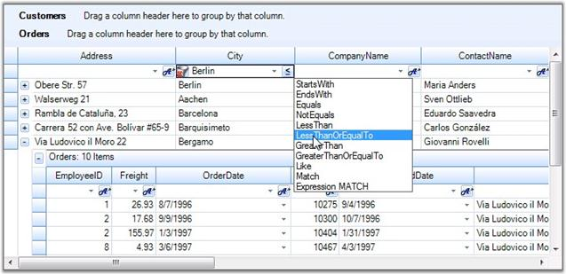{border="0"}

[]{style="FONT-FAMILY: 'Trebuchet MS','sans-serif'; COLOR: #15428b; FONT-SIZE: 9pt"} 

*[Figure ]{style="FONT-SIZE: 9pt"}[305]{style="FONT-SIZE: 9pt"}[: Dynamic Filter]{style="FONT-SIZE: 9pt"}*

[]{style="FONT-FAMILY: 'Trebuchet MS','sans-serif'; COLOR: #15428b; FONT-SIZE: 9pt"} 

::: {style="BORDER-BOTTOM: windowtext 1pt solid; BORDER-LEFT: medium none; PADDING-BOTTOM: 1pt; MARGIN-TOP: 9pt; PADDING-LEFT: 0pt; PADDING-RIGHT: 0pt; MARGIN-BOTTOM: 9pt; BORDER-TOP: windowtext 1pt solid; BORDER-RIGHT: medium none; PADDING-TOP: 1pt"}
{border="0"}Note: For more details, refer the following browser sample:

 

\<Install Location\>\\Syncfusion\\EssentialStudio\\\[Version Number\]\\Windows\\Grid.Grouping.Windows\\Samples\\2.0\\Filters and Expressions\\Dynamic Filter Demo
:::

 

[]{#p436}4.3.4.3.4.2.2.1    Localization Support for CompareOperatorListBox

 

The dynamic filter in the GridGrouping control provides support to customize the display content of the static element. Using this you can localize the static elements in the compare operator list box.

 

Use Case Scenarios

With this feature, you can localize the options in the compare operator list box to display the language specific to your locale.

 

Sample Link

A demo of this feature is available in the following location:

 

***{Installed Path}\\Syncfusion\\EssentialStudio\\x.x.x.x\\Windows\\Grid.Grouping.Windows\\Samples\\2.0\\Filters and Expressions\\Dynamic Filter Demo***

**** 

Adding Localization Support for CompareOperatorListBox

To localize the content, create a class file and add an interface as *ILocalizationProvider*. Assign the required content to be displayed to the *DynamicFilterResourceIdentifiers* of the *GetLocalizedString* method as illustrated in the following code:

 

+----------------------------------------------------------------------------------------------------------------------------------------------------------------------------------------------------------------------------------------------------------+
| **[\[C#\]]{style="FONT-FAMILY: 'Courier New'"}**                                                                                                                                                                                                         |
|                                                                                                                                                                                                                                                          |
| []{style="FONT-FAMILY: 'Courier New'; COLOR: blue"}                                                                                                                                                                                                      |
|                                                                                                                                                                                                                                                          |
| [public]{style="FONT-FAMILY: 'Courier New'; COLOR: blue"}[ [string]{style="COLOR: blue"} GetLocalizedString(System.Globalization.[CultureInfo]{style="COLOR: #2b91af"} culture, [string]{style="COLOR: blue"} name)]{style="FONT-FAMILY: 'Courier New'"} |
|                                                                                                                                                                                                                                                          |
| [        {]{style="FONT-FAMILY: 'Courier New'"}                                                                                                                                                                                                          |
|                                                                                                                                                                                                                                                          |
| [            [if]{style="COLOR: blue"} (str == [\"True\"]{style="COLOR: #a31515"})]{style="FONT-FAMILY: 'Courier New'"}                                                                                                                                  |
|                                                                                                                                                                                                                                                          |
| [            {]{style="FONT-FAMILY: 'Courier New'"}                                                                                                                                                                                                      |
|                                                                                                                                                                                                                                                          |
| [                [switch]{style="COLOR: blue"} (name)]{style="FONT-FAMILY: 'Courier New'"}                                                                                                                                                               |
|                                                                                                                                                                                                                                                          |
| [                {]{style="FONT-FAMILY: 'Courier New'"}                                                                                                                                                                                                  |
|                                                                                                                                                                                                                                                          |
| [                    #region]{style="FONT-FAMILY: 'Courier New'; COLOR: blue"}[ Menu Package]{style="FONT-FAMILY: 'Courier New'"}                                                                                                                        |
|                                                                                                                                                                                                                                                          |
| [                    [case]{style="COLOR: blue"} DynamicFilterResourceIdentifiers.StartsWith:]{style="FONT-FAMILY: 'Courier New'"}                                                                                                                       |
|                                                                                                                                                                                                                                                          |
| [                        [return]{style="COLOR: blue"} [\"empieza con\"]{style="COLOR: #a31515"};]{style="FONT-FAMILY: 'Courier New'"}                                                                                                                   |
|                                                                                                                                                                                                                                                          |
| [                    [case]{style="COLOR: blue"} DynamicFilterResourceIdentifiers.EndsWith:]{style="FONT-FAMILY: 'Courier New'"}                                                                                                                         |
|                                                                                                                                                                                                                                                          |
| [                        [return]{style="COLOR: blue"} [\"termina con\"]{style="COLOR: #a31515"};]{style="FONT-FAMILY: 'Courier New'"}                                                                                                                   |
|                                                                                                                                                                                                                                                          |
| [                    [case]{style="COLOR: blue"} DynamicFilterResourceIdentifiers.Equals:]{style="FONT-FAMILY: 'Courier New'"}                                                                                                                           |
|                                                                                                                                                                                                                                                          |
| [                        [return]{style="COLOR: blue"} [\"es igual a\"]{style="COLOR: #a31515"};]{style="FONT-FAMILY: 'Courier New'"}                                                                                                                    |
|                                                                                                                                                                                                                                                          |
| [                    [case]{style="COLOR: blue"} DynamicFilterResourceIdentifiers.GreaterThan:]{style="FONT-FAMILY: 'Courier New'"}                                                                                                                      |
|                                                                                                                                                                                                                                                          |
| [                        [return]{style="COLOR: blue"} [\"mayor que\"]{style="COLOR: #a31515"};]{style="FONT-FAMILY: 'Courier New'"}                                                                                                                     |
|                                                                                                                                                                                                                                                          |
| [                    [case]{style="COLOR: blue"} DynamicFilterResourceIdentifiers.GreaterThanOrEqualTo:]{style="FONT-FAMILY: 'Courier New'"}                                                                                                             |
|                                                                                                                                                                                                                                                          |
| [                        [return]{style="COLOR: blue"} [\"Mayor o igual a\"]{style="COLOR: #a31515"};]{style="FONT-FAMILY: 'Courier New'"}                                                                                                               |
|                                                                                                                                                                                                                                                          |
| [                    [case]{style="COLOR: blue"} DynamicFilterResourceIdentifiers.LessThan:]{style="FONT-FAMILY: 'Courier New'"}                                                                                                                         |
|                                                                                                                                                                                                                                                          |
| [                        [return]{style="COLOR: blue"} [\"menos que\"]{style="COLOR: #a31515"};]{style="FONT-FAMILY: 'Courier New'"}                                                                                                                     |
|                                                                                                                                                                                                                                                          |
| [                    [case]{style="COLOR: blue"} DynamicFilterResourceIdentifiers.LessThanOrEqualTo:]{style="FONT-FAMILY: 'Courier New'"}                                                                                                                |
|                                                                                                                                                                                                                                                          |
| [                        [return]{style="COLOR: blue"} [\"Menor o igual a\"]{style="COLOR: #a31515"};]{style="FONT-FAMILY: 'Courier New'"}                                                                                                               |
|                                                                                                                                                                                                                                                          |
| [                    [case]{style="COLOR: blue"} DynamicFilterResourceIdentifiers.Like:]{style="FONT-FAMILY: 'Courier New'"}                                                                                                                             |
|                                                                                                                                                                                                                                                          |
| [                        [return]{style="COLOR: blue"} [\"como\"]{style="COLOR: #a31515"};]{style="FONT-FAMILY: 'Courier New'"}                                                                                                                          |
|                                                                                                                                                                                                                                                          |
| [                    [case]{style="COLOR: blue"} DynamicFilterResourceIdentifiers.Match:]{style="FONT-FAMILY: 'Courier New'"}                                                                                                                            |
|                                                                                                                                                                                                                                                          |
| [                        [return]{style="COLOR: blue"} [\"partido\"]{style="COLOR: #a31515"};]{style="FONT-FAMILY: 'Courier New'"}                                                                                                                       |
|                                                                                                                                                                                                                                                          |
| [                    [case]{style="COLOR: blue"} DynamicFilterResourceIdentifiers.NotEquals:]{style="FONT-FAMILY: 'Courier New'"}                                                                                                                        |
|                                                                                                                                                                                                                                                          |
| [                        [return]{style="COLOR: blue"} [\"no es igual\"]{style="COLOR: #a31515"};]{style="FONT-FAMILY: 'Courier New'"}                                                                                                                   |
|                                                                                                                                                                                                                                                          |
| [                    [case]{style="COLOR: blue"} DynamicFilterResourceIdentifiers.ExpressionMATCH:]{style="FONT-FAMILY: 'Courier New'"}                                                                                                                  |
|                                                                                                                                                                                                                                                          |
| [                        [return]{style="COLOR: blue"} [\"expresión de coincidencia\"]{style="COLOR: #a31515"};]{style="FONT-FAMILY: 'Courier New'"}                                                                                                     |
|                                                                                                                                                                                                                                                          |
| [                    #endregion]{style="FONT-FAMILY: 'Courier New'; COLOR: blue"}[]{style="FONT-FAMILY: 'Courier New'"}                                                                                                                                  |
|                                                                                                                                                                                                                                                          |
| []{style="FONT-FAMILY: 'Courier New'"}                                                                                                                                                                                                                   |
|                                                                                                                                                                                                                                                          |
| [                    [default]{style="COLOR: blue"}:]{style="FONT-FAMILY: 'Courier New'"}                                                                                                                                                                |
|                                                                                                                                                                                                                                                          |
| [                        [return]{style="COLOR: blue"} [string]{style="COLOR: blue"}.Empty;]{style="FONT-FAMILY: 'Courier New'"}                                                                                                                         |
|                                                                                                                                                                                                                                                          |
| [                }]{style="FONT-FAMILY: 'Courier New'"}                                                                                                                                                                                                  |
|                                                                                                                                                                                                                                                          |
| [            }]{style="FONT-FAMILY: 'Courier New'"}                                                                                                                                                                                                      |
|                                                                                                                                                                                                                                                          |
| [            [else]{style="COLOR: blue"} ]{style="FONT-FAMILY: 'Courier New'"}                                                                                                                                                                           |
|                                                                                                                                                                                                                                                          |
| [            {]{style="FONT-FAMILY: 'Courier New'"}                                                                                                                                                                                                      |
|                                                                                                                                                                                                                                                          |
| [                [switch]{style="COLOR: blue"} (name)]{style="FONT-FAMILY: 'Courier New'"}                                                                                                                                                               |
|                                                                                                                                                                                                                                                          |
| [                {]{style="FONT-FAMILY: 'Courier New'"}                                                                                                                                                                                                  |
|                                                                                                                                                                                                                                                          |
| [                    #region]{style="FONT-FAMILY: 'Courier New'; COLOR: blue"}[ Menu Package]{style="FONT-FAMILY: 'Courier New'"}                                                                                                                        |
|                                                                                                                                                                                                                                                          |
| [                    [case]{style="COLOR: blue"} DynamicFilterResourceIdentifiers.StartsWith:]{style="FONT-FAMILY: 'Courier New'"}                                                                                                                       |
|                                                                                                                                                                                                                                                          |
| [                        [return]{style="COLOR: blue"} [\"StartsWith\"]{style="COLOR: #a31515"};]{style="FONT-FAMILY: 'Courier New'"}                                                                                                                    |
|                                                                                                                                                                                                                                                          |
| [                    [case]{style="COLOR: blue"} DynamicFilterResourceIdentifiers.EndsWith:]{style="FONT-FAMILY: 'Courier New'"}                                                                                                                         |
|                                                                                                                                                                                                                                                          |
| [                        [return]{style="COLOR: blue"} [\"EndsWith\"]{style="COLOR: #a31515"};]{style="FONT-FAMILY: 'Courier New'"}                                                                                                                      |
|                                                                                                                                                                                                                                                          |
| [                    [case]{style="COLOR: blue"} DynamicFilterResourceIdentifiers.Equals:]{style="FONT-FAMILY: 'Courier New'"}                                                                                                                           |
|                                                                                                                                                                                                                                                          |
| [                        [return]{style="COLOR: blue"} [\"Equals\"]{style="COLOR: #a31515"};]{style="FONT-FAMILY: 'Courier New'"}                                                                                                                        |
|                                                                                                                                                                                                                                                          |
| [                    [case]{style="COLOR: blue"} DynamicFilterResourceIdentifiers.GreaterThan:]{style="FONT-FAMILY: 'Courier New'"}                                                                                                                      |
|                                                                                                                                                                                                                                                          |
| [                        [return]{style="COLOR: blue"} [\"GreaterThan\"]{style="COLOR: #a31515"};]{style="FONT-FAMILY: 'Courier New'"}                                                                                                                   |
|                                                                                                                                                                                                                                                          |
| [                    [case]{style="COLOR: blue"} DynamicFilterResourceIdentifiers.GreaterThanOrEqualTo:]{style="FONT-FAMILY: 'Courier New'"}                                                                                                             |
|                                                                                                                                                                                                                                                          |
| [                        [return]{style="COLOR: blue"} [\"GreaterThanOrEqualTo\"]{style="COLOR: #a31515"};]{style="FONT-FAMILY: 'Courier New'"}                                                                                                          |
|                                                                                                                                                                                                                                                          |
| [                    [case]{style="COLOR: blue"} DynamicFilterResourceIdentifiers.LessThan:]{style="FONT-FAMILY: 'Courier New'"}                                                                                                                         |
|                                                                                                                                                                                                                                                          |
| [                        [return]{style="COLOR: blue"} [\"LessThan\"]{style="COLOR: #a31515"};]{style="FONT-FAMILY: 'Courier New'"}                                                                                                                      |
|                                                                                                                                                                                                                                                          |
| [                    [case]{style="COLOR: blue"} DynamicFilterResourceIdentifiers.LessThanOrEqualTo:]{style="FONT-FAMILY: 'Courier New'"}                                                                                                                |
|                                                                                                                                                                                                                                                          |
| [                        [return]{style="COLOR: blue"} [\"LessThanOrEqualTo\"]{style="COLOR: #a31515"};]{style="FONT-FAMILY: 'Courier New'"}                                                                                                             |
|                                                                                                                                                                                                                                                          |
| [                    [case]{style="COLOR: blue"} DynamicFilterResourceIdentifiers.Like:]{style="FONT-FAMILY: 'Courier New'"}                                                                                                                             |
|                                                                                                                                                                                                                                                          |
| [                        [return]{style="COLOR: blue"} [\"Like\"]{style="COLOR: #a31515"};]{style="FONT-FAMILY: 'Courier New'"}                                                                                                                          |
|                                                                                                                                                                                                                                                          |
| [                    [case]{style="COLOR: blue"} DynamicFilterResourceIdentifiers.Match:]{style="FONT-FAMILY: 'Courier New'"}                                                                                                                            |
|                                                                                                                                                                                                                                                          |
| [                        [return]{style="COLOR: blue"} [\"Match\"]{style="COLOR: #a31515"};]{style="FONT-FAMILY: 'Courier New'"}                                                                                                                         |
|                                                                                                                                                                                                                                                          |
| [                    [case]{style="COLOR: blue"} DynamicFilterResourceIdentifiers.NotEquals:]{style="FONT-FAMILY: 'Courier New'"}                                                                                                                        |
|                                                                                                                                                                                                                                                          |
| [                        [return]{style="COLOR: blue"} [\"NotEquals\"]{style="COLOR: #a31515"};]{style="FONT-FAMILY: 'Courier New'"}                                                                                                                     |
|                                                                                                                                                                                                                                                          |
| [                    [case]{style="COLOR: blue"} DynamicFilterResourceIdentifiers.ExpressionMATCH:]{style="FONT-FAMILY: 'Courier New'"}                                                                                                                  |
|                                                                                                                                                                                                                                                          |
| [                        [return]{style="COLOR: blue"} [\"ExpressionMATCH\"]{style="COLOR: #a31515"};]{style="FONT-FAMILY: 'Courier New'"}                                                                                                               |
|                                                                                                                                                                                                                                                          |
| [                    #endregion]{style="FONT-FAMILY: 'Courier New'; COLOR: blue"}[]{style="FONT-FAMILY: 'Courier New'"}                                                                                                                                  |
|                                                                                                                                                                                                                                                          |
| []{style="FONT-FAMILY: 'Courier New'"}                                                                                                                                                                                                                   |
|                                                                                                                                                                                                                                                          |
| [                    [default]{style="COLOR: blue"}:]{style="FONT-FAMILY: 'Courier New'"}                                                                                                                                                                |
|                                                                                                                                                                                                                                                          |
| [                        [return]{style="COLOR: blue"} [string]{style="COLOR: blue"}.Empty;]{style="FONT-FAMILY: 'Courier New'"}                                                                                                                         |
|                                                                                                                                                                                                                                                          |
| [                }]{style="FONT-FAMILY: 'Courier New'"}                                                                                                                                                                                                  |
|                                                                                                                                                                                                                                                          |
| [            }]{style="FONT-FAMILY: 'Courier New'"}                                                                                                                                                                                                      |
|                                                                                                                                                                                                                                                          |
| [        }]{style="FONT-FAMILY: 'Courier New'"}                                                                                                                                                                                                          |
|                                                                                                                                                                                                                                                          |
| []{style="FONT-FAMILY: 'Courier New'"}                                                                                                                                                                                                                   |
+----------------------------------------------------------------------------------------------------------------------------------------------------------------------------------------------------------------------------------------------------------+

 

+--------------------------------------------------------------------------------------------------------------------------------------------------------------------------------------------------------------------------------------------------------------------------------------------------------------------------------------------------------------------------------------------------------+
| **\[VB\]**                                                                                                                                                                                                                                                                                                                                                                                             |
|                                                                                                                                                                                                                                                                                                                                                                                                        |
|                                                                                                                                                                                                                                                                                                                                                                                                        |
|                                                                                                                                                                                                                                                                                                                                                                                                        |
| [Public]{style="FONT-FAMILY: 'Courier New'; COLOR: blue"}[ [Function]{style="COLOR: blue"} GetLocalizedString([ByVal]{style="COLOR: blue"} culture [As]{style="COLOR: blue"} System.Globalization.CultureInfo, [ByVal]{style="COLOR: blue"} name [As]{style="COLOR: blue"} [String]{style="COLOR: blue"}) [As]{style="COLOR: blue"} [String]{style="COLOR: blue"}]{style="FONT-FAMILY: 'Courier New'"} |
|                                                                                                                                                                                                                                                                                                                                                                                                        |
| [                  [If]{style="COLOR: blue"} str = [\"True\"]{style="COLOR: darkred"} [Then]{style="COLOR: blue"}]{style="FONT-FAMILY: 'Courier New'"}                                                                                                                                                                                                                                                 |
|                                                                                                                                                                                                                                                                                                                                                                                                        |
| [                        [Select]{style="COLOR: blue"} [Case]{style="COLOR: blue"} name]{style="FONT-FAMILY: 'Courier New'"}                                                                                                                                                                                                                                                                           |
|                                                                                                                                                                                                                                                                                                                                                                                                        |
| [\'                             #Region \"Menu Package\"]{style="FONT-FAMILY: 'Courier New'; COLOR: green"}[]{style="FONT-FAMILY: 'Courier New'"}                                                                                                                                                                                                                                                      |
|                                                                                                                                                                                                                                                                                                                                                                                                        |
| [                              [Case]{style="COLOR: blue"} DynamicFilterResourceIdentifiers.StartsWith]{style="FONT-FAMILY: 'Courier New'"}                                                                                                                                                                                                                                                            |
|                                                                                                                                                                                                                                                                                                                                                                                                        |
| [                                    [Return]{style="COLOR: blue"} [\"empieza con\"]{style="COLOR: darkred"}]{style="FONT-FAMILY: 'Courier New'"}                                                                                                                                                                                                                                                      |
|                                                                                                                                                                                                                                                                                                                                                                                                        |
| [                              [Case]{style="COLOR: blue"} DynamicFilterResourceIdentifiers.EndsWith]{style="FONT-FAMILY: 'Courier New'"}                                                                                                                                                                                                                                                              |
|                                                                                                                                                                                                                                                                                                                                                                                                        |
| [                                    [Return]{style="COLOR: blue"} [\"termina con\"]{style="COLOR: darkred"}]{style="FONT-FAMILY: 'Courier New'"}                                                                                                                                                                                                                                                      |
|                                                                                                                                                                                                                                                                                                                                                                                                        |
| [                              [Case]{style="COLOR: blue"} DynamicFilterResourceIdentifiers.Equals]{style="FONT-FAMILY: 'Courier New'"}                                                                                                                                                                                                                                                                |
|                                                                                                                                                                                                                                                                                                                                                                                                        |
| [                                    [Return]{style="COLOR: blue"} [\"es igual a\"]{style="COLOR: darkred"}]{style="FONT-FAMILY: 'Courier New'"}                                                                                                                                                                                                                                                       |
|                                                                                                                                                                                                                                                                                                                                                                                                        |
| [                              [Case]{style="COLOR: blue"} DynamicFilterResourceIdentifiers.GreaterThan]{style="FONT-FAMILY: 'Courier New'"}                                                                                                                                                                                                                                                           |
|                                                                                                                                                                                                                                                                                                                                                                                                        |
| [                                    [Return]{style="COLOR: blue"} [\"mayor que\"]{style="COLOR: darkred"}]{style="FONT-FAMILY: 'Courier New'"}                                                                                                                                                                                                                                                        |
|                                                                                                                                                                                                                                                                                                                                                                                                        |
| [                              [Case]{style="COLOR: blue"} DynamicFilterResourceIdentifiers.GreaterThanOrEqualTo]{style="FONT-FAMILY: 'Courier New'"}                                                                                                                                                                                                                                                  |
|                                                                                                                                                                                                                                                                                                                                                                                                        |
| [                                    [Return]{style="COLOR: blue"} [\"Mayor o igual a\"]{style="COLOR: darkred"}]{style="FONT-FAMILY: 'Courier New'"}                                                                                                                                                                                                                                                  |
|                                                                                                                                                                                                                                                                                                                                                                                                        |
| [                              [Case]{style="COLOR: blue"} DynamicFilterResourceIdentifiers.LessThan]{style="FONT-FAMILY: 'Courier New'"}                                                                                                                                                                                                                                                              |
|                                                                                                                                                                                                                                                                                                                                                                                                        |
| [                                    [Return]{style="COLOR: blue"} [\"menos que\"]{style="COLOR: darkred"}]{style="FONT-FAMILY: 'Courier New'"}                                                                                                                                                                                                                                                        |
|                                                                                                                                                                                                                                                                                                                                                                                                        |
| [                              [Case]{style="COLOR: blue"} DynamicFilterResourceIdentifiers.LessThanOrEqualTo]{style="FONT-FAMILY: 'Courier New'"}                                                                                                                                                                                                                                                     |
|                                                                                                                                                                                                                                                                                                                                                                                                        |
| [                                    [Return]{style="COLOR: blue"} [\"Menor o igual a\"]{style="COLOR: darkred"}]{style="FONT-FAMILY: 'Courier New'"}                                                                                                                                                                                                                                                  |
|                                                                                                                                                                                                                                                                                                                                                                                                        |
| [                              [Case]{style="COLOR: blue"} DynamicFilterResourceIdentifiers.Like]{style="FONT-FAMILY: 'Courier New'"}                                                                                                                                                                                                                                                                  |
|                                                                                                                                                                                                                                                                                                                                                                                                        |
| [                                    [Return]{style="COLOR: blue"} [\"como\"]{style="COLOR: darkred"}]{style="FONT-FAMILY: 'Courier New'"}                                                                                                                                                                                                                                                             |
|                                                                                                                                                                                                                                                                                                                                                                                                        |
| [                              [Case]{style="COLOR: blue"} DynamicFilterResourceIdentifiers.Match]{style="FONT-FAMILY: 'Courier New'"}                                                                                                                                                                                                                                                                 |
|                                                                                                                                                                                                                                                                                                                                                                                                        |
| [                                    [Return]{style="COLOR: blue"} [\"partido\"]{style="COLOR: darkred"}]{style="FONT-FAMILY: 'Courier New'"}                                                                                                                                                                                                                                                          |
|                                                                                                                                                                                                                                                                                                                                                                                                        |
| [                              [Case]{style="COLOR: blue"} DynamicFilterResourceIdentifiers.NotEquals]{style="FONT-FAMILY: 'Courier New'"}                                                                                                                                                                                                                                                             |
|                                                                                                                                                                                                                                                                                                                                                                                                        |
| [                                    [Return]{style="COLOR: blue"} [\"no es igual\"]{style="COLOR: darkred"}]{style="FONT-FAMILY: 'Courier New'"}                                                                                                                                                                                                                                                      |
|                                                                                                                                                                                                                                                                                                                                                                                                        |
| [                              [Case]{style="COLOR: blue"} DynamicFilterResourceIdentifiers.ExpressionMATCH]{style="FONT-FAMILY: 'Courier New'"}                                                                                                                                                                                                                                                       |
|                                                                                                                                                                                                                                                                                                                                                                                                        |
| [                                    [Return]{style="COLOR: blue"} [\"expresión de coincidencia\"]{style="COLOR: darkred"}]{style="FONT-FAMILY: 'Courier New'"}                                                                                                                                                                                                                                        |
|                                                                                                                                                                                                                                                                                                                                                                                                        |
| [\'                             #End Region]{style="FONT-FAMILY: 'Courier New'; COLOR: green"}[]{style="FONT-FAMILY: 'Courier New'"}                                                                                                                                                                                                                                                                   |
|                                                                                                                                                                                                                                                                                                                                                                                                        |
| []{style="FONT-FAMILY: 'Courier New'"}                                                                                                                                                                                                                                                                                                                                                                 |
|                                                                                                                                                                                                                                                                                                                                                                                                        |
| [                              [Case]{style="COLOR: blue"} [Else]{style="COLOR: blue"}]{style="FONT-FAMILY: 'Courier New'"}                                                                                                                                                                                                                                                                            |
|                                                                                                                                                                                                                                                                                                                                                                                                        |
| [                                    [Return]{style="COLOR: blue"} [String]{style="COLOR: blue"}.Empty]{style="FONT-FAMILY: 'Courier New'"}                                                                                                                                                                                                                                                            |
|                                                                                                                                                                                                                                                                                                                                                                                                        |
| [                        [End]{style="COLOR: blue"} [Select]{style="COLOR: blue"}]{style="FONT-FAMILY: 'Courier New'"}                                                                                                                                                                                                                                                                                 |
|                                                                                                                                                                                                                                                                                                                                                                                                        |
| [                  [Else]{style="COLOR: blue"}]{style="FONT-FAMILY: 'Courier New'"}                                                                                                                                                                                                                                                                                                                    |
|                                                                                                                                                                                                                                                                                                                                                                                                        |
| [                        [Select]{style="COLOR: blue"} [Case]{style="COLOR: blue"} name]{style="FONT-FAMILY: 'Courier New'"}                                                                                                                                                                                                                                                                           |
|                                                                                                                                                                                                                                                                                                                                                                                                        |
| [\'                             #Region \"Menu Package\"]{style="FONT-FAMILY: 'Courier New'; COLOR: green"}[]{style="FONT-FAMILY: 'Courier New'"}                                                                                                                                                                                                                                                      |
|                                                                                                                                                                                                                                                                                                                                                                                                        |
| [                              [Case]{style="COLOR: blue"} DynamicFilterResourceIdentifiers.StartsWith]{style="FONT-FAMILY: 'Courier New'"}                                                                                                                                                                                                                                                            |
|                                                                                                                                                                                                                                                                                                                                                                                                        |
| [                                    [Return]{style="COLOR: blue"} [\"StartsWith\"]{style="COLOR: darkred"}]{style="FONT-FAMILY: 'Courier New'"}                                                                                                                                                                                                                                                       |
|                                                                                                                                                                                                                                                                                                                                                                                                        |
| [                              [Case]{style="COLOR: blue"} DynamicFilterResourceIdentifiers.EndsWith]{style="FONT-FAMILY: 'Courier New'"}                                                                                                                                                                                                                                                              |
|                                                                                                                                                                                                                                                                                                                                                                                                        |
| [                                    [Return]{style="COLOR: blue"} [\"EndsWith\"]{style="COLOR: darkred"}]{style="FONT-FAMILY: 'Courier New'"}                                                                                                                                                                                                                                                         |
|                                                                                                                                                                                                                                                                                                                                                                                                        |
| [                              [Case]{style="COLOR: blue"} DynamicFilterResourceIdentifiers.Equals]{style="FONT-FAMILY: 'Courier New'"}                                                                                                                                                                                                                                                                |
|                                                                                                                                                                                                                                                                                                                                                                                                        |
| [                                    [Return]{style="COLOR: blue"} [\"Equals\"]{style="COLOR: darkred"}]{style="FONT-FAMILY: 'Courier New'"}                                                                                                                                                                                                                                                           |
|                                                                                                                                                                                                                                                                                                                                                                                                        |
| [                              [Case]{style="COLOR: blue"} DynamicFilterResourceIdentifiers.GreaterThan]{style="FONT-FAMILY: 'Courier New'"}                                                                                                                                                                                                                                                           |
|                                                                                                                                                                                                                                                                                                                                                                                                        |
| [                                    [Return]{style="COLOR: blue"} [\"GreaterThan\"]{style="COLOR: darkred"}]{style="FONT-FAMILY: 'Courier New'"}                                                                                                                                                                                                                                                      |
|                                                                                                                                                                                                                                                                                                                                                                                                        |
| [                              [Case]{style="COLOR: blue"} DynamicFilterResourceIdentifiers.GreaterThanOrEqualTo]{style="FONT-FAMILY: 'Courier New'"}                                                                                                                                                                                                                                                  |
|                                                                                                                                                                                                                                                                                                                                                                                                        |
| [                                    [Return]{style="COLOR: blue"} [\"GreaterThanOrEqualTo\"]{style="COLOR: darkred"}]{style="FONT-FAMILY: 'Courier New'"}                                                                                                                                                                                                                                             |
|                                                                                                                                                                                                                                                                                                                                                                                                        |
| [                              [Case]{style="COLOR: blue"} DynamicFilterResourceIdentifiers.LessThan]{style="FONT-FAMILY: 'Courier New'"}                                                                                                                                                                                                                                                              |
|                                                                                                                                                                                                                                                                                                                                                                                                        |
| [                                    [Return]{style="COLOR: blue"} [\"LessThan\"]{style="COLOR: darkred"}]{style="FONT-FAMILY: 'Courier New'"}                                                                                                                                                                                                                                                         |
|                                                                                                                                                                                                                                                                                                                                                                                                        |
| [                              [Case]{style="COLOR: blue"} DynamicFilterResourceIdentifiers.LessThanOrEqualTo]{style="FONT-FAMILY: 'Courier New'"}                                                                                                                                                                                                                                                     |
|                                                                                                                                                                                                                                                                                                                                                                                                        |
| [                                    [Return]{style="COLOR: blue"} [\"LessThanOrEqualTo\"]{style="COLOR: darkred"}]{style="FONT-FAMILY: 'Courier New'"}                                                                                                                                                                                                                                                |
|                                                                                                                                                                                                                                                                                                                                                                                                        |
| [                              [Case]{style="COLOR: blue"} DynamicFilterResourceIdentifiers.Like]{style="FONT-FAMILY: 'Courier New'"}                                                                                                                                                                                                                                                                  |
|                                                                                                                                                                                                                                                                                                                                                                                                        |
| [                                    [Return]{style="COLOR: blue"} [\"Like\"]{style="COLOR: darkred"}]{style="FONT-FAMILY: 'Courier New'"}                                                                                                                                                                                                                                                             |
|                                                                                                                                                                                                                                                                                                                                                                                                        |
| [                              [Case]{style="COLOR: blue"} DynamicFilterResourceIdentifiers.Match]{style="FONT-FAMILY: 'Courier New'"}                                                                                                                                                                                                                                                                 |
|                                                                                                                                                                                                                                                                                                                                                                                                        |
| [                                    [Return]{style="COLOR: blue"} [\"Match\"]{style="COLOR: darkred"}]{style="FONT-FAMILY: 'Courier New'"}                                                                                                                                                                                                                                                            |
|                                                                                                                                                                                                                                                                                                                                                                                                        |
| [                              [Case]{style="COLOR: blue"} DynamicFilterResourceIdentifiers.NotEquals]{style="FONT-FAMILY: 'Courier New'"}                                                                                                                                                                                                                                                             |
|                                                                                                                                                                                                                                                                                                                                                                                                        |
| [                                    [Return]{style="COLOR: blue"} [\"NotEquals\"]{style="COLOR: darkred"}]{style="FONT-FAMILY: 'Courier New'"}                                                                                                                                                                                                                                                        |
|                                                                                                                                                                                                                                                                                                                                                                                                        |
| [                              [Case]{style="COLOR: blue"} DynamicFilterResourceIdentifiers.ExpressionMATCH]{style="FONT-FAMILY: 'Courier New'"}                                                                                                                                                                                                                                                       |
|                                                                                                                                                                                                                                                                                                                                                                                                        |
| [                                    [Return]{style="COLOR: blue"} [\"ExpressionMATCH\"]{style="COLOR: darkred"}]{style="FONT-FAMILY: 'Courier New'"}                                                                                                                                                                                                                                                  |
|                                                                                                                                                                                                                                                                                                                                                                                                        |
| [\'                             #End Region]{style="FONT-FAMILY: 'Courier New'; COLOR: green"}[]{style="FONT-FAMILY: 'Courier New'"}                                                                                                                                                                                                                                                                   |
|                                                                                                                                                                                                                                                                                                                                                                                                        |
| []{style="FONT-FAMILY: 'Courier New'"}                                                                                                                                                                                                                                                                                                                                                                 |
|                                                                                                                                                                                                                                                                                                                                                                                                        |
| [                              [Case]{style="COLOR: blue"} [Else]{style="COLOR: blue"}]{style="FONT-FAMILY: 'Courier New'"}                                                                                                                                                                                                                                                                            |
|                                                                                                                                                                                                                                                                                                                                                                                                        |
| [                                    [Return]{style="COLOR: blue"} [String]{style="COLOR: blue"}.Empty]{style="FONT-FAMILY: 'Courier New'"}                                                                                                                                                                                                                                                            |
|                                                                                                                                                                                                                                                                                                                                                                                                        |
| [                        [End]{style="COLOR: blue"} [Select]{style="COLOR: blue"}]{style="FONT-FAMILY: 'Courier New'"}                                                                                                                                                                                                                                                                                 |
|                                                                                                                                                                                                                                                                                                                                                                                                        |
| [                  [End]{style="COLOR: blue"} [If]{style="COLOR: blue"}]{style="FONT-FAMILY: 'Courier New'"}                                                                                                                                                                                                                                                                                           |
|                                                                                                                                                                                                                                                                                                                                                                                                        |
| [End]{style="FONT-FAMILY: 'Courier New'; COLOR: blue"}[ [Function]{style="COLOR: blue"}]{style="FONT-FAMILY: 'Courier New'"}                                                                                                                                                                                                                                                                           |
|                                                                                                                                                                                                                                                                                                                                                                                                        |
|                                                                                                                                                                                                                                                                                                                                                                                                        |
+--------------------------------------------------------------------------------------------------------------------------------------------------------------------------------------------------------------------------------------------------------------------------------------------------------------------------------------------------------------------------------------------------------+

 

{#_x0000_i1259 border="0" width="246" height="200"}

Figure 306: Localized CompareOperatorListBox

[]{style="FONT-FAMILY: 'Courier New'"} 

 

 

4.3.4.3.4.2.3      Working with Filters

[]{style="FONT-FAMILY: 'Trebuchet MS','sans-serif'; COLOR: #15428b; FONT-SIZE: 9pt"} 

This section deals with different options to process the filter rows.

 

**Accessing FilteredRecords**

 

If you want to work with the subset of the records being filtered from a grid table, then you can use FilteredRecords collection for that table. This is a read only collection that manages the subset of records that has been filtered against a filter criteria.

[]{style="FONT-FAMILY: 'Trebuchet MS','sans-serif'; COLOR: #15428b; FONT-SIZE: 9pt"} 

+---------------------------------------------------------------------------------------------------------------------------------------------------------------------+
| **[\[C#\]]{style="FONT-FAMILY: 'Courier New'; COLOR: black"}**                                                                                                      |
|                                                                                                                                                                     |
| []{style="FONT-FAMILY: 'Courier New'; COLOR: black"}                                                                                                                |
|                                                                                                                                                                     |
| [GridTable]{style="FONT-FAMILY: 'Courier New'; COLOR: #2b91af"}[ table = [this]{style="COLOR: blue"}.grid.Table;]{style="FONT-FAMILY: 'Courier New'"}               |
|                                                                                                                                                                     |
| [foreach]{style="FONT-FAMILY: 'Courier New'; COLOR: blue"}[ (Record frec [in]{style="COLOR: blue"} table.FilteredRecords)]{style="FONT-FAMILY: 'Courier New'"}      |
|                                                                                                                                                                     |
| [{]{style="FONT-FAMILY: 'Courier New'"}                                                                                                                             |
|                                                                                                                                                                     |
| [Console]{style="FONT-FAMILY: 'Courier New'; COLOR: #2b91af"}[.WriteLine([\"Record Info : \"]{style="COLOR: #a31515"} + frec);]{style="FONT-FAMILY: 'Courier New'"} |
|                                                                                                                                                                     |
| [}]{style="FONT-FAMILY: 'Courier New'"}                                                                                                                             |
+---------------------------------------------------------------------------------------------------------------------------------------------------------------------+

[]{style="FONT-FAMILY: 'Trebuchet MS','sans-serif'; COLOR: #15428b; FONT-SIZE: 9pt"} 

+----------------------------------------------------------------------------------------------------------------------------------------------------------------------------------------------------------------+
| **[\[VB.NET\]]{style="FONT-FAMILY: 'Courier New'; COLOR: black"}**                                                                                                                                             |
|                                                                                                                                                                                                                |
| []{style="FONT-FAMILY: 'Courier New'; COLOR: black"}                                                                                                                                                           |
|                                                                                                                                                                                                                |
| [Private]{style="FONT-FAMILY: 'Courier New'; COLOR: blue"}[ table [As]{style="COLOR: blue"} GridTable = [Me]{style="COLOR: blue"}.grid.Table]{style="FONT-FAMILY: 'Courier New'"}                              |
|                                                                                                                                                                                                                |
| [For]{style="FONT-FAMILY: 'Courier New'; COLOR: blue"}[ [Each]{style="COLOR: blue"} frec [As]{style="COLOR: blue"} Record [In]{style="COLOR: blue"} table.FilteredRecords]{style="FONT-FAMILY: 'Courier New'"} |
|                                                                                                                                                                                                                |
| [Console.WriteLine([\"Record Info : \"]{style="COLOR: #a31515"} & frec)]{style="FONT-FAMILY: 'Courier New'"}                                                                                                   |
|                                                                                                                                                                                                                |
| [Next]{style="FONT-FAMILY: 'Courier New'; COLOR: blue"}[ frec]{style="FONT-FAMILY: 'Courier New'"}                                                                                                             |
+----------------------------------------------------------------------------------------------------------------------------------------------------------------------------------------------------------------+

[]{style="FONT-FAMILY: 'Trebuchet MS','sans-serif'; COLOR: #15428b; FONT-SIZE: 9pt"} 

Accessing the FilterBarString

[]{style="FONT-SIZE: 9pt"} 

To get access to the FilteredString, you can use the GetFilterBarText of the FilterBarCellRenderer. Following code example illustrates how to print the filter bar string for a given column.

[]{style="FONT-FAMILY: 'Trebuchet MS','sans-serif'; COLOR: #15428b; FONT-SIZE: 9pt"} 

+-----------------------------------------------------------------------------------------------------------------------------------------------------------------------------------------------------------------------------------------------------------------------------------------------------------------------------------------------------+
| **[\[C#\]]{style="FONT-FAMILY: 'Courier New'; COLOR: black"}**                                                                                                                                                                                                                                                                                      |
|                                                                                                                                                                                                                                                                                                                                                     |
| []{style="FONT-FAMILY: 'Courier New'; COLOR: black"}                                                                                                                                                                                                                                                                                                |
|                                                                                                                                                                                                                                                                                                                                                     |
| [private]{style="FONT-FAMILY: 'Courier New'; COLOR: blue"}[ [void]{style="COLOR: blue"} GetFilterBarString()]{style="FONT-FAMILY: 'Courier New'"}                                                                                                                                                                                                   |
|                                                                                                                                                                                                                                                                                                                                                     |
| [{]{style="FONT-FAMILY: 'Courier New'"}                                                                                                                                                                                                                                                                                                             |
|                                                                                                                                                                                                                                                                                                                                                     |
| [    [int]{style="COLOR: blue"} row = 0, col=0;]{style="FONT-FAMILY: 'Courier New'"}                                                                                                                                                                                                                                                                |
|                                                                                                                                                                                                                                                                                                                                                     |
| [    [string]{style="COLOR: blue"} colName = [null]{style="COLOR: blue"}; ]{style="FONT-FAMILY: 'Courier New'"}                                                                                                                                                                                                                                     |
|                                                                                                                                                                                                                                                                                                                                                     |
| [    [GridTableCellStyleInfo]{style="COLOR: #2b91af"} style;]{style="FONT-FAMILY: 'Courier New'"}                                                                                                                                                                                                                                                   |
|                                                                                                                                                                                                                                                                                                                                                     |
| []{style="FONT-FAMILY: 'Courier New'"}                                                                                                                                                                                                                                                                                                              |
|                                                                                                                                                                                                                                                                                                                                                     |
| [    [// Ensure the filter bar is visible and RecordFilters collection is not empty,]{style="COLOR: green"}]{style="FONT-FAMILY: 'Courier New'"}                                                                                                                                                                                                    |
|                                                                                                                                                                                                                                                                                                                                                     |
| [    [// and get the filter bar row index and index of the field, by using the value with which]{style="COLOR: green"}]{style="FONT-FAMILY: 'Courier New'"}                                                                                                                                                                                         |
|                                                                                                                                                                                                                                                                                                                                                     |
| [    [// the grid records are filtered.]{style="COLOR: green"}]{style="FONT-FAMILY: 'Courier New'"}                                                                                                                                                                                                                                                 |
|                                                                                                                                                                                                                                                                                                                                                     |
| [    [if]{style="COLOR: blue"}(gridGroupingControl1.TableDescriptor.RecordFilters.Count \> 0)]{style="FONT-FAMILY: 'Courier New'"}                                                                                                                                                                                                                  |
|                                                                                                                                                                                                                                                                                                                                                     |
| [    colName = gridGroupingControl1.TableDescriptor.RecordFilters\[0\].MappingName;]{style="FONT-FAMILY: 'Courier New'"}                                                                                                                                                                                                                            |
|                                                                                                                                                                                                                                                                                                                                                     |
| []{style="FONT-FAMILY: 'Courier New'"}                                                                                                                                                                                                                                                                                                              |
|                                                                                                                                                                                                                                                                                                                                                     |
| [    [foreach]{style="COLOR: blue"} (Element el [in]{style="COLOR: blue"} [this]{style="COLOR: blue"}.gridGroupingControl1.Table.DisplayElements)]{style="FONT-FAMILY: 'Courier New'"}                                                                                                                                                              |
|                                                                                                                                                                                                                                                                                                                                                     |
| [    {]{style="FONT-FAMILY: 'Courier New'"}                                                                                                                                                                                                                                                                                                         |
|                                                                                                                                                                                                                                                                                                                                                     |
| [        [if]{style="COLOR: blue"} (el.IsFilterBar() && colName != [null]{style="COLOR: blue"})]{style="FONT-FAMILY: 'Courier New'"}                                                                                                                                                                                                                |
|                                                                                                                                                                                                                                                                                                                                                     |
| [        {]{style="FONT-FAMILY: 'Courier New'"}                                                                                                                                                                                                                                                                                                     |
|                                                                                                                                                                                                                                                                                                                                                     |
| [            style = gridGroupingControl1.Table.GetTableCellStyle(el, colName);]{style="FONT-FAMILY: 'Courier New'"}                                                                                                                                                                                                                                |
|                                                                                                                                                                                                                                                                                                                                                     |
| [            row = style.TableCellIdentity.RowIndex;]{style="FONT-FAMILY: 'Courier New'"}                                                                                                                                                                                                                                                           |
|                                                                                                                                                                                                                                                                                                                                                     |
| [            col = style.TableCellIdentity.ColIndex;]{style="FONT-FAMILY: 'Courier New'"}                                                                                                                                                                                                                                                           |
|                                                                                                                                                                                                                                                                                                                                                     |
| [        }]{style="FONT-FAMILY: 'Courier New'"}                                                                                                                                                                                                                                                                                                     |
|                                                                                                                                                                                                                                                                                                                                                     |
| [    }]{style="FONT-FAMILY: 'Courier New'"}                                                                                                                                                                                                                                                                                                         |
|                                                                                                                                                                                                                                                                                                                                                     |
| []{style="FONT-FAMILY: 'Courier New'"}                                                                                                                                                                                                                                                                                                              |
|                                                                                                                                                                                                                                                                                                                                                     |
| [    [// By using the calculated row and column indices, get the filter bar string of the record filter.]{style="COLOR: green"}]{style="FONT-FAMILY: 'Courier New'"}                                                                                                                                                                                |
|                                                                                                                                                                                                                                                                                                                                                     |
| [    [GridTableFilterBarCellRenderer]{style="COLOR: #2b91af"} cr = [this]{style="COLOR: blue"}.gridGroupingControl1.TableControl.CellRenderers\[[\"FilterBarCell\"]{style="COLOR: #a31515"}\] [as]{style="COLOR: blue"} [                             GridTableFilterBarCellRenderer]{style="COLOR: #2b91af"};]{style="FONT-FAMILY: 'Courier New'"} |
|                                                                                                                                                                                                                                                                                                                                                     |
| [    [if]{style="COLOR: blue"} (cr != [null]{style="COLOR: blue"} && row != 0)]{style="FONT-FAMILY: 'Courier New'"}                                                                                                                                                                                                                                 |
|                                                                                                                                                                                                                                                                                                                                                     |
| [    {]{style="FONT-FAMILY: 'Courier New'"}                                                                                                                                                                                                                                                                                                         |
|                                                                                                                                                                                                                                                                                                                                                     |
| [         [Console]{style="COLOR: #2b91af"}.WriteLine(cr.GetFilterBarText([this]{style="COLOR: blue"}.gridGroupingControl1.TableModel\[row, col\]));]{style="FONT-FAMILY: 'Courier New'"}                                                                                                                                                           |
|                                                                                                                                                                                                                                                                                                                                                     |
| [    }]{style="FONT-FAMILY: 'Courier New'"}                                                                                                                                                                                                                                                                                                         |
|                                                                                                                                                                                                                                                                                                                                                     |
| [}]{style="FONT-FAMILY: 'Courier New'"}                                                                                                                                                                                                                                                                                                             |
+-----------------------------------------------------------------------------------------------------------------------------------------------------------------------------------------------------------------------------------------------------------------------------------------------------------------------------------------------------+

[]{style="FONT-FAMILY: 'Trebuchet MS','sans-serif'; COLOR: #15428b; FONT-SIZE: 9pt"} 

+----------------------------------------------------------------------------------------------------------------------------------------------------------------------------------------------------------------------------------------------------------------------------------------------------------------------------+
| **[\[VB.NET\]]{style="FONT-FAMILY: 'Courier New'; COLOR: black"}**                                                                                                                                                                                                                                                         |
|                                                                                                                                                                                                                                                                                                                            |
| []{style="FONT-FAMILY: 'Courier New'; COLOR: black"}                                                                                                                                                                                                                                                                       |
|                                                                                                                                                                                                                                                                                                                            |
| [Private]{style="FONT-FAMILY: 'Courier New'; COLOR: blue"}[ [Sub]{style="COLOR: blue"} GetFilterBarString()]{style="FONT-FAMILY: 'Courier New'"}                                                                                                                                                                           |
|                                                                                                                                                                                                                                                                                                                            |
| [Dim]{style="FONT-FAMILY: 'Courier New'; COLOR: blue"}[ row [As]{style="COLOR: blue"} [Integer]{style="COLOR: blue"} = 0, col [As]{style="COLOR: blue"} [Integer]{style="COLOR: blue"} = 0]{style="FONT-FAMILY: 'Courier New'"}                                                                                            |
|                                                                                                                                                                                                                                                                                                                            |
| [Dim]{style="FONT-FAMILY: 'Courier New'; COLOR: blue"}[ colName [As]{style="COLOR: blue"} [String]{style="COLOR: blue"} = [Nothing]{style="COLOR: blue"}]{style="FONT-FAMILY: 'Courier New'"}                                                                                                                              |
|                                                                                                                                                                                                                                                                                                                            |
| [Dim]{style="FONT-FAMILY: 'Courier New'; COLOR: blue"}[ style [As]{style="COLOR: blue"} GridTableCellStyleInfo]{style="FONT-FAMILY: 'Courier New'"}                                                                                                                                                                        |
|                                                                                                                                                                                                                                                                                                                            |
| []{style="FONT-FAMILY: 'Courier New'"}                                                                                                                                                                                                                                                                                     |
|                                                                                                                                                                                                                                                                                                                            |
| [\' Ensure the filter bar is visible and RecordFilters collection is not empty,]{style="FONT-FAMILY: 'Courier New'; COLOR: green"}                                                                                                                                                                                         |
|                                                                                                                                                                                                                                                                                                                            |
| [\' and get the filter bar row index and index of the field, by using the value with which]{style="FONT-FAMILY: 'Courier New'; COLOR: green"}                                                                                                                                                                              |
|                                                                                                                                                                                                                                                                                                                            |
| [\' the grid records are filtered.]{style="FONT-FAMILY: 'Courier New'; COLOR: green"}                                                                                                                                                                                                                                      |
|                                                                                                                                                                                                                                                                                                                            |
| [If]{style="FONT-FAMILY: 'Courier New'; COLOR: blue"}[ gridGroupingControl1.TableDescriptor.RecordFilters.Count \> 0 [Then]{style="COLOR: blue"}]{style="FONT-FAMILY: 'Courier New'"}                                                                                                                                      |
|                                                                                                                                                                                                                                                                                                                            |
| [colName = gridGroupingControl1.TableDescriptor.RecordFilters(0).MappingName]{style="FONT-FAMILY: 'Courier New'"}                                                                                                                                                                                                          |
|                                                                                                                                                                                                                                                                                                                            |
| [End]{style="FONT-FAMILY: 'Courier New'; COLOR: blue"}[ [If]{style="COLOR: blue"}]{style="FONT-FAMILY: 'Courier New'"}                                                                                                                                                                                                     |
|                                                                                                                                                                                                                                                                                                                            |
| []{style="FONT-FAMILY: 'Courier New'; COLOR: blue"}                                                                                                                                                                                                                                                                        |
|                                                                                                                                                                                                                                                                                                                            |
| [For]{style="FONT-FAMILY: 'Courier New'; COLOR: blue"}[ [Each]{style="COLOR: blue"} el [As]{style="COLOR: blue"} Element [In]{style="COLOR: blue"} [Me]{style="COLOR: blue"}.gridGroupingControl1.Table.DisplayElements]{style="FONT-FAMILY: 'Courier New'"}                                                               |
|                                                                                                                                                                                                                                                                                                                            |
| [If]{style="FONT-FAMILY: 'Courier New'; COLOR: blue"}[ el.IsFilterBar() [AndAlso]{style="COLOR: blue"} [Not]{style="COLOR: blue"} colName [Is]{style="COLOR: blue"} [Nothing]{style="COLOR: blue"} [Then]{style="COLOR: blue"}]{style="FONT-FAMILY: 'Courier New'"}                                                        |
|                                                                                                                                                                                                                                                                                                                            |
| [style = gridGroupingControl1.Table.GetTableCellStyle(el, colName)]{style="FONT-FAMILY: 'Courier New'"}                                                                                                                                                                                                                    |
|                                                                                                                                                                                                                                                                                                                            |
| [row = style.TableCellIdentity.RowIndex]{style="FONT-FAMILY: 'Courier New'"}                                                                                                                                                                                                                                               |
|                                                                                                                                                                                                                                                                                                                            |
| [col = style.TableCellIdentity.ColIndex]{style="FONT-FAMILY: 'Courier New'"}                                                                                                                                                                                                                                               |
|                                                                                                                                                                                                                                                                                                                            |
| [End]{style="FONT-FAMILY: 'Courier New'; COLOR: blue"}[ [If]{style="COLOR: blue"}]{style="FONT-FAMILY: 'Courier New'"}                                                                                                                                                                                                     |
|                                                                                                                                                                                                                                                                                                                            |
| [Next]{style="FONT-FAMILY: 'Courier New'; COLOR: blue"}[ el]{style="FONT-FAMILY: 'Courier New'"}                                                                                                                                                                                                                           |
|                                                                                                                                                                                                                                                                                                                            |
| []{style="FONT-FAMILY: 'Courier New'"}                                                                                                                                                                                                                                                                                     |
|                                                                                                                                                                                                                                                                                                                            |
| [  \' By using the calculated row and column indices, get the filter bar string of the record filter.]{style="FONT-FAMILY: 'Courier New'; COLOR: green"}                                                                                                                                                                   |
|                                                                                                                                                                                                                                                                                                                            |
| [Dim]{style="FONT-FAMILY: 'Courier New'; COLOR: blue"}[ cr [As]{style="COLOR: blue"} GridTableFilterBarCellRenderer = TryCast([Me]{style="COLOR: blue"}.gridGroupingControl1.TableControl.CellRenderers([\"FilterBarCell\"]{style="COLOR: darkred"}), GridTableFilterBarCellRenderer)]{style="FONT-FAMILY: 'Courier New'"} |
|                                                                                                                                                                                                                                                                                                                            |
| [If]{style="FONT-FAMILY: 'Courier New'; COLOR: blue"}[ [Not]{style="COLOR: blue"} cr [Is]{style="COLOR: blue"} [Nothing]{style="COLOR: blue"} [AndAlso]{style="COLOR: blue"} row \<\> 0 [Then]{style="COLOR: blue"}]{style="FONT-FAMILY: 'Courier New'"}                                                                   |
|                                                                                                                                                                                                                                                                                                                            |
| [Console.WriteLine(cr.GetFilterBarText([Me]{style="COLOR: blue"}.gridGroupingControl1.TableModel(row, col)))]{style="FONT-FAMILY: 'Courier New'"}                                                                                                                                                                          |
|                                                                                                                                                                                                                                                                                                                            |
| [End]{style="FONT-FAMILY: 'Courier New'; COLOR: blue"}[ [If]{style="COLOR: blue"}]{style="FONT-FAMILY: 'Courier New'"}                                                                                                                                                                                                     |
|                                                                                                                                                                                                                                                                                                                            |
| [End]{style="FONT-FAMILY: 'Courier New'; COLOR: blue"}[ [Sub]{style="COLOR: blue"}]{style="FONT-FAMILY: 'Courier New'"}                                                                                                                                                                                                    |
+----------------------------------------------------------------------------------------------------------------------------------------------------------------------------------------------------------------------------------------------------------------------------------------------------------------------------+

 

[]{#p437} 

 

4.3.4.3.4.2.4      Filter By DisplayMember

[]{style="FONT-FAMILY: 'Trebuchet MS','sans-serif'; COLOR: #15428b; FONT-SIZE: 9pt"} 

Grid Grouping control filters the data records by the value member of the columns by default. This behavior can be customized to get the filters work with display member of the columns. This is accomplished in the Filter By DisplayMember feature.

 

**Implementation**

 

The implementation includes the following classes.

[]{style="FONT-FAMILY: 'Trebuchet MS','sans-serif'; COLOR: #15428b; FONT-SIZE: 9pt"} 

[·      ]{style="FONT-FAMILY: Symbol"}**GroupingGridFilterBarExt** - It derives a custom filter bar cell type named FilterByDisplayMemberCell and use this cell type in the place of default filter bar cell.

[·      ]{style="FONT-FAMILY: Symbol"}**GridFilterByDisplayMemberCellModel** - This is the cell model class that loads the filter drop down with the display strings of the respective filter bar column and creates cell renderer.

[·      ]{style="FONT-FAMILY: Symbol"}**GridFilterByDisplayMemberCellRenderer** - This is the cell renderer class that sets up the actual filter string by replacing the display string with the value string.

[]{style="FONT-FAMILY: 'Trebuchet MS','sans-serif'; COLOR: #15428b; FONT-SIZE: 9pt"} 

Following code example illustrates how to enable/disable this custom filter.

[]{style="FONT-FAMILY: 'Trebuchet MS','sans-serif'; COLOR: #15428b; FONT-SIZE: 9pt"} 

+-------------------------------------------------------------------------------------------------------------------------------------------------------------------------------------------------------------------+
| **[\[C#\]]{style="FONT-FAMILY: 'Courier New'; COLOR: black"}**                                                                                                                                                    |
|                                                                                                                                                                                                                   |
| []{style="FONT-FAMILY: 'Courier New'"}                                                                                                                                                                            |
|                                                                                                                                                                                                                   |
| [// Enable filter.]{style="FONT-FAMILY: 'Courier New'; COLOR: green"}                                                                                                                                             |
|                                                                                                                                                                                                                   |
| [GroupingGridFilterBarExt]{style="FONT-FAMILY: 'Courier New'; COLOR: #2b91af"}[ gGCFilter = [new]{style="COLOR: blue"} [GroupingGridFilterBarExt]{style="COLOR: #2b91af"}();]{style="FONT-FAMILY: 'Courier New'"} |
|                                                                                                                                                                                                                   |
| [gGCFilter.WireGrid(gridGroupingControl1);]{style="FONT-FAMILY: 'Courier New'"}                                                                                                                                   |
|                                                                                                                                                                                                                   |
| []{style="FONT-FAMILY: 'Courier New'"}                                                                                                                                                                            |
|                                                                                                                                                                                                                   |
| [// Disable filter.]{style="FONT-FAMILY: 'Courier New'; COLOR: green"}                                                                                                                                            |
|                                                                                                                                                                                                                   |
| [gGCFilter.UnwireGrid(gridGroupingControl1);]{style="FONT-FAMILY: 'Courier New'"}                                                                                                                                 |
+-------------------------------------------------------------------------------------------------------------------------------------------------------------------------------------------------------------------+

[]{style="FONT-FAMILY: 'Trebuchet MS','sans-serif'; COLOR: #15428b; FONT-SIZE: 9pt"} 

+-------------------------------------------------------------------------------------------------------------------------------------------------------------------------------------------------------------------+
| **[\[VB.NET\]]{style="FONT-FAMILY: 'Courier New'; COLOR: black"}**                                                                                                                                                |
|                                                                                                                                                                                                                   |
| []{style="FONT-FAMILY: 'Courier New'"}                                                                                                                                                                            |
|                                                                                                                                                                                                                   |
| [\' Enable filter.]{style="FONT-FAMILY: 'Courier New'; COLOR: green"}                                                                                                                                             |
|                                                                                                                                                                                                                   |
| [Dim]{style="FONT-FAMILY: 'Courier New'; COLOR: blue"}[ gGCFilter [As]{style="COLOR: blue"} GroupingGridFilterBarExt = [New]{style="COLOR: blue"} GroupingGridFilterBarExt()]{style="FONT-FAMILY: 'Courier New'"} |
|                                                                                                                                                                                                                   |
| [gGCFilter.WireGrid(gridGroupingControl1)]{style="FONT-FAMILY: 'Courier New'"}                                                                                                                                    |
|                                                                                                                                                                                                                   |
| []{style="FONT-FAMILY: 'Courier New'"}                                                                                                                                                                            |
|                                                                                                                                                                                                                   |
| [\' Disable filter.]{style="FONT-FAMILY: 'Courier New'; COLOR: green"}                                                                                                                                            |
|                                                                                                                                                                                                                   |
| [gGCFilter.UnwireGrid(gridGroupingControl1)]{style="FONT-FAMILY: 'Courier New'"}                                                                                                                                  |
+-------------------------------------------------------------------------------------------------------------------------------------------------------------------------------------------------------------------+

[]{style="FONT-FAMILY: 'Trebuchet MS','sans-serif'; COLOR: #15428b; FONT-SIZE: 9pt"} 

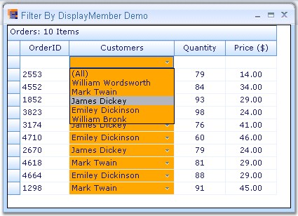{border="0"}

[]{style="FONT-FAMILY: 'Trebuchet MS','sans-serif'; COLOR: #15428b; FONT-SIZE: 9pt"} 

*[Figure ]{style="FONT-SIZE: 9pt"}[307]{style="FONT-SIZE: 9pt"}[: Filtering By Display Member]{style="FONT-SIZE: 9pt"}*

[]{style="FONT-FAMILY: 'Trebuchet MS','sans-serif'; COLOR: #15428b; FONT-SIZE: 9pt"} 

::: {style="BORDER-BOTTOM: windowtext 1pt solid; BORDER-LEFT: medium none; PADDING-BOTTOM: 1pt; MARGIN-TOP: 9pt; PADDING-LEFT: 0pt; PADDING-RIGHT: 0pt; MARGIN-BOTTOM: 9pt; BORDER-TOP: windowtext 1pt solid; BORDER-RIGHT: medium none; PADDING-TOP: 1pt"}
 

{border="0"}Note: For more details, refer the following browser sample:

 

\<Install Location\>\\Syncfusion\\EssentialStudio\\\[Version Number\]\\Windows\\Grid.Grouping.Windows\\Samples\\2.0\\Filters and Expressions\\Filter By DisplayMember Demo
:::

 

[]{#p438} 

 

[]{#_List_of_Filter}4.3.4.3.4.2.5      List of Filter Expressions

[]{style="FONT-FAMILY: 'Trebuchet MS','sans-serif'; COLOR: #15428b; FONT-SIZE: 9pt"} 

Filter expressions can be set and added to RecordFilters collection through a textual string. The string should abide by the syntax to be followed and should be valid.

 

The following table lists tokens used, (Expression Filters) and their descriptions.

[]{style="FONT-FAMILY: 'Trebuchet MS','sans-serif'; COLOR: #15428b; FONT-SIZE: 9pt"} 

[]{style="FONT-FAMILY: 'Trebuchet MS','sans-serif'; COLOR: #15428b; FONT-SIZE: 9pt"} 

::: {align="center"}
+-----------------------+--------------------------------------------------------+----------------------------------------------------------------------------------------------------------------------------------------+
| Syntax                | Expression                                             | Description                                                                                                                            |
+-----------------------+--------------------------------------------------------+----------------------------------------------------------------------------------------------------------------------------------------+
| \*                    | \[columnname\] \* \'anynumber\'                        | Filters grid based on the multiplied value computed.                                                                                   |
+-----------------------+--------------------------------------------------------+----------------------------------------------------------------------------------------------------------------------------------------+
| /                     | \[columnname\] / \'anynumber\'                         | Filters grid based on the divided value computed.                                                                                      |
+-----------------------+--------------------------------------------------------+----------------------------------------------------------------------------------------------------------------------------------------+
| \+                    | \[columnname\] + \'anynumber\'                         | Filters grid based on the result computed.                                                                                             |
+-----------------------+--------------------------------------------------------+----------------------------------------------------------------------------------------------------------------------------------------+
| \-                    | \[columnname\] -- \'anynumber\'                        | Filters grid based on computed value.                                                                                                  |
+-----------------------+--------------------------------------------------------+----------------------------------------------------------------------------------------------------------------------------------------+
| \<                    | \[columnname\] \< \'anynumber\'                        | Filters grid displaying records whose specified column holds value lesser than the mentioned value.                                    |
+-----------------------+--------------------------------------------------------+----------------------------------------------------------------------------------------------------------------------------------------+
| \>                    | \[columnname\] \> \'anynumber\'                        | Filters grid displaying records whose specified column holds value greater than the mentioned value.                                   |
+-----------------------+--------------------------------------------------------+----------------------------------------------------------------------------------------------------------------------------------------+
| =                     | \[columnname\] = \'value\'                             | Filters grid displaying records whose specified column holds value equal to the mentioned value.                                       |
+-----------------------+--------------------------------------------------------+----------------------------------------------------------------------------------------------------------------------------------------+
| \<=                   | \[columnname\] \<= \'anynumber\'                       | Filters grid displaying records whose specified column holds value lesser than or equal to the mentioned value.                        |
+-----------------------+--------------------------------------------------------+----------------------------------------------------------------------------------------------------------------------------------------+
| \>=                   | \[columnname\] \>= \'anynumber\'                       | Filters grid displaying records whose specified column holds value greater than or equal to the mentioned value.                       |
+-----------------------+--------------------------------------------------------+----------------------------------------------------------------------------------------------------------------------------------------+
| \<\>                  | ::: {align="center"}                                   | Filters grid displaying records whose specified column holds value not equal to the mentioned value.                                   |
|                       |   -------------------------------                      |                                                                                                                                        |
|                       |   \[columnname\] \<\> \'value\'                        |                                                                                                                                        |
|                       |   -------------------------------                      |                                                                                                                                        |
|                       | :::                                                    |                                                                                                                                        |
+-----------------------+--------------------------------------------------------+----------------------------------------------------------------------------------------------------------------------------------------+
| AND                   | \[expression1\] AND \[expression2\] AND\[expression\]  | Filters grid displaying records that meet criteria of all the expressions.                                                             |
+-----------------------+--------------------------------------------------------+----------------------------------------------------------------------------------------------------------------------------------------+
| OR                    | \[expression1\] OR \[expression2\] OR\[expression\]    | Filters grid displaying records that meet criteria of either or all the expressions.                                                   |
+-----------------------+--------------------------------------------------------+----------------------------------------------------------------------------------------------------------------------------------------+
| XOR                   | \[expression1\] XOR \[expression2\] XOR \[expression\] | Filters grid displaying records that doesn\'t meet criteria of either or all the expressions.                                          |
+-----------------------+--------------------------------------------------------+----------------------------------------------------------------------------------------------------------------------------------------+
| LIKE                  | \[columnname\] LIKE \'value\'                          | Filters grid displaying records whose specified column holds value equal to the mentioned value(irrespective of character casing).     |
+-----------------------+--------------------------------------------------------+----------------------------------------------------------------------------------------------------------------------------------------+
| MATCH                 | \[columnname\] MATCH \'value\'                         | Filters grid displaying records whose specified column holds whole or a part of the mentioned value(irrespective of character casing). |
+-----------------------+--------------------------------------------------------+----------------------------------------------------------------------------------------------------------------------------------------+
| BETWEEN               | \[columnname\] BETWEEN {date1,date2}                   | Filters grid displaying records whose date lies between the two dates irrespective of the time.                                        |
+-----------------------+--------------------------------------------------------+----------------------------------------------------------------------------------------------------------------------------------------+
| BETWEENTIME           | \[columnname\] BETWEENTIME  {datetime1,datetime2}      | Filters grid displaying records whose datetimevalue lies between the two dates and respective times.                                   |
+-----------------------+--------------------------------------------------------+----------------------------------------------------------------------------------------------------------------------------------------+
| IN                    | \[columnname\] IN \'val1,val2,..,valn\'                | Filters grid displaying records whose specified column hold the values mentioned.                                                      |
+-----------------------+--------------------------------------------------------+----------------------------------------------------------------------------------------------------------------------------------------+
:::

[]{style="FONT-FAMILY: 'Trebuchet MS','sans-serif'; COLOR: #15428b; FONT-SIZE: 9pt"} 

 

[]{#p439} 

[]{#related-topics}
::::::::::::::
