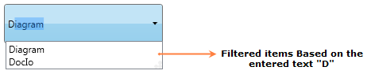

::: {style="DISPLAY: none"}
{#d2h_url_template}{#d2h_package_url style="WIDTH: 0px; DISPLAY: none; HEIGHT: 0px"}
:::

::::: {.d2h_secondary_topic style="PADDING-BOTTOM: 10pt; MARGIN: 0pt; PADDING-LEFT: 0pt; PADDING-RIGHT: 0pt; PADDING-TOP: 0pt"}
#### Filter Support {#filter-support style="tab-stops: 0pt"}

Filter support is used to filter the matched list of items from the linked source depending on the text entered in the AutoComplete textbox. AutoComplete allows the user to enable Filter the items using IsFilter property.

 

{border="0"}

Figure 30: Filter Support

 

 

Adding Filter Support to an Application

If the **IsFilter** property is set as True, once you enter text in the AutoComplete textbox, the matched list of items will be displayed in the drop-down list. If this property is set as False the matched list of items will not be displayed in the drop-down list, instead all the items will be displayed.

 

+------------------------------------------------------------------------------------------------------------------------------------------------------------------------------------------------------------------------------------------------------------------------------------------------------------------------------------------------------------------------------------------------------------------------------------------------------------------------------------------------------------------------------------------------------------------------------------------------------------------------------------------------+
| **[\[XAML\]]{style="FONT-FAMILY: 'Courier New'"}**                                                                                                                                                                                                                                                                                                                                                                                                                                                                                                                                                                                             |
|                                                                                                                                                                                                                                                                                                                                                                                                                                                                                                                                                                                                                                                |
| [\<]{style="FONT-FAMILY: 'Courier New'; COLOR: blue"}[syncfusion]{style="FONT-FAMILY: 'Courier New'; COLOR: #a31515"}[:]{style="FONT-FAMILY: 'Courier New'; COLOR: blue"}[AutoComplete]{style="FONT-FAMILY: 'Courier New'; COLOR: #a31515"}[ x]{style="FONT-FAMILY: 'Courier New'; COLOR: red"}[:]{style="FONT-FAMILY: 'Courier New'; COLOR: blue"}[Name]{style="FONT-FAMILY: 'Courier New'; COLOR: red"}[=\"AutoComplete1\"]{style="FONT-FAMILY: 'Courier New'; COLOR: blue"}[ IsFilter]{style="FONT-FAMILY: 'Courier New'; COLOR: red"}[=\"true\"/\>]{style="FONT-FAMILY: 'Courier New'; COLOR: blue"}[]{style="FONT-FAMILY: 'Courier New'"} |
+------------------------------------------------------------------------------------------------------------------------------------------------------------------------------------------------------------------------------------------------------------------------------------------------------------------------------------------------------------------------------------------------------------------------------------------------------------------------------------------------------------------------------------------------------------------------------------------------------------------------------------------------+

 

+---------------------------------------------------------------------------------------------------------------------------------------------------------------------------------------------------------------------------------------------------------------------------------------+
| **[\[C#\]]{style="FONT-FAMILY: 'Courier New'"}**                                                                                                                                                                                                                                      |
|                                                                                                                                                                                                                                                                                       |
| [AutoComplete]{style="FONT-FAMILY: 'Courier New'; COLOR: teal"}[ autoComplete1 = [new]{style="COLOR: blue"} [AutoComplete]{style="COLOR: teal"}();]{style="FONT-FAMILY: 'Courier New'"}                                                                                               |
|                                                                                                                                                                                                                                                                                       |
| [this]{style="FONT-FAMILY: 'Courier New'; COLOR: blue"}[.]{style="FONT-FAMILY: 'Courier New'"}[autoComplete1]{style="FONT-FAMILY: 'Courier New'"}[.IsFilter = [true]{style="COLOR: #2b91af"};]{style="FONT-FAMILY: 'Courier New'"}[]{style="FONT-FAMILY: Consolas; FONT-SIZE: 9.5pt"} |
+---------------------------------------------------------------------------------------------------------------------------------------------------------------------------------------------------------------------------------------------------------------------------------------+

 

Tables for properties, methods, and events

Properties

           Table 11: Property Table for Filter

::: {align="center"}
  ---------- --------------------------------------------------------- -------------------- ------------ -----------------
  Property   Description                                               Type                 Data Type    Reference links
  IsFilter   Gets or sets the value of IsFilter in the AutoComplete.   DependencyProperty   bool(true)   
  ---------- --------------------------------------------------------- -------------------- ------------ -----------------
:::

**[]{style="FONT-FAMILY: 'Trebuchet MS','sans-serif'; COLOR: #15428b; FONT-SIZE: 9pt"}** 

Events

Table 12: Event Table for Filter

::: {align="center"}
+-----------------+-----------------------------------------------------------------------+------------------------------------+-------------------+---------------------------------+
| Event           | Description                                                           | Arguments                          | Type              | Reference links                 |
+-----------------+-----------------------------------------------------------------------+------------------------------------+-------------------+-------------------+-------------+
| IsFilterChanged |  When the value of IsFilter is changed, this event will be triggered. | DependencyObject,                  | DependencyPropertyChangedCallBack     |             |
|                 |                                                                       |                                    |                                       |             |
|                 | It cannot be cancelled.                                               | DependencyPropertyChangedEventArgs |                                       |             |
+=================+=======================================================================+====================================+===================+===================+=============+
|                 |                                                                       |                                    |                   |                   |             |
+-----------------+-----------------------------------------------------------------------+------------------------------------+-------------------+-------------------+-------------+
:::

**[]{style="FONT-FAMILY: 'Trebuchet MS','sans-serif'; COLOR: #15428b; FONT-SIZE: 9pt"}** 

Sample Link

WPF Sample Browser-\> Tools -\> Editors -\> AutoComplete Demo

 

[]{#related-topics}
:::::
