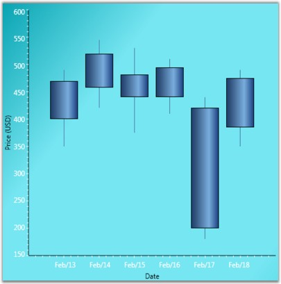
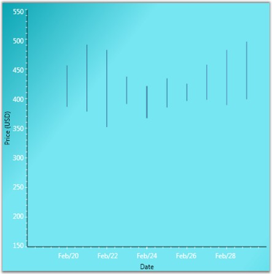
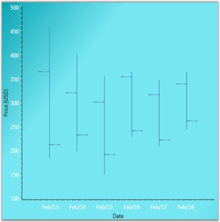
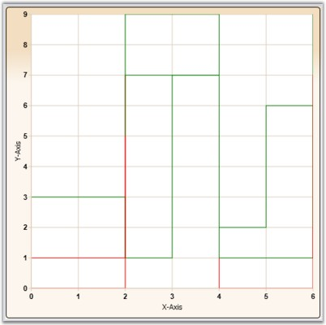
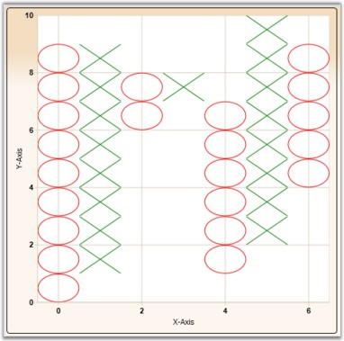
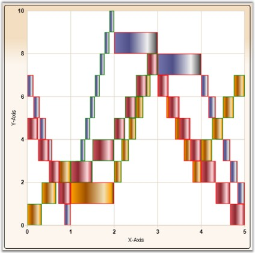
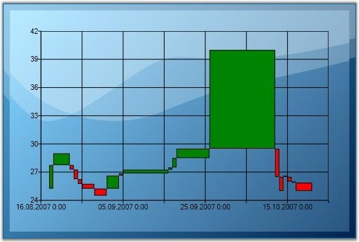
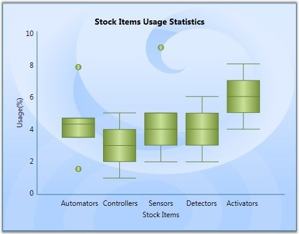
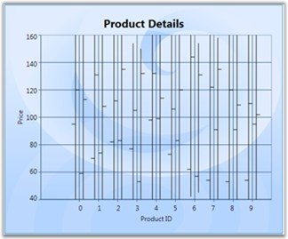
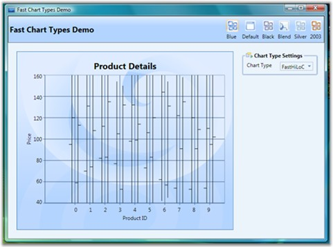

::: {style="DISPLAY: none"}
{#d2h_url_template}{#d2h_package_url style="WIDTH: 0px; DISPLAY: none; HEIGHT: 0px"}
:::

::::::::::::::::::::::::::: {.d2h_secondary_topic style="PADDING-BOTTOM: 10pt; MARGIN: 0pt; PADDING-LEFT: 0pt; PADDING-RIGHT: 0pt; PADDING-TOP: 0pt"}
##### Financial Charts {#financial-charts style="tab-stops: 0pt"}

###### 4.1.1.4.7.1 Candle Chart {#candle-chart style="tab-stops: 0pt"}

A Candle Chart displays stock information using the High, Low, Open and Close values. The Hi and Lo values are represented by the wick of a candle. The candle represents open and close values.

 

The following image shows a CandleChart displaying a single series.

[]{style="FONT-FAMILY: 'Trebuchet MS','sans-serif'; COLOR: #15428b; FONT-SIZE: 9pt"} 

{border="0"}

Figure 144: Candle Chart

 

Data Requirements

[]{style="FONT-FAMILY: 'Trebuchet MS','sans-serif'; COLOR: #15428b; FONT-SIZE: 9pt"} 

Table 88: Property Table

::: {align="center"}
+------------------------------+------------------------------------------------+
| Details                                                                       |
+------------------------------+------------------------------------------------+
| Number of y values per point | four (High, Low , Open and Close respectively) |
+------------------------------+------------------------------------------------+
| Number of points             | one or more                                    |
+------------------------------+------------------------------------------------+
| Number of series             | one or more                                    |
+------------------------------+------------------------------------------------+
:::

[]{style="FONT-FAMILY: 'Trebuchet MS','sans-serif'; COLOR: #15428b; FONT-SIZE: 9pt"} 

CandleType Properties

[]{style="FONT-FAMILY: 'Trebuchet MS','sans-serif'; COLOR: #15428b; FONT-SIZE: 9pt"} 

Table 89: Property Table

::: {align="center"}
+-------------------+-----------------+-----------------+--------------------------------------+
| Name              | Type            | Container       | Description                          |
+-------------------+-----------------+-----------------+--------------------------------------+
| ChartType.Spacing | double          | ChartArea       | interval between line groups         |
|                   |                 |                 |                                      |
|                   |                 |                 | Possible value lies between 0 and 1. |
+-------------------+-----------------+-----------------+--------------------------------------+
:::

[]{style="FONT-FAMILY: 'Trebuchet MS','sans-serif'; COLOR: #15428b; FONT-SIZE: 9pt"} 

Template

While setting template the following parameters can be used:

[]{style="FONT-FAMILY: 'Trebuchet MS','sans-serif'; COLOR: #15428b; FONT-SIZE: 9pt"} 

Table 90: Template Parameter

::: {align="center"}
  ---------- ------------- ------------------------------
  Name       Type          Description
  HiX        double        x-coordinate of upper border
  HiY        double        y-coordinate of upper border
  LoX        double        x-coordinate of lower border
  LoY        double        y-coordinate of lower border
  X          double        x-column coordinate
  Y          double        y-column coordinate
  Width      double        column width
  Height     double        column height
  Interior   Brush         column color
  Series     ChartSeries   reference to series-owner
  ---------- ------------- ------------------------------
:::

**[]{style="FONT-FAMILY: 'Trebuchet MS','sans-serif'; COLOR: #15428b"}** 

A sample which demonstrates Financial Chart Types is available in the following sample installation path.

 

***..My Documents\\Syncfusion\\EssentialStudio\\\<Version Number\>\\WPF\\Chart.WPF\\Samples\\3.5\\WindowsSamples\\Chart Gallery\\Financial Chart Demo***

 

See Also

[[Chart Types]{.UGHyperlink}](ms-xhelp:///?Id=4bd3b3da-f784-44a7-be8f-082f35b29dee)[]{.UGHyperlink}

[]{#p104} 

###### 4.1.1.4.7.2 HiLo Chart {#hilo-chart style="tab-stops: 0pt"}

Hi Lo Chart is a special kind of chart that is normally used in stock analysis. They are typically used to display error bars or the trading range of a stock for each period.

 

The Hi Lo Chart expect 2 Y values to be specified in the series. One value should represent the high and the other value should represent the low stock price for the period. This can be specified in any order.

 

{border="0"}

Figure 145: HiLo Chart

[]{style="FONT-FAMILY: 'Trebuchet MS','sans-serif'; COLOR: #15428b; FONT-SIZE: 9pt"} 

Data Requirements

[]{style="FONT-FAMILY: 'Trebuchet MS','sans-serif'; COLOR: #15428b; FONT-SIZE: 9pt"} 

Table 91: Template Parameter

::: {align="center"}
+------------------------------+-------------+
| Details                                    |
+------------------------------+-------------+
| Number of y values per point | two         |
+------------------------------+-------------+
| Number of points             | one or more |
+------------------------------+-------------+
| Number of series             | one or more |
+------------------------------+-------------+
:::

[]{style="FONT-FAMILY: 'Trebuchet MS','sans-serif'; COLOR: #15428b; FONT-SIZE: 9pt"} 

Template

While setting template the following parameters can be used:

[]{style="FONT-FAMILY: 'Trebuchet MS','sans-serif'; COLOR: #15428b; FONT-SIZE: 9pt"} 

Table 92: Template Parameter

::: {align="center"}
  ---------- ------------- ------------------------------
  Name       Type          Description
  HiX        double        x-coordinate of upper border
  HiY        double        y-coordinate of upper border
  LoX        double        x-coordinate of lower border
  LoY        double        y-coordinate of lower border
  Interior   Brush         column color
  Series     ChartSeries   reference to series-owner
  ---------- ------------- ------------------------------
:::

[]{style="FONT-FAMILY: 'Trebuchet MS','sans-serif'; COLOR: #15428b; FONT-SIZE: 9pt"} 

A sample which demonstrates Financial Chart Types is available in the following sample installation path.

 

***..My Documents\\Syncfusion\\EssentialStudio\\\<Version Number\>\\WPF\\Chart.WPF\\Samples\\3.5\\WindowsSamples\\Chart Gallery\\Financial Chart Demo***

 

See Also

[]{#p105}[[[Chart Types]{style="COLOR: blue"}](ms-xhelp:///?Id=090eefb9-2795-4da0-9063-ee320e7499af)]{.UGHyperlink}

[]{style="FONT-FAMILY: 'Trebuchet MS','sans-serif'; COLOR: #15428b; FONT-SIZE: 9pt"} 

###### 4.1.1.4.7.3 HiLoOpenClose Chart {#hiloopenclose-chart style="tab-stops: 0pt"}

Hi Lo Open Close Chart is a special kind of chart that is normally used in stock analysis. This chart type expects 4 Y values for every point in the series. Those values should represent the High, Low, Open and Close values of the stock, in that order, for that period.

[]{style="FONT-FAMILY: 'Trebuchet MS','sans-serif'; COLOR: #15428b; FONT-SIZE: 9pt"} 

{border="0"}

Figure 146: HiLoOpenClose Chart

[]{style="FONT-FAMILY: 'Trebuchet MS','sans-serif'; COLOR: #15428b; FONT-SIZE: 9pt"} 

Data Requirements

[]{style="FONT-FAMILY: 'Trebuchet MS','sans-serif'; COLOR: #15428b; FONT-SIZE: 9pt"} 

Table 93: Data Parameter

::: {align="center"}
+------------------------------+-------------------------------------------------+
| Details                                                                        |
+------------------------------+-------------------------------------------------+
| Number of y values per point | four (Open, Close, High and Low, in that order) |
+------------------------------+-------------------------------------------------+
| Number of points             | one or more                                     |
+------------------------------+-------------------------------------------------+
| Number of series             | one or more                                     |
+------------------------------+-------------------------------------------------+
:::

[]{style="FONT-FAMILY: 'Trebuchet MS','sans-serif'; COLOR: #15428b; FONT-SIZE: 9pt"} 

Template

While setting template the following parameters can be used:

[]{style="FONT-FAMILY: 'Trebuchet MS','sans-serif'; COLOR: #15428b; FONT-SIZE: 9pt"} 

Table 94: Template Parameters

::: {align="center"}
  ---------------- ------------- -------------------------------------
  Name             Type          Description
  HiX              double        x-coordinate of upper border
  HiY              double        y-coordinate of upper border
  LoX              double        x-coordinate of lower border
  LoY              double        y-coordinate of lower border
  StartOpenX       double        x start coordinate of opening price
  StartOpenY       double        y start coordinate of opening price
  EndOpenX         double        x end coordinate of opening price
  EndOpenY         double        y end coordinate of opening price
  StartCloseX      double        x start coordinate of closing price
  StartCloseY      double        y start coordinate of closing price
  EndCloseX        double        x end coordinate of closing price
  EndCloseY        double        y end coordinate of closing price
  Interior         Brush         column color
  Series           ChartSeries   reference to series-owner
  ---------------- ------------- -------------------------------------
:::

**[]{style="FONT-FAMILY: 'Trebuchet MS','sans-serif'; COLOR: #15428b"}** 

A sample which demonstrates Financial Chart Types is available in the following sample installation path.

 

***..My Documents\\Syncfusion\\EssentialStudio\\\<Version Number\>\\WPF\\Chart.WPF\\Samples\\3.5\\WindowsSamples\\Chart Gallery\\Financial Chart Demo***

 

See A[]{#p106}lso

[[Chart Types]{.UGHyperlink}](ms-xhelp:///?Id=c3222837-ddbe-47c9-b794-0439f5e2166b)[]{.UGHyperlink}

 

###### 4.1.1.4.7.4 Kagi Chart {#kagi-chart style="tab-stops: 0pt"}

Kagi Charts are a Japanese invention and date since the late 1870\'s, but were popularized in the western world by Steven Nison. They contain a series of connecting vertical lines where the thickness and direction of those lines depend on price. If closing prices continue to move in the direction of the prior vertical Kagi line, then that line is extended. However, if the closing price reverses by a pre-determined \"reversal\" amount, a new Kagi line is drawn in the next column in the opposite direction.

 

The penetration of a prior column\'s high or low, by the latest closing price, alters the colors of the lines. These colors depict either a bullish or bearish pattern. Use the **PriceUpColor** and **PriceDownColor** properties to specify the colors for these two patterns. The wider the columns, the stronger the pattern.

 

{border="0"}

Figure 147: Kagi Chart

[]{style="FONT-FAMILY: 'Trebuchet MS','sans-serif'; COLOR: #15428b; FONT-SIZE: 9pt"} 

Data Requirements

[]{style="FONT-FAMILY: 'Trebuchet MS','sans-serif'; COLOR: #15428b; FONT-SIZE: 9pt"} 

Table 95: Data Requirement

::: {align="center"}
+------------------------------+-------------+
| Details                                    |
+------------------------------+-------------+
| Number of y values per point | one         |
+------------------------------+-------------+
| Number of points             | one or more |
+------------------------------+-------------+
| Number of series             | one or more |
+------------------------------+-------------+
:::

[]{style="FONT-FAMILY: 'Trebuchet MS','sans-serif'; COLOR: #15428b; FONT-SIZE: 9pt"} 

KagiType Properties

[]{style="FONT-FAMILY: 'Trebuchet MS','sans-serif'; COLOR: #15428b; FONT-SIZE: 9pt"} 

Table 96: Template Parameter

::: {align="center"}
  ------------------------------ -------- ------------- -----------------------------------------------------------------------------
  Name                           Type     Container     Description
  ChartKagiType.ReversalAmount   double   ChartSeries   price difference which should overcome in order to change diagram direction
  ------------------------------ -------- ------------- -----------------------------------------------------------------------------
:::

[]{style="FONT-FAMILY: 'Trebuchet MS','sans-serif'; COLOR: #15428b; FONT-SIZE: 9pt"} 

Template

While setting template the following parameters can be used:

[]{style="FONT-FAMILY: 'Trebuchet MS','sans-serif'; COLOR: #15428b; FONT-SIZE: 9pt"} 

Table 97: Template Parameter

::: {align="center"}
  ------------- ----------------- --------------------------------------------
  Name          Type              Description
  IsPriceUp     bool              *true* -- if segment shows price rising
  IsPriceDown   bool              *true* -- if segment shows price recession
  Points        PointCollection   collection of segment points
  Interior      Brush             column color
  Series        ChartSeries       reference to series-owner
  ------------- ----------------- --------------------------------------------
:::

[]{style="FONT-FAMILY: 'Trebuchet MS','sans-serif'; COLOR: #15428b; FONT-SIZE: 9pt"} 

A sample which demonstrates Financial Chart Types is available in the following sample installation path.

 

***..My Documents\\Syncfusion\\EssentialStudio\\\<Version Number\>\\WPF\\Chart.WPF\\Samples\\3.5\\WindowsSamples\\Chart Gallery\\Financial Chart Demo***

 

See Also

[[Chart Types]{.UGHyperlink}](ms-xhelp:///?Id=c3222837-ddbe-47c9-b794-0439f5e2166b)[]{.UGHyperlink}

[]{#p107} 

###### 4.1.1.4.7.5 Point and Figure Chart {#point-and-figure-chart style="tab-stops: 0pt"}

Point and Figure Chart is used to identify support levels, resistance levels and chart patterns. The chart ignores the time factor and concentrates solely on movements in price - a column of Xs or Os may take one day or several weeks to complete. By convention, the first X in a column is plotted one box above the last O in the previous column (and the first O in a column is plotted one box below the highest X). 

 

This is a chart that plots the day-to-day increment and decrement in price. It uses a series of X\'s and O\'s to determine price trends where the X\'s represent an upward trend and the O\'s represent a downward trend. The default value of **ReversalAmount** is 1. Use the **PriceUpColor** to specify the color for the Xs and **PriceDownColor** to specify the color for the Os.

 

This chart requires 2 Y values, the high value and the low value for the specified period.

 

{border="0"}

Figure 148: Point and Figure Chart

[]{style="FONT-FAMILY: 'Trebuchet MS','sans-serif'; COLOR: #15428b; FONT-SIZE: 9pt"} 

Data Requirements

[]{style="FONT-FAMILY: 'Trebuchet MS','sans-serif'; COLOR: #15428b; FONT-SIZE: 9pt"} 

Table 98: Data Requirement

::: {align="center"}
+------------------------------+-------------+
| Details                                    |
+------------------------------+-------------+
| Number of y values per point | two         |
+------------------------------+-------------+
| Number of points             | one or more |
+------------------------------+-------------+
| Number of series             | one or more |
+------------------------------+-------------+
:::

[]{style="FONT-FAMILY: 'Trebuchet MS','sans-serif'; COLOR: #15428b; FONT-SIZE: 9pt"} 

PointAndFigure Customization

[]{style="FONT-FAMILY: 'Trebuchet MS','sans-serif'; COLOR: #15428b; FONT-SIZE: 9pt"} 

Table 99: PointAndFigure Customization

::: {align="center"}
  ---------------------------------------- -------- ------------- --------------------------------------------------------------------------------
  Name                                     Type     Container     Description
  ChartPointAndFigureType.FigureCost       double   ChartSeries   price of one segment
  ChartPointAndFigureType.ReversalAmount   double   ChartSeries   price difference which should be overcome in order to change diagram direction
  ---------------------------------------- -------- ------------- --------------------------------------------------------------------------------
:::

[]{style="FONT-FAMILY: 'Trebuchet MS','sans-serif'; COLOR: #15428b; FONT-SIZE: 9pt"} 

Template

While setting template the following parameters can be used.

[]{style="FONT-FAMILY: 'Trebuchet MS','sans-serif'; COLOR: #15428b; FONT-SIZE: 9pt"} 

Table 100: Template Parameter

::: {align="center"}
  ---------- ------------- --------------------------------
  Name       Type          Description
  X          double        x-column coordinate
  Y          double        y-column coordinate
  Width      double        column width
  IsPoint    bool          *true* -- if segment is point
  IsFigure   bool          *true* -- if segment is figure
  Height     double        column height
  Interior   Brush         column Color
  Series     ChartSeries   reference to series-owner
  ---------- ------------- --------------------------------
:::

[]{style="FONT-FAMILY: 'Trebuchet MS','sans-serif'; COLOR: #15428b; FONT-SIZE: 9pt"} 

A sample which demonstrates Financial Chart Types is available in the following sample installation path.

 

***..My Documents\\Syncfusion\\EssentialStudio\\\<Version Number\>\\WPF\\Chart.WPF\\Samples\\3.5\\WindowsSamples\\Chart Gallery\\Financial Chart Demo***

 

See Also

[]{#p108}[[[Chart Types]{style="COLOR: blue"}](ms-xhelp:///?Id=0ef96a0c-baf7-49cd-999a-bc387528f4f6)]{.UGHyperlink}

[]{style="FONT-FAMILY: 'Trebuchet MS','sans-serif'; COLOR: #15428b; FONT-SIZE: 9pt"} 

###### 4.1.1.4.7.6 Renko Chart {#renko-chart style="tab-stops: 0pt"}

Renko charting method is thought to have acquired its name from \"renga\" which is the Japanese word for bricks. Renko Charts were introduced by Steve Nison. Renko (Bricks) are drawn equal in size for a determined amount. A brick is drawn in the direction of the prior move only if prices move by a minimum amount. If prices change by the determined amount or more, a new brick is drawn. If prices change by less than the determined amount (specified by **ReversalAmount**), the new price is ignored. The default value of ReversalAmount is 1.

 

If the new closing price penetrates the previous bricks closing price in the opposite direction a trend reversal highlighted by the change in color of the bricks happens. Use the **PriceUpColor** to indicate bullish trend and **PriceDownColor** to indicate bearish trend.

 

Since a Renko chart isolates the underlying trends by filtering out the minor ups and downs, Renko charts are excellent in determining support and resistance levels. 

 

{border="0"}

Figure 149: Renko Chart

[]{style="FONT-FAMILY: 'Trebuchet MS','sans-serif'; COLOR: #15428b; FONT-SIZE: 9pt"} 

Data Requirements

[]{style="FONT-FAMILY: 'Trebuchet MS','sans-serif'; COLOR: #15428b; FONT-SIZE: 9pt"} 

Table 101: Data Requirements

::: {align="center"}
+------------------------------+-------------+
| Details                                    |
+------------------------------+-------------+
| Number of y values per point | one         |
+------------------------------+-------------+
| Number of points             | one or more |
+------------------------------+-------------+
| Number of series             | one or more |
+------------------------------+-------------+
:::

 

Renko Customization

[]{style="FONT-FAMILY: 'Trebuchet MS','sans-serif'; COLOR: #15428b; FONT-SIZE: 9pt"} 

Table 102: Renko Customization

::: {align="center"}
  -------------------------- -------- ------------- ----------------------------
  Name                       Type     Container     Description
  ChartRenkoType.RenkoCost   double   ChartSeries   price of one Renko segment
  -------------------------- -------- ------------- ----------------------------
:::

[]{style="FONT-FAMILY: 'Trebuchet MS','sans-serif'; COLOR: #15428b; FONT-SIZE: 9pt"} 

Template

While setting template the following parameters can be used:

[]{style="FONT-FAMILY: 'Trebuchet MS','sans-serif'; COLOR: #15428b; FONT-SIZE: 9pt"} 

Table 103: Template Parameters

::: {align="center"}
  ------------- ------------- --------------------------------------------
  Name          Type          Description
  X             double        x column coordinate
  Y             double        y column coordinate
  Width         double        column width
  IsPriceUp     bool          *true* -- if segment shows price rising
  IsPriceDown   bool          *true* -- if segment shows price recession
  Height        double        column height
  Interior      Brush         column color
  Series        ChartSeries   reference to series-owner
  ------------- ------------- --------------------------------------------
:::

[]{style="FONT-FAMILY: 'Trebuchet MS','sans-serif'; COLOR: #15428b; FONT-SIZE: 9pt"} 

A sample which demonstrates Financial Chart Types is available in the following sample installation path.

 

***..My Documents\\Syncfusion\\EssentialStudio\\\<Version Number\>\\WPF\\Chart.WPF\\Samples\\3.5\\WindowsSamples\\Chart Gallery\\Financial Chart Demo***

 

See Also

[]{#p109}[[[Chart Types]{style="COLOR: blue"}](ms-xhelp:///?Id=6b787e40-d6b7-4521-ad55-8091ed16787f)]{.UGHyperlink}

 

###### 4.1.1.4.7.7 ThreeLineBreak Chart {#threelinebreak-chart style="tab-stops: 0pt"}

Three Line Break Chart is similar in concept to point and figure charts. The Three Line Break charting method is so-named because of the number of lines typically used. It displays a series of vertical boxes (\"lines\") that are based on changes in prices. It ignores the passage of time.

 

The three-line break chart looks like a series of rising and falling lines of varying heights. Each new line, like the Xs and Os of a point and figure chart, occupies a new column. Based on closing prices (or highs and lows), a new rising line is drawn if the previous high is exceeded and a new falling line is drawn if the price hits a new low. Change in price trends are highlighted by changing colors. Use the PriceUpColor to indicate bullish trend and PriceDownColor to indicate bearish trend.

 

The ReversalAmount specifies the threshold amount by which the price should change to begin rendering a new vertical box in the appropriate direction.

 

{border="0"}

Figure 150: ThreeLineBreak Chart

[]{style="FONT-FAMILY: 'Trebuchet MS','sans-serif'; COLOR: #15428b; FONT-SIZE: 9pt"} 

Data Requirements

[]{style="FONT-FAMILY: 'Trebuchet MS','sans-serif'; COLOR: #15428b; FONT-SIZE: 9pt"} 

Table 104: Data Requirement

::: {align="center"}
+------------------------------+-------------+
| Details                                    |
+------------------------------+-------------+
| Number of y values per point | one         |
+------------------------------+-------------+
| Number of points             | one or more |
+------------------------------+-------------+
| Number of series             | one or more |
+------------------------------+-------------+
:::

**[]{style="FONT-FAMILY: 'Trebuchet MS','sans-serif'; COLOR: #15428b"}** 

Renko Customization

**[]{style="FONT-FAMILY: 'Trebuchet MS','sans-serif'; COLOR: #15428b"}** 

Table 105: Renko Customization

::: {align="center"}
  ---------------------------------------- -------- ------------- -----------------------------------------------
  Name                                     Type     Container     Description
  ChartThreeLineBreakType.BreakLineCount   double   ChartSeries   sets the break line count Default value is 3.
  ---------------------------------------- -------- ------------- -----------------------------------------------
:::

 

Template

While setting template the following parameters can be used.

[]{style="FONT-FAMILY: 'Trebuchet MS','sans-serif'; COLOR: #15428b; FONT-SIZE: 9pt"} 

Table 106: Template Parameter

::: {align="center"}
  Name          Type          Description
  ------------- ------------- --------------------------------------------
  X             double        x-column coordinate
  Y             double        y-column coordinate
  Width         double        column width
  IsPriceUp     bool          *true* -- if segment shows price rising
  IsPriceDown   bool          *true* -- if segment shows price recession
  Height        double        column height
  Interior      Brush         column color
  Series        ChartSeries   reference to series-owner
:::

[]{style="FONT-FAMILY: 'Trebuchet MS','sans-serif'; COLOR: #15428b; FONT-SIZE: 9pt"} 

A sample which demonstrates Financial Chart Types is available in the following sample installation path.

 

***..My Documents\\Syncfusion\\EssentialStudio\\\<Version Number\>\\WPF\\Chart.WPF\\Samples\\3.5\\WindowsSamples\\Chart Gallery\\Financial Chart Demo***

 

See Also

[[Chart Types]{.UGHyperlink}](ms-xhelp:///?Id=6b787e40-d6b7-4521-ad55-8091ed16787f)[]{.UGHyperlink}

[]{style="FONT-FAMILY: 'Trebuchet MS','sans-serif'; COLOR: #15428b; FONT-SIZE: 9pt"} 

###### []{#p110}4.1.1.4.7.8 Box and Whisker Chart {#box-and-whisker-chart style="tab-stops: 0pt"}

In 1977, John Tukey published an efficient method for displaying a five-number data summary. The graph is called a Box and Whisker plot (also known as BoxPlot) and summarizes the following statistical measures.

 

[·      ]{style="FONT-FAMILY: Symbol"}median

[·      ]{style="FONT-FAMILY: Symbol"}upper and lower quartiles (75 percentile to 25 percentile)

[·      ]{style="FONT-FAMILY: Symbol"}minimum and maximum data values

 

The following is an example of a Box and Whisker plot.

 

{border="0"}

Figure 151: Box and Whisker Chart

[]{style="FONT-FAMILY: 'Trebuchet MS','sans-serif'; COLOR: #15428b; FONT-SIZE: 9pt"} 

Custom Properties

**[]{style="POSITION: relative; COLOR: #4a5c8c; FONT-SIZE: 9pt; TOP: 4.5pt"}** 

Table 107: Property Table

::: {align="center"}
+-------------------+-----------------+-----------------+--------------------------------------+
| Name              | Type            | Container       | Description                          |
+-------------------+-----------------+-----------------+--------------------------------------+
| ChartType.Spacing | double          | ChartArea       | interval between columns             |
|                   |                 |                 |                                      |
|                   |                 |                 | Possible value lies between 0 and 1. |
+-------------------+-----------------+-----------------+--------------------------------------+
:::

[]{style="FONT-FAMILY: 'Trebuchet MS','sans-serif'; COLOR: #15428b; FONT-SIZE: 9pt"} 

Template

While setting template the following parameters can be used.

[]{style="FONT-FAMILY: 'Trebuchet MS','sans-serif'; COLOR: #15428b; FONT-SIZE: 9pt"} 

Table 108: Template Parameter

::: {align="center"}
  ----------------- ------------- ---------------------------
  Name              Type          Description
  X                 double        x-column coordinate
  Y                 double        y-column coordinate
  Width             double        column width
  TopWhiskerX1      double        x1 of upper border
  TopWhiskerY1      double        y1 of upper border
  TopWhiskerX2      double        x2 of upper border
  TopWhiskerY2      double        y2 of upper border
  BottomWhiskerX1   double        x1 of lower border
  BottomWhiskerY1   double        y1 of lower border
  BottomWhiskerX2   double        x2 of lower border
  BottomWhiskerY2   double        y2 of lower border
  MedianWhiskerX1   double        x1 of lengthwise line
  MedianWhiskerY1   double        y1 of lengthwise line
  MedianWhiskerX2   double        x2 of lengthwise line
  MedianWhiskerY2   double        y2 of lengthwise line
  Height            double        column height
  Interior          Brush         column color
  Series            ChartSeries   reference to series-owner
  ----------------- ------------- ---------------------------
:::

[]{style="FONT-FAMILY: 'Trebuchet MS','sans-serif'; COLOR: #15428b; FONT-SIZE: 9pt"} 

Data Requirements

[]{style="FONT-FAMILY: 'Trebuchet MS','sans-serif'; COLOR: #15428b; FONT-SIZE: 9pt"} 

Table 109: Data Requirement

::: {align="center"}
+------------------------------+-----------------------------------------------------------------+
| Details                                                                                        |
+------------------------------+-----------------------------------------------------------------+
| Number of y values per point | five (minimum, lower quartile, median, upper quartile, maximum) |
+------------------------------+-----------------------------------------------------------------+
| Number of points             | one or more                                                     |
+------------------------------+-----------------------------------------------------------------+
| Number of series             | one or more                                                     |
+------------------------------+-----------------------------------------------------------------+
:::

[]{style="FONT-FAMILY: 'Trebuchet MS','sans-serif'; COLOR: #15428b; FONT-SIZE: 9pt"} 

Outlier Calculation

[Outliers that are greater than the segment height can be rendered in the chart. Essential chart also provides option to set a difference in such outlier rendering. This difference can be set using the SetDefaultOutlierVisible property.]{style="FONT-SIZE: 9pt"}

[]{style="FONT-SIZE: 9pt"} 

+-------------------------------------------------------------------------------------------------------------------------------------------+
| **[\[C#\]]{style="FONT-FAMILY: 'Courier New'; FONT-SIZE: 9pt"}**                                                                          |
|                                                                                                                                           |
| **[]{style="FONT-FAMILY: 'Courier New'; FONT-SIZE: 9pt"}**                                                                                |
|                                                                                                                                           |
| [ChartBoxAndWhiskerType.SetDefaultOutlierVisible(ser, [false]{style="COLOR: blue"});]{style="FONT-FAMILY: 'Courier New'; FONT-SIZE: 9pt"} |
+-------------------------------------------------------------------------------------------------------------------------------------------+

 

A sample which demonstrates Box And Whisker Chart Type is available in the following sample installation path.

 

..My Documents\\Syncfusion\\EssentialStudio\\\<Version Number\>\\WPF\\Chart.WPF\\Samples\\3.5\\WindowsSamples\\Chart Gallery\\Box-and-Whisker Chart Demo

 

See Also

[[Chart Types]{.UGHyperlink}](ms-xhelp:///?Id=9c6b11bd-859e-44b4-b19e-b91adaf5aefa)[]{.UGHyperlink}

[]{#p111} 

###### 4.1.1.4.7.9 Fast HiLo Open Close {#fast-hilo-open-close style="tab-stops: 0pt"}

Fast High Low (HiLo) Open Close charts are similar to HiLo Open Close Charts and are used in stock analysis. This chart type expects 4 Y values for every point in the series. Those values should represent the High, Low, Open and Close values of the stock, in that order, for a particular period.

 

The Fast High Low (HiLo) Open Close charts have the following advantages:

 

[·      ]{style="FONT-FAMILY: Symbol"}The Fast HiLo Open Close charts are rendered using drawing visuals.

[·      ]{style="FONT-FAMILY: Symbol"}They load faster than the HiLo Open Close charts.

[·      ]{style="FONT-FAMILY: Symbol"}They ensure high performance for displaying data.

[·      ]{style="FONT-FAMILY: Symbol"}They can be used as real time charts to render huge number of data points.

 

The Chart type HiLo Open Close is added in the Enum of type ChartTypes.

 

{border="0"}

Figure 152: Fast HiLo Open Close Chart

**[]{style="FONT-FAMILY: 'Trebuchet MS','sans-serif'; COLOR: #15428b"}** 

Data Requirements

[]{style="FONT-FAMILY: 'Trebuchet MS','sans-serif'; COLOR: #15428b; FONT-SIZE: 9pt"} 

Table 110: Data Requirement

::: {align="center"}
+------------------------------+-------------------------------------------------+
| Details                                                                        |
+------------------------------+-------------------------------------------------+
| Number of y values per point | Four (open, close, high and low, in that order) |
+------------------------------+-------------------------------------------------+
| Number of points             | one or more                                     |
+------------------------------+-------------------------------------------------+
| Number of series             | one or more                                     |
+------------------------------+-------------------------------------------------+
:::

[]{style="FONT-FAMILY: 'Trebuchet MS','sans-serif'; COLOR: #15428b; FONT-SIZE: 9pt"} 

Template

While setting template the following parameters can be used:

[]{style="FONT-FAMILY: 'Trebuchet MS','sans-serif'; COLOR: #15428b; FONT-SIZE: 9pt"} 

Table 111: Template Parameter

::: {align="center"}
  --------------------- ------------- -------------------------------------
  Name                  Type          Description
  HiX                   double        x-coordinate of upper border
  HiY                   double        y-coordinate of upper border
  LoX                   double        x-coordinate of lower border
  LoY                   double        y-coordinate of lower border
  StartOpenX            double        x start coordinate of opening price
  StartOpenY            double        y start coordinate of opening price
  EndOpenX              double        x end coordinate of opening price
  EndOpenY              double        y end coordinate of opening price
  StartCloseX           double        x start coordinate of closing price
  StartCloseY           double        y start coordinate of closing price
  EndCloseX             double        x end coordinate of closing price
  EndCloseY             double        y end coordinate of closing price
  Interior              Brush         column color
  Series                ChartSeries   reference to series-owner
  --------------------- ------------- -------------------------------------
:::

[]{style="FONT-FAMILY: 'Trebuchet MS','sans-serif'; COLOR: #15428b; FONT-SIZE: 9pt"} 

A sample which demonstrates Financial Chart Types is available in the following sample installation path.

 

***..My Documents\\Syncfusion\\EssentialStudio\\\<Version Number\>\\WPF\\Chart.WPF\\Samples\\3.5\\WindowsSamples\\Chart Performance\\Fast chart types***

 

The following code illustrates the creation of Fast High Low (HiLo) Open Close charts.

 

+--------------------------------------------------------------------------------------------------------------------------------------------------------------------------------------------------------------------------------------------------------------------------------------------------------------------------------------------------------------------------------------------------------------------------------------------------------------------------------------------------------------------------------------------------------------------------------------------------------------------------------------------------------------------------------------------------------------------------------------------------------------------------------------------------------------------------------------------------------------+
| **[\[XAML\]]{style="FONT-FAMILY: 'Courier New'"}**                                                                                                                                                                                                                                                                                                                                                                                                                                                                                                                                                                                                                                                                                                                                                                                                           |
|                                                                                                                                                                                                                                                                                                                                                                                                                                                                                                                                                                                                                                                                                                                                                                                                                                                              |
| **[]{style="FONT-FAMILY: 'Courier New'"}**                                                                                                                                                                                                                                                                                                                                                                                                                                                                                                                                                                                                                                                                                                                                                                                                                   |
|                                                                                                                                                                                                                                                                                                                                                                                                                                                                                                                                                                                                                                                                                                                                                                                                                                                              |
| [\<]{style="FONT-FAMILY: 'Courier New'; COLOR: blue"}[syncfusion]{style="FONT-FAMILY: 'Courier New'; COLOR: #a31515"}[:]{style="FONT-FAMILY: 'Courier New'; COLOR: blue"}[ChartSeries]{style="FONT-FAMILY: 'Courier New'; COLOR: #a31515"}[ Type]{style="FONT-FAMILY: 'Courier New'; COLOR: red"}[=\"HiLoOpenClose\"]{style="FONT-FAMILY: 'Courier New'; COLOR: blue"}[ Name]{style="FONT-FAMILY: 'Courier New'; COLOR: red"}[=\"series1\"]{style="FONT-FAMILY: 'Courier New'; COLOR: blue"}[ Stroke]{style="FONT-FAMILY: 'Courier New'; COLOR: red"}[=\"Black\"]{style="FONT-FAMILY: 'Courier New'; COLOR: blue"}[ DataSource]{style="FONT-FAMILY: 'Courier New'; COLOR: red"}[=\"{]{style="FONT-FAMILY: 'Courier New'; COLOR: blue"}[Binding]{style="FONT-FAMILY: 'Courier New'; COLOR: #a31515"}[}\"/\>]{style="FONT-FAMILY: 'Courier New'; COLOR: blue"} |
+--------------------------------------------------------------------------------------------------------------------------------------------------------------------------------------------------------------------------------------------------------------------------------------------------------------------------------------------------------------------------------------------------------------------------------------------------------------------------------------------------------------------------------------------------------------------------------------------------------------------------------------------------------------------------------------------------------------------------------------------------------------------------------------------------------------------------------------------------------------+

[]{style="FONT-FAMILY: 'Trebuchet MS','sans-serif'; COLOR: #15428b; FONT-SIZE: 9pt"} 

+--------------------------------------------------------------------------------------------------------------------------------------------------------------------------------------------------------------------------------------------------------------------------------------------------------------------------------------------------------------------+
| **[\[C#\]]{style="FONT-FAMILY: 'Courier New'"}**                                                                                                                                                                                                                                                                                                                   |
|                                                                                                                                                                                                                                                                                                                                                                    |
| **[]{style="FONT-FAMILY: 'Courier New'"}**                                                                                                                                                                                                                                                                                                                         |
|                                                                                                                                                                                                                                                                                                                                                                    |
| [ChartSeries]{style="FONT-FAMILY: 'Courier New'; COLOR: #2b91af"}[ series = ]{style="FONT-FAMILY: 'Courier New'; COLOR: black"}[new]{style="FONT-FAMILY: 'Courier New'; COLOR: blue"}[ ]{style="FONT-FAMILY: 'Courier New'; COLOR: black"}[ChartSeries]{style="FONT-FAMILY: 'Courier New'; COLOR: #2b91af"}[();]{style="FONT-FAMILY: 'Courier New'; COLOR: black"} |
|                                                                                                                                                                                                                                                                                                                                                                    |
| [series.Type = ]{style="FONT-FAMILY: 'Courier New'; COLOR: black"}[ChartTypes]{style="FONT-FAMILY: 'Courier New'; COLOR: #2b91af"}[.HiLoOpenClose;]{style="FONT-FAMILY: 'Courier New'; COLOR: black"}                                                                                                                                                              |
+--------------------------------------------------------------------------------------------------------------------------------------------------------------------------------------------------------------------------------------------------------------------------------------------------------------------------------------------------------------------+

 

Run the sample. The following output is provided.

 

{border="0"}

Figure 153: Fast HiLo Open Close Chart

 

[]{#p112} 

[]{#related-topics}
:::::::::::::::::::::::::::
