::: {style="DISPLAY: none"}
{#d2h_url_template}{#d2h_package_url style="WIDTH: 0px; DISPLAY: none; HEIGHT: 0px"}
:::

::::: {#nsbanner .d2h_main_nsbanner style="BORDER-BOTTOM: #999999 1px solid; POSITION: relative; PADDING-BOTTOM: 0px; BACKGROUND-COLOR: transparent; PADDING-LEFT: 0px; PADDING-RIGHT: 0px; DISPLAY: none; BORDER-TOP: #999999 1px solid; PADDING-TOP: 0px; LEFT: 0px"}
:::: {#TitleRow .d2h_main_titlerow style="PADDING-BOTTOM: 4px; BACKGROUND-COLOR: transparent; PADDING-LEFT: 22px; WIDTH: 100%; PADDING-RIGHT: 10px; DISPLAY: none; PADDING-TOP: 4px"}
::: {#ienav .d2h_main_ienav style="DISPLAY: none"}
{#D2HPrevious .D2HPreviousEnabled}  {#D2HNext .D2HNextEnabled}
:::
::::
:::::

:::::: {#nstext .d2h_main_nstext style="PADDING-BOTTOM: 10px; BACKGROUND-COLOR: transparent; PADDING-LEFT: 22px; PADDING-RIGHT: 10px; HEIGHT: 100%; OVERFLOW: auto; PADDING-TOP: 5px" hasuserbackground="true" valign="bottom"}
::: {#d2h_breadcrumbs .d2h_breadcrumbs}
[Essential Studio User Guide Documentation](ms-xhelp:///?Id=12457748-09e3-4d74-a240-8e049cedf030){.d2h_breadcrumbsNormal}[ \> ]{.d2h_breadcrumbsLinkSeparator}[User Interface Edition](ms-xhelp:///?Id=c29296b7-531c-413b-a0ec-488ca1f7f669){.d2h_breadcrumbsNormal}[ \> ]{.d2h_breadcrumbsLinkSeparator}[Essential WPF](ms-xhelp:///?Id=7f4f82c5-151c-4262-94d0-75c4626c77bc){.d2h_breadcrumbsNormal}[ \> ]{.d2h_breadcrumbsLinkSeparator}[Essential Edit]{.d2h_breadcrumbsContentsOnly}[ \> ]{.d2h_breadcrumbsLinkSeparator}[Concepts and Features](ms-xhelp:///?Id=f61feb80-1940-4b18-ab36-1ab89df8b52a){.d2h_breadcrumbsNormal}[ \> ]{.d2h_breadcrumbsLinkSeparator}[Basic Editing](ms-xhelp:///?Id=bd0f1475-d3d2-40f8-9e8e-4001f1f7c6fa){.d2h_breadcrumbsNormal}
:::

### Find and Replace {#find-and-replace style="tab-stops: 0pt"}

Essential Edit WPF is now enhanced with Find and Replace feature, which enables you to search a text and replace it with an alternate text.

Various options available in text search are:

[·      ]{style="FONT-FAMILY: Symbol"}Match case

[·      ]{style="FONT-FAMILY: Symbol"}Match whole word

[·      ]{style="FONT-FAMILY: Symbol"}Search hidden Text  

[·      ]{style="FONT-FAMILY: Symbol"}Substring

[·      ]{style="FONT-FAMILY: Symbol"}Prefix

[]{style="FONT-FAMILY: 'Calibri','sans-serif'"} 

Users can enable/ disable find and replace feature using **ShowFindAndReplace** property in EditControl. The following code can be used to set the **ShowFindAndRepalce** property of **EditControl class**.

[]{style="FONT-FAMILY: 'Trebuchet MS','sans-serif'; COLOR: #15428b; FONT-SIZE: 9pt"} 

+-------------------------------------------------------------------------------------------------------------------------------------------------------------------------------------------------------------------------------------------------------------------------------------------------------------------------------------------------------------------------------------------------------------------------------------------------------------------------------------------------------------------------------------------------------------------------------------------------------------------------------------------------------------------------------------------------------------------------------------------------------------------------------------------------------------------------------------------------------------------------------------------------------------------------------------------------------------------------------------------------------------+
| **[\[XAML\]]{style="FONT-FAMILY: 'Courier New'"}**                                                                                                                                                                                                                                                                                                                                                                                                                                                                                                                                                                                                                                                                                                                                                                                                                                                                                                                                                          |
|                                                                                                                                                                                                                                                                                                                                                                                                                                                                                                                                                                                                                                                                                                                                                                                                                                                                                                                                                                                                             |
| [\<]{style="FONT-FAMILY: 'Courier New'; COLOR: blue"}[syncfusion]{style="FONT-FAMILY: 'Courier New'; COLOR: #a31515"}[:]{style="FONT-FAMILY: 'Courier New'; COLOR: blue"}[EditControl]{style="FONT-FAMILY: 'Courier New'; COLOR: #a31515"}[ x]{style="FONT-FAMILY: 'Courier New'; COLOR: red"}[:]{style="FONT-FAMILY: 'Courier New'; COLOR: blue"}[Name]{style="FONT-FAMILY: 'Courier New'; COLOR: red"}[=\"editControl1\"]{style="FONT-FAMILY: 'Courier New'; COLOR: blue"}[ DocumentSource]{style="FONT-FAMILY: 'Courier New'; COLOR: red"}[=\"C:\\MyFile.txt\"]{style="FONT-FAMILY: 'Courier New'; COLOR: blue"}[ FontSize]{style="FONT-FAMILY: 'Courier New'; COLOR: red"}[=\"13\"]{style="FONT-FAMILY: 'Courier New'; COLOR: blue"}[ EnableOutlining]{style="FONT-FAMILY: 'Courier New'; COLOR: red"}[=\"False\"]{style="FONT-FAMILY: 'Courier New'; COLOR: blue"}[ ShowFindAndReplace]{style="FONT-FAMILY: 'Courier New'; COLOR: red"}[=\"True\"/\>]{style="FONT-FAMILY: 'Courier New'; COLOR: blue"} |
+-------------------------------------------------------------------------------------------------------------------------------------------------------------------------------------------------------------------------------------------------------------------------------------------------------------------------------------------------------------------------------------------------------------------------------------------------------------------------------------------------------------------------------------------------------------------------------------------------------------------------------------------------------------------------------------------------------------------------------------------------------------------------------------------------------------------------------------------------------------------------------------------------------------------------------------------------------------------------------------------------------------+

[]{style="FONT-FAMILY: 'Segoe UI','sans-serif'; COLOR: blue; FONT-SIZE: 9pt"} 

+------------------------------------------------------------------------------------------------------+
| **[\[C#\]]{style="FONT-FAMILY: 'Courier New'"}**                                                     |
|                                                                                                      |
| [editControl1.ShowFindAndReplace = [true]{style="COLOR: blue"};]{style="FONT-FAMILY: 'Courier New'"} |
+------------------------------------------------------------------------------------------------------+

**[]{style="FONT-FAMILY: 'Calibri','sans-serif'"}** 

**[]{style="FONT-FAMILY: 'Calibri','sans-serif'"}** 

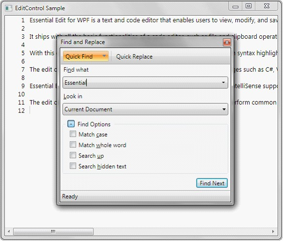{border="0"}

Figure 18: EditControl with Find and Replace Window

***[]{style="FONT-FAMILY: 'Trebuchet MS','sans-serif'; COLOR: #15428b; FONT-SIZE: 9pt"}*** 

The **Find and Replace** dialog provides the basic search functionality as mentioned below.

[]{style="FONT-FAMILY: 'Trebuchet MS','sans-serif'; COLOR: #15428b; FONT-SIZE: 9pt"} 

[·      ]{style="FONT-FAMILY: Symbol"}Quick Find

[·      ]{style="FONT-FAMILY: Symbol"}Quick Replace

[·      ]{style="FONT-FAMILY: Symbol"}Find Symbol

[]{style="FONT-FAMILY: 'Trebuchet MS','sans-serif'; COLOR: #15428b; FONT-SIZE: 9pt"} 

[]{style="FONT-FAMILY: 'Trebuchet MS','sans-serif'; COLOR: #15428b; FONT-SIZE: 9pt"} 

**Quick Find (Ctrl + F)---**Quick Find tab enables users to search a text in an open document or a selection for a string.

**Find Symbol---**Find Symbol tab enables users to search for words and the position of the word in the document.

**Quick Replace** **(Ctrl + H)---**Quick Replace tab enables users to find a text and replace it with an alternative text.

 

Quick Find

Quick Find tab enables users to search all the occurrences of a text in an open document or a selection. Select Quick Find in Find and Replace dialog or use **Ctrl+F** to enable Quick Find.

[]{style="FONT-FAMILY: 'Trebuchet MS','sans-serif'; COLOR: #15428b; FONT-SIZE: 9pt"} 

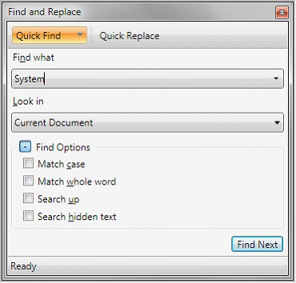{border="0"}

Figure 19: Quick Find Tab

[]{style="FONT-FAMILY: 'Calibri','sans-serif'; COLOR: black"} 

**Find what**---Enter the search text in Find what field to search the text in the document.

**Look in**---Users can choose the search area (the whole document or a selection) in this field.

[]{style="FONT-FAMILY: 'Trebuchet MS','sans-serif'; COLOR: #15428b; FONT-SIZE: 9pt"} 

::: {style="BORDER-BOTTOM: windowtext 1pt solid; BORDER-LEFT: medium none; PADDING-BOTTOM: 1pt; MARGIN-TOP: 9pt; PADDING-LEFT: 0pt; PADDING-RIGHT: 0pt; MARGIN-BOTTOM: 9pt; BORDER-TOP: windowtext 1pt solid; BORDER-RIGHT: medium none; PADDING-TOP: 1pt"}
{border="0"}Note: Select an area in the document before opening Find and Replace dialog, Selection is automatically selected in this field. This can also be selected in the dropdown box.

 
:::

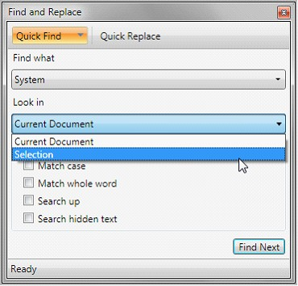{border="0"}

Figure 20: Look in field in Find and Replace Window

***[]{style="FONT-FAMILY: 'Trebuchet MS','sans-serif'; COLOR: #15428b; FONT-SIZE: 9pt"}*** 

**Find Options**---Find options are placed under collapsible GroupBox control to enable the users to have a compact view of the find and replace window.

Find and replace window facilitates the users to search the text based on the following options.

[]{style="FONT-FAMILY: 'Trebuchet MS','sans-serif'; COLOR: #15428b; FONT-SIZE: 9pt"} 

[·      ]{style="FONT-FAMILY: Symbol"}**Match case**---Performs a case-sensitive search.

[·      ]{style="FONT-FAMILY: Symbol"}**Match whole word**---Searches for the text specified with in a word boundary.

[·      ]{style="FONT-FAMILY: Symbol"}**Search up**---searches in lines above the current cursor location.

[·      ]{style="FONT-FAMILY: Symbol"}**Search hidden text**---Text from the collapsed region will also be included in search area.

[]{style="FONT-FAMILY: 'Trebuchet MS','sans-serif'; COLOR: #15428b; FONT-SIZE: 9pt"} 

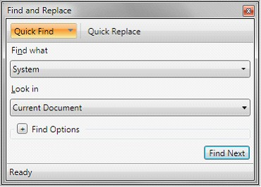{border="0"}

Figure 21: Find and Replace window with Find Options Collapsed

***[]{style="FONT-FAMILY: 'Trebuchet MS','sans-serif'; COLOR: #15428b; FONT-SIZE: 9pt"}*** 

Click the **Find Next** or Enter to search the text in document. The Find Next Button will be enabled only when the search text is entered in Find what field.

[]{style="FONT-FAMILY: 'Calibri','sans-serif'; COLOR: black"} 

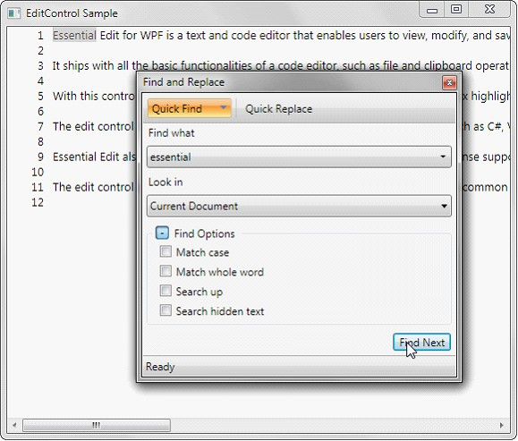{border="0"}

Figure 22: EditControl highlighting the word found

***[]{style="FONT-FAMILY: 'Trebuchet MS','sans-serif'; COLOR: #15428b; FONT-SIZE: 9pt"}*** 

Find Symbol

Find symbol tab in Find and replace window facilitates the users to find all the occurrences of the specified text in the entire Edit Control's text. Find Symbol tab can be enabled by selecting the drop down option in the Quick Find tab.

[]{style="FONT-FAMILY: 'Trebuchet MS','sans-serif'; COLOR: #15428b; FONT-SIZE: 9pt"} 

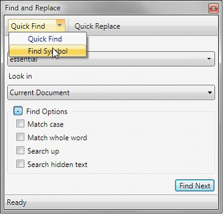{border="0"}

Figure 23: Selecting Find Symbol Tab

***[]{style="FONT-FAMILY: 'Trebuchet MS','sans-serif'; COLOR: #15428b; FONT-SIZE: 9pt"}*** 

***[]{style="FONT-FAMILY: 'Trebuchet MS','sans-serif'; COLOR: #15428b; FONT-SIZE: 9pt"}*** 

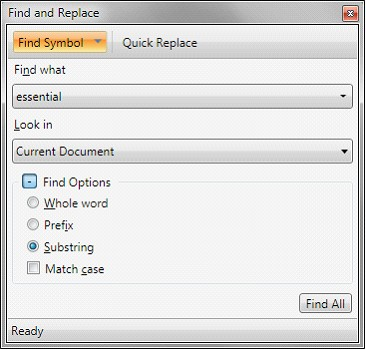{border="0"}

Figure 24: Find Symbol Tab in Find and Replace Window[]{style="FONT-STYLE: normal"}

***[]{style="FONT-FAMILY: 'Trebuchet MS','sans-serif'; COLOR: #15428b; FONT-SIZE: 9pt"}*** 

Find Symbol tab supports the following search options to refine the search results.

[]{style="FONT-FAMILY: 'Trebuchet MS','sans-serif'; COLOR: #15428b; FONT-SIZE: 9pt"} 

[·      ]{style="FONT-FAMILY: Symbol"}**Whole word**---Searches the text when the whole word matches.

[·      ]{style="FONT-FAMILY: Symbol"}**Prefix**---Locates the line, when the line starts with the search text.

[·      ]{style="FONT-FAMILY: Symbol"}**Substring**---Locate the line, when the line contains the search text.

[·      ]{style="FONT-FAMILY: Symbol"}**Match case**---Performs a case sensitive search.

[]{style="FONT-FAMILY: 'Trebuchet MS','sans-serif'; COLOR: #15428b; FONT-SIZE: 9pt"} 

Find Symbol Results **(Shift + F12**): The Whole word, Prefix, Substring options are radio buttons and Sub string will be selected in default.

Find symbol results tab lists all the occurrences of the search text with additional details of line number and position of the text in the line. Double clicking on any item listed in the Find symbol will navigate the cursor to the result selected.

[]{style="FONT-FAMILY: 'Trebuchet MS','sans-serif'; COLOR: #15428b; FONT-SIZE: 9pt"} 

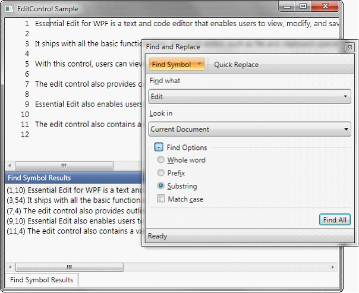{border="0"}

Figure 25: EditControl displaying Find Symbol Results

[]{style="FONT-FAMILY: 'Trebuchet MS','sans-serif'; COLOR: #15428b; FONT-SIZE: 9pt"} 

Click the **Find All** or Enter to search the text in document

 

::: {style="BORDER-BOTTOM: windowtext 1pt solid; BORDER-LEFT: medium none; PADDING-BOTTOM: 1pt; MARGIN-TOP: 9pt; PADDING-LEFT: 0pt; PADDING-RIGHT: 0pt; MARGIN-BOTTOM: 9pt; BORDER-TOP: windowtext 1pt solid; BORDER-RIGHT: medium none; PADDING-TOP: 1pt"}
{border="0"}[***Note***]{.NoteChar}[: ]{style="FONT-FAMILY: 'Calibri','sans-serif'"}Find Symbol results tab is a dockable so that it can be hide, pinned or closed as necessary.
:::

[]{style="FONT-FAMILY: 'Calibri','sans-serif'"} 

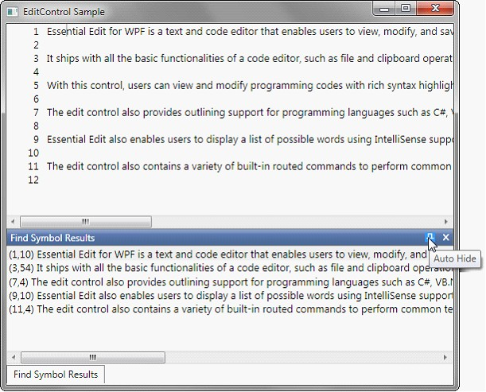{border="0"}

Figure 26: Find Symbol Results With Auto Hide and Close Button

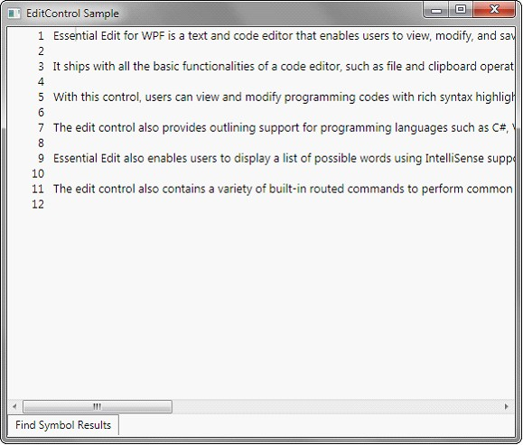{border="0"}

Figure 27: Find Symbol Results tab in Hidden State

***[]{style="FONT-FAMILY: 'Trebuchet MS','sans-serif'; COLOR: #15428b; FONT-SIZE: 9pt"}*** 

***[]{style="FONT-FAMILY: 'Trebuchet MS','sans-serif'; COLOR: #15428b; FONT-SIZE: 9pt"}*** 

Quick Replace

Quick replace tab in Find and replace window enables the users to search a text and replace it will an alternate text. Quick replace tab can be enabled by clicking on the Quick Replace button at the top of the Find and Replace window or by using **Ctrl + H** key from EditControl.

[]{style="FONT-FAMILY: 'Trebuchet MS','sans-serif'; COLOR: #15428b; FONT-SIZE: 9pt"} 

[]{style="FONT-FAMILY: 'Trebuchet MS','sans-serif'; COLOR: #15428b; FONT-SIZE: 9pt"} 

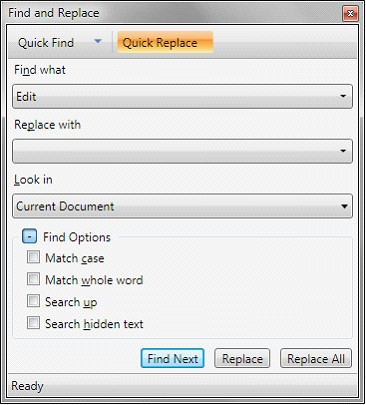{border="0"}

Figure 28: Quick Replace Tab in Find and Replace Window

[]{style="FONT-FAMILY: 'Trebuchet MS','sans-serif'; COLOR: #15428b; FONT-SIZE: 9pt"} 

Quick Replace tab is similar to that of Quick Find except for Replace With field.

Replace with -- Enter the alternative text to be replaced in this field.

[]{style="FONT-FAMILY: 'Trebuchet MS','sans-serif'; COLOR: #15428b; FONT-SIZE: 9pt"} 

Quick replace supports two functionalities

[]{style="FONT-FAMILY: 'Trebuchet MS','sans-serif'; COLOR: #15428b; FONT-SIZE: 9pt"} 

[·      ]{style="FONT-FAMILY: Symbol"}**Replace**---Replaces the immediate occurrence of text specified in Find what with text specified in Replace with field.

[·      ]{style="FONT-FAMILY: Symbol"}**Replaces**---Replaces all the occurrences of the text specified in Find what with the text specified in the Replace with field.

 

[]{#related-topics}
::::::
