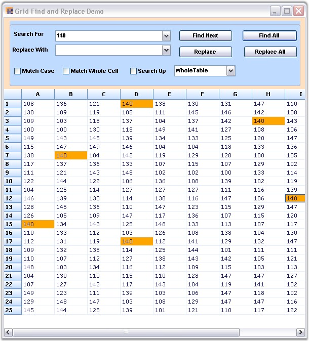

::: {style="DISPLAY: none"}
{#d2h_url_template}{#d2h_package_url style="WIDTH: 0px; DISPLAY: none; HEIGHT: 0px"}
:::

::: {.d2h_secondary_topic style="PADDING-BOTTOM: 10pt; MARGIN: 0pt; PADDING-LEFT: 0pt; PADDING-RIGHT: 0pt; PADDING-TOP: 0pt"}
##### Find Replace {#find-replace style="tab-stops: 0pt"}

[]{style="FONT-FAMILY: 'Trebuchet MS','sans-serif'; COLOR: #15428b; FONT-SIZE: 9pt"} 

**Find and Replace** feature enables you to search and replace the required element present in the Grid/Worksheet. You can implement the fastest Find and Replace functionality with Grid controls by using **GridFindReplaceDialogSink** and **GridFindReplaceEventArgs** classes. The GridFindReplaceDialogSink class provides the methods that are necessary to perform a Find and Replace operation. The GridFindReplaceEventArgs class provides information about the Find and Replace dialog box.

[]{style="FONT-FAMILY: 'Trebuchet MS','sans-serif'; COLOR: #15428b; FONT-SIZE: 9pt"} 

The value entered in the **Search For** field is highlighted in the worksheet after the search action is performed. You can switch over to each highlighted text by clicking **Find Next** button. This functionality is available only when there is more than one search result.

[]{style="FONT-FAMILY: 'Trebuchet MS','sans-serif'; COLOR: #15428b; FONT-SIZE: 9pt"} 

Search and Replace Options

[]{style="FONT-FAMILY: 'Trebuchet MS','sans-serif'; COLOR: #15428b; FONT-SIZE: 9pt"} 

The search and replace actions:

[]{style="FONT-FAMILY: 'Trebuchet MS','sans-serif'; COLOR: #15428b; FONT-SIZE: 9pt"} 

[·      ]{style="FONT-FAMILY: Symbol"}Can be performed independently or simultaneously.

[·      ]{style="FONT-FAMILY: Symbol"}Can be done for individual search or for the entire worksheet by using the **Find Next/Replace** buttons.

[·      ]{style="FONT-FAMILY: Symbol"}Can be done for all the search results by clicking **Find All/Replace All** buttons.

[]{style="FONT-FAMILY: 'Trebuchet MS','sans-serif'; COLOR: #15428b; FONT-SIZE: 9pt"} 

Search Options

**[]{style="FONT-FAMILY: 'Trebuchet MS','sans-serif'; COLOR: #15428b"}** 

The search options are as follows:

 

[·      ]{style="FONT-FAMILY: Symbol"}**Match Case**-Matches case while performing search.

[·      ]{style="FONT-FAMILY: Symbol"}**Match Whole Cell**-Matches the search text with the entire text in a grid cell.

[·      ]{style="FONT-FAMILY: Symbol"}**Search Up**-Specifies if the search can be performed bottom-up.

[o  ]{style="FONT-FAMILY: 'Courier New'"}**Column Only**-Searches only the current column.

[o  ]{style="FONT-FAMILY: 'Courier New'"}**Selection Only**-Searches only the current selection.

[o  ]{style="FONT-FAMILY: 'Courier New'"}**Whole Table**-Searches the whole table.

[]{style="FONT-FAMILY: 'Trebuchet MS','sans-serif'; COLOR: #15428b; FONT-SIZE: 9pt"} 

The Find and Replace feature can be enabled for Essential Grid by using the following code:

[]{style="FONT-FAMILY: 'Trebuchet MS','sans-serif'; COLOR: #15428b; FONT-SIZE: 9pt"} 

1.   Using C#

[]{style="FONT-FAMILY: 'Trebuchet MS','sans-serif'; COLOR: #15428b; FONT-SIZE: 9pt"} 

+----------------------------------------------------------------------------------------------------------------------------------------------------------------------------------------------------------------------------------------------------------------------------------+
| **[\[C#\]]{style="FONT-FAMILY: 'Courier New'; COLOR: black"}**                                                                                                                                                                                                                   |
|                                                                                                                                                                                                                                                                                  |
| []{style="FONT-FAMILY: 'Courier New'; COLOR: black"}                                                                                                                                                                                                                             |
|                                                                                                                                                                                                                                                                                  |
| [GridFindTextOptions]{style="FONT-FAMILY: 'Courier New'; COLOR: #2b91af"}[ options = [GridFindTextOptions]{style="COLOR: #2b91af"}.WholeTable \| [GridFindTextOptions]{style="COLOR: #2b91af"}.SearchUp;]{style="FONT-FAMILY: 'Courier New'"}                                    |
|                                                                                                                                                                                                                                                                                  |
| [object]{style="FONT-FAMILY: 'Courier New'; COLOR: blue"}[ locInfo = [GridRangeInfo]{style="COLOR: #2b91af"}.Table();]{style="FONT-FAMILY: 'Courier New'"}                                                                                                                       |
|                                                                                                                                                                                                                                                                                  |
| [GridFindReplaceEventArgs]{style="FONT-FAMILY: 'Courier New'; COLOR: #2b91af"}[ frEvents = [new]{style="COLOR: blue"} [GridFindReplaceEventArgs]{style="COLOR: #2b91af"}(cmbSearch.Text, [\"\"]{style="COLOR: #a31515"}, options, locInfo);]{style="FONT-FAMILY: 'Courier New'"} |
|                                                                                                                                                                                                                                                                                  |
| [GridFindReplaceDialogSink]{style="FONT-FAMILY: 'Courier New'; COLOR: #2b91af"}[ frDialog.Find(frEvents);]{style="FONT-FAMILY: 'Courier New'"}                                                                                                                                   |
+----------------------------------------------------------------------------------------------------------------------------------------------------------------------------------------------------------------------------------------------------------------------------------+

[]{style="FONT-FAMILY: 'Trebuchet MS','sans-serif'; COLOR: #15428b; FONT-SIZE: 9pt"} 

2.   Using VB.NET

[]{style="FONT-FAMILY: 'Trebuchet MS','sans-serif'; COLOR: #15428b; FONT-SIZE: 9pt"} 

+-----------------------------------------------------------------------------------------------------------------------------------------------------------------------------------------------------------------------------------------------------------+
| **[\[VB.NET\]]{style="FONT-FAMILY: 'Courier New'; COLOR: black"}**                                                                                                                                                                                        |
|                                                                                                                                                                                                                                                           |
| []{style="FONT-FAMILY: 'Courier New'; COLOR: black"}                                                                                                                                                                                                      |
|                                                                                                                                                                                                                                                           |
| [Private]{style="FONT-FAMILY: 'Courier New'; COLOR: blue"}[ options [As]{style="COLOR: blue"} GridFindTextOptions = GridFindTextOptions.WholeTable [Or]{style="COLOR: blue"} GridFindTextOptions.SearchUp]{style="FONT-FAMILY: 'Courier New'"}            |
|                                                                                                                                                                                                                                                           |
| []{style="FONT-FAMILY: 'Courier New'"}                                                                                                                                                                                                                    |
|                                                                                                                                                                                                                                                           |
| [Private]{style="FONT-FAMILY: 'Courier New'; COLOR: blue"}[ locInfo [As]{style="COLOR: blue"} [Object]{style="COLOR: blue"} = GridRangeInfo.Table()]{style="FONT-FAMILY: 'Courier New'"}                                                                  |
|                                                                                                                                                                                                                                                           |
| [Private]{style="FONT-FAMILY: 'Courier New'; COLOR: blue"}[ frEvents [As]{style="COLOR: blue"} [New]{style="COLOR: blue"} GridFindReplaceEventArgs(cmbSearch.Text, [\"\"]{style="COLOR: #a31515"}, options, locInfo)]{style="FONT-FAMILY: 'Courier New'"} |
|                                                                                                                                                                                                                                                           |
| [GridFindReplaceDialogSink(frDialog.Find(frEvents))]{style="FONT-FAMILY: 'Courier New'"}                                                                                                                                                                  |
+-----------------------------------------------------------------------------------------------------------------------------------------------------------------------------------------------------------------------------------------------------------+

[]{style="FONT-FAMILY: 'Trebuchet MS','sans-serif'; COLOR: #15428b; FONT-SIZE: 9pt"} 

{border="0"}

[]{style="FONT-FAMILY: 'Trebuchet MS','sans-serif'; COLOR: #15428b; FONT-SIZE: 9pt"} 

*[Figure ]{style="FONT-SIZE: 9pt"}[124]{style="FONT-SIZE: 9pt"}[: Find and Replace]{style="FONT-SIZE: 9pt"}*

 

[]{#related-topics}
:::
