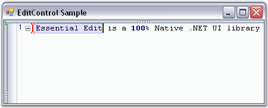
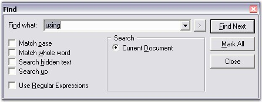
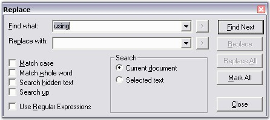
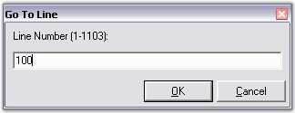

::: {style="DISPLAY: none"}
{#d2h_url_template}{#d2h_package_url style="WIDTH: 0px; DISPLAY: none; HEIGHT: 0px"}
:::

::::: {#nsbanner .d2h_main_nsbanner style="BORDER-BOTTOM: #999999 1px solid; POSITION: relative; PADDING-BOTTOM: 0px; BACKGROUND-COLOR: transparent; PADDING-LEFT: 0px; PADDING-RIGHT: 0px; DISPLAY: none; BORDER-TOP: #999999 1px solid; PADDING-TOP: 0px; LEFT: 0px"}
:::: {#TitleRow .d2h_main_titlerow style="PADDING-BOTTOM: 4px; BACKGROUND-COLOR: transparent; PADDING-LEFT: 22px; WIDTH: 100%; PADDING-RIGHT: 10px; DISPLAY: none; PADDING-TOP: 4px"}
::: {#ienav .d2h_main_ienav style="DISPLAY: none"}
{#D2HPrevious .D2HPreviousEnabled}  {#D2HNext .D2HNextEnabled}
:::
::::
:::::

:::::::: {#nstext .d2h_main_nstext style="PADDING-BOTTOM: 10px; BACKGROUND-COLOR: transparent; PADDING-LEFT: 22px; PADDING-RIGHT: 10px; HEIGHT: 100%; OVERFLOW: auto; PADDING-TOP: 5px" hasuserbackground="true" valign="bottom"}
::: {#d2h_breadcrumbs .d2h_breadcrumbs}
[Essential Studio User Guide Documentation](ms-xhelp:///?Id=12457748-09e3-4d74-a240-8e049cedf030){.d2h_breadcrumbsNormal}[ \> ]{.d2h_breadcrumbsLinkSeparator}[User Interface Edition](ms-xhelp:///?Id=c29296b7-531c-413b-a0ec-488ca1f7f669){.d2h_breadcrumbsNormal}[ \> ]{.d2h_breadcrumbsLinkSeparator}[Essential Windows](ms-xhelp:///?Id=e60759d8-47a4-4570-9d7a-16a68d63f2ea){.d2h_breadcrumbsNormal}[ \> ]{.d2h_breadcrumbsLinkSeparator}[Essential Edit]{.d2h_breadcrumbsContentsOnly}[ \> ]{.d2h_breadcrumbsLinkSeparator}[Concepts And Features](ms-xhelp:///?Id=7c39cee6-8434-4711-a18e-efaba8ac85c0){.d2h_breadcrumbsNormal}[ \> ]{.d2h_breadcrumbsLinkSeparator}[Runtime Features](ms-xhelp:///?Id=f0192b3e-71b0-4238-abcc-482a4b1351ed){.d2h_breadcrumbsNormal}
:::

### Find, Replace and Goto {#find-replace-and-goto style="tab-stops: 0pt"}

 

The Edit Control supports text search and replace functionalities through the use of the **FindText** and **ReplaceText** methods. There are also other useful methods like **FindCurrentText**, **FindNext** and **ReplaceAll** that assist in this purpose.

 

::: {align="center"}
  --------------------- ------------------------------------------------------------------------------------------------------------------------------------------------------------------------------------
  Edit Control Method   Description
  FindText              Finds the first occurrence of the specified text as per the conditions specified like match case, match whole word, search hidden text and search up.
  FindRange             Searches for given string in the text of control and returns text range of first found occurrence.
  FindRegex             Looks for specified expression in text.
  ReplaceText           Replaces the first occurrence of the specified text with the replacement text as per the conditions specified like match case, match whole word, search hidden text and search up.
  FindCurrentText       Finds the next occurrence of the word on which the cursor is presently on.
  FindNext              Finds the next occurrence of the current search text.
  ReplaceAll            Replaces all occurrences of the search text with the replacement text as per the conditions specified like match case, match whole word, search hidden text and search up.
  --------------------- ------------------------------------------------------------------------------------------------------------------------------------------------------------------------------------
:::

[]{style="FONT-FAMILY: 'Trebuchet MS','sans-serif'; COLOR: #15428b; FONT-SIZE: 9pt"} 

+--------------------------------------------------------------------------------------------------------------------------------------------------------------------------------------------------------------------------------------------------------------------------------------------------------------------+
| **[\[C#\]]{style="FONT-FAMILY: 'Courier New'; COLOR: black"}**                                                                                                                                                                                                                                                     |
|                                                                                                                                                                                                                                                                                                                    |
| []{style="FONT-FAMILY: 'Courier New'; COLOR: black"}                                                                                                                                                                                                                                                               |
|                                                                                                                                                                                                                                                                                                                    |
| [// Finds the first occurrence of the specified text as per the conditions specified.]{style="FONT-FAMILY: 'Courier New'; COLOR: green"}                                                                                                                                                                           |
|                                                                                                                                                                                                                                                                                                                    |
| [this]{style="FONT-FAMILY: 'Courier New'; COLOR: blue"}[.editControl1.FindText([\"Essential Edit\"]{style="COLOR: maroon"}, [true]{style="COLOR: blue"}, [true]{style="COLOR: blue"}, [true]{style="COLOR: blue"}, [true]{style="COLOR: blue"}, [null]{style="COLOR: blue"});]{style="FONT-FAMILY: 'Courier New'"} |
|                                                                                                                                                                                                                                                                                                                    |
| []{style="FONT-FAMILY: 'Courier New'"}                                                                                                                                                                                                                                                                             |
|                                                                                                                                                                                                                                                                                                                    |
| [// Searches for given string in the text of control and returns text range of first found occurrence.]{style="FONT-FAMILY: 'Courier New'; COLOR: green"}                                                                                                                                                          |
|                                                                                                                                                                                                                                                                                                                    |
| [this]{style="FONT-FAMILY: 'Courier New'; COLOR: blue"}[.editControl1.FindRange(searchString, startLocation, endLocation, matchWholeWord, searchHiddenText, searchUp, useRegex);]{style="FONT-FAMILY: 'Courier New'"}                                                                                              |
|                                                                                                                                                                                                                                                                                                                    |
| []{style="FONT-FAMILY: 'Courier New'"}                                                                                                                                                                                                                                                                             |
|                                                                                                                                                                                                                                                                                                                    |
| [// Looks for specified expression in text.]{style="FONT-FAMILY: 'Courier New'; COLOR: green"}                                                                                                                                                                                                                     |
|                                                                                                                                                                                                                                                                                                                    |
| [this]{style="FONT-FAMILY: 'Courier New'; COLOR: blue"}[.editControl1.FindRegex(startLine, startColumn, expression, bSearchInCollapsed, searchUp);]{style="FONT-FAMILY: 'Courier New'"}                                                                                                                            |
|                                                                                                                                                                                                                                                                                                                    |
| []{style="FONT-FAMILY: 'Courier New'"}                                                                                                                                                                                                                                                                             |
|                                                                                                                                                                                                                                                                                                                    |
| [// Replaces the first occurrence of the specified text with the replacement text as per the conditions specified.]{style="FONT-FAMILY: 'Courier New'; COLOR: green"}                                                                                                                                              |
|                                                                                                                                                                                                                                                                                                                    |
| [this]{style="FONT-FAMILY: 'Courier New'; COLOR: blue"}[.editControl1.ReplaceText([\"ShowVerticalScrollbar\"]{style="COLOR: maroon"}, [\"ShowVerticalScroller\"]{style="COLOR: maroon"});]{style="FONT-FAMILY: 'Courier New'"}                                                                                     |
|                                                                                                                                                                                                                                                                                                                    |
| []{style="FONT-FAMILY: 'Courier New'"}                                                                                                                                                                                                                                                                             |
|                                                                                                                                                                                                                                                                                                                    |
| [// Finds the next occurrence of the word on which the cursor is presently on.]{style="FONT-FAMILY: 'Courier New'; COLOR: green"}                                                                                                                                                                                  |
|                                                                                                                                                                                                                                                                                                                    |
| [this]{style="FONT-FAMILY: 'Courier New'; COLOR: blue"}[.editControl1.FindCurrentText();]{style="FONT-FAMILY: 'Courier New'"}                                                                                                                                                                                      |
|                                                                                                                                                                                                                                                                                                                    |
| []{style="FONT-FAMILY: 'Courier New'"}                                                                                                                                                                                                                                                                             |
|                                                                                                                                                                                                                                                                                                                    |
| [// Finds the next occurrence of the current search text.]{style="FONT-FAMILY: 'Courier New'; COLOR: green"}                                                                                                                                                                                                       |
|                                                                                                                                                                                                                                                                                                                    |
| [this]{style="FONT-FAMILY: 'Courier New'; COLOR: blue"}[.editControl1.FindNext();]{style="FONT-FAMILY: 'Courier New'"}                                                                                                                                                                                             |
|                                                                                                                                                                                                                                                                                                                    |
| []{style="FONT-FAMILY: 'Courier New'"}                                                                                                                                                                                                                                                                             |
|                                                                                                                                                                                                                                                                                                                    |
| [// Replaces all occurrences of the search text with the replacement text as per the conditions specified.]{style="FONT-FAMILY: 'Courier New'; COLOR: green"}                                                                                                                                                      |
|                                                                                                                                                                                                                                                                                                                    |
| [this]{style="FONT-FAMILY: 'Courier New'; COLOR: blue"}[.editControl1.ReplaceAll([\" Drag-and-drop\"]{style="COLOR: maroon"}, [\"Drag and drop\"]{style="COLOR: maroon"});]{style="FONT-FAMILY: 'Courier New'"}                                                                                                    |
+--------------------------------------------------------------------------------------------------------------------------------------------------------------------------------------------------------------------------------------------------------------------------------------------------------------------+

[]{style="FONT-FAMILY: 'Trebuchet MS','sans-serif'; COLOR: #15428b; FONT-SIZE: 9pt"} 

+--------------------------------------------------------------------------------------------------------------------------------------------------------------------------------------------------------------------------------------------------------------------------------------------------------------------+
| **[\[VB.NET\]]{style="FONT-FAMILY: 'Courier New'; COLOR: black"}**                                                                                                                                                                                                                                                 |
|                                                                                                                                                                                                                                                                                                                    |
| []{style="FONT-FAMILY: 'Courier New'; COLOR: black"}                                                                                                                                                                                                                                                               |
|                                                                                                                                                                                                                                                                                                                    |
| [\' Finds the first occurrence of the specified text as per the conditions specified.]{style="FONT-FAMILY: 'Courier New'; COLOR: green"}                                                                                                                                                                           |
|                                                                                                                                                                                                                                                                                                                    |
| [Me]{style="FONT-FAMILY: 'Courier New'; COLOR: blue"}[.editControl1.FindText([\"Essential Edit\"]{style="COLOR: maroon"}, [True]{style="COLOR: blue"}, [True]{style="COLOR: blue"}, [True]{style="COLOR: blue"}, [True]{style="COLOR: blue"}, [Nothing]{style="COLOR: blue"})]{style="FONT-FAMILY: 'Courier New'"} |
|                                                                                                                                                                                                                                                                                                                    |
| []{style="FONT-FAMILY: 'Courier New'"}                                                                                                                                                                                                                                                                             |
|                                                                                                                                                                                                                                                                                                                    |
| [\' Searches for given string in the text of control and returns text range of first found occurrence.]{style="FONT-FAMILY: 'Courier New'; COLOR: green"}                                                                                                                                                          |
|                                                                                                                                                                                                                                                                                                                    |
| [Me]{style="FONT-FAMILY: 'Courier New'; COLOR: blue"}[.editControl1.FindRange(searchString, startLocation, endLocation, matchWholeWord, searchHiddenText, searchUp, useRegex)]{style="FONT-FAMILY: 'Courier New'"}                                                                                                 |
|                                                                                                                                                                                                                                                                                                                    |
| []{style="FONT-FAMILY: 'Courier New'"}                                                                                                                                                                                                                                                                             |
|                                                                                                                                                                                                                                                                                                                    |
| [\' Looks for specified expression in text.]{style="FONT-FAMILY: 'Courier New'; COLOR: green"}                                                                                                                                                                                                                     |
|                                                                                                                                                                                                                                                                                                                    |
| [Me]{style="FONT-FAMILY: 'Courier New'; COLOR: blue"}[.editControl1.FindRegex(startLine, startColumn, expression, bSearchInCollapsed, searchUp)]{style="FONT-FAMILY: 'Courier New'"}                                                                                                                               |
|                                                                                                                                                                                                                                                                                                                    |
| []{style="FONT-FAMILY: 'Courier New'"}                                                                                                                                                                                                                                                                             |
|                                                                                                                                                                                                                                                                                                                    |
| [\' Replaces the first occurrence of the specified text with the replacement text as per the conditions specified.]{style="FONT-FAMILY: 'Courier New'; COLOR: green"}                                                                                                                                              |
|                                                                                                                                                                                                                                                                                                                    |
| [Me]{style="FONT-FAMILY: 'Courier New'; COLOR: blue"}[.editControl1.ReplaceText([\"ShowVerticalScrollbar\"]{style="COLOR: maroon"}, [\"ShowVerticalScroller\"]{style="COLOR: maroon"}) ]{style="FONT-FAMILY: 'Courier New'"}                                                                                       |
|                                                                                                                                                                                                                                                                                                                    |
| []{style="FONT-FAMILY: 'Courier New'"}                                                                                                                                                                                                                                                                             |
|                                                                                                                                                                                                                                                                                                                    |
| [\' Finds the next occurrence of the word on which the cursor is presently on.]{style="FONT-FAMILY: 'Courier New'; COLOR: green"}                                                                                                                                                                                  |
|                                                                                                                                                                                                                                                                                                                    |
| [Me]{style="FONT-FAMILY: 'Courier New'; COLOR: blue"}[.editControl1.FindCurrentText()]{style="FONT-FAMILY: 'Courier New'"}                                                                                                                                                                                         |
|                                                                                                                                                                                                                                                                                                                    |
| []{style="FONT-FAMILY: 'Courier New'"}                                                                                                                                                                                                                                                                             |
|                                                                                                                                                                                                                                                                                                                    |
| [\' Finds the next occurrence of the current search text.]{style="FONT-FAMILY: 'Courier New'; COLOR: green"}                                                                                                                                                                                                       |
|                                                                                                                                                                                                                                                                                                                    |
| [Me]{style="FONT-FAMILY: 'Courier New'; COLOR: blue"}[.editControl1.FindNext()]{style="FONT-FAMILY: 'Courier New'"}                                                                                                                                                                                                |
|                                                                                                                                                                                                                                                                                                                    |
| []{style="FONT-FAMILY: 'Courier New'"}                                                                                                                                                                                                                                                                             |
|                                                                                                                                                                                                                                                                                                                    |
| [\' Replaces all occurrences of the search text with the replacement text as per the conditions specified.]{style="FONT-FAMILY: 'Courier New'; COLOR: green"}                                                                                                                                                      |
|                                                                                                                                                                                                                                                                                                                    |
| [Me]{style="FONT-FAMILY: 'Courier New'; COLOR: blue"}[.editControl1.ReplaceAll([\" Drag-and-drop\"]{style="COLOR: maroon"}, [\"Drag and drop\"]{style="COLOR: maroon"})]{style="FONT-FAMILY: 'Courier New'"}                                                                                                       |
+--------------------------------------------------------------------------------------------------------------------------------------------------------------------------------------------------------------------------------------------------------------------------------------------------------------------+

[]{style="COLOR: #4a5c8c; FONT-SIZE: 8pt"} 

{border="0"}

Figure 46: \"FindText\" method

[]{style="FONT-FAMILY: 'Trebuchet MS','sans-serif'; COLOR: #15428b; FONT-SIZE: 9pt"} 

Find and Replace Dialog Boxes

[]{style="COLOR: #4a5c8c; FONT-SIZE: 8pt"} 

Edit Control also supports advanced and customizable Find and Replace dialog boxes. The Find dialog box is invoked by using the **ShowFindDialog** method. The keyboard shortcut to this dialog box is **Ctrl+F**.

[]{style="FONT-FAMILY: 'Trebuchet MS','sans-serif'; COLOR: #15428b; FONT-SIZE: 9pt"} 

{border="0"}

Figure 47: Find Dialog Box

 

The Replace dialog box is invoked by using the **ShowReplaceDialog** method. The keyboard shortcut to this dialog box is **Ctrl+H**. The Replace dialog box also allows you to find and replace words within the selected text.

 

{border="0"}

Figure 48: Replace Dialog Box

[]{style="FONT-FAMILY: 'Courier New'; COLOR: #15428b"} 

+---------------------------------------------------------------------------------------------------------------------------------+
| **[\[C#\]]{style="FONT-FAMILY: 'Courier New'; COLOR: black"}**                                                                  |
|                                                                                                                                 |
| []{style="FONT-FAMILY: 'Courier New'; COLOR: blue"}                                                                             |
|                                                                                                                                 |
| [// Invoke the Find Dialog.]{style="FONT-FAMILY: 'Courier New'; COLOR: green"}                                                  |
|                                                                                                                                 |
| [this]{style="FONT-FAMILY: 'Courier New'; COLOR: blue"}[.editControl1.ShowFindDialog();]{style="FONT-FAMILY: 'Courier New'"}    |
|                                                                                                                                 |
| []{style="FONT-FAMILY: 'Courier New'"}                                                                                          |
|                                                                                                                                 |
| [// Invoke the Replace Dialog.]{style="FONT-FAMILY: 'Courier New'; COLOR: green"}                                               |
|                                                                                                                                 |
| [this]{style="FONT-FAMILY: 'Courier New'; COLOR: blue"}[.editControl1.ShowReplaceDialog();]{style="FONT-FAMILY: 'Courier New'"} |
+---------------------------------------------------------------------------------------------------------------------------------+

[]{style="FONT-FAMILY: 'Trebuchet MS','sans-serif'; COLOR: #15428b; FONT-SIZE: 9pt"} 

+------------------------------------------------------------------------------------------------------------------------------+
| **[\[VB.NET\]]{style="FONT-FAMILY: 'Courier New'; COLOR: black"}**                                                           |
|                                                                                                                              |
| []{style="FONT-FAMILY: 'Courier New'; COLOR: black"}                                                                         |
|                                                                                                                              |
| [\' Invoke the Find Dialog.]{style="FONT-FAMILY: 'Courier New'; COLOR: green"}                                               |
|                                                                                                                              |
| [Me]{style="FONT-FAMILY: 'Courier New'; COLOR: blue"}[.editControl1.ShowFindDialog()]{style="FONT-FAMILY: 'Courier New'"}    |
|                                                                                                                              |
| []{style="FONT-FAMILY: 'Courier New'"}                                                                                       |
|                                                                                                                              |
| [\' Invoke the Replace Dialog.]{style="FONT-FAMILY: 'Courier New'; COLOR: green"}                                            |
|                                                                                                                              |
| [Me]{style="FONT-FAMILY: 'Courier New'; COLOR: blue"}[.editControl1.ShowReplaceDialog()]{style="FONT-FAMILY: 'Courier New'"} |
+------------------------------------------------------------------------------------------------------------------------------+

 

**Positioning Mouse Cursor on a Specified line**

[]{style="COLOR: #4a5c8c"} 

The Edit Control supports the \"GoTo\" functionality both through the use of a run time dialog box and through programmatic APIs. The **GoTo** method is used to position the mouse pointer on any specified line. The GoTo method not only positions the pointer on the appropriate line, but it also scrolls the concerned line into the view. The ***linesAbove*** argument can be used to specify the number of lines to be displayed above the pointer.

 

+--------------------------------------------------------------------------------------------------------------------------------------------------------+
| **[\[C#\]]{style="FONT-FAMILY: 'Courier New'; COLOR: black"}**                                                                                         |
|                                                                                                                                                        |
| []{style="FONT-FAMILY: 'Courier New'; COLOR: black"}                                                                                                   |
|                                                                                                                                                        |
| [// Places the cursor at the beginning of the given line number.]{style="FONT-FAMILY: 'Courier New'; COLOR: green"}                                    |
|                                                                                                                                                        |
| [this]{style="FONT-FAMILY: 'Courier New'; COLOR: blue"}[.editControl1.GoTo(lineNumber);]{style="FONT-FAMILY: 'Courier New'"}                           |
|                                                                                                                                                        |
| [this]{style="FONT-FAMILY: 'Courier New'; COLOR: blue"}[.editControl1.GoTo(lineNumber, linesAbove);]{style="FONT-FAMILY: 'Courier New'; COLOR: black"} |
+--------------------------------------------------------------------------------------------------------------------------------------------------------+

[]{style="FONT-FAMILY: 'Trebuchet MS','sans-serif'; COLOR: #15428b; FONT-SIZE: 9pt"} 

+------------------------------------------------------------------------------------------------------------------------------------------------------+
| **[\[VB.NET\]]{style="FONT-FAMILY: 'Courier New'; COLOR: black"}**                                                                                   |
|                                                                                                                                                      |
| []{style="FONT-FAMILY: 'Courier New'; COLOR: black"}                                                                                                 |
|                                                                                                                                                      |
| [\' Places the cursor at the beginning of the given line number.]{style="FONT-FAMILY: 'Courier New'; COLOR: green"}                                  |
|                                                                                                                                                      |
| [Me]{style="FONT-FAMILY: 'Courier New'; COLOR: blue"}[.editControl1.GoTo(lineNumber)]{style="FONT-FAMILY: 'Courier New'"}                            |
|                                                                                                                                                      |
| [Me]{style="FONT-FAMILY: 'Courier New'; COLOR: blue"}[.editControl1.GoTo(lineNumber, linesAbove);]{style="FONT-FAMILY: 'Courier New'; COLOR: black"} |
+------------------------------------------------------------------------------------------------------------------------------------------------------+

[]{style="FONT-FAMILY: 'Trebuchet MS','sans-serif'; COLOR: #15428b; FONT-SIZE: 9pt"} 

The **CurrentLine** property explained in the [Positions and Offsets]{.UGHyperlink} section, also does the same task as the GoTo method. The Goto dialog box is invoked using the **ShowGoToDialog** method. The keyboard shortcut to this dialog box is **Ctrl+G**.

[]{style="FONT-FAMILY: 'Trebuchet MS','sans-serif'; COLOR: #15428b; FONT-SIZE: 9pt"} 

+------------------------------------------------------------------------------------------------------------------------------+
| **[\[C#\]]{style="FONT-FAMILY: 'Courier New'; COLOR: black"}**                                                               |
|                                                                                                                              |
| []{style="FONT-FAMILY: 'Courier New'; COLOR: black"}                                                                         |
|                                                                                                                              |
| [// Invoke the GoTo Dialog.]{style="FONT-FAMILY: 'Courier New'; COLOR: green"}                                               |
|                                                                                                                              |
| [this]{style="FONT-FAMILY: 'Courier New'; COLOR: blue"}[.editControl1.ShowGoToDialog();]{style="FONT-FAMILY: 'Courier New'"} |
+------------------------------------------------------------------------------------------------------------------------------+

[]{style="FONT-FAMILY: 'Trebuchet MS','sans-serif'; COLOR: #15428b; FONT-SIZE: 9pt"} 

+---------------------------------------------------------------------------------------------------------------------------+
| **[\[VB.NET\]]{style="FONT-FAMILY: 'Courier New'; COLOR: black"}**                                                        |
|                                                                                                                           |
| []{style="FONT-FAMILY: 'Courier New'; COLOR: black"}                                                                      |
|                                                                                                                           |
| [\' Invoke the GoTo Dialog.]{style="FONT-FAMILY: 'Courier New'; COLOR: green"}                                            |
|                                                                                                                           |
| [Me]{style="FONT-FAMILY: 'Courier New'; COLOR: blue"}[.editControl1.ShowGoToDialog()]{style="FONT-FAMILY: 'Courier New'"} |
+---------------------------------------------------------------------------------------------------------------------------+

[]{style="FONT-FAMILY: 'Trebuchet MS','sans-serif'; COLOR: #15428b; FONT-SIZE: 9pt"} 

[{border="0"}]{style="FONT-FAMILY: 'Trebuchet MS','sans-serif'; COLOR: #15428b; FONT-SIZE: 9pt"}[]{style="FONT-FAMILY: 'Trebuchet MS','sans-serif'; COLOR: #15428b; FONT-SIZE: 9pt"}

Figure 49: GoTo Dialog Box

 

Default key bindings to these dialogs can be changed as explained in the [Keystroke - Action Combinations Binding]{.UGHyperlink} topic.

 

**History Properties**

[]{style="FONT-FAMILY: 'Verdana','sans-serif'; COLOR: #4a5c8c; FONT-SIZE: 8pt"} 

The **FindHistory** property is used to add/remove items from the find history in the Find dialog box. The **ReplaceHistory** property is used to add/remove items from the replace history in the Replace dialog box. Similarly, the **ReplaceSearchHistory** property is used to add / remove items from the find history in the Replace dialog box.

 

::: {align="center"}
  ----------------------- ----------------------------------------
  Edit Control Property   Description
  FindHistory             Gets history of Find dialog.
  ReplaceHistory          Gets history of Replace dialog.
  ReplaceSearchHistory    Gets search history of Replace dialog.
  ----------------------- ----------------------------------------
:::

 

The methods associated with the FindHistory property are used to perform the following operations.

 

::: {align="center"}
  -------------------- ----------------------------------------------------------------------------------------------------------
  FindHistory Method   Description
  Insert               Inserts an element into the System.Collections.ArrayList at the specified index.
  Remove               Removes an element or the first occurrence from the System.Collections.ArrayList of the specified index.
  Sort                 Sorts all the elements in the System.Collections.ArrayList.
  Clear                Clears all the items in the FindHistory.
  -------------------- ----------------------------------------------------------------------------------------------------------
:::

[]{style="FONT-FAMILY: 'Trebuchet MS','sans-serif'; COLOR: #15428b; FONT-SIZE: 9pt"} 

+--------------------------------------------------------------------------------------------------------------------------------------------------------------------------------+
| **[\[C#\]]{style="FONT-FAMILY: 'Courier New'; COLOR: black"}**                                                                                                                 |
|                                                                                                                                                                                |
| []{style="FONT-FAMILY: 'Courier New'; COLOR: black"}                                                                                                                           |
|                                                                                                                                                                                |
| [this]{style="FONT-FAMILY: 'Courier New'; COLOR: blue"}[.editControl1.FindHistory.Insert(0,([object]{style="COLOR: blue"})ATH.addedItem);]{style="FONT-FAMILY: 'Courier New'"} |
|                                                                                                                                                                                |
| [this]{style="FONT-FAMILY: 'Courier New'; COLOR: blue"}[.editControl1.FindHistory.Remove(o);]{style="FONT-FAMILY: 'Courier New'"}                                              |
|                                                                                                                                                                                |
| [this]{style="FONT-FAMILY: 'Courier New'; COLOR: blue"}[.editControl1.FindHistory.Sort();]{style="FONT-FAMILY: 'Courier New'"}                                                 |
|                                                                                                                                                                                |
| [this]{style="FONT-FAMILY: 'Courier New'; COLOR: blue"}[.editControl1.FindHistory.Clear();]{style="FONT-FAMILY: 'Courier New'"}                                                |
+--------------------------------------------------------------------------------------------------------------------------------------------------------------------------------+

[]{style="FONT-FAMILY: 'Trebuchet MS','sans-serif'; COLOR: #15428b; FONT-SIZE: 9pt"} 

+-----------------------------------------------------------------------------------------------------------------------------------------------------------------------------------------------------------+
| **[\[VB.NET\]]{style="FONT-FAMILY: 'Courier New'; COLOR: black"}**                                                                                                                                        |
|                                                                                                                                                                                                           |
| []{style="FONT-FAMILY: 'Courier New'; COLOR: black"}                                                                                                                                                      |
|                                                                                                                                                                                                           |
| [Me]{style="FONT-FAMILY: 'Courier New'; COLOR: blue"}[.editControl1.FindHistory.Insert(0,[CType]{style="COLOR: blue"}(ATH.addedItem, [Object]{style="COLOR: blue"}))]{style="FONT-FAMILY: 'Courier New'"} |
|                                                                                                                                                                                                           |
| [Me]{style="FONT-FAMILY: 'Courier New'; COLOR: blue"}[.editControl1.FindHistory.Remove(o)]{style="FONT-FAMILY: 'Courier New'"}                                                                            |
|                                                                                                                                                                                                           |
| [Me]{style="FONT-FAMILY: 'Courier New'; COLOR: blue"}[.editControl1.FindHistory.Sort()]{style="FONT-FAMILY: 'Courier New'"}                                                                               |
|                                                                                                                                                                                                           |
| [Me]{style="FONT-FAMILY: 'Courier New'; COLOR: blue"}[.editControl1.FindHistory.Clear()]{style="FONT-FAMILY: 'Courier New'"}                                                                              |
+-----------------------------------------------------------------------------------------------------------------------------------------------------------------------------------------------------------+

[]{style="FONT-FAMILY: 'Trebuchet MS','sans-serif'; COLOR: #15428b; FONT-SIZE: 9pt"} 

::: {style="BORDER-BOTTOM: windowtext 1pt solid; BORDER-LEFT: medium none; PADDING-BOTTOM: 1pt; MARGIN-TOP: 9pt; PADDING-LEFT: 0pt; PADDING-RIGHT: 0pt; MARGIN-BOTTOM: 9pt; BORDER-TOP: windowtext 1pt solid; BORDER-RIGHT: medium none; PADDING-TOP: 1pt"}
{border="0"}Note: The above methods can also be set for the ReplaceHistory and ReplaceSearchHistory properties.
:::

 

A sample which demonstrates the above features is available in the below sample installation path.

 

***..\\My Documents\\Syncfusion\\EssentialStudio\\Version Number\\Windows\\Edit.Windows\\Samples\\2.0\\Advanced Editor Functions\\FindReplaceDemo***

[]{#p68} 

[]{#related-topics}
::::::::
