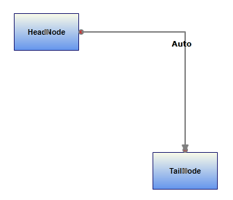
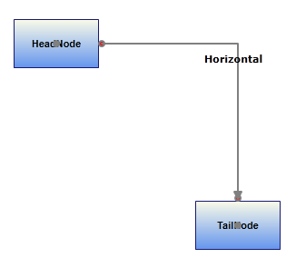
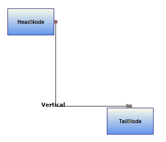

::: {style="DISPLAY: none"}
{#d2h_url_template}{#d2h_package_url style="WIDTH: 0px; DISPLAY: none; HEIGHT: 0px"}
:::

:::::: {.d2h_secondary_topic style="PADDING-BOTTOM: 10pt; MARGIN: 0pt; PADDING-LEFT: 0pt; PADDING-RIGHT: 0pt; PADDING-TOP: 0pt"}
#### First Segment Orientation {#first-segment-orientation style="tab-stops: 0pt"}

This feature enables you to orient the *FirstSegment* of the Orthogonal LineConnector as needed.

This feature provides the following options to orient the first segment:

 

[·      ]{style="FONT-FAMILY: Symbol"}**Auto --** The first segment of orthogonal LineConnector will always be perpendicular to the sides of the HeadNode, to which it is connected.

[·      ]{style="FONT-FAMILY: Symbol"}**Horizontal** -- The FirstSegment of the Orthogonal LineConnector will always be connected horizontally to the HeadNode.

[·      ]{style="FONT-FAMILY: Symbol"}**Vertical -** The FirstSegment of the Orthogonal LineConnector will always be connected vertically to the HeadNode.

 

Use Case Scenarios

By default line connector will be drawn based on the space between the nodes. If you want to customize the default patter, you can achieve this using this feature. This enables you to align the first segment of the connector and rest will be aligned based on this.

Tables for Properties, Methods, and Events

Properties

Table 38: PropertyTable

::: {align="center"}
+-------------------------+--------------------------------------------------------------------+-----------------------------------------------+---------------------------------------------------------+------------------------------+
| **Property**            | **Description**                                                    | **Type**                                      | **Data Type**                                           | **Reference links**          |
+-------------------------+--------------------------------------------------------------------+-----------------------------------------------+---------------------------------------------------------+------------------------------+
| FirstSegmentOrientation | Gets or sets a value to orient the FirstSegement.                  | Dependency property[]{style="COLOR: #c00000"} | [SegmentOrientation]{style="COLOR: #2b91af"}.Auto       | NA[]{style="COLOR: #c00000"} |
|                         |                                                                    |                                               |                                                         |                              |
|                         | []{style="FONT-FAMILY: Consolas; COLOR: green; FONT-SIZE: 9.5pt"}  |                                               | [SegmentOrientation]{style="COLOR: #2b91af"}.Horizontal |                              |
|                         |                                                                    |                                               |                                                         |                              |
|                         | Default Value is Auto.                                             |                                               | [SegmentOrientation]{style="COLOR: #2b91af"}.Vertical\  |                              |
|                         |                                                                    |                                               | \                                                       |                              |
+-------------------------+--------------------------------------------------------------------+-----------------------------------------------+---------------------------------------------------------+------------------------------+
:::

[]{style="FONT-FAMILY: 'Calibri','sans-serif'; COLOR: black"} 

[]{style="COLOR: #c00000"} 

Orienting the First Segment

You can orient the *FirstSegment* of the Orthogonal LineConnector using the *FirstSegmentOrientation* property.

 

The following code illustrates[ how to set the ]{style="BACKGROUND: white; COLOR: black"}*FirstSegmentOrientation* to Auto:

 

+----------------------------------------------------------------------------------------------------------------------------------------------------------------------------------------+
| **[\[C#\]]{style="FONT-FAMILY: 'Courier New'; COLOR: black"}**[]{style="FONT-FAMILY: 'Courier New'"}                                                                                   |
|                                                                                                                                                                                        |
| [LineConnector]{style="FONT-FAMILY: 'Courier New'; COLOR: #2b91af"}[ line = [new]{style="COLOR: blue"} [LineConnector]{style="COLOR: #2b91af"}();]{style="FONT-FAMILY: 'Courier New'"} |
|                                                                                                                                                                                        |
| [line.FirstSegmentOrientation = [SegmentOrientation]{style="COLOR: #2b91af"}.Auto;]{style="FONT-FAMILY: 'Courier New'"}[]{style="FONT-FAMILY: 'Courier New'"}                          |
+----------------------------------------------------------------------------------------------------------------------------------------------------------------------------------------+

 

+-------------------------------------------------------------------------------------------------------------------------------------------------------------------------------------------------------------------+
| **[\[VB\]]{style="FONT-FAMILY: 'Courier New'; COLOR: black"}**[]{style="FONT-FAMILY: 'Courier New'"}                                                                                                              |
|                                                                                                                                                                                                                   |
| [Dim line As New LineConnector()\                                                                                                                                                                                 |
| ]{style="FONT-FAMILY: 'Courier New'; COLOR: #2b91af"}[line.FirstSegmentOrientation = [SegmentOrientation]{style="COLOR: #2b91af"}.Auto]{style="FONT-FAMILY: 'Courier New'"}[]{style="FONT-FAMILY: 'Courier New'"} |
+-------------------------------------------------------------------------------------------------------------------------------------------------------------------------------------------------------------------+

 

{border="0"}

Figure 81: FirstSegmentOrientation is Auto

 

The following code illustrates[ how to set the ]{style="BACKGROUND: white; COLOR: black"}*FirstSegmentOrientation* to Horizontal:

 

+----------------------------------------------------------------------------------------------------------------------------------------------------------------------------------------+
| **[\[C#\]]{style="FONT-FAMILY: 'Courier New'; COLOR: black"}**[]{style="FONT-FAMILY: 'Courier New'"}                                                                                   |
|                                                                                                                                                                                        |
| [LineConnector]{style="FONT-FAMILY: 'Courier New'; COLOR: #2b91af"}[ line = [new]{style="COLOR: blue"} [LineConnector]{style="COLOR: #2b91af"}();]{style="FONT-FAMILY: 'Courier New'"} |
|                                                                                                                                                                                        |
| [line.FirstSegmentOrientation = [SegmentOrientation]{style="COLOR: #2b91af"}.Horizontal;  ]{style="FONT-FAMILY: 'Courier New'"}                                                        |
+----------------------------------------------------------------------------------------------------------------------------------------------------------------------------------------+

 

 

+-----------------------------------------------------------------------------------------------------------------------------------------------------------------------------------+
| **[\[VB\]]{style="FONT-FAMILY: 'Courier New'; COLOR: black"}**[]{style="FONT-FAMILY: 'Courier New'"}                                                                              |
|                                                                                                                                                                                   |
| [Dim line As New LineConnector()\                                                                                                                                                 |
| ]{style="FONT-FAMILY: 'Courier New'; COLOR: #2b91af"}[line.FirstSegmentOrientation = [SegmentOrientation]{style="COLOR: #2b91af"}.Horizontal]{style="FONT-FAMILY: 'Courier New'"} |
+-----------------------------------------------------------------------------------------------------------------------------------------------------------------------------------+

 

{border="0"}

Figure 82: FirstSegmentOrientation is Horizontal

 

 

The following code illustrates[ how to set the ]{style="BACKGROUND: white; COLOR: black"}FirstSegmentOrientation to Vertical

 

+----------------------------------------------------------------------------------------------------------------------------------------------------------------------------------------+
| **[\[C#\]]{style="FONT-FAMILY: 'Courier New'; COLOR: black"}**[]{style="FONT-FAMILY: 'Courier New'"}                                                                                   |
|                                                                                                                                                                                        |
| [LineConnector]{style="FONT-FAMILY: 'Courier New'; COLOR: #2b91af"}[ line = [new]{style="COLOR: blue"} [LineConnector]{style="COLOR: #2b91af"}();]{style="FONT-FAMILY: 'Courier New'"} |
|                                                                                                                                                                                        |
| [line.FirstSegmentOrientation = [SegmentOrientation]{style="COLOR: #2b91af"}.Vertical; ]{style="FONT-FAMILY: 'Courier New'"}                                                           |
+----------------------------------------------------------------------------------------------------------------------------------------------------------------------------------------+

\
\
\
\

+----------------------------------------------------------------------------------------------------------------------------------------------------------------------------------+
| **[\[VB\]]{style="FONT-FAMILY: 'Courier New'; COLOR: black"}**[]{style="FONT-FAMILY: 'Courier New'"}                                                                             |
|                                                                                                                                                                                  |
| [Dim line As New LineConnector()\                                                                                                                                                |
| ]{style="FONT-FAMILY: 'Courier New'; COLOR: #2b91af"}[line.FirstSegmentOrientation = [SegmentOrientation]{style="COLOR: #2b91af"}.Vertical ]{style="FONT-FAMILY: 'Courier New'"} |
+----------------------------------------------------------------------------------------------------------------------------------------------------------------------------------+

 

{border="0"}

Figure 83: FirstSegmentOrientation is Vertical

 

**** 

**** 

**** 

**** 

::: {style="BORDER-BOTTOM: windowtext 1pt solid; BORDER-LEFT: medium none; PADDING-BOTTOM: 1pt; MARGIN-TOP: 9pt; PADDING-LEFT: 0pt; PADDING-RIGHT: 0pt; MARGIN-BOTTOM: 9pt; BORDER-TOP: windowtext 1pt solid; BORDER-RIGHT: medium none; PADDING-TOP: 1pt"}
{border="0"}Note: This FirstSegmentOrientation property is only works as expected when the LineConnector satisfies the following things.
:::

::: {style="BORDER-BOTTOM: windowtext 1pt solid; BORDER-LEFT: medium none; PADDING-BOTTOM: 1pt; MARGIN: 9pt 0pt 9pt 18pt; PADDING-LEFT: 0pt; PADDING-RIGHT: 0pt; BORDER-TOP: windowtext 1pt solid; BORDER-RIGHT: medium none; PADDING-TOP: 1pt"}
***[·    ]{style="FONT-FAMILY: Symbol"}***LineConnector is connected between Nodes through ConnectionPort.

***[·    ]{style="FONT-FAMILY: Symbol"}***When there is only one intermediate Point in Orthogonal LineConnector.\
\
:::

 

 

 

[]{#related-topics}
::::::
