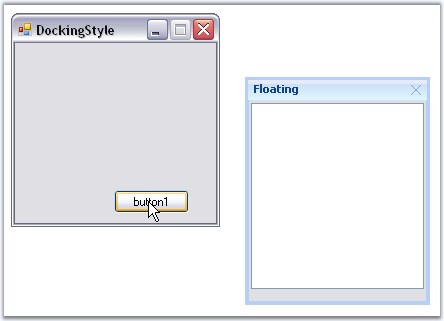
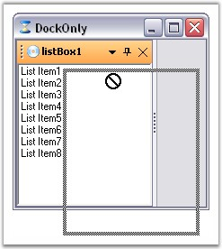

::: {style="DISPLAY: none"}
{#d2h_url_template}{#d2h_package_url style="WIDTH: 0px; DISPLAY: none; HEIGHT: 0px"}
:::

:::: {.d2h_secondary_topic style="PADDING-BOTTOM: 10pt; MARGIN: 0pt; PADDING-LEFT: 0pt; PADDING-RIGHT: 0pt; PADDING-TOP: 0pt"}
##### Floating {#floating style="tab-stops: 0pt"}

[]{#p49}[]{style="COLOR: #15428b"} 

Floating a Control

[]{style="COLOR: #15428b"} 

The FloatControl method enables the end users to float a particular control. Using this method, we can float a single control even if it is tabbed with many controls.

[]{style="COLOR: #15428b"} 

+-------------------------------------------------------------------------------------------------------------------------------------------------------------------------------------------------------------------------------------------------+
| **[\[C#\]]{style="FONT-FAMILY: 'Courier New'; COLOR: black"}**                                                                                                                                                                                  |
|                                                                                                                                                                                                                                                 |
| []{style="FONT-FAMILY: 'Courier New'; COLOR: green"}                                                                                                                                                                                            |
|                                                                                                                                                                                                                                                 |
| [Rectangle rcfrm = [this]{style="COLOR: blue"}.Bounds;]{style="FONT-FAMILY: 'Courier New'"}                                                                                                                                                     |
|                                                                                                                                                                                                                                                 |
| [this]{style="FONT-FAMILY: 'Courier New'; COLOR: blue"}[.dockingManager.FloatControl([this]{style="COLOR: blue"}.listBox1, [new]{style="COLOR: blue"} Rectangle(rcfrm.Right+25,rcfrm.Bottom-150,175,200));]{style="FONT-FAMILY: 'Courier New'"} |
+-------------------------------------------------------------------------------------------------------------------------------------------------------------------------------------------------------------------------------------------------+

[]{style="COLOR: #15428b"} 

+--------------------------------------------------------------------------------------------------------------------------------------------------------------------------------------------------------------------------------------------+
| **[\[VB.NET\]]{style="FONT-FAMILY: 'Courier New'; COLOR: black"}**                                                                                                                                                                         |
|                                                                                                                                                                                                                                            |
| []{style="COLOR: #15428b"}                                                                                                                                                                                                                 |
|                                                                                                                                                                                                                                            |
| [Dim]{style="FONT-FAMILY: 'Courier New'; COLOR: blue"}[ rcfrm [As]{style="COLOR: blue"} Rectangle = [Me]{style="COLOR: blue"}.Bounds]{style="FONT-FAMILY: 'Courier New'"}                                                                  |
|                                                                                                                                                                                                                                            |
| [Me]{style="FONT-FAMILY: 'Courier New'; COLOR: blue"}[.dockingManager.FloatControl([Me]{style="COLOR: blue"}.listBox1, [New]{style="COLOR: blue"} Rectangle(rcfrm.Right+25,rcfrm.Bottom-150,175,200))]{style="FONT-FAMILY: 'Courier New'"} |
+--------------------------------------------------------------------------------------------------------------------------------------------------------------------------------------------------------------------------------------------+

**[]{style="COLOR: #15428b"}** 

{border="0"}

**[]{style="COLOR: #15428b"}** 

Figure 50: DockedControl set to Float

**[]{style="COLOR: #15428b"}** 

DisallowFloating

[]{style="COLOR: #15428b"} 

By enabling the **DisallowFloating** property, a control can be dragged and redocked to the host form, but cannot be floated.

[]{style="COLOR: #15428b"} 

::: {align="center"}
  ------------------------- -----------------------------------------------------------------------------------------------
  DockingManager Property   Description
  DisallowFloating          Property which sets value indicating whether the docked controls are allowed to float or not.
  ------------------------- -----------------------------------------------------------------------------------------------
:::

[]{style="COLOR: #15428b"} 

+---------------------------------------------------------------------------------------------------------------------------------------------------------------+
| **[\[C#\]]{style="FONT-FAMILY: 'Courier New'; COLOR: black"}**                                                                                                |
|                                                                                                                                                               |
| []{style="FONT-FAMILY: 'Courier New'; COLOR: green"}                                                                                                          |
|                                                                                                                                                               |
| [this]{style="FONT-FAMILY: 'Courier New'; COLOR: blue"}[.dockingManager1.DisallowFloating = [true]{style="COLOR: blue"};]{style="FONT-FAMILY: 'Courier New'"} |
+---------------------------------------------------------------------------------------------------------------------------------------------------------------+

[]{style="COLOR: #15428b"} 

+------------------------------------------------------------------------------------------------------------------------------------------------------------+
| **[\[VB.NET\]]{style="FONT-FAMILY: 'Courier New'; COLOR: black"}**                                                                                         |
|                                                                                                                                                            |
| []{style="COLOR: #15428b"}                                                                                                                                 |
|                                                                                                                                                            |
| [Me]{style="FONT-FAMILY: 'Courier New'; COLOR: blue"}[.dockingManager1.DisallowFloating = [True]{style="COLOR: blue"}]{style="FONT-FAMILY: 'Courier New'"} |
+------------------------------------------------------------------------------------------------------------------------------------------------------------+

[]{style="COLOR: #15428b"} 

{border="0"}

[]{style="COLOR: #15428b"} 

Figure 51: DragProviderStyle=\"Standard\" FloatingOnly = \"True\"

**[]{style="COLOR: #15428b"}** 

A sample which demonstrates DisallowFloating property is available in the below sample installation path.

 

..My Documents\\Syncfusion\\EssentialStudio\\***Version Number***\\Windows\\Tools.Windows\\Samples\\2.0\\Docking Package\\WindowFill

**[]{style="COLOR: #15428b"}** 

Floating State to Docking State and Vice Versa

**[]{style="COLOR: #15428b"}** 

Setting **EnableDoubleClickOnCaption** property to true, lets you dock or float the control by just double clicking on the captions of the docked control. By default it is true.

[]{style="COLOR: #15428b"} 

See Also

[]{style="COLOR: #15428b"} 

[Nested Docking and Floating]{.UGHyperlink}[, ]{.UGHyperlink}[How to make a docked control Floating Only?,]{.UGHyperlink}[]{.UGHyperlink}

[How to float a single control even if it is tabbed to many controls?]{.UGHyperlink}[, ]{.UGHyperlink}[How to find out whether a docked control is floating or not?,]{.UGHyperlink}[]{.UGHyperlink}

[How to get individual floating controls properties?]{.UGHyperlink}[]{.UGHyperlink}

[]{#related-topics}
::::
