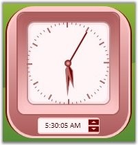
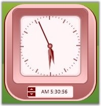

::: {style="DISPLAY: none"}
{#d2h_url_template}{#d2h_package_url style="WIDTH: 0px; DISPLAY: none; HEIGHT: 0px"}
:::

:::: {.d2h_secondary_topic style="PADDING-BOTTOM: 10pt; MARGIN: 0pt; PADDING-LEFT: 0pt; PADDING-RIGHT: 0pt; PADDING-TOP: 0pt"}
#### Flow Direction {#flow-direction style="tab-stops: 0pt"}

Flow Direction of the Clock control is set by using the **FlowDirection** property.

 

::: {align="center"}
+-----------------------------------+---------------------------------------------------------------------------------------+
| Property                          | Description                                                                           |
+-----------------------------------+---------------------------------------------------------------------------------------+
| FlowDirection                     | Sets the flow direction for the Clock control. The options provided are as follows.   |
|                                   |                                                                                       |
|                                   | []{style="FONT-FAMILY: 'Trebuchet MS','sans-serif'; COLOR: #15428b; FONT-SIZE: 9pt"}  |
|                                   |                                                                                       |
|                                   | [·      ]{style="FONT-FAMILY: Symbol"}LeftToRight                                     |
|                                   |                                                                                       |
|                                   | [·      ]{style="FONT-FAMILY: Symbol"}RightToLeft                                     |
+-----------------------------------+---------------------------------------------------------------------------------------+
:::

[]{style="FONT-FAMILY: 'Trebuchet MS','sans-serif'; COLOR: #15428b; FONT-SIZE: 9pt"} 

+-------------------------------------------------------------------------------------------------------------------------------------+
| **[\[C#\]]{style="FONT-FAMILY: 'Courier New'; COLOR: black; FONT-SIZE: 9pt"}**                                                      |
|                                                                                                                                     |
| []{style="FONT-FAMILY: 'Courier New'; COLOR: blue; FONT-SIZE: 9pt"}                                                                 |
|                                                                                                                                     |
| [// Flow direction from left to Right.]{style="FONT-FAMILY: 'Courier New'; COLOR: green; FONT-SIZE: 9pt"}                           |
|                                                                                                                                     |
| [ctlClock.FlowDirection = [FlowDirection]{style="COLOR: #2b91af"}.LeftToRight;]{style="FONT-FAMILY: 'Courier New'; FONT-SIZE: 9pt"} |
|                                                                                                                                     |
| []{style="FONT-FAMILY: 'Courier New'; FONT-SIZE: 9pt"}                                                                              |
|                                                                                                                                     |
| [// Flow direction from Right to Left.]{style="FONT-FAMILY: 'Courier New'; COLOR: green; FONT-SIZE: 9pt"}                           |
|                                                                                                                                     |
| [ctlClock.FlowDirection = [FlowDirection]{style="COLOR: #2b91af"}.RightToLeft;]{style="FONT-FAMILY: 'Courier New'; FONT-SIZE: 9pt"} |
+-------------------------------------------------------------------------------------------------------------------------------------+

[]{style="FONT-FAMILY: 'Trebuchet MS','sans-serif'; COLOR: #15428b; FONT-SIZE: 9pt"} 

{border="0"}

Figure 146: FlowDirection = \"LeftToRight\"

[]{style="FONT-FAMILY: 'Trebuchet MS','sans-serif'; COLOR: #15428b; FONT-SIZE: 9pt"} 

{border="0"}

Figure 147: FlowDirection = \"RightToLeft\"

 

[]{#p75} 

[]{#related-topics}
::::
