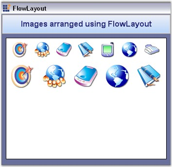

::: {style="DISPLAY: none"}
{#d2h_url_template}{#d2h_package_url style="WIDTH: 0px; DISPLAY: none; HEIGHT: 0px"}
:::

::: {.d2h_secondary_topic style="PADDING-BOTTOM: 10pt; MARGIN: 0pt; PADDING-LEFT: 0pt; PADDING-RIGHT: 0pt; PADDING-TOP: 0pt"}
#### FlowLayout {#flowlayout style="tab-stops: 0pt"}

[]{style="COLOR: #15428b"} 

**FlowLayout** is a Layout Manager which allows us to arrange the Child components horizontally or vertically in a specific order, based on the settings. FlowLayout is one of the most commonly used Layout Managers. Deriving from the LayoutManager class, the FlowLayout component was created to support simple horizontal and vertical flow and complex constraint-based FlowLayouts.

 

In its simplest form, this Layout Manager can be used to automatically arrange the Child components in one or more rows, as shown below.

[]{style="COLOR: #15428b"} 

{border="0"}

[]{style="COLOR: #15428b"} 

Figure 668: Horizontally Aligned Labels

[]{style="COLOR: #15428b"} 

In it\'s most flexible and powerful mode, a FlowLayout automatically realigns the controls by adjusting their sizes and location based on the current font size, form size and localization settings, helping you to create efficient form layouts.

 

FlowLayout uses the preferred size of a Child component in it\'s layout logic. The minimum size is ignored for the most part, except in the constraint-based scenario discussed below.

 

The FlowLayout features can be split based on simple and constraint-based scenarios.

 

In a **simple scenario**, the Layout Manager does not expect any constraints to be associated with the Child components. In a **constraint-based** **scenario**, you specify constraints for each Child component over the layout logic.

 

The various features are discussed in the topics given below.

 

[]{style="FONT-FAMILY: 'Verdana','sans-serif'; COLOR: black; FONT-SIZE: 8pt"} 

A Sample which demonstrates the FlowLayout is available in the below sample installation path.

[]{style="COLOR: #15428b"} 

..My Documents\\Syncfusion\\EssentialStudio\\***Version Number***\\Windows\\Tools.Windows\\Samples\\2.0\\Layout Manager Package\\LayoutManagers

 

See Also

[]{style="COLOR: #15428b"} 

[Creating a Simple Layout]{.UGHyperlink}[]{.UGHyperlink}

More:

[ ]{#related-topics}

[{border="0" align="absMiddle"}Configuring FlowLayout](ms-xhelp:///?Id=b424ecab-030b-4da8-9d04-e02c9fa498c9){style="TEXT-DECORATION: none"}

[{border="0" align="absMiddle"}Configuring Child Controls](ms-xhelp:///?Id=367270d7-dbfd-4836-9b29-b625310365b3){style="TEXT-DECORATION: none"}

[{border="0" align="absMiddle"}Centering the Child Controls Horizontally and Vertically](ms-xhelp:///?Id=bbb4f09a-c3a1-4b12-bee7-a770b3a612f7){style="TEXT-DECORATION: none"}

[{border="0" align="absMiddle"}Enabling Constrained FlowLayout on a Container](ms-xhelp:///?Id=1104a628-148f-473b-9424-99e56f2fc8ea){style="TEXT-DECORATION: none"}

[{border="0" align="absMiddle"}Rearranging the Controls laid out by FlowLayout](ms-xhelp:///?Id=7dbbf78d-ca0b-4afa-94ff-1bc9d31ded70){style="TEXT-DECORATION: none"}
:::
