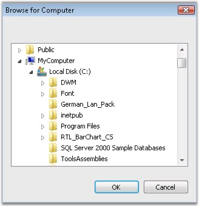

::: {style="DISPLAY: none"}
{#d2h_url_template}{#d2h_package_url style="WIDTH: 0px; DISPLAY: none; HEIGHT: 0px"}
:::

::: {.d2h_secondary_topic style="PADDING-BOTTOM: 10pt; MARGIN: 0pt; PADDING-LEFT: 0pt; PADDING-RIGHT: 0pt; PADDING-TOP: 0pt"}
#### FolderBrowser {#folderbrowser style="tab-stops: 0pt"}

[]{style="COLOR: #15428b"} 

The Essential Tools **FolderBrowser** component provides a convenient and easy to use object oriented wrapper for the **Win32 Shell Folder Browser API**. This class completely abstracts the intricacies involved in using the various complex Shell API functions, structures and callback routines required for working with the Windows Folder Selection Dialog and allows Windows Forms developers to work with .NET-centric properties, events and methods.

[]{style="COLOR: #15428b"} 

{border="0"}

Figure 428: FolderBrowser Control

[]{style="COLOR: #15428b"} 

See Also

[]{style="COLOR: #15428b"} 

More:

[ ]{#related-topics}

[{border="0" align="absMiddle"}Features](ms-xhelp:///?Id=9d094592-98c2-4705-8d68-da4319977efa){style="TEXT-DECORATION: none"}

[{border="0" align="absMiddle"}Creating FolderBrowser](ms-xhelp:///?Id=bd4b21cd-a1e5-42f8-9ef6-18f258f9bcf1){style="TEXT-DECORATION: none"}

[{border="0" align="absMiddle"}Concepts and Features](ms-xhelp:///?Id=98464778-10e1-4956-9381-8fd5c66d007d){style="TEXT-DECORATION: none"}

[{border="0" align="absMiddle"}FolderBrowser Event](ms-xhelp:///?Id=b14c6651-ad40-44e9-ba7d-2ee0920265d0){style="TEXT-DECORATION: none"}

[{border="0" align="absMiddle"}Frequently Asked Questions](ms-xhelp:///?Id=6c22019d-ec9f-41e2-8b8b-359e86361846){style="TEXT-DECORATION: none"}
:::
