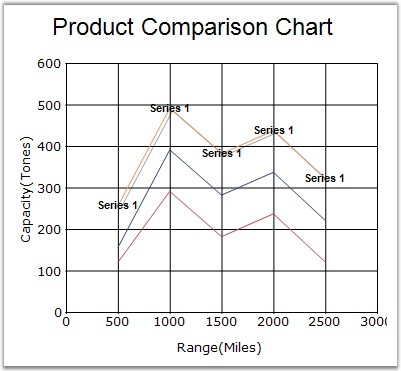

::: {style="DISPLAY: none"}
{#d2h_url_template}{#d2h_package_url style="WIDTH: 0px; DISPLAY: none; HEIGHT: 0px"}
:::

:::: {.d2h_secondary_topic style="PADDING-BOTTOM: 10pt; MARGIN: 0pt; PADDING-LEFT: 0pt; PADDING-RIGHT: 0pt; PADDING-TOP: 0pt"}
#### Font {#font style="tab-stops: 0pt"}

 

Gets or sets a font object used for drawing the data point labels.

 

::: {align="center"}
+-------------------------------------+----------------------------------------------------------------------------+
|                                                                                                                  |
|                                                                                                                  |
| Details                                                                                                          |
+-------------------------------------+----------------------------------------------------------------------------+
|                                     |                                                                            |
|                                     |                                                                            |
| **Possible Values**                 | Specifying font face, size and style.                                      |
+-------------------------------------+----------------------------------------------------------------------------+
|                                     |                                                                            |
|                                     |                                                                            |
| **Default Value    **               | [·      ]{style="FONT-FAMILY: Symbol"}**FontStyle** - Regular              |
|                                     |                                                                            |
|                                     | [·      ]{style="FONT-FAMILY: Symbol"}**Face Name** - MicroSoft Sans Serif |
|                                     |                                                                            |
|                                     | [·      ]{style="FONT-FAMILY: Symbol"}**Size** -  8.25                     |
+-------------------------------------+----------------------------------------------------------------------------+
|                                     |                                                                            |
|                                     |                                                                            |
| **2D / 3D Limitations**             | No                                                                         |
+-------------------------------------+----------------------------------------------------------------------------+
|                                     |                                                                            |
|                                     |                                                                            |
| **Applies to Chart Element**        | All series and points                                                      |
+-------------------------------------+----------------------------------------------------------------------------+
|                                     |                                                                            |
|                                     |                                                                            |
| **Applies to Chart Types**          | All Chart types                                                            |
+-------------------------------------+----------------------------------------------------------------------------+
:::

 

Here is some sample code.

 

**Series Wide Setting**

 

+-----------------------------------------------------------------------------------------------------------------------------------------------------------------------------------+
| **[\[C#\]]{style="FONT-FAMILY: 'Courier New'; COLOR: black"}**                                                                                                                    |
|                                                                                                                                                                                   |
| **[]{style="FONT-FAMILY: 'Courier New'; COLOR: black"}**                                                                                                                          |
|                                                                                                                                                                                   |
| [this]{style="FONT-FAMILY: 'Courier New'; COLOR: blue"}[.chartControl1.Series\[0\].Style.DisplayText = [true]{style="COLOR: blue"}; ]{style="FONT-FAMILY: 'Courier New'"}         |
|                                                                                                                                                                                   |
| [this]{style="FONT-FAMILY: 'Courier New'; COLOR: blue"}[.chartControl1.Series\[0\].Style.Font.Bold = [true]{style="COLOR: blue"};]{style="FONT-FAMILY: 'Courier New'"}            |
|                                                                                                                                                                                   |
| [this]{style="FONT-FAMILY: 'Courier New'; COLOR: blue"}[.chartControl1.Series\[0\].Style.Font.Facename = [\"Arial\"]{style="COLOR: maroon"};]{style="FONT-FAMILY: 'Courier New'"} |
|                                                                                                                                                                                   |
| [this]{style="FONT-FAMILY: 'Courier New'; COLOR: blue"}[.chartControl1.Series\[0\].Style.Text = [\"Series 1\"]{style="COLOR: maroon"};]{style="FONT-FAMILY: 'Courier New'"}       |
+-----------------------------------------------------------------------------------------------------------------------------------------------------------------------------------+

 

+----------------------------------------------------------------------------------------------------------------------------------------------------------------------------------------------+
| **[\[VB.NET\]]{style="FONT-FAMILY: 'Courier New'; COLOR: black"}**                                                                                                                           |
|                                                                                                                                                                                              |
| **[]{style="FONT-FAMILY: 'Courier New'; COLOR: black"}**                                                                                                                                     |
|                                                                                                                                                                                              |
| [Me]{style="FONT-FAMILY: 'Courier New'; COLOR: blue"}[.chartControl1.Series(0).Style.DisplayText =[ ]{style="COLOR: maroon"}[True]{style="COLOR: blue"}]{style="FONT-FAMILY: 'Courier New'"} |
|                                                                                                                                                                                              |
| [Me]{style="FONT-FAMILY: 'Courier New'; COLOR: blue"}[.chartControl1.Series(0).Style.Font.Bold =[ ]{style="COLOR: maroon"}[True]{style="COLOR: blue"}]{style="FONT-FAMILY: 'Courier New'"}   |
|                                                                                                                                                                                              |
| [Me]{style="FONT-FAMILY: 'Courier New'; COLOR: blue"}[.chartControl1.Series(0).Style.Font.Facename = [\"Arial\"]{style="COLOR: maroon"}]{style="FONT-FAMILY: 'Courier New'"}                 |
|                                                                                                                                                                                              |
| [Me]{style="FONT-FAMILY: 'Courier New'; COLOR: blue"}[.chartControl1.Series(0).Style.Text = [\"Series 1\"]{style="COLOR: #993300"}]{style="FONT-FAMILY: 'Courier New'"}                      |
+----------------------------------------------------------------------------------------------------------------------------------------------------------------------------------------------+

 

**Specific Data Point Setting**

 

+-----------------------------------------------------------------------------------------------------------------------------------------------------------------------------------------+
| **[\[C#\]]{style="FONT-FAMILY: 'Courier New'; COLOR: black"}**                                                                                                                          |
|                                                                                                                                                                                         |
| **[]{style="FONT-FAMILY: 'Courier New'; COLOR: black"}**                                                                                                                                |
|                                                                                                                                                                                         |
| [//font style set for first data point]{style="FONT-FAMILY: 'Courier New'; COLOR: green"}                                                                                               |
|                                                                                                                                                                                         |
| [this]{style="FONT-FAMILY: 'Courier New'; COLOR: blue"}[.chartControl1.Series\[0\].Styles\[0\].Font.Bold = [true]{style="COLOR: blue"};]{style="FONT-FAMILY: 'Courier New'"}            |
|                                                                                                                                                                                         |
| [this]{style="FONT-FAMILY: 'Courier New'; COLOR: blue"}[.chartControl1.Series\[0\].Styles\[0\].Font.Facename = [\"Arial\"]{style="COLOR: maroon"};]{style="FONT-FAMILY: 'Courier New'"} |
+-----------------------------------------------------------------------------------------------------------------------------------------------------------------------------------------+

 

+------------------------------------------------------------------------------------------------------------------------------------------------------------------------------------------------+
| **[\[VB.NET\]]{style="FONT-FAMILY: 'Courier New'; COLOR: black"}**                                                                                                                             |
|                                                                                                                                                                                                |
| **[]{style="FONT-FAMILY: 'Courier New'; COLOR: black"}**                                                                                                                                       |
|                                                                                                                                                                                                |
| [\'font style set for first data point]{style="FONT-FAMILY: 'Courier New'; COLOR: green"}                                                                                                      |
|                                                                                                                                                                                                |
| [Me]{style="FONT-FAMILY: 'Courier New'; COLOR: blue"}[.chartControl1.Series(0).Styles(0).Font.Bold =[ ]{style="COLOR: maroon"}[True]{style="COLOR: blue"}]{style="FONT-FAMILY: 'Courier New'"} |
|                                                                                                                                                                                                |
| [Me]{style="FONT-FAMILY: 'Courier New'; COLOR: blue"}[.chartControl1.Series(0).Styles(0).Font.Facename = [\"Arial\"]{style="COLOR: maroon"}]{style="FONT-FAMILY: 'Courier New'"}               |
+------------------------------------------------------------------------------------------------------------------------------------------------------------------------------------------------+

 

{border="0"}

 

Figure 137**[: Column Chart with Text]{style="FONT-STYLE: normal"}**

 

See Also

 

[Chart Types]{.UGHyperlink}[]{.UGHyperlink}

[]{#p106} 

 

[]{#related-topics}
::::
