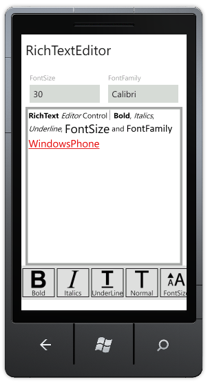

::: {style="DISPLAY: none"}
{#d2h_url_template}{#d2h_package_url style="WIDTH: 0px; DISPLAY: none; HEIGHT: 0px"}
:::

::: {.d2h_secondary_topic style="PADDING-BOTTOM: 10pt; MARGIN: 0pt; PADDING-LEFT: 0pt; PADDING-RIGHT: 0pt; PADDING-TOP: 0pt"}
##### Font Color {#font-color style="tab-stops: 0pt"}

 

+--------------------------------------------------------------------------------------------------------------------------------------------------------------------------------+
| **[\[C#\]]{style="FONT-FAMILY: Consolas"}[]{style="FONT-FAMILY: Consolas; COLOR: #2b91af; FONT-SIZE: 9.5pt"}**                                                                 |
|                                                                                                                                                                                |
| []{style="FONT-FAMILY: Consolas; COLOR: #2b91af; FONT-SIZE: 9.5pt"}                                                                                                            |
|                                                                                                                                                                                |
| [RichEdit.ApplyFormatting([Formatting]{style="COLOR: #2b91af"}.Foreground, [Colors]{style="COLOR: #2b91af"}.Red.ToString());]{style="FONT-FAMILY: Consolas; FONT-SIZE: 9.5pt"} |
|                                                                                                                                                                                |
| []{style="FONT-FAMILY: Consolas; FONT-SIZE: 9.5pt"}                                                                                                                            |
+--------------------------------------------------------------------------------------------------------------------------------------------------------------------------------+

{border="0"}

         Figure 131: Formatted Text in RTE[]{style="COLOR: #c00000"}

 

[]{#related-topics}
:::
